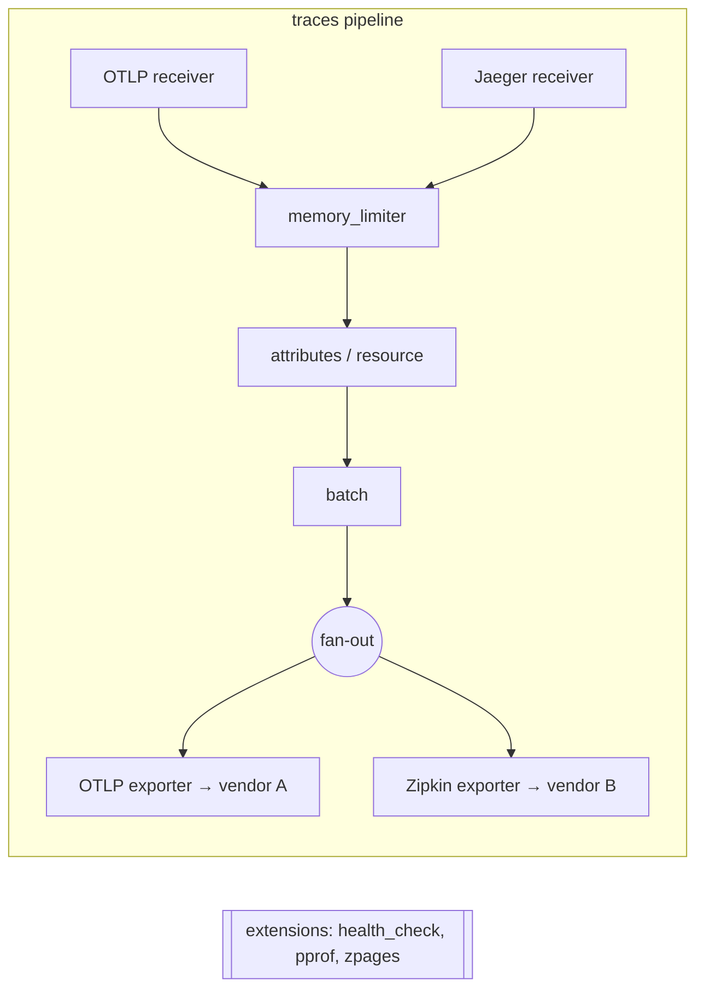
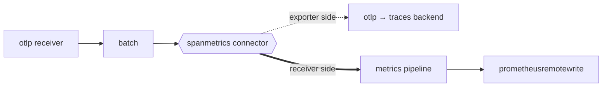
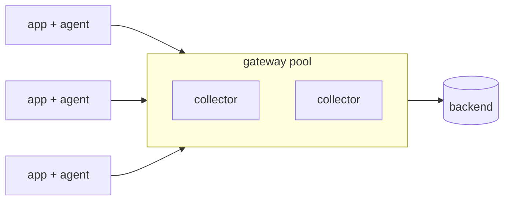
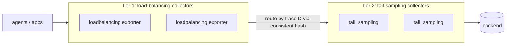

# OpenTelemetry Collector & Telemetry Pipelines

The OpenTelemetry Collector is a vendor-neutral proxy/agent that **receives, processes, and
exports** telemetry (traces, metrics, logs). It sits between your instrumented applications and
your observability backends, giving you one place to enforce policy — batching, sampling,
redaction, enrichment, routing — without changing or redeploying application code. This topic
covers how the Collector is wired (receivers → processors → exporters, plus connectors and
extensions), how pipelines are organized per signal, the two canonical deployment shapes
(agent vs gateway), and the reliability/scaling mechanics interviewers probe.

> [!INTERVIEW]
> The single most common Collector question is *"why run a Collector at all instead of exporting
> straight to the backend?"* Have the four-word answer ready: **decouple, batch, enrich, control**
> (plus reduce egress and centralize secrets). The second most common is the tail-sampling
> gotcha: tail sampling needs the **whole** trace on **one** collector, which forces a
> trace-ID-aware load-balancing tier.

Related topics: `opentelemetry-signals-and-instrumentation` (the SDK/API side that *produces* the
OTLP the Collector consumes), `prometheus-architecture-and-scraping` (scrape model the Collector's
`prometheusreceiver` mirrors), and `sampling-cardinality-and-telemetry-cost-management` (the
cost/sampling policy the Collector enforces).

## Why run a Collector

Applications *can* export OTLP directly to a backend (SaaS or self-hosted). A Collector is an
optional but strongly recommended intermediary. The value:

- **Decouple app from backend.** The app only speaks OTLP to `localhost`/a known endpoint. You can
  swap backends, add a second backend, change sampling, or rotate credentials by editing Collector
  config — no app redeploy. This is the biggest architectural win: instrumentation lifecycle is
  decoupled from vendor/backend lifecycle.
- **Offload work from the app process.** Batching, retry, compression, and queueing happen in the
  Collector, not in the request-serving process, so a slow backend does not add latency or memory
  pressure to your service.
- **Reduce egress and cost.** Batch + compress once at the edge; drop/sample noisy data before it
  crosses a network/region boundary you pay for.
- **Central policy.** PII redaction, attribute enrichment (add `k8s.*`, `cloud.region`), filtering,
  and tail-based sampling are applied uniformly and are auditable in one config, instead of relying
  on every service getting it right.
- **Central secrets.** The backend API key lives in the Collector, not baked into every service.
- **Protocol/format translation.** Ingest Prometheus, Jaeger, Zipkin, StatsD, Fluent Forward, etc.,
  and normalize to OTLP; fan out to backends that speak different protocols.

> [!TIP]
> "Reduce egress" and "central secrets" are the answers that make you sound like you have run this
> in production. Direct-to-backend export is fine for a demo or a tiny service; at scale the
> Collector is table stakes.

## Collector architecture: receivers, processors, exporters

The Collector is built from four component *kinds* plus **extensions**. Data flows left to right:



- **Receivers** — how data gets *in*. Push-based (they listen on a port, e.g. `otlp`, `jaeger`,
  `zipkin`, `fluentforward`) or pull-based (they scrape, e.g. `prometheus`, `hostmetrics`,
  `kubeletstats`). One receiver instance can feed multiple pipelines.
- **Processors** — run **in the order listed** in the pipeline. They transform, drop, enrich, or
  batch data. Each pipeline gets its **own** processor instances even if two pipelines reference the
  same config key, so ordering and state are per-pipeline.
- **Exporters** — how data gets *out* (`otlp`, `otlphttp`, `prometheusremotewrite`, `debug`,
  vendor exporters). The last processor fans out a copy of each item to **every** exporter in the
  pipeline.
- **Connectors** — a component that is an **exporter in one pipeline and a receiver in another**,
  linking pipelines together (see below).
- **Extensions** — capabilities that are *not* part of the data path: `health_check` (liveness),
  `pprof` (profiling), `zpages` (in-process debug pages), `basicauth`/`oauth2client` (auth),
  `file_storage` (persistent queue). They observe/support the Collector but never touch telemetry.

> [!WARNING]
> A receiver shared across pipelines is a single instance feeding a synchronous fan-out. If one
> pipeline's processor **blocks** (e.g. a full sending queue applying backpressure), the other
> pipelines on that receiver are blocked too. Isolate high-risk paths on separate receivers/ports
> if you need independence.

## Pipelines per signal

A **pipeline** is a named path `receivers → processors → exporters` for **one signal type**:
`traces`, `metrics`, or `logs`. Every component in a pipeline must support that signal — you cannot
put a metrics-only processor in a traces pipeline (the Collector errors at config load with
`ErrSignalNotSupported`). You can run **multiple pipelines of the same type** (e.g. `traces` and
`traces/tailsampled`) to apply different processing to different flows.

```yaml
service:
  extensions: [health_check, pprof]
  pipelines:
    traces:
      receivers:  [otlp]
      processors: [memory_limiter, batch]
      exporters:  [otlp/tempo]
    metrics:
      receivers:  [otlp, prometheus]
      processors: [memory_limiter, batch]
      exporters:  [prometheusremotewrite]
    logs:
      receivers:  [otlp]
      processors: [memory_limiter, batch]
      exporters:  [otlphttp/loki]
```

Note the `service::pipelines` block is what *activates* components — a receiver/processor/exporter
defined in config but not referenced by any pipeline is **not** instantiated.

## Receivers and OTLP in/out

The **OTLP receiver** is the canonical entry point. OTLP (OpenTelemetry Protocol) has two
transports:

- **gRPC** on port **4317** (`otlp` receiver `protocols: grpc`) — the default for SDK exporters;
  efficient, streaming, HTTP/2.
- **HTTP/protobuf** (and JSON) on port **4318** (`protocols: http`) — for environments where gRPC
  is awkward (browsers, some proxies).

OTLP is a protobuf schema (`ExportTraceServiceRequest`, etc.) carrying **Resource** (the entity
producing telemetry: `service.name`, `k8s.pod.name`), **Scope** (the instrumentation library), and
the signal data. The Collector both **receives** OTLP (from SDKs or upstream collectors) and
**exports** OTLP (to backends or a downstream gateway) — collectors chain naturally over OTLP.

Pull-based receivers invert control: `prometheusreceiver` scrapes `/metrics` endpoints on an
interval and can consume a Prometheus `scrape_config` almost verbatim, letting the Collector
replace a Prometheus server's scraping role and remote-write onward.

## Batching, memory_limiter, and ordering

Two processors appear in almost every production pipeline, and **their order matters**:

- **`memory_limiter`** — periodically checks the Collector's memory. At a **soft limit** it starts
  **refusing** incoming data (returning errors that apply backpressure to receivers/clients); above
  a **hard limit** it also forces Go GC. It is the Collector's OOM guardrail. Docs say put it
  **first** so backpressure reaches receivers before memory is already committed to batches.
- **`batch`** — groups telemetry into larger payloads by size (`send_batch_size`) and/or time
  (`timeout`, e.g. `200ms`). Batching drastically improves compression ratio and throughput and
  reduces the number of outbound requests. It should come **after** `memory_limiter` (and after
  sampling/filtering, so you do not batch data you are about to drop).

Recommended baseline order: `memory_limiter` → (sampling/filter/transform) → `attributes/resource`
→ `batch`. Put `batch` late so it batches the *final* shape of data.

> [!KEY-TAKEAWAY]
> `memory_limiter` first (protect the process), `batch` last (ship efficiently). Batching before
> dropping wastes CPU on data you discard; batching before `memory_limiter` means memory is already
> consumed before the guardrail can push back.

## Attribute, resource, and redaction processors

These enrich and sanitize telemetry centrally:

- **`resourceprocessor`** — modify **resource** attributes (the entity: service/host/pod). Common
  use: `insert`/`upsert` `deployment.environment=prod`, `cloud.region`.
- **`attributesprocessor`** — modify **span/metric/log** attributes: `insert`, `update`, `upsert`,
  `delete`, `hash`, `extract`. Common use: hash or delete PII (`user.email`), drop high-cardinality
  keys.
- **`redactionprocessor`** — allowlist-based scrubbing: keep only approved attribute keys and mask
  values matching patterns (credit cards, etc.). Stronger default-deny posture than `attributes`.
- **`k8sattributesprocessor`** — auto-enrich with Kubernetes metadata (`k8s.pod.name`,
  `k8s.namespace.name`, labels) by correlating source IP with the k8s API. This is why you often
  run the Collector as a DaemonSet agent — it can see the pod that sent the data.

Doing redaction/enrichment in the Collector means it is uniform and auditable, and PII can be
stripped **before** it ever leaves your trust boundary for a SaaS backend.

## Filtering and transform with OTTL

The **OpenTelemetry Transformation Language (OTTL)** is a small statement language used by the
`transformprocessor` and `filterprocessor` (and others) to manipulate telemetry by
path expressions and functions.

- **`filterprocessor`** — drop data matching a condition. Example: drop spans for health checks, or
  drop debug logs.
- **`transformprocessor`** — mutate data with OTTL statements: set/delete attributes, change
  severity, convert units, aggregate.

```yaml
processors:
  filter/health:
    error_mode: ignore
    traces:
      span:
        - 'attributes["http.route"] == "/healthz"'   # drop matching spans
  transform/pii:
    trace_statements:
      - context: span
        statements:
          - set(attributes["user.email"], "REDACTED") where attributes["user.email"] != nil
          - delete_key(attributes, "http.request.header.authorization")
```

OTTL contexts (`span`, `spanevent`, `metric`, `datapoint`, `log`, `resource`, `scope`) scope what
each statement can see and mutate. It is the modern, expressive replacement for many one-off
processors.

## Fan-out to multiple backends

Because the last processor sends a **copy to every exporter** in a pipeline, sending the same data
to two backends is trivial — list both exporters:

```yaml
service:
  pipelines:
    traces:
      receivers:  [otlp]
      processors: [batch]
      exporters:  [otlp/vendor-a, otlp/vendor-b, debug]
```

To send *different* data to different backends (e.g. all traces to A but only errors to B), use
**separate pipelines** with different processors, or a **routing connector**. Fan-out enables
migrations (dual-write to old + new backend), tee-ing to a cheap archive, and splitting by team.

## Connectors

A **connector** bridges two pipelines: it acts as an **exporter** at the end of one pipeline and a
**receiver** at the start of another. This lets you derive new telemetry or route between pipelines
without leaving the Collector. Key connectors:

- **`spanmetrics`** — consumes **traces**, produces **metrics** (RED metrics: request rate, error
  rate, duration histograms per service/operation). Exporter side sits in a traces pipeline;
  receiver side feeds a metrics pipeline.
- **`routing`** — reads an attribute and routes to different downstream pipelines (e.g. by tenant
  or `deployment.environment`).
- **`forward`** — plumbing to merge/split pipelines.
- **`count`** — counts spans/logs/metrics into a metric.



```yaml
connectors:
  spanmetrics: {}
service:
  pipelines:
    traces:
      receivers: [otlp]
      exporters: [otlp/tempo, spanmetrics]     # connector as exporter
    metrics:
      receivers: [spanmetrics]                 # connector as receiver
      exporters: [prometheusremotewrite]
```

## Agent vs gateway deployment

There are two canonical deployment topologies, often combined:

| | **Agent** (collector) | **Gateway** (collector) |
|---|---|---|
| Location | Same host/node as the app — sidecar or DaemonSet | Standalone service, a horizontally-scaled pool behind a load balancer |
| Talks to | Local apps (localhost OTLP) | Agents or apps across the fleet |
| Strengths | Local enrichment (host/k8s metadata), offloads app, no network hop to collect | Central policy, aggregation, tail sampling, fewer backend connections/egress points |
| Scaling | Scales with nodes (one per node) | Scale independently of app fleet |



Typical production shape: **agent (DaemonSet)** enriches with node/pod metadata and forwards OTLP
to a **gateway pool** that batches, samples, and exports to backends. The gateway gives you a
central control point and a small, stable set of backend connections.

> [!TIP]
> Agents are great at **local context** (k8s attributes, host metrics) the gateway can't see.
> Gateways are great at **global decisions** (tail sampling, quota, routing) an agent can't make
> alone. Use both; don't force one to do the other's job.

## Tail-based sampling in the Collector

Sampling comes in two flavors (see also `sampling-cardinality-and-telemetry-cost-management`):

- **Head sampling** — decide at the start of a trace, before you know the outcome (e.g. keep 10%).
  Usually done in the SDK, but the Collector can also head-sample via the `probabilistic_sampler`
  processor (useful when you don't control the SDK). Cheap, but you might discard the very trace
  that errored.
- **Tail sampling** — decide **after** the trace completes, so you can keep traces that are
  slow or errored and drop boring fast ones. Done in the Collector via the **`tail_sampling`
  processor** with policies (`status_code`, `latency`, `probabilistic`, `string_attribute`, ...).

The catch: to decide on a whole trace, **all spans of that trace must arrive at the same Collector
instance** that buffers them. In a horizontally-scaled gateway pool this is not automatic — spans
of one trace can hit different collectors. The solution is a **two-tier gateway**:



Tier 1 runs the **`loadbalancing` exporter** with `routing_key: traceID`, which **consistently
hashes each trace ID to one tier-2 collector**, guaranteeing every span of a trace lands on the
same tail-sampling instance. Tier 2 runs `tail_sampling`. Because tail sampling **buffers spans
until the trace is complete** (a decision wait window), it costs memory and adds latency to the
export of that trace — size the buffer and window carefully.

> [!WARNING]
> Running `tail_sampling` on a plain multi-replica gateway **without** a trace-ID load-balancing
> tier silently produces *broken/partial* sampling decisions, because each replica only sees a
> fragment of each trace. This is the classic tail-sampling interview trap.

## Reliability: queues, retries, and backpressure

Exporters ship with a **sending queue** and **retry** wrapper:

- **Sending queue** (`sending_queue`) — an in-memory (or, with the `file_storage` extension,
  **persistent**) buffer between the pipeline and the exporter. Decouples ingest from a slow/failing
  backend. When it fills, it applies **backpressure** (drops or blocks depending on config).
- **Retry** (`retry_on_failure`) — exponential backoff retry of failed export batches.
- **`memory_limiter`** — the upstream guardrail; when the queue backs up and memory climbs, the
  limiter refuses new data at the receiver, pushing backpressure to clients.

```yaml
exporters:
  otlp:
    endpoint: backend:4317
    sending_queue:
      enabled: true
      num_consumers: 10
      queue_size: 5000
      storage: file_storage      # persist across restarts (needs extension)
    retry_on_failure:
      enabled: true
      initial_interval: 5s
      max_elapsed_time: 300s
```

The chain of defense against a backend outage: **retry** (transient) → **queue** (absorb) →
**persistent queue** (survive restart) → **memory_limiter** (protect the process) → **drop**
(last resort). A pure in-memory queue loses data on crash; use `file_storage` for at-least-once
durability.

## Scaling the Collector

- **Agents** scale automatically with nodes (one per host/DaemonSet); each handles only its node's
  load, so they rarely need tuning beyond memory limits.
- **Gateways** scale **horizontally** behind a load balancer — they are mostly stateless, *except*
  when they hold state (tail sampling buffers, `groupbytrace`). Stateful gateways require the
  trace-ID load-balancing tier so scaling doesn't split traces.
- Tune **`num_consumers`** (export concurrency), **`queue_size`**, batch size, and
  **`GOMEMLIMIT`** (set to ~80% of the hard memory limit) alongside `memory_limiter`.
- Watch the Collector's **own** telemetry: `otelcol_exporter_send_failed_spans`,
  `otelcol_processor_dropped_spans`, `otelcol_exporter_queue_size` vs `queue_capacity`,
  `otelcol_processor_refused_*` (memory_limiter refusals). Rising refused/dropped/queue-full
  metrics mean you are under-provisioned or the backend is slow.

> [!KEY-TAKEAWAY]
> Stateless gateway components scale trivially; **stateful** ones (tail sampling, group-by-trace)
> force you to make traffic sticky by trace ID first. Always monitor the Collector itself —
> silent drops are the failure mode.

## Common follow-up questions

- **Q: Why not export directly from the SDK to the backend?** You can, but you lose central policy
  (sampling, redaction, routing), tie instrumentation to backend lifecycle, put batching/retry in
  the request path, and expose backend credentials in every service. Direct export is fine for
  small/demo setups; the Collector is the production default.
- **Q: What's the difference between a processor and a connector?** A processor stays within one
  pipeline and one signal. A connector links two pipelines — it's the exporter of one and the
  receiver of another — and can even change signal type (traces → metrics via `spanmetrics`).
- **Q: Where should `memory_limiter` and `batch` go?** `memory_limiter` first (so backpressure hits
  receivers before memory is committed), `batch` last (batch the final, post-sampling shape).
- **Q: Why can't I just add `tail_sampling` to my autoscaled gateway?** Because each replica sees
  only a fragment of each trace. You need a load-balancing tier routing by `traceID` so all spans of
  a trace reach one tail-sampling instance.
- **Q: Head vs tail sampling trade-off?** Head is cheap and stateless but blind to outcome (may drop
  the error). Tail is outcome-aware (keep errors/slow) but needs to buffer whole traces → memory,
  latency, and the load-balancing requirement.
- **Q: How do I send telemetry to two backends?** List both exporters in one pipeline (fan-out
  copies to each). For *different* subsets per backend, use separate pipelines or a routing
  connector.
- **Q: Agent or gateway?** Both. Agent for local enrichment/offload (k8s metadata, host metrics);
  gateway for aggregation, central policy, and tail sampling. Agents forward OTLP to the gateway.
- **Q: How do I avoid data loss when the backend is down?** Enable `retry_on_failure` and a
  `sending_queue`; back the queue with the `file_storage` extension for persistence across
  restarts. Ultimately `memory_limiter` refuses and data drops if the outage outlasts the queue.
- **Q: Which port is OTLP on?** gRPC 4317, HTTP 4318.

## References

- OpenTelemetry — Collector Architecture: https://opentelemetry.io/docs/collector/architecture/
- OpenTelemetry — Collector Configuration (pipelines, service):
  https://opentelemetry.io/docs/collector/configuration/
- OpenTelemetry — Collector Deployment patterns (agent, gateway):
  https://opentelemetry.io/docs/collector/deployment/
- OpenTelemetry — Scaling the Collector: https://opentelemetry.io/docs/collector/scaling/
- Collector `memory_limiter` processor README:
  https://github.com/open-telemetry/opentelemetry-collector/tree/main/processor/memorylimiterprocessor
- Collector `batch` processor README:
  https://github.com/open-telemetry/opentelemetry-collector/tree/main/processor/batchprocessor
- `tail_sampling` processor (contrib):
  https://github.com/open-telemetry/opentelemetry-collector-contrib/tree/main/processor/tailsamplingprocessor
- `loadbalancing` exporter (contrib):
  https://github.com/open-telemetry/opentelemetry-collector-contrib/tree/main/exporter/loadbalancingexporter
- `spanmetrics` connector (contrib):
  https://github.com/open-telemetry/opentelemetry-collector-contrib/tree/main/connector/spanmetricsconnector
- OTTL (OpenTelemetry Transformation Language):
  https://github.com/open-telemetry/opentelemetry-collector-contrib/tree/main/pkg/ottl
- OTLP specification: https://opentelemetry.io/docs/specs/otlp/
