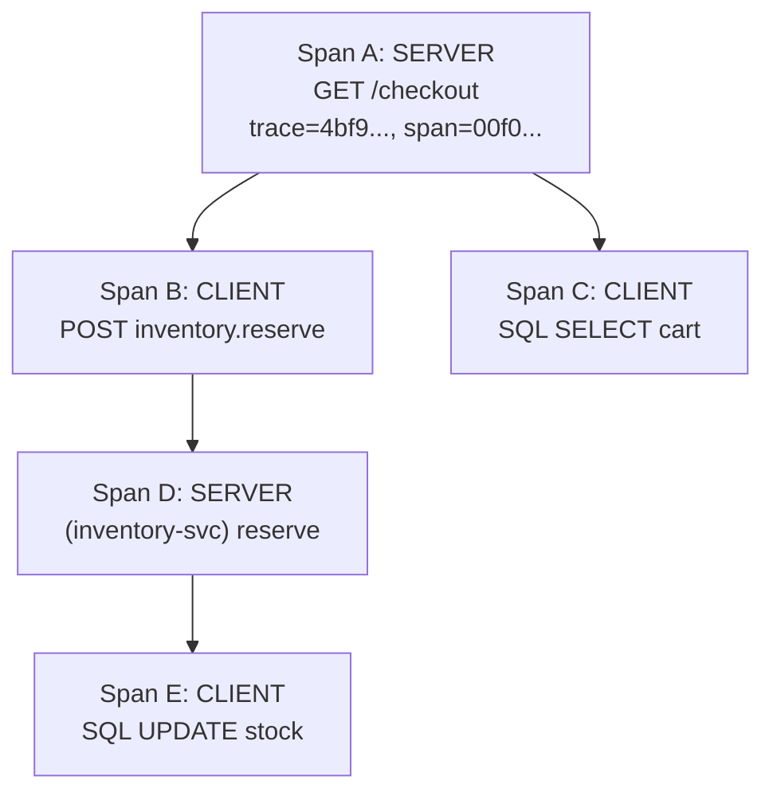
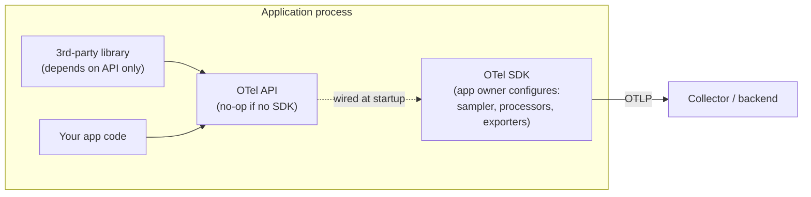
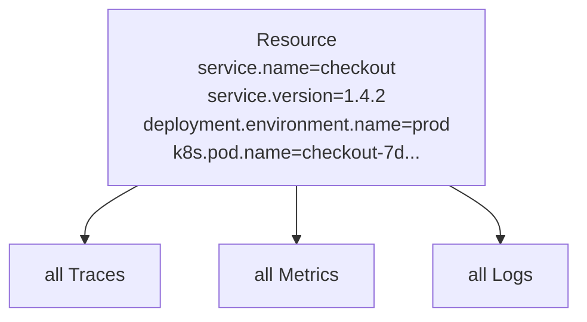
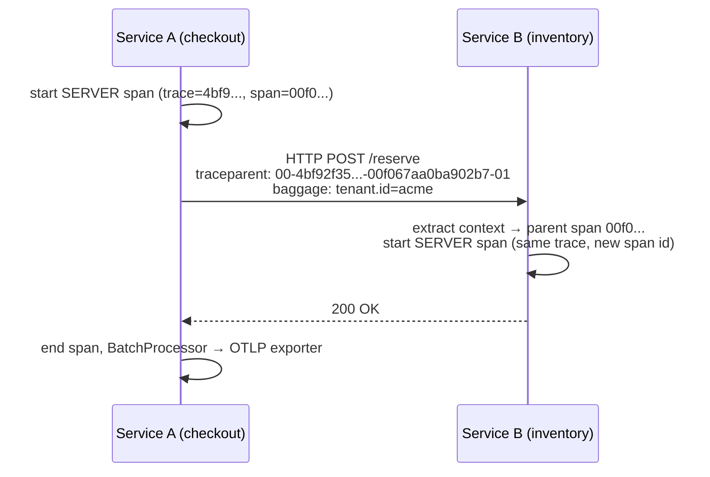

# OpenTelemetry Signals & Instrumentation

OpenTelemetry (OTel) is the CNCF's vendor-neutral standard for generating,
collecting, and exporting **telemetry** — traces, metrics, logs, and (emerging)
profiles. This topic covers the *client-side* story: what the signals are, how the
API/SDK split works, how you instrument code (auto vs manual), why semantic
conventions and Resource matter, and how data leaves the process via OTLP,
exporters, and propagators. The Collector's pipeline internals are covered in the
sibling topic *OpenTelemetry Collector & Telemetry Pipelines*; the design-level
"where monitoring fits" view lives in *system-design/observability-monitoring-reliability*.

> [!KEY-TAKEAWAY]
> OTel's core promise: **instrument once, in a standard way, and send to any
> backend.** It decouples the instrumentation *API* (what your code calls) from
> the *SDK* (what processes/exports data) and from the *backend* (Jaeger,
> Prometheus, Grafana Tempo, Datadog, etc.). You avoid vendor lock-in at the
> instrumentation layer.

## Why OpenTelemetry exists (OpenTracing + OpenCensus merge)

Before OTel there were two competing open standards. **OpenTracing** (a
CNCF-hosted, vendor-neutral *tracing API* with no built-in implementation) and
**OpenCensus** (a Google-originated set of *libraries* that shipped both an API
and an implementation for traces and metrics). Users had to choose, and libraries
that wanted to be instrument-agnostic had to pick a side or support both.

In 2019 the two projects **merged into OpenTelemetry**, taking OpenTracing's clean
API/implementation separation and OpenCensus's batteries-included agents and
metric support. OTel is now a CNCF project and is consistently among the most
active CNCF projects (by contributor/commit velocity, second only to Kubernetes).

What OTel standardizes:

- A **specification** (language-agnostic) defining the signals and their data model.
- **APIs and SDKs** per language.
- **Semantic conventions** — standardized attribute names.
- **OTLP** — the OpenTelemetry Protocol, a wire format for shipping all signals.
- The **Collector** — a standalone binary to receive, process, and export telemetry.

What OTel deliberately does **not** do: it is **not a backend**. OTel does not
store, index, or visualize your data. You still need Prometheus/Mimir, Jaeger/Tempo,
Loki/Elasticsearch, or a commercial APM to store and query. OTel is the "plumbing
and taps," not the "reservoir."

> [!INTERVIEW]
> A classic opener: "What problem does OpenTelemetry solve?" Strong answer:
> vendor-neutral, standardized instrumentation so you can switch observability
> backends without re-instrumenting code, plus a single protocol (OTLP) and
> consistent attribute names (semantic conventions) across languages and services.

## The signals: traces, metrics, logs, and profiles

A **signal** is a category of telemetry. OTel defines these signals:

| Signal | What it captures | Maturity (spec) |
|---|---|---|
| **Traces** | The path of a request through services; causal, latency-carrying | Stable |
| **Metrics** | Numeric measurements aggregated over time (counters, gauges, histograms) | Stable |
| **Logs** | Timestamped records of discrete events | Stable |
| **Baggage** | Contextual key-values propagated alongside context (not itself exported as a signal to backends by default) | Stable |
| **Profiles** | Code-level resource usage (CPU/memory) over time — continuous profiling | Development / experimental |

The signals are **complementary**, not redundant. Metrics tell you *that* something
is wrong (error rate up, latency up) cheaply and at scale; traces tell you *where*
in the request path and *why* (which downstream call, which span); logs give you
the detailed *what* with rich context. OTel's differentiator is **correlation**:
because a trace context flows through the process, logs and metrics recorded during
a span can carry the same `trace_id`, letting a backend pivot from a spiking metric
to an exemplar trace to the log lines emitted inside it. (An **exemplar** is a single
sampled `trace_id` attached to a metric data point — say, one slow request recorded in
a latency-histogram bucket — that lets the backend jump from an aggregate metric
straight to a representative trace.)

> [!TIP]
> "Events" in OTel are modeled as a **specialized kind of log record** (a log with a
> well-known `event.name`), not a separate signal. Don't call events a fifth pillar.

## Traces and spans: the data model

A **trace** is a tree (technically a DAG) of **spans** — the **parent-child** edges
form a strict tree, and it becomes a DAG only because **Links** can reference other
spans/traces (e.g. one batch span linking to many producing traces). Each span represents one
unit of work (an HTTP handler, a DB query, an RPC) and carries:

- **Trace ID** — 16 bytes (32 hex chars), shared by every span in the trace.
- **Span ID** — 8 bytes (16 hex chars), unique to the span.
- **Parent span ID** — links a span to its caller (root span has none).
- **Name** — low-cardinality operation name (e.g. `GET /orders/:id`, not the full URL).
- **Start / end timestamps** — giving duration.
- **SpanKind** — `SERVER`, `CLIENT`, `PRODUCER`, `CONSUMER`, or `INTERNAL` (in-process
  work with no remote peer, e.g. a business function or a queue-drain loop).
- **Attributes** — key-value tags (e.g. `http.request.method=GET`).
- **Events** — timestamped annotations within the span (e.g. an exception).
- **Links** — references to other spans/traces (e.g. a batch job processing many
  messages links to each message's producing trace — useful for fan-in/fan-out).
- **Status** — `Unset` (default), `Ok`, or `Error`.



**SpanKind** matters for backend semantics: a `CLIENT` span on the caller and the
matching `SERVER` span on the callee represent the two sides of one remote call;
`PRODUCER`/`CONSUMER` capture async messaging where the consumer may run much later.
Backends use SpanKind to compute service-to-service latency and to build service maps.

> [!WARNING]
> Span **name** must be low-cardinality. Putting a user ID or full URL with query
> string in the span name explodes the number of distinct operation names, breaks
> aggregation, and can hurt backend performance. Put high-cardinality data in
> **attributes**, not the name.

## Metrics: instruments and the OTel metrics model

OTel's metrics API exposes **instruments** you record measurements against. The SDK
then aggregates them into a metric stream and exports them. Core synchronous
instruments:

| Instrument | Semantics | Typical use |
|---|---|---|
| **Counter** | Monotonic, only increases | Requests served, bytes sent |
| **UpDownCounter** | Can increase or decrease | Queue depth, active connections |
| **Histogram** | Distribution of values into buckets | Request latency, payload size |

And **asynchronous (observable)** instruments, which take a callback invoked at
collection time (good for reading a current value you don't control the cadence of):

- **ObservableCounter** / **ObservableUpDownCounter** — report a cumulative value.
- **ObservableGauge** — report a current, non-additive value (CPU %, temperature).

A key design point: OTel supports selectable **temporality** — **cumulative**
(value since start, the way Prometheus thinks) or **delta** (value since the last
export). Prometheus-style scraping wants cumulative; many push-based/statsd-style
backends want delta. The SDK can convert.

**Worked example — same counter, two temporalities.** A `Counter` (`http.requests`)
is observed at three export points. The running total the SDK holds is
100 → 150 → 175:

| Export at | Running total | **Cumulative** sends | **Delta** sends |
|---|---|---|---|
| t0 | 100 | `100` | `100` (since start) |
| t1 | 150 | `150` | `50` (150 − 100) |
| t2 | 175 | `175` | `25` (175 − 150) |

Cumulative re-sends the *whole total each time* (the backend subtracts adjacent
points to get a rate); delta sends only *what happened since the last export* (the
backend sums them). Now the process **restarts** right after t2, and the counter
resets to 0, reaching 30 by the next export t3:

- **Cumulative** now sends `30` — *lower* than the previous `175`. The backend must
  detect this drop as a counter reset (Prometheus does this automatically) or it
  would compute a nonsensical negative rate. This is exactly why Prometheus wants
  cumulative *and* owns reset detection.
- **Delta** sends `30` at t3 — completely unaffected by the restart, because each
  export already stands alone. No reset logic needed, but the backend must not lose
  a single export or the total is permanently wrong.

OTel histograms can also be **explicit bucket** histograms or **exponential (base-2)
histograms** — the latter map onto Prometheus **native histograms** and give
high-resolution quantiles without pre-choosing bucket boundaries.

**Intuition — why exponential histograms beat explicit buckets.** With an *explicit*
histogram you must *guess the boundaries up front*, e.g. `le = 10ms, 50ms, 100ms,
500ms`. If real latency clusters at 12ms, everything lands in the single 10–50ms
bucket and you can't tell p50 from p99 inside it — resolution is wherever you happened
to guess. An *exponential* histogram instead defines bucket boundaries as **powers of
a base**, where `base = 2^(2^−scale)`, so resolution auto-adapts across the whole range
without any guessing. Concretely, boundaries are `base⁰, base¹, base²,…`:

| scale | base = 2^(2^−scale) | first few boundaries (ms) |
|---|---|---|
| 0 | 2 | 1, 2, 4, 8, 16, 32, … |
| 1 | √2 ≈ 1.414 | 1, 1.41, 2, 2.83, 4, 5.66, … |
| 2 | 2^0.25 ≈ 1.189 | 1, 1.19, 1.41, 1.68, 2, … |

Higher scale = more buckets per power of two = finer resolution. The SDK can even
*downscale* automatically (merge adjacent buckets, lowering the scale) if the observed
range grows too wide for the bucket budget — so you get fine resolution where the data
actually is, without ever pre-choosing boundaries.

> [!TIP]
> Metric quantiles: prefer recording a **Histogram** and computing quantiles in the
> backend (e.g. Prometheus `histogram_quantile`) over client-side summaries, because
> histograms are aggregatable across instances while pre-computed percentiles are not.

## Logs and log correlation

OTel treats logs differently from traces/metrics: rather than reinvent logging, the
**Logs API/SDK is designed as a bridge**. Existing logging frameworks (Logback, Log4j,
`slog`, Winston, Python `logging`) emit through an OTel *appender/bridge* that turns
records into the OTel **LogRecord** data model and ships them via OTLP. This is why
OTel logging is "the last signal to mature" — it had to integrate with decades of
existing log libraries rather than replace them.

An OTel `LogRecord` carries: timestamp, observed timestamp, severity number + text,
body, attributes, and — crucially — **`trace_id` and `span_id`** pulled from the
active context. That is what makes **trace-log correlation** automatic: a log line
emitted inside a span is stamped with the trace/span IDs, so a backend can jump from
a trace waterfall straight to the logs produced during a given span.

**Worked example — one `trace_id` across all three signals.** A checkout request is
slow. The on-call follows the same `trace_id = 4bf92f3577b34da6a3ce929d0e0e4736`
through each signal:

1. **Metric** — the `http.server.request.duration` histogram spikes; the 2–4s bucket
   has an **exemplar** attached: `{value: 3.1s, trace_id: 4bf92f35…, span_id: 00f067aa…}`.
   The dashboard shows a dot the operator can click.
2. **Trace** — clicking pivots to that trace's waterfall. `trace_id 4bf92f35…` has a
   `SERVER` span `GET /checkout` (span `00f067aa0ba902b7`, 3.1s) whose child `CLIENT` span
   `POST inventory.reserve` (span `b7ad6b7169203331`, 2.9s) is the culprit — the inventory
   call, not checkout itself.
3. **Log** — filtering logs by that same `trace_id` surfaces the line emitted inside
   the inventory span, so it carries that child span's id: `{"trace_id":"4bf92f3577b34da6a3ce929d0e0e4736",
   "span_id":"b7ad6b7169203331","severity":"WARN","body":"reserve retried 3x: lock
   contention on sku-42"}`.

Metric → trace → log, no manual ID-copying, because the *same* `trace_id` was stamped
on the exemplar, the span, and the log record. That end-to-end pivot is OTel's headline
payoff.

> [!KEY-TAKEAWAY]
> The OTel Logs model is a **bridge**, not a new logging framework. You keep your
> existing logger; OTel attaches trace context and exports via OTLP.

## API vs SDK separation

This is one of the most-probed OTel design decisions. The functionality is split:

- **API** — the interfaces your code (and third-party libraries) call to create
  spans, record metrics, etc. It is designed to be a **no-op by default** if no SDK
  is installed, so instrumenting a library imposes near-zero cost on users who don't
  opt in.
- **SDK** — the concrete implementation the **application owner** installs and
  configures: samplers, span processors, exporters, resource detection, etc.

The rule: **instrumentation libraries MUST depend only on the API, never the SDK.**
This lets a library be instrumented once and work regardless of which SDK (or none)
the final application wires up. The application owner alone decides sampling,
exporters, and endpoints.



> [!INTERVIEW]
> "Why separate the API from the SDK?" Because instrumentation is a **cross-cutting
> concern** embedded in shared libraries. If libraries pulled in a full
> implementation, you'd get version conflicts and forced overhead. A thin, stable,
> no-op-capable API lets libraries instrument safely while the app owner controls the
> implementation and export path.

## Auto vs manual instrumentation

**Manual instrumentation** = you write code against the API: start spans, set
attributes, record metrics. Maximum control and business-meaningful spans, but
labor-intensive. A minimal manual span looks like:

```python
tracer = trace.get_tracer("checkout")          # from the API

with tracer.start_as_current_span("reserve_inventory") as span:
    span.set_attribute("order.id", order.id)    # domain attribute the library can't know
    try:
        reserve(order)
    except OutOfStock as e:
        span.record_exception(e)
        span.set_status(Status(StatusCode.ERROR))
    # span ends automatically when the `with` block exits
```

The crucial detail: `get_tracer` and `start_as_current_span` come from the **API**. If
no **SDK** is installed in the process, these calls resolve to a **no-op** tracer —
`start_as_current_span` returns a dummy span, `set_attribute` does nothing, and the
whole block costs almost nothing. That is what makes it safe for a shared library to
call these methods: instrumenting a library imposes near-zero cost on users who never
wire up an SDK.

**Automatic instrumentation** = the SDK + **instrumentation libraries** wrap common
frameworks (HTTP servers/clients, gRPC, JDBC, Kafka, Redis, Spring, Express, Flask)
so you get spans/metrics without touching code. Mechanisms differ by language:

- **Java**: a **Java agent** (`-javaagent:opentelemetry-javaagent.jar`) that uses
  **bytecode instrumentation** (via ByteBuddy) to weave spans into libraries at class
  load — zero code changes.
- **.NET / Python / Node.js**: monkey-patching / module hooks / a startup shim, often
  enabled by a wrapper (e.g. `opentelemetry-instrument python app.py`) or an
  auto-instrumentation package.
- **Go**: historically compile-time (you add instrumentation libraries explicitly),
  with eBPF-based auto-instrumentation as a newer, agent-style option.

A typical strategy: **auto-instrument for breadth** (framework-level spans and
metrics for free) and **add manual spans/attributes for depth** on the business
logic that matters. Auto and manual coexist because both go through the same API and
share the same active context.

> [!TIP]
> Auto-instrumentation is the fastest path to value and the usual demo, but interviewers
> like to hear that you'll still add manual spans around business-critical operations
> and enrich spans with domain attributes (e.g. `order.id`, `tenant.id`) that generic
> library instrumentation can't know about.

## Semantic conventions: why standardized attribute names matter

**Semantic conventions** are OTel's standardized names for attributes, metrics, and
resources — e.g. `http.request.method`, `url.path`, `server.address`,
`db.system.name`, `http.server.request.duration`. They live in a separate,
independently versioned repository.

Why they matter: standardized names make telemetry **portable and correlatable
across languages, libraries, and backends**. A Grafana dashboard or an alert built on
`http.server.request.duration` works whether the data came from a Java, Go, or Node
service, because everyone emits the same attribute. Without conventions, one service
emits `http_method`, another `httpMethod`, another `method` — and no cross-service
dashboard or automated service map is possible.

> [!WARNING]
> Semantic conventions **evolve**, and there have been breaking renames (e.g. the HTTP
> conventions moved from `http.method` to `http.request.method`, `http.status_code`
> to `http.response.status_code`). During migrations OTel supported an
> `OTEL_SEMCONV_STABILITY_OPT_IN` flag to emit old, new, or both. If your dashboards
> break after a library upgrade, suspect a semantic-convention version bump.

## Resource: describing the entity producing telemetry

A **Resource** is an immutable set of attributes describing the **entity** that
produces telemetry — the service, host, container, cloud region, k8s pod. It is
attached to *all* signals emitted by that SDK. The most important attribute is
**`service.name`** — it is effectively **required**; if you don't set it, the SDK
falls back to `unknown_service`, which makes your data nearly useless in a backend.

Common Resource attributes: `service.name`, `service.version`, `service.instance.id`,
`deployment.environment.name`, `host.name`, `k8s.pod.name`, `k8s.namespace.name`,
`cloud.provider`, `cloud.region`. **Resource detectors** can auto-populate host,
process, container, and cloud attributes.



> [!KEY-TAKEAWAY]
> Set `service.name` (and ideally `service.version` + `deployment.environment.name`)
> on every service. It's the single most common misconfiguration — forgetting it dumps
> everything under `unknown_service`.

## OTLP: the OpenTelemetry Protocol and wire format

**OTLP** is the standard wire protocol for exporting all signals. It defines a
Protocol Buffers (proto3) schema shared across transports:

- **OTLP/gRPC** — default port **4317**; unary `Export` RPCs.
- **OTLP/HTTP** — default port **4318**; HTTP POST to paths like `/v1/traces`,
  `/v1/metrics`, `/v1/logs`. Two encodings:
  - **binary protobuf** (`Content-Type: application/x-protobuf`)
  - **JSON protobuf** (`Content-Type: application/json`) — note `traceId`/`spanId`
    are **hex-encoded strings** in JSON (not base64), keys are lowerCamelCase.

Both transports MUST support `gzip` compression. Delivery is a request/response with
explicit success/partial-success and retry semantics:

- **Full success** → `Export...ServiceResponse` with `partial_success` unset (HTTP 200).
- **Partial success** → response carries `rejected_*` counts + optional message; the
  client **MUST NOT retry** the rejected items.
- **Retryable** conditions: gRPC `UNAVAILABLE`, `DEADLINE_EXCEEDED`, `ABORTED`,
  `DATA_LOSS` (and `RESOURCE_EXHAUSTED` only if the server signals recovery via
  `RetryInfo`); HTTP `429, 502, 503, 504`. Everything else (e.g. `400`,
  `INVALID_ARGUMENT`) is **not** retryable.
- Backoff uses server-provided delay (`RetryInfo` for gRPC, `Retry-After` for HTTP),
  else exponential backoff with jitter.

Because clients re-send unacknowledged batches, **duplicates can occur** — OTel
considers that an acceptable tradeoff for telemetry. End-to-end delivery guarantees
across multiple hops are explicitly out of OTLP's scope.

> [!INTERVIEW]
> "gRPC or HTTP for OTLP?" gRPC (4317) is efficient and streaming-friendly and is the
> common choice inside a cluster; HTTP/protobuf (4318) traverses proxies/load
> balancers and browsers more easily and is often chosen at the edge or from
> environments where gRPC is awkward. Both carry the same protobuf schema.

## Exporters, propagators, context and baggage

**Context** is the mechanism that carries the *currently active span* (and baggage)
implicitly through a program — thread-locals in Java, `context.Context` in Go,
`contextvars` in Python. A new child span is parented to whatever span is active in
the current context.

**Propagators** serialize/deserialize that context across process boundaries. The
default and recommended propagator is **W3C Trace Context** (the `traceparent` /
`tracestate` HTTP headers). OTel can also be configured with **W3C Baggage** and
legacy propagators (B3 for Zipkin, Jaeger format) for interop.

**Baggage** is a set of user-defined key-value pairs propagated *alongside* context
across services (e.g. `tenant.id`, `session.id`). It is meant for propagating
business context so downstream services can act on it — but **baggage is NOT
automatically added to spans as attributes**, and it travels in plaintext headers, so
you must not put secrets or PII in it, and be mindful of header-size bloat.

**Exporters** are SDK plugins that send batched telemetry out of the process. The
OTLP exporter is the default/canonical one; there are also exporters for
Prometheus (pull), Jaeger, Zipkin, console/stdout (for debugging), etc. Exporters are
usually fed by a **BatchSpanProcessor** (batches + async flush) rather than a
SimpleSpanProcessor (synchronous, export-per-span — only for debugging/tests).



An example W3C `traceparent` header:

```
traceparent: 00-4bf92f3577b34da6a3ce929d0e0e4736-00f067aa0ba902b7-01
             ^  ^                                ^                ^
          version  trace-id (16 bytes / 32 hex)  parent/span-id   trace-flags
                                                 (8 bytes/16 hex)  01=sampled
```

`tracestate` carries vendor-specific key-values, e.g.
`tracestate: rojo=00f067aa0ba902b7,congo=t61rcWkgMzE` (≤32 members).

> [!WARNING]
> If the `traceparent` fails to parse, `tracestate` MUST NOT be parsed. Also, a
> missing/broken propagator is the #1 cause of **broken traces** — spans appear as
> disconnected roots per service instead of one connected trace. Ensure every service
> uses a compatible propagator (all W3C, or all B3).

## Migrating from vendor SDKs

Teams commonly migrate off proprietary agents (Datadog, New Relic, Zipkin/Brave,
Jaeger client libraries) to OTel. Strategies:

- **Shims / bridges**: OTel provides an **OpenTracing shim** and **OpenCensus bridge**
  so existing OpenTracing/OpenCensus instrumentation keeps working while you migrate
  incrementally.
- **Propagation interop**: configure OTel to also read/write the old propagation
  format (e.g. B3 for a Zipkin estate) so traces stay connected during a mixed-fleet
  rollout — otherwise you get broken traces at the boundary between old and new
  services.
- **Collector as an adapter**: run the Collector with legacy **receivers** (Zipkin,
  Jaeger, statsd, Prometheus) so old agents keep sending in their native format while
  the Collector normalizes to OTLP and exports to your chosen backend. This lets you
  swap the *backend* without touching every service at once.
- **Keep `service.name` stable** across the migration so historical and new data line
  up under the same service.

> [!INTERVIEW]
> A good migration answer emphasizes **incrementalism**: bridges for code,
> propagation interop for connected traces during the transition, and the Collector
> as a translation layer — never a risky big-bang re-instrumentation.

## Signal stability and maturity

OTel versions **stability per signal and per component**, not one global "OTel
version." As of the mid-2020s: **tracing, metrics, and logs** APIs/SDKs are
**stable** in the major languages; **baggage** is stable; **profiling** is the newest
signal and still in development/experimental, with an OTLP profiles format being
standardized. **Semantic conventions** stabilize per-area on their own timeline (HTTP
conventions reached stable; others still evolve).

Practical implications for interviews:
- Don't assume "OTel is fully stable" — qualify by signal and language.
- Auto-instrumentation library coverage and stability vary; check the registry.
- Semantic-convention churn is a real operational hazard on version bumps.

## Common follow-up questions

- Is OpenTelemetry a monitoring backend? No. It generates and ships telemetry;
  you still need a backend (Prometheus/Tempo/Loki, Jaeger, or a vendor) to store,
  query, and visualize.
- What replaced OpenTracing and OpenCensus? OpenTelemetry — it's the merger of
  both, keeping OpenTracing's API/impl split and OpenCensus's implementation/agents.
- Why can't instrumentation libraries depend on the SDK? So they stay a no-op
  when no SDK is present and don't force implementation/version choices on the app
  owner; only the app owner wires the SDK.
- What's the difference between attributes and Resource attributes? Attributes
  describe a single span/metric/log; Resource attributes describe the entity (service,
  host, pod) and attach to *all* signals from that SDK.
- Head vs tail sampling — where does it happen? Head sampling is decided in the
  SDK at span start (cheap, but can't be error-aware); tail sampling is decided after
  spans are buffered, usually in the Collector (can keep all error/slow traces).
  Detailed coverage lives in *Sampling, Cardinality & Telemetry Cost Management*.
- Why did I lose my trace across services? Almost always a propagator mismatch or
  a framework not instrumented to inject/extract `traceparent`.
- BatchSpanProcessor vs SimpleSpanProcessor? Batch = async, batched, production
  default; Simple = synchronous export per span, for debugging only.
- What is baggage good for and what's the risk? Propagating business context
  (tenant, session) downstream; risk = leaking PII/secrets in plaintext headers and
  header bloat; baggage isn't auto-added to spans.

## References

- OpenTelemetry — Signals overview: https://opentelemetry.io/docs/concepts/signals/
- OpenTelemetry — Traces: https://opentelemetry.io/docs/concepts/signals/traces/
- OpenTelemetry — Metrics: https://opentelemetry.io/docs/concepts/signals/metrics/
- OpenTelemetry — Logs: https://opentelemetry.io/docs/concepts/signals/logs/
- OpenTelemetry — Baggage: https://opentelemetry.io/docs/concepts/signals/baggage/
- OpenTelemetry — Components / API vs SDK: https://opentelemetry.io/docs/concepts/components/
- OpenTelemetry — Instrumentation (auto & manual): https://opentelemetry.io/docs/concepts/instrumentation/
- OpenTelemetry — Semantic Conventions: https://opentelemetry.io/docs/specs/semconv/
- OpenTelemetry — Resource: https://opentelemetry.io/docs/specs/otel/resource/sdk/
- OpenTelemetry — Context & Propagation: https://opentelemetry.io/docs/concepts/context-propagation/
- OpenTelemetry — OTLP spec: https://opentelemetry.io/docs/specs/otlp/
- W3C Trace Context: https://www.w3.org/TR/trace-context/
- OpenTelemetry — History (OpenTracing + OpenCensus merge): https://opentelemetry.io/community/mission/
- OpenTelemetry — Migration guides: https://opentelemetry.io/docs/migration/
