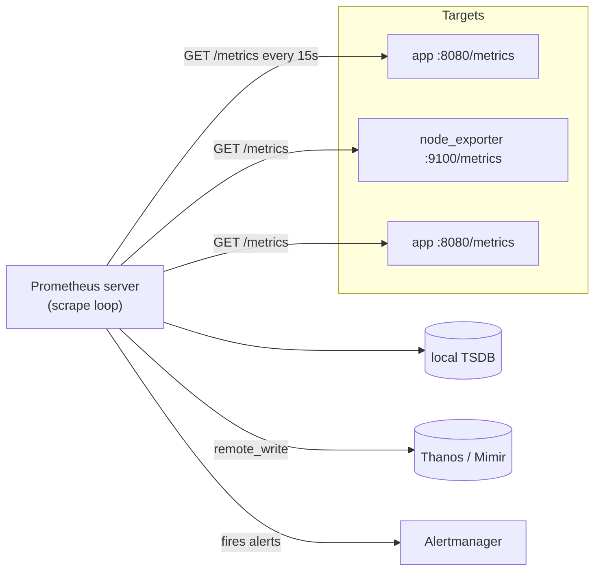
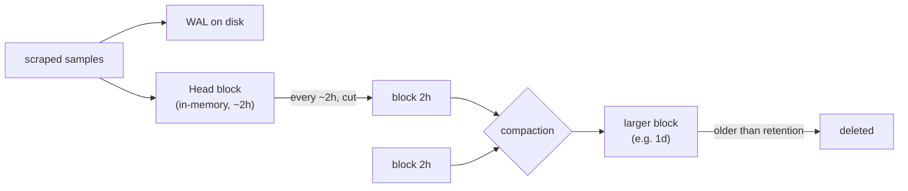
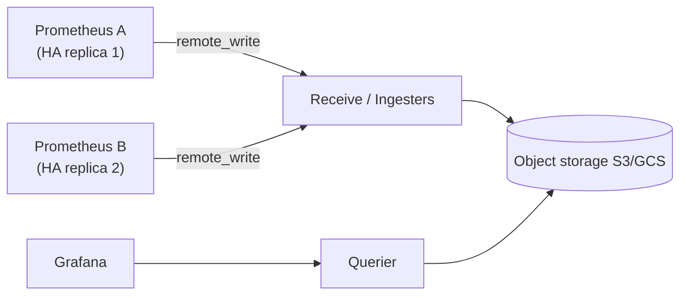

# Prometheus Architecture & Scraping

Prometheus is an open-source **metrics** monitoring system (CNCF-graduated, originally
from SoundCloud) built around a **pull-based** scrape model, a **dimensional** time-series
data model (metric name + key/value labels), a purpose-built local **TSDB**, and the
**PromQL** query language. This topic covers how the server is put together and how it
collects data: the scrape loop, service discovery and relabeling, the storage engine,
staleness, the Pushgateway, and how a fundamentally single-node design scales out via
federation and remote storage (Thanos / Cortex / Mimir).

This is the **Observability** domain, so the emphasis is on *mechanics* — what actually
happens on the wire and on disk. PromQL query semantics and recording rules get their own
topic (`promql-querying-and-recording-rules`); alert routing lives in
`alerting-rules-and-alertmanager`; the architecture-level "where does monitoring fit"
discussion lives in `system-design/observability-monitoring-reliability`.

> [!KEY-TAKEAWAY]
> Prometheus **pulls** samples from HTTP `/metrics` endpoints it discovers, attaches
> `job`/`instance` labels, and appends them to a local TSDB (head block in memory + WAL,
> flushed to immutable 2h blocks). It is a **single node** by design; you scale it with
> **remote_write** to Thanos/Mimir/Cortex, and you get HA by running **two identical**
> servers.

---

## The pull (scrape) model and why pull over push

Prometheus **pulls**: on a fixed interval it issues an HTTP `GET` to each target's
`/metrics` endpoint, parses the response, and ingests the samples. Targets are *dumb* —
they just expose their current metric values; they do not know or care who scrapes them or
how often. This inverts the push model (StatsD, Graphite, many APM agents) where the
application actively sends samples to a collector.

**Why the Prometheus authors chose pull:**

- **Target health for free.** Because Prometheus initiates every scrape, it knows whether
  a target is reachable. It writes a synthetic `up` metric (`1` = scrape succeeded, `0` =
  failed) per target every interval — you can alert on `up == 0` directly. A push system
  can't distinguish "the service is healthy but silent" from "the service is down."
- **No client-side configuration of where to send data.** Targets don't need to know the
  monitoring server's address; you can run many Prometheis (dev, staging, ad-hoc) scraping
  the same targets without reconfiguring apps.
- **Central control of scrape rate and cardinality.** The server decides interval and can
  drop/limit metrics via relabeling; a runaway client can't flood you as easily.
- **Easier to run locally / debug.** You can `curl` a target's `/metrics` by hand and see
  exactly what Prometheus sees.

**Honest trade-offs / when pull is awkward:**

- **Short-lived / batch jobs** may finish before any scrape happens → use the
  **Pushgateway** (see below).
- **Network reachability**: Prometheus must be able to *reach* every target (firewalls,
  NAT, serverless functions with no stable endpoint). Push is easier across hard network
  boundaries.
- **Very high fan-out** of ephemeral endpoints. Service discovery + relabeling largely
  solves this, but it's real config work.

> [!INTERVIEW]
> "Push vs pull" is the classic opener. The strongest answer names the concrete win of
> pull — **built-in liveness via the `up` metric and no client needing the server's
> address** — and then immediately concedes the batch-job exception and the reachability
> caveat. Don't claim pull is universally superior; claim it fits the "many long-lived
> services on a reachable network" case, which is most of them.



---

## The /metrics endpoint and the exposition format

A target exposes metrics as **plain text** over HTTP at (by convention) `/metrics`, using
the **Prometheus text exposition format** (content type
`text/plain; version=0.0.4`). Each non-comment line is:

```
metric_name{label1="v1",label2="v2"} value [timestamp_ms]
```

`# HELP` gives a human description; `# TYPE` declares the metric type. Example:

```
# HELP http_requests_total Total HTTP requests.
# TYPE http_requests_total counter
http_requests_total{method="GET",code="200"} 10247
http_requests_total{method="POST",code="500"} 3

# HELP http_request_duration_seconds Request latency.
# TYPE http_request_duration_seconds histogram
http_request_duration_seconds_bucket{le="0.1"} 8000
http_request_duration_seconds_bucket{le="0.5"} 9500
http_request_duration_seconds_bucket{le="1"}   9900
http_request_duration_seconds_bucket{le="+Inf"} 10000
http_request_duration_seconds_sum   4521.7
http_request_duration_seconds_count 10000
```

Key facts interviewers probe:

- A **histogram** exposes *multiple* series: cumulative `_bucket` series (one per `le`
  boundary, and a mandatory `le="+Inf"`), plus `_sum` and `_count`. The buckets are
  **cumulative** ("less than or equal to"). This is why `histogram_quantile()` can
  interpolate — it's the *classic* histogram. **Native (exponential) histograms** are a
  newer single-series representation with dynamically-sized exponential buckets, far more
  storage-efficient and no need to pre-pick bucket boundaries. The mechanism: bucket
  boundaries follow a fixed exponential *schema* (each bucket is a constant relative width
  wider than the last — e.g. schema 3 gives boundaries ~10% apart), so they are *computed
  from the schema*, not stored per series. A single series carries dynamically-populated
  buckets covering any range with constant relative error, instead of the operator guessing
  a dozen `le` boundaries up front — hence one series where classic histograms need many.
- Each unique `metric_name{labels}` combination is one **time series**. Every label value
  multiplies the series count — the root of the **cardinality** problem.
- **OpenMetrics** is the standardized/IETF descendant of this format (it adds things like a
  trailing `# EOF`, native support for exemplars, and `_created` timestamps). Prometheus
  can scrape both.
- **Exemplars** (trace IDs attached to a bucket sample) can be appended with `#` on a
  metric line in the OpenMetrics format, linking metrics to traces.

**Worked example — deriving p95 from those buckets.** Take the histogram above:
`_count = 10000`, cumulative buckets `le=0.1 → 8000`, `le=0.5 → 9500`, `le=1 → 9900`,
`le=+Inf → 10000`. To find p95, `histogram_quantile(0.95, …)` computes the target rank
`0.95 × 10000 = 9500`, then finds the **first bucket whose cumulative count ≥ 9500** — that
is `le=0.5` (cumulative 9500). It interpolates **linearly within that bucket's range
`(0.1, 0.5]`**, assuming samples are spread evenly across it: the bucket spans cumulative
counts 8000→9500, and rank 9500 sits at the very top, so p95 ≈ **0.5s**. Try p90 to see the
interpolation move: target rank `9000` still lands in `(0.1, 0.5]`, at fraction
`(9000−8000)/(9500−8000) = 1000/1500 ≈ 0.667` of the way in, so p90 ≈
`0.1 + 0.667×(0.5−0.1)` ≈ **0.37s**. The catch: accuracy is capped by bucket width — with a
huge gap between `le=0.1` and `le=0.5`, every percentile in that band is a straight-line
guess. Native histograms exist precisely to shrink that error.

**Worked example — why one label can blow up cardinality.** Series count is the *product*
of every label's distinct-value count. Say `http_requests_total` carries `method` (5
values) × `code` (6) × `endpoint` (200) × `instance` (50): that is
`5 × 6 × 200 × 50 = 300,000` distinct series from a **single** metric name — already heavy
but bounded. Now someone adds a `user_id` label with 100,000 distinct values:
`300,000 × 100,000 = 30,000,000,000` (30 **billion**) potential series. The head block and
inverted index grow roughly with *active* series, so the process OOMs or the TSDB grinds.
This is why `metric_relabel_configs` with `action: labeldrop` (strip `user_id` before
storage) or `action: drop` (discard the whole metric) exists — you cannot un-explode
cardinality after the fact, so you gate it at ingest. **Rule: never put an unbounded,
per-request identity (user ID, request ID, full URL, email) in a label.**

> [!WARNING]
> A `counter` must be **monotonically increasing** (it only resets to 0 on process
> restart). PromQL's `rate()`/`increase()` detect and correct for those resets. Concrete
> trace: a counter reads `100 → 150 → (process restart) → 20` across a window. A naive
> `last − first` would give `20 − 100 = −80` (an absurd negative spike). `rate()`/`increase()`
> instead spot that `20 < 150` can only mean a reset, so they treat the post-restart series
> as continuing from 0 and sum the two legs: `(150 − 100) + (20 − 0) = 70`. Never expose a
> value that can decrease as a counter — use a `gauge`.

---

## Targets, jobs, and instances

Prometheus organizes scraping into **jobs**, each producing many **targets**. A target is a
single scrapable URL; an **instance** is the `host:port` of that target.

- A **job** = a set of targets doing the same thing (e.g. job `api`, job
  `node-exporter`). It maps to a `scrape_config` (or is set via relabeling).
- Two labels are attached automatically to *every* sample from a target:
  - `job` — the configured job name.
  - `instance` — the `host:port` scraped (from the target's `__address__`).
- These are the labels that make a series belong to a target; together with the metric's
  own labels they identify the time series.

```yaml
scrape_configs:
  - job_name: "api"
    scrape_interval: 15s
    static_configs:
      - targets: ["10.0.0.11:8080", "10.0.0.12:8080"]
```

That yields targets `10.0.0.11:8080` and `10.0.0.12:8080`, each labeled
`job="api"`. Beyond `up`, Prometheus emits per-scrape synthetic series like
`scrape_duration_seconds`, `scrape_samples_scraped`, and `scrape_samples_post_metric_relabeling`.

---

## Service discovery (Kubernetes, Consul, file_sd, EC2)

Hard-coding `targets` (`static_configs`) doesn't scale in dynamic environments. **Service
Discovery (SD)** lets Prometheus learn its targets from an external source of truth and
react as things come and go:

- **`kubernetes_sd_config`** — queries the Kubernetes API for `node`, `pod`, `service`,
  `endpoints`, `endpointslice`, or `ingress` objects. This is the dominant SD in practice.
- **`consul_sd_config`** — pulls services registered in Consul.
- **`file_sd_config`** — watches JSON/YAML files listing targets; a generic escape hatch
  that anything (a script, a config-management tool) can write to. Prometheus reloads them
  on change without a restart.
- **`ec2_sd_config`**, `azure`, `gce`, `dns_sd_config`, etc. — cloud/DNS-based.

SD produces raw targets plus a bag of **meta-labels** prefixed `__meta_*` (e.g.
`__meta_kubernetes_pod_label_app`, `__meta_consul_service`). These meta-labels are the raw
material for **relabeling**, which decides which targets to keep and how to label them.

---

## Relabeling: relabel_configs vs metric_relabel_configs

Relabeling is Prometheus's rules engine for **rewriting label sets**. There are **two
distinct phases** — confusing them is a classic interview trap:

| | `relabel_configs` | `metric_relabel_configs` |
|---|---|---|
| Runs | **Before** the scrape, on the **target's** label set | **After** the scrape, on **each sample's** labels |
| Operates on | Target labels + `__meta_*`, `__address__`, `__scheme__`, `__metrics_path__` | The metric name (`__name__`) and its labels |
| Typical use | keep/drop *targets*, set `job`/`instance`, rewrite the address/path, choose the port | keep/drop *metrics*, strip high-cardinality labels, rename metrics |
| Can it stop a scrape? | **Yes** — `action: drop`/`keep` removes the whole target (no scrape happens) | No — the scrape already happened; it filters what gets **stored** |

A relabel rule matches a `regex` against the `;`-joined `source_labels` and applies an
`action` (`replace` default, `keep`, `drop`, `labelmap`, `labeldrop`, `labelkeep`,
`hashmod`).

```yaml
relabel_configs:
  # Only scrape pods that opted in with an annotation
  - source_labels: [__meta_kubernetes_pod_annotation_prometheus_io_scrape]
    action: keep
    regex: "true"
  # Use a pod label as the job name
  - source_labels: [__meta_kubernetes_pod_label_app]
    target_label: job
metric_relabel_configs:
  # Drop a noisy high-cardinality metric after scraping
  - source_labels: [__name__]
    regex: "go_gc_duration_seconds.*"
    action: drop
```

> [!TIP]
> Rule of thumb: **`relabel_configs` = "which targets and how are they named"**;
> **`metric_relabel_configs` = "which samples do I keep and what do their labels look
> like."** If you want to *never scrape* something, `relabel_configs`. If you want to
> scrape but *not store* a subset, `metric_relabel_configs`. `hashmod` on
> `relabel_configs` is how you shard targets across multiple Prometheis.

---

## The TSDB: head block, WAL, 2h blocks, compaction

Prometheus stores samples in a **local, embedded time-series database** on the machine's
own disk — no external DB. Its structure:

- **Head block (in memory).** Incoming samples land in the *head*, an in-memory structure
  holding the most recent ~2–3 hours. Samples are compressed (Gorilla-style delta-of-delta
  timestamps + XOR-compressed values), typically ~1–2 bytes per sample amortized.
- **WAL (Write-Ahead Log).** Because the head is in RAM, every append is first written to
  an on-disk **WAL** so that a crash/restart can replay and rebuild the head without data
  loss. The head is periodically checkpointed and old WAL segments truncated.
- **Persistent blocks.** Roughly every **2 hours**, the head is cut and flushed to an
  **immutable on-disk block** — a directory containing the chunk data, an **inverted index**
  (label → series postings, enabling fast label-based lookups), `meta.json`, and
  `tombstones` (for deletions). Blocks are named with ULIDs.
- **Compaction.** A background process merges adjacent small blocks into larger ones
  (e.g. 2h → 2h → ... into daily blocks), which reduces the number of index/chunk files to
  read at query time and reclaims space from deleted/expired data.
- **Retention.** Controlled by `--storage.tsdb.retention.time` (default **15d**) and/or
  `--storage.tsdb.retention.size`. Whole blocks are deleted once *entirely* older than
  retention — retention is block-granular, not sample-granular.



> [!WARNING]
> The TSDB is **not** designed for the write path to be sharded or replicated. Blocks are
> local files. This is exactly why a single Prometheus is a scaling/HA ceiling and why
> long-term/HA needs remote storage (below).

---

## scrape_interval, scrape_timeout, and staleness

- **`scrape_interval`** — how often each target is scraped (global default commonly `15s`
  or `1m`; overridable per `scrape_config`). This sets the *resolution* of your data and,
  with `rate()`, bounds how fast you can observe change. Scrapes for a target are jittered
  (phase-offset) so they don't all fire at once.
- **`scrape_timeout`** — how long Prometheus waits for the target's HTTP response before
  giving up and marking the scrape failed (`up=0`). Must be **≤ scrape_interval**.
- **Staleness handling (Prometheus 2.0+):** when a target *disappears* from SD, or a scrape
  fails, or a previously-present series stops being reported, Prometheus inserts an explicit
  **stale marker** at the next scrape. A query at a timestamp after that marker returns *no*
  value for the series (rather than the last stale value). Independently, if a series simply
  hasn't received a sample within the last **5 minutes** (the default staleness / lookback
  delta), an instant query treats it as stale. This is why choosing a `scrape_interval`
  above ~2 minutes is risky — a couple of misses and instant queries go empty.

> [!INTERVIEW]
> A common gotcha question: "Why did my metric silently disappear from a graph?" Good
> answers: the target left SD (stale marker), or the `scrape_interval` is close to the 5m
> lookback so a couple of missed scrapes make instant queries return nothing, or a
> `metric_relabel_configs`/`sample_limit` dropped it.

---

## The Pushgateway (batch jobs) — and why NOT for general use

The pull model breaks for **short-lived batch/cron jobs**: they may start and exit between
scrapes, so Prometheus never sees them. The **Pushgateway** is a small service such jobs
**push** their final metrics to; Prometheus then **scrapes the Pushgateway** normally. It's
a *bridge* to preserve the pull model at the server, not a general push endpoint.

**Correct use:** service-level metrics of ephemeral/batch jobs (e.g.
`batch_job_last_success_timestamp_seconds`), pushed at job end.

**Why it is explicitly discouraged for general use:**

- It becomes a **single point of failure** and a bottleneck for many services.
- It **breaks the `up` liveness signal** — Prometheus's `up` now reflects the *Pushgateway's*
  health, not each service's. You lose per-instance up/down.
- Pushed metrics **persist forever** until explicitly deleted (via the API) or the
  Pushgateway restarts — a job that stops pushing leaves **stale values** lingering (the
  gateway does not add staleness markers the way scraping targets do).
- It flattens instance-level dimensionality unless you're careful with grouping keys.

> [!WARNING]
> "Use the Pushgateway so my app doesn't need an endpoint" is the wrong answer. If the app
> is a long-lived service, expose `/metrics` and let Prometheus scrape it. The Pushgateway
> is *only* for jobs too short-lived to be scraped.

---

## Federation

**Federation** lets one Prometheus scrape **aggregated or selected time series from
another** Prometheus, via the special **`/federate`** endpoint (which serves selected series
in the exposition format). Two patterns:

- **Hierarchical federation** — a global/top-level Prometheus pulls *aggregated* series
  (e.g. per-datacenter recording-rule results) from many datacenter-level Prometheis. Keeps
  the global view small; you don't federate raw high-cardinality series.
- **Cross-service federation** — one server pulls a few specific series it needs from
  another team's server.

The `/federate` request passes `match[]` selectors to pick which series to pull. By
convention federation sets `honor_labels: true` so the source's `job`/`instance` labels are
preserved rather than overwritten.

> [!WARNING]
> Federation is for **aggregated / limited** series, not for replicating a full dataset to
> get long-term or HA storage. Federating everything just recreates the single-node
> cardinality problem on the parent. For long-term storage, use remote_write.

---

## remote_write / remote_read and long-term storage (Thanos, Cortex, Mimir)

A single Prometheus keeps data locally for its retention window (default 15d) and can't
horizontally scale storage. **Remote storage** solves both:

- **`remote_write`** — Prometheus **streams** every ingested sample (from the WAL, in
  batched, compressed, back-pressure-aware shards) to a remote endpoint over HTTP. This is
  the primary integration for long-term/scalable storage. The remote system does the
  durable, horizontally-scaled storage.
- **`remote_read`** — Prometheus can query historical data back from a remote endpoint at
  query time, merging it with local data.

**What happens when the remote endpoint is down or slow?** `remote_write` reads from the
**WAL** and buffers/retries; it does **not** block or slow local scraping or the local
TSDB, so your dashboards and alerts driven off local data keep working through a remote
outage. The buffer is **not unbounded**, though: each remote queue is bounded by
`queue_config` (`max_shards`, `capacity`, `max_samples_per_send`), and the WAL itself is
truncated on the normal schedule. If the outage outlasts WAL retention or the queue fills,
Prometheus **drops** the oldest pending samples — you get a gap in the *long-term* store,
but the local 15d data is intact. This is the classic senior follow-up: local monitoring
survives; only the remote copy loses the samples spanning the outage.

Long-term/scale-out systems that consume this:

| System | Model / how it scales | Note |
|---|---|---|
| **Thanos** | Sidecar ships local **blocks** to object storage (S3/GCS); Store Gateway + Querier fan out; also supports receive (remote_write). | Object-storage-centric; global query view + dedup across HA pairs |
| **Cortex** | Horizontally-scalable, multi-tenant; ingests via **remote_write**; microservices. | The original scalable Prometheus backend |
| **Mimir** (Grafana) | Fork/evolution of Cortex; remote_write ingestion, object storage, high cardinality. | "Cortex, productionized"; very large scale |



> [!KEY-TAKEAWAY]
> Prometheus itself stays the same simple scraper; **remote_write** offloads durability and
> scale to Thanos/Cortex/Mimir. Think "Prometheus = collection + short-term + alerting;
> remote system = long-term + global + multi-tenant."

---

## Why Prometheus is single-node, and how it scales

Prometheus is deliberately a **single binary with a local TSDB** — no clustering, no
sharded write path, no built-in replication. This is a design choice for **reliability and
operational simplicity**: a monitoring system must keep working *especially when your
infrastructure is failing*, so it minimizes external dependencies. A Prometheus with only
local disk has almost nothing else that can break.

Consequences and the scaling toolkit:

- **Vertical first.** A single modern Prometheus handles millions of active series; give it
  more CPU/RAM/disk before anything fancy.

**Capacity rule of thumb (approximate — verify against your own workload).** Two back-of-
envelope estimates interviewers expect:
  - **Memory** scales roughly with *active* series — order of a **few KB per active series**
    (chunks in the head + inverted index + overhead). So **1M active series ≈ a few GB of
    head RAM** (call it ~3–8 GB depending on churn and query load); 5M series pushes you
    toward tens of GB.
  - **Disk** ≈ `active_series × samples_per_second × bytes_per_sample × retention_seconds`.
    Plug in **1M series @ 15s interval** (so `1/15 ≈ 0.0667` samples/s each) at
    **~1.5 bytes/sample** compressed, over **15d** (`15 × 86400 = 1,296,000 s`):
    `1,000,000 × 0.0667 × 1.5 × 1,296,000 ≈ 1.3 × 10^11 bytes ≈ 130 GB`. That is the order
    of magnitude — expect ~100–200 GB for 1M series at 15d, and it scales linearly with
    series count, scrape frequency, and retention. Halve the interval to 7.5s and disk
    roughly doubles.
- **Functional sharding.** Split scraping by team/service/region across multiple Prometheus
  servers (each owns some jobs). Use `hashmod` relabeling to shard a huge job across
  servers.
- **Federation** for a small aggregated global view.
- **remote_write to Thanos/Cortex/Mimir** for long-term retention, global query, multi-tenancy.

**High availability:** run **two (or more) identical Prometheus servers** with the same
config scraping the same targets. They're independent; if one dies the other still has the
data and still alerts. **Alertmanager deduplicates** the identical alerts the two send, so
you don't get paged twice. For a single deduplicated *query* view across the pair, put
Thanos/Mimir in front (which dedupes by an external `replica` label).

> [!INTERVIEW]
> "How do you make Prometheus HA?" The crisp answer: **run two identical instances and let
> Alertmanager dedupe the alerts** — Prometheus has no clustering, so redundancy is just
> parallel copies. Then mention Thanos/Mimir if they want a unified long-term/global query
> layer.

---

## Common follow-up questions

- Why pull instead of push, and when do you push? Pull gives free liveness (`up`), no
  client needs the server address, and central rate/cardinality control. Push (Pushgateway)
  only for short-lived batch jobs that can't be scraped in time.
- What's the difference between `relabel_configs` and `metric_relabel_configs`? The
  first runs before the scrape on the *target's* labels and can drop the whole target; the
  second runs after the scrape on each *sample's* labels and only filters what's stored.
- Walk me through the write path. Scrape → append to head (in memory) + WAL (disk) →
  every ~2h cut an immutable block → compaction merges blocks → retention deletes old
  blocks; optionally remote_write streams every sample out.
- Why did a series go stale / disappear? Target left SD (stale marker inserted), scrape
  failed, or no sample within the 5m lookback delta, or a relabel/sample_limit dropped it.
- What labels does Prometheus add at scrape time, and can I change them? `job` and
  `instance` (plus `up`, `scrape_*`). You can override/derive them via `relabel_configs`.
- How do you store years of metrics? Not in Prometheus — `remote_write` to
  Thanos/Cortex/Mimir backed by object storage; keep local retention short.
- How is Prometheus made highly available? Two identical instances scraping the same
  targets; Alertmanager dedupes alerts; Thanos/Mimir for a deduped global query view.
- Why is the Pushgateway discouraged? SPOF, breaks per-instance `up`, and pushed
  metrics persist (go stale) until explicitly deleted.
- Classic vs native histograms? Classic = many cumulative `_bucket` series with fixed
  `le` boundaries; native (exponential) = one series with dynamic exponential buckets, far
  cheaper and no bucket pre-selection.

## References

- Prometheus docs — Overview & concepts: https://prometheus.io/docs/introduction/overview/
- Prometheus docs — Data model: https://prometheus.io/docs/concepts/data_model/
- Prometheus docs — Metric types: https://prometheus.io/docs/concepts/metric_types/
- Prometheus docs — Exposition formats: https://prometheus.io/docs/instrumenting/exposition_formats/
- Prometheus docs — Configuration (scrape_config, SD, relabeling): https://prometheus.io/docs/prometheus/latest/configuration/configuration/
- Prometheus docs — Storage / TSDB: https://prometheus.io/docs/prometheus/latest/storage/
- Prometheus docs — Staleness: https://prometheus.io/docs/prometheus/latest/querying/basics/#staleness
- Prometheus docs — Federation: https://prometheus.io/docs/prometheus/latest/federation/
- Prometheus docs — Remote write/read & storage integrations: https://prometheus.io/docs/prometheus/latest/configuration/configuration/#remote_write
- "Why pull over push": https://prometheus.io/docs/introduction/faq/#why-do-you-pull-rather-than-push
- Pushgateway — when (not) to use: https://prometheus.io/docs/practices/pushing/
- Native histograms: https://prometheus.io/docs/specs/native_histograms/
- Thanos: https://thanos.io/ · Cortex: https://cortexmetrics.io/ · Grafana Mimir: https://grafana.com/docs/mimir/
- OpenMetrics: https://openmetrics.io/
- Google SRE Book — Monitoring Distributed Systems: https://sre.google/sre-book/monitoring-distributed-systems/
