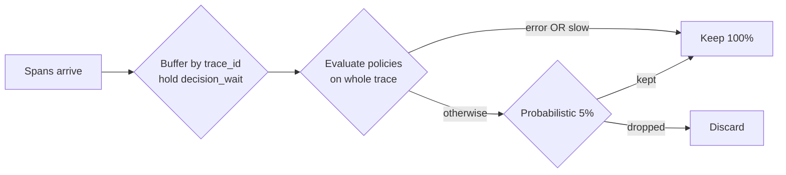
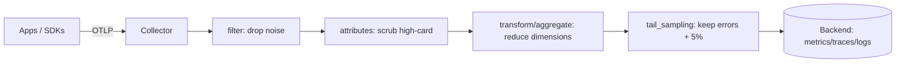

# Sampling, Cardinality & Telemetry Cost Management

Observability is not free. Every metric series, every log line, and every span costs
ingest bandwidth, storage, indexing, and query CPU — and at scale telemetry can cost
*more than the service it observes*. This topic is about the two dominant cost drivers and
how to control them: **cardinality** (the number of unique time-series / label
combinations, the main cost driver for metrics) and **volume** (raw event count, the main
driver for traces and logs), plus the primary lever for volume — **sampling** — and the
pipeline-level knobs (drop/aggregate, retention, downsampling) that keep a bill sane.

The core mental model: **each signal has a different cost shape, so each needs a different
control.** Metrics are cheap *per sample* but explode with cardinality → control the label
set. Traces and logs are cheap *per field* but explode with volume → control with
sampling and dropping. High-cardinality context (`user_id`, `request_id`) does not belong
on metric labels at all; it belongs in traces and wide events where each is one row, not a
new series.

This is the **Observability** domain, so the emphasis is on *mechanics*: what actually
happens on disk and on the wire, and the exact PromQL/config you'd write. The
architecture-level "where does monitoring fit" discussion lives in
`system-design/observability-monitoring-reliability`; the incident/on-call *process*
(postmortems, DORA) belongs to the upcoming `reliability-and-operations` domain; here we
keep alerting at the signal-quality level.

> [!KEY-TAKEAWAY]
> **Cardinality kills metrics; volume kills traces and logs.** Never put unbounded
> dimensions (`user_id`, `request_id`, `email`, full URL path) into metric labels — each
> unique combination is a *new time series* stored forever. Put that context in
> **traces/wide events** instead. Control trace/log cost with **sampling**: head-based is
> cheap but blind (decides at trace start, may miss the rare error); **tail-based** decides
> after the whole trace is buffered so it can *keep every error and slow trace* — at the
> cost of stateful buffering. Bridge aggregate metrics to individual traces cheaply with
> **exemplars**.

---

## The observability cost problem at scale

At small scale, "just store everything" works. At scale it becomes the single largest
line item after compute, because telemetry volume grows *super-linearly* with the system:
more services × more replicas × more requests × more instrumentation points. Three cost
axes matter:

- **Ingest** — bytes/second accepted by the backend (network + write path). Vendors
  frequently bill on this (GB ingested).
- **Storage** — retention × ingest rate. Long retention of high-resolution data dominates.
- **Cardinality / index** — for metrics, the number of *active time series*; for logs,
  the number of *indexed fields*. This drives RAM and query cost more than raw bytes.

The trap is that the *most expensive* telemetry is often the *least useful*: a firehose of
success logs at INFO, or a metric labelled by `request_id`. Cost management is therefore
mostly about **keeping signal and shedding noise**, not blanket reduction.

> [!INTERVIEW]
> A strong senior answer frames cost per signal: "Metrics cost scales with **cardinality**,
> not request volume — a counter incremented a billion times is still one series. Traces
> and logs cost scales with **volume** — so I sample those and I keep metric labels
> bounded." Interviewers love a candidate who does *not* reach for "sample everything" as
> the only tool.

**The levers, mapped to the driver they attack:**

| Lever | Attacks | Signal it applies to |
|---|---|---|
| Bound the label set | cardinality | metrics |
| Head/tail sampling | volume | traces (and logs) |
| Drop/filter at collector | ingest + cardinality | all |
| Aggregate/reduce at collector | cardinality | metrics |
| Retention limits + downsampling | storage | metrics, traces, logs |
| Exemplars | (adds cheap trace links) | metrics→traces |

---

## Cardinality and the cardinality explosion

**Cardinality** = the number of *unique combinations of label (dimension) values* for a
metric. In Prometheus's dimensional model, a metric is identified by its name **plus its
full set of label key/value pairs**; each distinct combination is a separate **time
series**, stored and indexed independently.

```
http_requests_total{method="GET", status="200", handler="/api/users"}   # series 1
http_requests_total{method="GET", status="500", handler="/api/users"}   # series 2
http_requests_total{method="POST", status="200", handler="/api/orders"} # series 3
```

Total series ≈ the **Cartesian product** of each label's distinct values. With
`method` (5) × `status` (10) × `handler` (20) that's 5×10×20 = **1,000 series** — fine.

A **cardinality explosion** happens when you add a label whose value space is *unbounded*
or *huge*, so the product blows up:

```
# DISASTER: user_id has millions of distinct values
http_requests_total{method="GET", status="200", handler="/api/users", user_id="8f3c..."}
```

Now series count = 1,000 × (millions of users) = *billions* of series. Each series
consumes RAM (Prometheus keeps the head block + index in memory), disk, and query time.
This is the number-one way people OOM a Prometheus server.

**Classic explosion sources** — labels you must *never* use for metrics:

- `user_id`, `customer_id`, `account_id`, `email`
- `request_id`, `trace_id`, `session_id`, `order_id`
- Full URL **path with IDs** (`/api/users/8134/orders/99`) — templatize to `/api/users/:id/orders/:id`
- Raw error messages / stack traces, timestamps, epoch millis
- Unbounded, client-supplied values (User-Agent strings, arbitrary query params)

> [!WARNING]
> The insidious part: a high-cardinality label often looks harmless in dev (a handful of
> test users) and detonates in production. Treat *any* label whose cardinality you cannot
> **bound at design time** as unsafe for metrics.

**Combinatorial multiplication** is the trap even with individually-bounded labels: five
labels of 20 values each is 20⁵ = 3.2M series. Cardinality is multiplicative, so audit the
*product*, not each label in isolation.

---

## Where high-cardinality data belongs: traces and wide events, not metric labels

The right home for high-cardinality context is a signal where each record is **one row,
not a new series**:

- **Traces / spans** — a `trace_id`/`user_id`/`request_id` is just an attribute on a span.
  Adding it costs one field on one event, not a permanent new metric series.
- **Wide structured events** (the "observability 2.0" / Honeycomb model) — one very wide
  event per unit of work with dozens/hundreds of high-cardinality attributes, queried by
  arbitrary dimensions after the fact.
- **Structured logs** — high-cardinality fields live in the log body/attributes; you index
  a *few* fields and grep/scan the rest.

The distinction is **aggregation time**:

- Metrics **pre-aggregate** at write time — you decide the dimensions *before* you store,
  so unbounded dimensions blow up the series count.
- Traces/events **aggregate at read time** — you keep raw high-cardinality records and
  slice them however you want at query time. High cardinality is *free-ish* to store,
  expensive only if you also keep every event (→ that's a volume/sampling problem).

> [!TIP]
> Rule of thumb: **"Is this a question I ask across all requests, or about one request?"**
> "What's my p99 latency by endpoint?" → metric (bounded dimensions). "Why was
> *this* request from *this* user slow?" → trace/wide event (high-cardinality). Metrics tell
> you *something is wrong*; traces/events tell you *which request and why*.

**Exemplars** (below) are the cheap bridge: keep the *metric* low-cardinality, but attach a
sampled `trace_id` so you can jump from the spiking histogram bucket to an actual slow trace.

---

## Controlling metric cardinality: limits, relabeling, and design

You defend cardinality at three points: **instrumentation**, **scrape/collector**, and
**server limits**.

**1. At instrumentation** — the real fix. Templatize paths, bucket unbounded values, and
just don't add the label. Push high-cardinality context to trace attributes.

```
# BAD                              # GOOD (templatized route)
path="/api/users/8134"    →        route="/api/users/:id"
status="500"              →        status="500"        # bounded, keep it
error_msg="conn reset..." →        error_type="io"     # bounded category
```

**2. At the collector / scrape (relabeling)** — drop or rewrite labels before storage.
Prometheus `metric_relabel_configs` can `labeldrop` a runaway label or `drop` whole series:

```yaml
metric_relabel_configs:
  # drop a high-cardinality label entirely
  - regex: "user_id|request_id|session_id"
    action: labeldrop
  # drop an entire noisy metric
  - source_labels: [__name__]
    regex: "go_gc_duration_seconds.*"
    action: drop
```

**3. At the server (guardrails)** — Prometheus lets you cap per-scrape series to protect
the server from a misbehaving target:

```yaml
scrape_configs:
  - job_name: app
    sample_limit: 10000          # fail the scrape if a target exposes > 10k series
    label_limit: 30              # max labels per series
    label_value_length_limit: 2048
```

Finding the offenders — TSDB status page (`/tsdb-status`) and PromQL:

```promql
# top 10 metric names by series count (via the meta-metric)
topk(10, count by (__name__)({__name__=~".+"}))

# how many series a given metric has right now
count(http_requests_total)
```

> [!WARNING]
> A `sample_limit` breach fails the **entire scrape** for that target — the scrape is
> treated as failed, so `up` goes to **0** and all of that target's metrics go stale for the
> interval. It is a blunt safety net, not a scalpel. Fix
> cardinality at the source; use limits to stop a single bad deploy from killing the server.

---

## Head-based sampling

**Head-based (head) sampling** decides *whether to keep a trace at the very start* — when
the root span is created — before any of the trace is complete. The decision is made from
information available up front: typically just the **trace ID** and a target percentage.

- **Cheap and stateless.** No buffering; the decision is a fast local computation. An
  un-sampled trace generates *no spans at all*, so you save CPU, memory, and egress in the
  app itself.
- **Consistent across services** *if* the decision propagates. The head decision is carried
  in the **W3C `traceparent` `sampled` flag** and (for probability) in `tracestate`, so
  every downstream service honors the same decision → **whole traces, no orphan spans.**
- **The fatal weakness: it is blind.** At trace start you don't yet know if the request
  will error or be slow, so head sampling at 1% will, on average, *throw away 99% of your
  errors too.* It cannot preferentially keep the interesting traces.

OpenTelemetry SDK samplers (head):

- **`TraceIdRatioBased`** — keep a fixed fraction by hashing the trace ID (e.g. 0.05 = 5%).
  Deterministic on trace ID → consistent.
- **`ParentBased`** — respect the parent's `sampled` flag if there is a parent; otherwise
  delegate to a root sampler (commonly `TraceIdRatioBased`). This is the usual default and
  is what keeps traces whole across service boundaries.
- **`AlwaysOn` / `AlwaysOff`** — 100% / 0%.

```
# W3C traceparent: last byte 01 = sampled, 00 = not sampled
traceparent: 00-4bf92f3577b34da6a3ce929d0e0e4736-00f067aa0ba902b7-01
             ^v ^--------- trace-id ---------^ ^--- span-id ---^ ^flags
```

> [!INTERVIEW]
> "You head-sample at 1% and your error rate is 0.5% — what's wrong?" Answer: you'll
> capture roughly 1% of those errors, i.e. almost none, so trace-based error debugging is
> useless. The fix is **tail sampling** (keep 100% of errors, sample the rest) or a
> hybrid. Naming this trade-off unprompted signals seniority.

---

## Tail-based sampling

**Tail-based (tail) sampling** waits until **all (or most) spans of a trace have been
collected**, then decides based on properties of the *whole* trace: did any span error?
was the end-to-end latency high? does it touch a particular service or attribute?

- **The big win: policy-driven retention of interesting traces.** You can *always keep*
  errored and slow traces while sampling the boring successful ones at a low rate — exactly
  what head sampling can't do.
- **The big cost: it must be stateful.** A collector has to **buffer every span of every
  in-flight trace** in memory until the decision window closes, so it needs significant RAM
  and often a fleet of nodes. All spans of one trace must reach the **same collector
  instance** (requires trace-ID-aware load balancing, e.g. the `loadbalancing` exporter).

The OpenTelemetry Collector's **`tailsamplingprocessor`** (collector-contrib) implements
this. Key knobs and policies:

```yaml
processors:
  tail_sampling:
    decision_wait: 30s        # how long to buffer a trace before deciding
    num_traces: 50000         # max traces held in memory (circular buffer)
    policies:
      - name: keep-errors
        type: status_code
        status_code: {status_codes: [ERROR]}
      - name: keep-slow
        type: latency
        latency: {threshold_ms: 500}
      - name: sample-the-rest
        type: probabilistic
        probabilistic: {sampling_percentage: 5}
```

- **`decision_wait`** (default 30s) — how long to wait after the first span before deciding.
  Too short → you decide before the trace finishes and mislabel it; too long → more memory.
- **`num_traces`** (default 50000) — in-memory circular buffer size. When full, the
  **oldest trace is evicted** and may be dropped *before* it was ever evaluated. Under a
  volume spike you silently lose traces → raise `num_traces` or lower `decision_wait`
  (both cost memory).
- **Policy types** include `latency`, `status_code`, `probabilistic`, `rate_limiting`,
  `numeric_attribute`, `string_attribute`, `boolean_attribute`, `trace_state`,
  `span_count`, `and`, `composite`, `always_sample`.



> [!WARNING]
> Because the app still *generates and exports all spans* to the tail sampler (the drop
> happens at the collector, not the app), tail sampling does **not** save in-process
> instrumentation overhead or app→collector egress — only backend storage. Head sampling
> saves everything upstream; tail sampling saves storage while keeping the signal.

**Common production pattern: hybrid.** A small head sample in the SDK (e.g. keep 100% for
now) feeds tail sampling at the collector that keeps errors/slow + a probabilistic
baseline. Or head-sample lightly to cap app cost, then tail-sample for storage.

---

## Probabilistic vs rate-limiting vs adaptive sampling

Three strategies answer "*how* do we pick what to keep?" — orthogonal to head/tail.

**Probabilistic (ratio) sampling** — keep a fixed *fraction*, e.g. 10%. Decision is
typically a deterministic hash of the trace ID vs a threshold, so it's **consistent** and
you can recover true totals by scaling up (a kept trace "represents" 1/p traces).

- Pro: simple, statistically sound, throughput scales with traffic.
- Con: **volume is unbounded** — a 10x traffic spike = 10x sampled data (and 10x cost) at
  the worst possible moment. Rare events at low volume may be missed entirely.

**Rate-limiting sampling** — keep at most *N traces per second*, usually via a **leaky/token
bucket**. Jaeger's rate limiter: `rate=2.0` → ~2 traces/sec.

- Pro: **hard ceiling on cost** regardless of traffic — predictable bills.
- Con: the *sampled fraction varies with load*, so it's **not statistically uniform**;
  under a spike you keep a vanishing % and can't reliably scale back up to totals.

**Adaptive sampling** — dynamically adjust the probability *per service/operation* to hit a
**target throughput**, giving low-traffic endpoints a guaranteed floor so they aren't
starved by high-traffic ones. Jaeger's adaptive sampler observes incoming spans and
recalculates per service/endpoint to meet `target_samples_per_second`, using
`initial_sampling_probability` for brand-new endpoints until it has enough data. It needs a
`sampling_store` (Cassandra/Elasticsearch/etc.).

- Pro: fair coverage across endpoints, bounded total, self-tuning.
- Con: complexity + a stateful store; probabilities lag traffic changes.

| Strategy | Cost under 10x spike | Statistically uniform? | Low-traffic coverage |
|---|---|---|---|
| Probabilistic | 10x (unbounded) | Yes | Poor (few samples) |
| Rate-limiting | Flat (capped) | No | Depends on bucket |
| Adaptive | Bounded (target) | Per-endpoint | Guaranteed floor |

> [!TIP]
> Common combo: **rate-limit as a safety ceiling** on top of **probabilistic** for
> statistical validity; or **adaptive** when you have many services with wildly different
> traffic and want fair coverage without one endpoint drowning the rest.

---

## Sampling consistency and trace-context propagation

For a **whole trace to survive** (no orphaned spans from services that decided
differently), the sampling decision must be **consistent across every hop**. Two
mechanisms:

1. **Propagate the boolean decision** in the **W3C `traceparent`** trace-flags byte
   (`...-01` = sampled). Downstream `ParentBased` samplers honor it → all-or-nothing per
   trace. This is what prevents partial traces.

2. **Propagate the sampling *probability*** so tail/backends can compute correct
   aggregates. OpenTelemetry's **consistent probability sampling** encodes a sampling
   threshold / `r`-value in **`tracestate`** (the `ot=` vendor entry). This lets any point
   in the pipeline make the *same* deterministic keep/drop decision from the trace ID and
   reconstruct unbiased counts (each kept trace's `1/p` weight is known).

```
traceparent: 00-<trace-id>-<span-id>-01
tracestate:  ot=th:8;rv:...      # OTel consistent-probability sampling fields
```

**Deterministic (trace-ID hash) sampling** is what makes this work: because every service
hashes the *same* trace ID against the *same* threshold, they independently reach the same
decision without coordination — this is why probabilistic head sampling keeps traces whole.

> [!WARNING]
> If different services use *different* head sampling rates without propagating the
> decision, you get **broken traces**: service A keeps its span, service B (10% sampler)
> drops the child, and your waterfall has holes. Always use `ParentBased` and propagate
> `traceparent`/`tracestate`.

---

## Log sampling

Logs are volume-driven: a chatty service at INFO can out-cost the traces and metrics
combined. Sampling logs keeps the signal while shedding repetitive noise.

- **Level-based** — the cheapest control: don't emit DEBUG/INFO in prod hot paths; keep
  WARN/ERROR at 100%. Structured levels make this trivial.
- **Rate/volume sampling** — keep the first *N per interval per key* then drop duplicates.
  Go's `zap` has a built-in sampler: keep first N of identical entries per second, then
  every Mth. Great for "log storms" (one bad code path logging the same error 100k/s).
- **Priority/tail-style** — always keep error logs; sample successes. Mirror trace sampling
  so kept logs correlate with kept traces (share the sampling decision / `trace_id`).
- **Deterministic by key** — hash on `trace_id`/`user_id` so a kept request keeps *all* its
  logs (coherent story), not a random 10% of lines.

> [!TIP]
> Best practice: **sample logs on the same key/decision as traces** (`trace_id`), so a
> retained trace has its full log context and you can pivot between signals. Never sample
> away ERROR/audit/security logs.

---

## Drop, filter, and aggregate at the collector

The **OpenTelemetry Collector** (and Prometheus relabeling) is the choke point where you
shape telemetry *before* it hits paid storage — the highest-leverage cost lever because it
applies uniformly regardless of what apps emit.

- **Drop/filter** — remove whole signals or noisy attributes (`filterprocessor`,
  `metric_relabel_configs`). Drop health-check spans, debug metrics, chatty log streams.
- **Attribute scrub** — delete high-cardinality or sensitive attributes
  (`attributesprocessor` / `transformprocessor` / `redactionprocessor`).
- **Aggregate / reduce cardinality** — sum away a dimension you don't need. E.g. drop the
  `instance`/`pod` label and re-aggregate, collapsing per-pod series into per-service
  series. Prometheus **recording rules** precompute rolled-up series so dashboards query a
  cheap low-cardinality series instead of the raw firehose.

```yaml
# OTel Collector: drop a noisy metric and a high-card attribute
processors:
  filter/drop_healthchecks:
    metrics:
      metric:
        - 'name == "http_server_duration" and attributes["route"] == "/healthz"'
  attributes/scrub:
    actions:
      - {key: user_id, action: delete}
      - {key: request_id, action: delete}
```



> [!KEY-TAKEAWAY]
> Shape telemetry as **early and centrally** as possible — at the collector, before storage.
> A single collector rule that drops a high-cardinality attribute or a health-check metric
> saves cost across every service without touching app code.

---

## Retention and downsampling

Storage cost = ingest rate × **retention**, so tiered retention with **downsampling** (aka
rollups) is the lever for long-term data.

- **Downsampling / rollup** — replace many high-resolution samples with fewer aggregated
  ones as data ages: raw at 15s for 14 days → 5-min rollups for 90 days → 1-hour for 1 year.
  You keep the *shape* of long-term trends at a fraction of the storage. Thanos **Compactor**
  produces 5m and 1h downsampled blocks; Mimir/Cortex, VictoriaMetrics, InfluxDB, Graphite
  (retention policies) do similar.
- **Tiered / object storage** — recent hot data on fast local disk, older cold data in
  cheap object storage (S3/GCS) via Thanos/Mimir/Loki. Query cost trades for storage cost.
- **Per-signal retention** — keep aggregated **metrics** long (cheap, trend analysis),
  **traces** short (days — you debug recent incidents), **logs** medium with tiering.

> [!WARNING]
> Downsampling is **lossy on purpose** — you can no longer see a 20-second spike in
> year-old data that's rolled up to 1-hour min/max/avg. Choose which aggregations to
> preserve (min/max/count/sum) so you don't destroy the ability to answer the questions you
> actually ask of old data (e.g. keep `max` if you care about historic peak latency).

---

## Common follow-up questions

**"What's the single most important rule to avoid a Prometheus meltdown?"** Never put
unbounded-cardinality values (`user_id`, `request_id`, full paths with IDs) in metric
labels — each unique combination is a new stored series and it multiplies combinatorially.

**"Head vs tail sampling in one sentence each?"** Head decides at trace start from the
trace ID (cheap, stateless, but blind to errors/latency and may throw away rare failures);
tail buffers the whole trace at a collector and decides from its properties (keeps every
error/slow trace, but is stateful and memory-hungry and needs trace-aware routing).

**"You head-sample at 1%, why can't you debug errors?"** You keep ~1% of errors too, so
most failures have no trace. Switch to tail sampling that always keeps `status_code=ERROR`
plus a probabilistic baseline, or run a hybrid.

**"Probabilistic vs rate-limiting sampling trade-off?"** Probabilistic keeps a fixed
fraction — statistically uniform but unbounded cost under a spike. Rate-limiting caps
traces/sec — predictable cost but non-uniform sample and poor spike coverage. Adaptive
targets a per-endpoint throughput to get both bounded cost and fair coverage.

**"How do exemplars help and why are they cheap?"** An exemplar attaches a sampled
`trace_id` to a metric sample (e.g. a histogram bucket) so you can click from a spiking p99
straight to a representative slow trace — one ~100-byte reference in a fixed-size circular
buffer, not a new series. Metric stays low-cardinality; you still get a path to the raw
trace.

**"Where should high-cardinality data live?"** In traces / wide events / structured logs,
which aggregate at *read* time (one row per event), not in metrics, which pre-aggregate at
*write* time (one series per label combination).

**"How do you keep whole traces when sampling?"** Deterministic trace-ID-hash sampling plus
propagating the decision in W3C `traceparent` (sampled flag) and probability in
`tracestate`, honored by `ParentBased` samplers, so every hop makes the same decision.

**"How do you cut storage cost without losing trend visibility?"** Downsampling/rollups
(15s→5m→1h as data ages) plus tiered object storage and per-signal retention — long for
aggregated metrics, short for traces.

## References

- OpenTelemetry — Sampling concepts (head vs tail, consistent probability): https://opentelemetry.io/docs/concepts/sampling/
- OpenTelemetry Collector-Contrib — Tail Sampling Processor README (policies, decision_wait, num_traces): https://github.com/open-telemetry/opentelemetry-collector-contrib/blob/main/processor/tailsamplingprocessor/README.md
- OpenTelemetry — Trace SDK samplers (TraceIdRatioBased, ParentBased): https://opentelemetry.io/docs/specs/otel/trace/sdk/#sampling
- W3C Trace Context (traceparent/tracestate): https://www.w3.org/TR/trace-context/
- OpenTelemetry — Probability sampling in tracestate: https://opentelemetry.io/docs/specs/otel/trace/tracestate-probability-sampling/
- Jaeger — Sampling (const/probabilistic/rate-limiting/remote/adaptive): https://www.jaegertracing.io/docs/latest/sampling/
- Prometheus — Feature flags: exemplars storage: https://prometheus.io/docs/prometheus/latest/feature_flags/#exemplars-storage
- Prometheus — Exemplars & OpenMetrics: https://prometheus.io/docs/prometheus/latest/querying/examples/ and https://prometheus.io/docs/instrumenting/exposition_formats/
- Prometheus — Configuration (sample_limit, label_limit, metric_relabel_configs): https://prometheus.io/docs/prometheus/latest/configuration/configuration/
- Prometheus — Cardinality / naming best practices: https://prometheus.io/docs/practices/naming/ and https://prometheus.io/docs/practices/instrumentation/
- Thanos — Compactor & downsampling: https://thanos.io/tip/components/compact.md/
- Grafana Mimir / Loki — cost & retention docs: https://grafana.com/docs/mimir/latest/ and https://grafana.com/docs/loki/latest/
- Charity Majors / Honeycomb — high-cardinality wide events ("observability 2.0"): https://www.honeycomb.io/blog/
