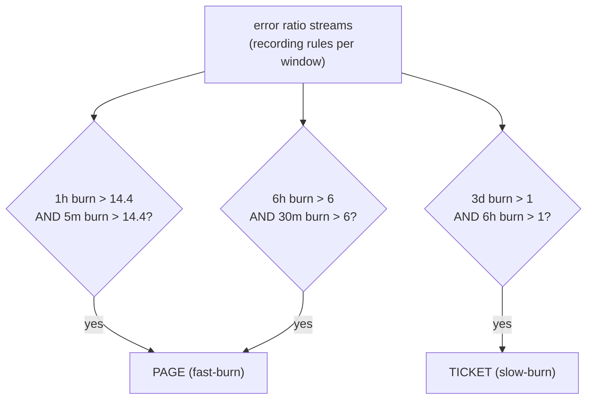

# SLO-Based Alerting & Error Budgets

This topic covers the reliability-measurement layer of observability: how to turn raw
signals (metrics, traces, logs) into **Service Level Indicators (SLIs)**, set **Service
Level Objectives (SLOs)**, derive **error budgets**, and — most importantly for interviews
— alert on **budget burn rate** instead of raw thresholds. The centerpiece is Google's
**multi-window, multi-burn-rate** alerting, which fixes the classic dilemma that a single
threshold is either too noisy or too slow.

This is the **Observability** domain, so we stay at the *signal-quality* level: what makes
an SLI good, how the math works, and how to encode it in PromQL/Alertmanager. The
architecture-level "where does monitoring fit" discussion lives in
`system-design/observability-monitoring-reliability`; the human **incident/on-call
process** (incident command, postmortems, runbooks, DORA) belongs to the upcoming
`reliability-and-operations` domain — here we only cover what makes an *alert actionable*.

> [!KEY-TAKEAWAY]
> An **SLI** is a ratio of good events to valid events; an **SLO** is the target for that
> SLI; an **SLA** is a contract with financial penalties. **Error budget = 1 − SLO** =
> the amount of unreliability you are *allowed* to spend. Don't page on "error rate >
> X"; page on **how fast you are burning the budget** using two burn-rate thresholds
> (fast-burn → page, slow-burn → ticket), each confirmed over a long *and* a short window.

---

## SLI vs SLO vs SLA

These three terms are the vocabulary of reliability and interviewers expect crisp
distinctions:

| Term | What it is | Example | Audience |
|---|---|---|---|
| **SLI** — Service Level *Indicator* | A quantitative **measurement** of a service's behavior, ideally a ratio `good events / valid events` in the range 0–100% | proportion of HTTP requests served in < 300 ms | engineers |
| **SLO** — Service Level *Objective* | A **target** (or range) for an SLI over a window | "99.9% of requests < 300 ms over 28 days" | engineers + product |
| **SLA** — Service Level *Agreement* | A **contract** with a customer that includes **consequences** (refunds, credits) if an objective is missed | "99.5% monthly uptime or 10% credit" | legal / business |

Key relationships and gotchas:

- **The SLO is always stricter than the SLA.** If you promise customers 99.5% (SLA), you
  target 99.9% internally (SLO) so you have margin to react *before* you owe money. The
  gap between them is your safety buffer.
- **Not everything needs an SLA.** Many internal services have SLOs but no SLA. An SLA
  without an SLI to measure it is meaningless.
- **SLIs should be user-centric.** Measure what users experience (request success,
  latency), not internal proxies like CPU. CPU at 95% is not a violation if users are
  happy.
- **A good SLI is a ratio of two counters.** `good / valid` naturally lands in [0,1], is
  easy to aggregate, and degrades gracefully. "Valid" lets you exclude events that
  shouldn't count (e.g., requests from a load test, or 4xx client errors that aren't your
  fault).

> [!INTERVIEW]
> If asked "what's the difference between an SLO and an SLA?" — the one-liner is: **SLO is
> the internal target you engineer toward; SLA is the external promise with a penalty.**
> Then add: you always set the SLO tighter than the SLA to leave reaction room.

---

## Choosing good SLIs (the SLI equation)

Google frames an SLI as:

```
SLI = good events / valid events × 100%
```

Choosing SLIs is mostly about picking the right **specification** (what aspect of user
experience) and **implementation** (how you measure it).

Common SLI types by service kind:

| Service type | Typical SLIs |
|---|---|
| Request/response (APIs) | **Availability** (success ratio), **latency** (fraction under a threshold), **quality** (fraction served non-degraded) |
| Data processing / pipelines | **Freshness**, **correctness**, **coverage**, **throughput** |
| Storage | **Durability**, latency, availability |

Design rules for a good SLI:

- **Latency SLIs are thresholds, not averages.** "99% of requests < 200 ms" is a good
  SLI; "average latency < 200 ms" is a **bad** one because averages hide the tail — a few
  10-second requests are invisible in a mean. Use a *count of requests faster than the
  threshold* over total requests. (You can define multiple latency SLOs — e.g. 90% < 100
  ms **and** 99% < 1 s — to shape the whole distribution.)
- **Define "valid" carefully.** Do 4xx count against availability? Usually not (client
  error), but a 429 you emit under load might. Decide explicitly and encode it in the
  query.
- **Measure as close to the user as possible.** Load-balancer / edge metrics capture more
  failures than app-internal counters, but app metrics attribute causes better. Many teams
  use both.
- **Fewer SLIs is better.** A handful of SLIs that capture the critical user journeys
  beats dozens nobody watches.

Example availability SLI in PromQL over 28 days:

```promql
sum(rate(http_requests_total{job="api", code!~"5.."}[28d]))
/
sum(rate(http_requests_total{job="api"}[28d]))
```

Example latency SLI (fraction of requests faster than 300 ms) using a histogram:

```promql
sum(rate(http_request_duration_seconds_bucket{le="0.3"}[28d]))
/
sum(rate(http_request_duration_seconds_count[28d]))
```

> [!TIP]
> Note the second query divides the `le="0.3"` bucket count by the total `_count`. Because
> Prometheus histogram buckets are **cumulative**, the `le="0.3"` bucket already holds all
> requests ≤ 300 ms — exactly the "good" events for a latency SLI. No `histogram_quantile`
> needed for a threshold SLI.

---

## Error budgets and the 1 minus SLO math

The **error budget** is the mirror image of the SLO:

```
error budget = 100% − SLO
```

If your SLO is 99.9% success, your error budget is **0.1%** of events. Over a window you
can express it as either a *fraction of events* or a *duration of downtime* (for
availability):

| SLO | Error budget | Downtime / 30-day month | Downtime / year |
|---|---|---|---|
| 99% ("two nines") | 1% | 7.2 hours | 3.65 days |
| 99.9% ("three nines") | 0.1% | **43.2 minutes** | 8.77 hours |
| 99.95% | 0.05% | 21.6 minutes | 4.38 hours |
| 99.99% ("four nines") | 0.01% | 4.32 minutes | 52.6 minutes |
| 99.999% ("five nines") | 0.001% | 25.9 seconds | 5.26 minutes |

The 30-day-month numbers come from `30 days × 24 × 60 min × (1 − SLO)`. For 99.9%:
`43200 min × 0.001 = 43.2 min`.

Why error budgets matter (the cultural point interviewers love):

- **They reframe reliability as a resource to spend, not a goal to maximize.** 100%
  reliability is the wrong target — it's infinitely expensive and users can't tell 99.99%
  from 100% because their own ISP/device is less reliable than that.
- **They align dev and ops incentives.** Devs want to ship features (risky); SREs want
  stability. The budget is the shared currency: *while budget remains, ship freely; when
  it's exhausted, stop and stabilize.* This removes the subjective argument.
- **Budget is spent by everything**, not just outages: bad deploys, planned maintenance,
  experiments, dependency failures. That's intentional — it forces prioritizing
  reliability work objectively.

> [!WARNING]
> Availability "nines" are wildly non-linear. Going from 99.9% to 99.99% shrinks your
> monthly budget from ~43 minutes to ~4 minutes — a 10× reduction in allowable downtime,
> usually a large jump in engineering cost. Don't promise a nine you can't afford to
> defend.

---

## Request-based vs time/window-based SLOs

There are two ways to compute the same SLO, and they give subtly different numbers:

- **Request-based (event-based):** `good requests / total requests`. Every request is a
  Bernoulli trial. This is what the PromQL ratios above compute. It's the most common and
  aggregates cleanly.
- **Windows-based (time-based):** slice time into small windows (e.g. 1 min), mark each
  window "good" or "bad" by some criterion, then compute `good windows / total windows`.
  This is closer to how downtime-style SLAs are often written ("minutes of downtime").

Trade-offs:

- A **request-based** SLO weights by traffic: an outage during peak burns far more budget
  than the same-duration outage at 3 a.m. This usually matches user impact.
- A **windows-based** SLO treats each minute equally regardless of traffic. A one-request
  minute where that request failed becomes a "bad minute" — noisy for low-traffic
  services, but it maps naturally to "minutes of downtime" contracts.
- **Low-traffic services** are hard either way: with request-based, one failure can swing
  the ratio dramatically. Mitigations include aggregating over longer windows, generating
  synthetic/probe traffic, or grouping services.

> [!INTERVIEW]
> If asked which to use: request-based is the default for APIs because it weights by
> actual user impact; windows-based maps better to duration-style SLAs and to services
> where "up/down per minute" is the natural unit. Know that they can disagree for the same
> incident.

---

## Burn rate: how fast you spend the budget

**Burn rate** normalizes consumption so the number is independent of the SLO window. The
definition:

```
burn rate = observed error rate / (1 − SLO)
```

Equivalently, burn rate = how many times faster than "sustainable" you are consuming the
budget.

- **Burn rate = 1** means you are spending the budget at exactly the rate that would
  consume it precisely at the end of the SLO window — you finish with exactly 0 budget.
- **Burn rate = 2** exhausts the budget in half the window.
- For a 99.9% SLO (budget 0.1%): an error rate of 0.1% → burn rate 1; 1% → burn rate 10;
  10% → burn rate 100; 100% → burn rate 1000.

Two useful derived formulas:

```
time until budget exhausted   = SLO window / burn rate
error budget consumed by alert = burn rate × alert window / SLO period
```

Example: at burn rate 10 against a 30-day SLO, you exhaust the entire month's budget in
`30 days / 10 = 3 days`. That is a real emergency — hence it should page.

In PromQL, the burn rate for an availability SLO is just the error ratio divided by the
budget:

```promql
# 1h burn rate for a 99.9% SLO (budget = 0.001)
(
  sum(rate(http_requests_total{code=~"5.."}[1h]))
  /
  sum(rate(http_requests_total[1h]))
) / 0.001
```

> [!KEY-TAKEAWAY]
> Alert on **burn rate**, not raw error rate. Burn rate answers the operational question
> that actually matters: *"at this pace, how long until we've blown the whole budget?"* —
> and it's comparable across services with different SLOs.

---

## Why single-threshold alerts are bad

The naive approach — "page when error rate over 5 minutes > 0.1%" — fails on both axes at
once, and understanding why motivates the whole multi-burn-rate design:

- **Short window + low threshold → too noisy.** A brief blip trips it constantly; on-call
  gets paged for things that self-heal in a minute. This is the classic road to **alert
  fatigue**, where responders start ignoring pages.
- **Long window + low threshold → too slow and slow to reset.** A 1-hour window won't fire
  until an hour of damage has accrued, and after the incident ends it keeps firing for up
  to an hour (the bad data lingers in the window). **Reset time** matters.
- **Any single threshold has a fixed trade-off** between precision (few false pages),
  recall (catching real issues), detection time, and reset time. You cannot get all four
  from one threshold.

The four properties Google uses to evaluate an alerting strategy:

| Property | Meaning |
|---|---|
| **Precision** | Fraction of alerts that are real problems (few false positives) |
| **Recall** | Fraction of real problems that trigger an alert (few misses) |
| **Detection time** | How long until a real problem alerts |
| **Reset time** | How long the alert keeps firing after the problem is resolved |

The insight: use a **higher threshold** (burn rate, not raw rate) to raise precision, and
add a **short confirmation window** to cut reset time — then run *multiple* such rules at
different sensitivities. That's multi-window, multi-burn-rate.

---

## Multi-window, multi-burn-rate alerting

This is the interview centerpiece — Google SRE Workbook Chapter 5. The idea: fire
different-severity alerts at different burn rates, and require **each** to hold over both
a **long window** (enough signal for precision) and a **short window** (so it clears
quickly once the issue resolves).

Google's recommended parameters for a **99.9%** SLO (Workbook Table 5-8):

| Severity | Long window | Short window | Burn rate | Budget consumed if it burns for the whole long window |
|---|---|---|---|---|
| **Page** (fast-burn) | 1 hour | 5 min | **14.4** | 2% |
| **Page** (fast-burn) | 6 hours | 30 min | **6** | 5% |
| **Ticket** (slow-burn) | 3 days | 6 hours | **1** | 10% |

How to read it:

- **14.4** comes from `2% of a 30-day budget consumed in 1 hour`: `0.02 × 720h / 1h ≈
  14.4`. A 14.4× burn means you'd exhaust the month's budget in ~2 days — page now.
- The **short window is 1/12 of the long window** (5 min for 1 h, 30 min for 6 h). It
  exists so the alert **stops firing ~short-window minutes after errors stop**, instead of
  lingering for the whole long window. It also guards against firing on stale/tail data
  when the burn has already ended.
- A rule fires only when **both** windows exceed the burn-rate threshold — an `AND`. This
  gives high precision (long window) *and* fast reset (short window).
- **Fast-burn pages, slow-burn tickets.** A slow 1× burn over 3 days isn't an emergency
  you wake someone for, but it will silently eat the whole budget — so it opens a ticket
  for business hours.



A concrete Prometheus alerting rule for the fast-burn page (using a recording rule
`job:slo_errors:ratio_rate1h` etc. that already computes the error ratio per window):

```yaml
groups:
- name: slo-burn-rate
  rules:
  - alert: ErrorBudgetFastBurn
    # 14.4x burn confirmed over BOTH 1h and 5m windows; 0.001 = 1 - 0.999 SLO
    expr: |
      job:slo_errors:ratio_rate1h{job="api"}  > (14.4 * 0.001)
      and
      job:slo_errors:ratio_rate5m{job="api"}  > (14.4 * 0.001)
    labels: {severity: page}
    annotations:
      summary: "Fast burn: >14.4x error budget burn on {{ $labels.job }}"

  - alert: ErrorBudgetSlowBurn
    expr: |
      job:slo_errors:ratio_rate3d{job="api"}  > (1 * 0.001)
      and
      job:slo_errors:ratio_rate6h{job="api"}  > (1 * 0.001)
    labels: {severity: ticket}
    annotations:
      summary: "Slow burn: 1x error budget burn on {{ $labels.job }}"
```

> [!TIP]
> Precompute the per-window error ratios with **recording rules** (`ratio_rate5m`,
> `ratio_rate1h`, `ratio_rate6h`, `ratio_rate3d`). Alert expressions then stay cheap and
> readable, and you avoid recomputing expensive long-range `rate()` on every evaluation.

> [!WARNING]
> A common mistake is to alert on the **long window only** ("6h burn > 6"). That fires
> reliably but keeps firing for up to 6 hours after the incident ends (bad reset time) and
> is slow to detect. The short-window `AND` is not optional — it's what makes the strategy
> usable.

---

## Error budget policy: what you DO when it's spent

An SLO with no consequences is just a dashboard. The **error budget policy** is the
pre-agreed, written document — signed off by dev leads, SRE, and product — that says what
happens as the budget depletes. Typical tiers:

- **Budget healthy:** ship features at normal pace; take reasonable risks.
- **Budget low (e.g. < 25% remaining):** increase caution — more canarying, slower
  rollout, prioritize reliability bugs.
- **Budget exhausted / overspent:** **feature freeze.** All engineering effort redirects
  to reliability until the service is back within SLO (or budget recovers over the rolling
  window). Only reliability fixes and critical security patches ship.

Why write it down *in advance*:

- It converts a heated, subjective, in-the-moment argument ("is it safe to ship?") into a
  pre-agreed **objective rule**. Nobody negotiates policy during an incident.
- It gives SRE a concrete, legitimate lever without requiring escalation to management
  every time.
- It must specify **escalation and exceptions** (who can approve an override, e.g. a
  legally required change) so it doesn't become a blunt instrument.

> [!INTERVIEW]
> The strong answer to "what do you do when the error budget is exhausted?" is: **enforce
> the pre-written error budget policy — typically a feature freeze that redirects
> engineering to reliability until the service is back in SLO.** Then mention that the
> policy is agreed by product + eng + SRE ahead of time, with a defined exception process.

---

## Alert quality: making pages actionable (symptom vs cause)

Even with burn-rate alerting, *what* you alert on determines whether pages are worth
waking someone for. This is the signal-quality boundary of this topic (the human on-call
*process* is `reliability-and-operations`).

- **Alert on symptoms, not causes.** Page on user-visible pain ("checkout success rate is
  burning budget"), not on every possible internal cause (high CPU, a full queue). Causes
  are for dashboards and diagnosis; a symptom alert catches problems you never predicted.
  SLO burn-rate alerts *are* symptom alerts by construction.
- **Every page must be actionable.** If a human can't do anything useful in response,
  it shouldn't page — downgrade to a ticket or delete it. Non-actionable pages are the
  root of alert fatigue.
- **Route by severity, not just fire.** Fast-burn → page (immediate human); slow-burn →
  ticket (business hours); informational → dashboard only. Alertmanager does
  grouping/routing/inhibition so a single root cause doesn't emit 50 pages.
- **Prefer few, high-quality signals.** Google's guidance: your paging alerts should map
  to a small number of symptom-level SLIs, not a sprawling list of cause-based thresholds.

> [!TIP]
> A quick litmus test for a page: *"Is the user experiencing (or about to experience)
> harm, and can the responder act on it right now?"* If either answer is no, it's not a
> page. Symptom-based SLO burn alerts pass this test naturally.

---

## Common follow-up questions

- "What's the difference between an SLI, SLO, and SLA?" SLI = the measurement (a
  good/valid ratio); SLO = the internal target for it; SLA = an external contract with
  penalties. SLO is always set stricter than the SLA to leave reaction room.
- "How much downtime does 99.9% allow per month?" ~43.2 minutes (`43200 min ×
  0.001`). 99.99% is ~4.3 minutes. Know the table.
- "Why not just alert when the error rate crosses a threshold?" A single threshold is
  either too noisy (short window/low threshold) or too slow with bad reset time (long
  window). No single threshold gets precision, recall, detection time, and reset time all
  right.
- "Explain multi-window multi-burn-rate." Multiple burn-rate thresholds (14.4× → page,
  6× → page, 1× → ticket), each requiring both a long window (precision) and a short window
  = 1/12 of it (fast reset). Fast burn pages, slow burn tickets.
- "What is a burn rate of 1?" Consuming the budget at exactly the rate that would
  exhaust it precisely at the end of the SLO window; `burn rate = error rate / (1 − SLO)`.
- "Why is average latency a bad SLI?" Averages hide the tail; a few very slow requests
  are invisible in a mean. Use a threshold-count SLI ("fraction of requests < 300 ms") or
  percentiles.
- "What do you do when the budget is exhausted?" Enforce the error budget policy —
  usually a feature freeze redirecting effort to reliability until back in SLO.
- "Request-based vs windows-based SLO?" Event ratio (weights by traffic, default for
  APIs) vs good-minutes ratio (maps to downtime SLAs, treats each minute equally).
- "Why is 100% the wrong reliability target?" Infinitely expensive and imperceptible
  to users, whose own network/devices are less reliable; leaves no budget for shipping.

## References

- Google SRE Book — *Service Level Objectives* (SLI/SLO/SLA, the reliability hierarchy):
  https://sre.google/sre-book/service-level-objectives/
- Google SRE Book — *Embracing Risk* (error budgets, why not 100%):
  https://sre.google/sre-book/embracing-risk/
- Google SRE Workbook — *Implementing SLOs* (SLI equation, error budget policy,
  windows-based vs request-based): https://sre.google/workbook/implementing-slos/
- Google SRE Workbook — *Alerting on SLOs* (multi-window multi-burn-rate, Table 5-8, burn
  rate math): https://sre.google/workbook/alerting-on-slos/
- Google SRE Book — *Monitoring Distributed Systems* (symptom vs cause, four golden
  signals, actionable alerts): https://sre.google/sre-book/monitoring-distributed-systems/
- Prometheus — histograms and `histogram_quantile`:
  https://prometheus.io/docs/practices/histograms/
- Prometheus — alerting rules:
  https://prometheus.io/docs/prometheus/latest/configuration/alerting_rules/
