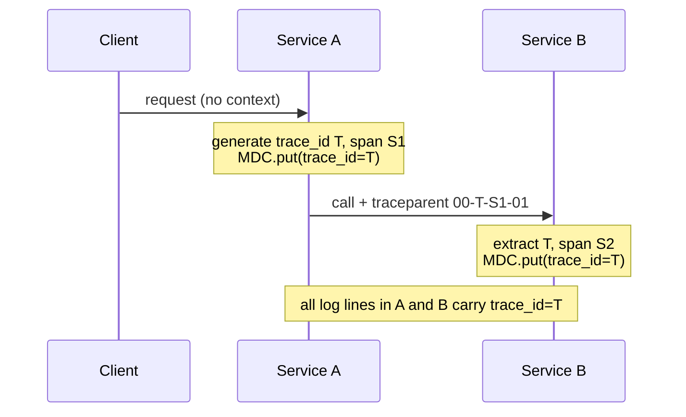

# Structured Logging & Log Levels

Logs are the highest-fidelity, most detailed of the three observability signals
(logs, metrics, traces): a timestamped record of a discrete event. This topic is
about making those records **machine-parseable** (structured logging), choosing the
**right level** for each event, **correlating** logs with traces, keeping **sensitive
data out**, and doing all of this **without wrecking latency or your log bill**.

> [!KEY-TAKEAWAY]
> Structured logging = emit events as key/value data (usually JSON) instead of free
> text, so you can filter, aggregate, and alert on fields without brittle regex. Pair
> that with disciplined log levels, trace-ID correlation, redaction, and cost control,
> and logs become queryable data rather than a haystack.

This topic owns the *authoring* side of logs — how an application should emit them.
Shipping, indexing, and querying them at scale (ELK/Loki) lives in
`log-aggregation-and-analysis`; the design-level "where logging fits" view lives in
`system-design/observability-monitoring-reliability`.

## Unstructured vs Structured Logging

**Unstructured** logs are free-form text lines meant for humans:

```
2026-07-20 10:32:01 ERROR Order 8842 failed for user 12: payment declined after 3 retries
```

**Structured** logs encode the same event as key/value data — typically a single
JSON object per line (JSON Lines / NDJSON), or logfmt (`key=value` pairs):

```json
{"ts":"2026-07-20T10:32:01Z","level":"ERROR","msg":"order failed","order_id":8842,"user_id":12,"reason":"payment_declined","retries":3,"trace_id":"4bf92f3577b34da6a3ce929d0e0e4736"}
```

Why it matters: with structure you can query `level="ERROR" AND reason="payment_declined"`
and aggregate `count by user_id` **without regex-parsing prose**. Unstructured logs force
downstream tools to guess at fields with fragile patterns (Grok/regex) that break the
moment someone edits the message string.

| Aspect | Unstructured | Structured (JSON/logfmt) |
|---|---|---|
| Machine parseable | No (regex/Grok needed) | Yes, natively |
| Query by field | Fragile | Direct (`user_id=12`) |
| Aggregation | Hard | Easy (`count by reason`) |
| Human skimming (raw) | Easy | Harder (tooling renders it) |
| Schema drift risk | N/A | Real — field types can vary |

> [!TIP]
> "Structured" doesn't mandate JSON. **logfmt** (`level=error order_id=8842 msg="..."`)
> is lighter and still machine-parseable; Loki and many Go services favor it. JSON is the
> most universal and nests well; it costs more bytes.

Advanced gotcha: **schema/type consistency**. If `user_id` is sometimes `12` (int) and
sometimes `"12"` (string), Elasticsearch's dynamic mapping can reject or misindex
documents. Keep field names and types stable; treat your log fields like a lightweight
schema. Also avoid **high-cardinality field explosion** in indexed backends (see the cost
section).

## Log Levels: TRACE / DEBUG / INFO / WARN / ERROR

Levels are a severity ordering used both to decide *whether to emit* a line (the
configured threshold) and *how to route/alert* on it. The common ordering, lowest to
highest severity:

| Level | Meaning | Emit when… | Prod default? |
|---|---|---|---|
| TRACE | Ultra-fine step-by-step detail | Deep debugging of a specific flow | Off |
| DEBUG | Diagnostic detail for developers | Investigating; values, branch taken | Off (usually) |
| INFO | Normal, noteworthy business events | Request served, order placed, startup | On |
| WARN | Something unexpected but handled/recoverable | Retry succeeded, deprecated API used, near a limit | On |
| ERROR | An operation failed; needs attention | Unhandled exception, request failed, dependency down | On |
| FATAL | Process cannot continue | About to crash/exit | On |

Key discipline points interviewers probe:

- **WARN is not "small ERROR."** WARN = handled, the request still succeeded (or degraded
  gracefully). ERROR = an operation the user or system cared about *failed*. If it's on the
  happy path and recovered, it's INFO or WARN, not ERROR — otherwise ERROR loses meaning
  and you can't alert on it.
- **Don't log-and-throw.** Logging an exception at ERROR *and* rethrowing it (to be logged
  again by a handler up the stack) produces duplicate ERROR lines for one failure. Log it
  once, at the boundary that actually handles it.
- **Levels gate cost.** Running at INFO in prod and flipping to DEBUG only when
  investigating is the norm; DEBUG in prod is often too voluminous and expensive.
- **Per-logger levels.** Frameworks let you set levels per package/logger (e.g. DEBUG for
  `com.acme.payments`, WARN for a chatty library) rather than globally.

> [!WARNING]
> SLF4J/Log4j2 do **not** have a standard `FATAL` in the SLF4J API (Logback uses ERROR as
> the top level; `FATAL` exists in Log4j 1.x/Log4j2 and maps to ERROR in SLF4J). Don't
> assume FATAL is portable across facades. OpenTelemetry's log data model *does* define a
> FATAL severity range.

## Choosing Log Level: Guidelines & Anti-Patterns

Practical rules for "what level is this?":

- Startup/shutdown, config loaded, request completed with status → **INFO**.
- Fallback taken, retry, cache miss under pressure, approaching a quota, deprecated path,
  malformed-but-recoverable input → **WARN**.
- A request failed, an unhandled exception, a dependency is unreachable after retries,
  data integrity violated → **ERROR**.
- Loop iteration internals, per-item detail, verbose payload dumps → **DEBUG/TRACE**,
  never INFO.

Anti-patterns:
- **Everything at INFO** (or everything at ERROR) — levels carry no signal, so you can't
  filter or alert.
- **ERROR for expected 4xx** — a client sending a bad request (HTTP 400/404) is usually
  INFO/WARN for *your* service; it's not *your* failure. Reserve ERROR for 5xx / internal
  faults you must fix.
- **Alerting directly on "ERROR log count"** as the only signal — noisy and cause-based;
  prefer symptom-based SLO alerts (see `slo-based-alerting-and-error-budgets`) with logs
  as the *diagnosis* tool.

## Correlation & Trace IDs in Logs (MDC)

The single most valuable field in a structured log is a **correlation/trace ID** that
lets you gather every log line for one request across every service and thread, and jump
between logs and the distributed trace.

- **Trace ID / span ID**: propagated by the tracing layer (W3C Trace Context
  `traceparent` header). Putting `trace_id` and `span_id` on every log line links logs ↔
  traces. In Grafana, a log's `trace_id` becomes a click-through to the trace in Tempo/Jaeger
  ("logs to traces").
- **MDC (Mapped Diagnostic Context)**: in SLF4J/Logback/Log4j2, MDC is a thread-local
  (`ThreadLocal`) map of key/value pairs automatically attached to every log line on that
  thread. You set it once at the request boundary and every subsequent log inherits it.

```java
// At the request boundary (e.g. a servlet filter / interceptor)
MDC.put("trace_id", span.getSpanContext().getTraceId());
MDC.put("user_id", String.valueOf(userId));
try {
    handle(request);          // every log within inherits trace_id + user_id
} finally {
    MDC.clear();              // MUST clear — pooled threads are reused!
}
```

W3C `traceparent` header format (version-traceid-spanid-flags):

```
traceparent: 00-4bf92f3577b34da6a3ce929d0e0e4736-00f067aa0ba902b7-01
             ^^ ^------------------------------ ^--------------- ^^
             ver 16-byte trace-id (32 hex)       8-byte span-id   flags (01=sampled)
```



> [!WARNING]
> MDC is `ThreadLocal`. On thread pools you **must** clear it (a `finally` block or a
> library filter) or a request's context leaks onto the next request that reuses the
> thread. Async/reactive code (CompletableFuture, WebFlux, Kotlin coroutines, virtual-thread
> hand-offs) breaks MDC propagation unless you use context-propagating executors or the
> OpenTelemetry/Reactor context bridge.

OpenTelemetry's log data model carries `TraceId`, `SpanId`, and `TraceFlags` as
first-class fields precisely so a `LogRecord` can be linked back to its span; the
OTel Logback/Log4j2 appenders inject these automatically.

## What to Log vs What NOT to Log (PII, Secrets, Redaction)

Logs are frequently the biggest accidental data-leak surface. **Never log:**

- Passwords, API keys, tokens, session IDs, private keys, `Authorization` headers.
- Full card numbers (PAN), CVV, full bank/SSN — regulated under PCI-DSS, etc.
- Personally identifiable information (PII) beyond what's needed and lawful (GDPR/CCPA):
  emails, phone numbers, full names, precise location — minimize and consider hashing.
- Full request/response bodies of anything sensitive.

**Do log** the identifiers you need to investigate: user *ID* (not email), order ID,
request/trace ID, status code, latency, error class.

Redaction strategies (defense in depth):
- **At the source**: don't put the secret in the log call at all; log a reference/ID.
- **Serializer masking**: annotate/register sensitive fields so they render as `***`
  (e.g. custom Jackson serializers, `toString()` that masks).
- **Appender/pipeline filters**: Logback pattern/rewrite filters, Log4j2 `%replace`, or a
  collector processor (OTel Collector `redaction`/`attributes` processor, Logstash `mutate`)
  that regex-masks tokens/emails before storage.
- **Tokenization/hashing**: store a salted hash so you can correlate occurrences without
  storing the raw value.

> [!WARNING]
> Redaction at the aggregation layer is a *safety net*, not the primary control. Regex
> masking is lossy and misses novel formats. The reliable fix is not emitting the secret in
> the first place. And remember logs are often replicated to backups, SIEM, and cold
> storage — a leaked secret in logs must be treated as compromised and rotated.

## Contextual Fields & the Canonical Log Line

**Contextual fields** are the structured key/values that make a log answerable:
`service`, `env`, `version`, `host`, `trace_id`, `user_id`, `route`, `status`,
`duration_ms`. Attach environment-wide context (service, version, region) once via the
logging config/MDC rather than in every call.

The **canonical log line** pattern (popularized by Stripe): emit **one wide, structured
event per request** that summarizes everything about it — method, path, status, latency,
auth principal, feature flags, downstream call counts, error, trace_id. Instead of a
dozen scattered lines you get one queryable record per unit of work.

```json
{"canonical":true,"trace_id":"4bf9...","http_method":"POST","path":"/orders","status":201,
 "duration_ms":142,"user_id":12,"db_queries":4,"cache_hits":3,"downstream_calls":2,"region":"us-east-1"}
```

Why interviewers love it: it is the log analogue of a **wide event / high-cardinality
event** (the philosophy behind Honeycomb and OTel's push toward wide structured events).
One event per request means you can slice by *any* dimension after the fact
(`p99 duration_ms where path=/orders and region=us-east-1`) without pre-aggregating, and
it keeps volume roughly proportional to request count rather than to code paths.

> [!TIP]
> Canonical lines and fine-grained debug logs aren't mutually exclusive: keep the canonical
> per-request summary always-on at INFO, and gate the chatty step-by-step lines behind DEBUG.

## Logging Performance: Async Appenders & Hot Loops

Logging is I/O; done naively it serializes requests behind disk/network writes.

- **Guard expensive construction.** `log.debug("state=" + expensiveToString())` builds the
  string *even when DEBUG is disabled*. Use parameterized logging — `log.debug("state={}", obj)`
  (SLF4J defers `toString()` until it knows the level is enabled) or `isDebugEnabled()` guards
  / Log4j2 lambda `log.debug(() -> expensive())`.
- **Async appenders.** Logback `AsyncAppender` and Log4j2's **async loggers** (backed by the
  LMAX Disruptor ring buffer) hand log events to a background thread so the request thread
  isn't blocked on I/O. Log4j2 async loggers offer very high throughput and low latency.
- **Never log in hot loops.** A log call per element in a million-item loop can dominate CPU
  and flood storage. Log a summary after the loop, or sample.
- **Beware the queue.** Async appenders have a bounded queue; under overload Logback by
  default *drops* TRACE/DEBUG/INFO when the queue is 80% full (`discardingThreshold`) to avoid
  blocking — configure this deliberately. A full queue with blocking behavior can stall
  request threads (backpressure) — a subtle latency source.
- **Structured serialization cost.** JSON encoding per line isn't free; encoders like Logback's
  `net.logstash` or Log4j2 `JsonTemplateLayout` are optimized for it.

> [!WARNING]
> Async logging trades durability for latency: events sit in an in-memory buffer, so a hard
> crash can lose the last unflushed lines — exactly the lines you'd want for the crash. For
> audit/compliance logs, prefer synchronous or flush-on-error.

## Sampling Logs

At high volume you can't afford to store every log. **Log sampling** keeps a subset:

- **Head/rate sampling**: keep 1 in N of a repetitive event (e.g. one in 1000 identical
  cache-hit lines). Loki/Vector/Fluent Bit and app libraries (Zap's sampler) do this.
- **Level-based**: keep 100% of ERROR/WARN, sample INFO/DEBUG.
- **Trace-consistent sampling**: if the trace was sampled, keep its logs too (use the
  `trace_flags` sampled bit) so logs and traces agree — otherwise you get logs for
  un-sampled traces and vice versa.
- **Deduplication/aggregation**: collapse `logged N times in last 10s` instead of N lines.

Trade-off: sampling reduces cost and noise but can drop the *one* line explaining an
incident. Standard practice: **never sample errors**, sample the high-volume happy-path.
This mirrors the tension discussed in `sampling-cardinality-and-telemetry-cost-management`.

## Logs vs Metrics vs Traces: Choosing the Signal

The three pillars answer different questions; logging everything as one signal is a common
mistake.

| Signal | Shape | Best at | Weak at | Cost driver |
|---|---|---|---|---|
| **Metrics** | Aggregated numbers over time (+ labels) | "Is it happening / how much / alerting" (RED, USE, golden signals) | Per-event detail; high-cardinality IDs | Time series (label cardinality) |
| **Logs** | Discrete timestamped events | "What exactly happened to *this* request" | Aggregation at scale; cost | Volume × retention × indexing |
| **Traces** | Causal spans across services | "Where is the latency / which hop failed" | Whole-fleet aggregation | Span volume × sampling |

Guidance:
- Need to **alert** or trend a rate/latency/saturation → **metric** (don't derive alerts by
  counting logs at query time if a counter will do; it's cheaper and lower-latency).
- Need to **debug a specific request** → **log** (with trace_id) and **trace**.
- Don't put unbounded IDs (user_id, request_id) into **metric labels** — that's cardinality
  explosion; those belong in logs/traces or exemplars.
- The signals converge: **exemplars** link a metric bucket to a trace; **trace_id** links a
  log to a trace. Wide canonical events blur the log/metric line (you can compute metrics
  from them). See `observability-fundamentals-and-three-pillars`.

## The "Logs Are Expensive" Reality

Logs are often the *largest* observability cost line. Reasons and levers:

- **Volume**: bytes ingested is the dominant cost in most SaaS pricing (Datadog, Splunk,
  CloudWatch, Elastic). Cost ≈ volume × retention × index/replication factor.
- **Indexing amplifies cost.** Elasticsearch indexes every field (inverted index + doc
  values), which is powerful but multiplies storage and RAM. **Loki** deliberately indexes
  *only labels*, not log content, keeping labels low-cardinality and grepping the rest — far
  cheaper to store, at the price of slower full-text-style queries. This label-vs-content
  trade-off is a favorite interview contrast (detailed in `log-aggregation-and-analysis`).
- **Cardinality in labels/indexed fields** blows up storage and query cost (same disease as
  metric cardinality) — keep high-cardinality data in the log *body*, not in indexed labels.

Cost-control levers: right log levels (INFO in prod), sampling the happy path, **tiered
retention** (hot 7–14 days searchable, then cheap object-storage archive), dropping/
aggregating noisy lines at the collector, and moving anything you *alert* on into metrics
instead of scanning logs.

> [!INTERVIEW]
> A frequent senior question: "Your log bill tripled — what do you do?" Strong answer:
> (1) find the top talkers by service/level/field, (2) cut DEBUG in prod and drop/sample
> the noisiest happy-path events at the collector (keep all errors), (3) move alert-driving
> signals to metrics so you're not scanning logs, (4) apply tiered retention and archive to
> object storage, (5) audit label/field cardinality. Frame it as signal-per-dollar, not just
> "log less."

## Common follow-up questions

- **Why structured logging over grep-able text?** Field-level query/aggregation without
  brittle regex; stable schema; easy correlation and dashboards. Text is fine for a laptop,
  not for a fleet.
- **When is WARN vs ERROR correct?** WARN = unexpected but handled/recovered (request still
  OK). ERROR = an operation actually failed and needs attention. Expected 4xx from clients
  are usually INFO/WARN for your service.
- **How do you correlate logs across microservices?** Propagate W3C `traceparent`; put
  `trace_id`/`span_id` on every line via MDC set at the request boundary; enable logs↔traces
  linking in the backend.
- **Why must you clear MDC?** It's thread-local and threads are pooled/reused — stale context
  leaks into the next request. Async/reactive flows need explicit context propagation.
- **How do you keep secrets/PII out of logs?** Primary: don't log them (log IDs, not values).
  Defense in depth: serializer masking + pipeline redaction + hashing. Treat leaked secrets
  as compromised → rotate.
- **What's a canonical log line and why is it useful?** One wide structured event per request;
  slice by any dimension after the fact; the log form of high-cardinality wide events.
- **How do you make logging fast?** Parameterized/guarded logging, async appenders (Log4j2
  Disruptor), no logging in hot loops, watch the async queue's drop/block behavior.
- **When would you sample logs and what do you never sample?** Sample high-volume happy-path/
  DEBUG/INFO; keep 100% of errors; prefer trace-consistent sampling.
- **Log vs metric for an alert?** Metric — cheaper, lower-latency, avoids scanning logs; keep
  high-cardinality IDs out of metric labels.

## References

- OpenTelemetry Logs Data Model — SeverityNumber ranges, LogRecord fields, trace correlation:
  https://opentelemetry.io/docs/specs/otel/logs/data-model/
- W3C Trace Context (`traceparent`/`tracestate`): https://www.w3.org/TR/trace-context/
- SLF4J manual (parameterized logging, MDC): https://www.slf4j.org/manual.html
- Logback documentation (AsyncAppender, MDC, layouts): https://logback.qos.ch/manual/
- Apache Log4j2 async loggers (LMAX Disruptor): https://logging.apache.org/log4j/2.x/manual/async.html
- Grafana Loki — label-only indexing design: https://grafana.com/docs/loki/latest/get-started/labels/
- Stripe — "Canonical log lines": https://stripe.com/blog/canonical-log-lines
- Google SRE Book — monitoring, symptom vs cause alerting: https://sre.google/sre-book/monitoring-distributed-systems/
- OWASP Logging Cheat Sheet (what not to log, PII/secrets): https://cheatsheetseries.owasp.org/cheatsheets/Logging_Cheat_Sheet.html
