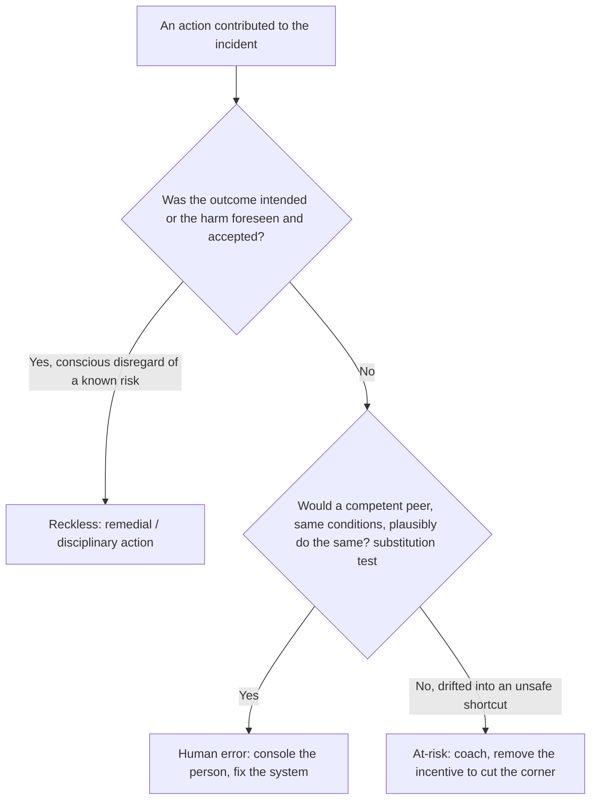

# Blameless Postmortems & Learning

The cultural core of Site Reliability Engineering: **you cannot make a system more
reliable if the people who run it are afraid to tell you what really happened.** A
postmortem (also called an *incident review*, *learning review*, or *retrospective*) is
the written record and structured analysis produced *after* an incident. "Blameless"
means the analysis focuses on **systems, conditions, and contributing factors** — not on
punishing the individuals who happened to be at the controls.

The payoff is not the document itself but the **organizational learning and the tracked,
owned action items** that harden the system so the same failure class cannot recur. A
postmortem with a beautiful timeline and zero follow-through is theater.

Grounded in Google's *Site Reliability Engineering* (Ch. 15, "Postmortem Culture:
Learning from Failure") and *The SRE Workbook* (Ch. 10), Sidney Dekker's *The Field Guide
to Understanding 'Human Error'* and *Just Culture*, Richard Cook's *How Complex Systems
Fail*, John Allspaw's writing on blameless postmortems (Etsy), and the PagerDuty /
Atlassian incident handbooks.

> [!KEY-TAKEAWAY]
> Blameless does **not** mean accountability-free. It means we assume people acted
> reasonably given the information, tools, and incentives they had *at the time*, and we
> fix the **system** that let a reasonable action cause harm. "Human error" is where the
> investigation *starts* (a symptom), not where it *ends* (a cause). The single most
> common failure of postmortem programs is **action items that are never completed.**

Boundaries (cross-reference, don't duplicate):
- **Analysis techniques** — 5 Whys, fishbone/Ishikawa, causal chains, contributing-factor
  trees — belong to `reliability-ops/root-cause-analysis-and-troubleshooting`. Here we
  cover the *postmortem document, culture, and follow-through*.
- **Running the incident** — Incident Command, severity levels, mitigate-before-diagnose,
  MTTR — see `reliability-ops/incident-response-and-command`.
- **How SEV thresholds tie to error budgets** — see
  `reliability-ops/slos-error-budgets-and-velocity-tradeoff` and, for alerting mechanics,
  `observability/slo-based-alerting-and-error-budgets`.
- **Proactively creating failures to learn** — see
  `reliability-ops/chaos-engineering-and-fault-injection`.

---

## What Blameless Means

A **blameless postmortem** analyzes an incident on the assumption that everyone involved
acted with good intentions and made reasonable decisions given the information available
to them *in the moment*. It deliberately avoids the question "who screwed up?" and asks
instead "what about our system made this failure possible, and what made it hard to
detect or recover from?"

The mechanism — **why blamelessness produces more reliable systems**:

1. **Blame drives fear; fear drives hiding.** If naming a mistake gets someone
   disciplined, people stop volunteering the crucial detail ("I skipped the canary
   because the pipeline was flaky and I was under deadline pressure"). You lose exactly
   the information you need to fix the real problem.
2. **Blame stops the analysis one step too early.** "The engineer ran the wrong command"
   *feels* like a root cause, so the investigation halts — leaving the dangerous tool, the
   missing confirmation prompt, and the misleading UI fully intact for the next person.
3. **Individuals are a poor point of leverage.** Firing or retraining one person does not
   change the odds for the next tired, rushed engineer facing the same trap. Fixing the
   *system* (guardrails, defaults, automation, better runbooks) changes the odds for
   everyone.

> [!WARNING]
> Blameless is a property of the **process**, not a magic word. If leadership publicly
> says "blameless" but privately asks "so whose fault was it?", or if the postmortem
> owner is the same person who made the change, engineers will read the incentives
> correctly and self-censor. Culture is what you *reward and punish*, not what you print.

---

## Blameless Is Not Accountability-Free

The most common misreading — and a favorite interview trap — is that "blameless" means
"no consequences, ever." It does not. **Blameless separates *understanding* from
*judgment*, and separates *systemic accountability* from *individual punishment*.**

- **Individual accountability still exists** — but the accountability is *forward-looking*:
  the person who best understands what happened is often the best person to *own the fix*.
  You are accountable for helping the system learn, not for having been present at the
  failure.
- **Reckless or malicious behavior is out of scope for blamelessness.** Sidney Dekker's
  **Just Culture** draws the line explicitly (next subtopic): honest mistakes and normal
  performance variability are learning opportunities; **gross negligence, willful rule-
  breaking, and malice are disciplinary matters.** A blameless *postmortem* is not a
  shield for someone who disabled alerting to hide a problem.
- **Teams and orgs remain accountable** for completing action items and for repeated,
  preventable failures of the *same class*.

> [!INTERVIEW]
> If an interviewer says "blameless just lets people off the hook," respond with the
> Just Culture distinction: honest error → learn and fix the system; reckless/willful
> violation → this is not what blameless covers, and it's handled separately. Blameless
> maximizes *learning*; it does not abolish *judgment*.

---

## Just Culture and the Reckless Line

**Just Culture** (Sidney Dekker; also James Reason) is the framework that reconciles "no
blame for honest mistakes" with "we still hold a line on unacceptable behavior." It
classifies behavior on a spectrum and prescribes a *different* response to each:

| Behavior category | What it is | Just response |
|---|---|---|
| **Human error** | Inadvertent slip, lapse, or mistake — did the wrong thing without meaning to | **Console** the individual; fix the **system** (guardrails, design, process) |
| **At-risk behavior** | A drift into unsafe shortcuts, usually because the safe path is slow/painful and the risk isn't perceived | **Coach**; remove the incentive to cut the corner; make the safe path the easy path |
| **Reckless behavior** | Conscious disregard of a substantial, known risk | **Remedial/disciplinary action** — this is *not* protected by blamelessness |

The key insight: **the same outcome can come from any of the three.** A deleted database
could be an honest slip (error), a normalized "we always skip the confirmation" shortcut
(at-risk), or someone bypassing controls they knew existed (reckless). Just Culture judges
the **behavior and the choices**, not the severity of the outcome — because punishing bad
*outcomes* regardless of *conduct* is exactly what teaches people to hide outcomes.

A decision flow for triaging behavior after an incident:

> [!TIP]
> A useful test (from Just Culture literature) is the **substitution test**: would
> another competent professional, with the same training and under the same conditions,
> plausibly have done the same thing? If yes, it's a system problem, not a person problem.

---

## Human Error as a Symptom (the Second Story)

A central idea from Dekker and Cook: **"human error" is not a cause, it is a symptom of
trouble deeper inside the system.** Stopping at "operator error" is telling the *First
Story* — the tidy, hindsight-driven narrative where the bad outcome makes the human's
choice look obviously wrong.

The **Second Story** asks: *why did that action make sense to that person at that time?*

- People do not come to work to fail. Given their information, workload, tools, and
  incentives, their action was locally rational.
- **Hindsight bias** makes the "correct" path look obvious *after* we know the outcome —
  but the responder was navigating ambiguity in real time, without the answer key.
- Every non-trivial outcome has **multiple contributing factors**, not one root cause.
  Complex systems (Cook) run in a **degraded mode as a normal condition**; incidents
  happen when several latent flaws line up. This is why single-cause "root cause" language
  can mislead — see `reliability-ops/root-cause-analysis-and-troubleshooting`.

Practical consequence for writing postmortems: whenever you find yourself writing "the
engineer should have…", stop and ask **why the system made the wrong thing easy and the
right thing hard.** That "why" is the actual finding.

> [!WARNING]
> **Counterfactuals are a trap.** "If only the on-call had checked the dashboard, this
> wouldn't have happened" describes a fictional world, not the one that occurred. It adds
> no fix. Replace counterfactuals ("should have," "could have," "failed to") with
> descriptions of what *did* happen and what made it hard to do otherwise.

---

## Anatomy of a Postmortem Document

A good postmortem is a *structured* artifact so it's skimmable, comparable across
incidents, and mineable for trends. The canonical sections (Google SRE, Atlassian,
PagerDuty all converge here):

| Section | What it contains | Why it matters |
|---|---|---|
| **Title & metadata** | Date, authors, reviewers, status, SEV level, linked incident | Trackability, trend analysis |
| **Summary** | 2–4 sentences: what broke, blast radius, how it was fixed | Most people read only this |
| **Impact** | Users affected, duration, error-budget burned, revenue/SLA/data-loss | Quantifies severity objectively |
| **Timeline** | Timestamped events: detection → escalation → mitigation → resolution (in UTC) | Reveals detection/response latency |
| **Root cause(s) / contributing factors** | The causal chain and the latent conditions — plural | The learning; feeds RCA methods |
| **Detection** | How was it found (alert? customer?) and how long did that take? | Improves monitoring / MTTD |
| **Resolution / recovery** | What actually mitigated and resolved it | Feeds runbooks |
| **What went well / went badly / where we got lucky** | Candid three-column reflection | "Got lucky" surfaces *silent* risks |
| **Action items** | Owned, tracked, prioritized, due-dated tasks | **The entire point of the exercise** |
| **Lessons learned / supporting data** | Graphs, logs, links | Evidence and reusable knowledge |

Two under-appreciated sections:

- **"Where we got lucky"** is one of the highest-value parts. It surfaces near-misses
  hidden *inside* a real incident — e.g., "the failover would not have worked if the
  incident had happened during peak traffic" — risks that produced no visible harm this
  time but will next time.
- **Impact must be quantified**, not hand-waved. "Big impact" is not a metric. Prefer:
  *"~4.2M requests failed (14% of traffic) over 37 minutes; ~26% of the monthly error
  budget consumed; est. \$X revenue; no data loss."*

---

## Action Items: the Whole Point (and the Common Failure)

Everything else in a postmortem is documentation; the **action items are the only part
that changes the future.** The overwhelming, industry-wide failure mode of postmortem
programs is not writing bad analyses — it's **writing good analyses whose action items
are never completed.**

Every action item must be **SMART-ish** and, crucially:

- **Owned by a named individual** (not "the team" — diffuse ownership = no ownership).
- **Tracked in the same system as normal work** (Jira/ticketing), not buried in the doc,
  so it's visible on a backlog and can't silently evaporate.
- **Prioritized and due-dated**, and ideally **prioritized against feature work by the
  same process** — otherwise "reliability debt" always loses to the roadmap.
- **Concrete and verifiable.** Distinguish item *types*: **mitigate** (reduce impact next
  time), **prevent** (stop recurrence), **detect** (find it faster), **process**
  (change how we respond).

> [!WARNING]
> **"Be more careful" / "add more training" / "remind the team" are non-actionable
> anti-patterns.** They put the fix back on fallible humans and change nothing systemic.
> Bad: *"Engineers should double-check the region before running the script."* Good:
> *"Add a `--region` confirmation prompt to the deploy script and a dry-run default
> (owner: @alice, due: 2026-08-15, JIRA-1234)."* The good version removes the trap; the
> bad version reinstalls it.

Follow-through mechanisms that work in practice:
- Review open postmortem action items in a **recurring reliability/ops review**.
- Track **completion rate and age** of action items as a program health metric.
- Give high-priority action items an **SLA/deadline** proportional to severity (e.g., SEV1
  P0 items due within 30 days).
- Don't close the postmortem when the incident is resolved — close it when its **critical
  action items ship.**

---

## When to Write a Postmortem: Triggers

You cannot postmortem everything, and postmortems are expensive (hours of senior time).
Define **objective triggers in advance** so writing one is never a negotiation or an
implicit accusation. Common triggers (from Google SRE):

- **User-visible downtime or degradation** beyond a threshold (often tied to **SLO /
  error-budget** burn — see `reliability-ops/slos-error-budgets-and-velocity-tradeoff`).
- **Data loss** of any kind.
- **On-call engineer intervention** was required (rollback, failover, manual traffic
  drain).
- **A resolution time above threshold** (slow to detect or slow to mitigate).
- **A monitoring/detection failure** — the incident was found by a *customer*, not an
  alert (this itself is a finding).
- **A severity threshold** (e.g., SEV1/SEV2 always get one; see
  `reliability-ops/incident-response-and-command` for SEV definitions).
- **Repeated incidents** of the same class, even if each is individually minor.
- **Anyone requests one** — a postmortem should never require justification, and asking
  for one must never be seen as blaming.

> [!TIP]
> Make writing a postmortem a *badge of honor*, not a punishment. Google's culture treats
> a well-written postmortem as evidence of engineering maturity. If the *act* of writing
> one signals "you failed," you've reintroduced blame through the back door.

---

## Near-Miss Analysis

A **near-miss** (or "close call") is an event that *could* have caused a serious incident
but didn't — because of luck, a redundant safeguard that happened to hold, or a timely
manual catch. Examples: a bad deploy caught by canary before full rollout; a cert that
expired on a standby but not the primary; disk hitting 99% but drained just in time.

Why near-misses are gold:

- They carry **almost all the learning of a real incident at almost none of the customer
  cost.** The latent flaws were fully exercised; only the final harm was avoided.
- **Heinrich's safety pyramid** (from industrial safety) posits that serious incidents sit
  atop a much larger base of minor incidents and near-misses sharing the same causes —
  so mining near-misses lets you prevent the big one *before* it happens.
- They expose **eroding safety margins** and normalization of deviance (the "where we got
  lucky" section, promoted to a first-class trigger).

The catch: near-misses produce no alarm and no customer pain, so **nobody is forced to
look at them** — they must be *deliberately* solicited and rewarded, or they vanish. A
blameless culture is a prerequisite: people only report their own near-misses if doing so
is safe.

---

## Postmortem Anti-Patterns

| Anti-pattern | Why it's harmful | Fix |
|---|---|---|
| **Blaming an individual** ("root cause: operator error") | Halts analysis, drives hiding | Ask the Second Story: why was the wrong action easy? |
| **Counterfactuals** ("should have checked X") | Describes a fiction, prescribes nothing | Describe what happened + what made it hard |
| **Non-actionable items** ("be more careful", "add training") | Reinstalls the human trap; changes nothing | System guardrails: prompts, defaults, automation |
| **Unowned / untracked action items** | Never get done — the #1 program failure | Named owner + ticket + due date + review cadence |
| **Single "root cause" tunnel vision** | Complex failures have many contributing factors | List contributing factors; use RCA methods |
| **Hindsight bias** | Makes past decisions look obviously wrong | Judge decisions on info available *at the time* |
| **Postmortem as theater** | Doc looks great, nothing changes | Track completion; close on action items, not incident |
| **Writing one only for SEV1s** | Misses cheap learning from near-misses/small ones | Trigger on data loss, no-alert detection, near-miss |
| **Skipping the "got lucky" section** | Hides silent risks that will bite next time | Make it mandatory |

---

## Safety-I vs Safety-II and Resilience Engineering

The biggest conceptual leap beyond "learn from failures" is Erik Hollnagel's distinction
between two views of safety:

- **Safety-I** — safety is the **absence of failures**. The goal is to make *as few things
  go wrong as possible*. It is **reactive**: study accidents, find causes, add barriers.
  Classic postmortem programs are Safety-I: they only fire *after* something broke.
- **Safety-II** — safety is the **presence of success**. The goal is to ensure *as many
  things go right as possible*. It studies **everyday work** — why the system succeeds
  99.9% of the time, not just the 0.1% when it fails. The modern "Learning From Incidents"
  (LFI) movement is explicitly Safety-II-flavored.

Why it matters in an interview: a Safety-I-only org can only learn from pain. A mature org
*also* mines successful deploys, on-call saves, and normal operations to understand the
adaptations that keep the system up. In an SRE context, "learning from what went right"
looks like: studying how operators actually recover, interviewing on-call about the
improvisations that worked, and treating a smooth incident response as data, not a
non-event.

**Work-as-Imagined (WAI) vs Work-as-Done (WAD).** Procedures, runbooks, and org charts
describe how work is *imagined* to happen. Real operators constantly adapt to cope with
missing information, time pressure, tool gaps, and conflicting goals — that is
Work-as-Done. The **gap between WAI and WAD is where both success and failure live.** A
postmortem that measures people against the imagined procedure ("they didn't follow the
runbook") produces blame; one that studies what was actually done — and *why the runbook
didn't fit reality* — produces the real learning. This is the second-story idea applied to
procedures.

**Hollnagel's four cornerstones of resilience** — a resilient system can:

| Cornerstone | Meaning | "Knowing…" |
|---|---|---|
| **Respond** | Adjust to disturbances, disruptions, opportunities | knowing *what to do* |
| **Monitor** | Watch what may become a threat in the near term | knowing *what to look for* |
| **Anticipate** | Foresee longer-term threats and opportunities | knowing *what to expect* |
| **Learn** | Learn from experience — successes and failures | knowing *what has happened* |

The postmortem is only the **Learn** leg. A learning organization builds all four.

**Adaptive capacity** is the system's (and its humans') ability to stretch and adjust
*before, during, and after* a disturbance — often *beyond* the runbook. Incidents are
frequently resolved *because* an operator improvised. This reframes on-call heroics: a
"great save" is a signal of missing tooling/automation, not just something to celebrate. A
resilience-minded postmortem asks "why did we need a hero, and how do we build that
capacity into the system?"

**The ETTO principle (Efficiency-Thoroughness Trade-Off).** People (and organizations)
constantly trade thoroughness for efficiency: you cannot be maximally thorough *and*
maximally fast, so you approximate. The *same* trade-offs that normally produce success
occasionally produce failure — the shortcut that "worked fine 500 times" was a rational
ETTO under production pressure, not laziness. ETTO gives a mechanistic explanation for
**at-risk behavior** and **normalization of deviance**: the corner-cut is the system's
own reward structure (speed) acting on a human.

> [!KEY-TAKEAWAY]
> Safety-II reframes the goal from "eliminate failures" to "increase the range of
> conditions under which the system succeeds." You get there by studying everyday work and
> the adaptations that make it work — not only by dissecting the rare failures.

---

## Psychological Safety and the Failure Spectrum

The precondition for people reporting mistakes and near-misses has a name: **psychological
safety** (Amy Edmondson) — a shared belief that the team is safe for **interpersonal
risk-taking**, i.e., you can admit an error, ask a "dumb" question, or raise a concern
without fear of humiliation or punishment. It is *not* niceness, comfort, or lowered
standards; high-performing teams pair high psychological safety with high accountability.
Psychological safety is the mechanism behind "blame drives hiding": without it, the crucial
detail never surfaces.

Edmondson's **spectrum of failure causes** (from HBR's "Strategies for Learning from
Failure") runs from **blameworthy → praiseworthy**:

| End | Cause of failure | Blameworthy? |
|---|---|---|
| Blameworthy | **Deviance** — chose to violate a process | Yes |
| ↓ | **Inattention** — inadvertently deviated from spec | Mostly |
| ↓ | **Lack of ability** — lacked skills/training for the task | Sometimes |
| ↓ | **Process inadequacy** — followed a flawed/incomplete process | Rarely |
| ↓ | **Task/process complexity** — a novel situation overwhelmed the process | No |
| ↓ | **Uncertainty** — acted reasonably on incomplete information | No |
| ↓ | **Hypothesis testing** — an experiment failed to prove an idea | No |
| Praiseworthy | **Exploratory testing** — experimenting to expand knowledge | No |

Edmondson's empirical finding: managers estimate only **~2–5% of failures are truly
blameworthy**, yet report treating **~70–90% as if they were** — the reflex to blame vastly
exceeds the actual incidence of blameworthy conduct. This is the data behind "assume
good faith."

**Second victim.** The engineer "at the controls" of a major outage is a *second victim*
(term from patient-safety research): they suffer real distress, guilt, and sometimes
lasting trauma. Supporting rather than punishing them is both humane *and* a reporting-rate
lever — how the org treats the person at the center of the last outage is watched closely
by everyone who might be at the center of the next one.

---

## Outcome Bias vs Hindsight Bias

The doc already covers **hindsight bias** (once you know the outcome, the "correct" path
looks obvious). Interviewers distinguish a second, related bias:

- **Hindsight bias** — *knowing the outcome distorts your judgment of what was knowable
  beforehand.* "It was obvious the deploy would fail."
- **Outcome bias** — *judging the quality of a decision by its outcome rather than by the
  information available when it was made.* The same reasoning that produced a good result
  is praised; when luck produces a bad result, identical reasoning is condemned.

They are different failures and Just Culture defends against both: it judges the **behavior
and the choice**, not the **outcome**. The canonical test: an engineer runs the same delete
script three times — case A does nothing, case B truncates a test table, case C drops prod.
If the *conduct* was identical (same information, same reasonable belief), the *response*
must be identical. Punishing only case C is outcome bias, and it teaches people that safety
is about luck, so they hide the bad-luck cases.

---

## The Five Whys Critique and Accident Models

RCA *techniques* live in `reliability-ops/root-cause-analysis-and-troubleshooting`; here is
the *postmortem-culture* critique senior interviewers probe.

**Why the Five Whys is dangerous for complex-systems incidents:**

1. It forces a **single linear causal chain** — but complex failures come from *many*
   contributing factors interacting, not one line of dominoes.
2. It is **investigator-dependent**: different people asking "why" produce different chains
   and different "root causes" for the same incident.
3. It **stops at the boundary of the investigator's knowledge or bias** — the fifth "why"
   is wherever they happened to run out of questions, not a natural bedrock.
4. It **manufactures a false single root cause** (Allspaw/Cook), structurally contradicting
   the "multiple contributing factors" principle the rest of the postmortem depends on.

**Three families of accident model** (know these by name at staff level):

| Model | Idea | Example |
|---|---|---|
| **Linear / sequential** | Failure is a chain of events (dominoes); remove one link and it stops | Heinrich domino, Five Whys, fault trees |
| **Epidemiological** | Latent conditions ("resident pathogens") align with active failures through holes in layered defenses | James Reason's **Swiss Cheese** model |
| **Systemic** | Accidents *emerge* from unsafe **interactions** among components that each worked as designed; no single component "failed" | Nancy Leveson's **STAMP / CAST**; Hollnagel's FRAM |

The staff-level point: in a genuinely complex system, **there is no single root cause by
construction** — safety is a control problem, and accidents are the result of inadequate
control over interactions, not a broken part. Leading orgs and the LFI community have
deliberately **dropped the singular "root cause" from templates**, renaming the section
**"contributing factors."**

---

## MTTR Is Misleading: Shallow Data vs Deep Data

A modern, contested point (Courtney Nash and the **VOID** — Verica Open Incident Database —
reports, which analyzed thousands of public incidents): **MTTR is a poor program metric and
a poor postmortem KPI.**

- **Incident durations are lognormal / heavy-tailed with very high variance.** A few
  monster incidents dominate the sum, so the *arithmetic mean* is swamped by outliers and
  is statistically meaningless at the sample sizes most teams have. The "mean" of a
  heavy-tailed distribution is not a stable, representative number.
- **Shorter MTTR does not correlate with better reliability** in the VOID data — you cannot
  conclude a team got "better" because MTTR dropped; it may just have had fewer tail events
  that quarter.
- Making MTTR a **target/OKR invites gaming**: under-declaring severity, closing incidents
  early, or splitting one incident into several — Goodhart's law in action.

The useful reframe is **shallow data vs deep data**:

| Shallow data | Deep data |
|---|---|
| MTTR, incident counts, severity tallies | Contributing-factor narratives |
| Easy to collect, easy to chart | Near-miss reports, "how we actually recovered" |
| Aggregates hide the mechanism | Where WAI diverged from WAD |
| Tempting to turn into KPIs | The material that actually changes the system |

This does **not** mean don't record durations — the timeline still captures detection and
recovery times per incident. It means **don't average them into a headline KPI and don't
target the average.** Prefer tracking **action-item closure** and mining the deep narrative.

> [!WARNING]
> If leadership wants to make "reduce MTTR" a team OKR: push back with the VOID finding.
> Durations are heavy-tailed so the mean is dominated by outliers and statistically
> unreliable; there is no demonstrated correlation with reliability; and the target
> incentivizes severity under-declaration and premature closure. Offer action-item closure
> rate and deep contributing-factor analysis instead.

---

## Trigger vs Cause vs Contributing Factor

The anatomy table above folds these together; senior candidates are expected to separate
them, and Google's actual example postmortem template has **distinct fields**:

- **Trigger** — the *proximate* event that set the incident off: "a latent bug was
  activated by a traffic spike," "a config push at 14:03." It is the match, not the fuel.
- **Root / contributing cause(s)** — the *deeper* conditions that made the trigger
  harmful: the latent bug itself, the missing guardrail, the load assumption that no longer
  held. Prefer the **plural "contributing factors."**
- **Detection** and **resolution** are separate again.

Distinguishing them prevents the classic error of "fixing the trigger" (block that one
config push) while leaving the cause (no validation on config, no staged rollout) intact.

**Action-item type taxonomy** — Google's canonical template uses **mitigate / prevent /
process / other**; many orgs add **detect**. The point is to tag each item so you can see
whether you are only ever *reacting faster* (detect/mitigate) versus actually *removing
failure classes* (prevent).

**Timeline discipline** — capture these as *distinct* points, not one "duration":

- **Detection time** (feeds MTTD — mean time to detect)
- **Time to engage / acknowledge** (MTTA)
- **Time to mitigate** (MTTM — customer impact stops)
- **Time to resolve** (MTTR — fully restored)

Reconstruct the timeline **contemporaneously from chat and ticket logs**, not from memory
days later — memory is reshaped by hindsight. (These durations are useful *per incident*;
see the MTTR-as-KPI caveat above for why you should not average them into a program OKR.)

---

## Postmortem Quality Bar and Program Health

The SRE Workbook (Ch. 10) is concrete about *operationalizing* a learning culture — the
answers to "how do you build/measure this?"

**Named rituals that make the culture real:**

- **Postmortem reading clubs** — open sessions where anyone walks through a recent
  postmortem together; spreads learning beyond the involved team.
- **Wheel of Misfortune** — disaster role-play: engineers re-enact a past incident (ideally
  with the original Incident Commander present as game master), practicing the response
  under simulated pressure. Trains new on-call and surfaces gaps cheaply.
- **Postmortem of the month / "greatest hits"** — highlight an exemplary postmortem
  org-wide to model the quality bar and reward good writing.
- **Weekly incident/postmortem report** — a regular digest keeping incidents visible.
- **"FixIt" weeks** — periodic focused pushes (often with leaderboards) to close open
  action items and reliability debt.
- **Reward the closeout and the org change, not just the doc** — celebrate shipped fixes
  and culture improvements, not merely writing the postmortem.

> [!TIP]
> Ben Treynor Sloss's line anchors the whole action-item argument: **"a postmortem without
> subsequent action is indistinguishable from no postmortem."** Writing it is necessary but
> worthless without follow-through.

**Quality rubric — what a *good* postmortem looks like** (Workbook's graded good-vs-bad
comparison):

- **Clear and complete**, with a glossary; **quantified** impact and metrics.
- **Concrete, owned, prioritized, measurable, preventative** action items (not "be
  careful").
- **Blameless language** throughout — describes *what*, not *who*.
- **Depth** — multi-team where relevant, data-driven, reaches contributing factors rather
  than stopping at the proximate trigger.
- **Prompt** — a good one is circulated within roughly **a week** of the incident closing.
- **Concise** — depth without bloat.

Some orgs run a formal **review/sign-off checklist** before a postmortem is "accepted."

**Program-health metrics** (Google's Requiem-style tracking):

- Postmortems written per month per org.
- Action-item **closure rate** and **age of open items** (the headline health signal —
  *not* MTTR).

**Four warning signs of an eroding postmortem culture:**

1. People **avoid association** — "glad I wasn't on call for that one."
2. Leadership **slips into blameful language** in reviews.
3. **No time to write** postmortems (velocity crowds them out).
4. **Repeat incidents of the same class** — proof the analysis is shallow or action items
   aren't shipping.

---

## Blameless vs Blame-Aware / Restorative

A sharp interviewer will ask: **"is truly 'blameless' even possible?"** The mature answer
acknowledges the critique. Some practitioners — and Sidney Dekker himself — argue "blameless"
is aspirational and, taken literally, impossible: humans *do* attribute, and pretending
otherwise can feel dishonest or suppress legitimate accountability. The refined framings:

- **Blame-aware** — accept that blame reactions exist; handle them explicitly and steer the
  conversation back to systemic learning, rather than claiming to have abolished blame.
- **Restorative Just Culture** (Dekker) — the goal is not *zero* accountability but
  accountability that is **forward-looking and restorative** rather than **backward-looking
  and retributive**. Retributive asks "which rule was broken, whose fault, what punishment?"
  Restorative asks "who was hurt, what do they need, and whose obligation is it to meet that
  need?" — including obligations to the second victim.

The reconciliation: **blameless is a property of the *process* and an aspiration for the
*culture*.** It maximizes learning by defaulting to good-faith, systemic analysis, while
Just Culture's reckless line and restorative accountability handle the genuine edge cases.

---

## Canonical Incident Case Studies

Interviewers often ask "walk me through a famous postmortem — what's the *systemic* fix vs
the blameful non-fix?" Know a few, framed by the lesson:

| Incident | What happened | Systemic lesson (not "be careful") |
|---|---|---|
| **AWS S3 US-EAST-1 (Feb 2017)** | A typo in a debugging command removed **too many** capacity servers; a large subsystem restart cascaded into a control-plane outage | Guard destructive tooling with **input validation + blast-radius limits**; the fix was a tooling guardrail (cap on how much can be removed), not operator retraining |
| **GitLab.com (Jan 2017)** | A tired engineer deleted the wrong (primary) DB directory during replication trouble; then found **5 of 5 backup/restore methods were broken/untested** | **Verify backups actually restore**, not just that they run. GitLab live-streamed the recovery — a landmark act of blameless transparency (real loss, not near-miss) |
| **Knight Capital (Aug 2012)** | Repurposed a **dormant feature flag** plus an **inconsistent deploy** (new code on 7 of 8 servers) reactivated dead code → ~$440M loss in ~45 minutes | **Never reuse old flags**; enforce **deploy consistency** and automated verification across all hosts |
| **Cloudflare WAF regex (Jul 2019)** | A single regex with **catastrophic backtracking** in a WAF rule caused global CPU exhaustion | **Performance-test rules**; treat rule/"config" changes with **staged rollout**, not global instant push |
| **CrowdStrike (Jul 2024)** | A content/config channel update **bypassed validation** → out-of-bounds read → BSOD on ~8.5M Windows machines worldwide | Treat **content/config updates with the same staging, canary, and validation rigor as code** — "it's just config" is the trap |

The through-line: in every case the blameful non-fix ("the engineer made a typo / was
tired / pushed bad config") leaves the trap in place. The systemic fix is a guardrail,
staged rollout, tested recovery, or validation gate that makes the same human action safe.

---

## Common Interview Follow-ups

- *"What does 'blameless' actually mean — does nobody get held accountable?"* Blameless
  = analyze systems and assume good-faith, locally-rational behavior; it separates
  understanding from punishment. Accountability still exists (owning fixes; org owns
  completing action items; reckless/willful behavior is handled separately via Just
  Culture). Blameless maximizes learning, not impunity.
- *"Why is 'human error' not an acceptable root cause?"* It's a symptom, not a cause.
  Stopping there leaves the systemic trap intact and drives people to hide mistakes. Ask
  the Second Story: why did that action make sense at the time?
- *"Your action item is 'the engineer will be more careful next time.' Critique it."*
  Non-actionable — it relies on fallible humans and changes no system. Replace with a
  guardrail (confirmation prompt, safe default, automation) that removes the trap; owned,
  ticketed, due-dated.
- *"When should a team write a postmortem?"* On predefined objective triggers: SEV
  threshold, data loss, user-visible SLO breach, on-call intervention, customer-detected
  (monitoring gap), repeat incidents, or on request — never as a negotiation.
- *"How do you keep action items from rotting?"* Named owners, tracked in the normal
  backlog, prioritized against features, reviewed in a recurring ops review, with
  completion-rate as a program metric; don't close the postmortem until critical items
  ship.
- *"What's a near-miss and why analyze it?"* A close call that didn't cause harm; it has
  nearly all the learning at nearly none of the cost (Heinrich pyramid). Requires a
  blameless culture to be reported at all.
- *"How does Just Culture handle someone who genuinely acted recklessly?"* Blamelessness
  covers honest error and at-risk drift (console/coach + fix system); reckless conscious
  disregard of known risk is a disciplinary matter and is *not* what blameless protects.
- *"How do postmortems connect to error budgets?"* SLO/error-budget burn is a common
  postmortem trigger and a way to quantify impact objectively; see
  `reliability-ops/slos-error-budgets-and-velocity-tradeoff`.
- *"Safety-I vs Safety-II — what would learning from what went *right* look like?"*
  Safety-I studies failures reactively; Safety-II studies everyday success and the
  adaptations that produce it. In SRE: mine smooth deploys/on-call saves, examine the
  WAI-vs-WAD gap, and treat operator improvisation as adaptive capacity to build into the
  system — not only dissect the rare outage.
- *"Leadership wants MTTR as a team OKR. Push back."* VOID data: durations are
  lognormal/heavy-tailed so the mean is outlier-dominated and statistically unreliable; no
  demonstrated correlation with reliability; and the target incentivizes severity
  under-declaration and early closure. Track action-item closure + deep contributing-factor
  analysis instead.
- *"Critique the Five Whys for a distributed-systems outage."* Forces a single linear
  chain, is investigator-dependent, stops at the questioner's knowledge boundary, and
  manufactures a false single root cause — contradicting the multi-factor reality. Use
  contributing-factor lists / systemic (STAMP) framing.
- *"Same delete script, three different outcomes — should the response differ?"* No — that
  is outcome bias. Just Culture judges the conduct and the information available at the
  time, not the luck of the outcome; identical reasonable conduct → identical response.
- *"Is 'blameless' actually achievable?"* It's a process property and an aspiration.
  "Blame-aware" / restorative Just Culture is the mature framing: forward-looking,
  restorative accountability (who was harmed, what's needed) rather than retributive.
- *"How would you grade this postmortem?"* Quantified impact; concrete owned/measurable/
  preventative action items; blameless language; depth to contributing factors; prompt
  (~1 week); concise. Trigger vs cause distinguished.
- *"You keep having the same class of incident — what does that say about your program?"*
  A Workbook warning sign: action items too slow to close, feature velocity crowding out
  reliability, or analysis stopping at the proximate trigger.
- *"Walk me through a famous postmortem."* Pick AWS S3 2017 / GitLab 2017 / Knight Capital
  / CrowdStrike; contrast the blameful non-fix ("operator was careless") with the systemic
  fix (blast-radius guardrail, tested backups, deploy consistency, config staging).

## References

- Beyer, Jones, Petoff, Murphy (eds.), *Site Reliability Engineering* (Google/O'Reilly,
  2016), Ch. 15 "Postmortem Culture: Learning from Failure."
- Beyer et al. (eds.), *The Site Reliability Workbook* (Google/O'Reilly, 2018), Ch. 10
  "Postmortem Culture: Beginning to End."
- Sidney Dekker, *The Field Guide to Understanding 'Human Error'* (3rd ed., 2014).
- Sidney Dekker, *Just Culture: Balancing Safety and Accountability* (2nd ed., 2012).
- Richard Cook, *How Complex Systems Fail* (1998/2000).
- John Allspaw, "Blameless PostMortems and a Just Culture" (Etsy/Code as Craft, 2012).
- James Reason, *Managing the Risks of Organizational Accidents* (1997) — Swiss Cheese
  model, "human error" classification.
- PagerDuty Postmortem Documentation; Atlassian Incident Handbook — Postmortems.
- Erik Hollnagel, *Safety-I and Safety-II: The Past and Future of Safety Management*
  (2014); *The ETTO Principle* (2009); "four cornerstones of resilience."
- Erik Hollnagel, David Woods, Nancy Leveson (eds.), *Resilience Engineering: Concepts and
  Precepts* (2006).
- Amy C. Edmondson, "Strategies for Learning from Failure" (Harvard Business Review, 2011);
  *The Fearless Organization* (2019); *Right Kind of Wrong* (2023) — psychological safety
  and the blameworthy→praiseworthy failure spectrum.
- Nancy Leveson, *Engineering a Safer World: Systems Thinking Applied to Safety* (2011) —
  STAMP/CAST systemic accident model.
- Courtney Nash et al., **The VOID (Verica Open Incident Database) Reports** (2021–2023) —
  MTTR is shallow/misleading; lognormal heavy-tailed incident durations; shallow vs deep
  data. thevoid.community.
- Sidney Dekker, *Restorative Just Culture* / "blame-aware" writing.
- Google SRE example postmortem template (Trigger / Root Causes / action-item types
  mitigate-prevent-process-other; "what went well / what went wrong / where we got lucky").
- Public postmortems: AWS S3 US-EAST-1 (2017), GitLab.com (2017), Knight Capital (2012),
  Cloudflare WAF (2019), CrowdStrike (2024); danluu/post-mortems collection.
