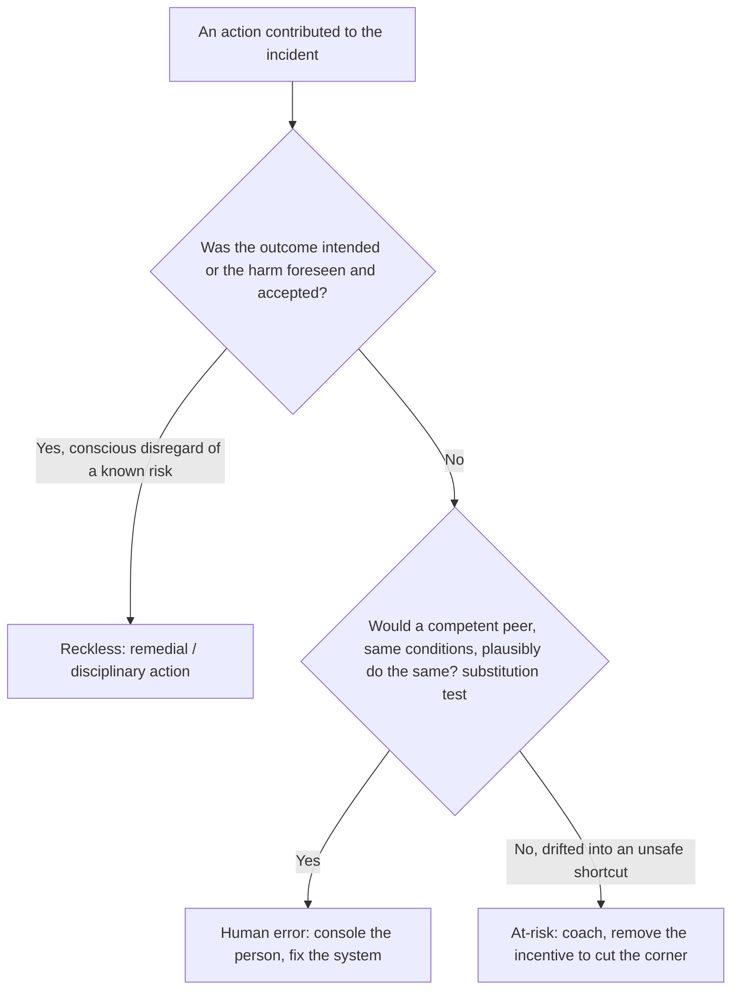

# Blameless Postmortems & Learning

The cultural core of Site Reliability Engineering: **you cannot make a system more
reliable if the people who run it are afraid to tell you what really happened.** A
postmortem (also called an *incident review*, *learning review*, or *retrospective*) is
the written record and structured analysis produced *after* an incident. "Blameless"
means the analysis focuses on **systems, conditions, and contributing factors** — not on
punishing the individuals who happened to be at the controls.

The payoff is not the document itself but the **organizational learning and the tracked,
owned action items** that harden the system so the same failure class cannot recur. A
postmortem with a beautiful timeline and zero follow-through is theater.

Grounded in Google's *Site Reliability Engineering* (Ch. 15, "Postmortem Culture:
Learning from Failure") and *The SRE Workbook* (Ch. 10), Sidney Dekker's *The Field Guide
to Understanding 'Human Error'* and *Just Culture*, Richard Cook's *How Complex Systems
Fail*, John Allspaw's writing on blameless postmortems (Etsy), and the PagerDuty /
Atlassian incident handbooks.

> [!KEY-TAKEAWAY]
> Blameless does **not** mean accountability-free. It means we assume people acted
> reasonably given the information, tools, and incentives they had *at the time*, and we
> fix the **system** that let a reasonable action cause harm. "Human error" is where the
> investigation *starts* (a symptom), not where it *ends* (a cause). The single most
> common failure of postmortem programs is **action items that are never completed.**

Boundaries (cross-reference, don't duplicate):
- **Analysis techniques** — 5 Whys, fishbone/Ishikawa, causal chains, contributing-factor
  trees — belong to `reliability-ops/root-cause-analysis-and-troubleshooting`. Here we
  cover the *postmortem document, culture, and follow-through*.
- **Running the incident** — Incident Command, severity levels, mitigate-before-diagnose,
  MTTR — see `reliability-ops/incident-response-and-command`.
- **How SEV thresholds tie to error budgets** — see
  `reliability-ops/slos-error-budgets-and-velocity-tradeoff` and, for alerting mechanics,
  `observability/slo-based-alerting-and-error-budgets`.
- **Proactively creating failures to learn** — see
  `reliability-ops/chaos-engineering-and-fault-injection`.

---

## What Blameless Means

A **blameless postmortem** analyzes an incident on the assumption that everyone involved
acted with good intentions and made reasonable decisions given the information available
to them *in the moment*. It deliberately avoids the question "who screwed up?" and asks
instead "what about our system made this failure possible, and what made it hard to
detect or recover from?"

The mechanism — **why blamelessness produces more reliable systems**:

1. **Blame drives fear; fear drives hiding.** If naming a mistake gets someone
   disciplined, people stop volunteering the crucial detail ("I skipped the canary
   because the pipeline was flaky and I was under deadline pressure"). You lose exactly
   the information you need to fix the real problem.
2. **Blame stops the analysis one step too early.** "The engineer ran the wrong command"
   *feels* like a root cause, so the investigation halts — leaving the dangerous tool, the
   missing confirmation prompt, and the misleading UI fully intact for the next person.
3. **Individuals are a poor point of leverage.** Firing or retraining one person does not
   change the odds for the next tired, rushed engineer facing the same trap. Fixing the
   *system* (guardrails, defaults, automation, better runbooks) changes the odds for
   everyone.

> [!WARNING]
> Blameless is a property of the **process**, not a magic word. If leadership publicly
> says "blameless" but privately asks "so whose fault was it?", or if the postmortem
> owner is the same person who made the change, engineers will read the incentives
> correctly and self-censor. Culture is what you *reward and punish*, not what you print.

---

## Blameless Is Not Accountability-Free

The most common misreading — and a favorite interview trap — is that "blameless" means
"no consequences, ever." It does not. **Blameless separates *understanding* from
*judgment*, and separates *systemic accountability* from *individual punishment*.**

- **Individual accountability still exists** — but the accountability is *forward-looking*:
  the person who best understands what happened is often the best person to *own the fix*.
  You are accountable for helping the system learn, not for having been present at the
  failure.
- **Reckless or malicious behavior is out of scope for blamelessness.** Sidney Dekker's
  **Just Culture** draws the line explicitly (next subtopic): honest mistakes and normal
  performance variability are learning opportunities; **gross negligence, willful rule-
  breaking, and malice are disciplinary matters.** A blameless *postmortem* is not a
  shield for someone who disabled alerting to hide a problem.
- **Teams and orgs remain accountable** for completing action items and for repeated,
  preventable failures of the *same class*.

> [!INTERVIEW]
> If an interviewer says "blameless just lets people off the hook," respond with the
> Just Culture distinction: honest error → learn and fix the system; reckless/willful
> violation → this is not what blameless covers, and it's handled separately. Blameless
> maximizes *learning*; it does not abolish *judgment*.

---

## Just Culture and the Reckless Line

**Just Culture** (Sidney Dekker; also James Reason) is the framework that reconciles "no
blame for honest mistakes" with "we still hold a line on unacceptable behavior." It
classifies behavior on a spectrum and prescribes a *different* response to each:

| Behavior category | What it is | Just response |
|---|---|---|
| **Human error** | Inadvertent slip, lapse, or mistake — did the wrong thing without meaning to | **Console** the individual; fix the **system** (guardrails, design, process) |
| **At-risk behavior** | A drift into unsafe shortcuts, usually because the safe path is slow/painful and the risk isn't perceived | **Coach**; remove the incentive to cut the corner; make the safe path the easy path |
| **Reckless behavior** | Conscious disregard of a substantial, known risk | **Remedial/disciplinary action** — this is *not* protected by blamelessness |

The key insight: **the same outcome can come from any of the three.** A deleted database
could be an honest slip (error), a normalized "we always skip the confirmation" shortcut
(at-risk), or someone bypassing controls they knew existed (reckless). Just Culture judges
the **behavior and the choices**, not the severity of the outcome — because punishing bad
*outcomes* regardless of *conduct* is exactly what teaches people to hide outcomes.

A decision flow for triaging behavior after an incident:

> [!TIP]
> A useful test (from Just Culture literature) is the **substitution test**: would
> another competent professional, with the same training and under the same conditions,
> plausibly have done the same thing? If yes, it's a system problem, not a person problem.

---

## Human Error as a Symptom (the Second Story)

A central idea from Dekker and Cook: **"human error" is not a cause, it is a symptom of
trouble deeper inside the system.** Stopping at "operator error" is telling the *First
Story* — the tidy, hindsight-driven narrative where the bad outcome makes the human's
choice look obviously wrong.

The **Second Story** asks: *why did that action make sense to that person at that time?*

- People do not come to work to fail. Given their information, workload, tools, and
  incentives, their action was locally rational.
- **Hindsight bias** makes the "correct" path look obvious *after* we know the outcome —
  but the responder was navigating ambiguity in real time, without the answer key.
- Every non-trivial outcome has **multiple contributing factors**, not one root cause.
  Complex systems (Cook) run in a **degraded mode as a normal condition**; incidents
  happen when several latent flaws line up. This is why single-cause "root cause" language
  can mislead — see `reliability-ops/root-cause-analysis-and-troubleshooting`.

Practical consequence for writing postmortems: whenever you find yourself writing "the
engineer should have…", stop and ask **why the system made the wrong thing easy and the
right thing hard.** That "why" is the actual finding.

> [!WARNING]
> **Counterfactuals are a trap.** "If only the on-call had checked the dashboard, this
> wouldn't have happened" describes a fictional world, not the one that occurred. It adds
> no fix. Replace counterfactuals ("should have," "could have," "failed to") with
> descriptions of what *did* happen and what made it hard to do otherwise.

---

## Anatomy of a Postmortem Document

A good postmortem is a *structured* artifact so it's skimmable, comparable across
incidents, and mineable for trends. The canonical sections (Google SRE, Atlassian,
PagerDuty all converge here):

| Section | What it contains | Why it matters |
|---|---|---|
| **Title & metadata** | Date, authors, reviewers, status, SEV level, linked incident | Trackability, trend analysis |
| **Summary** | 2–4 sentences: what broke, blast radius, how it was fixed | Most people read only this |
| **Impact** | Users affected, duration, error-budget burned, revenue/SLA/data-loss | Quantifies severity objectively |
| **Timeline** | Timestamped events: detection → escalation → mitigation → resolution (in UTC) | Reveals detection/response latency |
| **Root cause(s) / contributing factors** | The causal chain and the latent conditions — plural | The learning; feeds RCA methods |
| **Detection** | How was it found (alert? customer?) and how long did that take? | Improves monitoring / MTTD |
| **Resolution / recovery** | What actually mitigated and resolved it | Feeds runbooks |
| **What went well / went badly / where we got lucky** | Candid three-column reflection | "Got lucky" surfaces *silent* risks |
| **Action items** | Owned, tracked, prioritized, due-dated tasks | **The entire point of the exercise** |
| **Lessons learned / supporting data** | Graphs, logs, links | Evidence and reusable knowledge |

Two under-appreciated sections:

- **"Where we got lucky"** is one of the highest-value parts. It surfaces near-misses
  hidden *inside* a real incident — e.g., "the failover would not have worked if the
  incident had happened during peak traffic" — risks that produced no visible harm this
  time but will next time.
- **Impact must be quantified**, not hand-waved. "Big impact" is not a metric. Prefer:
  *"~4.2M requests failed (14% of traffic) over 37 minutes; ~26% of the monthly error
  budget consumed; est. \$X revenue; no data loss."*

---

## Action Items: the Whole Point (and the Common Failure)

Everything else in a postmortem is documentation; the **action items are the only part
that changes the future.** The overwhelming, industry-wide failure mode of postmortem
programs is not writing bad analyses — it's **writing good analyses whose action items
are never completed.**

Every action item must be **SMART-ish** and, crucially:

- **Owned by a named individual** (not "the team" — diffuse ownership = no ownership).
- **Tracked in the same system as normal work** (Jira/ticketing), not buried in the doc,
  so it's visible on a backlog and can't silently evaporate.
- **Prioritized and due-dated**, and ideally **prioritized against feature work by the
  same process** — otherwise "reliability debt" always loses to the roadmap.
- **Concrete and verifiable.** Distinguish item *types*: **mitigate** (reduce impact next
  time), **prevent** (stop recurrence), **detect** (find it faster), **process**
  (change how we respond).

> [!WARNING]
> **"Be more careful" / "add more training" / "remind the team" are non-actionable
> anti-patterns.** They put the fix back on fallible humans and change nothing systemic.
> Bad: *"Engineers should double-check the region before running the script."* Good:
> *"Add a `--region` confirmation prompt to the deploy script and a dry-run default
> (owner: @alice, due: 2026-08-15, JIRA-1234)."* The good version removes the trap; the
> bad version reinstalls it.

Follow-through mechanisms that work in practice:
- Review open postmortem action items in a **recurring reliability/ops review**.
- Track **completion rate and age** of action items as a program health metric.
- Give high-priority action items an **SLA/deadline** proportional to severity (e.g., SEV1
  P0 items due within 30 days).
- Don't close the postmortem when the incident is resolved — close it when its **critical
  action items ship.**

---

## When to Write a Postmortem: Triggers

You cannot postmortem everything, and postmortems are expensive (hours of senior time).
Define **objective triggers in advance** so writing one is never a negotiation or an
implicit accusation. Common triggers (from Google SRE):

- **User-visible downtime or degradation** beyond a threshold (often tied to **SLO /
  error-budget** burn — see `reliability-ops/slos-error-budgets-and-velocity-tradeoff`).
- **Data loss** of any kind.
- **On-call engineer intervention** was required (rollback, failover, manual traffic
  drain).
- **A resolution time above threshold** (slow to detect or slow to mitigate).
- **A monitoring/detection failure** — the incident was found by a *customer*, not an
  alert (this itself is a finding).
- **A severity threshold** (e.g., SEV1/SEV2 always get one; see
  `reliability-ops/incident-response-and-command` for SEV definitions).
- **Repeated incidents** of the same class, even if each is individually minor.
- **Anyone requests one** — a postmortem should never require justification, and asking
  for one must never be seen as blaming.

> [!TIP]
> Make writing a postmortem a *badge of honor*, not a punishment. Google's culture treats
> a well-written postmortem as evidence of engineering maturity. If the *act* of writing
> one signals "you failed," you've reintroduced blame through the back door.

---

## Near-Miss Analysis

A **near-miss** (or "close call") is an event that *could* have caused a serious incident
but didn't — because of luck, a redundant safeguard that happened to hold, or a timely
manual catch. Examples: a bad deploy caught by canary before full rollout; a cert that
expired on a standby but not the primary; disk hitting 99% but drained just in time.

Why near-misses are gold:

- They carry **almost all the learning of a real incident at almost none of the customer
  cost.** The latent flaws were fully exercised; only the final harm was avoided.
- **Heinrich's safety pyramid** (from industrial safety) posits that serious incidents sit
  atop a much larger base of minor incidents and near-misses sharing the same causes —
  so mining near-misses lets you prevent the big one *before* it happens.
- They expose **eroding safety margins** and normalization of deviance (the "where we got
  lucky" section, promoted to a first-class trigger).

The catch: near-misses produce no alarm and no customer pain, so **nobody is forced to
look at them** — they must be *deliberately* solicited and rewarded, or they vanish. A
blameless culture is a prerequisite: people only report their own near-misses if doing so
is safe.

---

## Postmortem Anti-Patterns

| Anti-pattern | Why it's harmful | Fix |
|---|---|---|
| **Blaming an individual** ("root cause: operator error") | Halts analysis, drives hiding | Ask the Second Story: why was the wrong action easy? |
| **Counterfactuals** ("should have checked X") | Describes a fiction, prescribes nothing | Describe what happened + what made it hard |
| **Non-actionable items** ("be more careful", "add training") | Reinstalls the human trap; changes nothing | System guardrails: prompts, defaults, automation |
| **Unowned / untracked action items** | Never get done — the #1 program failure | Named owner + ticket + due date + review cadence |
| **Single "root cause" tunnel vision** | Complex failures have many contributing factors | List contributing factors; use RCA methods |
| **Hindsight bias** | Makes past decisions look obviously wrong | Judge decisions on info available *at the time* |
| **Postmortem as theater** | Doc looks great, nothing changes | Track completion; close on action items, not incident |
| **Writing one only for SEV1s** | Misses cheap learning from near-misses/small ones | Trigger on data loss, no-alert detection, near-miss |
| **Skipping the "got lucky" section** | Hides silent risks that will bite next time | Make it mandatory |

---

## Common Interview Follow-ups

- *"What does 'blameless' actually mean — does nobody get held accountable?"* Blameless
  = analyze systems and assume good-faith, locally-rational behavior; it separates
  understanding from punishment. Accountability still exists (owning fixes; org owns
  completing action items; reckless/willful behavior is handled separately via Just
  Culture). Blameless maximizes learning, not impunity.
- *"Why is 'human error' not an acceptable root cause?"* It's a symptom, not a cause.
  Stopping there leaves the systemic trap intact and drives people to hide mistakes. Ask
  the Second Story: why did that action make sense at the time?
- *"Your action item is 'the engineer will be more careful next time.' Critique it."*
  Non-actionable — it relies on fallible humans and changes no system. Replace with a
  guardrail (confirmation prompt, safe default, automation) that removes the trap; owned,
  ticketed, due-dated.
- *"When should a team write a postmortem?"* On predefined objective triggers: SEV
  threshold, data loss, user-visible SLO breach, on-call intervention, customer-detected
  (monitoring gap), repeat incidents, or on request — never as a negotiation.
- *"How do you keep action items from rotting?"* Named owners, tracked in the normal
  backlog, prioritized against features, reviewed in a recurring ops review, with
  completion-rate as a program metric; don't close the postmortem until critical items
  ship.
- *"What's a near-miss and why analyze it?"* A close call that didn't cause harm; it has
  nearly all the learning at nearly none of the cost (Heinrich pyramid). Requires a
  blameless culture to be reported at all.
- *"How does Just Culture handle someone who genuinely acted recklessly?"* Blamelessness
  covers honest error and at-risk drift (console/coach + fix system); reckless conscious
  disregard of known risk is a disciplinary matter and is *not* what blameless protects.
- *"How do postmortems connect to error budgets?"* SLO/error-budget burn is a common
  postmortem trigger and a way to quantify impact objectively; see
  `reliability-ops/slos-error-budgets-and-velocity-tradeoff`.

## References

- Beyer, Jones, Petoff, Murphy (eds.), *Site Reliability Engineering* (Google/O'Reilly,
  2016), Ch. 15 "Postmortem Culture: Learning from Failure."
- Beyer et al. (eds.), *The Site Reliability Workbook* (Google/O'Reilly, 2018), Ch. 10
  "Postmortem Culture: Beginning to End."
- Sidney Dekker, *The Field Guide to Understanding 'Human Error'* (3rd ed., 2014).
- Sidney Dekker, *Just Culture: Balancing Safety and Accountability* (2nd ed., 2012).
- Richard Cook, *How Complex Systems Fail* (1998/2000).
- John Allspaw, "Blameless PostMortems and a Just Culture" (Etsy/Code as Craft, 2012).
- James Reason, *Managing the Risks of Organizational Accidents* (1997) — Swiss Cheese
  model, "human error" classification.
- PagerDuty Postmortem Documentation; Atlassian Incident Handbook — Postmortems.
