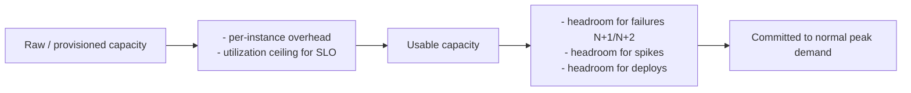
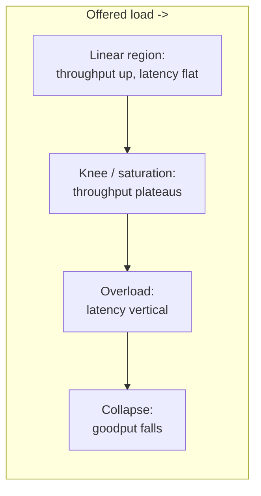

# Capacity Planning & Load Management

**Capacity planning** is the discipline of ensuring a system has *enough resources to meet
demand at its target reliability* — no more (that wastes money), no less (that causes outages).
It answers three questions: *how much load is coming?* (forecasting), *how much can one unit
serve before it degrades?* (load testing / benchmarking), and *how much slack do we keep in
reserve?* (headroom). **Load management** is the runtime complement: when demand approaches or
exceeds provisioned capacity, how do you *shape* it (autoscale, queue, shed, rate-limit) so the
system degrades gracefully instead of collapsing.

The whole field rests on one counter-intuitive fact from queueing theory: **you cannot safely
run a system at 100% utilization**. As utilization approaches 1.0, latency does not rise
linearly — it goes *vertical* (the hockey-stick / "M/M/1 wall"). So capacity planning is really
about deciding *how far below the cliff* you want to operate, and buying/holding enough resource
to stay there through your worst realistic spike.

> [!KEY-TAKEAWAY]
> Capacity planning is a **risk/cost trade-off**, not a math problem with one right answer.
> More headroom = higher cost, lower risk of overload; less headroom = cheaper, but you're
> closer to the latency cliff and depend more on fast autoscaling and load shedding as
> backstops. Provision for your forecast **plus headroom**, then use load management to absorb
> the forecast error.

**Boundaries (cross-reference, don't duplicate):** for *how you measure* utilization/saturation
and alarm on it (the four golden signals, PromQL, dashboards) see `observability/*`; for the
*mechanics of shedding excess load* (goodput, admission control, backpressure) see
`reliability-ops/load-shedding-and-backpressure`; for *rate-limiter design/algorithms* see
`system-design/design-rate-limiter` and for *rate limiting as abuse prevention* see `security/*`;
for *deploy/autoscaling pipeline mechanics and IaC* see `devops-cicd/*`; for the *theoretical
scalability trade-offs* see `system-design/*`; for *load-test correctness details* see
`testing/*` (load testing).

---

## Provisioned vs Usable Capacity

A frequent planning error is treating the number on the invoice as the capacity you can serve
with. Distinguish three layers:

| Layer | Meaning |
|---|---|
| **Provisioned / raw capacity** | What you paid for / spun up — e.g. 20 instances × 8 vCPU. |
| **Usable capacity** | What you can actually drive *while staying within SLO* — always lower, because of the utilization wall, per-instance overhead (OS, sidecars, GC), and reserved headroom. |
| **Effective / redundant capacity** | Usable capacity *after* subtracting what must survive the loss of a failure domain (a node, an AZ). This is the number that matters for a redundancy target. |

**Rule of thumb:** if the latency SLO forces you to keep CPU below ~60–70%, then usable capacity
is only ~60–70% of raw *before* you even reserve headroom for failures and growth. Planning as if
100% of provisioned capacity is usable is how teams end up over the cliff during a normal spike.

> [!WARNING]
> "We have 20 servers and each does 1,000 rps in a benchmark, so we can serve 20,000 rps" is
> almost always wrong. The benchmark number is peak *throughput*, often measured at 100%
> utilization with unrealistic latency; usable rps at SLO is much lower, and you must still
> reserve capacity to lose a node/AZ.

---

## Forecasting Demand: Organic Growth, Events & Seasonality

You provision against *forecast peak*, not average. Good forecasts decompose demand into
components and add them:

- **Organic growth** — the baseline trend (user growth, adoption). Often modeled as a
  compound growth rate. A 5%/month growth compounds to **~1.8×** in a year (`1.05^12 ≈ 1.80`);
  10%/month is **~3.1×** (`1.10^12 ≈ 3.14`). Small monthly rates are large annual ones.
- **Seasonality** — recurring cycles: daily (diurnal peak), weekly (weekday vs weekend),
  yearly (retail: Black Friday/Cyber Monday, Prime Day; tax season; back-to-school).
- **Events / launches** — discrete, often *non-organic* spikes: a marketing push, a product
  launch, a viral moment, a Super Bowl ad. These are the ones that break systems because they
  are large, sudden, and poorly predicted by trend lines.

**Two forecasting styles (Google SRE):**

| Approach | Basis | Good for |
|---|---|---|
| **Organic / bottom-up** | Extrapolate historical usage trends + known seasonality. | Steady-state growth, recurring peaks. |
| **Inorganic / top-down** | Business-driven: "marketing expects 5M signups on launch day." | Launches, one-off events with no historical signal. |

Always combine: forecast peak = *organic-trend peak* × *seasonal multiplier* + *event uplift*,
then provision for that with headroom. Forecast against the **peak-of-peaks** (e.g. the busiest
minute of Black Friday), not the daily or monthly average — that's the moment you must survive.

> [!TIP]
> Track forecast **accuracy** as a metric. Systematically under-forecasting means you'll be
> caught short; chronic over-forecasting means you're burning money. Feed misses back into next
> cycle's model.

---

## Headroom: N+1 / N+2 and Why Not to Run at 100%

**Headroom** is deliberately unused capacity held in reserve. It exists to absorb three things
simultaneously: (1) **failures** — you must keep serving if a unit dies; (2) **spikes** — demand
above forecast; (3) **latency** — the utilization wall means you *want* to run below saturation
even with no failures.

**Redundancy notation (N is the capacity needed to serve peak demand at SLO):**

| Model | Meaning | Survives |
|---|---|---|
| **N** | Exactly enough to serve peak. No spare. | Nothing — one failure = overload. |
| **N+1** | One spare unit beyond peak need. | Loss of any *one* unit. |
| **N+2** | Two spares. | Two simultaneous failures (or one failure *during* maintenance). |
| **2N** | Full duplicate. | Loss of an entire set/site. |
| **2(N+1)** | Redundant, each side itself N+1. | Common in high-tier data-center/DR designs. |

For **multi-AZ** services the practical target is often "survive the loss of one AZ at peak."
If you run in 3 AZs, each must be able to absorb the traffic of a failed AZ, so each AZ runs at
**~2/3 utilization max** — losing one leaves two carrying the full load. In 2 AZs you'd need each
at ≤50%. This is why AZ redundancy is expensive: you pay for slack that is idle in the normal case.

**Why not 100%?** Beyond the latency-cliff reason (next section), running at 100% leaves *zero*
room to: deploy (rolling deploys temporarily remove capacity), absorb a bad GC pause or noisy
neighbor, or handle the retry surge when something briefly hiccups. Typical steady-state CPU
targets for latency-sensitive services sit around **50–70%**; batch/throughput systems can run
hotter (80–90%) because they tolerate queueing.



---

## Little's Law and the Utilization Wall

**Little's Law** is the fundamental relation of queueing systems, and it holds for *any* stable
system regardless of arrival distribution:

```
L = λ × W
```

- **L** = average number of requests *in the system* (in service + waiting)
- **λ** (lambda) = average arrival rate (requests/sec)
- **W** = average time a request spends *in the system* (latency, including queue wait)

It's used constantly in capacity work. Examples:
- **Concurrency needed:** at λ = 2,000 rps with W = 50 ms, `L = 2000 × 0.05 = 100` requests in
  flight — so you need ~100 concurrent workers/threads (plus headroom) to keep up.
- **Thread-pool / connection-pool sizing:** pool size must be ≥ L or requests queue.
- **Max throughput of a fixed pool:** with 200 threads and W = 100 ms, `λ_max = L/W = 200/0.1 =
  2,000 rps`. Push past that and W (latency) rises to keep the equation balanced — the queue grows.

**The utilization wall (M/M/1 model):** for a single server with random arrivals and service
times, the average response time scales as:

```
W = S / (1 − ρ)          where S = service time, ρ = utilization (0..1)
```

The `1/(1−ρ)` term is the killer. As ρ climbs:

| Utilization ρ | Latency multiplier `1/(1−ρ)` |
|---|---|
| 50% | 2× service time |
| 70% | ~3.3× |
| 80% | 5× |
| 90% | 10× |
| 95% | 20× |
| 99% | 100× |

This is the **hockey stick**: latency is nearly flat until ~70–80%, then goes vertical. It's why
"we're only at 85% CPU, we're fine" is dangerous — you're already on the steep part of the curve,
and a small demand increase produces a huge latency jump. Parallelism (more servers, M/M/c)
softens the knee but does not remove it. This queueing reality is *the* mathematical justification
for holding headroom.

> [!INTERVIEW]
> If asked "why can't we just run servers at 100% to save money?" the crisp answer is Little's
> Law plus the `1/(1−ρ)` response-time curve: near full utilization, queue depth and latency
> diverge, so a system at 100% util has effectively *infinite* tail latency and no slack to
> absorb variance or failures. You trade a little idle cost for bounded latency.

---

## Load Testing: Load vs Stress vs Soak vs Spike

You cannot plan capacity from specs alone — you must *measure* how the real system behaves under
load. The four canonical test types answer different questions:

| Test type | What it does | Question it answers |
|---|---|---|
| **Load test** | Drive expected/target load (e.g. forecast peak) and hold. | "Do we meet SLO at our expected peak?" |
| **Stress test** | Push load *past* expected peak until the system breaks. | "Where is the breaking point, and *how* does it break?" |
| **Soak / endurance test** | Sustain moderate load for hours/days. | "Do we degrade over time — memory leaks, fd leaks, disk fill, cache bloat, log growth?" |
| **Spike test** | Apply a sudden, sharp jump in load, then drop. | "Can we survive a flash crowd / can autoscaling react in time?" |

Two more you'll hear:
- **Capacity / scalability test** — step load up in stages to map the throughput-vs-latency curve
  and find the knee (next section).
- **Volume test** — large *data* volumes rather than request rate (big tables, large payloads).

**Trade-offs / gotchas:**
- Load tests must use **realistic traffic mix and data** — cache hit rates, payload sizes, and
  key distributions dominate real behavior. Testing all-cache-hit traffic wildly overstates
  capacity.
- Test **against dependencies** (or realistic mocks). A service that looks fine in isolation can
  fall over because a downstream DB is the true bottleneck.
- **Soak tests catch what short tests can't:** a memory leak that OOMs after 6 hours is invisible
  in a 10-minute load test but will page you at 3 a.m. in production.
- Prefer testing in **prod or a prod-like environment** (Google's preference); a scaled-down
  staging env has different bottlenecks. See `testing/*` for methodology and `devops-cicd/*` for
  running these in a pipeline.

---

## Finding the Knee: Saturation Point & Capacity Limits

To size capacity you need the **knee** (a.k.a. saturation point or "point of maximum sustainable
throughput"): the load level beyond which latency degrades faster than throughput improves.

Run a **step / ramp test**: increase offered load in stages and plot two curves — *throughput
(completed rps)* and *latency (p50/p99)* against offered load.

- Below the knee: throughput rises ~linearly with offered load, latency stays roughly flat.
- **At the knee:** throughput flattens (you've hit a bottleneck — CPU, a lock, connection pool,
  DB); adding load no longer adds goodput.
- Past the knee: latency shoots up (utilization-wall region); eventually throughput can *fall*
  (thrashing, retries, congestive collapse) — this is the difference between the **saturation
  point** and the **collapse point**.

**Plan capacity at the knee, not the collapse point.** The maximum *usable* per-unit throughput
is the knee value, minus your headroom. Provisioning to the collapse point means production runs
in the unstable region where a tiny nudge triggers a cascading failure (see
`reliability-ops/cascading-failures-and-antipatterns`).

Identify the *binding constraint* at the knee (Amdahl-style bottleneck analysis): is it CPU, a
single-threaded lock, GC, connection-pool exhaustion, disk IOPS, or a downstream limit? The
bottleneck determines the right autoscaling metric — scaling on CPU is useless if the real limit
is a fixed DB connection pool.



---

## Coordinated Omission: The Load-Test Measurement Trap

**Coordinated omission** (coined by Gil Tene) is a systematic *measurement error* that makes load
tests report latency far better than reality — often hiding the worst tail entirely.

**The mechanism:** most load generators work in lockstep — send a request, *wait for the response*,
then send the next. When the server stalls (a GC pause, a lock, a slow dependency), the load
generator **stops sending** during the stall. So the very requests that *would* have experienced
the long queue wait are never issued — the tool "coordinates" its omission of samples with exactly
the periods of bad latency. The result: a 100 ms stall that in production would have delayed
*thousands* of queued requests shows up as a *single* slow sample, and your p99 looks great.

**A concrete illustration:** a system is supposed to serve 10,000 rps but freezes for 1 second.
In production, ~10,000 requests arrive during that freeze and each waits up to 1 s — a huge tail.
A naive load generator sends *one* request, waits 1 s, and records one 1-second sample; every
other measurement is a fast, post-stall response. Reported p99 ≈ a few ms; true p99 ≈ ~1 s.

**How to avoid it:**
- Use load tools that model an **open workload** / constant arrival rate independent of responses
  (send on schedule regardless of whether prior requests returned), e.g. `wrk2`, and correction
  modes in `HdrHistogram` / Gatling / k6.
- **Back-correct**: for any response that took longer than the intended send interval, synthesize
  the samples that *should* have been sent during the stall.
- Measure against a **fixed schedule** (intended start time), not just service time — report
  latency as `now − intended_send_time`, capturing queue wait the tool would otherwise omit.

> [!WARNING]
> Coordinated omission is why teams are shocked when production tail latency is 10–100× worse than
> the load test predicted. If a benchmark's throughput and latency both look great and the numbers
> came from a closed-loop tool, distrust the tail. See `testing/*` for load-test methodology.

---

## Autoscaling: Reactive vs Predictive vs Scheduled

Autoscaling adjusts capacity to track demand so you don't pay for peak 24/7. Three strategies:

| Strategy | How it decides | Strength | Weakness |
|---|---|---|---|
| **Reactive / dynamic** | React to *current* metrics crossing a threshold (CPU > 60% → add instances). | Simple, needs no forecast, follows real demand. | Always **lagging** — scales *after* load arrives; blind to sudden spikes. |
| **Scheduled** | Scale on a *calendar* (add capacity at 08:00, before the daily peak or a known launch). | Great for predictable diurnal/event patterns; capacity is ready *before* demand. | Useless for unexpected spikes; wastes money if the event doesn't materialize. |
| **Predictive** | ML/forecast of near-future demand → pre-scale (e.g. AWS Predictive Scaling). | Anticipates recurring patterns, warms capacity ahead of the curve. | Only as good as the forecast; mispredicts novel events. |

**Best practice:** combine them. Use **scheduled/predictive** to have baseline capacity ready for
known peaks, and **reactive** as the safety net for the unforecastable. Also scale in two
dimensions: **horizontal** (add/remove instances — the usual autoscaling) and **vertical**
(bigger instances — limited, disruptive, has a ceiling).

Key config levers and their trade-offs:
- **Target utilization** — the metric setpoint (e.g. 50% CPU). Lower = more headroom, faster to
  absorb spikes, higher cost.
- **Cooldown / stabilization window** — prevents *flapping* (rapid scale in/out). Too short →
  thrash; too long → sluggish response.
- **Scale-in caution** — scale *out* fast, scale *in* slow. Removing capacity too aggressively
  right before the next spike causes an outage.

---

## Autoscaling Isn't Instant: Scale-Up Lag & the Right Metric

The most common autoscaling misconception is that it's instantaneous. It is not — there is a
**provisioning delay** between deciding to scale and having warm, serving capacity:

```
detect (metric scrape + eval + breach duration)
  → decide (cooldown/threshold)
  → launch instance (boot, ~1–several min)
  → bootstrap (pull image/deps, warm caches, JIT warmup)
  → register (health checks pass, LB adds to pool)
```

This end-to-end lag is commonly **minutes** (EC2 boot + app warmup; a large container image or
JVM warmup adds more). A **spike that arrives in seconds will overwhelm you before new capacity
is ready** — which is why autoscaling *alone* cannot handle flash crowds. You need:

- **Standing headroom** to absorb load during the scale-up window.
- **Warm pools / pre-provisioned instances** (kept booted, ready to serve) to shrink lag.
- **Load shedding** as the immediate backstop while capacity spins up (see
  `reliability-ops/load-shedding-and-backpressure`).

**Scale on the right metric.** The autoscaling signal must be the *actual bottleneck* and, ideally,
a **leading** indicator:
- CPU is the default but is wrong when the limit is I/O, memory, a connection pool, or a downstream.
- For request-serving systems, scale on a **per-instance load metric** like requests-in-flight,
  queue depth, or **RPS/target** — these lead CPU and map to Little's Law.
- **Never scale on a lagging/global average that the scaling action doesn't affect.** Classic
  anti-pattern: scaling a queue-consumer fleet on *consumer* CPU when the real signal is **queue
  backlog / age of oldest message** — scale on the backlog.

> [!WARNING]
> **Autoscaling can amplify a failure.** If instances are crashing (OOM, bad deploy) and the
> scaler interprets rising per-instance load as "need more capacity," it launches replacements
> that also crash — or, worse, scales *down* healthy capacity because a dependency outage made
> traffic drop. Guard with health checks, min/max bounds, and alarms on scaling activity itself.

---

## Overprovisioning: Cost vs Risk

Overprovisioning — running more capacity than the forecast requires — is *buying insurance
against overload*. The core trade-off:

- **More headroom / overprovision:** lower risk of SLO breach and outage; tolerates forecast
  error, spikes, and failures gracefully; but **higher cost** (idle resources) — and idle
  capacity is pure waste.
- **Lean / just-in-time:** cheaper; but you lean hard on **fast autoscaling + load shedding** as
  backstops, and you're one bad forecast away from an outage.

Frame it as expected cost: `E[cost] = cost_of_idle_capacity` vs `E[loss] = P(overload) ×
cost_of_an_outage`. If an outage is very expensive (revenue, trust, SLA penalties), a lot of
headroom is *rational*. For a low-stakes internal tool, running lean and eating the occasional
degradation is fine.

**Tactics that cut the cost of headroom without cutting the safety:**
- **Cheaper reserve capacity** — spot/preemptible instances or a warm pool for the buffer, on-demand
  for the baseline.
- **Load shedding + graceful degradation** — lets you provision closer to the forecast because
  the failure mode is "shed low-priority traffic" instead of "collapse."
- **Multi-tenancy / bin-packing** — smooth uncorrelated demand across services so aggregate peak <
  sum of individual peaks.
- **Autoscaling** — turns fixed overprovisioning into demand-following capacity (bounded by
  scale-up lag).

> [!INTERVIEW]
> There's no universally "right" utilization target. The answer an interviewer wants is the
> *reasoning*: "It depends on cost of an outage vs cost of idle capacity, how spiky demand is,
> how fast we can autoscale, and whether we can shed load. A latency-sensitive revenue service
> with slow autoscaling wants lots of headroom; a batch pipeline can run hot."

---

## Demand Shaping: Shed, Queue, Rate-Limit

When demand exceeds capacity *right now* — faster than you can add capacity — you manage the
*demand* side. This is **load management** proper. Three levers:

| Lever | What it does | Best for | Cost |
|---|---|---|---|
| **Shed** | Reject excess requests fast (`503`/`429`) so accepted work stays healthy. | Interactive traffic where a fast failure beats a slow one; protects goodput. | Some users get errors (ideally low-priority ones first). |
| **Queue / buffer** | Accept and defer work to smooth bursts. | Async / batch work that tolerates delay. | Adds latency; **bounded** queues only — an unbounded queue just delays collapse (see below). |
| **Rate-limit / throttle** | Cap per-client/per-tenant request rate. | Fairness, protecting shared capacity from one noisy tenant. | Clients must handle throttling / back off. |

**Queueing caveat (critical):** a queue converts overload into *latency and memory growth*, not
into free capacity. If arrival rate stays above service rate, a queue grows without bound → OOM /
timeouts (Little's Law: W → ∞). Queues only help absorb **bursts** that fit within the average
capacity. Under *sustained* overload you must shed or apply backpressure. Use **bounded** queues
and treat a full queue as a shed signal.

**Prioritization:** shed *the right* traffic first — drop low-priority/best-effort work (background
refreshes, prefetch, non-critical analytics) and protect high-value/critical requests (checkout,
auth). Criticality-aware shedding preserves the most business value per unit of capacity.

For the full treatment of the mechanics — admission control, backpressure, goodput, LIFO vs FIFO
queues, deadline propagation — see `reliability-ops/load-shedding-and-backpressure`. For limiter
algorithms (token bucket, leaky bucket, sliding window) see `system-design/design-rate-limiter`.
For *how you measure* saturation and queue depth to trigger these, see `observability/*`.

---

## Common Interview Follow-ups

- **"Why can't we run servers at 100% utilization?"** — Little's Law + `W = S/(1−ρ)`: near full
  utilization latency and queue depth diverge; no slack for variance, deploys, or failures.
- **"How much headroom should we keep?"** — Depends on cost of outage vs idle cost, spikiness,
  autoscaling speed, and shedding ability. For AZ redundancy, size so surviving AZs carry full
  peak (e.g. ≤2/3 util across 3 AZs).
- **"Traffic will 3× at a launch — how do you prepare?"** — Inorganic (top-down) forecast from the
  business, load/stress test to that level, pre-scale (scheduled) capacity + warm pools, verify
  downstream dependencies scale too, and have load shedding + a runbook ready as backstops.
- **"Our load test looks great but prod tail latency is terrible — why?"** — Suspect coordinated
  omission (closed-loop generator omitting samples during stalls); re-test with an open-workload
  tool (wrk2/k6) or HdrHistogram correction. Also check realistic traffic mix and dependency load.
- **"Autoscaling is on — why did we still have an outage during the spike?"** — Scale-up lag
  (minutes to boot/warm/register) can't keep up with a seconds-scale spike; need standing headroom,
  warm pools, and load shedding to bridge the gap. Or you scaled on the wrong metric.
- **"CPU-based autoscaling isn't working for our queue workers."** — Scale on **queue backlog / age
  of oldest message**, not consumer CPU; the backlog is the leading, causal signal.
- **"Is adding a queue enough to handle overload?"** — No. A queue smooths *bursts* but converts
  *sustained* overload into unbounded latency/memory. Use bounded queues + shedding/backpressure.
- **"Provisioned vs usable capacity?"** — Raw purchased capacity ≠ what you can serve at SLO;
  subtract utilization ceiling, overhead, and failure/spike headroom.

## References

- Beyer, Jones, Petoff, Murphy (eds.), *Site Reliability Engineering* (Google), esp. ch. "Software
  Engineering in SRE / Handling Overload" and "Managing Load"; and *The Site Reliability Workbook*,
  "Managing Load."
- Michael T. Nygard, *Release It!* (2nd ed.) — stability patterns, capacity anti-patterns,
  Unbalanced Capacities, and load-management patterns.
- AWS Well-Architected Framework — **Reliability Pillar** ("Manage demand and supply resources",
  workload/service quotas) and **Cost Optimization Pillar** (right-sizing, demand-based supply).
- Gil Tene, "How NOT to Measure Latency" (talk) — the definitive treatment of **coordinated
  omission** and HdrHistogram.
- John D. C. Little, "A Proof for the Queuing Formula: L = λW" (1961); Kendall notation & M/M/1
  response-time results (standard queueing theory).
- AWS Auto Scaling docs — target tracking, scheduled scaling, and **predictive scaling**;
  warm pools.
- Brendan Gregg, *Systems Performance* — the USE method and saturation/knee analysis.
