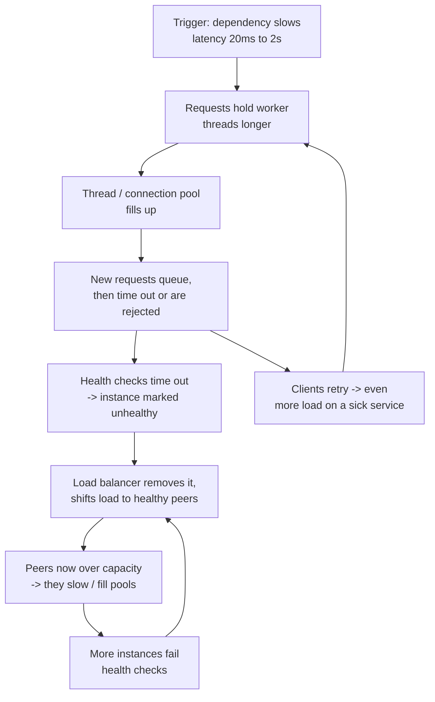
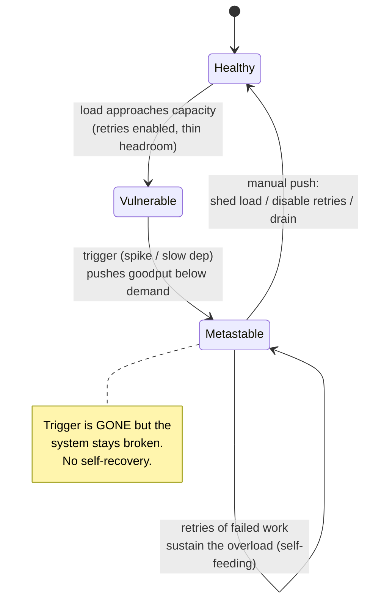
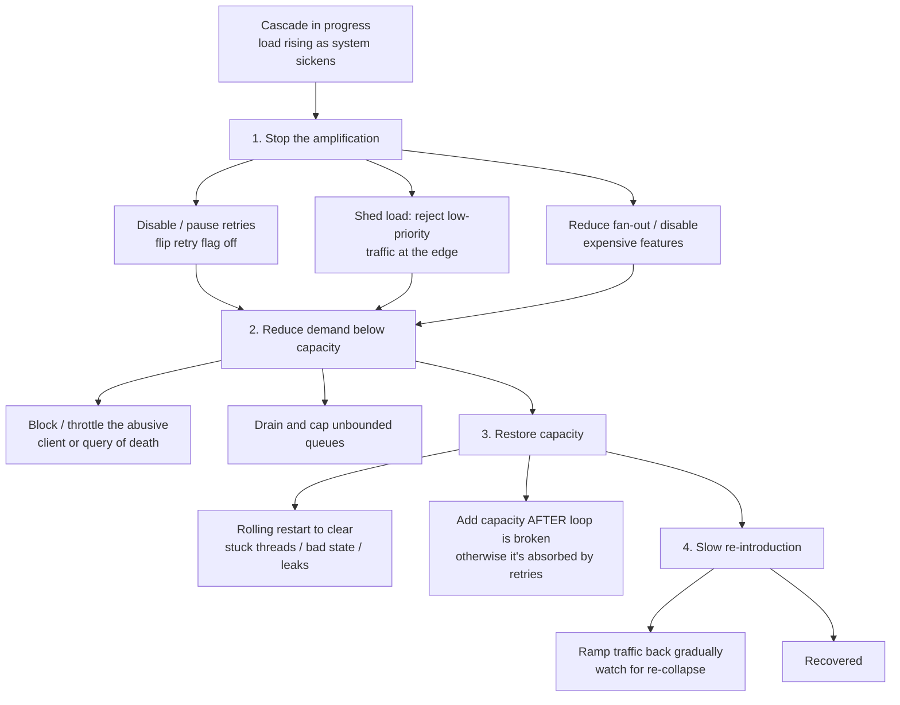

# Cascading Failures & Resilience Anti-Patterns

A **cascading failure** is a failure that grows by contagion: one component saturates or dies,
the extra load or errors it produces overwhelm the next component, which fails and pushes the
problem further out — until a large fraction of the system is down, often far away from the
original trigger. This topic is about **how systems collapse** and **what NOT to do** — the
stability anti-patterns from Michael Nygard's *Release It!* and the "Addressing Cascading
Failures" chapter of the Google SRE book — plus the recovery playbook for pulling a system out
of one.

The recurring villain is the **positive feedback loop**: some mechanism (retries, health-check
restarts, growing queues) that was meant to improve reliability instead *amplifies* the load or
error rate, so the system drives itself further from health instead of back toward it. The most
dangerous variant is the **metastable failure**, which keeps the system broken *even after the
original trigger is gone*, because a sustaining loop now holds it in the bad state.

> [!KEY-TAKEAWAY]
> Cascading failures are almost never a single component "just breaking." They are an
> **overload spreading through a feedback loop**. The core skills are (1) recognizing the loop,
> (2) breaking it — usually by *shedding load and disabling retries* — before adding capacity,
> and (3) designing so the loop cannot form: timeouts everywhere, bounded queues, capped and
> jittered retries, circuit breakers, and isolation (bulkheads) so one failure cannot become
> everyone's failure.

> [!INTERVIEW]
> High-frequency probes: *"walk me through how one slow dependency takes down a whole service"*
> (thread-pool exhaustion), *"what is a metastable failure and why won't it self-heal?"*,
> *"a service is in a retry storm — what do you do RIGHT NOW?"* (shed load / disable retries,
> not "add capacity first"), *"why add jitter to retries and backoff?"* (thundering herd),
> *"what is a cache stampede and three ways to fix it?"*, and *"a fix made it worse — what
> positive feedback loop did you create?"*. This topic pulls together `retries-timeouts-and-backoff`,
> `circuit-breakers-and-bulkheads`, and `load-shedding-and-backpressure` into failure *scenarios*.

---

## What a cascading failure is

A cascading failure is a **self-reinforcing loss of serving capacity that spreads across
components over time**. It has three defining traits:

1. **A trigger** — the initial perturbation. Often mundane: a deploy, a traffic spike, a slow
   dependency, a failed node that shifts its load onto its peers, a config push, a cache flush.
2. **Propagation** — the trigger overloads a neighbour, which fails or slows, which overloads
   *its* neighbour. Failure travels along the call graph (fan-out) and along shared resources.
3. **Amplification (feedback)** — a loop makes each round *worse* than the last. Without a loop
   you get a bounded, localized outage; with one you get a cascade.

The canonical trigger→cascade path in a request-serving system:



Note the two loops closing back (`D2 → E → F → D2` health-check death spiral, and
`R → A` retry storm). Those loops are what turn a slowdown into an outage.

> [!TIP]
> A blunt diagnostic question in interviews and incidents alike: *"is load going UP as the
> system gets sicker?"* If yes, you have a positive feedback loop and adding capacity may not
> help — you must break the loop first.

---

## The thread-pool / resource-exhaustion mechanism

This is the single most-tested mechanism, so know it cold. It is the concrete plumbing behind
"a slow dependency took us down."

A synchronous service serves requests from a bounded pool of workers (threads, or a connection
pool to a DB). Each in-flight request **holds a worker for its entire duration**. By Little's
Law, the number of workers busy at steady state is:

```
concurrency (L) = arrival_rate (λ) × latency (W)
```

So if latency `W` rises, the number of simultaneously-busy workers rises *proportionally* even
though the request *rate* is unchanged. Worked example:

- Normal: λ = 500 req/s, W = 20 ms → L = 500 × 0.020 = **10 threads busy**. A 200-thread pool
  is 95% idle.
- A dependency slows to W = 2 s (100× worse). λ unchanged at 500 req/s → L = 500 × 2 =
  **1000 threads needed**. The 200-thread pool is exhausted **5× over**.

Once the pool is exhausted: new requests queue (if there's a queue) or are rejected; **all**
endpoints on the service stall — including ones that don't even touch the slow dependency,
because they can't get a thread. The service now *looks* down to everyone, and its own callers
begin the same process one hop up the graph. That is how a slowdown in *one* dependency becomes
a total, service-wide, graph-wide outage.

> [!WARNING]
> The killer detail: **a slow dependency is more dangerous than a dead one.** A dependency that
> fails *fast* (connection refused in 1 ms) frees the thread immediately and the damage is
> contained. A dependency that is merely *slow* holds every thread hostage. This is exactly why
> **aggressive timeouts** are the first line of defence — a timeout converts "slow" into "fast
> failure," releasing the resource. See `retries-timeouts-and-backoff`.

**Defences against this mechanism:** tight timeouts (bound `W`), bulkheads / separate pools per
dependency so one slow dependency can't starve unrelated work, circuit breakers (stop calling a
known-sick dependency), and load shedding (reject early instead of queueing). See
`circuit-breakers-and-bulkheads` and `load-shedding-and-backpressure`.

---

## Positive feedback loops as the root cause

A **positive (reinforcing) feedback loop** is any mechanism where the *output* of getting worse
feeds back as *input* that makes it worse still. In a healthy system, load and errors are met by
**negative feedback** (backpressure, shedding, breakers open) that pushes back toward stability.
A cascade is fundamentally a **control-systems failure**: a loop that was supposed to be
stabilizing (or neutral) became reinforcing.

Common reinforcing loops to be able to name on sight:

| Loop | The reinforcing mechanism | Why it amplifies |
|---|---|---|
| **Retry storm** | Failed request → client retries → more load on the sick server | Each failure spawns N more requests, multiplying offered load exactly when capacity is lowest |
| **Health-check death spiral** | Overloaded instance fails health check → removed → its load moves to peers → peers overload → fail health check | Shrinking healthy pool concentrates load, killing survivors one by one |
| **Queue growth** | Slow processing → queue grows → latency grows → more items time out and get re-enqueued | Unbounded queue converts a transient slowdown into permanent backlog |
| **Cache stampede** | Hot key expires → all misses hit the DB → DB slows → responses slow → cache stays empty longer | Every miss during the gap piles onto an already-struggling backend |
| **GC / memory death spiral** | Load rises → more allocation → longer/more frequent GC pauses → higher latency → work piles up → more allocation | Time spent in GC steals time from serving, backing up more work |

The design goal is to make sure your reliability mechanisms are **negative** feedback: shedding,
backpressure, breakers, and *capped* retries with a budget all push load *down* as the system
gets sicker.

> [!KEY-TAKEAWAY]
> When a remediation makes things *worse*, you almost certainly strengthened a positive feedback
> loop (e.g., you restarted instances, momentarily reducing capacity and shifting load onto the
> rest → more instances tip over). Ask "what did my action feed back into?" before repeating it.

---

## Metastable failures

A **metastable failure** is a failure that **persists after the triggering condition is
removed**, because a *sustaining feedback loop* now holds the system in the bad ("metastable")
state. The system has two stable-ish regions: a healthy state and a bad state; a large enough
perturbation kicks it over a threshold into the bad state, and once there the system generates
enough of its own load/work to *keep* itself there — it will **not** self-recover even when the
original trigger is gone. (The term is from the 2021/2022 "Metastable Failures in Distributed
Systems" work by Bronson et al. at HotOS/OSDI.)

The classic recipe: a system running with a **retry policy** and near-capacity utilization.



Anatomy:

- **Sustaining effect:** work amplification — a retry (or timeout-then-resubmit) turns 1 unit of
  offered work into several, so even after the trigger passes, retries of the still-failing work
  keep offered load above capacity, keeping goodput low, causing more failures, causing more
  retries. The loop feeds itself.
- **Why it won't self-heal:** removing the trigger only removes the *initial* excess. The
  retry-driven load is now the trigger. Goodput (useful work completed) stays pinned near zero
  while the system is maximally busy doing failing/retried work.
- **The push required:** you must **externally reduce load below capacity long enough for the
  backlog to drain** — shed load, disable/pause retries, drain queues, or (temporarily) add
  enough capacity that offered-load-including-retries fits. A brief drop below the threshold lets
  the system fall back into the healthy basin.

**Design to avoid metastability:** keep utilization headroom (don't run at 95%), cap retries and
gate them behind a **retry budget / token bucket** (e.g., allow retries only up to ~10% of
requests), use circuit breakers so retries stop when the dependency is down, and prefer
**deduplication/idempotency** so retries don't multiply distinct work.

> [!WARNING]
> Metastability is why "we removed the bad deploy / the traffic spike is over, why are we still
> down?" is a real and common incident phrase. The answer is a sustaining loop, and the fix is a
> *manual* load reduction — not patience.

---

## Anti-pattern: retry storms (retry amplification)

Retries are the most common source of self-inflicted cascades. When a downstream is failing or
slow, naive retry logic multiplies offered load exactly when the system can least afford it —
and retries **compound across layers**.

- **Layered multiplication:** if every tier retries 3× (client → gateway → service → DB), a
  single user request can become 3 × 3 × 3 = **27** requests hitting the DB. This is why you
  should **retry at only one layer** (usually the one closest to, and with the best knowledge
  of, the failure) and never re-retry an error that a lower layer already exhausted its retries
  on.
- **Fixes:** cap the retry count (2–3 total attempts), use **exponential backoff with jitter**
  (see next section), gate retries behind a **retry budget** (Google SRE recommends limiting
  retries to a small percentage — on the order of ~10% — of the request rate, so a broken
  dependency can't be hammered), only retry **idempotent** and **retryable** (transient/5xx,
  timeout) errors, and stop retrying entirely when a **circuit breaker** is open. Detail lives in
  `retries-timeouts-and-backoff` and `circuit-breakers-and-bulkheads`.

> [!TIP]
> In an active incident, the fastest way to break a retry storm is often to **turn retries off**
> (feature-flag / config) rather than tune them. Retries help with *independent, transient*
> faults; during a correlated overload they are pure fuel.

---

## Anti-pattern: thundering herd & synchronized clients (jitter)

A **thundering herd** is many clients hitting a resource at the **same instant**, producing a
load spike that the average rate would never suggest. Synchronization is the enemy of smooth
load. Common sources:

- **Retries without jitter:** N clients fail together, all back off by the *same* fixed amount,
  and all retry at the *same* moment — recreating the spike that caused the failure. Backoff
  fixes the *rate*; **jitter** fixes the *synchronization*.
- **Cron / scheduled clients** all firing at `:00`, TTLs that all expire together, cache flush,
  a config push, or a recovering service that all clients reconnect to at once.
- **Cold-start reconnect:** a service restarts and every client reconnects simultaneously.

**Jitter** = randomizing the wait so clients spread out. The AWS "Exponential Backoff And
Jitter" analysis (Marc Brooker) showed **full jitter** — pick the delay uniformly at random in
`[0, cap]` where `cap = min(max_backoff, base × 2^attempt)` — minimizes contention and total
completion time versus fixed or "equal jitter" schemes:

```
sleep = random_between(0, min(max_backoff, base * 2 ** attempt))
```

Add jitter to *anything* that many clients do on a schedule: retries, cron (spread across a
window), TTLs (randomize by ±X%), health-check intervals, and reconnect logic. See
`retries-timeouts-and-backoff` for the full backoff treatment.

---

## Anti-pattern: cache stampede / dogpile

A **cache stampede** (a.k.a. **dogpile** or **cache miss storm**) happens when a hot cached
item expires and, in the gap before it is repopulated, **many concurrent requests all miss and
all recompute it at once**, hammering the backend (DB, upstream service) with duplicate,
expensive work — potentially taking the backend down and preventing the cache from ever
refilling (a self-sustaining, metastable-flavoured loop).

The window is short but deadly: if a key gets 10,000 req/s and recomputation takes 500 ms, a
single expiry can dump ~5,000 simultaneous identical DB queries.

Three standard fixes (know all three and their trade-offs):

| Fix | Mechanism | Trade-off |
|---|---|---|
| **Request coalescing / single-flight** | First miss recomputes, concurrent misses for the same key **wait for and share** that one result (per-key in-flight lock/promise). | Simplest and very effective; the lock must be scoped per key and time-bounded so a slow recompute doesn't block forever. Go's `singleflight`, `@Cacheable(sync=true)`. |
| **Locking / mutex on recompute** | Only one caller acquires a lock to recompute; others serve **stale** data or briefly wait. | Needs a distributed lock (e.g., Redis `SET NX PX`) with a TTL/lease to avoid a stuck lock; adds a dependency. |
| **Probabilistic early expiration (XFetch)** | Each reader may *volunteer* to refresh the key **slightly before** it expires, with probability that rises as expiry nears: recompute if `now − delta·β·ln(rand()) ≥ expiry`. | Spreads refreshes over time so they almost never coincide; no thundering herd, no lock, but requires storing the item's compute time (`delta`) and tuning β. |

Complementary tactics: **stale-while-revalidate** (serve the stale value while an async job
refreshes it, so users never wait on a miss), jittered TTLs (so a batch of keys written together
don't all expire together), and **never caching with a hard uniform TTL** for hot keys.

> [!TIP]
> Request coalescing is the default answer in an interview: it's local, needs no extra
> infrastructure, and directly attacks the "many identical concurrent recomputes" root cause.
> Reach for probabilistic early expiration when misses are distributed across many processes that
> can't share an in-process lock.

---

## Anti-pattern: unbounded queues & queue growth

A queue (thread-pool work queue, message queue, connection backlog) is a buffer that **absorbs
bursts**. An **unbounded** queue instead *hides* overload until it becomes catastrophic:

- **Latency blows up:** by Little's Law, wait time = queue length / throughput. A growing queue
  means every item waits longer; once queue latency exceeds the client timeout, **completed work
  is thrown away** (the client already gave up) — you burn capacity producing responses nobody
  reads, and if the client retries, the queue grows faster. Pure positive feedback.
- **Memory:** an unbounded in-memory queue eventually OOM-kills the process, converting slowness
  into a crash.
- **The fix is a *bounded* queue with a rejection policy.** A short bounded queue (or none) lets
  you **fail fast** (shed load) instead of accumulating doomed work. This is backpressure: signal
  "I'm full" upstream rather than silently absorbing. Pair with **LIFO / newest-first** or
  **deadline-aware** dequeuing during overload so you work on requests that haven't already timed
  out, and drop the stale head of the queue. See `load-shedding-and-backpressure`.

> [!WARNING]
> "Just make the queue bigger" is the wrong instinct under sustained overload. A bigger queue
> only delays and deepens the collapse — it adds latency and stored doomed work. Queues size for
> **bursts**, not for a persistent gap between arrival rate and service rate. If arrival > service
> forever, no queue size saves you; you must shed or scale.

---

## Anti-pattern: missing / unbounded timeouts

A missing timeout (or a default of "infinity", which is the JDK default for many socket and
HTTP clients) is the enabling condition for the thread-pool-exhaustion cascade above. Without a
timeout, a single hung dependency holds a worker **forever**, and a steady trickle of hung calls
drains the pool.

Rules of thumb:

- **Every** network/IO call needs both a **connection** timeout and a **read/request** timeout.
  "No timeout" is never correct for a remote call.
- **Set timeouts from your SLO / latency budget, not from the dependency's happy-path latency.**
  A good starting point is around the **p99.9** of normal latency (so you rarely cut off healthy
  slow requests) but well within your own deadline.
- **Deadline propagation (timeout budgets):** pass a *remaining* deadline down the call chain so
  inner calls can't take longer than the outer caller will wait. An inner timeout longer than the
  outer one is useless work — the caller already gave up. gRPC deadlines and context propagation
  do this.
- Timeouts convert "slow" (thread-holding, cascade-causing) into "fast failure" (thread-freeing,
  containable) — which then feeds retries/breakers/fallbacks cleanly. Detail in
  `retries-timeouts-and-backoff`.

---

## Anti-pattern: shared-fate & tight coupling

**Shared fate** is when independent workloads share a resource so that one's failure becomes
everyone's failure. **Tight coupling** is when a component *must* call another synchronously and
cannot proceed (or degrade) without it. Both remove the boundaries a cascade needs to be
contained.

Sources of shared fate: one thread/connection pool serving all endpoints; one DB shared by a
critical path and a batch job; a "poison" tenant consuming all capacity in a multi-tenant
system; a shared cache, a shared network link, or a single config service everyone reads on
startup.

**Decoupling / isolation tactics (mostly the bulkhead family):**

- **Bulkheads:** partition resources so a failure is contained to one partition — separate thread
  pools/connection pools per dependency, per tenant (**cell-based architecture / shuffle
  sharding**), or per criticality tier. Named for a ship's watertight compartments: one flooded
  compartment doesn't sink the ship. See `circuit-breakers-and-bulkheads`.
- **Asynchrony / queues** to break synchronous coupling so a slow consumer doesn't block the
  producer.
- **Criticality classes:** isolate critical traffic from best-effort traffic (separate pools or
  fleets) so a batch/analytics surge can't starve user-facing requests.
- **Graceful degradation:** design the caller to work (in reduced form) without the dependency —
  see `graceful-degradation-and-fallbacks`.

---

## Anti-pattern: the health-check death spiral

Health checks decide which instances receive traffic. Done badly, they turn overload into an
outage by **removing capacity exactly when you need it most.**

The spiral: instances are near capacity → an instance is slow enough that its **health check
times out** → the load balancer / orchestrator marks it unhealthy and removes it → its share of
traffic is redistributed onto the **remaining** instances → they are now *more* overloaded → they
start failing health checks → removed → ... until **zero** healthy instances remain, even though
the fleet as a whole could serve the load if it weren't being torn down. A restart loop
(liveness probe kills and restarts overloaded pods) adds churn and cold-start cost on top.

**Mitigations:**

- **Separate liveness from readiness (Kubernetes) — and separate "am I alive" from "is my
  dependency up."** A **liveness** failure *restarts* the container; make it a cheap, *local*
  check (process responds) so overload/dependency issues don't trigger pointless restarts. A
  **readiness** failure only *removes from the load-balancer pool* (no restart). Never make
  liveness depend on a downstream — a shared downstream blip would restart your whole fleet at
  once (correlated failure). See `redundancy-failover-and-health-checks`.
- **Don't gate liveness on downstream dependencies** (deep health checks that ping the DB cause
  correlated, fleet-wide removals).
- **Minimum healthy threshold / "fail static":** refuse to remove instances below a floor — if
  "everything is unhealthy," it's more likely a check problem or global overload; keep serving
  with what you have rather than routing to nothing. AWS calls the general principle **static
  stability**.
- **Health-check timeouts and thresholds** generous enough that transient GC pauses don't eject
  healthy instances; require several consecutive failures.

---

## Anti-pattern: overload from a client bug (self-inflicted load)

A large share of real outages are **self-inflicted**: a client (or a deploy) starts generating
far more load than intended, and the server-side reliability features aren't designed to defend
against a *misbehaving insider*. Examples:

- A client-side retry bug (retrying non-retryable errors, or retrying with no cap) turns a small
  error rate into a flood.
- A polling client with a bug drops its interval from 60 s to 1 s.
- A mobile app update that fetches on every scroll event; a batch job with the wrong parallelism;
  a "retry immediately forever" loop; an accidental fan-out (N+1 calls).
- A **poison request / query of death:** a specific input that is disproportionately expensive or
  crashes the handler, so a client repeating it does outsized damage.

**Defences (server must protect itself — never trust the client):**

- **Server-side rate limiting / quotas per client (throttling)** so one caller can't consume the
  whole service. This is load-shedding-as-reliability — cross-ref `security/...` (rate limiting as
  abuse prevention) and `system-design/design-rate-limiter`; here the goal is **self-protection**,
  not abuse prevention.
- **Load shedding** by request priority/criticality so best-effort traffic is dropped before
  critical traffic. See `load-shedding-and-backpressure`.
- **Isolation** (per-client bulkheads / cells) so the blast radius of one bad client is bounded.
- **Circuit breaking on the client side** and capped/jittered retries so a bug can't storm.

> [!KEY-TAKEAWAY]
> Reliability engineering assumes the client is, sooner or later, going to misbehave. Every
> service needs an **admission-control** layer (rate limits + load shedding) that protects it
> even when callers are buggy, retry-happy, or malicious — the same mechanism, different motive.

---

## Recovery: breaking an active cascade

When you're *in* a cascade, ordering matters. The instinct to "add capacity" is often wrong or
too slow — you must **break the feedback loop first**, or new capacity is consumed by the loop as
fast as you add it. A rough playbook (Google SRE, "Addressing Cascading Failures"):



Key moves and *why*:

- **Disable retries / shed load first.** These directly cut the offered load that the loop is
  feeding on. This is the highest-leverage action in a metastable/retry cascade.
- **Reduce fan-out and disable expensive/optional features** (degrade) to cut per-request cost.
- **Rolling restart** clears *stuck state*: hung threads waiting on dead connections, corrupted
  in-memory state, memory leaks / GC death spirals, or bad in-flight config. It does **not** fix
  an ongoing overload — if you restart into the same load, you just re-collapse (and lose the warm
  caches, making it worse). Restart *after* demand is under control.
- **Add capacity last (and know it may not help):** if the bottleneck is a stateful backend
  (single DB, quota) or the loop is still active, more stateless replicas won't help and can
  *increase* pressure on the shared backend.
- **Re-introduce load slowly.** After a full outage, everything is cold (empty caches, all clients
  reconnecting) — ramp traffic gradually to avoid an immediate thundering-herd re-collapse.

> [!WARNING]
> Two recovery traps: (1) **restarting into the storm** — restarts drop warm caches and pools, so
> restarting an overloaded fleet often deepens the outage; break the load loop first. (2)
> **turning retries back on / removing the load shed too early** — re-introduce slowly and watch
> the "is load going up?" signal.

---

## Common Interview Follow-ups

- *"Walk me through exactly how one slow dependency takes down an entire service."* — Little's
  Law: latency ↑ ⇒ concurrent-workers-needed ↑ at fixed request rate ⇒ thread/connection pool
  exhausts ⇒ *all* endpoints stall (even ones not using that dependency) ⇒ callers one hop up
  repeat it. A *slow* dependency is worse than a *dead* one because it holds threads instead of
  freeing them; timeouts are the fix.
- *"What's a metastable failure and why won't it recover on its own?"* — A sustaining feedback
  loop (usually retries) keeps offered load above capacity even after the trigger is gone; goodput
  stays near zero. Needs a manual push: shed load / disable retries / drain below the threshold.
- *"A service is in a retry storm right now. First action?"* — Turn retries off (flag) and/or shed
  load — cut the offered load. Do *not* "add capacity first"; the storm eats it. Then break other
  loops, then restore capacity, then ramp back slowly.
- *"Why jitter and not just backoff?"* — Backoff fixes the *rate* of retries; jitter fixes their
  *synchronization*. Without jitter, N clients that failed together retry together and recreate
  the spike. Prefer full jitter: `random(0, min(cap, base·2^n))`.
- *"Cache stampede — what is it and three fixes?"* — Hot key expires ⇒ many concurrent misses all
  recompute and hammer the backend. Fixes: request coalescing / single-flight, distributed lock +
  serve-stale, and probabilistic early expiration (XFetch); plus stale-while-revalidate and
  jittered TTLs.
- *"Why is an unbounded queue dangerous? Isn't a big buffer good?"* — It hides overload, blows up
  latency (Little's Law) until work is done past the client's timeout (wasted), and can OOM. Bound
  the queue and shed/fail-fast; queues absorb *bursts*, not a persistent arrival > service gap.
- *"What is the health-check death spiral and how do you prevent it?"* — Overloaded instances fail
  health checks ⇒ removed ⇒ load concentrates on survivors ⇒ they fail ⇒ ... to zero. Separate
  liveness (restart, local-only) from readiness (depool), never gate liveness on downstreams,
  enforce a minimum-healthy floor (static stability).
- *"You applied a fix and it got worse — what happened?"* — You reinforced a positive feedback
  loop (e.g., rolling-restarted into the overload, dropping caches and shifting load onto fewer
  warm instances). Always ask "what did my action feed back into?"
- *"How do you *design* so a cascade can't form?"* — Timeouts everywhere + deadline propagation,
  bounded queues + load shedding, capped + jittered retries + retry budget, circuit breakers,
  bulkheads/cells for isolation, graceful degradation, capacity headroom (don't run at 95%), and
  chaos testing to prove it (`chaos-engineering-and-fault-injection`).

## References

- Beyer, Jones, Petoff, Murphy (eds.), *Site Reliability Engineering* (Google, O'Reilly 2016) —
  Ch. 22 "Addressing Cascading Failures", Ch. 21 "Handling Overload" (load shedding, retry
  budgets). Free at sre.google/books.
- Michael T. Nygard, *Release It!* (2nd ed., Pragmatic Bookshelf, 2018) — stability
  anti-patterns (integration points, chain reactions, cascading failures, blocked threads,
  slow responses, unbounded result sets) and stability patterns (timeouts, circuit breaker,
  bulkheads, steady state, fail fast, shed load).
- Bronson, Aghayev, Charapko, Zhu, "Metastable Failures in Distributed Systems", HotOS 2021;
  Huang et al., OSDI 2022 follow-on — formal treatment of trigger + sustaining feedback loop.
- Marc Brooker, "Exponential Backoff And Jitter", AWS Architecture Blog (2015) — full jitter
  analysis.
- A. Vattani, F. Chierichetti, K. Lowenstein, "Optimal Probabilistic Cache Stampede
  Prevention", VLDB 2015 — the XFetch probabilistic early-expiration algorithm.
- AWS Well-Architected Framework, **Reliability Pillar** — throttling, load shedding, static
  stability, bulkhead/cell isolation, shuffle sharding.
- Amazon Builders' Library — "Timeouts, retries and backoff with jitter" (Marc Brooker) and
  "Using load shedding to avoid overload" (David Yanacek).
