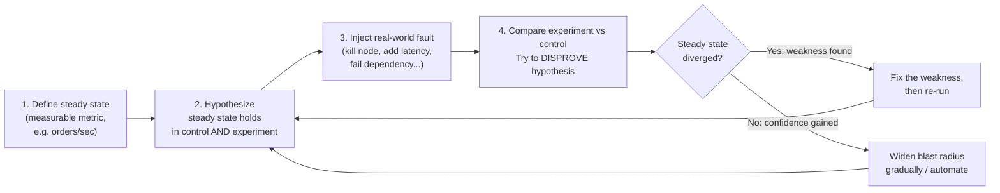
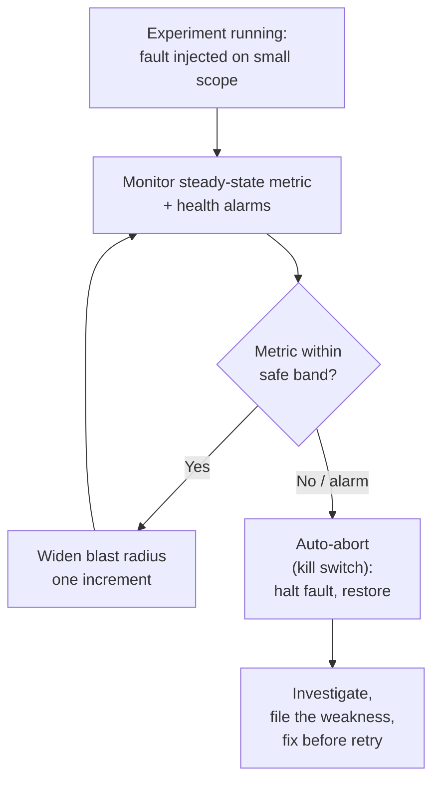
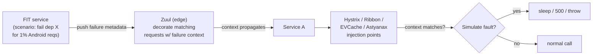

# Chaos Engineering & Fault Injection

**Chaos engineering** is the discipline of *experimenting on a system in order to build
confidence in the system's capability to withstand turbulent conditions in production*
(the definition from [principlesofchaos.org](https://principlesofchaos.org), authored by the
Netflix engineers who coined the term). It is a proactive, empirical practice: rather than
waiting for a real outage to *discover* how your system fails, you deliberately and carefully
**inject faults** — kill an instance, add latency, fail a dependency, take out an
Availability Zone — and observe whether the system's resilience mechanisms (retries, circuit
breakers, failover, autoscaling, load shedding) actually behave the way you designed them to.

The key intellectual move is that chaos engineering is a **controlled scientific experiment**,
not "randomly breaking things in production." You form a hypothesis about steady-state
behavior, inject a real-world fault, and try to *disprove* the hypothesis — all while keeping
the **blast radius** small enough that a surprising result is a learning opportunity, not an
incident.

> [!KEY-TAKEAWAY]
> Chaos engineering ≠ breaking things randomly. It is a **hypothesis-driven experiment**:
> (1) define a measurable **steady state**, (2) **hypothesize** it holds during a fault,
> (3) inject a **real-world fault**, (4) look for evidence that **disproves** the hypothesis
> (a difference between control and experiment groups), and (5) **minimize the blast radius**
> so the experiment can't cause a large-scale outage. Observability is a *prerequisite*: if
> you can't measure the steady state, you can't run the experiment.

This topic owns the **operational practice of resilience testing**: the principles,
fault-injection catalog, the Simian Army, GameDays, and prerequisites. For the resilience
*mechanisms* you are validating, see the sibling topics: `reliability-ops/retries-timeouts-and-backoff`,
`reliability-ops/circuit-breakers-and-bulkheads`, `reliability-ops/redundancy-failover-and-health-checks`,
and `reliability-ops/load-shedding-and-backpressure`. For **testing failover / DR drills** see
`reliability-ops/disaster-recovery-rpo-rto-strategies`. For **how to measure and alert on the
steady-state metrics** you observe during an experiment, see `observability`. For the
**theoretical failure trade-offs (CAP, correlated failure)** see `system-design`.

---

## What Chaos Engineering Is and Is Not

Chaos engineering was popularized at **Netflix** (circa 2010–2011, alongside their migration
to AWS) and formalized in the 2016 *IEEE Software* article "Chaos Engineering" (Basiri et al.)
and the [Principles of Chaos Engineering](https://principlesofchaos.org) manifesto (the O'Reilly
book *Chaos Engineering* followed in 2020). The motivation:
in a large distributed system, failures are **not exceptional — they are constant**.
Instances die, networks partition, disks fill, dependencies slow down. You cannot prevent
all of these, so you must build systems that *tolerate* them — and the only way to have
**confidence** that your tolerance mechanisms work is to exercise them.

**What it IS:**

- A **proactive** search for systemic weaknesses *before* they cause a customer-facing outage.
- A **controlled experiment** with a hypothesis, a control group, an experiment group, and a
  metric you evaluate.
- **Empirical** — it produces evidence about how the *whole system* (including humans, alerts,
  runbooks, and autoscaling) behaves, which no amount of design review or unit testing can.
- Ideally **automated and continuous**, run as part of normal operations rather than a
  one-off stunt.

**What it is NOT:**

| Misconception | Reality |
|---|---|
| "Randomly breaking things in prod" | A *controlled* experiment with a hypothesis and a bounded blast radius. Randomization is a *method* for choosing targets, not a license to cause chaos. |
| "Testing" (unit/integration) | Tests verify *known* conditions you already thought of. Chaos *explores* the unknown emergent behavior of the whole system under real faults. It complements, not replaces, testing. |
| "Only for Netflix-scale companies" | Any distributed system with hard dependencies benefits; you can start small in staging with a single fault. |
| "The goal is to cause failures" | The goal is to *learn* and *build confidence*. A successful experiment often causes **no** customer impact — it confirms resilience works. |
| "A tool you install" | It is a *practice*. Tools (Chaos Monkey, Gremlin, LitmusChaos) enable it, but the discipline is the experiment design + follow-through. |

> [!INTERVIEW]
> If asked "how is chaos engineering different from testing?" — the crisp answer:
> **tests verify known-knowns and known-unknowns you can enumerate; chaos engineering
> surfaces unknown-unknowns — emergent, systemic behavior** (retry storms, cascading failures,
> a fallback that itself depends on the failed service) that only appears when real faults hit
> the real, running system.

---

## The Principles of Chaos Engineering

The [Principles of Chaos Engineering](https://principlesofchaos.org) define a repeatable
experimental loop. The canonical five steps:

1. **Define "steady state"** — a **measurable** output of the system that indicates normal
   behavior. Prefer a **business/throughput metric** (e.g. Netflix's SPS — *stream starts per
   second* — or orders/sec, successful checkouts/min) over internal metrics like CPU, because
   it captures what actually matters to customers.
2. **Hypothesize that steady state continues** — in *both* the control group (no fault) and
   the experiment group (fault injected). The framing is "we believe the system will maintain
   its steady state *despite* this fault."
3. **Introduce a real-world fault** — vary events that reflect actual failures: a server
   crash, a dependency timeout, a packet loss, a full disk, a region loss. Realism matters —
   inject faults that *actually happen*.
4. **Try to disprove the hypothesis** — look for a **difference between control and experiment
   groups** in the steady-state metric. A large divergence means you found a weakness. (Note
   the scientific stance: you seek to *falsify*, not confirm.)
5. **Minimize blast radius** — run the smallest experiment that yields signal, and build in
   the ability to abort. Contain potential damage so a failed hypothesis is a bounded event.

The manifesto also names **advanced principles** that distinguish mature programs:

- **Build a hypothesis around steady-state behavior** (focus on measurable output, not
  internal attributes).
- **Vary real-world events** (prioritize by frequency × potential impact).
- **Run experiments in production** — because staging never fully reproduces prod's scale,
  traffic patterns, and configuration.
- **Automate experiments to run continuously** — one-off experiments decay as the system
  changes; continuous chaos catches regressions.
- **Minimize blast radius.**

> [!TIP]
> The **control vs experiment group** framing (like an A/B test) is the rigorous version. If
> you can't run a true control group, at minimum compare the affected metric to its recent
> baseline/historical norm during the injection window.

---

## Steady State and the Hypothesis

The **steady state** is the operational normal you can measure and reason about. A good
steady-state metric is:

- **Customer/business-facing** — it reflects value delivered (stream starts/sec, orders/min,
  successful logins/sec, p99 checkout latency). Internal signals (CPU, memory) are *not* good
  steady-state definitions because a system can be perfectly healthy at 90% CPU or broken at
  10% CPU.
- **Stable and predictable** in normal conditions, with a known baseline and variance, so a
  meaningful deviation is detectable.
- **High-signal and aggregate** — it moves quickly and reliably when something is wrong.

Netflix's canonical example is **SPS (stream starts per second)** — it is smooth, predictable
(follows a daily curve), and directly tied to customer experience, so a dip during an
experiment is an unambiguous signal.

The **hypothesis** is then stated against this metric, e.g.:

> "If we terminate 20% of the `checkout-service` instances, orders/min will remain within
> its normal band (± its usual variance) because autoscaling + load balancing + the remaining
> capacity absorb the loss within N seconds."

You then look for a **statistically meaningful divergence** between the experiment population
and the control population. Finding one *falsifies* the hypothesis and reveals a weakness
(insufficient capacity headroom, autoscaling too slow, a hidden SPOF, a missing retry).

> [!WARNING]
> Do **not** use raw CPU/memory/latency of a single box as your steady state. They are noisy
> and don't tell you whether customers are affected. Chaos experiments graded against
> business KPIs are far more convincing to leadership and far less likely to fire on noise.
> How you *collect and alert* on these metrics is `observability`'s job — chaos engineering
> *consumes* that telemetry.

---

## Blast Radius and Guardrails

The **blast radius** is the scope of potential impact of an experiment — how many customers,
requests, hosts, or dollars could be affected if the hypothesis is *wrong*. Minimizing and
controlling it is what separates chaos engineering from recklessness.

Techniques to bound and control blast radius:

- **Start small, then widen.** Begin with 1 host, or 1% of traffic, or a single non-critical
  service. Only escalate to larger scopes (an AZ, a region) after smaller experiments pass.
- **Scope the target population.** Limit to internal/dogfood traffic, a single canary cluster,
  a shard, or a percentage of users.
- **A clearly defined abort / "big red button."** You must be able to *immediately halt* the
  experiment and roll back the injected fault. This is a hard prerequisite.
- **Automated stop conditions (kill switch / guardrails).** Wire the experiment to your
  monitoring so that if the steady-state metric (or a health alarm) crosses a threshold, the
  experiment auto-aborts. Gremlin calls these "Status Checks"; the general term is an
  automated **halt condition**.
- **Run during business hours / staffed windows**, not overnight, so humans can intervene.
- **Never during an active incident**, deploy freeze, or known-degraded state.

The trade-off: a **larger blast radius yields more realistic signal** (you learn how the
system behaves under real correlated load) but **risks a real outage**; a **smaller blast
radius is safer** but may miss emergent, scale-dependent failures. The mature approach is a
**graduated ramp**: expand scope only as confidence accrues, with automated guardrails at
every level.

> [!KEY-TAKEAWAY]
> The two non-negotiable guardrails: (1) the ability to **abort instantly** and undo the
> fault, and (2) **automated halt conditions** tied to your steady-state metric. Without both,
> you are gambling, not experimenting.

---

## The Simian Army: Chaos Monkey to Chaos Kong

Netflix built a family of automated failure-injection tools nicknamed the **Simian Army**.
The founding member:

- **Chaos Monkey (2011)** — **randomly terminates production instances/VMs** during business
  hours to ensure engineers build services that tolerate instance loss *routinely*. Its
  genius is turning "a server died" from a rare, scary event into a mundane, constantly-tested
  one. It integrates with Spinnaker and operates on Auto Scaling Groups. It runs on weekdays
  during working hours so failures happen while engineers are watching.

Other members of the Simian Army (some now deprecated, but classic interview references):

| Monkey | What it injects |
|---|---|
| **Chaos Monkey** | Randomly kills an **instance/VM** in a cluster. |
| **Latency Monkey** | Injects **artificial delays** (and error responses) into RPC calls to simulate a degraded/unavailable downstream service, without actually killing it. |
| **Conformity Monkey** | Finds instances not adhering to **best practices** and shuts them down. |
| **Janitor Monkey** (later *Swabbie*) | Cleans up **unused resources** to reduce clutter/cost. |
| **Doctor Monkey** | Health-checks instances and removes **unhealthy** ones. |
| **Security Monkey** | Finds **security** violations/misconfigurations. |
| **10-18 Monkey** (Localization) | Detects issues in different **languages/regions** (l10n/i18n). |
| **Chaos Gorilla** | Simulates the loss of an **entire AWS Availability Zone (AZ)**. |
| **Chaos Kong** | Simulates the loss of an **entire AWS Region**, forcing a full **region failover** (evacuation). |

The escalation **Monkey → Gorilla → Kong** maps directly to the failure-domain hierarchy
**instance → AZ → region** — a very common interview probe. Netflix ran regular **Chaos Kong**
exercises to prove they could evacuate a region and continue serving customers.

> [!TIP]
> Netflix later folded much of this into **ChAP** (the *Chaos Automation Platform*), which
> runs experiments continuously with automatic control/experiment groups routed through their
> service mesh, small blast radius, and automatic termination if customer metrics deviate —
> the fully realized "automated + continuous + minimal blast radius" principles.

---

## Fault Injection Types

**Fault injection** is the *mechanism* of chaos engineering: deliberately introducing a
failure condition. The catalog of realistic faults maps to the ways real systems fail:

| Category | Faults injected | Real-world thing it simulates |
|---|---|---|
| **State / lifecycle** | Kill/terminate a process, instance, container, or pod; reboot a host | Hardware failure, spot-instance reclamation, crash, autoscaling churn |
| **Network — latency** | Add **latency**/jitter to packets or RPC calls | A slow/degraded dependency (often *worse* than an outright failure — see cascading failures) |
| **Network — availability** | **Drop/blackhole packets**, block a port, DNS failure, **network partition** | Partitions, firewall misconfig, dependency unreachable |
| **Dependency** | **Fail a specific downstream** (return errors / make it unreachable) | A backing service (DB, cache, payment API) is down |
| **Resource exhaustion** | Burn **CPU**, consume **memory** (leak), fill **disk / inodes**, exhaust **I/O**, saturate connection/thread pools | Noisy neighbor, resource leak, capacity exhaustion |
| **Time / clock** | **Clock skew**, jump time forward/back | NTP drift, cert expiry, TTL/token bugs, leap-second issues |
| **Application / stateful** | Corrupt responses, throttle, inject exceptions, degrade a feature flag | Bad deploy, poison message, feature-flag misfire |

Key nuances interviewers look for:

- **Latency injection is often the most valuable** fault. A dependency that is *slow* (not
  down) is the classic trigger for **cascading failure**: callers pile up waiting on it,
  exhaust their thread/connection pools, and take down services that never called the slow
  dependency directly. Injecting latency validates that your **timeouts, circuit breakers, and
  bulkheads** (see `reliability-ops/circuit-breakers-and-bulkheads`) actually fire.
- **Dependency failure** validates **fallbacks and graceful degradation** (see
  `reliability-ops/graceful-degradation-and-fallbacks`) — e.g., does the app serve cached/
  default content when the recommendation service is down?
- **Killing instances** validates **redundancy, health checks, and autoscaling** (see
  `reliability-ops/redundancy-failover-and-health-checks`).
- **AZ/region loss** validates **failover and DR** (see
  `reliability-ops/disaster-recovery-rpo-rto-strategies`).
- **Resource exhaustion** validates **load shedding and backpressure** (see
  `reliability-ops/load-shedding-and-backpressure`).

> [!WARNING]
> A subtle but critical experiment: **fail the fallback itself, or the resilience mechanism.**
> A fallback that secretly depends on the very service that failed, or a circuit breaker
> configured with the wrong threshold, is only exposed by injecting the fault and *watching
> the mechanism behave*. Many real outages are "the safety mechanism didn't work."

---

## GameDays: Planned Failure Exercises

A **GameDay** (a term from Amazon, ~2006, credited to Jesse Robbins) is a **planned,
scheduled failure exercise**: the team gathers (often in a "war room"), deliberately injects a
failure into a system, and observes how both the **system and the people/process** respond —
including alerting, on-call escalation, runbooks, and communication.

GameDays are the **manual, human-in-the-loop** end of the spectrum, complementing **automated,
continuous** chaos (Chaos Monkey / ChAP). They are especially valuable for:

- **Validating the human response**, not just the system: do the right alerts fire? Does
  on-call get paged? Are the runbooks correct and current? (Ties to
  `reliability-ops/incident-response-and-command` and `on-call-escalation-and-runbooks`.)
- **Rehearsing DR / failover** — a large-scale GameDay might exercise a region evacuation
  (`reliability-ops/disaster-recovery-rpo-rto-strategies`).
- **Training new engineers** in a controlled, safe setting.
- **Exercising rarely-used paths** (the failover you built two years ago and never tested).

Running a GameDay well:

1. **Plan**: pick a hypothesis and scenario, define the steady state and abort criteria,
   notify stakeholders, and schedule during staffed hours.
2. **Assign roles**: an experiment lead, observers, and the on-call team (who may or may not
   be told in advance — an *unannounced* GameDay tests detection realistically but raises
   the stakes).
3. **Execute**: inject the fault, watch dashboards and the team's response, be ready to abort.
4. **Debrief**: run a **blameless postmortem** on what you learned — bugs, gaps in runbooks,
   slow alerts, missing dashboards (`reliability-ops/blameless-postmortems-and-learning`).
5. **Follow through**: file and prioritize the action items; a GameDay with no fixes is theater.

> [!INTERVIEW]
> "GameDay vs Chaos Monkey?" — A **GameDay** is a *planned, often manual, broad-scope* exercise
> that tests **system + humans + process** and happens periodically. **Chaos Monkey** is an
> *automated, continuous, narrow-scope* tool that tests one failure mode (instance death)
> constantly. Mature orgs do both: continuous automated chaos for regression + periodic
> GameDays for big scenarios and human-response practice.

---

## Prerequisites and Maturity

Chaos engineering is **not the first thing** a team should do. It presupposes a level of
operational maturity, and running it prematurely does harm. Prerequisites:

1. **Observability first.** You must be able to *measure* the steady state and *see* the
   effect of the fault in near-real-time. Without dashboards, metrics, and alerting, you're
   injecting faults blind — you won't detect the divergence or know when to abort. (This is
   why chaos comes *after* an observability foundation — see `observability`.)
2. **The ability to abort and recover** — an instant kill switch and confidence you can undo
   the fault and restore service.
3. **Baseline resilience already in place** — retries, timeouts, health checks, redundancy.
   If you *already know* a single instance death will cause an outage, don't run Chaos Monkey
   to "discover" it; fix the known weakness first. Chaos finds *unknown* weaknesses.
4. **Automated recovery / not everything manual** — the system should self-heal from routine
   faults (autoscaling replaces killed instances).
5. **Organizational buy-in** and a **blameless culture** — findings become fixes, not blame.

**Maturity model** (roughly, per the *Chaos Engineering* book and Gremlin's model): teams
progress along two axes — **sophistication** (from ad-hoc/manual in staging → automated,
continuous, production experiments with automatic guardrails and control groups) and
**adoption** (from one engineer's side project → an org-wide practice run against all critical
services). You climb by moving from **staging → production**, from **manual → automated**, and
from **narrow → (carefully) wider** blast radius.

> [!WARNING]
> **Two absolute rules:** (1) **Never run a chaos experiment during an active incident** or a
> known-degraded state — you'll amplify a real outage and can't distinguish injected from real
> failure. (2) **Don't run chaos to confirm a weakness you already know about** — fix it first.
> Chaos exists to surface the *unknown*.

---

## Staging vs Production, and Continuous Chaos

**Where do you run experiments?** A progression:

- **Start in staging / pre-production** to learn the tooling, validate the abort mechanism,
  and catch the obvious failures cheaply and safely.
- **Graduate to production** — because staging **never** faithfully reproduces production's
  real scale, real traffic mix, real data volumes, real configuration, and real dependency
  topology. The most valuable, most surprising findings (emergent, scale-dependent behavior)
  only appear in prod. The Principles manifesto explicitly advocates *running experiments in
  production* (with small blast radius and guardrails), which is what makes the discipline
  controversial-yet-powerful.

**Continuous / automated chaos.** A one-off experiment tells you the system was resilient *on
that day, in that configuration*. Systems change constantly — new deploys, new dependencies,
config drift — so resilience **regresses silently**. The mature answer is to **automate
experiments to run continuously** (Netflix ChAP, scheduled Chaos Monkey), so a regression in
resilience is caught like any other CI failure. This is the realized form of the "automate +
run continuously + minimize blast radius" principles.

The trade-off ladder:

| Where / how | Realism / signal | Risk | When |
|---|---|---|---|
| Staging, manual, one-off | Low | Low | Learning the tools; first experiments |
| Prod, manual GameDay, small scope | Medium–High | Medium | Periodic big-scenario + human-response tests |
| Prod, automated, continuous, tiny blast radius + guardrails | High | Low–Medium (bounded) | Mature program; catches regressions |
| Prod, wide scope (Chaos Kong / region) | Very High | High | Only after graduated confidence; validates DR |

---

## Blast Radius vs Magnitude: Two Independent Dials

A subtle-but-important distinction interviewers probe: **blast radius** and **magnitude**
are *different dimensions* of an experiment, and you minimize and ramp **both** independently.

- **Blast radius = scope** — *how many* things can be affected: number of hosts, % of traffic,
  users, requests, shards, AZs, regions. This is the *breadth* of impact.
- **Magnitude = intensity** — *how severe* the injected fault is: **50 ms vs 5 s** of added
  latency, **10% vs 100%** packet loss, kill 1 pod vs the whole ASG, throttle to 90% vs 0%.
  This is the *depth* of impact per affected unit.

You can hold one small while ramping the other. A safe first experiment is **small radius +
small magnitude** (add 50 ms to 1% of traffic). You then ramp one dimension at a time
(50 ms → 200 ms → 1 s at 1%, *then* widen to 5%), so that when a divergence appears you know
which dial caused it. Conflating the two ("just make the blast radius bigger") loses that
diagnostic clarity and can overshoot into an incident.

> [!KEY-TAKEAWAY]
> Blast radius is *how many*; magnitude is *how much*. Minimize and ramp them **separately** —
> a wide-radius/low-magnitude experiment and a narrow-radius/high-magnitude one probe very
> different weaknesses.

---

## Latency and Cascading Failure: The Little's Law Mechanism

The claim "a *slow* dependency is worse than a *dead* one" has a concrete, quantitative
mechanism, and being able to show the math separates senior candidates.

**Little's Law:** `L = λ × W`, where `L` = average number of requests concurrently in the
system (in flight), `λ` = arrival rate (req/s), and `W` = average time each request spends in
the system (latency). The concurrency `L` is what consumes finite resources — threads,
connection-pool slots, sockets, memory.

Worked example: a service handles `λ = 200 req/s` to a dependency that normally responds in
`W = 50 ms`. Concurrent in-flight requests `L = 200 × 0.05 = 10` — comfortably under a
200-thread pool. Now the dependency degrades to `W = 5 s` (a 100× latency jump, *not* an
outage). If callers keep arriving at 200 req/s, required concurrency balloons to
`L = 200 × 5 = 1000` — **100× more**, far beyond the 200-thread pool. Threads block waiting,
the pool saturates, new requests queue or are rejected, and **latency/failure propagates
upstream to callers that never touched the slow dependency** (backpressure through shared
pools). This is the canonical **cascading failure**.

Why *slow* beats *dead*: a **dead** dependency fails **fast** — the call returns an error (or
connection-refused) in milliseconds, freeing the thread immediately, so concurrency stays
bounded. A **slow** dependency **holds the resource** for the full timeout, so it silently
exhausts the pool. This is *exactly* why latency injection is the highest-value fault: it is
the failure mode most likely to cascade, and it directly exercises **timeouts** (cap `W`),
**circuit breakers** (stop sending to the slow dep), and **bulkheads** (isolate the pool) —
see `reliability-ops/circuit-breakers-and-bulkheads` and `retries-timeouts-and-backoff`.

> [!INTERVIEW]
> "Down or slow — which is worse, and prove it." → **Slow.** Little's Law: fixed arrival rate ×
> a big latency jump ⇒ in-flight concurrency explodes ⇒ thread/connection pool exhausts ⇒
> backpressure cascades to unrelated callers. A dead dep fails fast and frees the thread; a
> slow one holds it. The fix is a **tight timeout** (bounds `W`) plus a **circuit breaker**.

---

## Netflix FIT: Request-Level Fault Injection

**FIT (Failure Injection Testing)** is Netflix's precision fault-injection framework — the
bridge "between isolated testing and large-scale chaos exercises," and the direct ancestor of
ChAP. Where Chaos Monkey scopes blast radius by **host** (kill *this* instance, affecting
whoever it served), FIT scopes by **request / user / device** — you choose *who* experiences
the failure, on an orthogonal axis.

Mechanism:

1. The **FIT service** pushes **failure metadata** describing the scenario (which injection
   points should fail, for which requests) to **Zuul**, the edge/API gateway.
2. Zuul **decorates matching requests** with a **failure context** that **propagates
   downstream** to every service the request touches (carried in request-scoped context).
3. Each **injection point** in the call graph — **Hystrix** (command execution),
   **Ribbon** (client-side RPC/load-balancing), **EVCache** (caching), **Astyanax**
   (Cassandra client) — inspects the context and, if it matches, **simulates the fault**:
   sleep (latency), return a 500, or throw.

Because you can target "1% of requests from Android devices in one region," FIT gives
**precise, small blast radius by request** rather than by host. Contrast **Latency Monkey**,
which is *server-side* and therefore "impacts all callers whether they want to or not" — FIT
lets a caller opt specific requests in.

A **failure scenario** is a curated *set* of injection points that codifies "what must survive":
e.g. the **minimum set of services required to stream** (the *critical services* scenario).
Mature programs turn "what must keep working" into reusable, versioned experiments rather than
ad-hoc pokes.

> [!TIP]
> **Chaos Monkey vs FIT vs ChAP:** Chaos Monkey = coarse, always-on, **host-random** kill.
> FIT = **request-level precision** — choose *who/what* fails and ramp the % of requests.
> ChAP = FIT **plus** automatic control/experiment groups **plus** a statistical significance
> test on the KPI. The progression is coarse → precise → precise-and-automatically-graded.

---

## AWS FIS: Experiment Template Anatomy

**AWS Fault Injection Service (FIS)** is AWS's managed chaos tool, and "walk me through a safe
prod experiment on AWS" is a common concrete probe. The core object is the **experiment
template**, made of three parts:

- **Actions** — the faults to run. They execute **sequentially or in parallel** for a set
  **duration**. Named actions worth citing: `aws:ec2:stop-instances`,
  `aws:ec2:terminate-instances`, `aws:ecs:...` (task-level), `aws:ssm:send-command` (runs
  scripts via the **SSM Agent** for CPU/memory stress or kill-process), and network faults
  `aws:network:disrupt-connectivity` / latency injection.
- **Targets** — *which* resources the actions hit, selected by **resource ID, tags, or
  resource state** (e.g. "instances tagged `env=prod, tier=checkout`, pick 1 at random" or
  "COUNT(1)" / "PERCENT(5)").
- **Stop conditions** — the guardrail. **A stop condition is a CloudWatch alarm**; if the
  alarm goes into ALARM state during the experiment, FIS **automatically halts and rolls
  back**. This is the textbook implementation of an *automated halt condition*: wire a
  CloudWatch alarm on your steady-state metric (e.g. checkout success rate < 99%) as the stop
  condition.

Billing is **per action-minute per target account** (you pay for the time faults run).

**Designing a safe first FIS experiment for a checkout service:** target **1% by tag**
(`PERCENT(1)`) in one AZ, action = 200 ms latency via `aws:network:...` (small magnitude),
**duration 5 min**, **stop condition = CloudWatch alarm on checkout success-rate**, run during
**staffed business hours**, after validating the same template in staging. Start small on both
dials, let the alarm auto-halt, and only widen after it passes.

> [!KEY-TAKEAWAY]
> Memorize the FIS triad: **actions + targets + stop conditions**, where the **stop condition
> is a CloudWatch alarm** that auto-halts and rolls back. It is the concrete, cloud-native form
> of "steady-state metric wired to an automated kill switch."

---

## Google DiRT and the Wheel of Misfortune

Google's counterpart to Netflix's automated chaos is **DiRT (Disaster Recovery Testing)** — a
**company-wide, coordinated program of real and fictitious outages** (SRE book / SRE Workbook).
It emphasizes the **governance layer** that staff-level interviews probe:

- Every test must have a **revert / rollback plan** before it starts.
- **Real emergencies preempt DiRT** — if a real incident starts, the exercise stops.
- Impact-on-prod must be **declared** up front, and tests are **reviewed and approved by a
  cross-functional team that is separate from the test coordinators**.
- **High-prod-risk tests require VP-level sign-off.**

DiRT also famously tests **human and process resilience**, not just machines: deliberately
"disabling" a person who holds undocumented knowledge, or removing a doc / process / comms
channel, to expose **human single points of failure**. Precision-of-scope matters as much as
for machine faults: *"bring down DNS"* is too blunt — the realistic scoped test is *"shut down
all primary DNS servers in North America **but not** the forwarding servers,"* because the
forwarders would otherwise mask the outage and invalidate the test.

The **Wheel of Misfortune** (Google SRE) is the **low-risk, zero-blast-radius sibling**: a
**tabletop role-play** where on-callers walk through a *past* incident (one person plays
"the outage," others respond as if on-call). It builds incident-response muscle and validates
runbooks **without touching production** — the opposite end of the risk spectrum from a live
DiRT/GameDay.

> [!INTERVIEW]
> **GameDay vs Wheel of Misfortune vs DiRT:** a **GameDay** injects a *real* fault in a
> team-scoped live exercise (system + humans). A **Wheel of Misfortune** is a *tabletop
> role-play* of a past incident — **no blast radius at all**. **DiRT** is a *company-wide*,
> governed program of real + fictitious outages with revert plans, cross-functional review,
> and VP sign-off for high-risk tests.

---

## Choosing What to Test First: The Knowns/Unknowns Matrix

A practical answer to "*what do I experiment on first?*" uses the 2×2 knowns/unknowns matrix
(popularized in the *Chaos Engineering* literature / Rosenthal):

|                 | **Knowns** (we're aware) | **Unknowns** (we're unaware) |
|-----------------|--------------------------|------------------------------|
| **Knowns** (we understand) | **Known-knowns** — things we understand and are aware of (a killed instance is replaced in ~90 s). | **Unknown-knowns** — things we understand but aren't fully aware of (behavior under a specific correlated failure we could reason about but haven't observed). |
| **Unknowns** (we don't understand) | **Known-unknowns** — things we're aware of but don't fully understand (we know a retry storm *could* happen but not the threshold). | **Unknown-unknowns** — emergent behavior we neither understand nor anticipate (the real prize of chaos). |

**Ordering:** start at **known-knowns** — run experiments that *verify what you think you
already know* (does the replacement really happen in 90 s?). Surprisingly often the "known"
is wrong. Then move outward toward **known-unknowns**, and the discipline ultimately exists to
convert **unknown-unknowns** into knowns before a real outage does it for you. Don't start by
hunting the exotic unknown-unknown; you'll get more early value confirming your assumptions.

---

## Chaos and the Error Budget: When to Run

Chaos experiments carry a real (if bounded) risk of customer impact, so *when* you run them
should be governed by the **error budget** — the reliability-concept lens this domain owns.

- Availability targets translate to allowed downtime: **99.9% ≈ 43.8 min/month** of budget;
  **99.99% ≈ 4.38 min/month**; **99.999% ≈ 26 s/month**. The error budget is
  `1 − SLO` worth of allowed unreliability.
- A chaos experiment that causes impact **spends from the error budget**, just like a real
  incident or a risky deploy.
- **SRE framing:** *if you have budget left, you can afford to run risky/wide experiments; if
  you've burned the budget this period, freeze risky chaos* (along with risky launches) until
  it recovers. You can still run **tiny, automated, well-guarded regression checks** whose
  worst case is negligible — the freeze is about *risk magnitude*, not about stopping all
  verification.

This ties chaos directly to **error-budget policy**: the same budget that gates launches gates
how aggressive your chaos program can be. (For how SLIs/SLOs/burn rates are *measured and
alerted*, see `observability`; for the deployment-freeze policy see `devops-cicd`.)

> [!INTERVIEW]
> "You've burned this month's error budget — still run chaos?" → **Generally pause the risky /
> wide experiments** (you can't afford the downside), but **keep the tiny automated regression
> checks**. The error budget gates chaos aggressiveness exactly as it gates launches.

---

## Continuous Verification and Security Chaos Engineering

**Continuous Verification (CV)** is the named 2024/2025 evolution of "chaos as CI" (coined
around ChAP / Verica): **automated chaos experiments gated into the deploy pipeline** so a
resilience regression fails a build the way a broken unit test does. CV reframes chaos from a
periodic event into a **continuous, pipeline-integrated control** — the logical endpoint of
the "automate experiments to run continuously" principle.

**Security Chaos Engineering (SCE)** applies the same hypothesis-driven method to **security
controls** rather than availability. Instead of asking "does the system stay up under fault?"
you ask **"does our detection and response actually fire under a security fault?"**. Example
experiments:

- **Open a security-group port** (or misconfigure it) → does the SIEM alert, and does
  auto-remediation revert it within SLA?
- **Drop an IAM permission** → does the dependent workflow fail safe, and does monitoring catch it?
- **Disable a WAF rule** → is the gap detected?

The canonical origin tool is **ChaoSlingr** (from the SCE originators; its ideas are now folded
into broader chaos tooling). The senior insight: **run chaos against your detective and
responsive controls, not just your availability mechanisms** — an alert that never fires is a
security control that doesn't exist.

> [!TIP]
> A crisp SCE experiment to name in an interview: *inject a misconfiguration (open port / dropped
> IAM permission) and verify the alert + auto-remediation fire within the target SLA.* You are
> testing the **detection/response pipeline**, which is otherwise only "tested" by real attackers.

---

## Reversibility: Not Every Fault Can Be Aborted

The "instant abort" prerequisite is real but **oversimplified**. Faults live on a
**reversibility spectrum**, and mature practice treats the two ends very differently:

- **Reversible faults** — latency, blackhole/packet-drop, a paused process, a tripped feature
  flag. *Remove the fault and the system recovers.* The "big red button" genuinely works, so
  these are the safe faults to run in production first.
- **Irreversible / hard-to-reverse faults** — **terminating an instance with in-flight state**,
  a **corrupted or partial write**, a **triggered autoscale** that costs real money, a
  **filled disk that OOM-killed a process**. Aborting the *injection* does **not** undo the
  *consequence* — the state damage or side effect persists.

Implications: run **irreversible** faults with far more caution — prefer **staging or a shadow
environment**, ensure **verified backups**, and target **replicas, not primaries**. In
production, favor **reversible** faults and small magnitude. "Just hit abort" is a valid guard
for latency injection but **not** for a data-corruption experiment.

> [!WARNING]
> Don't state "instant abort" as a flat rule. Distinguish **reversible** faults (abort truly
> restores) from **irreversible** ones (killed instance with in-flight state, corrupt write,
> filled disk). For irreversible faults: staging/shadow, verified backups, target replicas —
> the abort button won't save you.

---

## Steady-State Metric Selection: Fast Proxy vs Laggy KPI

A sharp follow-up: *your business KPI is too laggy to abort on — what do you use?* Some ideal
"business" metrics **move too slowly to be a real-time halt signal**. Revenue-per-minute, for
instance, only moves *after* checkouts complete and payment settles — it can lag the injected
fault by minutes, far too slow to trip an abort before customer damage mounts.

The pattern: use a **fast-moving proxy** as the **halt trigger** and reserve the laggy business
KPI for **grading** the experiment after the fact:

- **Halt trigger** — a metric that moves in **seconds**: successful-request rate, a latency
  percentile (p99), HTTP 5xx rate. This is what your automated stop condition watches.
- **Grading metric** — the business KPI (orders, revenue) used to judge whether the experiment
  *really* preserved customer value, evaluated in the post-experiment analysis.

This is precisely why Netflix uses **SPS** — it moves in *seconds*, so it works as both a
sensitive real-time trigger and a customer-value signal. If your KPI doesn't move fast, don't
abandon guardrails — pick a fast, well-correlated proxy for the trip wire.

> [!KEY-TAKEAWAY]
> A steady-state metric must be **fast** to serve as an abort signal. If the business KPI lags
> (revenue settles minutes later), trip on a **fast proxy** (success rate, p99 latency) and
> **grade** on the KPI. Don't wire an abort to a metric that reacts slower than the damage.

---

## Statistical Rigor: Control vs Experiment Group Internals

"How do you know the divergence is real and not noise?" deepens the ChAP internals. ChAP
allocates a **small, statistically comparable control cluster and experiment cluster** and
routes a **tiny, equal percentage of traffic** to each via the service mesh — same real-time
conditions, same version, same customer mix, differing only in the injected fault. Then it runs
an **automated statistical significance test** on the KPI difference (Netflix used
**Kayenta / ACA — Automated Canary Analysis**), rather than an engineer eyeballing a graph.

Why it matters: at small blast radius, the sample is small and noisy, so a naive
"the line dipped" read produces false positives (halting healthy experiments) and false
negatives (missing real regressions). A proper significance test on comparable populations is
what makes small-blast-radius, continuous chaos **trustworthy** — the same discipline as canary
analysis in a deploy pipeline (`devops-cicd`).

---

## Tool Landscape and Kubernetes-Native Faults

"Which tool for a K8s shop / for AWS / for vendor-neutral?" expects awareness of the ecosystem:

| Tool | What it is |
|---|---|
| **Chaos Toolkit** | Open-source, **JSON/YAML experiment-as-code**, vendor-neutral — the portable "experiment definition" standard. |
| **Gremlin** | Commercial SaaS "**Failure-as-a-Service**"; **Status Checks** = automated halt; prebuilt **Scenarios**. |
| **LitmusChaos** | **CNCF** project; Kubernetes-native via **CRDs**; shared **ChaosHub** of experiments. |
| **Chaos Mesh** | **CNCF**, Kubernetes-native; CRDs: **PodChaos, NetworkChaos, StressChaos, IOChaos, TimeChaos, DNSChaos**. |
| **AWS FIS** | Managed AWS service; actions + targets + CloudWatch stop conditions. |
| **Azure Chaos Studio** | Managed Azure equivalent. |

Rough guidance: **K8s shop** → Chaos Mesh or LitmusChaos (CRD-native). **AWS-centric** → FIS
(tag-based targeting + CloudWatch guardrails). **Vendor-neutral / multi-cloud experiment-as-code**
→ Chaos Toolkit. **Turnkey SaaS with UI + safety** → Gremlin.

**Kubernetes-native fault types** the CRD-based tools expose (beyond the host/RPC catalog above):

- **pod-kill** — delete a pod (tests ReplicaSet/Deployment self-healing, PodDisruptionBudgets).
- **pod-failure** — make a pod unavailable for a duration without deleting it.
- **container-kill** — kill one container in a multi-container pod.
- **network-partition / network-delay / packet-loss between pods** — split-brain, slow service mesh.
- **DNS chaos** — return errors/wrong answers for in-cluster DNS (CoreDNS) — a common real outage cause.
- **IO chaos** — inject filesystem delay/errors (slow or failing volume).
- **time chaos** — per-pod clock skew.
- **stress** — CPU/memory pressure on a pod (noisy neighbor).

> [!INTERVIEW]
> Match the tool to the environment: **Chaos Mesh/Litmus** (K8s CRDs), **AWS FIS** (AWS + tags +
> CloudWatch), **Chaos Toolkit** (vendor-neutral experiment-as-code), **Gremlin** (SaaS with
> built-in Status-Check halts). Know the K8s CRD fault families: Pod/Network/Stress/IO/Time/DNS.

---

## Common Interview Follow-ups

- **"Define chaos engineering in one sentence."** Experimenting on a system to build confidence
  it can withstand turbulent (production) conditions — a controlled, hypothesis-driven fault
  injection, not random breakage.
- **"Walk me through designing an experiment."** Define a measurable steady state (business
  metric) → hypothesize it holds under a specific real-world fault → identify the smallest
  blast radius + abort condition → inject on a control/experiment split → compare metrics →
  if it diverges, you found a weakness; fix and re-run; if not, gain confidence and widen.
- **"Why run in production and not just staging?"** Staging can't reproduce prod scale,
  traffic, config, and dependency topology; the highest-value emergent failures only show up
  in prod. You de-risk it with small blast radius + guardrails, not by avoiding prod.
- **"What must be true *before* you run chaos?"** Observability to measure/see the impact, an
  instant abort + recovery capability, baseline resilience already built, and a blameless
  culture. And never during an active incident.
- **"Monkey vs Gorilla vs Kong?"** Instance kill → AZ loss → region loss (failure-domain
  escalation).
- **"Which single fault gives the most value and why?"** Often **latency injection**, because
  a *slow* dependency is the classic trigger of cascading failure and it directly tests
  timeouts / circuit breakers / bulkheads — mechanisms that frequently turn out to be
  misconfigured.
- **"How do you keep it from causing an outage?"** Minimal blast radius, start small and ramp,
  automated halt conditions tied to the steady-state metric, an instant kill switch, staffed
  hours, and never during an incident.
- **"Is chaos engineering a replacement for testing?"** No — it complements. Tests cover known
  conditions; chaos surfaces unknown, emergent, systemic behavior in the running whole.
- **"What's a GameDay?"** A planned, often manual, broad failure exercise that tests the system
  *and* the people/process/runbooks/alerts, followed by a blameless postmortem and fixes.
- **"You found a weakness — then what?"** File it, prioritize the fix, fix it, then re-run the
  experiment to verify. A chaos program that finds problems but doesn't drive fixes is theater.
- **"Down or slow — which is worse, with numbers?"** Slow. Little's Law `L = λ×W`: a big `W`
  jump at fixed `λ` explodes in-flight concurrency and exhausts the thread/connection pool; a
  dead dep fails fast and frees the thread. Fix: tight timeout + circuit breaker.
- **"Your KPI is too laggy to abort on."** Trip the automated halt on a fast proxy (success
  rate / p99 latency) and grade on the KPI afterward — the reason Netflix uses SPS.
- **"Chaos Monkey vs FIT vs ChAP?"** Host-random kill → request-level precision (choose who
  fails, ramp %) → precision + auto control/experiment groups + statistical significance test.
- **"Design a safe first prod experiment on AWS FIS."** Template = actions + targets + stop
  conditions; target 1% by tag, small-magnitude latency action, 5-min duration, stop condition =
  CloudWatch alarm on success rate, staffed hours, pre-validated in staging.
- **"Burned the error budget — still run chaos?"** Pause risky/wide experiments; keep tiny
  guarded regression checks. The budget gates chaos aggressiveness like it gates launches.
- **"GameDay vs Wheel of Misfortune vs DiRT?"** Live team-scoped fault vs zero-blast-radius
  tabletop role-play vs company-wide governed real+fictitious program (revert plan, VP sign-off).
- **"Give a security-chaos experiment."** Open a port / drop an IAM permission and verify the
  alert + auto-remediation fire within SLA — testing detection/response, not availability.
- **"How do you run chaos on irreversible faults (data corruption)?"** Don't, in prod, casually:
  reversibility spectrum — staging/shadow, verified backups, target replicas not primaries.

## References

- [Principles of Chaos Engineering](https://principlesofchaos.org) — the canonical definition
  and the five-step + advanced principles.
- Rosenthal & Jones (eds.), *Chaos Engineering: System Resiliency in Practice* (O'Reilly, 2020);
  Basiri et al., "Chaos Engineering" (*IEEE Software*, 2016); Rosenthal et al., *Chaos Engineering*
  report (O'Reilly, 2017).
- Netflix Technology Blog — *The Netflix Simian Army* (2011); *ChAP: Chaos Automation Platform*
  (2017); *Automating chaos experiments in production* (2018).
- Netflix **Chaos Monkey** (open source, part of the Simian Army) and Spinnaker docs.
- Google — *Site Reliability Engineering* and *The SRE Workbook* (DiRT/disaster-recovery
  testing, error budgets that fund risk).
- Amazon — GameDays (Jesse Robbins) and the AWS Well-Architected **Reliability pillar**
  (REL "Test Reliability": use fault injection / AWS Fault Injection Service to test resilience).
- Michael Nygard, *Release It!* (2nd ed.) — stability patterns and failure modes chaos exercises.
- Tools: Netflix Chaos Monkey, **Gremlin** (Failure-as-a-Service, Status Checks/halt),
  **LitmusChaos** and **Chaos Mesh** (Kubernetes-native, CNCF), **Chaos Toolkit** (vendor-neutral
  experiment-as-code), **AWS Fault Injection Service (FIS)**, Azure Chaos Studio.
- Netflix Technology Blog — *FIT: Failure Injection Testing* (2014) — Zuul context injection +
  Hystrix/Ribbon/EVCache/Astyanax injection points.
- AWS docs — **AWS Fault Injection Service**: experiment templates (actions, targets, stop
  conditions as CloudWatch alarms).
- Google — *Site Reliability Engineering* / *The SRE Workbook*: DiRT (disaster-recovery testing,
  governance and revert plans) and the **Wheel of Misfortune** tabletop exercise; error-budget
  policy that funds (and freezes) risk.
- Kelly Shortridge & Aaron Rinehart, *Security Chaos Engineering* (O'Reilly) and **ChaoSlingr**.
- Little's Law (`L = λ × W`) — queueing-theory basis for the slow-dependency cascade mechanism.
