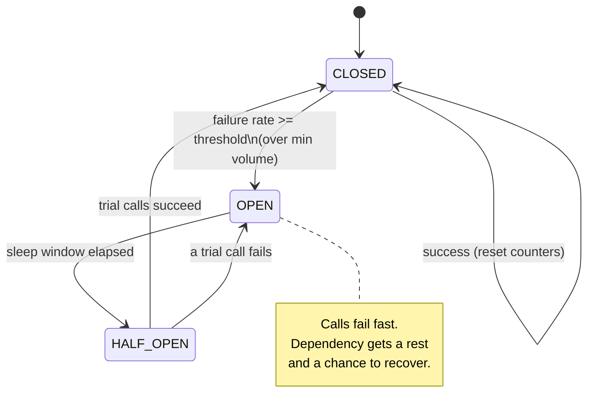
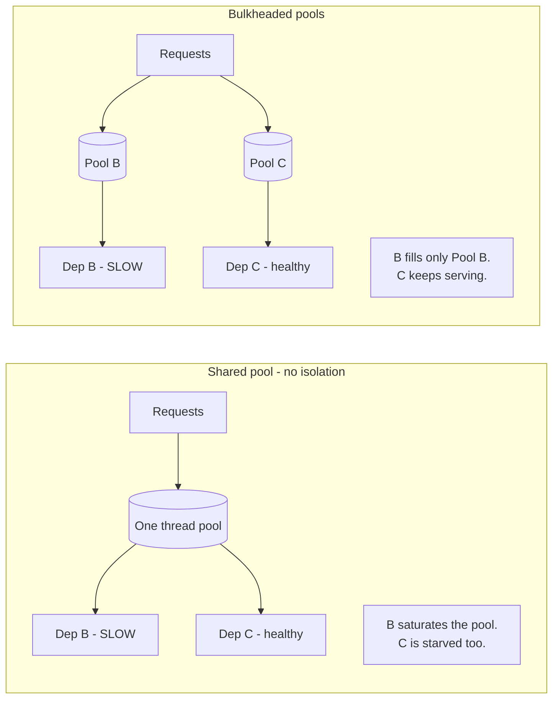
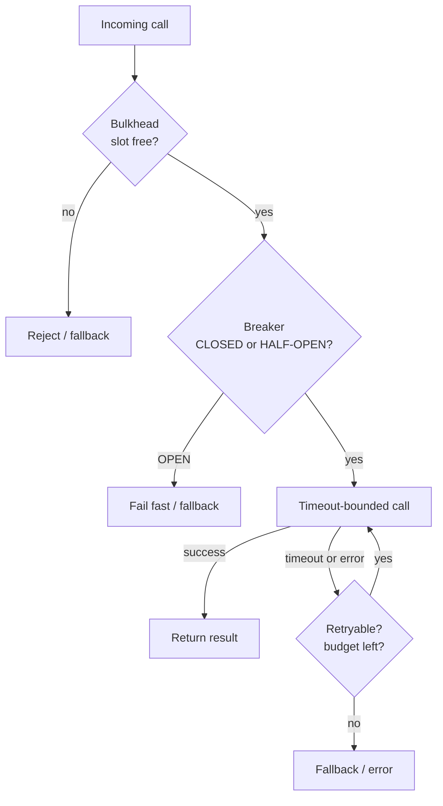

# Circuit Breakers & Bulkheads

Circuit breakers and bulkheads are two of the core **stability patterns** from Michael
Nygard's *Release It!*. Both exist to stop a *local* failure — a slow or dead dependency —
from turning into a *global* failure that takes down the whole application. A circuit
breaker **fails fast** when a dependency is unhealthy so callers stop piling up on it; a
bulkhead **isolates resources** so one sick dependency can't drain the pools every other
part of the app needs.

> [!KEY-TAKEAWAY]
> A timeout bounds how long *one* call waits. A circuit breaker decides whether to *make
> the call at all*. A bulkhead limits how much of your *resource budget* a single
> dependency can ever consume. You almost always want all three together.

These patterns are the tactical toolkit for preventing the failure modes described in
`reliability-ops/cascading-failures-and-antipatterns`, and they pair tightly with
`reliability-ops/retries-timeouts-and-backoff`. See also
`reliability-ops/load-shedding-and-backpressure` for protecting a service from *inbound*
overload (breakers/bulkheads protect a *caller* from a bad *downstream*).

## Why Fail Fast: The Cascading Failure Problem

The problem circuit breakers solve is **resource exhaustion under a slow dependency**.
Consider service A calling dependency B synchronously with a 30 s timeout. B is not down —
it's *slow* (latency spikes to 30 s). This is the dangerous case:

- Every request thread that calls B now blocks for up to 30 s instead of ~50 ms.
- Request threads are a finite pool (say 200). Under load they all end up parked waiting
  on B.
- A now has **zero free threads** — it can't serve *any* request, including ones that
  don't touch B at all (e.g. a health check or an unrelated endpoint).
- A's callers time out waiting on A, exhaust *their* threads, and the failure propagates
  **up** the call graph. One slow leaf sinks the whole tree.

This is a **cascading failure**, and the counter-intuitive lesson from *Release It!* is
that **slow is worse than down**. A dependency that fails instantly (connection refused)
frees the thread immediately; a dependency that hangs holds the resource for the full
timeout. Integration points are the number-one source of production instability.

The circuit breaker's job is to detect "B is unhealthy" and then **stop calling B** —
returning an error (or fallback) in microseconds instead of blocking for 30 s. That frees
threads, keeps A responsive for everything else, and — critically — **takes load off B so
it can recover** instead of being hammered while it's trying to come back.

> [!WARNING]
> A retry loop *without* a circuit breaker makes cascading failure worse: when B is
> struggling, retries multiply the request rate at the exact moment B can least afford it
> (a **retry storm**). Breakers and retries must be designed together — see
> `reliability-ops/retries-timeouts-and-backoff`.

## The Circuit Breaker State Machine

A circuit breaker is a **state machine** wrapped around a dependency call. It borrows the
metaphor of an electrical breaker: when current (errors) gets dangerous, the circuit
**trips open** to protect the system. Three states:

- **CLOSED** — normal operation. Calls pass through to the dependency. The breaker counts
  outcomes (successes/failures). If the failure rate crosses the threshold, it trips to
  OPEN.
- **OPEN** — the dependency is presumed unhealthy. Calls **fail fast immediately** without
  touching the dependency (throw / return fallback in microseconds). After a configured
  **sleep window** (cooldown), the breaker transitions to HALF-OPEN.
- **HALF-OPEN** — a **trial / probing** state. A limited number of test calls are allowed
  through. If they succeed, the dependency looks recovered → back to CLOSED (reset
  counters). If any fails, → OPEN again and the sleep window restarts.



> [!KEY-TAKEAWAY]
> HALF-OPEN is the whole point of the pattern's *automatic recovery*: it re-probes with a
> *trickle* of traffic rather than slamming the full load back onto a dependency that may
> still be fragile. Going OPEN → CLOSED directly on a timer would risk re-triggering the
> outage.

## CLOSED State and Tripping Thresholds

In CLOSED the breaker is measuring health. The key tuning parameters:

- **Failure-rate threshold** — trip when the *proportion* of failing calls in the window
  exceeds, e.g., 50%. Rate-based (not a raw count) so it scales with traffic. Resilience4j
  defaults to a 50% failure-rate threshold.
- **Minimum volume / minimum-number-of-calls** — don't evaluate the rate until you have a
  statistically meaningful sample. If the threshold is 50% but only 3 calls have been seen,
  2 failures shouldn't trip the breaker. Resilience4j's `minimumNumberOfCalls` defaults to
  100; Hystrix's `circuitBreaker.requestVolumeThreshold` defaulted to 20 per rolling 10 s
  window. **Without a volume gate, a breaker flaps on tiny samples.**
- **Sliding window** — count-based (last N calls) or time-based (last N seconds). Time-based
  is more predictable under variable traffic.
- **Slow-call threshold** — modern breakers (Resilience4j) also trip on *slowness*, not just
  errors: a call slower than `slowCallDurationThreshold` counts toward a `slowCallRateThreshold`.
  This catches the "slow is worse than down" case where calls technically succeed but are
  degrading the caller.

**What counts as a failure** matters: usually timeouts, connection errors, and 5xx. You
generally do **not** want to trip on 4xx (a 404 or 400 is the *caller's* fault, not the
dependency being unhealthy) — counting them pollutes the health signal and can trip the
breaker for a perfectly healthy dependency. Resilience4j supports `recordExceptions` /
`ignoreExceptions` for exactly this.

## OPEN State, the Sleep Window, and Recovery

When OPEN, the breaker short-circuits. Tuning the **sleep window** (Resilience4j
`waitDurationInOpenState`, default 60 s; Hystrix `sleepWindowInMilliseconds`, default 5 s)
is a trade-off:

| Sleep window | Effect |
|---|---|
| **Too short** | Probes too aggressively — if the dependency needs 60 s to recover, you keep re-opening and add load during its recovery. Breaker flaps. |
| **Too long** | Dependency recovered long ago but you keep failing fast — you've turned a transient blip into an extended self-inflicted outage. |

A common refinement is an **exponential / adaptive sleep window**: start at ~5 s and back
off (10 s, 20 s, …) on repeated HALF-OPEN failures, so a dependency in a long outage isn't
probed every few seconds.

In HALF-OPEN, `permittedNumberOfCallsInHalfOpenState` (Resilience4j default 10) bounds the
trial traffic. All other calls while HALF-OPEN are either rejected or queued depending on
implementation. The success of those trial calls (against the same rate threshold) decides
CLOSED vs OPEN.

> [!TIP]
> A breaker should expose its state (CLOSED/OPEN/HALF-OPEN) and trip events as metrics and
> events. An OPEN breaker is a high-signal alert — it means a dependency is actively
> failing. How you *emit and alert* on that is `observability`'s domain; the breaker just
> produces the signal.

## Bulkheads: Resource Isolation

A **bulkhead** partitions a shared resource into isolated pools so that exhausting one pool
cannot starve the others — named after the watertight compartments in a ship's hull: a
breach floods one compartment, but the bulkheads stop it flooding the whole ship and the
ship stays afloat.

The failure it prevents: with a **single shared thread pool** for all outbound calls, one
slow dependency (see the cascading-failure scenario above) consumes *every* thread, and
calls to *healthy* dependencies are starved too. Give each dependency its **own pool** and
a slow dependency B can only ever consume B's pool — calls to C and D keep flowing.



Bulkheads apply to any finite resource: thread pools, connection pools (DB / HTTP
connections), memory, in-flight request slots, even separate host groups or cells (see
cell-based architecture in `system-design`). The principle is the same: **cap the blast
radius of any single failure**.

## Thread-Pool vs Semaphore Bulkheads

Two implementations, with a real trade-off:

| Aspect | Thread-pool bulkhead | Semaphore bulkhead |
|---|---|---|
| Mechanism | Calls run on a **separate, bounded thread pool** per dependency | A **counter** caps concurrent calls; call runs on the **caller's own thread** |
| Isolation | Strong — caller thread is freed; a hung dependency ties up only its dedicated pool | Weaker — a hung call still blocks the *calling* thread |
| Timeout enforcement | Can enforce a timeout by abandoning the worker thread | Cannot interrupt a blocked caller thread; relies on the client's own timeout |
| Overhead | Higher — extra threads, context switching, queueing | Very low — just an atomic counter |
| Best for | Calls with **unpredictable / high latency** (network, remote deps) where you must protect the caller | **Fast, in-process, high-volume** calls where thread overhead would dominate |

Hystrix defaulted to **thread-pool isolation** (`THREAD`) precisely because network calls
have unpredictable latency and you want the caller thread freed. Semaphore isolation
(`SEMAPHORE`) was reserved for very high-volume calls to trusted, low-latency dependencies
where the per-call thread overhead wasn't worth it.

> [!WARNING]
> A semaphore bulkhead does **not** free a blocked caller thread. If the dependency hangs
> and the client has no timeout, a semaphore bulkhead limits *concurrency* but the blocked
> threads are still your own request threads — you can still exhaust them. This is why
> semaphore isolation must be combined with a strict client-side timeout.

## Combining Breaker, Bulkhead, and Timeout

No single pattern is sufficient — they defend different layers, and the standard resilient
integration point layers **all** of them. Read the list below as a *conceptual* "layers of
defense" — what each layer is *for* — **not** as the literal decorator-nesting order. The
actual Resilience4j nesting is nearly the reverse of this list and is given in the WARNING
below (with the reasoning for why it differs). Conceptually, the layers a remote call passes
through are:

1. **Bulkhead** — reject immediately if this dependency's concurrency budget is already
   full (protects your resource pool).
2. **Circuit breaker** — if OPEN, fail fast without calling (protects against a known-bad
   dependency).
3. **Timeout / time limiter** — bound how long any single call may block (protects against
   *slow*).
4. **Retry** — on a *retryable* failure, retry with exponential backoff + jitter (protects
   against transient blips). Retries live *inside* the breaker's accounting so a retry storm
   trips the breaker.
5. **Fallback** — if all else fails, return a degraded default (see
   `reliability-ops/graceful-degradation-and-fallbacks`).



> [!WARNING]
> **Ordering is a real decision.** Retry *outside* the breaker means each retry is a fresh
> breaker-evaluated call — good, retries feed the breaker. Retry *inside* a per-call timeout
> can blow your latency budget (N retries × timeout). The **canonical Resilience4j Spring Boot
> aspect order** (outermost → innermost) is
> **`Retry ▸ CircuitBreaker ▸ RateLimiter ▸ TimeLimiter ▸ Bulkhead ▸ call`**. The reasoning:
> **Retry outermost** so each retry re-evaluates the breaker; **CircuitBreaker** next so it
> short-circuits before you spend a rate-limiter permit or a bulkhead slot; **RateLimiter**
> between breaker and timeout to shape throughput; **TimeLimiter** to bound the call's
> duration; **Bulkhead innermost** so it sits closest to the resource it protects. **Note this
> is almost the reverse of the conceptual list above** (there Bulkhead was drawn outermost and
> Retry near the inside): the two are not in conflict — the list orders patterns by *what they
> protect*, while this orders them by *aspect nesting*. Putting the **bulkhead innermost** means
> a concurrency slot is consumed only for calls the breaker has already *admitted* — a call the
> breaker short-circuits never touches the bulkhead at all. A "reject-early" bulkhead sitting
> *outermost* (as in the conceptual list) is a legitimate but different design choice: it sheds
> load before any breaker evaluation, at the cost of rejecting calls the breaker might have let
> through. Always cap the total retry budget so worst-case latency stays bounded.

## Resilience4j and Hystrix

**Netflix Hystrix** popularized these patterns (2012), but it is **deprecated / in
maintenance mode** since ~2018 — Netflix stopped active development and recommends adaptive,
lighter-weight approaches (and their own `concurrency-limits` / adaptive concurrency). **Do
not choose Hystrix for new work.**

**Resilience4j** is the modern, lightweight successor for the JVM: modular
(CircuitBreaker, RateLimiter, Retry, Bulkhead, TimeLimiter as separate decorators),
functional-style, built for Java 8+, and integrates with Spring Boot, Micrometer, and
Vavr. It adds **slow-call detection** and count/time-based sliding windows that Hystrix
lacked.

A minimal Resilience4j config:

```java
CircuitBreakerConfig config = CircuitBreakerConfig.custom()
    .failureRateThreshold(50)                       // trip at 50% failures
    .slowCallRateThreshold(80)                      // or 80% slow calls
    .slowCallDurationThreshold(Duration.ofSeconds(2))
    .minimumNumberOfCalls(100)                       // need 100 calls before evaluating
    .slidingWindowType(SlidingWindowType.COUNT_BASED)
    .slidingWindowSize(100)
    .waitDurationInOpenState(Duration.ofSeconds(5))  // sleep window
    .permittedNumberOfCallsInHalfOpenState(10)
    .recordExceptions(IOException.class, TimeoutException.class)
    .ignoreExceptions(BusinessException.class)       // 4xx-style: don't count
    .build();
```

Equivalents exist across ecosystems: **Polly** (.NET), **gobreaker** / **sony/gobreaker**
(Go), **opossum** (Node.js), and service-mesh-level breakers in **Envoy / Istio**
(`outlierDetection` ejects unhealthy hosts — a breaker at the L7 proxy layer, applied per
*upstream host* rather than per logical dependency).

**Hystrix deprecation specifics & migration.** Hystrix has been in **maintenance mode since
November 2018**. Its defaults were `circuitBreaker.requestVolumeThreshold = 20`,
`circuitBreaker.errorThresholdPercentage = 50`, `circuitBreaker.sleepWindowInMilliseconds =
5000`, over a rolling stats window `metrics.rollingStats.timeInMilliseconds = 10000` split
into **10 buckets**. Two reasons it fell out of favor: (1) its **fixed 5 s sleep window with
no adaptive backoff** meant a fleet would synchronize and re-probe a recovering dependency in
lockstep, causing flapping — motivating jittered/adaptive windows; (2) the **thread-pool-per-
command** isolation model is heavyweight versus Resilience4j's functional decorators, and
Netflix concluded static thread-pool bulkheads went stale in an autoscaling world (hence
their move to adaptive concurrency-limits). **Migration mapping:** `HystrixCommand` →
`@CircuitBreaker` + `@Bulkhead` annotations (or the functional decorators); thread-pool
isolation → `ThreadPoolBulkhead`, or better, an adaptive concurrency limiter.

> [!INTERVIEW]
> If asked "how would you add resilience to a service that fans out to five downstreams?":
> a strong answer is **per-dependency bulkheads** (one slow dep can't starve the others) +
> **a circuit breaker per dependency** (fail fast on a bad one) + **timeouts tuned to each
> dep's p99** + **retries with backoff & jitter only on idempotent calls** + **fallbacks**
> for the non-critical ones. Then mention you'd put breaker-trip and bulkhead-rejection on
> a dashboard (observability) and load-test the failure modes with chaos injection.

## Resilience4j Configuration Defaults (Reference)

Interviewers probe whether you know the *actual* defaults — several are counter-intuitive
and are the source of real production gotchas. The code sample above uses *tuned* values
(2 s slow-call threshold, 5 s wait-in-open) that differ from the library defaults. The real
Resilience4j defaults:

| Parameter | Default | Note |
|---|---|---|
| `failureRateThreshold` | **50%** | Trip when ≥50% of calls in the window fail. |
| `slowCallRateThreshold` | **100%** | Effectively *off* by default — you must lower it (e.g. 80) to enforce slow-call tripping. |
| `slowCallDurationThreshold` | **60000 ms (60 s)** | A call slower than this counts as "slow"; the default is very lax and almost always needs tuning down. |
| `minimumNumberOfCalls` | **100** | No rate is evaluated until 100 calls are recorded. |
| `slidingWindowType` / `slidingWindowSize` | **COUNT_BASED / 100** | Last 100 outcomes. |
| `permittedNumberOfCallsInHalfOpenState` | **10** | Trial calls admitted in HALF-OPEN. |
| `waitDurationInOpenState` | **60 s** | Sleep window before HALF-OPEN. The `5 s` in the earlier snippet is a *tuned* value, not the default. |
| `maxWaitDurationInHalfOpenState` | **0** | "Wait infinitely until all permitted trial calls complete." If a probe hangs and there is no time limiter, HALF-OPEN can get stuck. |
| `automaticTransitionFromOpenToHalfOpenEnabled` | **false** | **Big gotcha:** by default there is *no* background thread moving OPEN → HALF-OPEN. The transition is evaluated *lazily on the next call*. If no traffic arrives, the breaker stays OPEN indefinitely even after the dependency heals. |

Bulkhead defaults:

| Bulkhead | Parameter | Default |
|---|---|---|
| **SemaphoreBulkhead** | `maxConcurrentCalls` | **25** |
| | `maxWaitDuration` | **0** (reject immediately when full, don't block) |
| **ThreadPoolBulkhead** | `maxThreadPoolSize` | **`Runtime.availableProcessors()`** |
| | `coreThreadPoolSize` | **`availableProcessors() - 1`** |
| | `queueCapacity` | **100** |
| | `keepAliveDuration` | **20 ms** |

> [!WARNING]
> The `automaticTransitionFromOpenToHalfOpenEnabled = false` default explains a classic
> incident: **"the breaker went OPEN and never recovered even though the dependency
> healed."** With auto-transition off and near-zero traffic, nothing triggers the
> OPEN → HALF-OPEN check, so the breaker sits OPEN forever. Fix: enable auto-transition
> (spawns a scheduler thread) *or* ensure a steady trickle of probe traffic (e.g. a synthetic
> health call) so the lazy transition fires.

## The Full Resilience4j State Set

The three-state CLOSED/OPEN/HALF-OPEN machine is the automatic core, but Resilience4j
actually exposes **six** states — the extra three are manual/operational levers that matter
for incident response and safe rollout:

- **DISABLED** — the breaker always allows calls and records nothing (metrics off, tripping
  off). A hard *bypass*: use when you must force traffic through regardless of health.
- **FORCED_OPEN** — always rejects, records nothing. A manual **kill-switch**: during an
  incident you can force-open the breaker to a known-bad dependency without waiting for the
  rate threshold to trip it.
- **METRICS_ONLY** — records outcomes and computes the failure/slow rates **but never
  trips**. This is *shadow mode*: run it in production to observe what *would* happen and
  tune your thresholds before you let the breaker actually enforce them.

> [!TIP]
> "How do you roll out a breaker safely on a critical path?" → start in **METRICS_ONLY** to
> validate thresholds against real traffic, then flip to the enforcing CLOSED state once the
> rates look sane. FORCED_OPEN is the incident-time manual trip; DISABLED is the emergency
> bypass. Knowing these levers is a staff-level signal.

## Little's Law and Sizing Bulkheads

Bulkhead and thread-pool sizing is not guesswork — it is governed by **Little's Law**:

```
L = λ × W       concurrency = arrival-rate × latency
```

`L` is the average number of in-flight requests, `λ` the arrival rate, `W` the average
time each request spends in the system. This is the quantitative backbone linking
bulkhead size, thread-pool size, and adaptive concurrency limits.

**Worked sizing example.** A dependency serves **500 req/s** at an average latency of
**100 ms (0.1 s)**. Then `L = 500 × 0.1 = 50` concurrent calls. Your bulkhead / thread pool
for this dependency must be **≥ 50** or you will queue and eventually reject healthy traffic
even when the dependency is fine.

**Worked cascading-failure example.** Service A has **200 request threads** and a **30 s**
timeout on calls to B. If B hangs, each request to B parks a thread for 30 s. By Little's
Law, the arrival rate that fully saturates the pool is `λ = L / W = 200 / 30 ≈ 6.7 req/s`.
So **just ~7 req/s** to a hung B exhausts *all* 200 threads — and then A can serve *nothing*,
including endpoints that never touch B. Contrast with **fail-fast**: an OPEN breaker returns
in microseconds, so a thread is freed almost instantly and the effective `W` collapses,
letting the same 200 threads absorb orders of magnitude more traffic. This is why the fix
for a cascade is *less load* (shed / break), not *more capacity* — adding threads just feeds
more concurrent load onto the sick dependency and slows its recovery.

## Adaptive Concurrency Limits: The Dynamic Bulkhead

A static thread-pool/semaphore bulkhead has a real weakness: the "right" size changes with
load, instance size, and dependency latency, so **a static limit quickly goes out of date**
in an autoscaling system. The modern successor — pioneered by Netflix's
[`concurrency-limits`](https://github.com/Netflix/concurrency-limits) library — is a
**self-tuning concurrency limit** that behaves like **TCP congestion control**: the
concurrency limit is analogous to the TCP *congestion window*, probed upward when latency is
healthy and pulled back when latency rises (the signal that a queue is forming).

The theoretical target is again **Little's Law** (`limit ≈ avg RPS × avg latency`); the
algorithms differ in how they detect congestion:

- **Vegas** (delay-based, recommended server-side) — estimates the queue from RTT inflation:
  `queue = limit × (1 − minRTT / sampleRTT)`. If the estimated queue is below a small `alpha`
  (~2–3) it *increments* the limit; above `beta` (~4–6) it *decrements*. Delay-based, so it
  reacts *before* it drives errors.
- **Gradient2** — tracks the ratio of a short-window vs long-window latency EWMA; when short
  latency diverges above long latency it multiplicatively decreases the limit (aggressive).
  The dual-EWMA smoothing resists transient spikes (e.g. a single GC pause).
- **AIMD** (loss-based, recommended client-side) — additive-increase / multiplicative-decrease
  on errors/timeouts, mirroring classic TCP.

Netflix's recommendation: **Vegas on the server** (it sees true queueing), **AIMD or a
combined limiter on the client**. Robustness caveat: a latency spike from a GC pause or cold
start is *noise*, not real congestion — mitigate with EWMA smoothing (Gradient2), a
**minimum-limit floor**, and periodic **minRTT recalibration** so the baseline doesn't drift.

> [!KEY-TAKEAWAY]
> Netflix's own migration from **Hystrix (static thread-pool bulkheads) → adaptive
> concurrency-limits** is the industry's most-cited "we outgrew static breakers/bulkheads"
> story. A static pool is a fixed guess; an adaptive limit continuously re-derives the right
> concurrency from live latency.

## AWS's Contrarian View: Token Buckets over Stateful Breakers

A senior candidate must be able to **argue both sides**. The AWS Builders' Library
("Timeouts, retries, and backoff with jitter" and "Avoiding fallback in distributed
systems") is notably **skeptical of client-side circuit breakers**. The core objection:
a breaker adds a **mode that only activates under failure** — precisely the condition that
is hardest to test — so it introduces **bimodal behavior** that can surprise you in the
outage it was meant to handle. Fallbacks draw the same criticism: the fallback path is
rarely exercised, so it may be broken or under-capacity exactly when you need it.

AWS's preferred alternatives are **stateless** and self-limiting:

- **Retry token bucket** — the client holds a bucket of retry tokens; each retry costs a
  token and successes refill it slowly. When a dependency is broadly failing, the bucket
  drains and retries *self-limit* — capping the retry amplification **without any stateful
  breaker**. It bounds retries as a *fraction* of traffic rather than flipping a global mode.
- **Retry with exponential backoff + jitter** — spreads retries in time so a fleet doesn't
  synchronize into a retry storm.
- **Server-side load shedding** — the server protects itself by rejecting excess work early,
  rather than relying on every client to behave.

The key contrast: **breaker = stateful, client-side, bimodal**; **token bucket = stateless,
self-limiting, unimodal**. Both are legitimate; the interview signal is being able to defend
either and to name *why* AWS leans away from stateful client breakers.

> [!TIP]
> The academic framing of the failure a breaker/token-bucket prevents is a **metastable
> failure** (Bronson et al., HotOS 2021): a system that stays down via a sustaining feedback
> loop (retries) *even after the original trigger has cleared*. The **DynamoDB / us-east-1
> 2015** event is a canonical retry-storm cascade. This is why "remove the retries / add a
> token bucket" can end an outage that "add capacity" cannot.

## Brownout and Graceful Degradation

A circuit breaker is **binary** — it either passes traffic or fails fast. A softer
alternative is a **brownout**: instead of flipping to a hard OPEN, the service **sheds
optional work first** so it degrades *continuously* rather than discontinuously. Under load
it drops non-critical features, reduces fidelity (smaller result sets, cheaper ranking,
skipping personalization), or serves cached/approximate answers — preserving the critical
path while trimming the expensive parts.

This connects to **static stability** (AWS): design so the system keeps serving its core
function even when a dependency is unavailable, rather than having a single hard failure mode.
Nygard frames graceful degradation as the complement to fail-fast: fail-fast stops the
*bleeding*, brownout keeps the *core* alive. See
`reliability-ops/graceful-degradation-and-fallbacks`.

## Fail-Fast, Fail-Silent, and Fallback Modes

"Failing fast" is not one behavior — name the distinction precisely:

- **Fail-fast** — throw/reject *immediately* (an OPEN breaker). Converts a *hang* into a
  fast *error*. Good for the caller's threads; bad for the end user unless paired with more.
- **Fail-silent** — return an empty/default value silently instead of an error (e.g. an empty
  recommendations list). The user sees a degraded-but-working experience.
- **Fail-fast with fallback** — fail the primary path fast, then run an alternative (cache,
  secondary region, default). This is the full graceful-degradation form.

A bare breaker only converts **hang → error**; it does *not* by itself produce a good user
experience. The fallback (silent default or alternate source) is what turns a fast failure
into a *usable* degraded response. Choose fail-silent for non-critical enrichments, fail-fast
(surface the error) for operations where a wrong/empty answer would be dangerous.

## Sliding Window Internals

The window that measures the failure/slow rate has real implementation trade-offs:

- **Count-based (last N calls)** — a circular array of N outcomes with a *running total*
  updated by "add-on-record, subtract-on-evict," giving an **O(1) snapshot** at **O(N)
  memory**. Weakness: under **low traffic**, those N outcomes may span *minutes* — the rate
  can reflect stale data from long ago and react slowly.
- **Time-based (last N seconds)** — N per-second buckets, each aggregating
  `(failed, slow, total, totalDuration)`; near-constant memory regardless of throughput.
  Weakness: bounds staleness to N seconds, but a sudden **traffic spike over-weights the most
  recent seconds**, so the rate can swing on a short burst.

So the deeper trade-off is **staleness vs recency-bias**: count-based can be stale at low
QPS; time-based bounds staleness but a spike dominates the recent buckets. Time-based is
generally more predictable when traffic is highly variable, which is why it's often preferred
for user-facing services.

## Breaker Granularity and Cluster Coordination

**Granularity / cardinality** is a design decision that interviewers push on:

- **Per logical dependency** (one breaker for "service B") — simple, but too *coarse*: a
  single bad *shard* or host inside B may not move the aggregate rate enough to trip, so the
  breaker stays blind to partial degradation.
- **Per endpoint/method** — finer; isolates a slow operation from a fast one on the same dep.
- **Per instance/host of the dependency** — Envoy's `outlierDetection` works here, **ejecting
  individual unhealthy upstream hosts** from the load-balancing pool. This beats a single
  logical breaker when only *some* of B's hosts are bad (the "50% of shards degraded" case
  that makes a logical breaker *flap* OPEN↔HALF-OPEN).
- **Per key/tenant** — maximum isolation but explodes cardinality: each breaker sees so few
  calls it never reaches `minimumNumberOfCalls`, so it can't trip meaningfully.

**Shared vs isolated state across a cluster.** In-memory per-instance breakers mean **N
instances each independently learn a dependency is bad** — and during recovery, all N probe
it at roughly the same time, producing **N× the probe traffic** (a recovery-time retry storm).
A shared/distributed (e.g. Redis-backed) breaker coordinates state but adds a dependency,
latency, and its own failure mode on the resilience path. Most systems accept **per-instance
breakers + mesh-level host ejection**, and stagger recovery with **jittered sleep windows** so
500 instances don't all re-probe a recovering dependency in the same instant.

**The HALF-OPEN thundering herd.** When a high-QPS breaker transitions to HALF-OPEN, many
threads race to be among the `permittedNumberOfCallsInHalfOpenState`; and if
`automaticTransitionFromOpenToHalfOpenEnabled` fires with no request-gating, a burst can hit a
still-fragile dependency all at once. Mitigation: keep the permitted count small (~10) and
re-probe with a *trickle*, plus jitter across instances. Note also: the recovery decision in
HALF-OPEN is evaluated against `minimumNumberOfCalls` too — if fewer trial calls complete than
the minimum, the rate isn't computed and the breaker won't decide, another reason a hung probe
under `maxWaitDurationInHalfOpenState = 0` can wedge it.

## Common Anti-Patterns

- **Retry without a breaker** → retry storms amplify load on a struggling dependency.
- **Breaker that trips on 4xx** → client errors pollute the health signal; the breaker
  opens against a healthy dependency.
- **No minimum-volume gate** → breaker flaps on tiny samples (1 failure out of 2 calls
  "= 50%").
- **Sleep window mistuned** → too short re-hammers a recovering dep; too long extends a
  self-inflicted outage.
- **Semaphore bulkhead + no client timeout** → concurrency is capped but blocked threads
  are still your own request threads; you still exhaust them.
- **One shared thread pool for all downstreams** → the whole point of bulkheads is lost;
  one slow dep starves everything.
- **Timeout longer than the caller's timeout** → your call is still running after the
  caller already gave up; wasted work, no benefit.
- **No fallback** → a fail-fast breaker just converts a hang into an error; often you want
  a *degraded* answer instead of an error.

## Common Interview Follow-ups

- *Why is a slow dependency more dangerous than a dead one?* Slow holds the thread for the
  full timeout, exhausting the pool; dead fails instantly and frees it.
- *What happens in the HALF-OPEN state?* A limited number of trial calls probe the
  dependency; success → CLOSED, failure → OPEN with the sleep window restarted.
- *Circuit breaker vs bulkhead — how do they differ?* Breaker = *stop calling* a bad
  dependency (temporal: fail fast in time). Bulkhead = *cap the resources* one dependency
  can consume (spatial: limit blast radius). Complementary, not alternatives.
- *Thread-pool vs semaphore bulkhead?* Thread-pool isolates the caller thread and can
  enforce timeouts (best for network calls); semaphore is a cheap concurrency counter on
  the caller's thread (best for fast in-process calls) but can't free a blocked thread.
- *How do you tune the failure threshold?* Rate-based with a minimum volume gate; record
  only real dependency failures (timeouts/5xx), ignore 4xx.
- *Where do retries fit relative to the breaker?* Retries feed the breaker's accounting;
  cap the retry budget so worst-case latency stays bounded; only retry idempotent calls.
- *Why not use Hystrix?* Deprecated/maintenance mode since ~2018; use Resilience4j (JVM),
  Polly (.NET), or mesh-level outlier detection (Envoy/Istio).
- *Is the breaker state shared across instances?* Usually per-instance (in-memory). A
  distributed/shared breaker is possible but adds a dependency and latency; most systems
  accept per-instance breakers plus mesh-level outlier detection for host ejection.
- *Why does AWS lean away from client-side circuit breakers?* They add bimodal behavior — a
  mode that only activates under failure and is therefore hard to test; AWS prefers stateless
  self-limiting (retry token bucket + backoff/jitter) plus server-side load shedding. Be able
  to defend both positions.
- *The breaker went OPEN and never recovered though the dep healed — why?* Likely
  `automaticTransitionFromOpenToHalfOpenEnabled = false` (the default) plus little/no traffic:
  nothing fires the lazy OPEN → HALF-OPEN check. Enable auto-transition or send probe traffic.
- *A dependency returns HTTP 200 but p99 latency crept from 50 ms to 8 s — an error-only
  breaker never trips. Fix?* Add a slow-call-rate threshold + a tight timeout; an error-rate
  breaker is blind to latency creep.
- *At what request rate does a hung dep exhaust the pool?* By Little's Law with 200 threads
  and a 30 s timeout, `λ = 200 / 30 ≈ 7 req/s` saturates everything. Size bulkheads the same
  way: `limit = RPS × latency`.
- *Adding capacity made the cascade worse — why?* More threads = more concurrent load on the
  sick dependency = slower recovery. The fix is *less* load (shed/break), not more capacity.

## References

- Michael T. Nygard, *Release It! Design and Deploy Production-Ready Software*, 2nd ed.
  (Pragmatic Bookshelf, 2018) — Circuit Breaker, Bulkhead, Timeouts, and the
  cascading-failure / integration-point failure modes.
- Martin Fowler, "CircuitBreaker" (martinfowler.com, 2014).
- Resilience4j documentation — CircuitBreaker, Bulkhead, TimeLimiter, Retry modules
  (resilience4j.readme.io).
- Netflix Hystrix wiki — "How it Works" and the deprecation notice (github.com/Netflix/Hystrix).
- Google, *Site Reliability Engineering*, Ch. 22 "Addressing Cascading Failures".
- Envoy / Istio documentation — Circuit Breaking and Outlier Detection.
- AWS Well-Architected Framework, Reliability Pillar — "Throttling requests" and
  "Fail fast and limit queues".
- AWS Builders' Library — "Timeouts, retries, and backoff with jitter" (retry token bucket)
  and "Avoiding fallback in distributed systems" (skepticism of stateful client breakers).
- Netflix `concurrency-limits` — README on adaptive limits (Vegas, Gradient2, AIMD), the
  TCP-congestion-window analogy, and Little's Law (github.com/Netflix/concurrency-limits).
- Bronson et al., "Metastable Failures in Distributed Systems", HotOS 2021 — the academic
  framing of retry-storm cascades that sustain an outage after the trigger clears.
