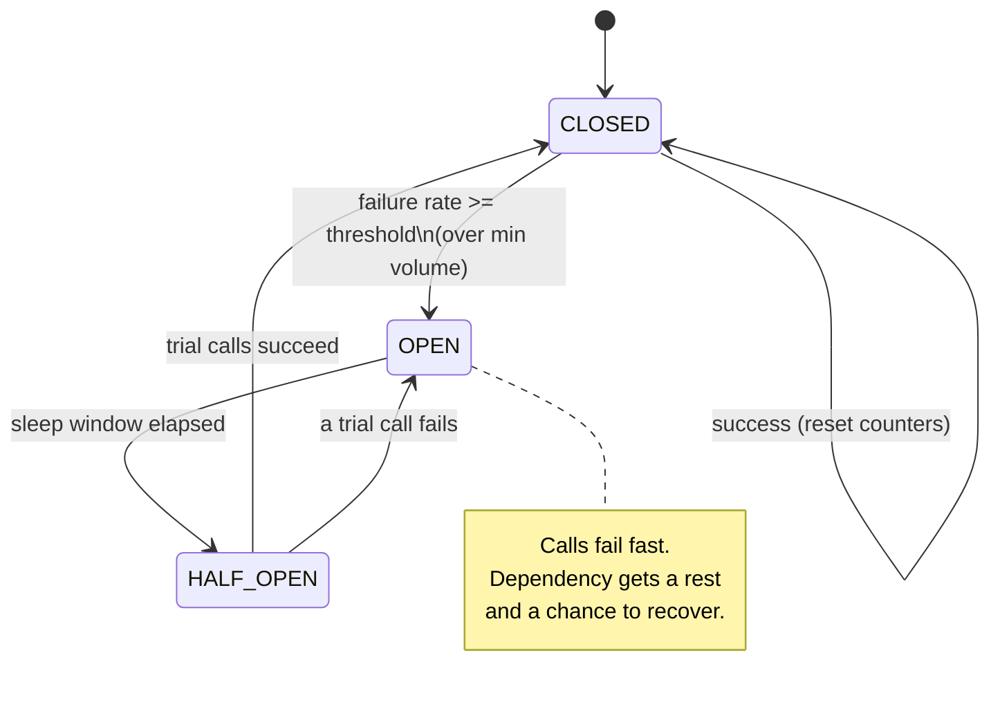
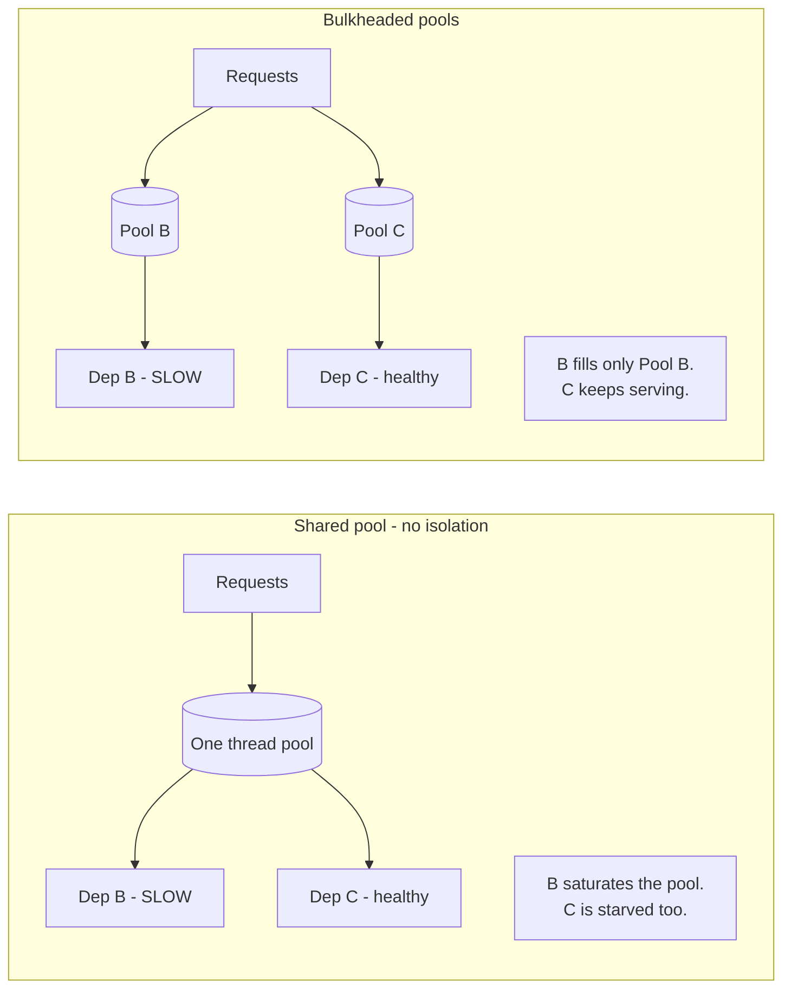
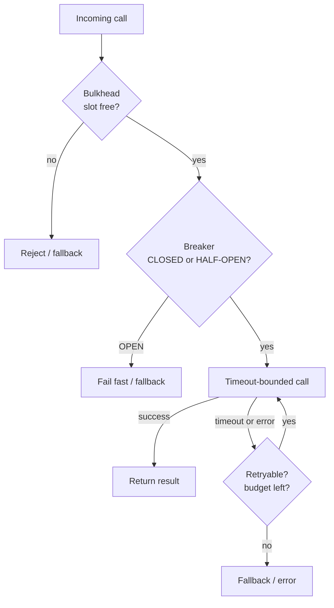

# Circuit Breakers & Bulkheads

Circuit breakers and bulkheads are two of the core **stability patterns** from Michael
Nygard's *Release It!*. Both exist to stop a *local* failure — a slow or dead dependency —
from turning into a *global* failure that takes down the whole application. A circuit
breaker **fails fast** when a dependency is unhealthy so callers stop piling up on it; a
bulkhead **isolates resources** so one sick dependency can't drain the pools every other
part of the app needs.

> [!KEY-TAKEAWAY]
> A timeout bounds how long *one* call waits. A circuit breaker decides whether to *make
> the call at all*. A bulkhead limits how much of your *resource budget* a single
> dependency can ever consume. You almost always want all three together.

These patterns are the tactical toolkit for preventing the failure modes described in
`reliability-ops/cascading-failures-and-antipatterns`, and they pair tightly with
`reliability-ops/retries-timeouts-and-backoff`. See also
`reliability-ops/load-shedding-and-backpressure` for protecting a service from *inbound*
overload (breakers/bulkheads protect a *caller* from a bad *downstream*).

## Why Fail Fast: The Cascading Failure Problem

The problem circuit breakers solve is **resource exhaustion under a slow dependency**.
Consider service A calling dependency B synchronously with a 30 s timeout. B is not down —
it's *slow* (latency spikes to 30 s). This is the dangerous case:

- Every request thread that calls B now blocks for up to 30 s instead of ~50 ms.
- Request threads are a finite pool (say 200). Under load they all end up parked waiting
  on B.
- A now has **zero free threads** — it can't serve *any* request, including ones that
  don't touch B at all (e.g. a health check or an unrelated endpoint).
- A's callers time out waiting on A, exhaust *their* threads, and the failure propagates
  **up** the call graph. One slow leaf sinks the whole tree.

This is a **cascading failure**, and the counter-intuitive lesson from *Release It!* is
that **slow is worse than down**. A dependency that fails instantly (connection refused)
frees the thread immediately; a dependency that hangs holds the resource for the full
timeout. Integration points are the number-one source of production instability.

The circuit breaker's job is to detect "B is unhealthy" and then **stop calling B** —
returning an error (or fallback) in microseconds instead of blocking for 30 s. That frees
threads, keeps A responsive for everything else, and — critically — **takes load off B so
it can recover** instead of being hammered while it's trying to come back.

> [!WARNING]
> A retry loop *without* a circuit breaker makes cascading failure worse: when B is
> struggling, retries multiply the request rate at the exact moment B can least afford it
> (a **retry storm**). Breakers and retries must be designed together — see
> `reliability-ops/retries-timeouts-and-backoff`.

## The Circuit Breaker State Machine

A circuit breaker is a **state machine** wrapped around a dependency call. It borrows the
metaphor of an electrical breaker: when current (errors) gets dangerous, the circuit
**trips open** to protect the system. Three states:

- **CLOSED** — normal operation. Calls pass through to the dependency. The breaker counts
  outcomes (successes/failures). If the failure rate crosses the threshold, it trips to
  OPEN.
- **OPEN** — the dependency is presumed unhealthy. Calls **fail fast immediately** without
  touching the dependency (throw / return fallback in microseconds). After a configured
  **sleep window** (cooldown), the breaker transitions to HALF-OPEN.
- **HALF-OPEN** — a **trial / probing** state. A limited number of test calls are allowed
  through. If they succeed, the dependency looks recovered → back to CLOSED (reset
  counters). If any fails, → OPEN again and the sleep window restarts.



> [!KEY-TAKEAWAY]
> HALF-OPEN is the whole point of the pattern's *automatic recovery*: it re-probes with a
> *trickle* of traffic rather than slamming the full load back onto a dependency that may
> still be fragile. Going OPEN → CLOSED directly on a timer would risk re-triggering the
> outage.

## CLOSED State and Tripping Thresholds

In CLOSED the breaker is measuring health. The key tuning parameters:

- **Failure-rate threshold** — trip when the *proportion* of failing calls in the window
  exceeds, e.g., 50%. Rate-based (not a raw count) so it scales with traffic. Resilience4j
  defaults to a 50% failure-rate threshold.
- **Minimum volume / minimum-number-of-calls** — don't evaluate the rate until you have a
  statistically meaningful sample. If the threshold is 50% but only 3 calls have been seen,
  2 failures shouldn't trip the breaker. Resilience4j's `minimumNumberOfCalls` defaults to
  100; Hystrix's `circuitBreaker.requestVolumeThreshold` defaulted to 20 per rolling 10 s
  window. **Without a volume gate, a breaker flaps on tiny samples.**
- **Sliding window** — count-based (last N calls) or time-based (last N seconds). Time-based
  is more predictable under variable traffic.
- **Slow-call threshold** — modern breakers (Resilience4j) also trip on *slowness*, not just
  errors: a call slower than `slowCallDurationThreshold` counts toward a `slowCallRateThreshold`.
  This catches the "slow is worse than down" case where calls technically succeed but are
  degrading the caller.

**What counts as a failure** matters: usually timeouts, connection errors, and 5xx. You
generally do **not** want to trip on 4xx (a 404 or 400 is the *caller's* fault, not the
dependency being unhealthy) — counting them pollutes the health signal and can trip the
breaker for a perfectly healthy dependency. Resilience4j supports `recordExceptions` /
`ignoreExceptions` for exactly this.

## OPEN State, the Sleep Window, and Recovery

When OPEN, the breaker short-circuits. Tuning the **sleep window** (Resilience4j
`waitDurationInOpenState`, default 60 s; Hystrix `sleepWindowInMilliseconds`, default 5 s)
is a trade-off:

| Sleep window | Effect |
|---|---|
| **Too short** | Probes too aggressively — if the dependency needs 60 s to recover, you keep re-opening and add load during its recovery. Breaker flaps. |
| **Too long** | Dependency recovered long ago but you keep failing fast — you've turned a transient blip into an extended self-inflicted outage. |

A common refinement is an **exponential / adaptive sleep window**: start at ~5 s and back
off (10 s, 20 s, …) on repeated HALF-OPEN failures, so a dependency in a long outage isn't
probed every few seconds.

In HALF-OPEN, `permittedNumberOfCallsInHalfOpenState` (Resilience4j default 10) bounds the
trial traffic. All other calls while HALF-OPEN are either rejected or queued depending on
implementation. The success of those trial calls (against the same rate threshold) decides
CLOSED vs OPEN.

> [!TIP]
> A breaker should expose its state (CLOSED/OPEN/HALF-OPEN) and trip events as metrics and
> events. An OPEN breaker is a high-signal alert — it means a dependency is actively
> failing. How you *emit and alert* on that is `observability`'s domain; the breaker just
> produces the signal.

## Bulkheads: Resource Isolation

A **bulkhead** partitions a shared resource into isolated pools so that exhausting one pool
cannot starve the others — named after the watertight compartments in a ship's hull: a
breach floods one compartment, but the bulkheads stop it flooding the whole ship and the
ship stays afloat.

The failure it prevents: with a **single shared thread pool** for all outbound calls, one
slow dependency (see the cascading-failure scenario above) consumes *every* thread, and
calls to *healthy* dependencies are starved too. Give each dependency its **own pool** and
a slow dependency B can only ever consume B's pool — calls to C and D keep flowing.



Bulkheads apply to any finite resource: thread pools, connection pools (DB / HTTP
connections), memory, in-flight request slots, even separate host groups or cells (see
cell-based architecture in `system-design`). The principle is the same: **cap the blast
radius of any single failure**.

## Thread-Pool vs Semaphore Bulkheads

Two implementations, with a real trade-off:

| Aspect | Thread-pool bulkhead | Semaphore bulkhead |
|---|---|---|
| Mechanism | Calls run on a **separate, bounded thread pool** per dependency | A **counter** caps concurrent calls; call runs on the **caller's own thread** |
| Isolation | Strong — caller thread is freed; a hung dependency ties up only its dedicated pool | Weaker — a hung call still blocks the *calling* thread |
| Timeout enforcement | Can enforce a timeout by abandoning the worker thread | Cannot interrupt a blocked caller thread; relies on the client's own timeout |
| Overhead | Higher — extra threads, context switching, queueing | Very low — just an atomic counter |
| Best for | Calls with **unpredictable / high latency** (network, remote deps) where you must protect the caller | **Fast, in-process, high-volume** calls where thread overhead would dominate |

Hystrix defaulted to **thread-pool isolation** (`THREAD`) precisely because network calls
have unpredictable latency and you want the caller thread freed. Semaphore isolation
(`SEMAPHORE`) was reserved for very high-volume calls to trusted, low-latency dependencies
where the per-call thread overhead wasn't worth it.

> [!WARNING]
> A semaphore bulkhead does **not** free a blocked caller thread. If the dependency hangs
> and the client has no timeout, a semaphore bulkhead limits *concurrency* but the blocked
> threads are still your own request threads — you can still exhaust them. This is why
> semaphore isolation must be combined with a strict client-side timeout.

## Combining Breaker, Bulkhead, and Timeout

No single pattern is sufficient — they defend different layers, and the standard resilient
integration point layers **all** of them. A typical decorator ordering (outermost →
innermost) around a remote call:

1. **Bulkhead** — reject immediately if this dependency's concurrency budget is already
   full (protects your resource pool).
2. **Circuit breaker** — if OPEN, fail fast without calling (protects against a known-bad
   dependency).
3. **Timeout / time limiter** — bound how long any single call may block (protects against
   *slow*).
4. **Retry** — on a *retryable* failure, retry with exponential backoff + jitter (protects
   against transient blips). Retries live *inside* the breaker's accounting so a retry storm
   trips the breaker.
5. **Fallback** — if all else fails, return a degraded default (see
   `reliability-ops/graceful-degradation-and-fallbacks`).



> [!WARNING]
> **Ordering is a real decision.** Retry *outside* the breaker means each retry is a fresh
> breaker-evaluated call — good, retries feed the breaker. Retry *inside* a per-call timeout
> can blow your latency budget (N retries × timeout). A common safe stack in Resilience4j is
> `Retry(CircuitBreaker(TimeLimiter(Bulkhead(call))))`, with the total retry budget capped so
> worst-case latency stays bounded.

## Resilience4j and Hystrix

**Netflix Hystrix** popularized these patterns (2012), but it is **deprecated / in
maintenance mode** since ~2018 — Netflix stopped active development and recommends adaptive,
lighter-weight approaches (and their own `concurrency-limits` / adaptive concurrency). **Do
not choose Hystrix for new work.**

**Resilience4j** is the modern, lightweight successor for the JVM: modular
(CircuitBreaker, RateLimiter, Retry, Bulkhead, TimeLimiter as separate decorators),
functional-style, built for Java 8+, and integrates with Spring Boot, Micrometer, and
Vavr. It adds **slow-call detection** and count/time-based sliding windows that Hystrix
lacked.

A minimal Resilience4j config:

```java
CircuitBreakerConfig config = CircuitBreakerConfig.custom()
    .failureRateThreshold(50)                       // trip at 50% failures
    .slowCallRateThreshold(80)                      // or 80% slow calls
    .slowCallDurationThreshold(Duration.ofSeconds(2))
    .minimumNumberOfCalls(100)                       // need 100 calls before evaluating
    .slidingWindowType(SlidingWindowType.COUNT_BASED)
    .slidingWindowSize(100)
    .waitDurationInOpenState(Duration.ofSeconds(5))  // sleep window
    .permittedNumberOfCallsInHalfOpenState(10)
    .recordExceptions(IOException.class, TimeoutException.class)
    .ignoreExceptions(BusinessException.class)       // 4xx-style: don't count
    .build();
```

Equivalents exist across ecosystems: **Polly** (.NET), **gobreaker** / **sony/gobreaker**
(Go), **opossum** (Node.js), and service-mesh-level breakers in **Envoy / Istio**
(`outlierDetection` ejects unhealthy hosts — a breaker at the L7 proxy layer, applied per
*upstream host* rather than per logical dependency).

> [!INTERVIEW]
> If asked "how would you add resilience to a service that fans out to five downstreams?":
> a strong answer is **per-dependency bulkheads** (one slow dep can't starve the others) +
> **a circuit breaker per dependency** (fail fast on a bad one) + **timeouts tuned to each
> dep's p99** + **retries with backoff & jitter only on idempotent calls** + **fallbacks**
> for the non-critical ones. Then mention you'd put breaker-trip and bulkhead-rejection on
> a dashboard (observability) and load-test the failure modes with chaos injection.

## Common Anti-Patterns

- **Retry without a breaker** → retry storms amplify load on a struggling dependency.
- **Breaker that trips on 4xx** → client errors pollute the health signal; the breaker
  opens against a healthy dependency.
- **No minimum-volume gate** → breaker flaps on tiny samples (1 failure out of 2 calls
  "= 50%").
- **Sleep window mistuned** → too short re-hammers a recovering dep; too long extends a
  self-inflicted outage.
- **Semaphore bulkhead + no client timeout** → concurrency is capped but blocked threads
  are still your own request threads; you still exhaust them.
- **One shared thread pool for all downstreams** → the whole point of bulkheads is lost;
  one slow dep starves everything.
- **Timeout longer than the caller's timeout** → your call is still running after the
  caller already gave up; wasted work, no benefit.
- **No fallback** → a fail-fast breaker just converts a hang into an error; often you want
  a *degraded* answer instead of an error.

## Common Interview Follow-ups

- *Why is a slow dependency more dangerous than a dead one?* Slow holds the thread for the
  full timeout, exhausting the pool; dead fails instantly and frees it.
- *What happens in the HALF-OPEN state?* A limited number of trial calls probe the
  dependency; success → CLOSED, failure → OPEN with the sleep window restarted.
- *Circuit breaker vs bulkhead — how do they differ?* Breaker = *stop calling* a bad
  dependency (temporal: fail fast in time). Bulkhead = *cap the resources* one dependency
  can consume (spatial: limit blast radius). Complementary, not alternatives.
- *Thread-pool vs semaphore bulkhead?* Thread-pool isolates the caller thread and can
  enforce timeouts (best for network calls); semaphore is a cheap concurrency counter on
  the caller's thread (best for fast in-process calls) but can't free a blocked thread.
- *How do you tune the failure threshold?* Rate-based with a minimum volume gate; record
  only real dependency failures (timeouts/5xx), ignore 4xx.
- *Where do retries fit relative to the breaker?* Retries feed the breaker's accounting;
  cap the retry budget so worst-case latency stays bounded; only retry idempotent calls.
- *Why not use Hystrix?* Deprecated/maintenance mode since ~2018; use Resilience4j (JVM),
  Polly (.NET), or mesh-level outlier detection (Envoy/Istio).
- *Is the breaker state shared across instances?* Usually per-instance (in-memory). A
  distributed/shared breaker is possible but adds a dependency and latency; most systems
  accept per-instance breakers plus mesh-level outlier detection for host ejection.

## References

- Michael T. Nygard, *Release It! Design and Deploy Production-Ready Software*, 2nd ed.
  (Pragmatic Bookshelf, 2018) — Circuit Breaker, Bulkhead, Timeouts, and the
  cascading-failure / integration-point failure modes.
- Martin Fowler, "CircuitBreaker" (martinfowler.com, 2014).
- Resilience4j documentation — CircuitBreaker, Bulkhead, TimeLimiter, Retry modules
  (resilience4j.readme.io).
- Netflix Hystrix wiki — "How it Works" and the deprecation notice (github.com/Netflix/Hystrix).
- Google, *Site Reliability Engineering*, Ch. 22 "Addressing Cascading Failures".
- Envoy / Istio documentation — Circuit Breaking and Outlier Detection.
- AWS Well-Architected Framework, Reliability Pillar — "Throttling requests" and
  "Fail fast and limit queues".
