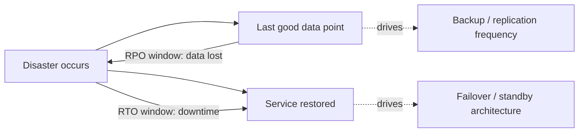
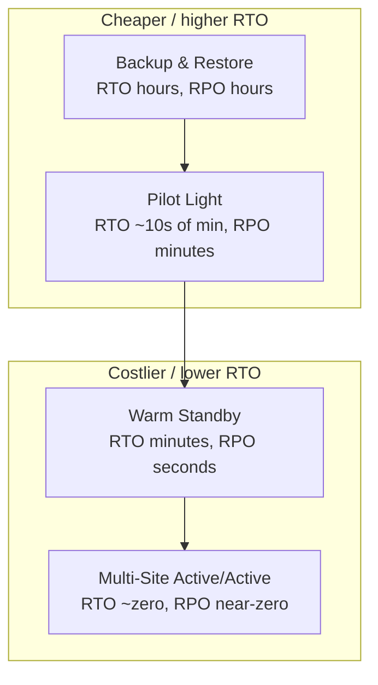
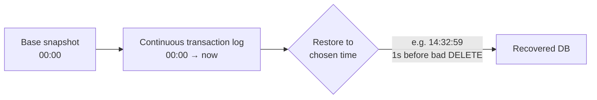
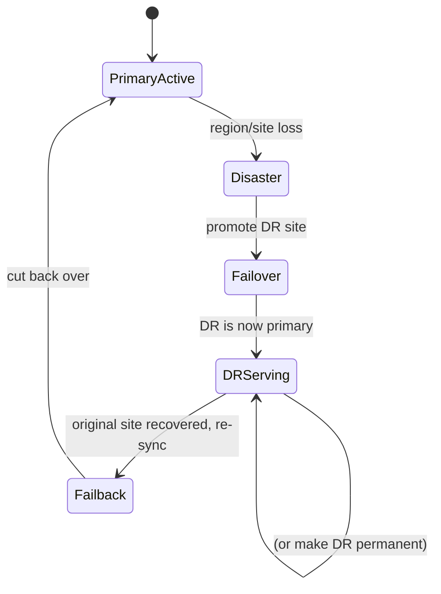

# Disaster Recovery: RPO, RTO & Strategies

Disaster recovery (DR) is the discipline of **surviving events that take out a whole failure
domain** — an entire region, a data center, or an irrecoverably corrupted dataset — and
bringing the system back to a working state within an agreed time and data-loss budget. It is
distinct from ordinary **high availability (HA)**: HA handles the *routine* failure of a node,
disk, or AZ *within* your normal architecture and is usually automatic and invisible; DR
handles the *rare, correlated, catastrophic* failure that HA cannot absorb — and it is
explicitly a business decision priced in dollars.

Two numbers govern every DR conversation, and getting a candidate to define them crisply,
keep them **independent**, and connect them to **cost** is the whole interview:

- **RPO — Recovery Point Objective** = the maximum acceptable **data loss**, measured in
  *time*. "RPO = 1 hour" means after a disaster you may lose up to the last hour of writes.
  RPO drives **backup/replication frequency**.
- **RTO — Recovery Time Objective** = the maximum acceptable **downtime**, measured in *time*.
  "RTO = 4 hours" means the system must be serving again within 4 hours of the disaster.
  RTO drives **failover architecture**.

This topic owns the **operational DR practice**: RPO/RTO definitions and tiers, the AWS DR
strategy spectrum (Backup & Restore → Pilot Light → Warm Standby → Multi-Site Active/Active),
backup craft (3-2-1, immutability, PITR), and failover/failback/drills. For the **high-level
multi-region DR architecture and CAP-style theory** see `system-design`
(aws-resilience-multiregion-dr); for **replication mechanics** see
`messaging-databases` (replication); for the **HA patterns DR builds on** (redundancy,
health checks, failover safety/quorum) see `reliability-ops/redundancy-failover-and-health-checks`;
for **CI/CD-driven redeploy of infrastructure** see `devops-cicd`.

> [!KEY-TAKEAWAY]
> RPO and RTO are **independent** and each has its own cost curve. RPO → how much data you can
> lose → replication/backup frequency. RTO → how long you can be down → how much standby
> infrastructure you keep warm. Driving *both* toward zero is exponentially expensive
> (Multi-Site Active/Active), so DR is always a **cost-vs-recovery** negotiation per workload.
> And the deepest DR truth: **replication is not a backup** — it faithfully copies corruption
> and deletes to every replica, so you also need point-in-time backups.

---

## Disaster recovery vs high availability

HA and DR are complementary but answer different questions. **HA** keeps a service running
through the *expected* failures inside its normal footprint — a crashed process, a bad disk,
a dead instance, an AZ outage — via redundancy and automatic failover, typically with
**seconds** of impact and **no data loss**. **DR** is the plan for the *unexpected,
correlated catastrophe* that exceeds the HA design envelope: loss of an entire region,
deletion or corruption of the primary dataset, a ransomware event, or a control-plane failure
that takes out all of your in-region redundancy at once.

| Dimension | High availability | Disaster recovery |
|---|---|---|
| Failure scope | Node / disk / AZ (single failure domain) | Region / whole site / dataset |
| Frequency | Common, expected | Rare, catastrophic |
| Response | Automatic, invisible, seconds | Often deliberate, declared, minutes–hours |
| Governing metric | Availability SLO (nines) | RTO + RPO |
| Cost framing | Baseline architecture cost | Insurance premium (priced per workload) |

The practical error interviewers listen for: treating "we're multi-AZ" as a DR story. Multi-AZ
is HA within one region; a region-wide control-plane event, a bad global config push, or a
`DROP TABLE` replicated to every AZ defeats it. DR needs a *separate* failure domain (another
region) **and** a restore path that is independent of the live data.

---

## RPO — Recovery Point Objective (acceptable data loss)

**RPO is how much data, expressed as a window of time, the business can afford to lose.** It is
measured *backward* from the moment of the disaster: RPO = 15 minutes means the most recent
recoverable state may be up to 15 minutes stale, so up to 15 minutes of writes vanish.

RPO is set by **data value and regulatory need**, then implemented by **how often you capture
data**:

| RPO target | Implementation | Rough cost |
|---|---|---|
| ~24 hours | Nightly backup | Cheapest |
| ~1 hour | Hourly snapshots / frequent log shipping | Low |
| ~minutes | Continuous backup / async replication / PITR | Moderate |
| ~seconds | Async replication with tight log flush | High |
| **0 (zero data loss)** | **Synchronous replication** (commit acks only after a remote replica has it) | **Highest** |

> [!WARNING]
> **RPO = 0 requires synchronous replication**, which couples your write latency to the
> round-trip time to the remote site and blocks writes if the remote is unreachable (a
> CAP/availability trade). Across regions (e.g. 60–90 ms RTT) synchronous replication is often
> unacceptable for write-heavy workloads, so true zero-RPO cross-region is rare and expensive;
> most "near-zero" designs accept seconds of async lag.

The gap between "what we promised" and "what we deliver" is the **actual RPO**, bounded by your
replication lag or backup interval. If backups run nightly, your real RPO is *up to* ~24 hours
regardless of the number on the SLA sheet.

---

## RTO — Recovery Time Objective (acceptable downtime)

**RTO is how long the system may be unavailable** before the business is unacceptably harmed —
the clock from disaster declaration to service restored. RTO is set by revenue/impact per unit
downtime and implemented by **how much recovery infrastructure you keep ready**.

RTO includes the *whole* recovery path, which candidates routinely underestimate:

1. **Detection** — noticing and confirming the disaster (see `observability` for alerting).
2. **Decision / declaration** — a human deciding to invoke DR (often the biggest hidden delay).
3. **Provisioning** — standing up compute/network/DB in the recovery site.
4. **Data recovery** — restoring/promoting the dataset (often the longest step; restoring a
   multi-TB backup can take hours).
5. **Cutover** — repointing DNS/traffic and validating.

> [!TIP]
> "RTO" is only met when the service is **actually serving correct traffic**, not when the
> instance boots. A frequently-missed cost is **DNS TTL**: if clients cache your DNS record for
> 300 s, cutover isn't complete until that TTL expires. Keep failover-record TTLs low (e.g.
> 60 s) and prefer health-checked DNS failover or anycast.

Lowering RTO means paying to remove steps: pre-provisioned infrastructure removes step 3, warm
data (replicas) shrinks step 4, and automated/tested runbooks shrink step 2. Multi-Site
Active/Active removes essentially all of them (RTO → seconds) at maximum cost.

---

## RPO and RTO are independent (and drive cost separately)

A staple interview point: **RPO and RTO are orthogonal** — you can want one tight and the other
loose, and they cost money in different places.

- **Tight RPO, loose RTO**: a data warehouse or ledger where losing transactions is
  unacceptable (RPO ≈ 0, continuous replication) but being down for a few hours during recovery
  is fine (RTO = hours). Spend on **replication**, not on standby capacity.
- **Loose RPO, tight RTO**: a stateless read-mostly site backed by a cache/CDN where an hour of
  stale content is tolerable (RPO = 1 h) but any downtime loses ad revenue (RTO ≈ 0). Spend on
  **warm/active standby compute**, not on synchronous replication.

Because they are independent, you pick a DR strategy by plotting your **required RTO and RPO**
against **what you're willing to spend** — which is exactly what the DR strategy spectrum
encodes.

---

## The DR strategy spectrum (cost vs RTO/RPO)

AWS's canonical framing (Well-Architected Reliability pillar) is a spectrum of four strategies.
Moving down the list buys **lower RTO/RPO** for **higher steady-state cost and complexity**.

| Strategy | What runs in DR site | Typical RTO | Typical RPO | Relative cost | Effort at DR time |
|---|---|---|---|---|---|
| **Backup & Restore** | Nothing (backups in object storage) | Hours | Hours | $ | Provision everything + restore data |
| **Pilot Light** | Core data replicated; servers **off** | 10s of minutes | Minutes | $$ | Scale up / switch on app tier |
| **Warm Standby** | Full stack, **scaled down**, running | Minutes | Seconds | $$$ | Scale up to full capacity + cutover |
| **Multi-Site Active/Active** | Full stack live in both, serving traffic | Seconds (near-zero) | Near-zero | $$$$ | Just remove the failed site |

The key mental model: as you go down, you **pre-pay** more of the recovery work (keeping
infrastructure and data ready) to **buy back** recovery time. There is no free lunch — the
"best" strategy is per-workload, driven by the cost of downtime for *that* system.

---

## Backup & Restore

The cheapest strategy: take backups (DB dumps, snapshots, object copies) and store them in a
**separate region** in durable object storage. Nothing is running in the recovery site until
disaster strikes; you then provision infrastructure (ideally via IaC — see `devops-cicd`) and
**restore data from backups**.

- **RTO**: hours — dominated by provisioning + the time to *download and restore* the backup
  (restoring multiple TB over the network is slow; test it to know the real number).
- **RPO**: the backup interval (nightly backup → up to ~24 h; hourly → up to ~1 h).
- **Best for**: non-critical, cost-sensitive, or dev/test workloads; also the mandatory
  *floor* — even active/active shops keep backups because replication doesn't protect against
  corruption.

> [!WARNING]
> Backup & Restore is the **only** strategy on the spectrum that protects against **logical
> corruption and deletion**, because it keeps *historical* copies. The other three keep data
> "fresh" via replication — which is exactly what propagates a bad delete. Never run a DR plan
> that has replication but no point-in-time backups.

---

## Pilot Light

The core data layer runs and is **continuously replicated** to the DR region, but the
application/compute tier is **provisioned but switched off** (or defined as templates only —
"the pilot light is lit but the furnace is off"). On disaster you **turn on and scale up** the
app tier and cut traffic over.

- **RTO**: tens of minutes — you skip data restore (data is already there) but still boot and
  scale the compute tier.
- **RPO**: minutes to seconds, set by replication lag.
- **Trade-off**: much cheaper than Warm Standby because you pay only for storage/replication and
  minimal always-on resources, not for a running fleet. Risk: the cold app tier is **unexercised**
  — capacity limits, AMI drift, or scaling problems surface exactly when you invoke DR, so drills
  matter more here.

---

## Warm Standby

A **fully functional, scaled-down copy** of the entire stack runs continuously in the DR region
— it can serve traffic *right now*, just not at full production capacity. On disaster you
**scale it up** to full size and cut over.

- **RTO**: minutes — no provisioning or data restore; only scale-up + cutover.
- **RPO**: seconds, set by replication lag.
- **Difference vs Pilot Light**: in Pilot Light the app tier is **off**; in Warm Standby it is
  **on but small**. Because it's always running, you can even route a trickle of real traffic or
  synthetic canaries to it, so it's continuously validated.
- **Trade-off**: you pay for an always-on (if minimal) second fleet — more than Pilot Light, less
  than Active/Active.

---

## Multi-Site Active/Active

Full production stacks run in **two or more regions simultaneously**, all **serving live
traffic** (via latency/geo/weighted DNS or anycast). On disaster you simply **remove the failed
site** from rotation; surviving sites absorb the load.

- **RTO**: seconds / near-zero — no failover *action* is required, just deregistration.
- **RPO**: near-zero — but achieving true **zero** requires **synchronous** cross-region writes,
  which is latency-prohibitive; most active/active designs use **async replication (seconds of
  lag)** or partition data so each region owns its writes.
- **Trade-off**: most expensive (2×+ full infrastructure) and **most complex**: multi-master
  write conflicts, data consistency, and split-brain must be solved (see `system-design` CAP and
  `messaging-databases` conflict resolution). You buy resilience with engineering difficulty, not
  just money.

> [!INTERVIEW]
> A classic trap: candidates say "active/active gives RPO = 0." Only **synchronous** replication
> gives RPO = 0, and cross-region synchronous replication is usually impractical due to RTT. State
> that active/active gives *near-zero* RPO with async replication, and that true zero forces a
> latency/availability trade (CAP) that most global systems reject.

---

## Backups: the 3-2-1 rule

The industry-standard backup baseline (originating with photographer Peter Krogh and endorsed by
US-CERT/CISA):

> **3-2-1**: keep **3** copies of data, on **2** different media/storage types, with **1** copy
> **off-site** (a different physical location / region / provider).

The point is **decorrelating failure domains**: three copies on one array die together when the
array dies; the off-site copy survives a site loss. Modern extensions add resilience against
new threats:

- **3-2-1-1-0**: the extra **1** = one copy **offline/immutable/air-gapped** (ransomware
  defense), and **0** = zero errors verified by regularly **testing restores**.

The off-site copy is what turns a backup regime into an actual DR capability — a backup in the
same region/account as the primary shares its failure domain (region outage, account
compromise, mass delete).

---

## Test your restores (untested backup = no backup)

The single most important operational maxim in DR: **a backup you have never restored is not a
backup — it's a hope.** Backups fail silently in ways that only surface on restore: incomplete
snapshots, corrupt archives, missing encryption keys, un-runnable restore scripts, schema
mismatches, or a restore that takes 10× longer than your RTO allows.

- **Regularly perform test restores** into an isolated environment and verify data integrity.
- **Measure the restore time** — this is your *real* RTO for Backup & Restore, and it's often a
  shocking number for large datasets.
- **DR drills / game days**: periodically *invoke the whole DR runbook* (ideally including a
  real regional failover). This validates the runbook, the RTO/RPO numbers, and the human
  process — and finds the AMI drift, IAM gaps, and quota limits before a real disaster does.
  (Chaos engineering formalizes this — see `reliability-ops/cascading-failures-and-antipatterns`
  and chaos practice.)

> [!KEY-TAKEAWAY]
> RTO and RPO on a slide are *aspirations*. The only way to know your true numbers is to **run
> the restore and time it**. Netflix/AWS-style "game days" and scheduled DR drills exist because
> unexercised recovery paths rot.

---

## Immutable & offsite backups (ransomware defense)

Ransomware and malicious insiders changed the backup threat model: an attacker who gets
credentials will **delete or encrypt your backups too**. Defenses:

- **Immutability / WORM**: write-once-read-many backups that **cannot be modified or deleted**
  until a retention period expires — e.g. S3 Object Lock (Compliance mode), which even the
  root/account owner cannot override during the lock window.
- **Air-gapped / offline copies**: media or accounts not reachable from the production network or
  credentials (the "1" in 3-2-1-1-0).
- **Separate account/blast-radius isolation**: store backups in a **different cloud account** with
  tightly scoped, separate credentials so a compromise of the production account can't reach them.
- **MFA-delete / restricted delete** on backup buckets, and versioning so an overwrite doesn't
  destroy prior good copies.

For rate-limiting/abuse *prevention* see `security`; here the reliability angle is simply that
your last line of recovery must survive an attacker with production access.

---

## Point-in-time recovery (PITR)

**PITR** lets you restore a dataset to **any moment** within a retention window, not just to a
discrete snapshot. It works by combining a **base snapshot** with a **continuous stream of
transaction logs** (WAL / binlog / redo), then replaying the log forward to the chosen instant.

Why it matters for DR: PITR is the antidote to **logical failures**. If a bad deploy runs a
destructive query at 14:33, you restore to **14:32:59** — one second before — losing almost no
good data. Continuous log capture also gives you a very tight **RPO (seconds)** for the
data layer. Trade-offs: retention window costs storage, and replaying a long log stream can make
restore *time* (RTO) longer than a plain snapshot restore.

---

## Failover and failback

**Failover** is promoting the DR site to primary; **failback** is the (often harder) return to
the original site once it recovers.

- **Failover** may be **automatic** (health-check-driven DNS/traffic switch — low RTO but risks
  false positives and split-brain) or **manual/declared** (a human invokes the runbook — safer,
  higher RTO). Cross-region failover is more often deliberate because the blast radius of a
  mistaken failover is huge. Safe failover needs **quorum/fencing** to avoid two primaries — see
  `reliability-ops/redundancy-failover-and-health-checks`.
- **Failback** is frequently *underplanned*: you must re-replicate all writes accumulated in the
  DR site back to the recovered primary (reversing replication direction), reconcile any
  conflicts, and cut back over — ideally during a low-traffic window. Many outages are *extended*
  by a botched failback, and some teams choose to simply **stay** on the DR site and make it the
  new primary rather than fail back.

A well-run DR plan documents **both** directions and drills both — testing failover but never
failback is a common gap.

---

## Replication is not a backup (data corruption & logical failures)

The deepest DR concept and a favorite senior interview question. **Replication protects against
infrastructure loss; it does not protect against data.** A replica exists to have a *current*
copy — so it faithfully and instantly copies **every write, including the bad ones**:

- A buggy migration that corrupts rows → corruption is replicated to all replicas.
- An accidental `DROP TABLE` / mass `DELETE` → the delete is replicated everywhere in
  milliseconds.
- Ransomware encryption → encrypted blocks replicate to the standby.
- A bad application-level write → propagated identically.

Replicas give you **fault tolerance and read scaling**, not recoverability from *logical*
errors. Only **historical, immutable copies** — snapshots, PITR logs, offline backups — let you
go *back in time* to before the corruption. This is why **every** DR strategy, even Multi-Site
Active/Active, keeps point-in-time backups underneath it.

| Threat | Redundancy/replication helps? | Backup/PITR helps? |
|---|---|---|
| Instance/disk/AZ failure | ✅ Yes | (slow) |
| Region loss | ✅ (cross-region replica) | ✅ (cross-region backup) |
| Accidental `DROP`/`DELETE` | ❌ No — replicated | ✅ Yes — restore to before |
| Data corruption bug | ❌ No — replicated | ✅ Yes — PITR |
| Ransomware | ❌ No — replicated | ✅ Yes — immutable/offline copy |

> [!WARNING]
> "We have three replicas, so we're safe" is a red-flag answer. Ask: *safe from what?* Replicas
> are safe from **hardware**; they are actively *dangerous* against logical corruption because
> they spread it instantly. You need backups **and** replicas — they solve different problems.

---

## Common Interview Follow-ups

- **"Define RPO and RTO and which one drives what."** RPO = max data loss (drives backup/replication
  frequency); RTO = max downtime (drives failover architecture); they're independent cost curves.
- **"You need RPO = 0. What does that force?"** Synchronous replication (commit waits for a remote
  ack) — and across regions that means paying write latency and losing availability if the remote
  is unreachable (a CAP trade). Usually impractical cross-region.
- **"Walk me from Backup & Restore to Active/Active — what changes at each step?"** Each step
  pre-pays more recovery work (keeping data warm, then compute warm, then compute live) to buy
  lower RTO/RPO at higher cost. Name the RTO/RPO/cost of each.
- **"We have cross-region replicas. Are we protected against a bad deploy that deletes data?"**
  No — replication copies the delete. You need PITR/backups to go back to before it.
- **"Your backups exist but you've never restored one. What's your real RTO/RPO?"** Unknown, and
  probably worse than the SLA — untested backups fail silently; measure restore time in a drill.
- **"How do you protect backups from ransomware?"** Immutability/Object-Lock, offline/air-gapped
  copies, separate account with distinct credentials, MFA-delete, versioning (3-2-1-1-0).
- **"Difference between Pilot Light and Warm Standby?"** Pilot Light: data replicated, compute
  **off** (scale up on DR). Warm Standby: full stack **running but scaled down** (scale up on DR).
- **"What's often forgotten in RTO?"** Detection + human decision time and **DNS TTL** on cutover —
  RTO isn't met until traffic actually serves.
- **"What about failback?"** Reverse replication, reconcile conflicts, cut back over in a quiet
  window — often harder than failover and frequently undrilled.

## References

- Google, *Site Reliability Engineering* — Ch. 26 "Data Integrity: What You Read Is What You
  Wrote" (backups vs replication, "no one wants backups, they want restores").
- Google, *The SRE Workbook* — data integrity and disaster-recovery practice.
- AWS Well-Architected Framework — **Reliability Pillar**: "Disaster recovery (DR) objectives"
  (RPO/RTO) and the four DR strategies (Backup & Restore, Pilot Light, Warm Standby,
  Multi-Site Active/Active).
- AWS, "Disaster Recovery of Workloads on AWS: Recovery in the Cloud" (whitepaper).
- Michael Nygard, *Release It!* (2nd ed.) — stability patterns and operations context.
- US-CERT/CISA guidance on the **3-2-1 backup rule**; Veeam's **3-2-1-1-0** extension.
- AWS S3 Object Lock (WORM/immutability) and RDS/Aurora point-in-time recovery documentation.
