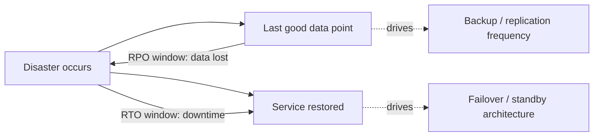
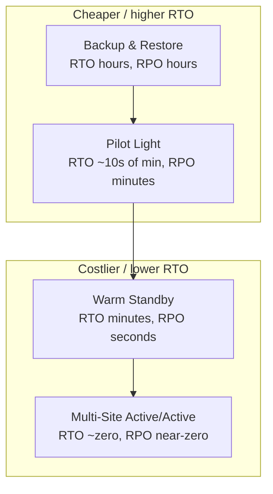
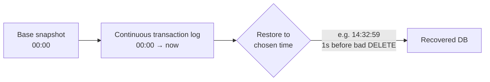
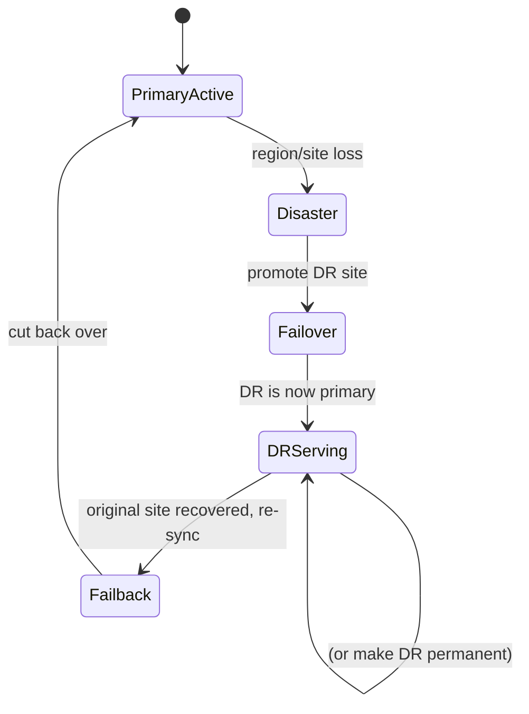

# Disaster Recovery: RPO, RTO & Strategies

Disaster recovery (DR) is the discipline of **surviving events that take out a whole failure
domain** — an entire region, a data center, or an irrecoverably corrupted dataset — and
bringing the system back to a working state within an agreed time and data-loss budget. It is
distinct from ordinary **high availability (HA)**: HA handles the *routine* failure of a node,
disk, or AZ *within* your normal architecture and is usually automatic and invisible; DR
handles the *rare, correlated, catastrophic* failure that HA cannot absorb — and it is
explicitly a business decision priced in dollars.

Two numbers govern every DR conversation, and getting a candidate to define them crisply,
keep them **independent**, and connect them to **cost** is the whole interview:

- **RPO — Recovery Point Objective** = the maximum acceptable **data loss**, measured in
  *time*. "RPO = 1 hour" means after a disaster you may lose up to the last hour of writes.
  RPO drives **backup/replication frequency**.
- **RTO — Recovery Time Objective** = the maximum acceptable **downtime**, measured in *time*.
  "RTO = 4 hours" means the system must be serving again within 4 hours of the disaster.
  RTO drives **failover architecture**.

This topic owns the **operational DR practice**: RPO/RTO definitions and tiers, the AWS DR
strategy spectrum (Backup & Restore → Pilot Light → Warm Standby → Multi-Site Active/Active),
backup craft (3-2-1, immutability, PITR), and failover/failback/drills. For the **high-level
multi-region DR architecture and CAP-style theory** see `system-design`
(aws-resilience-multiregion-dr); for **replication mechanics** see
`messaging-databases` (replication); for the **HA patterns DR builds on** (redundancy,
health checks, failover safety/quorum) see `reliability-ops/redundancy-failover-and-health-checks`;
for **CI/CD-driven redeploy of infrastructure** see `devops-cicd`.

> [!KEY-TAKEAWAY]
> RPO and RTO are **independent** and each has its own cost curve. RPO → how much data you can
> lose → replication/backup frequency. RTO → how long you can be down → how much standby
> infrastructure you keep warm. Driving *both* toward zero is exponentially expensive
> (Multi-Site Active/Active), so DR is always a **cost-vs-recovery** negotiation per workload.
> And the deepest DR truth: **replication is not a backup** — it faithfully copies corruption
> and deletes to every replica, so you also need point-in-time backups.

---

## Disaster recovery vs high availability

HA and DR are complementary but answer different questions. **HA** keeps a service running
through the *expected* failures inside its normal footprint — a crashed process, a bad disk,
a dead instance, an AZ outage — via redundancy and automatic failover, typically with
**seconds** of impact and **no data loss**. **DR** is the plan for the *unexpected,
correlated catastrophe* that exceeds the HA design envelope: loss of an entire region,
deletion or corruption of the primary dataset, a ransomware event, or a control-plane failure
that takes out all of your in-region redundancy at once.

| Dimension | High availability | Disaster recovery |
|---|---|---|
| Failure scope | Node / disk / AZ (single failure domain) | Region / whole site / dataset |
| Frequency | Common, expected | Rare, catastrophic |
| Response | Automatic, invisible, seconds | Often deliberate, declared, minutes–hours |
| Governing metric | Availability SLO (nines) | RTO + RPO |
| Cost framing | Baseline architecture cost | Insurance premium (priced per workload) |

The practical error interviewers listen for: treating "we're multi-AZ" as a DR story. Multi-AZ
is HA within one region; a region-wide control-plane event, a bad global config push, or a
`DROP TABLE` replicated to every AZ defeats it. DR needs a *separate* failure domain (another
region) **and** a restore path that is independent of the live data.

---

## RPO — Recovery Point Objective (acceptable data loss)

**RPO is how much data, expressed as a window of time, the business can afford to lose.** It is
measured *backward* from the moment of the disaster: RPO = 15 minutes means the most recent
recoverable state may be up to 15 minutes stale, so up to 15 minutes of writes vanish.

RPO is set by **data value and regulatory need**, then implemented by **how often you capture
data**:

| RPO target | Implementation | Rough cost |
|---|---|---|
| ~24 hours | Nightly backup | Cheapest |
| ~1 hour | Hourly snapshots / frequent log shipping | Low |
| ~minutes | Continuous backup / async replication / PITR | Moderate |
| ~seconds | Async replication with tight log flush | High |
| **0 (zero data loss)** | **Synchronous replication** (commit acks only after a remote replica has it) | **Highest** |

> [!WARNING]
> **RPO = 0 requires synchronous replication**, which couples your write latency to the
> round-trip time to the remote site and blocks writes if the remote is unreachable (a
> CAP/availability trade). Across regions (e.g. 60–90 ms RTT) synchronous replication is often
> unacceptable for write-heavy workloads, so true zero-RPO cross-region is rare and expensive;
> most "near-zero" designs accept seconds of async lag.

The gap between "what we promised" and "what we deliver" is the **actual RPO**, bounded by your
replication lag or backup interval. If backups run nightly, your real RPO is *up to* ~24 hours
regardless of the number on the SLA sheet.

---

## RTO — Recovery Time Objective (acceptable downtime)

**RTO is how long the system may be unavailable** before the business is unacceptably harmed —
the clock from disaster declaration to service restored. RTO is set by revenue/impact per unit
downtime and implemented by **how much recovery infrastructure you keep ready**.

RTO includes the *whole* recovery path, which candidates routinely underestimate:

1. **Detection** — noticing and confirming the disaster (see `observability` for alerting).
2. **Decision / declaration** — a human deciding to invoke DR (often the biggest hidden delay).
3. **Provisioning** — standing up compute/network/DB in the recovery site.
4. **Data recovery** — restoring/promoting the dataset (often the longest step; restoring a
   multi-TB backup can take hours).
5. **Cutover** — repointing DNS/traffic and validating.

> [!TIP]
> "RTO" is only met when the service is **actually serving correct traffic**, not when the
> instance boots. A frequently-missed cost is **DNS TTL**: if clients cache your DNS record for
> 300 s, cutover isn't complete until that TTL expires. Keep failover-record TTLs low (e.g.
> 60 s) and prefer health-checked DNS failover or anycast.

Lowering RTO means paying to remove steps: pre-provisioned infrastructure removes step 3, warm
data (replicas) shrinks step 4, and automated/tested runbooks shrink step 2. Multi-Site
Active/Active removes essentially all of them (RTO → seconds) at maximum cost.

---

## RPO and RTO are independent (and drive cost separately)

A staple interview point: **RPO and RTO are orthogonal** — you can want one tight and the other
loose, and they cost money in different places.

- **Tight RPO, loose RTO**: a data warehouse or ledger where losing transactions is
  unacceptable (RPO ≈ 0, continuous replication) but being down for a few hours during recovery
  is fine (RTO = hours). Spend on **replication**, not on standby capacity.
- **Loose RPO, tight RTO**: a stateless read-mostly site backed by a cache/CDN where an hour of
  stale content is tolerable (RPO = 1 h) but any downtime loses ad revenue (RTO ≈ 0). Spend on
  **warm/active standby compute**, not on synchronous replication.

Because they are independent, you pick a DR strategy by plotting your **required RTO and RPO**
against **what you're willing to spend** — which is exactly what the DR strategy spectrum
encodes.

---

## The DR strategy spectrum (cost vs RTO/RPO)

AWS's canonical framing (Well-Architected Reliability pillar) is a spectrum of four strategies.
Moving down the list buys **lower RTO/RPO** for **higher steady-state cost and complexity**.

| Strategy | What runs in DR site | Typical RTO | Typical RPO | Relative cost | Effort at DR time |
|---|---|---|---|---|---|
| **Backup & Restore** | Nothing (backups in object storage) | Hours | Hours | $ | Provision everything + restore data |
| **Pilot Light** | Core data replicated; servers **off** | 10s of minutes | Minutes | $$ | Scale up / switch on app tier |
| **Warm Standby** | Full stack, **scaled down**, running | Minutes | Seconds | $$$ | Scale up to full capacity + cutover |
| **Multi-Site Active/Active** | Full stack live in both, serving traffic | Seconds (near-zero) | Near-zero | $$$$ | Just remove the failed site |

The key mental model: as you go down, you **pre-pay** more of the recovery work (keeping
infrastructure and data ready) to **buy back** recovery time. There is no free lunch — the
"best" strategy is per-workload, driven by the cost of downtime for *that* system.

---

## Backup & Restore

The cheapest strategy: take backups (DB dumps, snapshots, object copies) and store them in a
**separate region** in durable object storage. Nothing is running in the recovery site until
disaster strikes; you then provision infrastructure (ideally via IaC — see `devops-cicd`) and
**restore data from backups**.

- **RTO**: hours — dominated by provisioning + the time to *download and restore* the backup
  (restoring multiple TB over the network is slow; test it to know the real number).
- **RPO**: the backup interval (nightly backup → up to ~24 h; hourly → up to ~1 h).
- **Best for**: non-critical, cost-sensitive, or dev/test workloads; also the mandatory
  *floor* — even active/active shops keep backups because replication doesn't protect against
  corruption.

> [!WARNING]
> Backup & Restore is the **only** strategy on the spectrum that protects against **logical
> corruption and deletion**, because it keeps *historical* copies. The other three keep data
> "fresh" via replication — which is exactly what propagates a bad delete. Never run a DR plan
> that has replication but no point-in-time backups.

---

## Pilot Light

The core data layer runs and is **continuously replicated** to the DR region, but the
application/compute tier is **provisioned but switched off** (or defined as templates only —
"the pilot light is lit but the furnace is off"). On disaster you **turn on and scale up** the
app tier and cut traffic over.

- **RTO**: tens of minutes — you skip data restore (data is already there) but still boot and
  scale the compute tier.
- **RPO**: minutes to seconds, set by replication lag.
- **Trade-off**: much cheaper than Warm Standby because you pay only for storage/replication and
  minimal always-on resources, not for a running fleet. Risk: the cold app tier is **unexercised**
  — capacity limits, AMI drift, or scaling problems surface exactly when you invoke DR, so drills
  matter more here.

---

## Warm Standby

A **fully functional, scaled-down copy** of the entire stack runs continuously in the DR region
— it can serve traffic *right now*, just not at full production capacity. On disaster you
**scale it up** to full size and cut over.

- **RTO**: minutes — no provisioning or data restore; only scale-up + cutover.
- **RPO**: seconds, set by replication lag.
- **Difference vs Pilot Light**: in Pilot Light the app tier is **off**; in Warm Standby it is
  **on but small**. Because it's always running, you can even route a trickle of real traffic or
  synthetic canaries to it, so it's continuously validated.
- **Trade-off**: you pay for an always-on (if minimal) second fleet — more than Pilot Light, less
  than Active/Active.

---

## Multi-Site Active/Active

Full production stacks run in **two or more regions simultaneously**, all **serving live
traffic** (via latency/geo/weighted DNS or anycast). On disaster you simply **remove the failed
site** from rotation; surviving sites absorb the load.

- **RTO**: seconds / near-zero — no failover *action* is required, just deregistration.
- **RPO**: near-zero — but achieving true **zero** requires **synchronous** cross-region writes,
  which is latency-prohibitive; most active/active designs use **async replication (seconds of
  lag)** or partition data so each region owns its writes.
- **Trade-off**: most expensive (2×+ full infrastructure) and **most complex**: multi-master
  write conflicts, data consistency, and split-brain must be solved (see `system-design` CAP and
  `messaging-databases` conflict resolution). You buy resilience with engineering difficulty, not
  just money.

> [!INTERVIEW]
> A classic trap: candidates say "active/active gives RPO = 0." Only **synchronous** replication
> gives RPO = 0, and cross-region synchronous replication is usually impractical due to RTT. State
> that active/active gives *near-zero* RPO with async replication, and that true zero forces a
> latency/availability trade (CAP) that most global systems reject.

---

## Backups: the 3-2-1 rule

The industry-standard backup baseline (originating with photographer Peter Krogh and endorsed by
US-CERT/CISA):

> **3-2-1**: keep **3** copies of data, on **2** different media/storage types, with **1** copy
> **off-site** (a different physical location / region / provider).

The point is **decorrelating failure domains**: three copies on one array die together when the
array dies; the off-site copy survives a site loss. Modern extensions add resilience against
new threats:

- **3-2-1-1-0**: the extra **1** = one copy **offline/immutable/air-gapped** (ransomware
  defense), and **0** = zero errors verified by regularly **testing restores**.

The off-site copy is what turns a backup regime into an actual DR capability — a backup in the
same region/account as the primary shares its failure domain (region outage, account
compromise, mass delete).

---

## Test your restores (untested backup = no backup)

The single most important operational maxim in DR: **a backup you have never restored is not a
backup — it's a hope.** Backups fail silently in ways that only surface on restore: incomplete
snapshots, corrupt archives, missing encryption keys, un-runnable restore scripts, schema
mismatches, or a restore that takes 10× longer than your RTO allows.

- **Regularly perform test restores** into an isolated environment and verify data integrity.
- **Measure the restore time** — this is your *real* RTO for Backup & Restore, and it's often a
  shocking number for large datasets.
- **DR drills / game days**: periodically *invoke the whole DR runbook* (ideally including a
  real regional failover). This validates the runbook, the RTO/RPO numbers, and the human
  process — and finds the AMI drift, IAM gaps, and quota limits before a real disaster does.
  (Chaos engineering formalizes this — see `reliability-ops/cascading-failures-and-antipatterns`
  and chaos practice.)

> [!KEY-TAKEAWAY]
> RTO and RPO on a slide are *aspirations*. The only way to know your true numbers is to **run
> the restore and time it**. Netflix/AWS-style "game days" and scheduled DR drills exist because
> unexercised recovery paths rot.

---

## Immutable & offsite backups (ransomware defense)

Ransomware and malicious insiders changed the backup threat model: an attacker who gets
credentials will **delete or encrypt your backups too**. Defenses:

- **Immutability / WORM**: write-once-read-many backups that **cannot be modified or deleted**
  until a retention period expires — e.g. S3 Object Lock (Compliance mode), which even the
  root/account owner cannot override during the lock window.
- **Air-gapped / offline copies**: media or accounts not reachable from the production network or
  credentials (the "1" in 3-2-1-1-0).
- **Separate account/blast-radius isolation**: store backups in a **different cloud account** with
  tightly scoped, separate credentials so a compromise of the production account can't reach them.
- **MFA-delete / restricted delete** on backup buckets, and versioning so an overwrite doesn't
  destroy prior good copies.

For rate-limiting/abuse *prevention* see `security`; here the reliability angle is simply that
your last line of recovery must survive an attacker with production access.

---

## Point-in-time recovery (PITR)

**PITR** lets you restore a dataset to **any moment** within a retention window, not just to a
discrete snapshot. It works by combining a **base snapshot** with a **continuous stream of
transaction logs** (WAL / binlog / redo), then replaying the log forward to the chosen instant.

Why it matters for DR: PITR is the antidote to **logical failures**. If a bad deploy runs a
destructive query at 14:33, you restore to **14:32:59** — one second before — losing almost no
good data. Continuous log capture also gives you a very tight **RPO (seconds)** for the
data layer. Trade-offs: retention window costs storage, and replaying a long log stream can make
restore *time* (RTO) longer than a plain snapshot restore.

---

## Failover and failback

**Failover** is promoting the DR site to primary; **failback** is the (often harder) return to
the original site once it recovers.

- **Failover** may be **automatic** (health-check-driven DNS/traffic switch — low RTO but risks
  false positives and split-brain) or **manual/declared** (a human invokes the runbook — safer,
  higher RTO). Cross-region failover is more often deliberate because the blast radius of a
  mistaken failover is huge. Safe failover needs **quorum/fencing** to avoid two primaries — see
  `reliability-ops/redundancy-failover-and-health-checks`.
- **Failback** is frequently *underplanned*: you must re-replicate all writes accumulated in the
  DR site back to the recovered primary (reversing replication direction), reconcile any
  conflicts, and cut back over — ideally during a low-traffic window. Many outages are *extended*
  by a botched failback, and some teams choose to simply **stay** on the DR site and make it the
  new primary rather than fail back.

A well-run DR plan documents **both** directions and drills both — testing failover but never
failback is a common gap.

---

## Replication is not a backup (data corruption & logical failures)

The deepest DR concept and a favorite senior interview question. **Replication protects against
infrastructure loss; it does not protect against data.** A replica exists to have a *current*
copy — so it faithfully and instantly copies **every write, including the bad ones**:

- A buggy migration that corrupts rows → corruption is replicated to all replicas.
- An accidental `DROP TABLE` / mass `DELETE` → the delete is replicated everywhere in
  milliseconds.
- Ransomware encryption → encrypted blocks replicate to the standby.
- A bad application-level write → propagated identically.

Replicas give you **fault tolerance and read scaling**, not recoverability from *logical*
errors. Only **historical, immutable copies** — snapshots, PITR logs, offline backups — let you
go *back in time* to before the corruption. This is why **every** DR strategy, even Multi-Site
Active/Active, keeps point-in-time backups underneath it.

| Threat | Redundancy/replication helps? | Backup/PITR helps? |
|---|---|---|
| Instance/disk/AZ failure | ✅ Yes | (slow) |
| Region loss | ✅ (cross-region replica) | ✅ (cross-region backup) |
| Accidental `DROP`/`DELETE` | ❌ No — replicated | ✅ Yes — restore to before |
| Data corruption bug | ❌ No — replicated | ✅ Yes — PITR |
| Ransomware | ❌ No — replicated | ✅ Yes — immutable/offline copy |

> [!WARNING]
> "We have three replicas, so we're safe" is a red-flag answer. Ask: *safe from what?* Replicas
> are safe from **hardware**; they are actively *dangerous* against logical corruption because
> they spread it instantly. You need backups **and** replicas — they solve different problems.

---

## Control plane vs data plane in failover

The single most common senior-level DR "gotcha" (AWS Builders' Library, "Static stability
using Availability Zones"): **your failover must depend only on the data plane, never on the
control plane.**

- The **control plane** is the machinery that *changes* your system: provisioning instances,
  creating stacks, attaching volumes, changing Route 53 record weights, modifying Auto Scaling
  group sizes, creating IAM roles. Control planes are complex and are designed to lower
  availability targets than data planes.
- The **data plane** is the machinery that *does the daily work*: routing a packet, serving an
  object, running an already-provisioned instance, answering a health-checked DNS query.

A large regional event tends to **overload or degrade the control plane first** — everyone is
simultaneously trying to launch capacity elsewhere. If your Pilot Light or Warm Standby plan
says "at DR time we call `CreateStack` / auto-scale the fleet / flip Route 53 weights," you are
betting on the exact subsystem most likely to be unavailable *during the very event you are
recovering from*. Recoveries that hang for hours "waiting for capacity" are almost always this
mistake.

> [!WARNING]
> A DR plan that requires a control-plane operation to succeed at failover time is not a
> reliable DR plan. Enumerate every action in your runbook and label it control-plane or
> data-plane; move the critical path to data-plane-only actions.

---

## Static stability and hot standby

The mitigation for the control-plane trap is **static stability**: pre-provision the recovery
environment so that failover requires *no* change to the system — no scaling, no creation, no
weight change. The recovery region already has the resources it needs and simply keeps
running.

- Applied to DR, the statically-stable endpoint is **hot standby**: a *full-capacity*
  active/passive copy in the recovery region (not scaled down like Warm Standby, but not
  serving live traffic like Active/Active). Because it is already at production size, there is
  no scale-up (no control-plane dependency) at failover — you just shift traffic. AWS names
  hot standby as a distinct point on the spectrum between Warm Standby and Active/Active.
- Static stability costs more (you pay for idle full capacity) but removes the drill-time and
  disaster-time risk that a cold or scaled-down tier can't grow when the control plane is
  degraded.

The general principle (from HA, applied to DR): **pre-provision to your peak/failover need and
stay statically stable, rather than reacting with the control plane during an event.**

---

## Business continuity (BCP), BIA, and MTD/WRT

DR is the **IT/technical subset** of a broader discipline. **Business Continuity Planning
(BCP)** is org-wide: people, facilities, communications, vendors, legal, and the processes to
keep the *business* running — of which recovering the IT systems is one part.

Crucially, **RTO and RPO are outputs of a Business Impact Analysis (BIA)** — they are assigned
per system by the business based on impact, *not* picked by engineers. The BIA introduces two
objectives candidates often miss:

- **WRT — Work Recovery Time**: after the system is technically back up, the time to
  **validate and reconcile data and resume the actual business function** (reprocess queued
  work, verify integrity, re-enable users).
- **MTD / MTPD — Maximum Tolerable Downtime (Period of Disruption)**: the absolute outer limit
  the business can survive. The relationship is:

> **MTD = RTO + WRT.**  RTO is "system is *up*"; WRT is "business is *working again*"; MTD is
> the business's hard ceiling that RTO + WRT must fit under.

Candidates who equate "the system booted" with "recovered" miss WRT. A payments system can be
"up" (RTO met) yet still need an hour to reconcile the in-flight transaction queue before it is
safe to resume (WRT) — and the business only cares about MTD.

---

## The SHARE/IBM seven-tier DR model

The pre-cloud industry taxonomy (SHARE user group with IBM, 1980s–90s) is the historical
ancestor of the AWS spectrum and is still occasionally named directly:

- **Tier 0** — No off-site data; recovery may be impossible.
- **Tier 1** — **PTAM** ("Pickup Truck Access Method"): backups physically shipped off-site;
  recovery in **days**.
- **Tier 2** — PTAM + a hot site (backups shipped, but hardware waiting).
- **Tier 3** — Electronic vaulting (backups transmitted, not trucked).
- **Tier 4** — **Point-in-time copies**; disk-to-disk, more frequent.
- **Tier 5** — Two-site two-phase commit (transaction integrity across sites).
- **Tier 6** — **Zero or near-zero data loss** (synchronous/async mirroring).
- **Tier 7** — Tier 6 **plus full automation** of recovery (least RTO, least human action).

Roughly, Tier 1 ≈ Backup & Restore, Tier 4 ≈ Pilot Light/Warm Standby, Tier 6–7 ≈
Active/Active with automated failover.

---

## Recovery Consistency Objective (RCO) and dependency-order recovery

Beyond RTO/RPO there is a third, often-forgotten objective:

- **RCO — Recovery Consistency Objective**: the degree to which interlinked systems are
  restored to a **mutually consistent** state. Formally, a target on the fraction of business
  data/entities that are consistent across systems after recovery. Recovering microservices or
  datasets independently — each to a slightly different point in time — leaves
  **referential-integrity gaps**: an order row exists but its payment row doesn't, or a user
  exists but their permissions don't.

This is why **RTO is a property of the dependency graph, not of one service**. You must recover
in **topological (dependency) order** — identity/auth → data stores → core services →
edge/API — and the whole-system RTO is at least the **critical path** through that graph.

- **Recovery deadlock**: circular startup dependencies (service A won't start without B, B
  won't start without A) can make a cold region *un-bootable*. Break cycles with lazy
  initialization, degraded-mode startup, or a documented bootstrap order.

> [!INTERVIEW]
> "Your services all came back up, but orders show missing payments — what happened and what
> objective covers it?" Answer: datasets were restored to *different* points in time / out of
> dependency order, violating the **Recovery Consistency Objective**. Fix by recovering the
> whole graph to a coherent point and reconciling.

---

## Recovery in the cloud vs recovery to the cloud

An AWS distinction worth naming:

- **Recovery *in* the cloud**: both primary and recovery sites are in the cloud (the four
  strategies above assume this).
- **Recovery *to* the cloud**: an on-premises (or other-cloud) primary fails over *into* the
  cloud. Tools like **AWS Elastic Disaster Recovery (DRS)** do continuous **block-level
  replication** from source servers into a staging area and spin up recovery instances on
  demand — which is itself a **Pilot Light** pattern (data replicated, compute launched at
  DR time).

---

## Delayed replicas

A **delayed replica** is intentionally kept *N* minutes or hours **behind** the primary (e.g.
MySQL `CHANGE REPLICATION SOURCE ... SOURCE_DELAY=3600`, or a deliberately-lagged standby). It
is a cheap middle ground between pure replication and full PITR:

- A destructive statement (`DROP`/mass `DELETE`) has not yet reached the delayed replica, so
  you can **catch it in the delay window** and promote/extract from the replica before the bad
  change applies — much faster than a full PITR restore.
- The trade-off: the delayed replica is useless for infrastructure failover (it's stale by
  design), and it only helps if you *detect the logical error within the delay window*. It
  complements, not replaces, PITR and immutable backups.

---

## Failover mechanisms (data-plane-safe routing)

How you shift traffic matters as much as whether the target is ready — and it ties directly to
the control-plane/data-plane rule:

- **Route 53 health-checked DNS failover**: health checks flip records automatically. The
  health-check evaluation and DNS answering are **data-plane** operations (resilient), unlike
  editing weighted-routing weights, which is a **control-plane** change and less available
  during an event.
- **Amazon Application Recovery Controller (ARC) routing controls**: a manual, highly-available
  **data-plane** on/off switch designed specifically so you can fail over even when other
  control planes are degraded. The safe way to do a *deliberate* failover.
- **AWS Global Accelerator (anycast)**: traffic shifts at the network layer via anycast BGP,
  **avoiding DNS caching/TTL** problems entirely.
- **CloudFront origin failover**: per-request failover to a secondary origin (good for
  read/edge paths).

The reliability point: prefer mechanisms whose failover action is **data-plane** (health-check
flips, ARC toggles, anycast) over ones that require a **control-plane** mutation (rewriting DNS
weights, re-provisioning) at the worst possible time.

---

## Availability nines and the downtime budget

RTO and your availability SLO must be **mutually consistent**. The annual/monthly downtime
budget for common targets:

| SLO | Downtime / year | Downtime / month | Downtime / week |
|---|---|---|---|
| 99% ("two nines") | 3.65 days | 7.31 h | 1.68 h |
| 99.9% ("three nines") | 8.77 h | 43.8 min | 10.1 min |
| 99.99% ("four nines") | 52.6 min | 4.38 min | 1.01 min |
| 99.999% ("five nines") | 5.26 min | 26.3 s | 6.05 s |

Why it matters: a **single** DR event with a 4-hour RTO **blows an entire year** of a 99.99%
budget (52.6 min) eight times over. So a tight annual SLO is incompatible with a long DR RTO
unless DR events are rarer than once per several years — quantify this rather than hand-wave.
(For how these nines are *measured and alerted on*, see `observability`.)

---

## Data-integrity defense in depth (Google SRE)

Google's *SRE* Ch. 26 ("Data Integrity") reframes DR around a key idea: **availability is the
goal, integrity is the means.** Data that is preserved but *inaccessible* is, from the user's
point of view, lost. Google's threshold for Google Apps: data unavailable for **> 24 hours** is
treated as effectively lost (informed by a 2011 Gmail incident).

The recommended approach is **three layers of defense**, not just backups:

1. **Soft deletion (first line)**: mark-deleted-then-purge with a recovery window (Gmail's
   30-day trash; common windows 15/30/45/60 days). Recovers from the *most common* cause —
   user/app deletes and bugs — **without any restore**, far cheaper and faster than backups.
2. **Backups and recovery (second line)**: tiered — fast local snapshots for recent data, then
   distributed/nearline, then offline/tape for depth. Google retains **30–90 days**. Remember
   the maxim: **no one wants backups, they want restores.**
3. **Out-of-band validators (third line)**: continuous data-validation jobs (MapReduce-style)
   that detect corruption/referential-integrity breaks out of band, ideally within ~**24 h**,
   so you learn *before* the corruption is your only copy.

**The "24 combinations" of data loss** (Ch. 26): {root cause: user/operator error, app bug,
infra defect, hardware fault, site catastrophe} × {scope: wide vs narrow} × {rate: "big bang"
vs creeping/gradual} → 24 modes. Google's review of 19 recoveries found **software bugs causing
deletion or referential-integrity loss** the most common and *hardest* — often discovered weeks
or months later, which is why "time-travel" (PITR / long retention) is essential.

> [!KEY-TAKEAWAY]
> Recovery must be **continuous, automated, and end-to-end tested**: "you only know you can
> recover if you actually do." An automated recovery test should verify a valid backup exists,
> sufficient resources are available, the restore finishes within a reasonable wall-clock time,
> monitoring works, and **no critical external dependency** is required to recover.

---

## Synchronous vs asynchronous replication mechanics

Grounding the abstract RPO=0 discussion with mechanics and concrete numbers:

- **Synchronous**: the commit is acknowledged only after a remote replica has durably stored
  the write → **RPO = 0**, but every write pays the round-trip and **blocks** if the remote is
  unreachable (choosing C over A in CAP).
- **Asynchronous**: the primary acks immediately and ships the log afterward → low latency, but
  the un-shipped tail is lost on failure → **RPO = replication lag** (seconds).

Concrete numbers (AWS):

- **Aurora Global Database**: typical cross-region replication lag **< 1 second** (async);
  in-region replica lag **< 100 ms**; a secondary can be **promoted in < 1 minute** even during
  a full regional outage.
- **RDS (non-Aurora) read-replica** promotion takes "a few minutes" including a reboot.

For **active/active writes**, name the three write-routing strategies:

- **Write-global**: all writes go to one region; promote another on failure. Simple, no
  conflicts, but write latency for distant users and a failover step.
- **Write-local**: each region accepts local writes and they replicate both ways (e.g.
  **DynamoDB global tables**, last-writer-wins). Lowest latency, but you accept conflict
  resolution / eventual consistency.
- **Write-partitioned**: the partition/sharding key routes each record's writes to a single
  owning region, so writes never conflict across regions.

---

## Canonical incidents: GitLab 2017 and Google Music 2012

Two stories every senior candidate should be able to cite:

**GitLab, 31 Jan 2017 — "backups fail silently."** During spam-cleanup at ~11pm, a tired
engineer ran a data-wipe against the **primary** database, intending the **secondary** —
deleting ~**300 GB** / ~6 hours of DB writes (≈5,000 projects, 5,000 comments, ~700 users).
Then **five recovery mechanisms failed in turn**:

1. Replication — the secondary had already been wiped by the same replication path.
2. Regular `pg_dump` to S3 — the bucket was **empty**: `pg_dump` (client 9.2) silently failed
   against PostgreSQL 9.6 due to a **version mismatch**.
3. The failure-alert emails were **rejected** (no DMARC), so nobody saw the empty backups.
4. Azure disk snapshots were **never enabled** for the DB server.
5. LVM snapshots existed only for **staging**, not DR.

They were saved only by an **ad-hoc LVM snapshot a lucky engineer had taken ~6 h earlier**;
restore took ~**18 hours** (throttled by ~60 MB/s copy). The postmortem's core lesson:
**"nobody was responsible for testing this procedure."** This single incident validates every
maxim in this topic — test restores, decorrelate failure domains, alert on backup success,
verify version compatibility.

**Google Music, 2012 — the scale of a real restore.** A deletion-pipeline race condition
removed **~600,000 audio references** affecting ~21,000 users. Recovery: **436,223** recovered
from tape; ~**161,000** unrecoverable (deleted before the backup captured them). It required
recalling **> 5,000 tapes**, running **5,475 restore jobs**, and restoring **~1.5 PB in just
under 7 days**. Lessons: processes that work for TB **don't scale to PB**; parallel sharding
and "trust points" make massive restores feasible; and for large data, **restore *time* is the
real RTO** — soft deletion would have avoided most of the loss.

---

## Backup validation beyond timing the restore

"Restore it and time it" is necessary but not sufficient. A backup that restores fine in a
drill can still be useless in a real DR:

- **Silent corruption / bit rot**: cold copies degrade over months; verify **checksums /
  integrity** periodically, not just on write.
- **Encryption-key availability**: a backup you cannot **decrypt** is not a backup. A KMS key
  in a deleted state, a wrong account, or a failed region is a real failure mode — validate key
  access as part of the restore test.
- **Restore into an isolated account/VPC**: never overwrite prod; a "restore test" that touches
  production can *cause* an incident.
- **Same-failure-domain check**: confirm the backup (account, region, KMS key) is **not** in
  the same blast radius as the primary — otherwise the event that kills prod kills the backup.
- **Bandwidth vs RTO**: confirm cross-region restore bandwidth can actually move the dataset
  inside the RTO (see Google Music's 60 MB/s-class throttling and GitLab's 18 h restore).

> [!INTERVIEW]
> "Your backup exists and restores fine in a drill — what could still make it useless in real
> DR?" Strong answers: KMS key unavailable, restore path is a degraded control-plane op,
> cross-region bandwidth makes restore exceed RTO, or the backup shares the primary's failure
> domain.

---

## Common Interview Follow-ups

- **"Define RPO and RTO and which one drives what."** RPO = max data loss (drives backup/replication
  frequency); RTO = max downtime (drives failover architecture); they're independent cost curves.
- **"You need RPO = 0. What does that force?"** Synchronous replication (commit waits for a remote
  ack) — and across regions that means paying write latency and losing availability if the remote
  is unreachable (a CAP trade). Usually impractical cross-region.
- **"Walk me from Backup & Restore to Active/Active — what changes at each step?"** Each step
  pre-pays more recovery work (keeping data warm, then compute warm, then compute live) to buy
  lower RTO/RPO at higher cost. Name the RTO/RPO/cost of each.
- **"We have cross-region replicas. Are we protected against a bad deploy that deletes data?"**
  No — replication copies the delete. You need PITR/backups to go back to before it.
- **"Your backups exist but you've never restored one. What's your real RTO/RPO?"** Unknown, and
  probably worse than the SLA — untested backups fail silently; measure restore time in a drill.
- **"How do you protect backups from ransomware?"** Immutability/Object-Lock, offline/air-gapped
  copies, separate account with distinct credentials, MFA-delete, versioning (3-2-1-1-0).
- **"Difference between Pilot Light and Warm Standby?"** Pilot Light: data replicated, compute
  **off** (scale up on DR). Warm Standby: full stack **running but scaled down** (scale up on DR).
- **"What's often forgotten in RTO?"** Detection + human decision time and **DNS TTL** on cutover —
  RTO isn't met until traffic actually serves.
- **"What about failback?"** Reverse replication, reconcile conflicts, cut back over in a quiet
  window — often harder than failover and frequently undrilled.
- **"Your Warm Standby failover fails during a real regional outage — why?"** It probably
  depended on a **control-plane** op (auto-scaling, `CreateStack`, changing Route 53 weights)
  that was degraded by the same event. Mitigation: static stability (hot standby) + data-plane
  failover (ARC routing controls / health-checked DNS).
- **"What's the difference between RTO and MTD/WRT?"** RTO = system *up*; WRT = validate/reconcile
  data and resume the business function; **MTD = RTO + WRT** and must be ≤ the business tolerance.
- **"You have 3 regions active/active — safe from a `DROP TABLE`?"** No; it replicates to all
  three in milliseconds. RPO for *logical* disasters is always > 0 (time to detect); you still
  need PITR/backups.
- **"An RTO of 4 hours with a 99.99% SLO — compatible?"** Not on its own: 99.99% allows only
  ~52.6 min of downtime *per year*, so a single 4-hour DR event blows the budget many times over.

## References

- Google, *Site Reliability Engineering* — Ch. 26 "Data Integrity: What You Read Is What You
  Wrote" (backups vs replication, "no one wants backups, they want restores").
- Google, *The SRE Workbook* — data integrity and disaster-recovery practice.
- AWS Well-Architected Framework — **Reliability Pillar**: "Disaster recovery (DR) objectives"
  (RPO/RTO) and the four DR strategies (Backup & Restore, Pilot Light, Warm Standby,
  Multi-Site Active/Active).
- AWS, "Disaster Recovery of Workloads on AWS: Recovery in the Cloud" (whitepaper).
- Michael Nygard, *Release It!* (2nd ed.) — stability patterns and operations context.
- US-CERT/CISA guidance on the **3-2-1 backup rule**; Veeam's **3-2-1-1-0** extension.
- AWS S3 Object Lock (WORM/immutability) and RDS/Aurora point-in-time recovery documentation.
- AWS Builders' Library — "Static stability using Availability Zones" (control plane vs data
  plane; pre-provision to be statically stable).
- AWS, "Disaster Recovery of Workloads on AWS" whitepaper — hot standby, write-global/local/
  partitioned strategies, Aurora Global Database numbers (< 1 s lag, < 1 min promotion), S3
  cross-region replication delete-marker default, Amazon Application Recovery Controller (ARC).
- GitLab, "Postmortem of database outage of January 31 2017" (five failed recovery methods,
  ~300 GB lost, ~18 h restore).
- Wikipedia / industry references — Business Continuity Planning (BIA, MTD/MTPD, WRT), Recovery
  Consistency Objective (RCO), SHARE/IBM seven-tier DR model.
