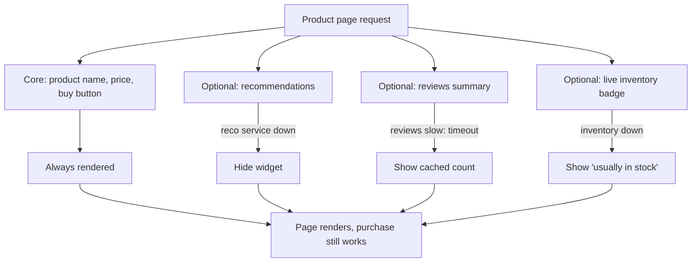
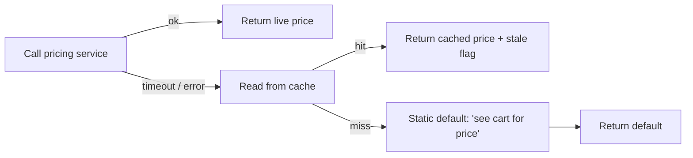
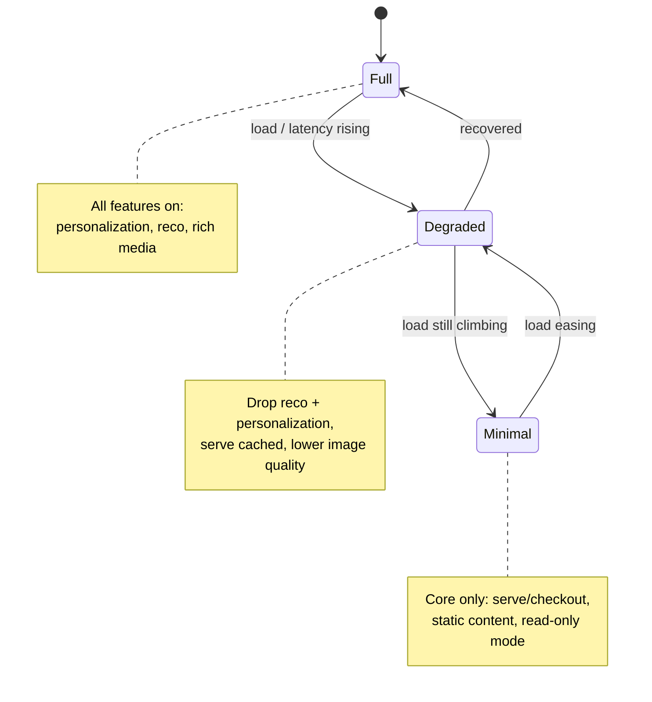
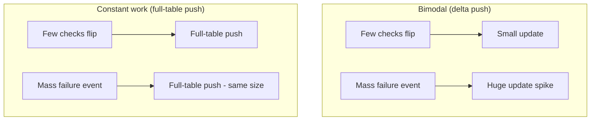

# Graceful Degradation & Fallbacks

Graceful degradation is the discipline of keeping the **core function of a system
working when parts of it fail**, by intentionally shedding or substituting the pieces
that are broken instead of returning a full outage. Where a circuit breaker decides
*whether* to call a failing dependency (see `reliability-ops/circuit-breakers-and-bulkheads`),
degradation and fallbacks decide *what the user gets* when that dependency is
unavailable. The goal is to convert a hard, binary failure ("the page is down") into a
soft, partial one ("the page loads but recommendations are hidden").

This is a judgment-heavy topic. The reliability engineer's job is to know **which
features are core and which are optional**, wire each optional feature to a fallback,
and — critically — **measure how often the fallbacks fire** so that a silent quality
degradation never masks an ongoing incident.

> [!KEY-TAKEAWAY]
> The three ideas that carry this topic: (1) **degrade features, don't drop the
> request** — rank features by criticality and disable the non-critical ones under
> failure; (2) **a fallback is a designed alternative, not an accident** — and every
> fallback must be monitored, because a fallback that fires silently is an incident you
> can't see; (3) **static stability** — the reliable posture is to keep serving on
> last-known-good state without the failed dependency, rather than depend on the
> failed thing to recover.

---

## Graceful Degradation

**Definition.** Graceful degradation is a design property where a system continues to
provide reduced-but-useful functionality when one or more components fail or are
overloaded, rather than failing completely. The classic framing (Nygard, *Release It!*)
is that a **failure in a non-critical dependency must not take down a critical feature.**

**Mechanism.** You decompose a request or a page into independent features, each backed
by a dependency, and you attach a **degradation behavior** to each one that is keyed to
that dependency's health:

- **Hide the feature** — remove a recommendations widget, a "customers also bought"
  strip, or a live-inventory badge if its backing service is down.
- **Serve stale / cached data** — show the last-known price or catalog even if the
  pricing service is unavailable (this is *static stability*, below).
- **Substitute a cheaper computation** — return a generic, non-personalized homepage
  instead of a personalized one; return popularity-ranked search results instead of
  ML-ranked ones.
- **Reduce fidelity** — lower image resolution, drop optional response fields, disable
  autocomplete.

The essential architectural requirement is **failure isolation**: a call to the
optional dependency must be wrapped (timeout + circuit breaker + fallback) so its
failure or latency cannot block or crash the parent request. Without isolation you don't
get graceful degradation — you get a cascading failure
(see `reliability-ops/cascading-failures-and-antipatterns`).



**Degradation vs. failover.** Failover *replaces* a failed component with an equivalent
healthy one (a replica, another AZ) so the user sees no change
(see `reliability-ops/redundancy-failover-and-health-checks`). Degradation *accepts a
reduced experience*. Prefer failover when redundancy exists; degrade when it doesn't or
when the failed thing is genuinely optional.

**Trade-offs.**
- *Complexity.* Every degradation path is a code path that must be built, tested, and
  exercised — untested fallbacks are a leading cause of "the fallback also failed."
  Chaos/fault-injection testing exists partly to exercise these paths
  (see `reliability-ops/chaos-engineering-and-fault-injection`).
- *Silent quality loss.* A degraded experience can look "fine" to monitoring while
  quietly hurting conversion, relevance, or correctness — hence you must measure
  degradation rate as an explicit signal.
- *Correctness risk.* Degrading is safe for *presentation* (hide a widget) but dangerous
  for *state-changing / correctness-critical* paths (never "degrade" a payment by
  skipping the fraud check). Match the degradation to the criticality tier.

> [!INTERVIEW]
> A strong answer names the *unit* of degradation: you degrade **per feature**, keyed to
> **that feature's dependency health**, not the whole system at once. "The reco service
> is down so we hide the reco widget, but checkout keeps working" scores far better than
> "we show an error page."

---

## Fallbacks and Fallback Chains

**Definition.** A **fallback** is a predetermined alternative result returned when the
primary path fails (throws, times out, or a circuit breaker is open). It answers the
question "what do we return *instead*?" A **fallback chain** tries a sequence of
alternatives in decreasing order of quality until one succeeds.

**Common fallback sources (roughly best → worst quality):**

| Fallback type | Example | Freshness / quality | Notes |
|---|---|---|---|
| Secondary provider | switch payment gateway A→B; secondary geocoding API | Full | Needs an independent dependency; watch correlated failure |
| Local / near cache | serve last cached price or catalog | Stale (seconds–hours) | The workhorse; enables static stability |
| Recomputed / cheaper path | popularity ranking instead of ML ranking | Lower relevance | Degraded but personalized-free |
| Static default | "usually ships in 2 days", empty list, default config | Generic | Always available, lowest quality |
| Fail (controlled error) | return a typed error the caller can handle | None | Correct when a *wrong* answer is worse than none |

**Mechanism — fallback chain.** The pattern is: attempt primary → on failure attempt the
next source → … → terminal fallback that is *guaranteed to succeed* (usually a static
default that requires no I/O). Each hop should have its own timeout, and the total time
budget must be bounded so the chain doesn't blow the parent request's deadline.



**Resilience4j example (fallback on circuit-open):**

```java
Supplier<Price> decorated = CircuitBreaker
    .decorateSupplier(breaker, () -> pricingClient.getPrice(sku));

Price price = Try.ofSupplier(decorated)
    .recover(CallNotPermittedException.class, e -> cache.getPrice(sku))  // breaker open
    .recover(Exception.class, e -> Price.staticDefault(sku))             // terminal fallback
    .get();
```

**Design rules that separate senior answers from junior ones:**
- The **terminal fallback must not perform network I/O** — if your last resort can
  itself hang or fail, you have no floor. A static in-memory default or a value baked
  into the deployment artifact is the safe floor.
- **Fallbacks belong on reads, not blindly on writes.** Silently substituting a value on
  a write can corrupt state. For writes, prefer *queue-and-retry* (accept, persist to a
  durable buffer, apply later) over a fabricated success.
- **Bound the total latency of the chain** — a chain of three 2-second timeouts is a
  6-second request. Fallbacks should be *fast*; a slow fallback still ties up the thread.
- **Fallbacks must be independent of the primary.** A "secondary provider" that shares
  the same database, network path, or auth service will fail at the same time
  (correlated failure) and provide no real protection.

**Circuit-breaker ↔ fallback integration (mechanism detail).** The breaker and the
fallback are two halves of one mechanism, and how they interact matters:
- **Open state returns the fallback, it does not have to throw.** A breaker in the open
  state can *directly return* a cached or default value with no attempt on the dependency
  at all — this is the fast, cheap path that protects both caller and callee. (Azure's
  Circuit Breaker guidance calls this returning a default/stale value from the open state.)
- **Half-open must limit trial requests.** When the breaker probes recovery, it lets only
  a small number of trial calls through. Without this cap, a recovering dependency gets
  flooded the instant it comes back and trips the breaker straight open again — a
  "recovery oscillation."
- **Writes use journaling/replay, not a fabricated success.** The correct write-side
  analogue of a fallback is to **record the write request while the breaker is open and
  replay it on recovery** (a durable outbox/journal), preserving the state change instead
  of pretending it happened.
- **Accelerated circuit breaking.** If a response carries an explicit overload signal —
  an HTTP `429`/`503` with a `Retry-After` header — trip *immediately* rather than waiting
  for the normal error-count threshold, and honour the `Retry-After` as the open duration.

---

## The Risks of Fallbacks

Fallbacks are not free reliability — they trade *availability* for *correctness and
observability*, and each of the three big risks below has ended real incidents.

**1. Silent quality loss (the biggest one).** A fallback that returns stale or generic
data keeps the success rate at 100% while the *answer quality* silently collapses. Search
that has silently fallen back to popularity ranking looks healthy on an error-rate
dashboard but is quietly wrong. The mitigation is to **treat fallback activation as a
first-class metric**: emit a counter every time a fallback fires and alert on the
**fallback rate**. A fallback rate that jumps from 0.1% to 40% is an incident even if the
error rate is still zero.

> [!WARNING]
> The classic anti-pattern is a fallback that **masks an outage**. Because the fallback
> makes user-facing metrics look normal, the underlying dependency can be down for hours
> before anyone notices — and the fallback data goes progressively staler the whole time.
> Always alert on the fallback/degradation rate itself, not just on end-user errors.
> How you emit and alert on that metric is `observability`'s job — the *decision to
> measure it* is a reliability requirement.

**2. The fallback also fails.** If the fallback shares infrastructure with the primary
(same DB, same cache cluster, same auth service, same AZ), a correlated failure takes out
both. Worse, fallbacks are cold code paths that are rarely exercised, so they often have
latent bugs, stale credentials, or unmaintained data. **Untested fallbacks are effectively
broken fallbacks** — this is a core motivation for chaos engineering.

**3. Fallbacks amplify load.** A fallback that itself makes a call (e.g. "on cache miss,
hammer the origin") can *increase* load on an already-struggling system, turning a partial
failure into a full one — a variant of a retry storm. And when a whole fleet falls back to
a shared secondary at once, that secondary gets a thundering herd it was never sized for.

**4. Correctness / security fallbacks.** "Degrading" an authorization or fraud check by
allowing the request through (fail-open) trades a reliability win for a security hole —
see the next section.

| Risk | How it bites | Mitigation |
|---|---|---|
| Silent quality loss | 100% success, wrong answers | Emit + alert on **fallback rate** |
| Masks incident | Dependency down for hours unnoticed | Fallback-rate SLO/alert; staleness age metric |
| Fallback also fails | Shared infra, correlated failure | Independent fallback; test it (chaos) |
| Load amplification | Fallback calls origin → herd | Cache-only fallback; jittered refresh; request coalescing |
| Wrong fail direction | Fail-open on authz = security hole | Choose fail-closed for security (next section) |

**"How much fallback is too much?" — making fallback a first-class SLI.** Sharpen "alert
on fallback rate" into two distinct alarms:
- **Fallback activation rate** — treat it as an SLI in its own right and alert on it
  crossing a *low* threshold, not a high one. A baseline of ~0.1% jumping to a few percent
  already means a dependency is degraded even though end-user errors are still zero. The
  threshold is deliberately sensitive because the whole point is to see what the error rate
  hides.
- **Cache-staleness age** — a *separate* alarm. A serve-stale fallback that is now serving
  hours-old data is a different failure from the fallback merely firing: the fallback rate
  can be flat while the age of what you're serving climbs unbounded. Alert on the age of
  the last-known-good value independently.

The **burn-rate mechanics** for these alerts (multi-window multi-burn-rate rules) belong to
`observability`; the reliability requirement is *deciding that fallback activation and
staleness age are things you must measure and page on.*

---

## Static Stability (AWS)

**Definition.** **Static stability** is the AWS Well-Architected principle that a system
should **keep operating on its last-known-good state without needing the failed
dependency to be available** — including without needing the *control plane* that would
normally change that state. A statically stable system's steady-state behavior does not
depend on making new calls to the thing that just failed.

**Canonical examples.**
- **Serve reads from cache even if the database is down.** The cache holds last-known-good
  data; the system keeps answering read traffic through the outage instead of erroring.
- **EC2 instances keep running during an EC2 control-plane impairment.** You may be unable
  to *launch new* instances (control-plane action), but existing instances (data plane)
  keep serving. AWS designs data planes to be statically stable against control-plane
  failures.
- **Pre-provisioned capacity for failover.** A statically stable multi-AZ system
  **pre-provisions enough capacity** in the surviving AZs so that when one AZ fails it
  does *not* need to call the (possibly-impaired) control plane to scale up. This is why
  AWS recommends **not** relying on auto-scaling *during* an AZ failure — scaling is a
  control-plane action that may be exactly what's degraded.

**Mechanism / the core insight: data plane vs control plane.** Control planes (which
*change* configuration — launch instances, update DNS, change routing) are complex and
statistically more failure-prone; data planes (which *use* existing config to serve
traffic) are simpler and more available. Static stability means the **data plane keeps
working using existing state even when the control plane is unavailable.** You accept
being unable to *change* things during a failure in exchange for continuing to *serve*.

> [!TIP]
> The trade-off of static stability is **cost vs. dependency on recovery actions**. A
> statically stable failover keeps ~2x (or N+1) capacity warm so it never has to scale up
> mid-incident — more expensive, but it removes the control plane from the critical
> recovery path. A "dynamically stable" design scales on demand, which is cheaper but bets
> that the control plane and capacity are available exactly when the system is already
> unhealthy — often a bad bet.

**The concrete numbers (active-active across AZs).** The Builders' Library ("Static
stability using Availability Zones," Becky Weiss) gives the canonical sizing: run the
fleet across **≥3 Availability Zones and overprovision by 50%**, so each AZ normally runs
at **~66% (2/3) of its load-tested capacity**. If one AZ is lost, its share redistributes
to the two survivors, pushing each to ~100% — the fleet absorbs a full AZ failure **with
zero control-plane scaling actions**. That is what "statically stable" buys you: the
recovery is *already provisioned*, not requested mid-incident.

**Why AZ-local (zonal) dependencies beat regional ones — the (2/3)^N argument.** Each
network hop that fans out *regionally* has an independent chance of touching the impaired
AZ. A request that makes **N** regional calls has only a **(2/3)^N** chance of dodging the
bad AZ on every hop — at N=2 that is already **4/9 (~44%)**, worse than a coin flip, and it
degrades fast as N grows. A **zonal design (zone-local calls staying inside one AZ)** keeps
the odds at **2/3** regardless of N, because a request pinned to a healthy AZ never crosses
into the impaired one. This is the architectural argument for AZ-affinity / cell-based,
zone-local dependency graphs.

**Active-standby static stability.** The active-active math above is one form; the other is
**failing over to a *pre-existing* warm standby** — or **electing a new leader from members
that already exist** — never "launch a replacement just in time." Provisioning the standby
is a steady-state action; the failover itself must be a data-plane flip, not a
control-plane build-out.

Static stability is the *why* behind serving stale cache during a DB outage: it's not
just a fallback, it's a deliberate posture where steady-state serving does not depend on
the failed component. Cross-ref `system-design` for multi-region architecture and
`reliability-ops/caching` patterns for the caching mechanics.

---

## Fail-Open vs Fail-Closed

When a dependency fails and you must decide the default behavior, you pick a **fail
direction**:

- **Fail-open** (a.k.a. *fail-safe* in some domains, *fail-permissive*): on failure,
  **allow** the operation / continue as if the check passed. Maximizes availability.
- **Fail-closed** (a.k.a. *fail-secure* / *fail-safe* in security contexts): on failure,
  **deny / block** the operation. Maximizes safety and correctness.

> [!WARNING]
> The terms *fail-safe* and *fail-secure* are overloaded and mean opposite things in
> different fields (physical door locks vs. software auth). In an interview, describe the
> **behavior** — "allow on failure" vs "deny on failure" — not just the label.

**The decision rule: what is the cost of each wrong default?**

| Scenario | Right direction | Why |
|---|---|---|
| AuthN / AuthZ service unreachable | **Fail-closed** | Allowing access on failure = security breach; a blocked user is recoverable, a breach is not |
| Fraud / risk scoring down | Fail-closed (or step-up) | Approving fraud on failure has unbounded cost |
| Rate limiter store down | Usually fail-open* | Blocking all traffic because the *limiter* is down is worse than briefly unlimited (see `security`, `system-design/design-rate-limiter`) |
| Feature-flag service down | Fail to last-known / safe default | Serve cached flags; default new/risky features off |
| Optional enrichment (geo-IP, reco) | **Fail-open** | Non-critical; degrade gracefully rather than error the request |
| Firewall / network policy | **Fail-closed** | A firewall that fails open exposes everything |
| Physical egress / life-safety door | Fail-open (unlock) | People must be able to exit in a power failure — *safety* wins over *security* |

\* The rate-limiter case is genuinely contested. Fail-open risks a flood hitting an
already-fragile backend; fail-closed risks a total outage from a limiter dependency being
down. A common middle ground is a **local fail-open with a conservative static local
limit** so you neither block everyone nor go fully unlimited.

**Mechanism / principle.** The choice is a risk trade-off between the **cost of a false
allow** and the **cost of a false deny**. Security, money, and safety-of-state generally
fail closed (a wrong "yes" is catastrophic and irreversible). Non-critical,
presentation, and enrichment paths fail open (a wrong "block" needlessly hurts
availability). The judgment: *degrade functionality freely, but never degrade a security
or correctness guarantee.*

---

## Load-Based Degradation and Brownout

**Definition.** A **brownout** (borrowed from the electrical-grid term for a partial
voltage drop) is *intentional, graduated degradation triggered by load* rather than by a
dependency being down. As demand or latency rises, the system progressively sheds
optional work to protect the core — a dimmer switch, not an on/off switch.

**Mechanism.** The system watches a load/health signal — CPU, queue depth, p99 latency,
concurrency, or error-budget burn — and disables features in **criticality order** as the
signal crosses thresholds:



**Brownout vs. load shedding.** They are complementary (see
`reliability-ops/load-shedding-and-backpressure`). Load shedding **rejects whole
requests** (returns 429/503) to cap total work; brownout **makes each accepted request
cheaper** by dropping optional parts of it. A good design does both: shed the lowest-value
requests *and* serve the accepted ones in a reduced mode. Both aim to keep the system
inside its capacity envelope so it doesn't collapse into a cascading failure.

**Concrete brownout levers:**
- Disable personalization / ML ranking → cheaper generic responses.
- Serve from cache with longer TTLs (accept more staleness for less origin load).
- Turn on **read-only mode** (reject writes, keep reads) to protect a strained primary DB.
- Reduce page richness: fewer results per page, no thumbnails, no autocomplete.
- Drop sampling/telemetry fidelity for non-critical events.

**Trade-offs.**
- *Hysteresis matters.* Use separate enter/exit thresholds (or a cooldown) so the system
  doesn't oscillate between full and degraded modes ("flapping") as load hovers at the
  boundary.
- *Prioritize by criticality, not arbitrarily.* Shed the least valuable work first;
  protect revenue/safety-critical paths last.
- *Make it observable and reversible.* Operators need to see which brownout level is
  active and be able to force or clear it. Feature flags are the usual control surface
  (cross-ref `devops-cicd` for flag/deploy tooling).

> [!INTERVIEW]
> If asked "your service is overloaded and latency is spiking — what do you do?", a
> senior answer combines both mechanisms: **shed** the lowest-priority incoming requests
> (protect the queue) *and* **brownout** the survivors (drop optional features, go
> read-only), rather than a single blunt "add more servers" (which may be a control-plane
> action that's slow or unavailable exactly when you need it).

---

## Designing for Degradation: Criticality Tiers

Graceful degradation only works if you've **decided in advance what is core and what is
optional.** The senior practice is to classify each feature/dependency into criticality
tiers and attach a policy to each:

| Tier | Meaning | On dependency failure | Example |
|---|---|---|---|
| **Critical (T1)** | Request is meaningless without it | Fail the request (typed error), page on-call | Auth, checkout, the primary read path |
| **Important (T2)** | Degrades experience but request is still useful | Fallback to cache/default, alert | Pricing (use cached), search ranking |
| **Optional (T3)** | Nice-to-have | Hide silently, log + count | Recommendations, reviews, "recently viewed" |

Design implications:
- **Isolate optional dependencies** behind their own timeouts, circuit breakers, and
  ideally their own thread pool / bulkhead so a slow T3 call can never exhaust the
  resources needed for T1 work (see `reliability-ops/circuit-breakers-and-bulkheads`).
- **Set tighter timeouts on less-critical calls** — an optional widget should give up
  fast (e.g. 100–200 ms) rather than dragging the whole page's latency.
- **Make degradation testable and drillable** — feature flags to force each degraded
  mode, plus chaos experiments that kill T2/T3 dependencies in production to prove the
  core survives.
- **Tie it back to SLOs** — define SLOs on the *core* experience; optional features can
  have looser or no SLOs. This keeps the error budget focused on what matters (see
  `reliability-ops/slos-error-budgets-and-velocity-tradeoff`).

---

## Constant Work and Bimodal Behavior

**Bimodal (or multimodal) behavior is a named anti-pattern.** A system is *bimodal* when
it has one behavior in steady state and a **different, more expensive behavior under
stress or failure** — fast and cheap at 1x load, slow and resource-hungry at 2x. The
danger is structural: the expensive second mode appears **precisely during an incident**
and is the mode you exercise least, so it is the least trusted code exactly when you depend
on it. The interviewer's tell for this is "your service is fine at 1x and falls over at
2x — what property is missing?" The answer is *bimodality*: you have a second mode, and
the fixes (constant work, static stability) exist to **eliminate the second mode**, not to
make it faster.

**The constant-work pattern.** The antidote to bimodal behavior is to **do the same amount
of work regardless of input, load, or system state** — so behavior never changes between
steady state and failure because there is no "failure mode" that costs more. When the
worst case *is* the normal case, there is nothing to degrade to.

**Canonical example — Amazon Route 53 health checking** (Builders' Library, "Reliability
and constant work"). Route 53 aggregates *all* health-check states into a **fixed-size
configuration** and **pushes the entire table to the data plane on a fixed cadence,
regardless of how many health checks actually flipped.** Whether zero checks changed or
ten thousand flipped simultaneously in a mass-failure event, the pushed payload and the
work done are *identical*. The result: a large correlated failure produces **no extra
control-plane work** — there is no load spike on the control plane at the exact moment the
fleet is most stressed. Contrast the naive design ("push only the deltas"), which is cheap
normally but generates a work avalanche precisely during a mass event — textbook bimodal
behavior.

**Why this is the deepest idea here.** Constant work is *degradation you never have to
trigger*: the system already pays the worst-case cost continuously, so there is no
mode-switch to get wrong, no cold path to exercise, and no thundering herd of "recompute
everything now." It trades higher steady-state cost for the elimination of a failure mode.



---

## Avoiding Fallback: the Contrarian Thesis

AWS's Builders' Library article **"Avoiding fallback in distributed systems" (Jacob
Gabrielson)** argues something that sounds contradictory next to everything above: **you
should usually try *not* to have a fallback at all.** A sharp interviewer will press this:
*"AWS says avoid fallback, yet you just designed a fallback chain — reconcile that."*

**The core argument.** A fallback is, by definition, a **cold, rarely-exercised code
path**. It runs only when the primary has already failed — i.e. under the worst, most
chaotic conditions, and almost never in testing or normal operation. So fallbacks
routinely **do not work when finally called**: stale credentials, drifted schemas,
untested capacity, latent bugs. The canonical Amazon retail story: a service kept a
fallback to a *secondary* datastore for when the primary was unavailable. The fallback had
never actually run under real load; when the primary genuinely failed, the untested
fallback **also failed / behaved non-deterministically**, turning a partial outage into a
worse one. A fallback is a bet that your least-tested code will perform flawlessly during
your worst hour.

**The recommended alternatives — prefer designs that don't *need* fallback:**
1. **Improve the primary** so it doesn't fail in the first place (more availability, better
   retries/timeouts) rather than papering over failure with a second path.
2. **Fail fast and let the caller decide.** A clean, fast, typed error propagated to a
   caller who has context is often better than a guessed value manufactured deep in the
   stack. (Nygard's *Fail Fast* pattern.)
3. **Push the risky work off the critical path** — pre-compute or make it asynchronous so a
   failure there never blocks the live request.
4. **Exercise the fallback in steady state so it is never cold** — the constant-work idea
   again: if the "fallback" runs continuously (e.g. you always serve from a cache that is
   always populated), it isn't a cold path and the objection evaporates.

**The reconciliation (the answer that scores).** Prefer architectures that **don't need**
fallback; treat every fallback as a liability to be justified. *If* a fallback is genuinely
unavoidable, make it **hot** (exercised continuously in production, not cold), **tested**
(chaos/fault-injection proves it), and **independent** (no shared infra with the primary).
The fallback chains earlier in this doc are acceptable precisely because they satisfy those
constraints — the serve-from-cache floor is hot and I/O-free, not a dusty secondary that
wakes up once a year.

---

## Cache-as-Fallback: HTTP Staleness Semantics

Serving stale cache is the workhorse fallback, and the HTTP standards name the exact
behaviors — worth knowing precisely for CDN/edge questions.

- **`stale-if-error`** (RFC 5861) — an explicit licence to **serve a stale cached response
  when the origin returns an error (500/502/503/504) or is unreachable**, for a bounded
  extra window. This *is* cache-as-fallback expressed as an HTTP directive: the CDN keeps
  answering from its last-known-good copy while the origin is down.
- **`stale-while-revalidate`** (RFC 5861) — serve the stale copy **immediately** to the
  client and **refresh it in the background** for the next request. This is a *latency*
  optimization for expired-but-usable content, distinct from `stale-if-error` (which is a
  *failure* fallback). They compose: `Cache-Control: max-age=60, stale-while-revalidate=30, stale-if-error=86400`.
- **`must-revalidate`** — the **opposite** directive: it *forbids* serving stale content;
  once fresh lifetime expires the cache **must** revalidate with the origin and, if the
  origin is unreachable, **return a 504** rather than a stale body. Use it for data where a
  stale answer is worse than an error (correctness-critical), and be aware it removes your
  serve-stale fallback by design.

**Negative caching.** Cache the **absence or error** result — an NXDOMAIN, a 404, an empty
result set — for a **short** TTL. This stops a *miss storm* (many clients repeatedly asking
for something that isn't there, or retrying against an error) from hammering an
already-struggling origin. The critical tuning: **keep negative TTLs short.** A long
negative TTL will *pin a transient failure* — if you cache "not found / error" for an hour,
you keep serving that failure for an hour after the origin recovered. Negative caching
protects the origin; short TTLs stop it from prolonging the outage.

---

## Feature Flags and Kill Switches: the Degradation Control Surface

Degradation is only useful if an operator can *actually trigger it in 30 seconds during an
incident.* Feature flags and kill switches are that control surface.

- **Kill switch** — a coarse, instant off-switch for a whole feature or dependency, flipped
  **without a deploy**. It is the operator-driven way to shed an entire feature ("turn off
  personalization now") when a dependency is melting down.
- **Feature flag** — finer-grained and often *gradual* (percentage rollout, per-segment),
  used both for release control and for dialing degradation up and down.

**Requirements that make flags safe as a reliability tool:**
- **Flags must fail to a safe last-known-good default.** Cache flag values locally so the
  flag system being down does not disable your features; **new/risky features default
  *off*** so a flag-read failure can never silently switch on untested behavior.
- **Flag evaluation must be local and I/O-free on the hot path.** If reading a flag adds a
  network call to *every* request, you have added a new dependency (and a new failure mode)
  to the critical path — the opposite of resilience. Evaluate against a locally cached
  ruleset.
- **Flips must be fast, auditable, and reversible.** You need to flip in seconds, see *who*
  changed *what* (audit trail for the incident timeline), and roll back instantly.

Kill-switch **game days** — deliberately exercising the switches in production drills — are
how you find out *before* the incident that the switch actually works. (Flag/deploy
*tooling* lives in `devops-cicd`; here the concern is the *reliability* contract the flag
system must meet.)

---

## Criticality: Google's Model and Propagation

The T1/T2/T3 tiers above map onto Google's concrete **criticality** taxonomy (SRE Book,
"Handling Overload"), which is worth naming precisely. Google defines four values, in
decreasing order of protection:

| Google value | Meaning | Rough tier here |
|---|---|---|
| **`CRITICAL_PLUS`** | Most protected; shedding causes serious user-visible impact | T1 |
| **`CRITICAL`** | Default for production request traffic; shedding causes some user impact | T1/T2 |
| **`SHEDDABLE_PLUS`** | Default for batch; tolerates minutes of unavailability | T2/T3 |
| **`SHEDDABLE`** | Fully tolerant of frequent unavailability / partial results | T3 |

Two subtleties that separate a senior answer from "we have three tiers":
- **Criticality propagates automatically down the RPC chain.** A request carries its
  criticality, and downstream calls it makes **inherit the caller's criticality by
  default** (unless deliberately overridden). So a `CRITICAL_PLUS` user request keeps its
  protection all the way down a 4-hop call chain — a middle-tier service does not need to
  re-derive it, and load-shedding at hop 4 respects the priority set at hop 1. This is what
  makes criticality-based shedding coherent across a distributed call graph.
- **Criticality is orthogonal to latency sensitivity.** They are two independent axes.
  *Search-as-you-type* is **highly sheddable** (dropping a keystroke's suggestions is
  harmless) yet **extremely latency-critical** (a 300 ms suggestion is useless). Conversely
  a nightly billing batch is `CRITICAL`-ish for correctness but latency-insensitive. Don't
  conflate "can I drop it?" with "must it be fast?"

---

## Default-Value Traps

A fallback default is a **semantic** decision, not just an availability one — the value you
substitute is *interpreted* by downstream code, and a careless default can be catastrophic
even though the request "succeeded":

- **Empty list as "delete everything."** A fallback that returns an **empty entitlements /
  permissions / cart list** can be read downstream as "the user has *no* entitlements" —
  i.e. revoke everything, log everyone out, empty every cart. The famous incident shape:
  *"the fallback returned an empty entitlement set and logged all users out."*
- **Price or quantity of 0.** A default **price of 0** can trigger a free checkout; a
  default **quantity/stock of 0** can flip everything to "out of stock." Zero is rarely an
  inert default for money or inventory.
- **Default "allow" on a permissions cache** is a fail-open breach (ties directly to
  fail-closed for security).

**Safe practice:**
- Defaults should be **conservative and inert** — chosen so that if downstream
  misinterprets them, the blast radius is minimal (e.g. "unknown / not-determined" rather
  than "empty," a sentinel price that blocks checkout rather than 0).
- **Tag the response as degraded.** Return an explicit marker ("this value is a fallback /
  stale / degraded") so downstream code can distinguish **"known-empty"** from **"we don't
  know"** and refuse to take destructive action on a guessed value. The distinction between
  *absence of data* and *data confirming absence* is the whole game.

---

## Keeping the Degraded Path Warm

"The code path you never use is the code path that doesn't work" (SRE Book, "Addressing
Cascading Failures"). Degraded/shedding logic is by construction a cold path, so it must be
*deliberately* exercised or it will be broken when you finally need it:

- **Run a small subset of servers near overload continuously.** Intentionally keep a few
  hosts operating close to their shedding threshold in normal times so the load-shedding /
  degraded code path is warm and proven, rather than a path that only ever runs during the
  incident.
- **Chaos experiments in production** that kill T2/T3 dependencies to prove the core
  survives with the optional pieces gone.
- **Kill-switch game days** to prove the operator control surface works.

All three are the same principle as constant work and hot fallbacks: **eliminate cold paths
by exercising them as part of steady-state operation.** (Mechanics of fault injection live
in `reliability-ops/chaos-engineering-and-fault-injection`.)

---

## Common Interview Follow-ups

- **"Difference between graceful degradation and a fallback?"** Degradation is the
  system-level *strategy* (reduced functionality instead of outage); a fallback is the
  *mechanism* (a specific alternative value returned when a call fails). You implement
  degradation *using* fallbacks + feature hiding + brownout.
- **"Your search relevance quietly got worse but errors are 0%. What happened and how do
  you catch it?"** A silent fallback (e.g. to popularity ranking) is masking a dependency
  outage. Catch it by emitting and alerting on the **fallback/degradation rate** and a
  **cache-staleness age** metric — not just error rate.
- **"Auth service is down — fail open or closed?"** Fail-closed. A blocked legitimate
  user is recoverable; an unauthorized access on fail-open is a breach. Contrast with an
  optional enrichment call, which fails open.
- **"Rate-limiter backing store is down — fail open or closed?"** Contested; explain the
  trade-off. Common answer: local fail-open with a conservative static limit so you
  neither block everyone nor go fully unlimited.
- **"What is static stability and why not just auto-scale during an AZ failure?"** Static
  stability = keep serving on last-known-good state without the failed dependency;
  pre-provision failover capacity so recovery doesn't depend on the control plane (which
  may be exactly what's impaired). Auto-scaling mid-failure bets on a control-plane action
  being available during an event.
- **"Give a fallback that made an incident worse."** A fallback that calls the origin on
  cache miss (load amplification / thundering herd), a fallback sharing the primary's DB
  (correlated failure), or a fallback that masked an hours-long outage while serving
  ever-staler data.
- **"How do you make sure fallbacks actually work?"** They're cold code paths — exercise
  them with chaos/fault injection in production, keep the terminal fallback I/O-free, and
  bound total chain latency.
- **"Brownout vs load shedding?"** Shedding rejects whole requests to cap total work;
  brownout makes each accepted request cheaper by dropping optional parts. Use both.
- **"AWS says avoid fallback — but you designed a fallback chain. Reconcile."** Prefer
  designs that don't *need* fallback (improve the primary, fail fast, move risk off the
  critical path). Fallbacks are cold code that often fails when finally called; if a
  fallback is unavoidable make it **hot, tested, and independent** so the objection no
  longer applies.
- **"Fine at 1x, collapses at 2x — what property is missing?"** Bimodal behavior: a second,
  more-expensive mode that only appears under stress. Fix with constant work / static
  stability to eliminate the second mode, not to speed it up.
- **"Explain constant work with a real example and the failure it prevents."** Route 53
  pushes the entire fixed-size health table on a fixed cadence regardless of how many
  checks flipped, so a mass-failure event creates no control-plane spike. It prevents a
  control-plane thundering herd at the worst moment.
- **"Origin is down — serve stale safely."** `stale-if-error` to serve last-known-good on
  5xx (vs `stale-while-revalidate` for latency, vs `must-revalidate` which forbids stale);
  alarm on cache-staleness *age*; negative-cache misses with a *short* TTL so a struggling
  origin isn't hammered but a transient failure isn't pinned.
- **"Fallback returned an empty list and downstream revoked everything — what went wrong?"**
  A default is a semantic decision: "empty" was read as "delete all." Use conservative/inert
  defaults and **tag responses as degraded** so downstream distinguishes "known-empty" from
  "we don't know."
- **"Map your tiers to Google's criticality model and explain a 4-hop chain."**
  `CRITICAL_PLUS` / `CRITICAL` / `SHEDDABLE_PLUS` / `SHEDDABLE`; criticality **propagates
  down the RPC chain by default**, and it's **orthogonal to latency** (search-as-you-type
  is highly sheddable but latency-critical).
- **"How do you prove the degraded mode works before the incident?"** Keep it warm: run a
  subset of hosts near overload continuously, chaos-kill T2/T3 deps in prod, and run
  kill-switch game days — the code path you never use is the one that doesn't work.

## References

- Google, *Site Reliability Engineering* — "Handling Overload" (graceful degradation,
  criticality, load shedding) and "Addressing Cascading Failures."
- Google, *The Site Reliability Workbook* — "Managing Load," canarying and degraded modes.
- Michael T. Nygard, *Release It!* (2nd ed.) — stability patterns: Circuit Breaker,
  Fail Fast, Fallback, Handshaking, Steady State; anti-patterns (Cascading Failures,
  Slow Responses).
- AWS Well-Architected Framework, **Reliability Pillar** — static stability, data plane
  vs control plane, using availability zones.
- Amazon Builders' Library — "Static stability using Availability Zones" (Becky Weiss;
  3 AZs / 50% overprovision / ~66% per AZ / (2/3)^N), "Avoiding fallback in distributed
  systems" (Jacob Gabrielson), and "Reliability, constant work, and a good cup of coffee"
  (Colm MacCárthaigh; Route 53 constant-work example).
- Google, *Site Reliability Engineering* — "Handling Overload" (the four criticality
  values `CRITICAL_PLUS`/`CRITICAL`/`SHEDDABLE_PLUS`/`SHEDDABLE`, criticality propagation,
  adaptive throttling, retry budgets) and "Addressing Cascading Failures" (degraded-mode
  cold-path warning, running servers near overload).
- RFC 5861 — HTTP Cache-Control extensions `stale-while-revalidate` and `stale-if-error`.
- Microsoft Azure Architecture Center — Circuit Breaker pattern (open-state default value,
  half-open trial-request limiting, failed-request journaling/replay, accelerated breaking).
- Resilience4j documentation — `CircuitBreaker`, `TimeLimiter`, and fallback via
  `Try.recover` / `@CircuitBreaker(fallbackMethod=...)`.
- Cross-references in this library: `reliability-ops/circuit-breakers-and-bulkheads`,
  `reliability-ops/retries-timeouts-and-backoff`,
  `reliability-ops/load-shedding-and-backpressure`,
  `reliability-ops/cascading-failures-and-antipatterns`,
  `reliability-ops/disaster-recovery-rpo-rto-strategies`,
  `observability` (metrics/alerting on fallback rate), `security` and
  `system-design/design-rate-limiter` (fail-open vs fail-closed for limiting).
