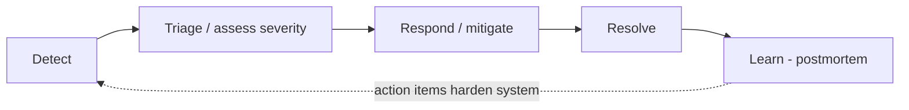
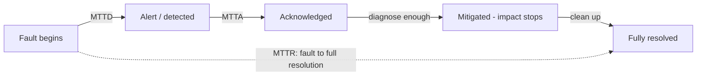

# Incident Response & Command

When a system breaks in production, ad-hoc heroics don't scale — you need a **repeatable
operational discipline** for detecting, coordinating, mitigating, and learning from
outages. This topic covers that discipline: the **incident lifecycle**, **severity
levels**, the **Incident Command System (ICS)** and its roles, the cardinal rule to
**mitigate before you diagnose**, incident **communication**, and how to measure
response with **MTTR** and its sub-components.

Grounded in Google's *Site Reliability Engineering* (Ch. 14 "Managing Incidents") and
*The SRE Workbook* (Ch. 9 "Incident Response"), the PagerDuty Incident Response docs,
Atlassian's incident handbook, and the US **FEMA/NIMS Incident Command System** that
these all descend from.

> [!KEY-TAKEAWAY]
> Incident command exists to make coordination — not fixing — someone's explicit job.
> The **Incident Commander (IC) coordinates and decides but does not touch the keyboard**;
> the **Ops lead does the hands-on work**. The prime directive of the response is
> **stop the bleeding (mitigate) before finding the cause (diagnose)** — roll back,
> fail over, or shed load first; root-cause analysis is a postmortem activity.

Boundaries (cross-reference, don't duplicate):
- **Detection/alerting mechanics** (multi-burn-rate alerts, dashboards, actionable
  signals) belong to observability — see `observability/slo-based-alerting-and-error-budgets`
  and `observability/on-call-alert-fatigue-and-actionable-signals`.
- **On-call rotations, paging, escalation, runbooks** — see
  `reliability-ops/on-call-escalation-and-runbooks`.
- **Learning after the fact (blameless postmortems, RCA methods)** — see
  `reliability-ops/blameless-postmortems-and-learning` and
  `reliability-ops/root-cause-analysis-and-troubleshooting`.
- **The mitigation levers themselves** (rollback, canary, failover, load-shedding) are
  detailed in `devops-cicd/deployment-strategies`, `reliability-ops/redundancy-failover-and-health-checks`,
  and `reliability-ops/load-shedding-and-backpressure`. Here we cover *when and how you
  reach for them under command*.

---

## The Incident Lifecycle

An incident is an unplanned disruption or degradation of a service that requires an
urgent, coordinated response (as opposed to routine work handled by a normal ticket).
The lifecycle is a repeatable pipeline:

| Phase | Goal | Owner | Cross-ref |
|---|---|---|---|
| **Detect** | Notice the problem fast (alert, customer report, canary) | Monitoring / on-call | observability |
| **Triage** | Confirm it's real, assess severity/scope, declare, page roles | On-call → IC | this topic |
| **Respond / Mitigate** | Stop customer impact ASAP | Ops lead under IC | this topic |
| **Resolve** | Full service restored, incident closed | IC | this topic |
| **Learn** | Blameless postmortem, action items | IC + team | postmortems topic |

Two metrics bracket the lifecycle: **detection latency** (MTTD, front of the pipeline) and
**recovery latency** (MTTR, the whole thing). The lifecycle is a *loop*: the "learn" phase
feeds hardening work back into detection and prevention, which is the entire point of
running incidents as a disciplined process rather than firefighting.

> [!TIP]
> Interviewers love the phrasing "**detect → triage → mitigate → resolve → learn**." The
> subtle-but-important ordering point: **mitigate comes before resolve, and diagnosis is
> not a phase** — you diagnose enough to *choose a mitigation*, and do the real
> root-cause analysis in the postmortem, after impact has stopped.

---

## Declaring an Incident

Declaring an incident means formally saying "this is an incident" — spinning up the
response structure (assigning an IC, opening a channel/bridge, starting a timeline). The
governing principle from Google SRE and PagerDuty is **err on the side of declaring**.

Why bias toward declaring:
- Declaring is **cheap**; discovering three hours in that nobody owned coordination is
  **expensive**. It's far easier to downgrade or close a needless incident than to
  retrofit command onto a chaotic one.
- It creates a **single source of truth** (one channel, one IC) and stops the "who's
  handling this?" ambiguity where three engineers unknowingly work the same problem while
  a fourth assumes someone else has it.
- Google's suggested **declaration triggers**: (1) do you need a *second team* involved?
  (2) is it a *customer-visible* outage? (3) is it *unresolved after ~an hour* of focused
  effort? Any "yes" → declare.

> [!WARNING]
> The dominant anti-pattern is **under-declaring** — treating a growing outage as "just a
> blip I'll fix in a minute" until it has ballooned and half the org is in an unstructured
> panic. A 30-second declaration up front routinely saves an hour of chaos. Normalize
> declaring; make it blameless to declare something that turns out minor.

---

## Severity Levels (SEV / P levels)

Severity classifies **how bad** an incident is, which drives **who is paged, how fast, and
how often you communicate**. There is no universal standard, but the common shape is a
5-level scale. Two numbering conventions coexist and run in **opposite directions**, which
is a classic point of confusion:

- **SEV**: lower number = worse (**SEV1** is the most severe).
- **P** (priority): **P0/P1** is worst, descending — but note some orgs map SEV1↔P1 and
  others SEV1↔P0, so always confirm the local convention.

A representative scale:

| Level | Severity | Impact | Example | Response |
|---|---|---|---|---|
| **SEV1** | Critical | Full outage / major customer-facing impact / data loss / security breach | Checkout down globally | All-hands, IC assigned, exec + status-page updates, 24×7 until resolved |
| **SEV2** | High | Major functionality broken or severe degradation; significant customer subset | Search returns errors for 20% of users | Page on-call + IC, frequent updates |
| **SEV3** | Moderate | Partial/degraded, workaround exists, limited impact | Elevated latency on one non-critical endpoint | On-call handles in business hours, lighter comms |
| **SEV4** | Low | Minor issue, minimal/no customer impact | Cosmetic bug, single non-critical alert | Ticket, next-business-day |
| **SEV5** | Cosmetic/Info | Negligible | Typo in a log message | Backlog |

What actually distinguishes levels — the two axes interviewers want:
1. **Customer impact / blast radius** — how many users, how core the function, is there a
   workaround, is data being lost or corrupted.
2. **Urgency** — is it actively getting worse, is revenue/SLA/safety on the line.

This table is for orientation; the *named* vendor definitions (PagerDuty's SEV-1/2/3) and
the **major-incident rule** that couples severity to org activation are developed later in
*Severity Definitions and the Major-Incident Rule*.

> [!INTERVIEW]
> "How do you decide severity?" Answer with the **two axes (impact × urgency)** and note
> that severity is **dynamic** — you set an initial SEV in triage and **re-assess as scope
> becomes clear**; upgrade the moment evidence says it's worse. Also mention that
> **security breaches and data-loss/-corruption usually get top severity by policy**
> regardless of the user count, because they're irreversible.

---

## The Incident Command System (ICS)

The **Incident Command System** is a standardized command-and-control structure for
managing emergencies, developed by US wildfire services in the 1970s and codified in
FEMA's **National Incident Management System (NIMS)**. Google adapted it for production
incidents (SRE Ch. 14) and PagerDuty popularized a software-industry version.

The core idea ICS gives software teams: **coordination is a distinct role, filled by a
single person with clear authority, using a recognizable structure everyone has trained
on.** In an emergency you don't want to invent an org chart; ICS is the pre-agreed one.

Key ICS properties adopted for incidents:
- **A single, clear chain of command** — one Incident Commander at the top, so decisions
  don't stall on consensus.
- **Manageable span of control** — the IC delegates rather than trying to track everything
  personally; a rough guideline is one person shouldn't directly coordinate more than
  ~5–7 people/workstreams before delegating to sub-leads.
- **Role-based, not person-based** — responsibilities attach to roles (IC, Ops, Comms,
  Scribe), so anyone trained can step into a role; handoffs are explicit.
- **Common terminology** — everyone knows what "IC," "declare," "mitigate," "sev1" mean,
  so cross-team responders coordinate without translation.

> [!TIP]
> The one-line origin story interviewers appreciate: ICS came from **1970s California
> wildfire response**, was generalized by **FEMA/NIMS**, and Google/PagerDuty adapted it
> for tech. The transferable insight is that **fighting fires and fighting outages have
> the same coordination problem**, and improvising the command structure mid-crisis is
> where response goes wrong.

---

## Incident Command Roles

The four canonical roles (Google SRE / PagerDuty). Small incidents collapse several into
one person; large ones may split each into multiple.

| Role | Owns | Explicitly does NOT | Notes |
|---|---|---|---|
| **Incident Commander (IC)** | Coordination, decisions, keeping the response moving; delegates work; owns the overall response | Hands-on fixing / debugging | The single point of authority. If nobody else is assigned, the IC holds all roles. |
| **Operations / Ops Lead (Tech Lead)** | The **hands-on work**: investigating, applying mitigations, running commands | Coordinating other teams, external comms | The *only* role that should be changing the system. Reports findings/options to the IC. |
| **Communications Lead** | External + stakeholder comms: status page, exec updates, customer/support liaison | Fixing the system | Shields responders from "any update?" interruptions. |
| **Scribe / Recorder** | The **timeline**: logs decisions, actions, and timestamps in real time | Fixing or deciding | Produces the raw material for the postmortem; captures context while it's fresh. |
| *(Planning / Subject-matter experts)* | Longer incidents add planning (tracking action items, handoffs) and pull in SMEs on demand | — | Optional, for prolonged/large incidents. |

The escalation ladder in practice: on-call engineer detects → if it needs coordination,
**declare and become (or appoint) IC** → IC pulls in an Ops lead to do the work, a Comms
lead when stakeholders need updates, and a Scribe to record. **Start minimal, add roles as
the incident grows.**

> [!WARNING]
> A frequent interview trap: "What does the Incident Commander do?" — the wrong answer is
> "leads the debugging / fixes the problem." The IC **coordinates and decides; the Ops
> lead fixes.** An IC who dives into the terminal has just vacated the coordination role,
> and coordination is exactly what's now unmonitored.

---

## Separating Command from Hands-On Work

The single most important structural rule: **the person coordinating must not be the
person with their hands on the keyboard.** This is why the IC and Ops roles are separate.

Why the separation matters (the mechanism):
- **Cognitive load.** Deep debugging is tunnel-vision work; coordination is
  broad-attention work. One brain can't do both well under stress. An engineer head-down
  in logs will miss that a second team just reported a related symptom.
- **Situational awareness.** The IC maintains the *big picture* — overall status, who's
  doing what, whether the current approach is working — and decides when to change tack,
  escalate, or roll back. That view collapses the instant the coordinator starts fixing.
- **Interruption shielding.** Comms + IC absorb the "what's the ETA?" traffic so the Ops
  lead can concentrate. Without this, the person best able to fix the problem is the person
  most interrupted.
- **Clear decision authority.** With one IC, "should we fail over?" has a decider. Without
  it, mitigation stalls on a committee while impact continues.

In a tiny incident one engineer legitimately wears all hats — but the moment a second
person joins, **someone should explicitly be IC and someone else should be doing the
work.** Naming the roles out loud ("I'm IC, you're Ops") is the cheap ritual that prevents
the "everyone assumed someone else had it" failure.

> [!INTERVIEW]
> If pushed on "why not let the smartest engineer both lead and fix?": because the
> bottleneck in a real incident is rarely raw debugging skill — it's **coordination,
> communication, and decision-making under uncertainty**. Freeing your best debugger to
> *only* debug, while a competent IC clears their path, gets you to mitigation faster.

---

## Mitigate Before Root-Cause

The cardinal rule of incident response: **stop the bleeding first; understand it later.**
Your job during an incident is to **restore service**, not to explain it. Full root-cause
analysis is a **postmortem** activity (see `reliability-ops/blameless-postmortems-and-learning`).

Why mitigation precedes diagnosis:
- **Impact accrues every second.** Customers, revenue, and error budget bleed while you
  investigate. A rollback that stops impact in 3 minutes beats a root-cause hunt that
  takes 90 — you can find the "why" after the graphs are green.
- **You often can mitigate without knowing the cause.** If a bad deploy correlates with a
  spike, **roll it back** even if you don't yet know *which* change broke it. If a region
  is unhealthy, **fail over**. If you're overloaded, **shed load**. Cause optional.
- **Diagnosis under pressure is error-prone.** Restoring service first buys you a calm,
  low-stakes environment to investigate.

Common mitigation levers (reach for the fastest reversible one first):

| Lever | Stops impact when… | Cross-ref |
|---|---|---|
| **Roll back / revert** | A recent deploy or config change is the likely trigger | `devops-cicd/deployment-strategies` |
| **Feature-flag / kill-switch off** | A specific new feature is implicated | `devops-cicd/deployment-strategies` |
| **Failover** (region/AZ/replica) | One location or instance is unhealthy | `reliability-ops/redundancy-failover-and-health-checks` |
| **Load-shed / rate-limit / throttle** | System is overloaded; protect the core | `reliability-ops/load-shedding-and-backpressure`, `security` |
| **Scale out / add capacity** | Demand exceeds capacity (slower to take effect) | `reliability-ops/capacity-planning-and-load-management` |
| **Graceful degradation** (serve stale/partial) | A non-critical dependency is down | `reliability-ops/graceful-degradation-and-fallbacks` |

Most of these levers share a deeper property — they stop impact by acting on *where* the
problem is rather than *what* the bug is. That **generic-vs-targeted** framing is developed
in *Generic Mitigations* below.

> [!WARNING]
> The anti-pattern is **"let me just find the root cause first"** while the site is down.
> Understandable engineering instinct, wrong incident instinct. Also beware **destroying
> evidence** in a panic — where cheap, capture logs/heap/state *before* the restart or
> rollback so the postmortem isn't blind, but never let evidence collection delay stopping
> customer impact.

> [!TIP]
> "**Rollback is usually the fastest, safest, most reversible mitigation**" is a strong
> interview default. If a recent change correlates with the incident, roll back first and
> ask questions later — reverting to a known-good state is lower-risk than forward-fixing
> under pressure.

---

## Communication During an Incident

Bad comms turn a technical incident into a trust incident. The Comms lead runs two
audiences on a **predictable cadence**:

- **Internal / stakeholders** — leadership, support, dependent teams. They need scope,
  impact, current action, and ETA-to-next-update (not necessarily ETA-to-fix).
- **External / customers** — via a **status page** (e.g. Statuspage, self-hosted) and, for
  SEV1s, direct customer notice. Public updates are terser and non-technical.

Principles:
- **Cadence over content.** Commit to a regular interval (e.g. "next update in 30
  minutes") and **honor it even when there's no news** — "still investigating, next update
  in 30 min" prevents the vacuum that breeds rumor and duplicate escalations. Higher
  severity → tighter cadence (SEV1 might be every 15–30 min).
- **Say impact, not internals.** "Some users can't check out; we've identified the cause
  and are deploying a fix" beats a paste of stack traces.
- **Separate the response channel from the broadcast channel.** Keep the working
  channel/bridge for responders; push summaries outward. Don't make responders answer
  side-DMs — route all "any news?" to the Comms lead.
- **Status-page hygiene:** post *Investigating → Identified → Monitoring → Resolved*
  states; update promptly; don't forget to mark **Resolved**.

Detection-side signaling (how alerts fire, how noisy they are) is an **observability**
concern — see `observability/on-call-alert-fatigue-and-actionable-signals`.

> [!INTERVIEW]
> A senior signal: emphasize **"update on a cadence, even with no news."** Silence during
> an outage is read as "they don't know what's happening," which is worse for trust than
> an honest "still working it, next update at :30."

---

## The War Room / Bridge

The **war room** (physical or virtual) and the **bridge** (a voice/video call) are where
responders coordinate. Modern practice: a **dedicated incident channel** (Slack/Teams) per
incident plus an optional bridge for high-severity events.

- **One incident → one channel/bridge.** Auto-created by tooling (PagerDuty, incident
  bots) and named by incident ID, so everyone converges in one place and the log is
  self-documenting.
- **Bridge (voice) vs channel (text).** Voice is faster for fast-moving SEV1 coordination;
  text creates a searchable timeline and lets people join asynchronously. Many teams run
  both — voice for the working group, channel for the record and for latecomers.
- **The IC runs the room:** keeps it focused, cuts tangents, calls out decisions, does
  periodic "state of the world" recaps so joiners get context without derailing the group.
- **Keep the room small and role-clear.** A crowded bridge with 30 spectators is noise;
  bring in SMEs on demand and let others follow the status page. This is the **span-of-
  control** principle in action.

> [!WARNING]
> Anti-pattern: the **"swarm with no commander"** — a huge bridge where everyone talks,
> nobody decides, and the same question gets answered five times. The fix is exactly ICS:
> name an IC, shrink the active group, and route spectators to the status feed.

---

## MTTR and the Time-to-X Breakdown

Response speed is measured by a family of "mean time to X" metrics. Knowing the precise
breakdown — and that **MTTR is not one number but a chain** — is a common interview probe.

| Metric | Meaning | Clock starts | Clock stops |
|---|---|---|---|
| **MTTD** — Mean Time To **Detect** | How long until you *know* something's wrong | Fault begins | Alert fires / issue noticed |
| **MTTA** — Mean Time To **Acknowledge** | Responsiveness of on-call | Alert fires | On-call ack |
| **MTTM / MTTMitigate** | Time to *stop the bleeding* | Detected/ack | Customer impact stops |
| **MTTR** — Mean Time To **Recover/Repair/Resolve** | Time to full restoration | Fault begins (or detection, define it!) | Service fully restored |
| **MTBF** — Mean Time **Between** Failures | Reliability/frequency of failures | End of one incident | Start of next |

Key relationships and gotchas:
- **MTTR ambiguity.** "R" is variously **Repair, Recovery, Resolve, or Respond** — and the
  start point (fault onset vs detection) varies. Always **define your terms**; a great
  answer explicitly disambiguates.
- **Availability from MTBF/MTTR:** `Availability = MTBF / (MTBF + MTTR)`. You raise
  availability by increasing MTBF (fail less) *or* decreasing MTTR (recover faster) — and
  **cutting MTTR is often the cheaper lever** because failures are inevitable.
- **Attack the biggest slice.** If MTTD dominates, invest in detection (observability); if
  MTTA dominates, fix paging/escalation; if MTTMitigate dominates, invest in fast levers
  (one-click rollback, pre-built failover runbooks).

**Worked example — why cutting MTTR is the cheaper lever.** Take a service that fails once
a month with a 2-hour recovery: MTBF = 30 days = **720 h**, MTTR = **2 h**.

- Baseline: `Availability = 720 / (720 + 2) = 720 / 722 = 0.99723` → **99.72%**.
- **Lever A — halve MTTR to 1 h** (better runbooks, one-click rollback):
  `720 / (720 + 1) = 720 / 721 = 0.99861` → **99.86%**. Downtime per failure is literally
  cut in half.
- **Lever B — double MTBF to 60 days = 1440 h** (fail half as often), MTTR still 2 h:
  `1440 / (1440 + 2) = 1440 / 1442 = 0.99861` → **99.86%** — *the same* availability gain.

Both levers land on 99.86%, but **halving MTTR is usually far cheaper than making the
system fail half as often**: a rollback button and a rehearsed failover are a few
engineer-weeks, whereas driving MTBF down means eliminating whole classes of latent bugs
and hardware faults you may not even know about yet. Failures are inevitable; how fast you
recover is the lever you actually control.

**Worked example — MTTR as a chain of sub-metrics.** One incident, real clock:

| Clock | Event | Sub-metric | Duration |
|---|---|---|---|
| 02:00 | Bad config takes effect; errors climb | — | (fault onset) |
| 02:07 | Burn-rate alert fires | **MTTD** | 7 min |
| 02:09 | On-call acknowledges the page | **MTTA** | 2 min |
| 02:19 | Rollback completes; error rate normal | **MTTMitigate** | 10 min |
| 02:50 | Backfill + cleanup done; incident closed | resolve tail | 31 min |

The **customer-pain window is fault → mitigate = 02:00 → 02:19 = 19 min**; full
**MTTR = fault → resolved = 02:00 → 02:50 = 50 min**. Within the 19 minutes customers hurt,
the biggest slice is **mitigate (10 min)**, then **detect (7 min)** — so the highest-leverage
investment here is a faster lever (pre-staged one-click rollback) plus tighter detection,
not shaving the 2-minute ack. This is "attack the biggest slice" made concrete: you don't
optimize MTTR as one blob, you find the dominant link and shrink *that*.

> [!KEY-TAKEAWAY]
> **MTTR is a chain: detect → ack → mitigate → resolve.** Improving reliability means
> shrinking whichever link dominates — and note that **mitigate stops customer pain before
> resolve** stops the incident. Because you can't drive MTBF to infinity, **reducing MTTR
> is the highest-leverage operational investment** for most teams.

---

## "You Build It, You Run It"

Coined by Amazon's Werner Vogels (2006): the team that **writes** a service also **operates
it in production** and carries its pager. This is the ownership model underlying modern
on-call and incident response.

Why it improves reliability (the feedback loop):
- **Aligned incentives.** When the authors get paged at 3 a.m., they feel operational pain
  directly, which motivates building *operable* software — good logging, sane alerts,
  runbooks, graceful failure. Reliability stops being someone else's problem.
- **Faster incident response.** The people with the deepest system knowledge are the ones
  responding, so diagnosis and mitigation are faster than handing to a separate ops team
  that has to reverse-engineer the system live.
- **Tighter build↔run loop.** Operational lessons feed straight back into design.

Trade-offs / contrast:
- **vs. traditional Ops/NOC handoff ("throw it over the wall"):** a separate ops team lacks
  context and has misaligned incentives; devs never feel the pain of their design choices.
- **Cost:** on-call burden and toil fall on the dev team, so it must be paired with **toil
  reduction, sane on-call load, and error budgets** to be sustainable — see
  `reliability-ops/toil-reduction-and-operational-excellence` and
  `reliability-ops/on-call-escalation-and-runbooks`.
- **Google's SRE model is a middle path:** a specialized SRE team co-owns operations but
  can **hand the pager back** to developers if the service exceeds an error-budget/toil
  threshold — keeping dev incentives honest without every team running its own ops from
  scratch.

> [!INTERVIEW]
> "You build it, you run it" is the phrase to name, attribute to **Werner Vogels / Amazon**,
> and then critique: it aligns incentives and speeds response, but is only humane when
> paired with **on-call-load limits, automation/toil reduction, and error budgets** so the
> team isn't just perpetually firefighting.

---

## Handoffs & Long-Running Incidents

Incidents that outlast one person's shift or attention span need explicit **handoffs**:

- **Handoff protocol.** Transferring IC is a deliberate, verbal/written act: outgoing IC
  summarizes current state, active theories, what's been tried, and open action items;
  incoming IC **acknowledges taking command explicitly** ("I have command"). Never let
  command silently lapse.
- **Follow-the-sun.** Global orgs hand long incidents across regions so responders aren't
  awake for 18 hours straight — the Scribe's timeline makes this handoff possible.
- **Fight fatigue.** Tired responders make mistakes and cause *secondary* incidents; the IC
  should rotate people out and, for prolonged events, add a Planning role to track the
  growing action-item list.
- **The Scribe's timeline is the connective tissue.** Real-time, timestamped notes mean a
  fresh responder gets context in minutes and the postmortem writes itself.

> [!TIP]
> A crisp handoff line: outgoing IC states **"here's the situation, here's what we've
> tried, here's the current plan,"** incoming IC replies **"I have command."** Ambiguous
> handoffs (or none) are a top cause of incidents that drag on because *nobody* is actually
> coordinating anymore.

---

## Common Incident-Response Anti-Patterns

| Anti-pattern | Why it hurts | Fix |
|---|---|---|
| **No incident commander** ("everyone's helping") | No decisions, duplicated work, missed signals | Declare, name an IC immediately |
| **IC dives into the keyboard** | Coordination goes unmonitored | IC coordinates, Ops fixes |
| **Diagnose before mitigate** | Impact accrues while you investigate | Roll back / fail over / shed load first |
| **Under-declaring** | Small issue balloons into unstructured chaos | Err on the side of declaring |
| **Comms silence** | Erodes trust, spawns rumors + duplicate escalations | Update on a fixed cadence, even with no news |
| **The 30-person bridge** | Noise, no decisions, questions repeated | Small room, IC-led, SMEs on demand |
| **Hero culture** | Bus-factor 1, no shared knowledge, burnout | Runbooks, role rotation, blameless review |
| **Skipping the postmortem** | Same incident recurs; no learning | Blameless postmortem is part of the lifecycle |
| **Destroying evidence in a panic** | Postmortem is blind | Capture cheap state before restart — without delaying mitigation |
| **Blame during the incident** | Kills psychological safety, slows honest reporting | Blameless throughout; focus on restoring service |

---

## The 3 C's and IMAG

Google's *SRE Workbook* (Ch. 9) names its incident-management program **IMAG — Incident
Management At Google** — an adaptation of the emergency-services **ICS** for production
outages. (The Workbook dates ICS to **1968**, when it was created by firefighters; the
"1970s California wildfire" framing above refers to its formalization. Both dates appear
in the literature — the takeaway is the same: it predates and is far more battle-tested
than any software-specific scheme.)

IMAG is built on **three pillars, the "3 C's"**:

| C | Meaning | Primary owner |
|---|---|---|
| **Coordinate** | Organize the response — who is doing what, sequencing work, planning, handoffs | Operations / Planning lead, orchestrated by the IC |
| **Communicate** | Keep stakeholders and the public informed; keep the internal record | Communications Lead |
| **Control** | Hold overall authority and direction; delegate; decide | Incident Commander |

The Workbook's diagnostic heuristic: **"when something goes wrong with incident response,
the culprit is likely in one of these three areas."** A useful interview move is to
triage a broken response by asking *which C failed* — no single decider (Control), the
site is silent to customers (Communicate), or two people are unknowingly redoing each
other's work (Coordinate).

The Workbook also lists **four foundational best practices**, the fourth of which is
easy to forget: **(1)** maintain a clear line of command; **(2)** designate clearly
defined roles; **(3)** keep a working record of debugging and mitigation as you go; and
**(4) declare incidents early and often.** Pre-agreeing on **incident criteria** —
"establish, in advance, the criteria for what counts as an incident, derived from past
outages" — is itself a named practice, not just an in-the-moment judgment call.

---

## The Full Role Roster (Deputy, Liaisons, SME) and the CAN Report

The four canonical roles above are the core, but PagerDuty's widely-cited roster names
**six roles**. Senior interviews expect you to know the extras:

| Role | What it adds beyond the core four |
|---|---|
| **Deputy** | A **hot-standby IC** — trained as an IC, can take command instantly. Watches for what the IC misses (timers started, roll-call items not circled back to), and manages the call itself (removing/muting people when the IC directs). Frees the IC to think. Essential on long or high-severity incidents. |
| **Customer Liaison** | External-facing half of comms: drafts and posts **public** status-page updates, tracks the count of affected customers, fields the support/customer-success channel. |
| **Internal Liaison** | Internal-facing half of comms: pages **SMEs**, notifies internal stakeholders (Finance, Legal, Marketing, execs). PagerDuty splits comms into these two liaisons where Google collapses them into one "Communications" role. |
| **Subject-Matter Expert (SME) / Resolver** | The domain specialist pulled in on demand to investigate a specific subsystem; reports back to the IC. |

> [!TIP]
> The **CAN report** is the crisp status format an SME/resolver gives the IC when asked
> "where are we?": **C**ondition (current state of the service — healthy or not),
> **A**ctions (what's being done / needs doing), **N**eeds (what support the resolver
> needs to act). Naming CAN is a strong senior signal — it turns rambling status into
> three structured lines.

Roles are still **scale-to-fit**: one person can wear several hats in a small incident;
you split them out (Deputy first, then liaisons, then per-workstream Ops sub-leads) as
span of control is exceeded.

---

## The Live Incident State Document

Distinct from the Scribe's chronological *timeline*, the **Live Incident State Document**
(a.k.a. the working/state doc) is a **living snapshot of the present**: current status,
active theories, **causes already eliminated**, the running action-item list, and key
metrics/links. The Google *SRE* book is emphatic: **"The incident commander's most
important responsibility is to keep a living incident document."**

Properties that matter:

- **Concurrently editable** — Google uses Google Docs precisely so multiple responders
  update it live; a wiki page you edit-lock defeats the purpose.
- **Templated, with critical info at the top** — a joiner should get oriented in seconds.
- **Used once ~3+ people are involved** — below that, overhead exceeds value.
- **Retained for the postmortem** — it seeds the writeup and preserves what you *thought*
  at each point, which is gold for a blameless review.

Timeline vs state doc, in one line: the **Scribe's timeline** answers *"what happened and
when?"* (append-only history); the **state doc** answers *"where are we right now, and
what have we ruled out?"* (mutable present). Long incidents keep both.

---

## Generic Mitigations

The Workbook's GKE **"Cache Me If You Can"** case study crystallizes mitigate-before-
diagnose into a principle: **"To mitigate an incident, you don't have to fully understand
the details — you only need to know the location of the root cause."** Location, not
cause.

**Generic mitigations** are actions that stop impact *without* knowing the specific bug,
because they operate on *where* the problem is:

- **Roll back** the recent release/config (return to known-good).
- **Drain / redirect** traffic away from the bad task, cell, or region.
- **Fail over** to a healthy replica/region.
- **Shed load** / throttle to protect the core.

Contrast with **targeted / forward fixes** (a code patch, a config tweak to "correct" the
value) — these *require* understanding the cause and are riskier under pressure. The
senior instinct: **reach for a generic mitigation first**; forward-fix only when no
generic lever applies or after impact has stopped. The GKE post-incident lesson was
literally that the team **lacked a generic rollback path** for a corrupt image, so a
6h40m outage dragged while they diagnosed — the mitigation gap, not the bug, was the
failure.

---

## Severity Definitions and the Major-Incident Rule

The generic 5-level table above is fine for orientation, but strong candidates cite
**named definitions and the rules that couple severity to response**. PagerDuty's
concrete defs:

- **SEV-1** — "warrants public notification and liaison with executive teams." Typical
  triggers: an **SLA breach** or **security/data exposure**.
- **SEV-2** — "critically impacting many customers' ability to use the product."
- **SEV-3** — "stability or minor customer-impacting… requires immediate attention."

Three rules interviewers probe:

1. **Anything above SEV-3 is a major incident.**
2. **All SEV-2s are major incidents, but not all major incidents are SEV-2s** — the "major
   incident" flag (which pulls in a **Major Incident Manager**, exec comms, the full
   roster) is a *separate axis* from the numeric severity. A SEV-1 is also major; a
   security SEV can be major regardless of user count.
3. **If you're unsure between two levels, treat it as the higher one** — the same
   "round up under uncertainty" bias as *declare early*.

This is why "SEV-2 vs major incident" is a favorite subtle-distinction question: severity
sizes the *technical* impact; "major" is an *organizational activation* threshold.

---

## Incident vs Problem vs Change Management (ITIL)

SRE and ITIL describe the same operational reality with different vocabularies; senior
interviews (especially in enterprise/ITSM shops) expect the mapping:

| ITIL term | Definition | SRE analogue |
|---|---|---|
| **Incident** | An **unplanned interruption or degradation** of a service. Goal: **restore service fast** (may use a workaround). | An incident — mitigation-first response |
| **Problem** | The **underlying cause** of one or more incidents. Goal: **eliminate recurrence.** | The postmortem's root cause + action items |
| **Known error** | A problem with a **documented root cause and a workaround** logged for reuse. | A known-issue runbook entry |
| **Major incident** | High-impact incident invoking a **Major Incident Manager (MIM)** and heightened process. | A SEV-1 / "major incident" activation |
| **Change management** | Controlled process for making changes (to reduce change-induced incidents). | Progressive delivery / deploy safety — see `devops-cicd/deployment-strategies` |

The load-bearing distinction: **incident management restores service now; problem
management stops it happening again.** A mitigation (rollback, failover) lives in
*incident* management; identifying the defect, filing the fix, and recording the
known-error/workaround live in *problem* management. Mapping SRE onto ITIL: **incident
response ≈ incident + major-incident management; the blameless postmortem and its action
items ≈ problem management.** See `reliability-ops/blameless-postmortems-and-learning`.

---

## The Single-Writer Principle

The most dangerous coordination failure is **uncoordinated parallel change** — two
responders each applying a different fix, so the system's state becomes unknowable and
one change masks or amplifies the other. The Google *SRE* book states the rule verbatim:
**"The operations team should be the only group modifying the system during an
incident."**

This is the **single-writer principle**: at any moment, **one owner (the Ops lead / the
person the IC has designated) mutates the system**, and every change is announced in the
channel so the timeline and state doc stay accurate. The SRE narrative's cautionary
character, "Malcolm," makes an *uncoordinated* change that makes things worse — the named
hazard is **freelancing**: well-meaning responders poking at production outside the
command structure.

How ICS enforces it:
- The **IC arbitrates** when two engineers propose conflicting fixes (see decision
  authority) — the disagreement resolves in seconds, not by committee.
- Changes route through the **Ops lead**; others propose, the designated writer executes.
- Every mutation is **narrated** ("rolling back web tier to build 1234 now") so no two
  people act blind.

> [!WARNING]
> "Too many cooks" in production during an incident is how a recoverable outage becomes a
> **compound** one. If you can't say who currently has write access to the system, you've
> lost Coordinate and Control at once.

---

## Incident Automation and Tooling

A hot 2024–2025 topic: **what should fire automatically the instant you declare?** Mature
tooling collapses minutes of manual setup into one command/click. On declaration, the
platform typically **auto-creates the incident channel** (e.g. `#incident-<id>`), **spins
up the bridge** (Zoom/Meet), **opens the state doc from a template**, **pages the on-call
plus an IC**, **posts an initial status-page entry**, and **starts recording** the call —
so responders spend attention on the incident, not on logistics.

Representative platforms (vendor-agnostic — name a couple, don't over-index on one):
**PagerDuty, incident.io, FireHydrant, Rootly, Atlassian Opsgenie/Jira SM**, plus
**Slack/Teams workflow bots** that wire the above together.

The maturity signal isn't "we have a tool" — it's **which manual steps have been
automated away** and whether the tooling **degrades gracefully when the platform itself
is affected** (see the out-of-band lesson below). Auto-timelining (bot captures declared
actions and status changes) also feeds the Scribe and the postmortem.

---

## Out-of-Band Comms and Break-Glass Access

A subtle failure mode senior interviewers love: **your incident tooling depends on the
thing that's down.** The canonical public example is the **2021 Facebook/Meta BGP
outage** — a config change withdrew the BGP routes to Meta's DNS, and because internal
tools, badge access, and comms all rode the same network, **responders were partially
locked out of the systems needed to fix it.**

Design principles that fall out of this:

- **Out-of-band communications** — a fallback channel (external Slack workspace, phone
  bridge, SMS tree, a status page hosted on infrastructure *independent* of production)
  so you can coordinate when the primary channel is part of the blast radius.
- **Break-glass access** — pre-provisioned emergency credentials/paths that don't depend
  on the failing control plane, exercised in advance so they actually work under stress.
- **Don't couple incident tooling to the failing system** — hosting your status page or
  paging on the same region/provider as the service it monitors is a single point of
  failure for the *response itself*.

This connects to **generic mitigations** (the failover target must be truly independent)
and to `system-design` multi-region architecture, but the *operational* lesson lives
here: rehearse the case where the response infrastructure is itself impaired.

---

## Practicing Incident Response (Drills and Game Days)

Command is a skill built by **repetition, not by reading** — "you want to practice when
the world is not on fire." This is distinct from **chaos engineering**, which injects
faults to test the *system*; here the goal is training the *humans and the process* (IC
muscle memory, role clarity, comms cadence). Cross-reference
`reliability-ops/chaos-engineering-and-resilience-testing` for the fault-injection
mechanics.

Named practices from the literature:

- **Wheel of Misfortune** (Google) — a role-play RPG where the team re-enacts a past
  outage; one person plays "the incident," others practice IC/Ops/Comms live.
- **DiRT — Disaster Recovery Testing** (Google) — company-wide exercises that deliberately
  break things (and the response) to expose gaps.
- **Failure Friday** (PagerDuty) — regular scheduled fault-injection + response drills.
- **Tabletop exercises / game days** — walk through a scenario verbally, no production
  impact, to pressure-test runbooks and role assignments.
- Even communication-under-pressure games (the Workbook cites *Keep Talking and Nobody
  Explodes*) are used to train the Comms/coordination reflex.

> [!INTERVIEW]
> "How do you exercise incident response without a real outage?" — name **Wheel of
> Misfortune / DiRT / game days / tabletops**, and draw the line: chaos engineering tests
> the *system's* resilience; these drills test the *response process*. The payoff is
> lower MTTR because responders aren't learning the runbook for the first time at 3 a.m.

---

## On-Call Load, Role Rotation, and the MTTR-of-Familiarity

Numbers that ground the fatigue and preparedness arguments (from Google *SRE*, Appendix B
/ Ch. 11 and the Workbook's case studies):

- **~6 hours of engineer time is the budgeted average cost per on-call incident** (the
  handling itself plus follow-up). This is the unit that makes MTTR reduction such a good
  investment — every incident you shorten or prevent buys back real hours.
- **A cap of ~2 incidents per 12-hour on-call shift** is Google's guideline — beyond that,
  responders can't do each incident (and its follow-up) justice, and quality degrades.
- **Rotate roles roughly every ~4 hours on a long incident.** The Workbook's PagerDuty NTP
  case (a 10+ hour event) rotated the IC and other roles to fight fatigue; a fatigued
  responder causes *secondary* incidents.
- **Runbooks/familiarity cut MTTR substantially.** Google *SRE* reports that having a
  well-thought-out, documented playbook produced a **roughly 3× improvement in MTTR** for
  on-call responders versus improvising — the single strongest argument for maintaining
  runbooks (own the mechanics in `reliability-ops/on-call-escalation-and-runbooks`).

  **Worked example — the ROI in hours.** A team handling ~**20 incidents/quarter** at ~**6 h**
  each spends `20 × 6 = 120` engineer-hours/quarter on incident handling. A good runbook that
  delivers the ~3× improvement cuts per-incident handling to ~2 h, so the same 20 incidents now
  cost `20 × 2 = 40` hours — **reclaiming ~80 engineer-hours every quarter** (≈2 full
  engineer-weeks) for the cost of writing and maintaining the runbook. That is why "keep
  runbooks current" is an investment, not overhead: the abstract "buys back real hours" is a
  concrete 80-hour line item.
- **A ~1:1 alert-to-incident ratio** is the declaration-hygiene target: most pages should
  correspond to a real, actionable incident (alert *tuning* is an observability concern —
  see `observability/on-call-alert-fatigue-and-actionable-signals`).

> [!INTERVIEW]
> Numbers probes to have ready: *"How many incidents per shift is sustainable?"* → about
> **two per 12-hour shift, ~6h each.** *"How often do you rotate roles on a multi-hour
> incident?"* → roughly **every 4 hours.** *"Why keep runbooks current?"* → **~3× MTTR
> improvement** from having a playbook.

---

## Canonical Incident Stories

Short vignettes give interview answers texture and show you've read the source material:

- **GKE "Cache Me If You Can" (SRE Workbook)** — a corrupt DockerHub image caused a
  ~**6h40m** EU outage. Lesson: the team **lacked a generic rollback mitigation**, so they
  were forced to diagnose before they could recover — the *mitigation gap* was the real
  failure, not the bad image.
- **Belgium lightning strike (SRE Workbook)** — **four** strikes in ~2 minutes hit a data
  center's power. Held up as a *well-run* incident: early declaration and disciplined
  command meant only **~0.000001%** of persistent disk was permanently lost. Preparation
  turned a catastrophe into a footnote.
- **Google Home / Chromecast v1.88 (SRE Workbook)** — a client bug fetched files ~**50×**
  too often, overloading backends. Lesson: **failure to declare early** — the team leaned
  on weekend heroics instead of standing up command, and it dragged.
- **AWS S3 us-east-1 (Feb 2017)** — an engineer's typo in a debugging command removed too
  many capacity servers, taking down S3 in a core region and cascading to services across
  the internet. Lesson: guardrails on operational tooling, and the blast radius of a
  single control action.
- **Facebook/Meta BGP (Oct 2021)** — see *Out-of-Band Comms and Break-Glass Access* above:
  the response was hampered because the tooling depended on the failing network.

---

## Common Interview Follow-ups

- **"Walk me through what happens from the moment an alert fires."** Detect → on-call acks
  → assess/triage severity → declare + assign IC → mitigate (rollback/failover/shed) →
  communicate on cadence → confirm resolved → blameless postmortem.
- **"What does the Incident Commander actually do?"** Coordinates and decides; owns the
  response; delegates. **Does not** debug or fix — that's the Ops lead. The value is
  situational awareness and decision authority.
- **"You get paged: latency is spiking and a deploy went out 10 minutes ago. What first?"**
  Mitigate — **roll back the deploy** (fastest reversible action) even before confirming
  it's the cause; then verify recovery; then diagnose in the postmortem.
- **"Why separate command from the hands-on work?"** Cognitive load + situational awareness
  + interruption shielding + clear decision authority. One brain can't debug deeply and
  coordinate broadly under stress.
- **"How do you set severity?"** Impact × urgency; blast radius, workaround availability,
  data-loss/security overrides; re-assess as scope clarifies.
- **"What's the difference between MTTD, MTTA, and MTTR?"** Detect, Acknowledge, Recover;
  MTTR is the whole chain; disambiguate what "R" means and where the clock starts.
- **"How do you decide whether to declare an incident?"** Err toward declaring — needs a
  second team? customer-visible? unresolved after ~an hour? Any yes → declare.
- **"What's 'you build it, you run it' and its trade-offs?"** Amazon ownership model;
  aligns incentives + speeds response; sustainable only with toil reduction and on-call
  limits.
- **"Where does root-cause analysis happen?"** In the postmortem, *after* mitigation — not
  during the incident.
- **"What are the 3 C's of incident management?"** Coordinate, Communicate, Control (IMAG,
  SRE Workbook). Map: Control→IC, Communicate→Comms lead, Coordinate→Ops/Planning. When
  response breaks, one of the three has failed.
- **"What's the difference between an incident and a problem (ITIL)?"** Incident = restore
  service now (may use a workaround); problem = eliminate the recurrence. Mitigation lives
  in incident mgmt; the fix + known-error/workaround live in problem mgmt.
- **"SEV-2 vs major incident?"** Severity sizes technical impact; "major" is an
  org-activation threshold. All SEV-2s are major, but not all majors are SEV-2s.
- **"What fires automatically when you declare?"** Channel, bridge, state doc, pages to
  on-call + IC, status-page entry, call recording — the tooling-maturity signal.
- **"Your incident tooling itself is down (Meta-2021 style) — now what?"** Out-of-band
  comms + break-glass access; never couple the response infra to the failing system.
- **"How do you practice incident response?"** Wheel of Misfortune / DiRT / game days /
  tabletops — train the process, distinct from chaos engineering testing the system.
- **"How many incidents per shift, and how often rotate roles?"** ~2 per 12h shift (~6h
  each); rotate roles ~every 4h on long incidents; a runbook is ~3× MTTR.

---

## References

- Beyer, Jones, Petoff, Murphy (eds.), *Site Reliability Engineering* (Google, O'Reilly
  2016) — Ch. 14 "Managing Incidents."
- Beyer et al., *The Site Reliability Workbook* (Google, O'Reilly 2018) — Ch. 9 "Incident
  Response."
- PagerDuty, *Incident Response Documentation* — response.pagerduty.com (six roles incl.
  Deputy and Customer/Internal Liaison, CAN report, SEV-1/2/3 definitions, major-incident
  rules, Failure Friday).
- ITIL 4 / ITIL v3 Service Operation — incident, problem, known-error, and change
  management definitions.
- Google *SRE* Appendix B ("A Collection of Best Practices for Production Services") and
  Ch. 11 ("Being On-Call") — on-call load (~2 incidents/12h shift, ~6h/incident) and the
  ~3× MTTR benefit of playbooks.
- Atlassian, *Incident Management Handbook* and incident severity/lifecycle guides.
- FEMA / NIMS, *Incident Command System (ICS)* — the emergency-management origin.
- Michael T. Nygard, *Release It!*, 2nd ed. (Pragmatic Bookshelf, 2018) — stability
  patterns and operational failure modes.
- AWS Well-Architected Framework — **Reliability Pillar** (failure management, MTTR,
  recovery).
- Werner Vogels, "A Conversation with Werner Vogels," *ACM Queue* (2006) — "you build it,
  you run it."
