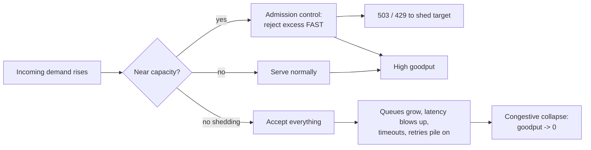
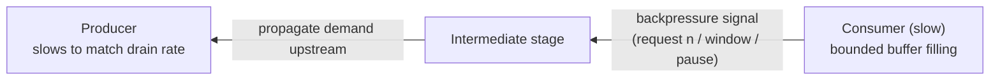

# Load Shedding & Backpressure

When demand exceeds what a system can serve, something has to give. The naive outcome is
**congestive collapse**: every request is accepted, queues grow without bound, latency blows
up, everything times out, and *goodput* (useful work completed) crashes toward zero even as
the machine is 100% busy. The reliability engineer's job is to make the failure **graceful and
deliberate** instead. Two complementary mechanisms do this:

- **Load shedding** — at the *entry* point, deliberately **reject** a fraction of requests
  (fast, cheap `503`/`429`) so the requests you *do* accept are served within SLO. Better to
  serve 90% of traffic well than 100% badly.
- **Backpressure** — a *feedback signal* that flows **upstream**, telling producers to slow
  down because a downstream consumer cannot keep up. It moves the "reject / block" decision to
  where it is cheapest and preserves bounded resource use end-to-end.

> [!KEY-TAKEAWAY]
> Overload is not solved by "adding a queue." A queue only *converts* an overload into
> **latency and memory growth**; if arrival rate stays above service rate, the queue is a
> countdown to OOM. Under sustained overload you must either **shed** (drop work) or apply
> **backpressure** (slow the source). Buffering only buys time for one of those two to kick in.

This topic covers the *operational, reliability-engineering* angle: how to keep a system
standing under overload. For **rate limiting as abuse prevention** see `security/*` and for the
**algorithm/design** of a limiter see `system-design/design-rate-limiter`. For **capacity math
and forecasting** see `reliability-ops/capacity-planning-and-load-management`; for **feature-level
fallbacks** see `reliability-ops/graceful-degradation-and-fallbacks`. For **how you measure and
alarm** on the signals below (queue depth, saturation, the four golden signals) see
`observability/*`.

---

## Why Shed Load: Goodput vs Throughput

**The core insight (Google SRE, "Handling Overload"):** a server has a finite capacity. Past
that point, accepting more requests does not increase useful work — it *decreases* it, because
each request consumes CPU/memory/threads to be partially processed and then fail or time out.
You spend resources producing nothing a client can use.

Distinguish three quantities:

| Term | Meaning |
|---|---|
| **Throughput** | requests the server *accepts/processes* per second (includes doomed work) |
| **Goodput** | requests completed **successfully within their deadline** per second — the only number that matters |
| **Utilization** | how busy the resource is (CPU, threads, connections) |

The characteristic overload curve: goodput rises with load, plateaus at capacity, then **falls
off a cliff** as the server thrashes (context-switching, GC pressure, cache misses, retries
piling on). Load shedding's goal is to **flatten the cliff into a plateau** — hold goodput at
capacity by refusing the excess quickly and cheaply.



> [!WARNING]
> A rejected request must be **cheap** to reject, ideally far cheaper than serving it.
> If your `503` path itself does expensive work (auth, DB lookups, deep stack traversal),
> shedding can *cost more* than serving and you will still collapse. Reject as early and as
> shallow in the stack as possible (edge/LB/admission layer), not deep inside the app.

---

## Load Shedding Mechanics: Admission Control

**Load shedding** = admission control at the front door. When a saturation signal crosses a
threshold, new requests are rejected immediately instead of being queued or processed.

**What to measure to trigger it (pick a *symptom of saturation*, not raw traffic):**
- **Queue depth / wait time** — requests already waiting longer than they can afford.
- **In-flight concurrency** vs a configured/adaptive limit.
- **CPU or thread-pool saturation**, memory pressure, GC time.
- **Latency SLO breach** — p99 climbing past target.

**Response codes — get these right, interviewers probe them:**

| Code | Semantics | When to use for shedding |
|---|---|---|
| `429 Too Many Requests` | client exceeded a **rate limit**; per-client quota | client-scoped throttling / quota |
| `503 Service Unavailable` | server is **overloaded/unavailable**, try later | server-wide load shedding |
| `Retry-After` header | tells client *when* to retry | attach to `429`/`503` to shape retry timing |

Both are **retryable** — which is exactly why shedding and retry policy must be co-designed
(see the retry-storm warning below).

**Adaptive concurrency limits.** Static thresholds are brittle (capacity varies with request
mix, deploys, noisy neighbors). Modern shedders discover the limit dynamically:
- **Little's Law–based / TCP-Vegas-style** (e.g. Netflix `concurrency-limits`): infer the
  concurrency ceiling from observed latency — when latency rises above the no-load minimum,
  the queue is forming, so lower the limit.
- **CoDel (Controlled Delay)** as an active-queue-management discipline: track the *minimum*
  queue sojourn time over a window; if it stays above a target (~5 ms) for an interval
  (~100 ms), start dropping/rejecting from the queue. It targets **standing queues** (bufferbloat)
  while tolerating transient bursts.
- **Server-side adaptive throttling** (Google SRE): the client itself throttles based on the
  ratio of accepted to attempted requests, sharing shedding responsibility across the fleet.

> [!TIP]
> Prefer rejecting at the **load balancer / API gateway / mesh sidecar** and via a small
> admission-control layer, so the expensive request path never runs. Envoy, for instance,
> supports adaptive concurrency and circuit-breaking limits at the proxy. This keeps the reject
> cost near-zero.

---

## Prioritized & Criticality-Based Shedding

Not all requests are equal. Shedding *uniformly* (drop a random 20%) is far worse than shedding
*the cheapest-to-lose 20% first*. Prioritized shedding sheds by **value** so that scarce
capacity goes to the requests that matter.

**Dimensions to prioritize by:**
- **Criticality tier** (Google SRE uses `CRITICAL_PLUS`, `CRITICAL`, `SHEDDABLE_PLUS`,
  `SHEDDABLE`): mark each request's importance and shed the sheddable classes first. Background
  refreshes, prefetch, and best-effort analytics are `SHEDDABLE`; a checkout or a paying-user
  read is `CRITICAL`.
- **Cost to serve** — shed expensive queries first to reclaim the most capacity per rejection.
- **User/tenant tier** — protect paying or SLA-backed customers; shed free-tier or internal
  batch traffic first (fairness across tenants also prevents one abuser from starving others).
- **Idempotency / retriability** — a request that will be safely retried is cheaper to shed now.

Criticality should be **propagated through the call graph**: if a top-level request is
`SHEDDABLE`, every downstream call it makes inherits that class, so a deep service can shed it
without knowing the business context.

> [!INTERVIEW]
> A classic scenario: "Your service is at 120% capacity. What do you drop?" Strong answer:
> *shed by criticality first (best-effort/background before user-facing), then by cost, then by
> tenant tier — and shed as early as possible so rejected work is cheap. Also verify clients
> honor `Retry-After` and back off, or shedding just feeds a retry storm.*

**The retry-storm trap.** Load shedding + naive clients = amplification. If a shed `503`
triggers an immediate retry (or 3 retries), a fleet at 100% capacity suddenly sees 2–4× the
traffic — the shedding *causes* the collapse it was meant to prevent. Mitigations: retry with
**exponential backoff + jitter**, cap **retries per request** (e.g. ≤2), enforce a **retry
budget** (e.g. retries ≤10% of requests), and use **circuit breakers** so a failing dependency
stops receiving retries at all. See `reliability-ops/retries-timeouts-and-backoff` and
`reliability-ops/circuit-breakers-and-bulkheads`.

---

## Backpressure: Signaling Upstream to Slow Down

**Backpressure** is a **feedback signal that propagates from a saturated consumer back toward
the producer**, causing the producer to *slow or stop* until the consumer can catch up. Where
load shedding *drops* work, backpressure *paces* it — the source produces at the rate the sink
can drain.

**Mechanisms, cheapest to most costly:**
- **Blocking / bounded buffers** — a bounded queue that *blocks the producer* when full. The
  producer's thread stalls, which naturally slows generation. (Blocking a request thread also
  ties up a resource — fine for a producer you control, dangerous for request-serving threads.)
- **Rejection** — a bounded queue that *rejects* (fails fast) when full, converting backpressure
  into shedding at that hop.
- **Credit / demand signalling** — the consumer explicitly grants the producer permission to
  send N items (Reactive Streams `request(n)`, HTTP/2 & gRPC flow-control windows, TCP receive
  window). The producer may never send more than it has been asked for. This is the cleanest,
  because backpressure is *in the protocol*.
- **Pausing/rate feedback** — Kafka pauses partition consumption; TCP shrinks the advertised
  window to 0.



**Why it's better than unbounded buffering:** backpressure bounds memory and *latency* across
the whole pipeline. Instead of a fast producer building a giant hidden queue (that later
explodes into tail latency or OOM), the slowest stage sets the pace and the pressure is felt
where it can be handled — often at a human-visible boundary (an API returns `429`, a batch job
slows) rather than as a silent memory leak.

> [!KEY-TAKEAWAY]
> Backpressure and load shedding are the same idea at different distances: **shed** = "I reject
> here." **Backpressure** = "I tell you upstream to send less so I don't have to." A robust
> system does both — apply backpressure while you can, shed when you must.

---

## Push vs Pull: Why Pull Is Naturally Backpressured

The *direction of control* determines whether backpressure is automatic or bolted on.

| | **Push** (producer-driven) | **Pull** (consumer-driven) |
|---|---|---|
| Who sets the rate | producer | **consumer** |
| Backpressure | must be added explicitly (credits, acks, bounded queue) | **inherent** — consumer only fetches what it can handle |
| Overload risk | consumer can be flooded → drops or OOM | consumer paces itself; producer may accumulate (durable log absorbs it) |
| Examples | webhooks, Server-Sent Events, RabbitMQ push, naive observer | **Kafka consumers**, HTTP polling, `poll()`-based loops, reactive `request(n)` |

**Kafka is the canonical example.** Consumers **pull** batches via `poll()`; the broker never
pushes faster than the consumer asks. The buffer is the **durable partition log**, and the
health signal is **consumer lag** (`log-end-offset − committed-offset`) — how far behind the
consumer is. Rising lag *is* the backpressure indicator; you respond by scaling consumers
(up to the partition count), optimizing processing, or accepting bounded lag. The log decouples
producer and consumer speeds without either flooding the other. (Contrast RabbitMQ's default
push, where you must set a **prefetch/QoS** limit or a slow consumer gets buried.)

> [!TIP]
> "Make it pull, not push" is a strong general answer to "how do you add backpressure to this
> pipeline?" A pull/poll model with a bounded fetch size gives you backpressure for free.

---

## Bounded vs Unbounded Queues: The Buffering Anti-Pattern

A queue sitting between a producer and a slower consumer *feels* like a fix. It is a trap if
it is **unbounded**.

**Unbounded queue = latent OOM + unbounded latency.** If arrival rate λ exceeds service rate μ
even briefly-but-persistently, an unbounded queue grows without limit. Two failures, both
delayed and therefore hard to diagnose:
1. **Memory exhaustion / OOM** — the queue eats the heap and the process dies (or GC thrashes).
2. **Latency blowup** — by the time an item is dequeued it has waited so long the client has
   already timed out; you do work whose result nobody wants (wasted goodput). Java's classic
   trap: an `Executors.newFixedThreadPool` uses an **unbounded `LinkedBlockingQueue`**, so tasks
   pile up invisibly instead of being rejected.

**Bounded queues make overload *visible and early*:** when the queue is full you must choose a
policy *now* — block the producer (backpressure) or reject (shed). Both are better than silent
accumulation. A bounded queue turns "OOM in 40 minutes" into "reject/slow at second 1."

> [!WARNING]
> A big queue does **not** add capacity — it adds *delay*. Sizing a queue is really sizing your
> **worst-case latency**: with service rate μ, a queue of depth D adds up to `D/μ` seconds of
> wait. Size the queue to the **latency you can tolerate**, not to "as big as possible."
> A common good default is a *shallow* queue plus fast rejection.

**Choosing a bound.** Little's Law (below) gives the intuition: to hold latency ≤ W at
throughput λ, you can have at most `L = λ × W` items in the system. Set the queue near that,
not larger. Thread-pool rejection policies (e.g. Java `ThreadPoolExecutor`'s
`AbortPolicy`/`CallerRunsPolicy`) then turn a full bounded queue into shedding or backpressure.

---

## LIFO vs FIFO Under Overload

Queue *discipline* matters enormously once a queue backs up. Default FIFO is the wrong choice
under overload.

- **FIFO (first-in-first-out):** serves the **oldest** item first. Under overload, the oldest
  items are the ones that have **already waited the longest** — often long enough that the
  client has **already timed out**. You spend capacity on requests whose answer nobody is
  waiting for, and *every* request eventually experiences the full queue delay. Latency for
  everyone degrades together.
- **LIFO (last-in-first-out):** serves the **newest** item first. Under overload, newest items
  are the most likely to still have a client waiting within its deadline, so you maximize the
  fraction served *usefully*. The old, stale items at the bottom are exactly the right ones to
  drop. Under **normal** load LIFO and FIFO behave identically (queue is near-empty); LIFO's
  benefit appears **only when the queue is deep**.

> [!KEY-TAKEAWAY]
> Under overload, prefer **LIFO + a deadline/TTL on queued work**: serve the freshest requests,
> and **drop items already past their deadline** without processing them ("dead on arrival").
> This is why AWS and others use LIFO-ish disciplines and per-item deadlines in overload
> conditions — it protects goodput. (Beware LIFO *starvation* of old items in steady state;
> pairing it with deadline-drop resolves the fairness concern by discarding, not starving.)

**Deadline propagation** reinforces this: pass the request's remaining time budget down the call
graph so each hop can check "is there still time to serve this?" and drop early if not — a form
of shedding driven by the client's deadline rather than the server's saturation.

---

## Little's Law: The Capacity/Latency Intuition

**Little's Law** is the one formula to know here. For any stable system:

```
L = λ × W
```

- **L** = average number of requests *in the system* (in service + waiting)
- **λ** (lambda) = average arrival/throughput rate (requests/sec)
- **W** = average time a request spends in the system (latency, seconds)

It holds for any stable queueing system regardless of distribution — no assumptions about
arrival pattern. Interview uses:

- **Concurrency needed:** to serve λ = 2000 req/s at W = 50 ms each, you need
  `L = 2000 × 0.05 = 100` requests in flight → ~100 concurrent workers/threads/connections.
  This sizes thread pools and connection pools directly.
- **What overload does:** if λ exceeds capacity, requests can't leave as fast as they arrive, so
  **L grows → W grows** (latency climbs) because L and W move together at fixed λ. Rising latency
  under steady traffic is the fingerprint of a forming queue.
- **Setting concurrency limits:** an adaptive limiter is essentially solving Little's Law live —
  holding L at the value that keeps W (latency) at the no-load minimum. Above that, extra
  admitted requests only add queue time, not goodput.

> [!TIP]
> If an interviewer asks "how many threads/connections do you need?", reach for `L = λ × W`.
> If they ask "why did latency spike when we didn't add traffic?", answer "L rose — a queue is
> forming; a downstream slowdown raised W, so in-flight count climbed until we hit a limit."

---

## Brownout & Graceful Degradation as Shedding

**Brownout** (borrowing the electrical-grid term for a voltage reduction that avoids a full
blackout) is *partial, per-request* shedding: instead of rejecting whole requests, the service
**drops optional work** to cut the cost of each request and stay within capacity.

Examples:
- Skip a personalization/recommendation call and serve a generic page.
- Serve **stale cache** instead of a fresh DB read.
- Return lower-resolution images or fewer results per page.
- Turn off expensive real-time features (live counts, previews) under load.

This is **load shedding along the *quality* axis rather than the *request* axis** — you keep
availability at 100% but reduce the *fidelity* of responses. It preserves the critical core
while shedding cost. The deep dive on choosing fallbacks, cached defaults, and feature flags for
this lives in `reliability-ops/graceful-degradation-and-fallbacks`; the reliability point here is
that **degradation is a shedding tool**: it's the option between "serve fully" and "reject."

> [!INTERVIEW]
> Order of defense under rising load (a great structured answer): (1) **autoscale** if you can
> in time; (2) **brownout** — shed optional work per request; (3) **backpressure** — slow the
> source / bounded-queue-reject; (4) **prioritized load shedding** — reject sheddable-class
> requests; (5) as a last resort, reject broadly with `503` + `Retry-After`. Always co-designed
> with retry backoff + jitter and circuit breakers so shedding doesn't trigger a retry storm.

---

## Backpressure Protocols: Reactive Streams & TCP Flow Control

Two well-specified systems make the "demand signalling" idea concrete — good to name in an
interview.

**TCP flow control (the classic analogy).** The receiver advertises a **receive window**
(`rwnd`) — how many bytes it currently has buffer space for. The sender may have at most that
many unacknowledged bytes in flight. If the receiver's buffer fills, it advertises **window = 0**
and the sender *stops* until a window update arrives. This is pure credit-based backpressure
baked into the transport — the fast sender cannot overrun the slow receiver. (Distinct from
*congestion* control, which reacts to the network path, not the receiver.)

**Reactive Streams** (`java.util.concurrent.Flow`, Project Reactor, RxJava, Akka Streams)
standardizes this for in-process/async streams. The `Subscriber` calls
**`subscription.request(n)`** to signal it can handle `n` more items; the `Publisher` must
**never emit more than the outstanding demand**. Demand is the credit. This makes the pipeline
**non-blocking *and* bounded** — no thread is blocked waiting, yet no stage is flooded. When a
non-backpressure-aware source is faster than demand, operators apply an explicit
**overflow strategy**: `onBackpressureBuffer` (bounded), `onBackpressureDrop` (shed newest),
`onBackpressureLatest` (keep only latest) — i.e. you must *choose* buffer vs shed, exactly the
same decision as everywhere else.

| Overflow strategy | Behavior | Use when |
|---|---|---|
| `buffer` (bounded) | queue overflow up to a limit, then error | short bursts, memory to spare |
| `drop` | discard new items when overwhelmed | freshness doesn't matter, e.g. sensor spam |
| `latest` | keep only the most recent, drop the rest | you only need current state (e.g. UI, price ticker) |
| `error` | fail fast | overflow indicates a real bug/misconfig |

> [!KEY-TAKEAWAY]
> Whether it's TCP `rwnd`, gRPC/HTTP-2 flow-control windows, or Reactive Streams `request(n)`,
> the pattern is identical: **the consumer grants credit; the producer must not exceed it.**
> Naming this "credit-based / demand-driven backpressure" and tying it to TCP's zero-window
> reliably signals depth in an interview.

---

## Metastable Failures: Trigger vs. Sustaining Loop

The senior-level frame that ties every topic here together comes from Bronson et al.,
**"Metastable Failures in Distributed Systems"** (HotOS 2021). A **metastable failure** is:
*an open system with an uncontrolled load source in which a **trigger** pushes the system into
a bad state that **persists even after the trigger is removed**, sustained by a
**positive-feedback loop**.*

Three states:
- **Stable (up):** serving normally, feedback loops damped.
- **Vulnerable:** still up and meeting SLO, but load/config is close enough to the edge that a
  shock could tip it. You cannot see this state from success metrics alone.
- **Metastable (stable down):** the system is *up* — processes running, CPU busy — but doing
  **little or no useful work**, and it *stays* there on its own.

The crucial teaching point is the **trigger vs. sustaining-effect distinction**:

| | **Trigger** | **Sustaining effect (the real root cause)** |
|---|---|---|
| What it is | the shock that tips a vulnerable system over | the positive-feedback loop that keeps it down |
| Examples | a network blip, a deploy, a cache flush, a brief latency spike | retry amplification, cold caches, slow/expensive error paths, lock convoys, GC death spiral |
| Lifetime | transient — often gone in seconds | self-sustaining — outlives the trigger indefinitely |
| Fix | (already gone; fixing it does nothing) | **break the loop**: shed load, drop traffic to ~1%, disable retries, warm caches |

> [!KEY-TAKEAWAY]
> In a metastable outage, **removing the trigger does not recover the system** — many different
> triggers reach the same bad state, so chasing "what caused it" misleads. The root cause is the
> **sustaining loop**, and the fix is to **reduce demand hard enough to break the loop**, not to
> add capacity. This reframes retry storms and congestive collapse as instances of one
> phenomenon.

---

## Canonical Incident: The DynamoDB Sept 20 2015 Outage

The textbook metastable/shedding case study (AWS postmortem, aws.amazon.com/message/5467D2).

- **Trigger:** a brief network disruption. Storage servers had to re-request their **membership /
  partition-assignment metadata** from the metadata service. A recent feature (GSIs) had made those
  membership responses much larger, so the processing time crept up and **crossed the retrieval
  timeout**.
- **Sustaining loop:** servers that timed out treated themselves as unhealthy and **retried**,
  adding load to the metadata service; meanwhile *healthy* servers doing routine membership
  renewals now also timed out. Error rates climbed to roughly **55%** and the state
  **self-sustained** — a classic positive-feedback loop.
- **Why recovery was hard:** the operators **could not simply add capacity** — the metadata
  service (a control-plane component) was itself so overloaded that even administrative/config
  requests couldn't get through. Adding servers made it *worse* (more members to serve metadata to).
- **The fix:** they **paused / shed the metadata requests** (reduced demand) to let the service
  drain and become reachable, *then* increased capacity and raised the timeouts, then re-admitted
  traffic.

Two durable lessons: **(1) under a death spiral you recover by reducing demand, not adding
supply** ("do less work"); **(2) the control plane must stay reachable under overload** — if the
mechanism you'd use to fix the system needs the system to be healthy, you have a metastable trap.

---

## Recovering an Already-Collapsed / Crash-Looping Fleet

Prevention (shed early) and **recovery** (get a service that has *already* collapsed back up) are
different skills. Once a fleet is metastable, restarting it usually just re-collapses. Google SRE
Ch. 22 ("Addressing Cascading Failures") gives the recovery ladder:

1. **Break the feedback loop by dropping demand hard.** Return traffic to a crash-looping fleet
   to roughly **1%** and ramp slowly; block batch/best-effort load and kill any **"queries of
   death"** (requests that crash the process). Adding capacity first often fails because a **cold
   fleet's caches are empty** (see below) and it re-collapses instantly.
2. **Stop health-check-driven deaths.** Distinguish **process health** ("am I alive?", liveness)
   from **service health** ("can I serve?", readiness). If an overloaded task fails its *service*
   health check, the orchestrator kills it, removing capacity and deepening the loop — so under
   overload you may want liveness to stay green while readiness sheds.
3. **Cold-cache / thundering herd on recovery.** Distinguish a **latency cache** (improves
   latency; system still *works* when it's cold) from a **capacity cache** (the system *cannot
   survive* with it cold — hit rate must stay high or backends collapse). A cold restart of a
   capacity-cache-dependent service sends 100% of traffic to backends and re-triggers collapse;
   you must warm caches or ramp traffic gradually.
4. **Then, and only then, add capacity** and re-admit traffic in stages.

> [!INTERVIEW]
> "You've shed load and returned 503s, but the fleet still won't recover — why, and what now?"
> Strong answer: it's **metastable** — retries + cold caches sustain the loop after the trigger is
> gone. **Drop inbound traffic to ~1%, disable client retries, warm capacity caches, then ramp
> slowly.** Adding capacity may not help (GC death spiral, control-plane starvation). Distinguish
> liveness from readiness so the orchestrator doesn't kill tasks you're trying to save.

---

## How Overload Actually Kills a Box: Resource-Exhaustion Modes

Interviewers ask "what runs out *first*, and how does that turn into an outage?" Google SRE
Ch. 22 enumerates the concrete death modes — each is a feedback loop of its own:

- **CPU:** the direct one. More in-flight requests → more context-switching and cache-locality
  loss → each request slower → more in-flight (Little's Law), missed RPC deadlines, thread
  starvation. A death spiral without a single "out of X" event.
- **Memory → the "GC death spiral."** More in-flight requests hold more objects → heap fills →
  the JVM/runtime spends an ever-larger fraction of time in **garbage collection** → less time
  serving → requests pile up → more memory pressure. CPU vanishes into GC and the box does no
  useful work. Task eviction and lower cache hit rates (→ more backend RPCs) compound it.
- **Threads:** thread-per-request pools exhaust; new work (including **health-check handlers**)
  can't get a thread, so health checks fail and the task is killed. PID/thread limits hit.
- **File descriptors:** run out → new connections (and health checks) fail to establish.
- **Dependencies among resources:** exhausting one often exhausts the next (memory pressure →
  more GC CPU → missed deadlines → more retries → more memory). This is why "just add a bit of
  headroom" on one dimension rarely saves you.

> [!TIP]
> **Saturation is the leading indicator.** Of the four golden signals (latency, traffic, errors,
> **saturation**; Google SRE Ch. 6), *saturation* — "how full the most-constrained resource is" —
> usually moves **before** latency and errors do, which makes it the load-shed trigger of choice.
> (How you *measure and alarm* on it lives in `observability/*`; here it's the signal you act on.)

---

## Deadline & Cancellation Propagation

The current LIFO section mentions deadline propagation in one line; it deserves its own treatment
because "shed by deadline, not just by saturation" is a distinct discipline (Google SRE Ch. 22).

**Propagate one absolute deadline down the RPC tree, decrementing spent time.** A request enters
with a **30 s** budget; after 7 s of work at the first hop, it calls downstream with **23 s**
remaining; that hop spends 4 s and calls further with **19 s**, and so on. At each hop, **check
the remaining budget *before* starting work** — if there isn't enough time to plausibly finish,
**fail fast now** rather than do work whose result will arrive after the client has given up.
*"You don't get credit for late assignments."*

Two anti-patterns this fixes:
- **Fresh timeout per hop.** If every hop independently starts a 30 s timer, a 5-deep chain can
  legitimately take 150 s while the top-level client left after 30 s — pure wasted goodput.
- **No cancellation.** When a parent abandons a request (client disconnected, hedged request's
  faster copy already returned), **propagate the cancellation** so downstream hops stop the now-
  superfluous work instead of burning capacity for a discarded answer.

> [!KEY-TAKEAWAY]
> Deadline propagation is **client-driven shedding**: the request carries the client's remaining
> patience through the whole call graph, so any hop can drop dead-on-arrival work early. Combine
> with cancellation propagation so abandoned/hedged work is reclaimed, not orphaned.

---

## Worked Example: Bimodal Latency and Thread Exhaustion

A killer numeric scenario (Google SRE Ch. 22) for "a few slow requests + a generous timeout
collapse a healthy fleet."

Setup: **10 servers × 100 threads = 1000** request threads. Normal request latency is **100 ms**.
At **1000 QPS**, Little's Law says in-flight = `1000 × 0.1 s = 100` threads — comfortably within
1000. Healthy.

Now suppose **5%** of requests hit a slow path that **stalls for ~100 s** (e.g. behind a generous
100 s deadline on a degraded dependency). Those 50 QPS of slow requests each occupy a thread for
100 s → `50 × 100 = 5000` threads needed just for them — but only **1000** exist. The pool is
pinned by a handful of slow requests; the fast **95%** can't get a thread. Result: roughly
**~80% of requests error** even though the box has plenty of CPU — it's **thread-starved**, not
CPU-bound.

Fixes:
- **Fail fast** — don't let requests sit; reject when the pool is saturated.
- **Cap any single client's share** of the pool (e.g. ~**25%**) so one caller/one slow dependency
  can't monopolize all threads (a bulkhead — see `circuit-breakers-and-bulkheads`).
- **Don't set deadlines orders of magnitude above the mean.** A 100 s deadline on a 100 ms service
  is the real bug; a tight deadline turns the stall into a fast, cheap failure.

---

## Sizing a Bounded Queue with Little's Law

Little's Law also sizes the **queue** (not just the thread pool), in the direction
`D = λ × W_tolerable`: given arrival rate λ and the **maximum wait you can tolerate** `W_tolerable`,
the deepest the queue should ever be is their product.

- Rearranged from `W ≈ D / μ` (a queue of depth D at service rate μ adds up to `D/μ` of wait), you
  pick D from the latency budget, **not** from "how much RAM do I have."
- **Rule of thumb (Google SRE):** keep the queue **≤ ~50% of the thread-pool size**. Worked
  example: a pool serving each request in **100 ms** with a queue **10× the pool** means a full
  queue adds `10 × 0.1 s = 1 s` of pure wait, so a request spends **~1.1 s** total, "mostly
  waiting" — the queue has become a latency generator.
- **Queueless (or near-queueless)** servers are preferable for **latency-sensitive** paths (Gmail
  is cited): with almost no queue, an overloaded server *rejects immediately* (feeding fast retries
  to a less-loaded server) instead of holding requests that will time out. A queue only helps when
  the overload is **brief and bursty**; for sustained overload it just adds delay before the
  inevitable shed.

> [!TIP]
> Two Little's-Law questions to keep straight: **"how many threads?"** → `L = λ × W_service`;
> **"how deep a queue?"** → `D = λ × W_tolerable`, capped at ~50% of the pool. Deeper is not safer.

---

## Load Shedding vs. Backpressure vs. Rate Limiting

These three are routinely conflated. The clean separation:

| | **Load shedding** | **Backpressure** | **Rate limiting** |
|---|---|---|---|
| What it does | **rejects** work at the door | tells the **upstream to slow down** | enforces a **policy/quota** |
| Triggered by | **real-time saturation** (dynamic) | a downstream consumer filling up | a **fixed contractual limit** (static) |
| Fires when box is melting but under quota? | **yes** — reacts to actual load | yes, if the queue is filling | **no** — quota not yet hit |
| Fires when box is idle but over quota? | no — there's capacity | no | **yes** — quota is the point |
| Primary goal | protect **goodput** now | bound resource use end-to-end | **fairness / cost / contract** enforcement |
| Owner in this repo | reliability (here) | reliability (here) | abuse-prevention → `security/*`; algorithm → `system-design/design-rate-limiter` |

The subtle exam probe: *"a limiter says the client is at 50% of its quota, but the box is
melting — which mechanism fires?"* → **rate limiting won't** (quota not exceeded); **load
shedding will** (it reacts to saturation, not policy). They are complementary, not substitutes.

**Graceful vs. hard shedding** — the escalation within shedding itself:
- **Graceful:** degrade/brownout, reject *cheaply* with `503`/`429` + `Retry-After` while still
  serving the critical core (prioritized). Preferred.
- **Hard:** abruptly drop connections / return `503` to everyone / close listeners — a
  last-resort circuit-breaker for the whole front door when graceful measures can't keep up.

### Work-conserving vs. non-work-conserving schedulers

A **work-conserving** scheduler *never idles while there is work to do* — it maximizes utilization
(default FIFO/threadpool behavior). A **non-work-conserving** scheduler **deliberately holds work
back** even when it *could* run it — to protect latency, fairness, or a downstream. **Rate
limiting, token-bucket pacing, and admission-control load shedding are intentionally
non-work-conserving:** they choose *not* to do available work now because doing it would harm
goodput or violate a limit. Recognizing that "under overload you *want* a non-work-conserving
policy" is a precise senior-level distinction: chasing 100% utilization (work-conserving) is
exactly what tips a vulnerable system into metastable collapse.

---

## Active Queue Management: CoDel, RED/WRED, PIE, ECN

The load-shedding-mechanics section introduced CoDel; here is the **AQM family** it belongs to and
the mechanism detail interviewers probe.

- **Tail-drop** (naive): accept until the buffer is full, then drop new arrivals. Causes **global
  synchronization** (many flows back off in lockstep) and lets a **standing queue** persist —
  bufferbloat.
- **RED / WRED (Random Early Detection):** drop (or mark) packets *probabilistically* as average
  queue length grows, *before* the buffer is full, so flows back off early and desynchronized.
  WRED weights the probability by class/priority. Requires tuning min/max thresholds.
- **CoDel (Controlled Delay):** **parameterless, latency-targeting.** It measures the **minimum
  sojourn time** (how long the *fastest* item waited) over a sliding **interval = 100 ms**; the
  target sojourn is **5 ms**. The dual-timeout logic that makes it correct: if the queue was
  **empty within the last interval** (a transient burst), use the generous timeout; only once a
  **standing queue** has persisted above target for a full interval does it switch to the
  aggressive **5 ms** timeout and start expiring queued items. Using the *minimum* (not average)
  sojourn is what lets it tell a **good burst-absorbing queue** from a **bad standing queue**.
- **PIE (Proportional Integral controller Enhanced, RFC 8033):** another latency-target AQM;
  a PI controller adjusts drop probability to hold queueing delay near a reference. An
  alternative to CoDel with similar goals, common in DOCSIS/cable.
- **ECN (Explicit Congestion Notification):** **mark** instead of drop — set a bit so the sender
  slows without a packet loss. Composes with the above.

**Adaptive LIFO ⊕ CoDel (Facebook, "Fail at Scale," ACM Queue 2015).** These compose: **CoDel
decides *whether* to shed** (is there a standing queue?), and under overload the server switches
the queue discipline to **LIFO** to decide *which* to serve — newest-first, so the freshest
requests skip the line while CoDel expires the stale items at the bottom. Facebook's Thrift
servers use exactly this pairing.

---

## Mechanism Internals: Numbers Worth Memorizing

Concrete, testable defaults from the primary sources — the depth senior loops reward.

**Netflix `concurrency-limits` (gradient algorithm).** Latency-based, TCP-congestion-control
lineage (Vegas-style). Per hop it computes `gradient = RTT_noload / RTT_actual` (≤ 1; the more
latency has inflated over the no-load minimum, the smaller it is) and updates the concurrency
limit toward `newLimit = currentLimit × gradient + queueSize`, where the **queue allowance
defaults to `√(currentLimit)`** — generous at small limits (lets the limit grow) and tight at
large limits (stability). It runs **per-server with no coordination** and sheds in
**sub-millisecond** time (no extra RTT). (Newer `Gradient2` compares a short vs. long latency
average instead of a fixed no-load RTT.)

**Google client-side adaptive throttling (SRE Ch. 21).** A client rejects requests *locally* with
probability `max(0, (requests − K × accepts) / (requests + 1))`, measured over the **last 2
minutes**, with **K = 2** by default. K = 2 lets ~2× the accepted rate still reach the backend
(so state propagates and recovery is visible); lowering K (e.g. 1.1) throttles more aggressively.

**Retry amplification math (Google SRE).** Per-request cap = **3 attempts**; per-client **retry
budget = 10%** of the request rate. Unbounded retries can triple load (**3×**); the 10% budget
caps amplification to **~1.1×**. **Retry only at the layer immediately above the rejecting layer** —
if each of 3 layers independently retries 3×, amplification is **3³ = 27×** (Google's example
frames it as up to ~**64×** for higher fan-out); retrying at every layer is a classic cascade
cause. Servers should signal an **"overloaded; do not retry"** bit (vs. a retriable "task
overloaded elsewhere") so clients know when a retry is pointless. Facebook's variant caps retries
**server-wide at 60 per minute per process**.

**Backoff + jitter formulas (AWS Builders' Library — Marc Brooker).** Plain exponential backoff:
`sleep = min(cap, base × 2^attempt)`. But synchronized clients then retry in lockstep, so add
**jitter**:
- **Full jitter:** `sleep = random(0, min(cap, base × 2^attempt))` — the recommended default;
  Brooker's simulations show it drastically cuts contention and total work.
- **Equal jitter:** `sleep = (min(cap, base × 2^attempt) / 2) + random(0, that/2)`.
- **Decorrelated jitter:** `sleep = min(cap, random(base, prev_sleep × 3))`.

**N+2 capacity & breaking-point testing (Google SRE Ch. 22).** Load-test to the **breaking
point** (e.g. a cluster fails at **5000 QPS**), then provision **N+2**: for a peak of 19,000 QPS
you need ⌈19000 / 5000⌉ = 4 clusters, +2 for redundancy = **6**. And "the code path you never use
is the one that doesn't work" — **regularly exercise** the degraded/shed/failover paths, because a
shed path that only runs during a real incident will itself be the thing that fails. (Deep
treatment of headroom in `capacity-planning-and-load-management`.)

---

## Streaming & Protocol Backpressure Internals

Deeper than the earlier "lag / pause" mention — the concrete knobs and their failure modes.

**Kafka.** Consumers pull; the durable log buffers; **consumer lag** is the SLI. But two knobs
turn a slow sink into a backpressure *failure*:
- **`max.poll.records`** bounds how many records one `poll()` returns — the fetch-size lever that
  keeps a batch's processing time bounded.
- **`max.poll.interval.ms`** is the trap: if processing a batch takes **longer** than this, the
  broker assumes the consumer is dead, **evicts it, and triggers a rebalance** — which *removes*
  processing capacity precisely when the consumer is already behind, a self-inflicted backpressure
  cascade. Fix by lowering `max.poll.records` or raising the interval so slow processing pauses
  intake rather than losing the member.
- **`pause()` / `resume()`** on specific partitions: when the downstream sink is full, explicitly
  **pause** those partitions (stop fetching) and **resume** when it drains — clean, explicit
  backpressure without risking the poll-interval eviction. RabbitMQ's analog is **`prefetch` /
  `basic.qos`**; below all of it sits **TCP-level** pushback.

**gRPC / HTTP-2 flow control.** Beyond "it has windows": HTTP-2 has **per-stream** *and*
**per-connection** flow-control windows, with a default **initial window of 64 KB** per stream.
The receiver sends **`WINDOW_UPDATE`** frames to grant more credit as it consumes data; a sender
that exhausts the window **must stop** until an update arrives — exactly TCP's zero-window
behavior, one layer up. Modern stacks add **BDP-based auto-tuning** to size the window to the
bandwidth-delay product. This is the precise mechanism behind the "credit = window" analogy.

---

## Common Interview Follow-ups

- **"Why is it better to serve 90% of requests well than 100% badly?"** Past capacity, extra
  accepted requests consume resources and still fail/time out, dragging down the ones that would
  have succeeded — goodput collapses. Shedding the excess holds goodput at capacity.
- **"You added a queue and it made things worse. Why?"** It was unbounded (or too deep): it
  converted overload into unbounded latency/OOM and let you process requests whose clients had
  already timed out. Bound it and reject/backpressure when full.
- **"FIFO or LIFO under overload?"** LIFO — serve the freshest requests (still within deadline)
  and drop the stale ones at the bottom; pair with per-item deadlines/TTL to avoid starvation.
- **"429 vs 503?"** `429` = this *client* exceeded a rate/quota (client-scoped); `503` = the
  *server* is overloaded (server-scoped). Both retryable → add `Retry-After` and require backoff.
- **"How do you prevent shedding from causing a retry storm?"** Exponential backoff + jitter,
  bounded retries per request, a fleet-wide retry budget, and circuit breakers; make clients
  honor `Retry-After`.
- **"How many threads should this pool have?"** Little's Law: `L = λ × W`. E.g. 500 req/s at
  40 ms → 20 concurrent → ~20 threads, plus headroom.
- **"How does Kafka apply backpressure?"** Consumers pull (`poll()`) at their own rate; the
  durable log is the buffer; **consumer lag** is the backpressure signal; you scale consumers or
  accept bounded lag rather than flooding anyone.
- **"What's brownout?"** Per-request quality degradation — drop optional work (recommendations,
  fresh reads) to cut cost per request and stay up, instead of rejecting whole requests.
- **"Where should you shed — edge or app?"** As early/shallow as possible (LB, gateway, mesh),
  so rejected requests are cheap; deep rejection wastes the resources you're trying to protect.
- **"Static vs adaptive concurrency limits?"** Static thresholds are brittle across request
  mixes and deploys; adaptive limiters (Little's-Law/latency-based like Netflix
  concurrency-limits, or CoDel) discover the ceiling from observed latency/queue delay.
- **"Distinguish the trigger from the root cause of this outage."** The trigger (a network blip,
  a deploy) tips a *vulnerable* system over; the root cause is the **sustaining positive-feedback
  loop** (retries, cold caches, GC death spiral). Removing the trigger doesn't recover a
  metastable system — you must break the loop.
- **"Your control-plane/metadata service is overloaded and you can't push a scale-up config."**
  DynamoDB-2015 lesson: **shed demand first** so the control plane becomes reachable, *then* scale.
  Adding capacity to a saturated metadata service can make it worse.
- **"5% of requests are slow behind a 30s deadline on a 100ms service — predict the outcome."**
  Thread-pool exhaustion: a few long-held threads pin the pool, ~80% of the fast majority error.
  Fix: fail fast, cap per-client thread share (~25%), and tighten the deadline.
- **"Rate limiting vs. load shedding vs. backpressure?"** Rate limiting = static **policy/quota**;
  load shedding = dynamic reaction to **saturation**; backpressure = **slow the upstream**. A
  limiter under quota won't fire while the box melts — shedding will.
- **"Is your scheduler work-conserving, and should it be under overload?"** Work-conserving never
  idles while work waits (max utilization); under overload you *want* **non-work-conserving**
  admission control that deliberately holds work back to protect goodput.
- **"Write the jitter / adaptive-throttle / gradient formulas."** Full jitter
  `random(0, min(cap, base·2^n))`; client throttle `max(0, (req − 2·acc)/(req+1))`;
  gradient limit `limit·(RTT_noload/RTT_actual) + √limit`.
- **"How do you recover an already-collapsed, crash-looping fleet?"** Drop traffic to ~1% and ramp
  slowly, disable retries, kill queries-of-death and batch load, warm capacity caches, separate
  liveness from readiness; add capacity only after the loop is broken.

## References

- Google, *Site Reliability Engineering*, Ch. 21 "Handling Overload" (goodput, criticality
  classes, client-side adaptive throttling, per-request criticality) and Ch. 22 "Addressing
  Cascading Failures" (retry amplification, load shedding, graceful degradation).
- Google, *The SRE Workbook*, Ch. on managing load and overload.
- Michael T. Nygard, *Release It!* (2nd ed.) — stability patterns: Bulkheads, Fail Fast,
  Shed Load, Backpressure, and the Unbounded-Result-Set / blocked-threads anti-patterns.
- Amazon Builders' Library: "Using load shedding to avoid overload" and "Timeouts, retries, and
  backoff with jitter" (Marc Brooker) — LIFO under overload, deadline propagation, cheap
  rejection, retry budgets.
- Netflix Tech Blog & `Netflix/concurrency-limits` — adaptive concurrency limits
  (TCP-Vegas / Little's-Law-based, Gradient algorithm).
- Nichols & Jacobson, "Controlling Queue Delay" (CoDel), *ACM Queue*, 2012 — active queue
  management, standing-queue detection.
- Reactive Streams specification (`Publisher`/`Subscriber`/`Subscription.request(n)`) and
  Project Reactor `onBackpressure*` operators.
- RFC 9293 (TCP) — receive window / flow control (distinct from congestion control).
- AWS Well-Architected Framework, Reliability pillar — throttling and load-shedding guidance.
- Bronson, Aghayev, Charapko, Zhu, "Metastable Failures in Distributed Systems," **HotOS 2021**;
  Marc Brooker's metastability commentary (brooker.co.za, 2021) — trigger vs. sustaining loop.
- AWS, "Summary of the Amazon DynamoDB Service Disruption... Sept 20 2015"
  (aws.amazon.com/message/5467D2) — metastable/shedding + control-plane-starvation case study.
- Ben Maurer, "Fail at Scale," **ACM Queue / Comm. ACM 2015** — CoDel (5 ms target / 100 ms
  interval, M/N dual timeout) and adaptive LIFO ⊕ CoDel.
- Google, *Site Reliability Engineering*, Ch. 6 "Monitoring Distributed Systems" (four golden
  signals incl. saturation) and Ch. 22 "Addressing Cascading Failures" (resource-exhaustion modes,
  GC death spiral, deadline/cancellation propagation, bimodal thread-exhaustion example, queue
  sizing, cold caches, N+2, 1%-ramp recovery, 60-retries/min).
- AWS Builders' Library: "Timeouts, retries, and backoff with jitter" (Marc Brooker) — full /
  equal / decorrelated jitter formulas and retry token bucket.
- RFC 8033 (PIE), RED/WRED and ECN (RFC 3168) — the AQM family; RFC 7540 (HTTP/2 flow-control
  windows, `WINDOW_UPDATE`, 64 KB initial window).
- Apache Kafka docs — `max.poll.records`, `max.poll.interval.ms`, consumer `pause()`/`resume()`.
- Cross-references: `reliability-ops/retries-timeouts-and-backoff`,
  `reliability-ops/circuit-breakers-and-bulkheads`,
  `reliability-ops/graceful-degradation-and-fallbacks`,
  `reliability-ops/capacity-planning-and-load-management`,
  `system-design/design-rate-limiter`, `security/*` (rate limiting as abuse prevention),
  `observability/*` (measuring saturation and the four golden signals).
