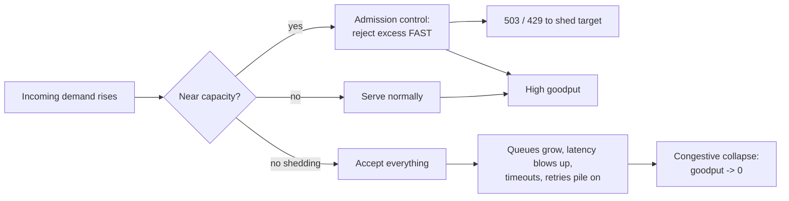
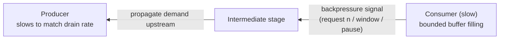

# Load Shedding & Backpressure

When demand exceeds what a system can serve, something has to give. The naive outcome is
**congestive collapse**: every request is accepted, queues grow without bound, latency blows
up, everything times out, and *goodput* (useful work completed) crashes toward zero even as
the machine is 100% busy. The reliability engineer's job is to make the failure **graceful and
deliberate** instead. Two complementary mechanisms do this:

- **Load shedding** — at the *entry* point, deliberately **reject** a fraction of requests
  (fast, cheap `503`/`429`) so the requests you *do* accept are served within SLO. Better to
  serve 90% of traffic well than 100% badly.
- **Backpressure** — a *feedback signal* that flows **upstream**, telling producers to slow
  down because a downstream consumer cannot keep up. It moves the "reject / block" decision to
  where it is cheapest and preserves bounded resource use end-to-end.

> [!KEY-TAKEAWAY]
> Overload is not solved by "adding a queue." A queue only *converts* an overload into
> **latency and memory growth**; if arrival rate stays above service rate, the queue is a
> countdown to OOM. Under sustained overload you must either **shed** (drop work) or apply
> **backpressure** (slow the source). Buffering only buys time for one of those two to kick in.

This topic covers the *operational, reliability-engineering* angle: how to keep a system
standing under overload. For **rate limiting as abuse prevention** see `security/*` and for the
**algorithm/design** of a limiter see `system-design/design-rate-limiter`. For **capacity math
and forecasting** see `reliability-ops/capacity-planning-and-load-management`; for **feature-level
fallbacks** see `reliability-ops/graceful-degradation-and-fallbacks`. For **how you measure and
alarm** on the signals below (queue depth, saturation, the four golden signals) see
`observability/*`.

---

## Why Shed Load: Goodput vs Throughput

**The core insight (Google SRE, "Handling Overload"):** a server has a finite capacity. Past
that point, accepting more requests does not increase useful work — it *decreases* it, because
each request consumes CPU/memory/threads to be partially processed and then fail or time out.
You spend resources producing nothing a client can use.

Distinguish three quantities:

| Term | Meaning |
|---|---|
| **Throughput** | requests the server *accepts/processes* per second (includes doomed work) |
| **Goodput** | requests completed **successfully within their deadline** per second — the only number that matters |
| **Utilization** | how busy the resource is (CPU, threads, connections) |

The characteristic overload curve: goodput rises with load, plateaus at capacity, then **falls
off a cliff** as the server thrashes (context-switching, GC pressure, cache misses, retries
piling on). Load shedding's goal is to **flatten the cliff into a plateau** — hold goodput at
capacity by refusing the excess quickly and cheaply.



> [!WARNING]
> A rejected request must be **cheap** to reject, ideally far cheaper than serving it.
> If your `503` path itself does expensive work (auth, DB lookups, deep stack traversal),
> shedding can *cost more* than serving and you will still collapse. Reject as early and as
> shallow in the stack as possible (edge/LB/admission layer), not deep inside the app.

---

## Load Shedding Mechanics: Admission Control

**Load shedding** = admission control at the front door. When a saturation signal crosses a
threshold, new requests are rejected immediately instead of being queued or processed.

**What to measure to trigger it (pick a *symptom of saturation*, not raw traffic):**
- **Queue depth / wait time** — requests already waiting longer than they can afford.
- **In-flight concurrency** vs a configured/adaptive limit.
- **CPU or thread-pool saturation**, memory pressure, GC time.
- **Latency SLO breach** — p99 climbing past target.

**Response codes — get these right, interviewers probe them:**

| Code | Semantics | When to use for shedding |
|---|---|---|
| `429 Too Many Requests` | client exceeded a **rate limit**; per-client quota | client-scoped throttling / quota |
| `503 Service Unavailable` | server is **overloaded/unavailable**, try later | server-wide load shedding |
| `Retry-After` header | tells client *when* to retry | attach to `429`/`503` to shape retry timing |

Both are **retryable** — which is exactly why shedding and retry policy must be co-designed
(see the retry-storm warning below).

**Adaptive concurrency limits.** Static thresholds are brittle (capacity varies with request
mix, deploys, noisy neighbors). Modern shedders discover the limit dynamically:
- **Little's Law–based / TCP-Vegas-style** (e.g. Netflix `concurrency-limits`): infer the
  concurrency ceiling from observed latency — when latency rises above the no-load minimum,
  the queue is forming, so lower the limit.
- **CoDel (Controlled Delay)** as an active-queue-management discipline: track the *minimum*
  queue sojourn time over a window; if it stays above a target (~5 ms) for an interval
  (~100 ms), start dropping/rejecting from the queue. It targets **standing queues** (bufferbloat)
  while tolerating transient bursts.
- **Server-side adaptive throttling** (Google SRE): the client itself throttles based on the
  ratio of accepted to attempted requests, sharing shedding responsibility across the fleet.

> [!TIP]
> Prefer rejecting at the **load balancer / API gateway / mesh sidecar** and via a small
> admission-control layer, so the expensive request path never runs. Envoy, for instance,
> supports adaptive concurrency and circuit-breaking limits at the proxy. This keeps the reject
> cost near-zero.

---

## Prioritized & Criticality-Based Shedding

Not all requests are equal. Shedding *uniformly* (drop a random 20%) is far worse than shedding
*the cheapest-to-lose 20% first*. Prioritized shedding sheds by **value** so that scarce
capacity goes to the requests that matter.

**Dimensions to prioritize by:**
- **Criticality tier** (Google SRE uses `CRITICAL_PLUS`, `CRITICAL`, `SHEDDABLE_PLUS`,
  `SHEDDABLE`): mark each request's importance and shed the sheddable classes first. Background
  refreshes, prefetch, and best-effort analytics are `SHEDDABLE`; a checkout or a paying-user
  read is `CRITICAL`.
- **Cost to serve** — shed expensive queries first to reclaim the most capacity per rejection.
- **User/tenant tier** — protect paying or SLA-backed customers; shed free-tier or internal
  batch traffic first (fairness across tenants also prevents one abuser from starving others).
- **Idempotency / retriability** — a request that will be safely retried is cheaper to shed now.

Criticality should be **propagated through the call graph**: if a top-level request is
`SHEDDABLE`, every downstream call it makes inherits that class, so a deep service can shed it
without knowing the business context.

> [!INTERVIEW]
> A classic scenario: "Your service is at 120% capacity. What do you drop?" Strong answer:
> *shed by criticality first (best-effort/background before user-facing), then by cost, then by
> tenant tier — and shed as early as possible so rejected work is cheap. Also verify clients
> honor `Retry-After` and back off, or shedding just feeds a retry storm.*

**The retry-storm trap.** Load shedding + naive clients = amplification. If a shed `503`
triggers an immediate retry (or 3 retries), a fleet at 100% capacity suddenly sees 2–4× the
traffic — the shedding *causes* the collapse it was meant to prevent. Mitigations: retry with
**exponential backoff + jitter**, cap **retries per request** (e.g. ≤2), enforce a **retry
budget** (e.g. retries ≤10% of requests), and use **circuit breakers** so a failing dependency
stops receiving retries at all. See `reliability-ops/retries-timeouts-and-backoff` and
`reliability-ops/circuit-breakers-and-bulkheads`.

---

## Backpressure: Signaling Upstream to Slow Down

**Backpressure** is a **feedback signal that propagates from a saturated consumer back toward
the producer**, causing the producer to *slow or stop* until the consumer can catch up. Where
load shedding *drops* work, backpressure *paces* it — the source produces at the rate the sink
can drain.

**Mechanisms, cheapest to most costly:**
- **Blocking / bounded buffers** — a bounded queue that *blocks the producer* when full. The
  producer's thread stalls, which naturally slows generation. (Blocking a request thread also
  ties up a resource — fine for a producer you control, dangerous for request-serving threads.)
- **Rejection** — a bounded queue that *rejects* (fails fast) when full, converting backpressure
  into shedding at that hop.
- **Credit / demand signalling** — the consumer explicitly grants the producer permission to
  send N items (Reactive Streams `request(n)`, HTTP/2 & gRPC flow-control windows, TCP receive
  window). The producer may never send more than it has been asked for. This is the cleanest,
  because backpressure is *in the protocol*.
- **Pausing/rate feedback** — Kafka pauses partition consumption; TCP shrinks the advertised
  window to 0.



**Why it's better than unbounded buffering:** backpressure bounds memory and *latency* across
the whole pipeline. Instead of a fast producer building a giant hidden queue (that later
explodes into tail latency or OOM), the slowest stage sets the pace and the pressure is felt
where it can be handled — often at a human-visible boundary (an API returns `429`, a batch job
slows) rather than as a silent memory leak.

> [!KEY-TAKEAWAY]
> Backpressure and load shedding are the same idea at different distances: **shed** = "I reject
> here." **Backpressure** = "I tell you upstream to send less so I don't have to." A robust
> system does both — apply backpressure while you can, shed when you must.

---

## Push vs Pull: Why Pull Is Naturally Backpressured

The *direction of control* determines whether backpressure is automatic or bolted on.

| | **Push** (producer-driven) | **Pull** (consumer-driven) |
|---|---|---|
| Who sets the rate | producer | **consumer** |
| Backpressure | must be added explicitly (credits, acks, bounded queue) | **inherent** — consumer only fetches what it can handle |
| Overload risk | consumer can be flooded → drops or OOM | consumer paces itself; producer may accumulate (durable log absorbs it) |
| Examples | webhooks, Server-Sent Events, RabbitMQ push, naive observer | **Kafka consumers**, HTTP polling, `poll()`-based loops, reactive `request(n)` |

**Kafka is the canonical example.** Consumers **pull** batches via `poll()`; the broker never
pushes faster than the consumer asks. The buffer is the **durable partition log**, and the
health signal is **consumer lag** (`log-end-offset − committed-offset`) — how far behind the
consumer is. Rising lag *is* the backpressure indicator; you respond by scaling consumers
(up to the partition count), optimizing processing, or accepting bounded lag. The log decouples
producer and consumer speeds without either flooding the other. (Contrast RabbitMQ's default
push, where you must set a **prefetch/QoS** limit or a slow consumer gets buried.)

> [!TIP]
> "Make it pull, not push" is a strong general answer to "how do you add backpressure to this
> pipeline?" A pull/poll model with a bounded fetch size gives you backpressure for free.

---

## Bounded vs Unbounded Queues: The Buffering Anti-Pattern

A queue sitting between a producer and a slower consumer *feels* like a fix. It is a trap if
it is **unbounded**.

**Unbounded queue = latent OOM + unbounded latency.** If arrival rate λ exceeds service rate μ
even briefly-but-persistently, an unbounded queue grows without limit. Two failures, both
delayed and therefore hard to diagnose:
1. **Memory exhaustion / OOM** — the queue eats the heap and the process dies (or GC thrashes).
2. **Latency blowup** — by the time an item is dequeued it has waited so long the client has
   already timed out; you do work whose result nobody wants (wasted goodput). Java's classic
   trap: an `Executors.newFixedThreadPool` uses an **unbounded `LinkedBlockingQueue`**, so tasks
   pile up invisibly instead of being rejected.

**Bounded queues make overload *visible and early*:** when the queue is full you must choose a
policy *now* — block the producer (backpressure) or reject (shed). Both are better than silent
accumulation. A bounded queue turns "OOM in 40 minutes" into "reject/slow at second 1."

> [!WARNING]
> A big queue does **not** add capacity — it adds *delay*. Sizing a queue is really sizing your
> **worst-case latency**: with service rate μ, a queue of depth D adds up to `D/μ` seconds of
> wait. Size the queue to the **latency you can tolerate**, not to "as big as possible."
> A common good default is a *shallow* queue plus fast rejection.

**Choosing a bound.** Little's Law (below) gives the intuition: to hold latency ≤ W at
throughput λ, you can have at most `L = λ × W` items in the system. Set the queue near that,
not larger. Thread-pool rejection policies (e.g. Java `ThreadPoolExecutor`'s
`AbortPolicy`/`CallerRunsPolicy`) then turn a full bounded queue into shedding or backpressure.

---

## LIFO vs FIFO Under Overload

Queue *discipline* matters enormously once a queue backs up. Default FIFO is the wrong choice
under overload.

- **FIFO (first-in-first-out):** serves the **oldest** item first. Under overload, the oldest
  items are the ones that have **already waited the longest** — often long enough that the
  client has **already timed out**. You spend capacity on requests whose answer nobody is
  waiting for, and *every* request eventually experiences the full queue delay. Latency for
  everyone degrades together.
- **LIFO (last-in-first-out):** serves the **newest** item first. Under overload, newest items
  are the most likely to still have a client waiting within its deadline, so you maximize the
  fraction served *usefully*. The old, stale items at the bottom are exactly the right ones to
  drop. Under **normal** load LIFO and FIFO behave identically (queue is near-empty); LIFO's
  benefit appears **only when the queue is deep**.

> [!KEY-TAKEAWAY]
> Under overload, prefer **LIFO + a deadline/TTL on queued work**: serve the freshest requests,
> and **drop items already past their deadline** without processing them ("dead on arrival").
> This is why AWS and others use LIFO-ish disciplines and per-item deadlines in overload
> conditions — it protects goodput. (Beware LIFO *starvation* of old items in steady state;
> pairing it with deadline-drop resolves the fairness concern by discarding, not starving.)

**Deadline propagation** reinforces this: pass the request's remaining time budget down the call
graph so each hop can check "is there still time to serve this?" and drop early if not — a form
of shedding driven by the client's deadline rather than the server's saturation.

---

## Little's Law: The Capacity/Latency Intuition

**Little's Law** is the one formula to know here. For any stable system:

```
L = λ × W
```

- **L** = average number of requests *in the system* (in service + waiting)
- **λ** (lambda) = average arrival/throughput rate (requests/sec)
- **W** = average time a request spends in the system (latency, seconds)

It holds for any stable queueing system regardless of distribution — no assumptions about
arrival pattern. Interview uses:

- **Concurrency needed:** to serve λ = 2000 req/s at W = 50 ms each, you need
  `L = 2000 × 0.05 = 100` requests in flight → ~100 concurrent workers/threads/connections.
  This sizes thread pools and connection pools directly.
- **What overload does:** if λ exceeds capacity, requests can't leave as fast as they arrive, so
  **L grows → W grows** (latency climbs) because L and W move together at fixed λ. Rising latency
  under steady traffic is the fingerprint of a forming queue.
- **Setting concurrency limits:** an adaptive limiter is essentially solving Little's Law live —
  holding L at the value that keeps W (latency) at the no-load minimum. Above that, extra
  admitted requests only add queue time, not goodput.

> [!TIP]
> If an interviewer asks "how many threads/connections do you need?", reach for `L = λ × W`.
> If they ask "why did latency spike when we didn't add traffic?", answer "L rose — a queue is
> forming; a downstream slowdown raised W, so in-flight count climbed until we hit a limit."

---

## Brownout & Graceful Degradation as Shedding

**Brownout** (borrowing the electrical-grid term for a voltage reduction that avoids a full
blackout) is *partial, per-request* shedding: instead of rejecting whole requests, the service
**drops optional work** to cut the cost of each request and stay within capacity.

Examples:
- Skip a personalization/recommendation call and serve a generic page.
- Serve **stale cache** instead of a fresh DB read.
- Return lower-resolution images or fewer results per page.
- Turn off expensive real-time features (live counts, previews) under load.

This is **load shedding along the *quality* axis rather than the *request* axis** — you keep
availability at 100% but reduce the *fidelity* of responses. It preserves the critical core
while shedding cost. The deep dive on choosing fallbacks, cached defaults, and feature flags for
this lives in `reliability-ops/graceful-degradation-and-fallbacks`; the reliability point here is
that **degradation is a shedding tool**: it's the option between "serve fully" and "reject."

> [!INTERVIEW]
> Order of defense under rising load (a great structured answer): (1) **autoscale** if you can
> in time; (2) **brownout** — shed optional work per request; (3) **backpressure** — slow the
> source / bounded-queue-reject; (4) **prioritized load shedding** — reject sheddable-class
> requests; (5) as a last resort, reject broadly with `503` + `Retry-After`. Always co-designed
> with retry backoff + jitter and circuit breakers so shedding doesn't trigger a retry storm.

---

## Backpressure Protocols: Reactive Streams & TCP Flow Control

Two well-specified systems make the "demand signalling" idea concrete — good to name in an
interview.

**TCP flow control (the classic analogy).** The receiver advertises a **receive window**
(`rwnd`) — how many bytes it currently has buffer space for. The sender may have at most that
many unacknowledged bytes in flight. If the receiver's buffer fills, it advertises **window = 0**
and the sender *stops* until a window update arrives. This is pure credit-based backpressure
baked into the transport — the fast sender cannot overrun the slow receiver. (Distinct from
*congestion* control, which reacts to the network path, not the receiver.)

**Reactive Streams** (`java.util.concurrent.Flow`, Project Reactor, RxJava, Akka Streams)
standardizes this for in-process/async streams. The `Subscriber` calls
**`subscription.request(n)`** to signal it can handle `n` more items; the `Publisher` must
**never emit more than the outstanding demand**. Demand is the credit. This makes the pipeline
**non-blocking *and* bounded** — no thread is blocked waiting, yet no stage is flooded. When a
non-backpressure-aware source is faster than demand, operators apply an explicit
**overflow strategy**: `onBackpressureBuffer` (bounded), `onBackpressureDrop` (shed newest),
`onBackpressureLatest` (keep only latest) — i.e. you must *choose* buffer vs shed, exactly the
same decision as everywhere else.

| Overflow strategy | Behavior | Use when |
|---|---|---|
| `buffer` (bounded) | queue overflow up to a limit, then error | short bursts, memory to spare |
| `drop` | discard new items when overwhelmed | freshness doesn't matter, e.g. sensor spam |
| `latest` | keep only the most recent, drop the rest | you only need current state (e.g. UI, price ticker) |
| `error` | fail fast | overflow indicates a real bug/misconfig |

> [!KEY-TAKEAWAY]
> Whether it's TCP `rwnd`, gRPC/HTTP-2 flow-control windows, or Reactive Streams `request(n)`,
> the pattern is identical: **the consumer grants credit; the producer must not exceed it.**
> Naming this "credit-based / demand-driven backpressure" and tying it to TCP's zero-window
> reliably signals depth in an interview.

---

## Common Interview Follow-ups

- **"Why is it better to serve 90% of requests well than 100% badly?"** Past capacity, extra
  accepted requests consume resources and still fail/time out, dragging down the ones that would
  have succeeded — goodput collapses. Shedding the excess holds goodput at capacity.
- **"You added a queue and it made things worse. Why?"** It was unbounded (or too deep): it
  converted overload into unbounded latency/OOM and let you process requests whose clients had
  already timed out. Bound it and reject/backpressure when full.
- **"FIFO or LIFO under overload?"** LIFO — serve the freshest requests (still within deadline)
  and drop the stale ones at the bottom; pair with per-item deadlines/TTL to avoid starvation.
- **"429 vs 503?"** `429` = this *client* exceeded a rate/quota (client-scoped); `503` = the
  *server* is overloaded (server-scoped). Both retryable → add `Retry-After` and require backoff.
- **"How do you prevent shedding from causing a retry storm?"** Exponential backoff + jitter,
  bounded retries per request, a fleet-wide retry budget, and circuit breakers; make clients
  honor `Retry-After`.
- **"How many threads should this pool have?"** Little's Law: `L = λ × W`. E.g. 500 req/s at
  40 ms → 20 concurrent → ~20 threads, plus headroom.
- **"How does Kafka apply backpressure?"** Consumers pull (`poll()`) at their own rate; the
  durable log is the buffer; **consumer lag** is the backpressure signal; you scale consumers or
  accept bounded lag rather than flooding anyone.
- **"What's brownout?"** Per-request quality degradation — drop optional work (recommendations,
  fresh reads) to cut cost per request and stay up, instead of rejecting whole requests.
- **"Where should you shed — edge or app?"** As early/shallow as possible (LB, gateway, mesh),
  so rejected requests are cheap; deep rejection wastes the resources you're trying to protect.
- **"Static vs adaptive concurrency limits?"** Static thresholds are brittle across request
  mixes and deploys; adaptive limiters (Little's-Law/latency-based like Netflix
  concurrency-limits, or CoDel) discover the ceiling from observed latency/queue delay.

## References

- Google, *Site Reliability Engineering*, Ch. 21 "Handling Overload" (goodput, criticality
  classes, client-side adaptive throttling, per-request criticality) and Ch. 22 "Addressing
  Cascading Failures" (retry amplification, load shedding, graceful degradation).
- Google, *The SRE Workbook*, Ch. on managing load and overload.
- Michael T. Nygard, *Release It!* (2nd ed.) — stability patterns: Bulkheads, Fail Fast,
  Shed Load, Backpressure, and the Unbounded-Result-Set / blocked-threads anti-patterns.
- Amazon Builders' Library: "Using load shedding to avoid overload" and "Timeouts, retries, and
  backoff with jitter" (Marc Brooker) — LIFO under overload, deadline propagation, cheap
  rejection, retry budgets.
- Netflix Tech Blog & `Netflix/concurrency-limits` — adaptive concurrency limits
  (TCP-Vegas / Little's-Law-based, Gradient algorithm).
- Nichols & Jacobson, "Controlling Queue Delay" (CoDel), *ACM Queue*, 2012 — active queue
  management, standing-queue detection.
- Reactive Streams specification (`Publisher`/`Subscriber`/`Subscription.request(n)`) and
  Project Reactor `onBackpressure*` operators.
- RFC 9293 (TCP) — receive window / flow control (distinct from congestion control).
- AWS Well-Architected Framework, Reliability pillar — throttling and load-shedding guidance.
- Cross-references: `reliability-ops/retries-timeouts-and-backoff`,
  `reliability-ops/circuit-breakers-and-bulkheads`,
  `reliability-ops/graceful-degradation-and-fallbacks`,
  `reliability-ops/capacity-planning-and-load-management`,
  `system-design/design-rate-limiter`, `security/*` (rate limiting as abuse prevention),
  `observability/*` (measuring saturation and the four golden signals).
