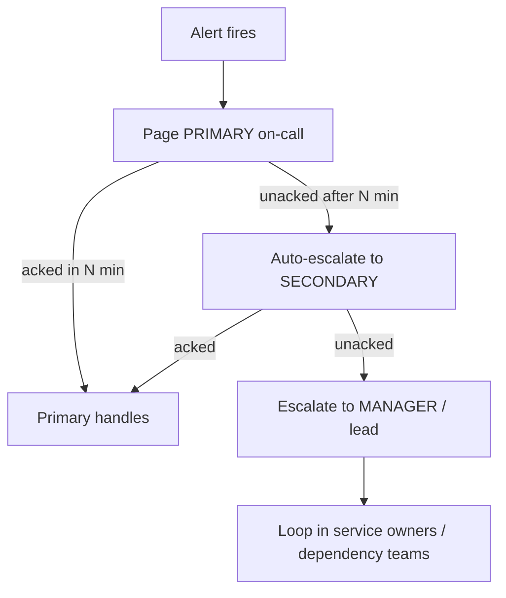
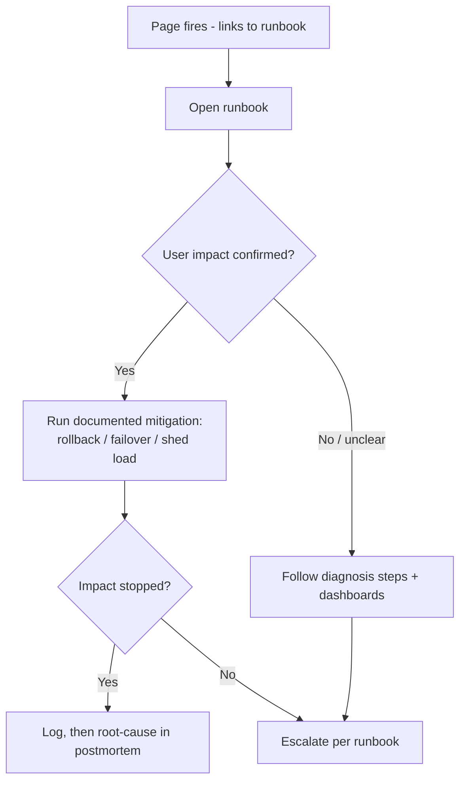
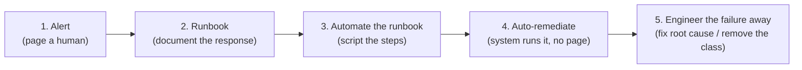

# On-Call, Escalation & Runbooks

On-call is the human side of reliability: the practice of having engineers ready to
respond when automated systems can't self-heal. Done badly it burns people out, drives
attrition, and *degrades* reliability (tired, resentful responders make mistakes). Done
well it is **sustainable, boring, and rare** — pages are few, every page is actionable,
and a runbook exists for each. This topic covers **on-call models**, **escalation
policies**, **paging hygiene**, **runbooks/playbooks**, the **alert → runbook → automate**
progression, and how to keep on-call **healthy**.

Grounded in Google's *Site Reliability Engineering* (Ch. 11 "Being On-Call", Ch. 5
"Eliminating Toil"), *The SRE Workbook* (Ch. 8 "On-Call"), Michael Nygard's *Release It!*
(operational stability), the PagerDuty Ops Guides, and the AWS Well-Architected
Reliability pillar (operational readiness).

> [!KEY-TAKEAWAY]
> The goal of a mature on-call program is to make on-call **boring**. Every page must be
> **actionable, urgent, and about real user impact**; every alert should link to a
> **runbook**; and each recurring page should climb the ladder **alert → runbook →
> automate the runbook → engineer the class of failure away**. On-call load is capped
> (Google's rule of thumb: **≤ 2 incidents per shift**) and SREs spend **≥ 50 % of time
> on engineering, ≤ 50 % on ops/toil**.

Boundaries (cross-reference, don't duplicate):
- **Alerting mechanics** — multi-burn-rate alert rules, dashboards, PromQL, and the
  data-driven side of alert-fatigue tuning belong to observability — see
  `observability/slo-based-alerting-and-error-budgets` and
  `observability/on-call-alert-fatigue-and-actionable-signals`. Here we cover the
  *human/process* discipline of paging.
- **Running an active incident** (Incident Command, roles, MTTR, mitigate-before-diagnose)
  — see `reliability-ops/incident-response-and-command`.
- **Learning afterward** (blameless postmortems, RCA) — see
  `reliability-ops/blameless-postmortems-and-learning`.
- **The mitigation levers** runbooks invoke (rollback, canary, failover, load-shedding)
  — see `devops-cicd/deployment-strategies`, `reliability-ops/redundancy-failover-and-health-checks`,
  `reliability-ops/load-shedding-and-backpressure`.
- **CI/CD pipeline + DevOps-culture framing of SRE** — see `devops-cicd/*`.

---

## Why On-Call Exists and the Goal of Boring

On-call exists because no system self-heals perfectly: novel failures, dependency
outages, and correlated failures still need human judgment. The purpose of an on-call
program is to **guarantee a fast, competent human response** to problems automation
cannot handle — *not* to babysit an alert stream.

**Mechanism / philosophy.** A healthy program treats every page as a signal that the
system needs either a human decision *or* investment to remove the need for one. The
explicit aspiration is that **on-call is boring**: long stretches with no pages, and
when a page fires it is real, urgent, and has a documented response. "Boring" is a
*measurable* target — you track pages per shift, % of pages that were actionable, and
% auto-resolved.

**Why boring matters (trade-off).** Noisy on-call is not just unpleasant — it *reduces*
reliability. Alert fatigue causes responders to acknowledge and ignore, slows real
responses, and raises MTTR. A page that wakes someone at 3 a.m. for a non-actionable
warning has a real cost measured in human attention and future missed pages.

> [!INTERVIEW]
> "How do you know your on-call is healthy?" A strong answer gives *metrics*: pages per
> 12-hour shift (target ≤ 2 that require real work), % actionable, time-of-day
> distribution, and the fraction of engineer time spent on ops vs. project work
> (should stay ≤ 50 %). "It feels fine" is not an answer.

---

## On-Call Models: Follow-the-Sun, Primary/Secondary, Rotations

There is no single on-call model; you choose based on team size, geographic spread, and
service criticality.

| Model | How it works | Best when | Trade-off |
|---|---|---|---|
| **Single rotation** | One engineer on-call at a time, rotating (e.g. weekly) | Small team, one site | No backup if primary is unreachable; night pages hit locals |
| **Primary / secondary** | Primary takes pages, secondary is backup/escalation (or splits sev levels) | Most teams | Two people "encumbered"; secondary must also be reachable |
| **Follow-the-sun** | ≥ 2 teams in different timezones (e.g. 8–12 h apart) each cover their daytime | Global org, ≥ 2 sites with enough engineers | Requires strong handoff; more coordination overhead; needs ~6+ engineers/site |
| **Tiered (L1/L2/L3)** | Front-line triage escalates to service owners | Large orgs, shared NOC | L1 may lack context; risk of "throw it over the wall" |

**Follow-the-sun mechanism.** The killer feature is **no night shifts**: if San
Francisco and, say, Dublin/Zürich cover ~12 hours each, everyone is on-call during their
normal working hours. Google runs SRE this way (e.g. Mountain View + Zürich). The cost is
that a global handoff happens twice a day and *must* transfer live context — otherwise
you get dropped incidents.

**Rotation length.** Weekly rotations are the common default: long enough to see the
service's rhythms and finish follow-up on incidents, short enough to avoid burnout.
Shorter (daily/half-week) rotations reduce fatigue but fragment context and multiply
handoffs; longer (bi-weekly+) rotations increase burnout risk. Many teams **split the
week** (e.g. weekday vs. weekend blocks) so weekend pain is shared.

**Team size math.** Sustainable on-call needs enough engineers that any one person's
share is small. Google's guidance: a single-site rotation wants **≥ 8 engineers**, and a
two-site follow-the-sun wants **~6 per site**. Fewer, and rotations come around too often
(burnout) or you can't maintain primary+secondary.

> [!WARNING]
> A "hero" model — one senior engineer who silently handles everything — is an
> anti-pattern. It creates a **single point of failure**, hides toil, and collapses when
> that person leaves or takes vacation. Spread on-call so knowledge and load are shared.

---

## On-Call Handoff and Shift Continuity

A **handoff** transfers on-call responsibility (and *context*) from the outgoing to the
incoming responder. Missed handoffs are a leading cause of dropped incidents in
follow-the-sun models.

**What a good handoff transfers:**
- **Open/ongoing incidents** and their current mitigation state.
- **Silenced/snoozed alerts** and *why* they were silenced (and when they un-silence).
- **In-flight risky changes** (deploys, migrations, feature flags) landing during the
  next shift.
- **Known-flaky signals** and any temporary workarounds in place.

**Mechanism.** Handoff is usually a short synchronous or written ritual (a handoff doc /
checklist, or a live call at the timezone boundary). The incoming responder explicitly
**acknowledges ownership** — ambiguity about "who has the pager right now" is dangerous.

> [!TIP]
> Silenced alerts are the classic handoff landmine: someone snoozes a page to stop the
> noise, forgets to mention it, and the next shift never learns the underlying problem is
> still live. Every silence should have an **expiry** and appear on the handoff.

---

## Healthy On-Call: Load Caps, the 50 % Rule, and Compensation

Sustainability is a hard requirement, not a nicety. Three levers keep on-call healthy:

**1. Cap the incident load per shift.** Google's rule of thumb: a responder should handle
**at most ~2 incidents per 12-hour on-call shift**. The reasoning is arithmetic — properly
handling an incident (triage, mitigate, root-cause, write-up, follow-up) takes roughly
**~6 hours**. Two incidents ≈ a full 12-hour shift; more than that means incidents get
short-changed (skipped postmortems, rushed fixes) and the responder is overloaded. If a
rotation regularly exceeds this, the correct response is **not** to demand heroics — it's
to redistribute load, split the service, or invest engineering time to reduce paging.

**2. Cap ops time at 50 % (the SRE headline rule).** SREs should spend **≤ 50 % of their
time on operational work** (on-call, tickets, toil, manual interventions) and **≥ 50 % on
engineering** that reduces future ops load. This is the mechanism that keeps the team from
degenerating into a pure ops/NOC function. If ops work exceeds 50 %, the standard remedy
is to **temporarily give excess operational load back to the dev team** (bounce pages to
developers) so SRE can build automation — the overflow is a *signal*, and making it
visible to the people who can fix it is the point.

**3. Compensate on-call.** On-call is real work outside normal hours, so it should be paid
back: **time-off-in-lieu** (comp time) or **cash**. Google caps this at a **fixed
percentage of salary (roughly 5–6 %)** — deliberately bounded so that (a) it doesn't
become a perverse incentive to volunteer for painful rotations, and (b) beyond the cap the
organization is forced to *fix* the on-call load rather than pay more for suffering.

| Symptom | Root cause | Correct response (not a band-aid) |
|---|---|---|
| > 2 real incidents/shift consistently | Under-provisioned reliability or too-broad service | Split service, add capacity, or fund engineering to cut pages |
| Ops work > 50 % of time | Toil growing faster than automation | Overflow pages back to dev team; prioritize toil-reduction projects |
| Same page every rotation | Missing automation | Climb the alert→runbook→automate ladder |
| Responders exhausted / attrition | Rotation too small or too noisy | Grow rotation, fix paging hygiene, enforce comp |

> [!KEY-TAKEAWAY]
> The numbers to remember: **≤ 2 incidents / shift**, **≤ 50 % ops time**, **~6 hours to
> handle one incident well**, **comp capped ~5–6 % of salary**, **≥ 8 engineers** for a
> single-site rotation. Exceeding a cap is a *signal to fix the system*, not a call for
> heroics.

---

## Escalation Policies

An **escalation policy** defines *who gets paged, in what order, and when the page moves
on* if it isn't handled. It exists so that an unacknowledged page never falls on the
floor.

**Mechanism — auto-escalation.** If the primary does not **acknowledge** within a
timeout (commonly **5–15 minutes**, tighter for higher severity), the page automatically
escalates to the secondary, then to a manager/lead, then to broader owners. This is
enforced by the paging tool (PagerDuty, Opsgenie, etc.), not by human memory. Note
**acknowledge ≠ resolve**: acking just means "a human has it"; the escalation clock stops
on ack, but a separate timer can re-page if it isn't *resolved*.

**Escalation dimensions:**
- **Vertical**: primary → secondary → manager (someone with more authority/availability).
- **Horizontal / service-owner**: page the team that owns the failing dependency. A
  page landing on the wrong team wastes the most precious minutes of an incident.
- **Severity-based**: a Sev1 might page primary + secondary + IC simultaneously and
  allow only a 2-minute ack window; a Sev3 pages only primary with a longer window.

**Trade-offs.** Ack timeouts that are **too short** cause needless escalations and wake
the secondary/manager for transient blips; **too long** and real outages sit unhandled.
Tune per severity. Escalation policies should also have a **final backstop** (e.g. the
whole team channel or a broad rotation) so a page is *never* silently dropped if everyone
in the chain is unavailable.

> [!WARNING]
> The most common escalation failure is a **dead-end chain**: primary is asleep/unreachable,
> and the policy has no secondary or the "manager" left the company. Test escalation paths
> — periodically fire a synthetic page and confirm it walks the chain.

---

## Paging Hygiene: Actionable, Urgent, User-Impacting

Not everything that can be alerted *should* page a human. The bar for a **page** (wake
someone up / interrupt them) is high — every page must satisfy **all three**:

1. **Actionable** — there is something the human can *do* right now. If the only response
   is "acknowledge and watch," it should not page.
2. **Urgent** — it can't wait for business hours. If it can, it's a ticket, not a page.
3. **Real user impact (or imminent risk of it)** — it reflects (or predicts) degraded
   customer experience, not just an internal metric wobble.

If an alert fails any of these, it should be **downgraded** to a ticket, a dashboard, or
deleted. This is the reliability-side statement of *symptom-based, SLO-driven alerting*;
the mechanics of building those alerts (multi-burn-rate rules, the four golden signals,
alert-fatigue tuning) live in observability — see
`observability/on-call-alert-fatigue-and-actionable-signals`.

**Why hygiene is a reliability concern (mechanism).** Alert fatigue is a feedback loop:
noisy, non-actionable pages → responders learn to ignore pages → the *real* page gets
ignored too → higher MTTR and missed outages. Every non-actionable page you tolerate
raises the probability that a genuine one is missed. Pruning noise is therefore
*directly* protecting reliability, not just responder comfort.

| Signal | Should it page? | Where it goes |
|---|---|---|
| Customer-facing SLO burning fast (error budget draining) | **Yes** — actionable + urgent + user impact | Page |
| Single host CPU at 90 % but SLO fine, capacity headroom OK | No | Dashboard / ticket if trend |
| Disk will fill in 3 days | No — urgent-ish but not now | Ticket (auto-created) |
| Batch job failed but auto-retries and has 6 h of slack | No | Ticket / next-day review |
| Cause-based alert ("CPU high") with no user impact yet | Prefer no | Downgrade to symptom-based |

> [!TIP]
> Rule of thumb: **alert on symptoms, page on user impact.** A page that can't be tied to
> a runbook action or a customer-visible symptom is a candidate for deletion. Track "%
> of pages that were actionable" — anything well below ~90 % means you're training people
> to ignore the pager.

---

## Runbooks and Playbooks

A **runbook** (a.k.a. playbook) is a documented, step-by-step procedure for responding to
a **known failure mode**. The ideal is **a runbook per alert**: when a page fires, the
alert links directly to the exact steps to diagnose and mitigate it.

**Why runbooks work (mechanism).** They convert a stressed, half-awake responder's job
from *improvised diagnosis* into *executing a validated procedure*. Studies cited in the
SRE book found that a **good runbook plus reasonably targeted alerting produces roughly a
3× improvement in MTTR** versus responders working from scratch. Runbooks also spread
tribal knowledge so on-call doesn't depend on one expert (attacking the "hero" anti-pattern).

**What makes a good runbook:**
- **Specific & prescriptive** — exact commands, dashboard links, query strings, not "check
  the system." A responder should be able to follow it without deep prior context.
- **Tied to an alert** — the page names the runbook; the runbook opens with "you were paged
  because X."
- **Links to dashboards/tools** — deep links to the relevant graphs, logs, and consoles.
- **States mitigation first** — how to *stop the bleeding* (roll back, fail over, shed
  load) before diagnosis, matching the incident-response prime directive.
- **Includes escalation** — when to give up and escalate, and to whom.
- **Tested & maintained** — a runbook that's never exercised rots. Validate it (game days,
  or simply using it during real incidents and fixing what's wrong). An untested runbook
  can be worse than none — it gives false confidence and may contain stale/dangerous steps.

**Runbook vs. playbook (terminology).** The terms are often used interchangeably. Where
teams distinguish them: a **runbook** is the low-level, often automatable operational
procedure ("how to restart service X, drain a node"); a **playbook** is the higher-level
incident-response decision guide ("for a payment outage, do A, then B, consider C"). Don't
over-index on the distinction in an interview — know that both are documented, tested
response procedures.

> [!WARNING]
> **Stale runbooks are dangerous.** A runbook that references a decommissioned host, an
> old rollback command, or a moved dashboard can send a responder down the wrong path
> under pressure. Treat runbooks as living code: version them, review them, and delete or
> fix ones that fail during a real incident.

---

## The Alert → Runbook → Automate → Eliminate Progression

The maturity ladder for any recurring page. Each rung reduces human involvement and moves
you toward "boring."

1. **Alert** — a human is paged and figures it out (highest toil, needed for novel issues).
2. **Runbook** — you've seen it before, so document the response. Cuts MTTR and cognitive
   load. Cross-ref `observability` for the alert; the runbook is linked from it.
3. **Automate the runbook** — turn the documented steps into a script/tool the human runs
   (one command instead of ten). Reduces error and time.
4. **Auto-remediate** — the system detects the condition and runs the fix itself; the human
   is *notified*, not *paged* (or paged only if auto-remediation fails). This is where a
   page disappears.
5. **Eliminate** — the best outcome: change the design so the failure mode can't happen
   (add redundancy, fix the leak, remove the fragile dependency). No alert needed at all.

**Trade-off — when NOT to automate.** Auto-remediation has real risk: an automated action
firing on a *misdiagnosed* condition can amplify an outage (e.g. auto-restart masking a
crash-loop, or auto-scaling into a runaway bill). Automate only once the runbook is
**well-understood, low-risk, and tested**; keep a human in the loop (notify-and-confirm)
for high-blast-radius actions. Also weigh cost: automating a page that fires twice a year
may not be worth the engineering — prioritize by **page frequency × toil per page**.

> [!INTERVIEW]
> "This alert pages us every week — what do you do?" The staff-level answer walks the
> ladder: first make sure it's actionable (else delete it), write/refine the runbook,
> then automate the runbook, then aim to remove the failure class — and justify how far up
> the ladder to invest based on frequency × cost and the risk of automating a wrong action.

---

## Toil from On-Call

**Toil** is manual, repetitive, automatable, tactical work that scales linearly with
service growth and has no lasting value (Google SRE definition). On-call is a major toil
source: manual restarts, repeated mitigations, ticket-shuffling, and answering the same
questions.

**Why bound it.** If toil grows linearly with the service and engineering time is fixed,
toil eventually consumes the whole team, leaving no time to reduce it — a death spiral.
The **50 % cap on ops work** is the guardrail; when on-call toil pushes past it, the fix is
to invest engineering in **removing** the toil (the automate/eliminate rungs above), and
if needed, overflow pages to the dev team so the pain is felt by those who can fund the fix.

**Measure it.** Track toil explicitly (hours per rotation, pages requiring manual
intervention, tickets closed with a repeated manual action). What you don't measure, you
won't prioritize down. Detailed toil-reduction techniques are their own topic — see
`reliability-ops/toil-reduction-and-automation` (and cross-ref `devops-cicd/*` for the
automation/pipeline mechanics).

> [!TIP]
> Not all manual work is toil. Work that requires **human judgment**, is genuinely novel,
> or is one-off engineering is *not* toil even if it's operational. The toil label is for
> the repetitive, automatable, no-enduring-value work — that's what the 50 % cap targets.

---

## Team-Size Math and the 25% On-Call Sub-Cap

The headline 50 % ops cap has a finer-grained partner that actually drives *minimum team
size*. Google SRE (Ch. 11) splits the ≤ 50 % operational budget: **no more than 25 % of
an SRE's time on on-call**, with up to another 25 % on other operational non-project work.
The 25 % on-call sub-cap is the arithmetic behind the rotation-size rule.

**Deriving the numbers.** 24/7 coverage needs a *primary* on-call at all times, and best
practice adds a *secondary* — so two people are "on the hook" continuously. If each
engineer may spend at most ~25 % of their time on-call, and shifts are a week long
(primary or secondary), then each engineer is on-call roughly **one week per month**. To
staff both a primary and a secondary week every week of the month you need about
**8 engineers at a single site**. The *SRE Workbook* (Ch. 8) states it concretely:

- **Single-site:** minimum **8** engineers for bare 24/7 primary+secondary coverage;
  **add a +1 buffer → 9** to absorb vacation, sickness, and attrition without breaching
  the 25 % cap.
- **Multi-site (two-site follow-the-sun):** minimum **5 per site**; **+1 buffer → 6 per
  site**. Two sites need fewer people each because neither covers nights.

> [!KEY-TAKEAWAY]
> The 25 % on-call sub-cap (inside the 50 % ops cap) is *why* the magic numbers are
> **8→9 single-site** and **5→6 multi-site**. If your rotation is smaller, someone is
> breaching 25 % — the fix is to grow the rotation, merge with another team, or reduce
> paging load, not to run people hot.

---

## Paging Response-Time SLOs and Alert-to-Incident Ratio

On-call has its *own* SLO: how fast a responder must **begin** responding to a page. Google
uses two standard tiers:

- **5 minutes** for time-critical, user-facing services. A 5-minute response target
  effectively **tethers the responder to a laptop and connectivity** — they cannot be
  driving or shopping. It is what a high availability target demands: **99.99 %** leaves
  only **~13 minutes of error budget per quarter**, so even minutes of delayed response
  can blow the budget.
- **30 minutes** for less time-sensitive services. A 30-minute target is far more humane —
  the responder can run a short errand as long as they can get to a laptop within the
  window.

Pick the tier from **user impact + availability target + how tethered you can reasonably
ask someone to be**. Availability reference points to have ready: **99.99 % ≈ 13 min/qtr**,
**99.98 % ≈ 26 min/qtr**, **99.999 % ≈ 80 seconds/qtr** (five-nines is essentially
un-responder-able by a human — it forces automated mitigation).

**The 1:1 alert-to-incident target.** Google's explicit goal is a **1:1 ratio of alerts to
incidents**: one underlying problem should generate one page's worth of work, regardless of
how many raw signals fired. If a single outage trips 40 correlated alerts, that is **one
incident, not 40** — and it counts as **one** against the ~2-incidents-per-shift cap. The
mechanism to achieve 1:1 is **deduplication and grouping** (correlating related alerts into
a single incident), which lives on the observability/alerting side; here the point is
conceptual — *measure incident load, not raw alert volume*.

> [!INTERVIEW]
> "Forty alerts fired for one outage — does that blow your 2-incidents-per-shift cap?"
> No. It's **one** incident (one problem). Drive toward a 1:1 alert:incident ratio via
> dedup/grouping so alert volume never masquerades as incident load.

---

## Onboarding, Shadowing, and Operational Underload

**Onboarding timeline.** New hires are typically **not ready to hold the pager for 3–9
months** — they need time to learn the systems, tooling, and failure modes. The ramp
mechanism is **shadowing**: a new member receives *all* the alerts a real on-caller does
but **does not own** the response; an experienced engineer holds primary. Reverse-shadowing
(newbie leads, veteran backs them up) follows. Google's Mountain View example had a junior
team go primary at **3 months** with a remote site as backstop.

**Operational underload — the "treacherous enemy."** Too *few* incidents is also a failure
mode. Skills atrophy, confidence outruns competence, and knowledge gaps stay hidden until a
real outage exposes them at the worst moment. Remedies keep responders sharp:

- **Wheel of Misfortune** — role-played disaster scenarios where an engineer works a
  simulated outage against a game master, using real tools and runbooks.
- **DiRT (Disaster Recovery Training)** — Google's company-wide game-day/chaos exercises
  that inject real faults to test both systems and humans (cross-ref `principlesofchaos.org`
  and chaos engineering).
- Ensure each engineer is on-call **at least once or twice per quarter** so the muscle
  never fully atrophies.

> [!INTERVIEW]
> "On-call has been dead quiet for months — is that good?" It's a trap. Quiet is the goal,
> but *operational underload* rots skills. Counter it with Wheel of Misfortune, DiRT/game
> days, and a minimum on-call frequency (≥ 1–2×/quarter). "Boring" must not become
> "unpracticed."

---

## Human Factors: Cognitive Load Under Pressure

Runbooks, escalation paths, and blameless culture aren't just process hygiene — they exist
because of how humans actually think under stress.

**System 1 vs System 2 (Kahneman).** Under acute stress people default to **System 1**
(fast, intuitive, heuristic) thinking and lose access to **System 2** (slow, deliberate,
analytical) reasoning. **Stress hormones (cortisol, CRH)** measurably degrade deliberate
reasoning and amplify **confirmation bias** — a stressed responder latches onto the first
plausible cause and stops looking. This is precisely when a novel outage most needs careful
analysis.

**The three resources for an on-call engineer** (Google SRE) counteract this: **clear
procedures (runbooks)** to fall back on so no improvisation is required, **escalation paths**
so no one is stuck alone, and a **blameless culture** so fear doesn't further degrade
judgment. This is the deeper reason a good runbook yields ~3× MTTR improvement — it isn't
merely documentation, it *substitutes a validated System 2 procedure for impaired System 1
improvisation* at 3 a.m.

> [!KEY-TAKEAWAY]
> Under stress, cortisol pushes responders into fast, biased System 1 thinking. Runbooks,
> escalation, and blamelessness are the reliability countermeasures — they remove the need
> to reason from scratch when the brain is least able to.

---

## Who Runs It: "You Build It, You Run It" vs the SRE Model

Two canonical models answer *who holds the pager*.

**"You build it, you run it" (Werner Vogels, ACM Queue, 2006).** Amazon's model: the team
that writes the software also operates it. Vogels: *"You build it, you run it. This brings
developers into contact with the day-to-day operation of their software... also into
day-to-day contact with the customer... a significant improvement in the quality."* The
feedback loop is the point — operational pain and customer impact land directly on the
people who can change the code, driving quality up.

**The Google SRE model.** A **separate SRE team** operates the service, held in balance with
dev by the **error budget** and the **50 % ops cap**. The key enforcement lever is **"give
back the pager"**: if operational load or the error-budget policy is breached, SRE can hand
on-call responsibility *back to the developers* until the service is made operable again.
This is a deliberate **balance-of-powers** — SRE isn't an unlimited ops sink; the standard
protects them and forces devs to invest in reliability.

**Trade-off.** YBIYRI maximizes the build/run feedback loop and customer empathy but spreads
operational expertise thin and can burn out feature teams. Dedicated SRE gives deep
operational specialization and the error-budget balance-of-powers, at the cost of a
handoff/interface between build and run and the risk of a "throw it over the wall" culture
if the standards aren't enforced.

---

## ChatOps and Incident Tooling

**ChatOps** is conducting operations *inside a chat channel*, with bots executing commands
and surfacing state — the term traces to GitHub's **Hubot**. During an incident it delivers
concrete reliability value:

- **Shared real-time context** — everyone sees the same channel; new responders self-onboard
  by scrolling up instead of asking for a recap.
- **An automatic audit trail / timeline** — the chat log *is* the incident timeline, feeding
  the postmortem with accurate timestamps and who-did-what.
- **Runbook commands run from the channel** — bots can execute (or gate) documented
  mitigations, so the action and its output are captured inline.
- **Lower onboarding barrier** — juniors learn by watching commands and outcomes in the open.

ChatOps is the bridge from on-call into incident-response tooling (declaring incidents,
paging via slash-commands, spinning up bridges). The detailed incident-command roles live in
`reliability-ops/incident-response-and-command`.

---

## Diagnosing and Reducing Pager Load

When "we page too much" is the problem, senior responders use a **structured diagnosis**,
not vibes.

**Three sources of pager load** (SRE Workbook): (1) **production bugs / real defects**,
(2) **alerting configuration** (thresholds too tight, non-actionable alerts, missing
dedup), and (3) **human processes** (manual steps that could be automated, capacity work
done by hand). **Three fix types** map onto them: a **point fix** (patch this one bug), a
**systemic fix** (remove the whole class of failure), or a **monitoring/prevention fix**
(retune or delete the alert, add prevention so it never fires).

**The break-even formula.** Quantify whether a fix project is worth it. If a page costs
**~4 hours** of end-to-end human time and a durable fix costs **~120 hours** of engineering,
break-even is at **120 / 4 = 30 pages**. If the alert fires more than ~30 times before you'd
otherwise fix it, the automation pays for itself. This is the defensible, numeric version of
"prioritize by frequency × toil."

**Instruments for the data:**
- Track a **21-day trailing average of pager load** and review it at production/ops-review
  meetings — a moving average smooths spikes and shows trend.
- File a **placeholder bug per paging alert** so every page produces structured, queryable
  data (who, when, why, how long).
- Use **warning-threshold ticket alerts** (not pages) for slow-burning issues.

> [!INTERVIEW]
> "Your team pages 15 times a shift — walk me through fixing it." Classify each page across
> the three sources (bug / alert config / human process); apply point vs systemic vs
> prevention fixes; justify investment with the 30-page break-even; and if load exceeds the
> 50 % cap, invoke "give back the pager" to force the fix.

---

## Operational Readiness Reviews and the Runbook/Playbook Split

**Operational Readiness Review (ORR).** AWS Well-Architected defines the ORR as a
**checklist-based go/no-go gate** run before a service goes to production (and periodically
afterward). Each checklist item codifies a lesson from a past incident into a repeatable
question ("do you have a runbook for dependency failover? is auto-scaling tested? are alarms
wired to the on-call?"). The ORR is how on-call *readiness* becomes a launch gate rather than
an afterthought — you don't take the pager for a service that can't pass its ORR.

**Runbook vs playbook — the sharp AWS (REL 12) distinction.** Beyond the loose
"interchangeable" usage, AWS Well-Architected draws a precise line:

- **Runbook = a documented procedure for a KNOWN outcome** — a scripted, deterministic
  operation you already understand: fail over, scale up, deploy, roll back.
- **Playbook = a procedure to INVESTIGATE an unknown / unexpected issue** — a diagnostic
  guide for a situation whose outcome you don't yet know.

The interview trap is the candidate who says "same thing." The clean answer: *runbook =
known outcome (do this), playbook = investigate the unknown (find out what's wrong)*.

**Limoncelli's 7 runbook sections** (a concrete template): **Service Overview, Build/Deploy
Info, Deployment, Common Tasks, Pager Playbook (every alert → its response), DR Plans, and
SLA.** The **Pager Playbook** section — one entry per alert mapping the page to its response
— is the part that most directly serves on-call.

**Runbook automation maturity tiers.** Runbooks mature along three named tiers:
**manual → semi-automated (human runs a script) → fully automated (system self-executes)**.
This maps directly onto the alert→runbook→automate→eliminate ladder above.

---

## Escalation Mechanics: Ack Timeouts, Layering, and DND Bypass

Concrete defaults and rotation styles behind the escalation-policy concept.

**The 5-minute ack default.** The common industry standard (e.g. PagerDuty) is a
**5-minute acknowledgement timeout per escalation level**. *Within* a level, the
notification itself escalates: push + email first, then phone/SMS repeated (often every
minute), typically escalating to the next level after ~3 unanswered calls. Anchor on 5
minutes as the norm (the earlier "5–15 min" range is the tuning envelope).

**Do Not Disturb bypass.** A paging app **must override the phone's Do Not Disturb / silent
mode** — otherwise a correctly-configured escalation still fails at the last inch because the
phone was silenced overnight. This is a non-negotiable configuration item.

**Layered vs round-robin (take a position).** PagerDuty explicitly recommends **layered
escalation** — primary → backup → whole team — over pure round-robin. Layering means a
page climbs to more people/authority when unhandled; reaching the team level "should
hopefully never happen." Round-robin merely rotates *who's first* and doesn't provide the
fallback depth an outage needs.

**Managers in the rotation.** Beyond being an authority backstop, managers **can and should
take normal-rotation shifts** for visibility — feeling the pager keeps them honest about
on-call health.

**Backup-shift timing.** Schedule a **backup (secondary) shift directly after** an
engineer's primary shift, so context carries over and there's no incentive to "leave it for
the next shift."

**Cultural norms.** "**On-call is never alone**" and "**never hesitate to escalate**" are
named psychological-safety practices — escalating early is *good* judgment, not failure.
Pair with "measure twice, cut once" and deferring to SMEs; these are the cultural
counter-practices to the hero anti-pattern.

---

## Scheduling and On-Call Flexibility

Scheduling systems must balance *fairness* with *stability*.

- **Auto-scheduling** rebalances load and fairness across the rotation — but a good scheduler
  **never mutates an already-generated/published schedule**. People plan their lives around
  the posted rotation; silently reshuffling it is a betrayal of trust.
- **Short-term swaps** should be **peer-reviewed** (both parties confirm) so a swap can't
  silently leave a gap.
- **Part-time / reduced-load models** let people on parental leave, reduced hours, or ramp-up
  participate at a lower share without being excluded from the rotation entirely.

> [!TIP]
> The golden rule of on-call scheduling: **optimize the future, never rewrite the past.**
> Rebalance upcoming rotations for fairness, but treat a published schedule as a commitment.

---

## Common Interview Follow-ups

- **"How do you keep on-call sustainable?"** Cite the caps: ≤ 2 incidents/shift, ≤ 50 %
  ops time, comp for on-call (~5–6 % of salary at Google), adequate rotation size (≥ 8),
  and paging hygiene so pages are rare and actionable.
- **"An alert pages you every night but there's never any action to take. What do you
  do?"** It fails the *actionable* test — downgrade it to a dashboard/ticket or delete it.
  Non-actionable pages cause alert fatigue and get real pages ignored.
- **"Primary doesn't ack a Sev1 in 5 minutes — then what?"** Auto-escalate to secondary,
  then manager, then broader owners; the paging tool enforces this. Ensure there's a
  backstop so it's never dropped. Tune ack windows by severity.
- **"What makes a good runbook?"** Specific commands, linked from the alert, deep links to
  dashboards, mitigation-first, escalation guidance, and *tested* — a stale runbook can be
  worse than none.
- **"When should you automate a runbook — and when not?"** Automate once it's tested and
  low-risk; keep a human in the loop for high-blast-radius actions, because automation on a
  misdiagnosis can amplify an outage. Prioritize by frequency × toil.
- **"Follow-the-sun vs. primary/secondary — which and why?"** Follow-the-sun eliminates
  night pages but needs ≥ 2 well-staffed sites and disciplined handoffs; primary/secondary
  is simpler but exposes locals to night pages. Choose on geography, headcount, and
  criticality.
- **"How do you measure whether on-call is healthy?"** Pages/shift, % actionable, ops-time
  %, time-of-day distribution, MTTR trend, and responder sentiment/attrition — not vibes.
- **"Difference between an incident and a page?"** A page is a notification; an incident is
  a coordinated response to user-impacting disruption. See
  `reliability-ops/incident-response-and-command`.

## References

- Beyer, Jones, Petoff, Murphy (eds.), *Site Reliability Engineering* (Google), O'Reilly
  2016 — Ch. 11 "Being On-Call", Ch. 5 "Eliminating Toil", Ch. 6 "Monitoring Distributed
  Systems".
- Beyer et al. (eds.), *The Site Reliability Workbook*, O'Reilly 2018 — Ch. 8 "On-Call",
  Ch. 9 "Incident Response".
- Michael T. Nygard, *Release It!* (2nd ed.), Pragmatic Bookshelf 2018 — operational
  stability and production readiness.
- PagerDuty, *Ops Guide* and *Incident Response* documentation — on-call, escalation
  policies, and alerting best practices (response.pagerduty.com).
- Atlassian, *Incident Management Handbook* — on-call and escalation practices.
- AWS Well-Architected Framework, *Reliability Pillar* (REL 12: runbook vs playbook, game
  days) and *Operational Excellence Pillar* — Operational Readiness Reviews (ORR),
  runbooks/playbooks.
- Werner Vogels, "A Conversation with Werner Vogels," *ACM Queue*, 2006 — "you build it,
  you run it."
- Thomas A. Limoncelli et al., *The Practice of Cloud System Administration* — runbook
  structure (7 sections) and automation maturity tiers; PagerDuty, *What Is a Runbook?*.
- Daniel Kahneman, *Thinking, Fast and Slow* — System 1 / System 2 under stress (human
  factors rationale for runbooks and blameless culture).
- principlesofchaos.org — chaos engineering / game-day practice (DiRT, Wheel of Misfortune).
