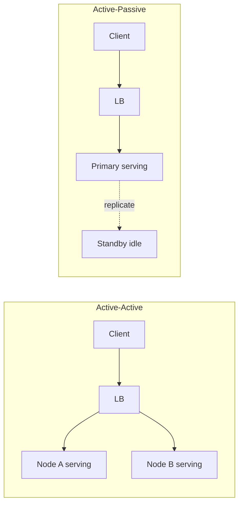
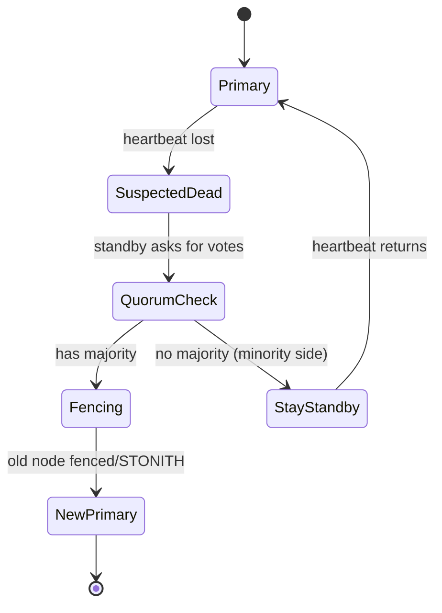
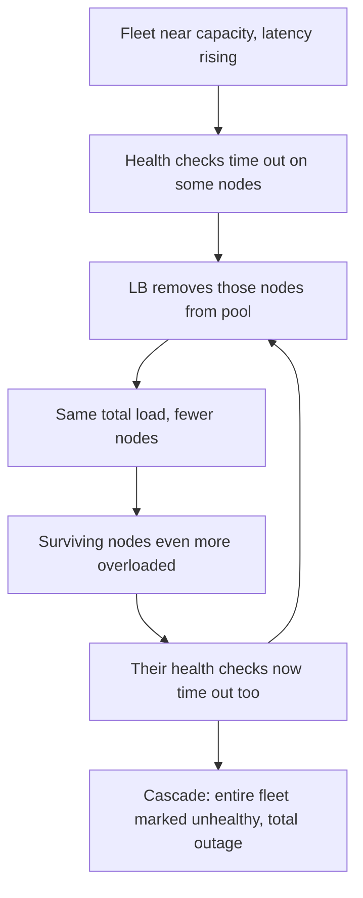
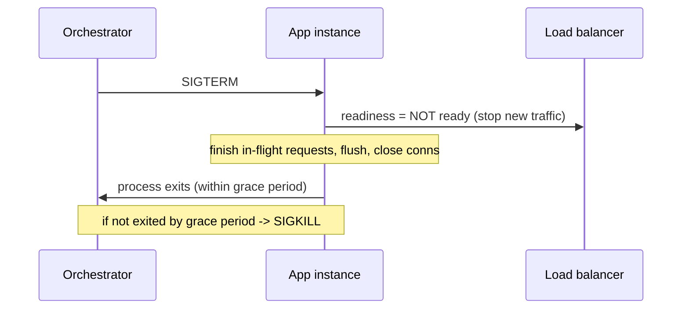

# Redundancy, Failover & Health Checks

Redundancy, failover, and health checks are the three legs of **fault tolerance**: you
provision *more than one* of everything critical (redundancy), you *detect* when a component
is unhealthy and route around it (health checks + failure detection), and you *promote* a
survivor to take over the failed component's role (failover). Get the interplay right and a
single dead node is a non-event; get it wrong and the failover machinery itself becomes the
outage — a split-brain, a health-check death spiral, or a cascading failure triggered by a
"deep" health check.

This topic owns the **operational patterns**: eliminating single points of failure (SPOFs),
standby models and their cost/RTO trade-offs, safe failover (quorum/fencing to avoid
split-brain), and the correct design of liveness/readiness and shallow/deep health checks.
For **Kubernetes probe configuration** see `kubernetes` (probes); for the **theoretical
failure trade-offs, CAP, and multi-region DR architecture** see `system-design`; for
**RPO/RTO tiers and DR strategies** see `reliability-ops/disaster-recovery-rpo-rto-strategies`;
for **retries/timeouts** that ride on top of failover see
`reliability-ops/retries-timeouts-and-backoff`.

> [!KEY-TAKEAWAY]
> Redundancy only helps if failover is **automatic, fast, and safe**. The three failure
> modes that turn "highly available" designs into outages are: (1) **correlated failure** —
> your "redundant" replicas share a failure domain (same rack/AZ/power/dependency) and die
> together; (2) **split-brain** — automatic failover promotes a second primary while the
> first is still alive, corrupting data — prevented by **quorum** and **fencing/STONITH**;
> (3) **health-check death spiral** — an over-eager or *deep* health check marks healthy
> nodes as failed under load and removes capacity, accelerating the collapse.

---

## Single points of failure (SPOF)

A **single point of failure** is any component whose failure takes down the whole system
because there is no redundant path around it. Eliminating SPOFs is the first-principles goal
of high-availability design: for every critical component ask "what happens if exactly this
one thing dies?" and ensure the answer is "traffic continues on a redundant peer."

Classic hidden SPOFs interviewers probe for:

- **The load balancer itself** (redundant app servers behind one LB) — needs a redundant LB
  pair or anycast/DNS-level failover.
- **A single database primary** — needs replicas + failover, or the writer is a SPOF.
- **Shared state**: one Redis, one config server, one message broker, one NAT gateway.
- **The control/coordination plane**: DNS, service discovery, secrets manager, a single
  Kubernetes API server.
- **Correlated dependencies**: all replicas in one AZ, on one power feed, one network switch,
  or depending on one downstream service (a *dependency* SPOF).
- **People/process**: one engineer who knows how to fail over, one manual runbook step.

The **availability math** shows why redundancy helps. For components **in series** (all must
work), availabilities multiply:

```
A_series = A1 × A2 × ... × An
```

Two 99.9% components in series → 0.999 × 0.999 ≈ **99.8%** (worse than either alone). For
**redundant** (parallel) components where any one suffices, you multiply the *failure*
probabilities:

```
A_parallel = 1 − (1 − A1)(1 − A2) ... (1 − An)
```

Two 99% nodes in parallel → 1 − (0.01)(0.01) = **99.99%**. Redundancy converts a component's
unavailability *q* into *q²* (roughly) — the classic reason two cheap nodes beat one gold-plated
one. **Caveat:** this assumes *independent* failures. If both replicas share a failure domain,
the real correlated-failure probability dominates and the q² math is a lie.

> [!WARNING]
> "We have three replicas" means nothing if all three are in the same AZ, on the same rack,
> or all call the same downstream dependency. Redundancy is only as good as the
> **independence** of the failure domains. Always ask: *what is the shared fate?*

---

## Redundancy: N, N+1, N+2, 2N

Redundancy sizing describes how much spare capacity you provision beyond the minimum needed
to serve peak load. Let **N** = the number of units required to carry full load.

| Model | Meaning | Survives | Cost overhead | Typical use |
|---|---|---|---|---|
| **N** | Exactly enough, no spare | 0 failures | 0% | Non-critical / dev |
| **N+1** | One spare beyond need | 1 concurrent failure | ~1/N extra | Most production services |
| **N+2** | Two spares | 2 concurrent failures (or 1 failure *during* maintenance) | ~2/N extra | Critical infra, power/cooling |
| **2N** | Full duplicate set | Loss of an entire set | 100% | Data centers, active-active regions |
| **2N+1** | Duplicate set plus one | A set failure + one more | >100% | Highest-tier facilities |

**N+1** is the workhorse: it tolerates one unit failing *and* lets you take one unit down for
patching without dropping below N. A subtle interview point: with N+1 you must be able to
survive a failure **while** a unit is already out for maintenance — which is why highly
critical systems go **N+2** (so a failure during a maintenance window still leaves N running).

Redundancy must span **failure domains** at the right granularity, cheapest/tightest first:

- **Host / process** — multiple instances (restart on crash).
- **Rack** — spread across racks (a rack shares a switch + power strip).
- **Availability Zone (AZ)** — independent power, cooling, network within a region; the
  standard blast-radius boundary in cloud. Spread replicas across ≥2–3 AZs.
- **Region** — geographically distinct; survives a whole-region outage but adds latency and
  data-replication complexity (see `system-design` for multi-region and
  `reliability-ops/disaster-recovery-rpo-rto-strategies`).

The rule: **place redundant copies in different failure domains** so no single domain event
takes out a quorum.

---

## Active-active vs active-passive (standby models)

The two fundamental redundancy topologies:

- **Active-active**: all replicas serve traffic simultaneously; load is shared. A failure
  just removes one contributor and the survivors absorb its share. Failover is near-instant
  (it's just load rebalancing), but you must run with enough headroom that the survivors can
  take the extra load, and you need conflict handling for writes (multi-primary databases,
  CRDTs, or partitioned ownership).
- **Active-passive (standby)**: one active (primary) serves; one or more standbys wait and
  take over on failure. Simpler consistency (single writer) but wastes the idle capacity and
  failover takes time to detect + promote.

Standbys come in three "temperatures", trading **cost** against **failover time (RTO)**:

| Standby | State | Failover time | Cost | Notes |
|---|---|---|---|---|
| **Hot** | Running, data continuously replicated, ready to serve instantly | Seconds | High (near-2N) | Often synchronous replication; smallest data loss |
| **Warm** | Running but scaled-down / not serving; data replicated (may lag) | Seconds→minutes | Medium | Scale up on promotion |
| **Cold** | Not running; must be provisioned/restored from backup | Minutes→hours | Low | Cheapest; largest RPO/RTO |

This is the same spectrum as DR strategies (backup-restore ≈ cold, pilot-light ≈ warm-ish,
warm-standby ≈ warm, multi-site active-active ≈ hot) — see
`reliability-ops/disaster-recovery-rpo-rto-strategies` for the RPO/RTO numbers.



> [!TIP]
> Active-active's hidden trap is **capacity**: if two nodes each run at 60% and one dies, the
> survivor needs 120% — it can't. For N-node active-active surviving one failure, the (N−1)
> survivors must absorb all the load, so keep each node under **`(N−1)/N`** utilization
> (2 nodes → 50%, 3 → 67%, 4 → 75%). To survive `k` simultaneous failures, keep each node
> under `(N−k)/N`.

---

## Failover: automatic vs manual, and failback

**Failover** is the act of promoting a standby (or shifting traffic to survivors) when the
active component fails. **Failback** is the (optional) return to the original once it recovers.

- **Automatic failover**: a detector (health check, heartbeat loss, quorum vote) triggers
  promotion with no human. Pros: fast RTO (seconds). Cons: risk of *false positives* (a
  transient network blip triggers an unnecessary, disruptive failover) and *split-brain* if
  the "failed" primary is actually alive. Requires fencing + quorum to be safe.
- **Manual failover**: a human confirms the failure and executes (or approves) the promotion.
  Pros: no false-positive flapping, human judgment. Cons: slow RTO (minutes, gated by paging
  + human response), and the runbook step itself can be a SPOF at 3 a.m.

The judgment call: **automate failover for well-understood, frequent, low-blast-radius
failures** (a stateless app instance); **keep a human in the loop for high-blast-radius,
data-bearing, or ambiguous failures** (promoting a database primary across regions) where a
wrong automatic decision can cause data loss. Many mature systems use *automatic detection +
one-click human confirmation*.

**Failback caution:** returning to the original primary is a *second* failover event with its
own risk. Don't fail back automatically the instant the old node reappears — it may still be
partially broken, its data may be stale, and an auto-failback can flap. Prefer manual,
verified failback after confirming the recovered node is fully caught up.

> [!WARNING]
> The most dangerous failovers are **flapping** ones. If detection is too twitchy, a brief
> latency spike triggers failover, the promotion causes a load spike, that trips the health
> check on the new primary, and it fails back — oscillating. Use hysteresis: require *N
> consecutive* failed checks to fail over, dampen with a cooldown, and never auto-failback.

---

## Split-brain, quorum, and fencing/STONITH

**Split-brain** is the catastrophic failure mode of automatic failover: a network partition
makes the standby *believe* the primary is dead, so it promotes itself — but the original
primary is still alive and accepting writes. Now **two primaries** accept conflicting writes
to the same data, causing divergence and corruption that is extremely hard to reconcile.

Root cause: you **cannot distinguish** "the primary is dead" from "I can't reach the primary"
(a partition) using timeouts alone. The two look identical to a detector.

Three mechanisms prevent split-brain, usually combined:

1. **Quorum (majority voting).** Only a partition holding a **strict majority** (`⌊n/2⌋ + 1`)
   of nodes may elect a leader / accept writes. The minority side refuses to act, so at most
   one side is ever active. This is why clusters use an **odd number** of nodes (3, 5, 7): an
   even count can split 2–2 with no majority. Quorum tolerates `⌊(n−1)/2⌋` failures — 3 nodes
   tolerate 1, 5 tolerate 2. (Consensus protocols Raft/Paxos are owned by `system-design`;
   here it's the anti-split-brain tool.)
2. **Fencing.** Before a standby takes over a resource, the old primary is *forcibly cut off*
   so it cannot keep writing — e.g. revoking its access to shared storage, blocking its
   network path, or **STONITH** ("Shoot The Other Node In The Head"): the takeover node
   power-cycles/kills the old node (via IPMI/power controller) *before* promoting itself.
   Fencing guarantees the old primary is truly gone, not just unreachable.
3. **A tie-breaker / witness.** In a 2-node setup add a lightweight third **witness** (or a
   shared "quorum disk") so a partition always has a majority side. Prevents the 1–1 split.



> [!INTERVIEW]
> "How do you prevent split-brain in automatic failover?" The staff-level answer names all
> three: **quorum** so only a majority partition can promote, **fencing/STONITH** so the old
> primary is physically prevented from writing before the new one starts, and an **odd node
> count / witness** so partitions always have a decisive majority. Timeouts alone can never
> distinguish "dead" from "unreachable."

---

## Liveness vs readiness health checks

Health checks answer two *different* questions, and conflating them is a common bug (see
`kubernetes` for probe syntax; this is the reliability semantics):

- **Liveness** = "Is this process broken beyond recovery? **Restart me if so.**" A failed
  liveness check triggers a **restart/replace** of the instance. Use it for deadlocks,
  unrecoverable state, wedged event loops. It must check *only* the process itself.
- **Readiness** = "Am I ready to serve traffic **right now**? If not, **stop sending me
  requests** (but don't kill me)." A failed readiness check **removes the instance from the
  load-balancer pool** without restarting it. Use it during startup (warming caches, JIT,
  loading models), during graceful shutdown, or when a *local* dependency is briefly
  unavailable and will recover.

| | Liveness | Readiness |
|---|---|---|
| Question | Is the process dead? | Can I serve traffic now? |
| Action on failure | **Restart** the instance | **Remove from LB pool** (keep running) |
| Failure during startup | ❌ crash-loop if too eager | ✅ correct — not ready yet |
| Should check dependencies? | **No** (restart won't fix a downstream) | Cautiously (see deep-check anti-pattern) |

The classic bug: making the **liveness** probe check a downstream dependency. When that
dependency has a blip, liveness fails, Kubernetes/orchestrator *restarts* the pod — but the
restart doesn't fix the downstream, so every pod crash-loops and you lose the whole service
to a problem that was only a minor dependency hiccup. **Liveness must never depend on
anything but the process itself.**

> [!TIP]
> Rule of thumb: **liveness = only local, cheap, "am I wedged" checks**; **readiness = "should
> I get traffic"** and may consider *local* resources. Startup latency belongs to a separate
> **startup probe** (Kubernetes) so a slow boot doesn't trip liveness. When in doubt, prefer
> readiness over liveness — pulling from the pool is reversible, restarting is not.

---

## Shallow vs deep health checks (the deep-check anti-pattern)

A **shallow** health check verifies only that the local process responds (e.g. `/healthz`
returns 200, the HTTP server accepts a connection, an in-process flag is green). A **deep**
health check additionally probes the instance's **dependencies** — database, cache,
downstream services — and reports unhealthy if any are unreachable.

Deep checks *sound* better ("report unhealthy if you can't actually do your job") but carry a
notorious **cascading-failure anti-pattern**:

> If every instance runs a **deep** health check against a **shared** dependency, then a brief
> blip in that shared dependency makes **every** instance report unhealthy **simultaneously**.
> The load balancer then removes **all** of them, and a minor dependency hiccup becomes a
> **total, correlated outage** — even though the instances themselves were fine and could have
> served cached/degraded responses.

This is worse than doing nothing: without the deep check, a transient DB blip would recover on
its own; *with* it, the LB tears down the entire fleet in seconds.

Guidance (from AWS/Google SRE practice):

- Keep the **load-balancer** health check **shallow** (liveness-style) so a shared-dependency
  blip can't empty the entire pool at once.
- If you use deep checks, do them **out of band** (a separate monitor/alarm that a human or a
  slow controller reacts to), **not** wired directly to the LB's remove-from-pool decision.
- Prefer **fail-open / degraded** behavior: if a dependency is down, keep serving what you can
  (see `reliability-ops/graceful-degradation-and-fallbacks`) rather than declaring yourself
  dead.
- Use **health-check dependency isolation**: don't let a *non-critical* dependency's health
  affect your served-traffic health at all.

---

## Health-check-driven LB removal and the death spiral

Load balancers continuously health-check their backends and **remove** any that fail,
routing only to healthy ones. This is the core mechanism that makes redundancy *automatic* —
but it has a dangerous positive-feedback loop under load: the **health-check death spiral**
(a.k.a. health-check-induced cascading failure).

The spiral:



Under high load, response times rise; the health check (which shares the same overloaded
threads/CPU) starts timing out; the LB removes those nodes; the *same* load now hits *fewer*
nodes, pushing them over the edge; their checks fail; and the fleet collapses to zero — even
though every node was actually still (barely) serving real traffic.

Mitigations:

- **Fail-open at the LB**: if *too many* backends (e.g. >X%) simultaneously report unhealthy,
  the LB should **stop removing them and route to all** — assume the health check, not the
  fleet, is wrong. (AWS ELB does this; it's a key defense.)
- Give health checks a **separate, reserved resource path** (dedicated thread/connection) and
  a **generous timeout** so a busy-but-healthy node isn't misjudged as dead.
- **Prioritize** health-check requests, or shed *real* load before health checks fail (see
  `reliability-ops/load-shedding-and-backpressure`).
- Require **multiple consecutive failures** before removal (hysteresis) and cap the removal
  rate so you can't drop the whole pool at once.

> [!WARNING]
> Aggressive health checking is a leading cause of **correlated, self-inflicted** outages. The
> counterintuitive lesson from large-scale operators: when nearly everything looks unhealthy
> at once, **trust the fleet over the health check** and fail open. See
> `reliability-ops/cascading-failures-and-antipatterns`.

---

## Heartbeats and failure detection

Failure detection is how one node concludes another has failed. The universal building block
is the **heartbeat**: a node periodically sends "I'm alive" pings; if none arrives within a
timeout, it's suspected dead. Two families:

- **Fixed-timeout detection**: declare a node dead after `T` ms of silence. Simple, but forces
  a hard **trade-off**: a *short* timeout gives fast detection but many **false positives**
  (a GC pause or brief network jitter looks like death, triggering needless failover); a
  *long* timeout is robust but **slow to detect** real failures (longer outage). You can't win
  both with a static threshold.
- **Phi-accrual (φ) failure detection** (Cassandra, Akka): instead of a boolean dead/alive,
  it outputs a **suspicion level φ** computed from the *statistical distribution* of recent
  heartbeat inter-arrival times. φ rises as silence exceeds the historically-normal gap. The
  app picks a threshold (e.g. φ=8) meaning "the probability I'm wrong about this being dead is
  ~10⁻⁸." Its value: it **adapts** to actual network conditions — a normally-jittery link
  gets more slack automatically, reducing false positives without hard-coding a timeout.

Key tunables: **heartbeat interval** (how often), **detection timeout / φ threshold** (how
patient), and whether detection is **direct** (each watches each) or via **gossip/SWIM** (nodes
share suspicion, scales to large clusters). Failure detection feeds the *inputs* to failover —
which is why a too-sensitive detector produces flapping (see the failover section).

> [!KEY-TAKEAWAY]
> Every failure detector trades **detection speed** against **false-positive rate** — you
> cannot maximize both. Fixed timeouts pick one point on that curve; **phi-accrual makes the
> point adaptive** to observed latency, which is why large distributed systems prefer it.

---

## Graceful shutdown and connection draining

When an instance is intentionally removed (deploy, scale-in, node drain), killing it abruptly
drops **in-flight requests** and can corrupt state. **Graceful shutdown** lets it finish work
and leave the pool cleanly. The canonical sequence on Linux/Kubernetes:

1. The orchestrator sends **`SIGTERM`** (a polite "please stop") — *not* `SIGKILL`.
2. The app's SIGTERM handler flips **readiness to failing** so the LB/service stops sending
   *new* requests (this is why readiness, not liveness, governs draining).
3. **Drain**: stop accepting new connections but **let in-flight requests complete** (bounded
   by a drain deadline). Finish or checkpoint background work, flush buffers, close DB
   connections, deregister from service discovery.
4. Exit cleanly. If the app hasn't exited by the **grace period** (Kubernetes default
   `terminationGracePeriodSeconds` = **30s**), the orchestrator sends **`SIGKILL`** and forces
   it down — losing whatever was still in flight.



Pitfalls interviewers look for:

- **Race between SIGTERM and LB de-registration.** The LB may still route to the pod for a
  short window after SIGTERM (its health-check cache is stale). Best practice: on SIGTERM,
  fail readiness and **sleep briefly** (a `preStop` hook) *before* closing the listener, so
  the LB observes "unready" and drains you before you stop accepting connections. Otherwise
  clients get connection-refused errors during every deploy.
- **Ignoring SIGTERM entirely** (common in shell-wrapped or PID-1 apps that don't forward
  signals) — the app gets `SIGKILL`ed after the grace period every time, dropping requests on
  each deploy.
- **Grace period shorter than the longest request** — long requests get killed. Size the grace
  period to your p99 request duration (and drain deadline).

> [!TIP]
> The single highest-value graceful-shutdown practice: **on SIGTERM, fail readiness first and
> pause before closing the socket.** This closes the LB-drain race and turns rolling deploys
> from a source of 5xx spikes into a non-event.

---

## Gray failure and differential observability

The health-check patterns above assume failures are **fail-stop**: a component is either up or
down, and a check can tell which. Real production failures are usually **gray** — a component is
*partially* degraded (elevated latency, 1–5% packet loss, intermittent timeouts, a slow disk,
one bad NIC) while its **own health check still reports healthy**. The process is "up," answers
`/healthz` in a millisecond, yet clients are getting errors and timeouts. This is the single
most common senior-level "why didn't the health check catch it?" scenario.

The concept (Huang et al., "Gray Failure: The Achilles' Heel of Cloud-Scale Systems", MSR;
AWS Well-Architected) is **differential observability** — three observers disagree:

- **The system itself** (self-health-check): "I'm healthy." It only tests the cheap local path.
- **The control plane / monitoring** (aggregate metrics): "Fleet averages look fine." The
  degraded node's pain is diluted across the fleet or hidden below alarm thresholds.
- **The clients**: "I'm getting errors and p99 timeouts." They experience the real path,
  including the slow dependency, the lossy link, the one bad instance.

Gray failure is precisely the *gap* between these views. A self-report can never catch it,
because the failing component's own perspective is the one that says "fine." The operational
rules:

- **Trust client-side signals over server self-report.** Instrument success rate and latency
  *as the caller sees them* (client-side SLIs, canaries that exercise the full path), and alarm
  on those, not just on the server's `/healthz`.
- **Evacuate, don't diagnose.** When one fault domain (an AZ, a cell) shows client-observed
  degradation, shift traffic *away from it* first and root-cause afterward. A gray-failing AZ
  can take longer to diagnose than to evacuate — and evacuation is reversible.
- **Detect asymmetry.** Compare each node/AZ against its peers (outlier detection); a node that
  is 10× slower than its siblings is gray-failing even if it's above zero.

> [!WARNING]
> "The dashboards were green but customers were down" is the signature of gray failure. Any
> monitoring built *only* on component self-reports is blind to it. This is why AWS built
> **zonal shift** (evacuate an AZ with one action) rather than relying on per-instance health
> checks to catch a degraded zone.

---

## Fencing tokens vs STONITH

STONITH fences at the **node** level (kill the box). **Fencing tokens** fence at the
**resource** level (make the shared resource reject stale writers), and they defend against a
failure mode STONITH and leases alone cannot: the **paused-process-wakes-up** problem.

The canonical story (Kleppmann, "How to do distributed locking"): a client acquires a lease on
a lock, then suffers a **long GC pause** (or is descheduled, or its VM is paused for live
migration) that lasts *longer than the lease TTL*. The lock service, seeing the lease expire,
grants the lock to a second client. Then the first client wakes up — still believing it holds
the lock — and issues a write. Two clients now "hold" the lock; the write corrupts data. **A
lease timeout is just a guess** that the holder is dead; a paused process violates that guess.

The fix is a **fencing token**: the lock service issues a **strictly monotonically increasing**
number with every lock grant. The client must attach its token to every write. The **storage /
resource server** remembers the highest token it has seen and **rejects any write carrying a
lower token**. When the paused client wakes up and tries to write with its old (now smaller)
token, the resource rejects it — even though the client still "thinks" it holds the lock. The
resource, not the lock, is the final arbiter.

```
Client 1 gets lock, token = 33  → GC pause (lease expires) ...
Client 2 gets lock, token = 34  → writes with token 34 (accepted, 34 ≥ max)
Client 1 wakes, writes token 33 → REJECTED (33 < 34 already seen)
```

- **STONITH / node fencing**: prevents a *node* from acting by killing it. Good for HA pairs
  and shared-storage clusters; requires out-of-band power/IPMI control.
- **Fencing token / resource fencing**: prevents a stale *write* from landing, by having the
  downstream reject old tokens. Works even when you can't kill the sender.
- **Redlock's flaw:** Redis's Redlock algorithm provides mutual exclusion but issues **no
  fencing token**, so it cannot defend against the GC-pause/clock-skew case — Kleppmann's
  central critique. Correctness that depends on timing assumptions is not safe.

> [!INTERVIEW]
> "A distributed lock protected the write, but the data still got corrupted. How?" The answer
> is a GC pause (or VM migration) outlasting the lease: the lock service handed the lock to a
> second holder, then the first woke up and wrote. The lock alone is insufficient — you need a
> **monotonic fencing token** that the storage layer enforces so stale writers are rejected.

---

## Static stability

**Static stability** (AWS Builders' Library; Well-Architected Reliability pillar) is the
property that a system **keeps working during a failure without having to make any changes** —
no scaling up, no launching instances, no calls to the control plane, no config edits.
Everything needed to survive the failure is *already provisioned and running* before it happens.

Why it matters: **the control plane is often impaired during the exact event you're trying to
survive**, and it's usually less reliable than the data plane. If your AZ-failure plan is "when
an AZ dies, auto-scale the survivors to cover the load," you're depending on the scaling control
plane (launch APIs, capacity availability, warm-up time) at the worst possible moment — during
a large correlated event when everyone else is scaling too. That dependency can turn a survivable
AZ loss into a full outage.

Statically stable design ties directly to the redundancy-headroom math (the `(N−k)/N` rule):

- **Pre-provision the survivors.** For a 3-AZ deployment that must survive losing one AZ,
  run each AZ at ≤ **2/3** (~67%) utilization so the remaining two absorb 100% *with capacity
  they already have* — no scaling required.
- The cost is **idle capacity in steady state** (you're paying for headroom you don't use until
  a failure). That's the deliberate trade: pay for static stability instead of betting on the
  control plane mid-incident.
- Applies beyond compute: pre-create the failover DNS records, pre-warm caches, pre-establish
  connections, so failover is a *data-plane* action, not a control-plane provisioning action.

> [!WARNING]
> "Our failover plan scales up the surviving AZs when one dies" is a classic staff-interview
> trap. Scaling depends on the control plane, which is frequently degraded during the failure
> and slow when capacity is contended. **Pre-provision for the failed state; don't rely on
> reacting to it.**

---

## Cell-based architecture and shuffle sharding

AZ/region redundancy limits the blast radius of *infrastructure* failures. It does nothing for
**poison-pill / logical** failures — a bad request, a corrupt item, a customer whose workload
triggers a bug — which replicate to *every* redundant copy and take down the whole fleet.
**Cell-based architecture** and **shuffle sharding** (AWS Builders' Library, "Workload isolation
using shuffle sharding") limit *that* blast radius.

**Cell-based architecture:** partition the service into independent **cells**, each a
fully-isolated, complete stack (its own compute, storage, queues) serving a *subset* of
customers/partitions. A cell failure — including a poison-pill bug — affects only that cell's
customers. A thin routing layer maps each customer to a cell. Blast radius = 1 cell = `1/(#cells)`
of customers instead of 100%. Cells should be size-capped and tested at max size (so you never
discover a scaling cliff during an incident).

**Shuffle sharding** limits blast radius *within* a shared fleet without full cells. Instead of
assigning each customer to one node (or one shard of contiguous nodes), assign each customer a
**random combination** of nodes. A poison-pill request from customer A only hits A's specific
combination; customer B, with a *different* combination, is almost entirely unaffected because
their shards barely overlap.

The combinatorics are the point:

- 8 nodes, shard size 2 → `C(8,2) = 28` possible shards. Two customers colliding is unlikely.
- The canonical figure: **100 nodes, shard size 5 → `C(100,5) ≈ 75 million` combinations.** The
  probability that two customers land on the *exact same* 5 nodes is ~1 in 75 million, and even
  a partial overlap that would let one customer's poison pill fully take out another is
  vanishingly rare. With request-level retries hedging across the shard, one bad customer can
  degrade at most a small fraction of others.

```
overlap of 2 customers' shards ≈ how much collateral damage a poison pill does
100 nodes / shard 5 → ~75M combos → any two customers share ≤ a node or two → near-total isolation
```

> [!INTERVIEW]
> "How do you keep one bad customer or one poison-pill request from taking down everyone?" Name
> **cell-based architecture** (isolated stacks, blast radius = one cell) and **shuffle sharding**
> (random per-customer node combinations; 100 nodes / shard 5 ≈ 75M combinations, so overlap
> between any two customers is minuscule). AZ redundancy alone doesn't help here — the bad input
> replicates to every AZ. (Consensus/partitioning internals are owned by `system-design`; here
> it's the operational blast-radius practice.)

---

## SWIM gossip-based failure detection

All-to-all heartbeating (every node pings every other) costs `O(n²)` messages and collapses at
scale. **SWIM** (Das, Gupta, Motwani — "Scalable Weakly-consistent Infection-style process group
Membership") is how large clusters (Consul, Serf, HashiCorp memberlist, and similar systems)
detect failures at `O(1)` probes/node. Two ideas make it work:

1. **Separate detection from dissemination.** SWIM's *failure detector* only decides "is node X
   alive?"; a separate gossip (infection-style) layer *spreads* membership changes. Older systems
   coupled these (heartbeat also disseminates), which is what caused the `O(n²)` blowup.

2. **Randomized direct + indirect probing.** Each period, a node picks one random peer and sends
   a **direct ping**. If no ack arrives, it doesn't immediately declare death (a single dropped
   packet or one bad network path would be a false positive). Instead it asks **k random helper
   nodes** to each send an **indirect ping-req** to the target on its behalf. Only if *all* paths
   fail — direct and all `k` indirect — does it move the target to **suspect**. This guards
   against a single bad link causing false positives.

State machine and refutation:

- **Alive → Suspect → Confirm (dead).** A node isn't ejected instantly; it's *suspected* first,
  and the suspicion is gossiped. This gives the target a chance to **refute**.
- **Incarnation number.** Each node carries a monotonically increasing incarnation counter. If a
  node hears itself gossiped as "suspect," it re-broadcasts "alive" with a **higher incarnation
  number**, which overrides the stale suspicion everywhere. This lets a wrongly-suspected node
  clear its name and prevents flapping ejections from transient blips.

The result: constant per-node message load regardless of cluster size, bounded and predictable
detection time, and resilience to single-path false positives — the "how does failure detection
scale to 10,000 nodes?" answer. (Phi-accrual, above, tunes *when* to suspect on one link; SWIM
tackles *how to scale* detection across a whole membership.)

---

## DNS-based failover and TTL traps

DNS is a common failover mechanism (point a name at a healthy endpoint; on failure, rewrite the
record) — and a common **hidden SPOF and a slow, unreliable failover path**. The trap is that
**DNS failover latency ≈ record TTL + how badly clients and resolvers honor it**, and in practice
they honor it badly.

- **TTL is a hint, not a contract.** You set a 60s TTL expecting failover in ~1 minute, but ISP
  resolvers, corporate resolvers, and client-side/JVM DNS caches routinely **cache longer than
  the TTL** (some JVMs historically cached forever). Some clients pin a resolved IP for the life
  of a connection pool. So real failover can take many minutes to hours for a long tail of
  clients.
- **Negative caching** delays *recovery* too: a resolver that cached "no answer" or the old
  answer keeps serving it after you've fixed things.
- **Low TTLs cost you** — more DNS queries, more resolver load — and still don't guarantee fast
  propagation because the slow resolvers are the ones ignoring your TTL.
- Route 53 **health checks** can automate record-level failover (drop the unhealthy endpoint from
  the answer), but the propagation delay above still applies to when clients *see* it.

Faster/more-reliable alternatives that don't depend on TTL:

- **Load-balancer-level failover** — the LB VIP stays constant; the LB reroutes to healthy
  backends in seconds. Clients never re-resolve.
- **Anycast** — the same IP is announced from many locations; BGP reconverges to a healthy site
  without any DNS change or client cache dependency.
- **Zonal shift / traffic management** (below) for AZ-level evacuation.

> [!INTERVIEW]
> "You need to fail traffic away from a bad AZ in 60 seconds — DNS or something else?" DNS is the
> wrong tool: TTL + resolver/client caching make it too slow and unreliable to hit a 60s target.
> Use **LB-level rerouting, anycast, or zonal shift** — mechanisms that don't wait on DNS caches
> to expire. DNS failover is for coarse, minutes-to-hours granularity, not tight RTOs.

---

## Zonal shift and evacuating an impaired AZ

**Zonal shift** (AWS Route 53 Application Recovery Controller) is the concrete modern mechanism
for acting on **gray failure** without root-causing it: a **single action** that pulls traffic
**away from one impaired AZ** and onto the healthy AZs, at the load-balancer level.

- `start-zonal-shift --away-from <az>` tells the LB to stop routing to the targets in that AZ.
  Traffic shifts to the other AZs in seconds — *no scaling, no DNS change, no code deploy*.
- **Zonal autoshift** lets AWS trigger the shift automatically based on its internal telemetry
  when it detects an AZ is impaired, without waiting for you to notice.
- It only works if you're **statically stable** across AZs: the surviving AZs must already have
  the capacity to absorb the evacuated AZ's load (the `(N−k)/N` headroom rule). Zonal shift is
  the *action*; static stability is the *precondition* that makes the action safe.

This is the operational counter to "why didn't the per-instance health check catch the gray
failure?": you don't try to health-check your way to identifying the one bad zone — you
**evacuate the whole zone** on the first sign of client-observed degradation, then investigate
at leisure. Evacuation is fast and reversible; diagnosis is slow.

---

## Load balancer health-check defaults and the detection-time budget

Interviewers probe whether you know the *concrete knobs* behind the death-spiral and hysteresis
concepts above. The AWS Application Load Balancer **target-group health-check defaults** are the
canonical reference numbers:

| Setting | ALB default | What it controls |
|---|---|---|
| `HealthCheckIntervalSeconds` | **30s** | How often the LB probes each target |
| `HealthCheckTimeoutSeconds` | **5s** | How long one probe waits before counting as a fail |
| `UnhealthyThresholdCount` | **2** | Consecutive fails before target marked unhealthy |
| `HealthyThresholdCount` | **5** | Consecutive passes before an unhealthy target rejoins |
| Success matcher | **200** | HTTP code(s) that count as healthy |
| `deregistration_delay.timeout_seconds` | **300s** | Connection-draining window on deregister |

Two consequences worth stating:

- **Detection time ≈ interval × unhealthy-threshold + timeout.** With defaults, a dead target is
  detected in roughly `30 × 2 + 5 ≈ 65s`. To fail *faster*, lower the interval/threshold; to
  avoid *false* removals of busy-but-alive nodes, raise the timeout and/or unhealthy-threshold so
  a transient stall doesn't evict a healthy node. This is the concrete tuning behind the
  false-positive-vs-detection-latency trade-off. **Tune the threshold above your worst-case GC
  pause / p99 stall** so a slow-but-alive node isn't killed.
- **ALB fails open by design.** The docs state it explicitly: *if all targets fail health checks
  at the same time in all enabled AZs, the load balancer fails open* and routes to all targets.
  This is the death-spiral defense from the earlier section, built into the product — mass
  simultaneous "unhealthy" is treated as "the check is wrong," not "everything died."

**preStop sizing (graceful shutdown, revisited):** the `preStop` sleep should be **≥ LB
health-check-interval × unhealthy-threshold** so the LB observes the target as unready *before*
the process closes its listener. For a 5s-interval × 3-threshold check, sleep ~15–20s. Also
watch the **PID-1 signal-forwarding trap**: if a shell (`sh -c "app"`) is PID 1, it may not
forward SIGTERM to the child, so the app never drains and always gets SIGKILLed — use an init
that forwards signals (`exec`, `tini`, `dumb-init`) instead.

---

## Lease-based leader election and clock skew

Most real systems don't run a fresh Raft/Paxos election on every write; they elect a leader once
and protect it with a **time-bounded lease** (Chubby, ZooKeeper, etcd leases; consensus internals
are owned by `system-design`). A lease is "you are the leader **until time T**, renew before then
or lose it." It's the practical primitive under primary election, and its edges are all about
**time and fencing**:

- **Renewal timing.** The leader must renew *well before* the lease expires (accounting for
  network round-trips), or it risks two nodes both believing they're leader in the gap. Lease
  duration trades failover speed (short lease = fast detection of a dead leader) against renewal
  overhead and sensitivity to blips.
- **Clock skew is the enemy.** If the leader's clock and the lease service's clock disagree, the
  leader may think its lease is still valid after the service has already expired it and elected a
  successor — a two-leader window. Leases should rely on **bounded clock drift** assumptions and,
  ideally, **monotonic clocks** for measuring elapsed time, not wall-clock time (which can jump
  on NTP correction).
- **Lease + fencing token together.** A lease bounds *when* you're leader; a **fencing token**
  (above) makes the *resource* reject a stale ex-leader that overshot its lease due to a GC pause
  or clock skew. Neither alone is sufficient for a data-bearing leader — you want both.

> [!KEY-TAKEAWAY]
> A lease is a *timeout on leadership*, and like every timeout it's a guess that can be wrong
> under GC pauses and clock skew. Pair the lease (bounds normal handoff) with a monotonic
> **fencing token** enforced at the resource (defends against the abnormal wake-up) — belt and
> suspenders for safe single-writer semantics.

---

## Two-node clusters and quorum edge cases

The "odd number of nodes" rule has sharp corners that make great trap questions.

**Why 2-node clusters are dangerous.** Two nodes have **no possible majority** — a partition
splits them 1–1, and neither side holds `⌊2/2⌋+1 = 2` votes. You're forced to pick a poison:

- **Allow either node to act alone** on partition → **split-brain** (both promote, data diverges).
- **Require both to agree** → you **lose availability the moment one node dies** (the survivor
  can't tell "my peer crashed" from "we're partitioned," so it must refuse to act).

So a 2-node cluster gives you *neither* safe failover *nor* high availability. **The minimum safe
voting membership is 3** — which is why you add a lightweight **witness/tiebreaker** to a 2-node
pair (making it effectively 3 votes).

**Quorum edge cases:**

- **Even clusters waste a node.** A 4-node quorum needs 3 to form a majority, so it tolerates only
  **1** failure — the *same* as a 3-node cluster, at higher cost. Going from 3→4 buys nothing;
  you must go to 5 to tolerate 2. Always use odd counts.
- **Put the tiebreaker in a *third* failure domain.** For a 2-AZ deployment, place the witness in
  a **third AZ (or region)** so losing *either* data AZ still leaves a majority (data-AZ + witness).
  A witness co-located with one of the two AZs doesn't help if that AZ is the one that fails.
- **Quorum-for-membership vs quorum-for-writes are different questions.** Majority quorum (who is
  leader / is the cluster live) is about *membership*; the Dynamo-style `W + R > N` rule is about
  *read/write* consistency on replicated data. A system can use both, for different purposes.
  (The `W + R > N` consistency math is owned by `system-design`; state the operational rule here.)

> [!INTERVIEW]
> "2-node or 3-node cluster for a primary — which and why?" **Three.** Two nodes have no majority,
> so a partition forces a choice between split-brain and unavailability — you get neither safety
> nor HA. Three (or a 2-node pair plus a witness in a third failure domain) always leaves a
> decisive majority on one side of any single partition.

---

## Common Interview Follow-ups

- **"You have three DB replicas across two AZs. Where's the risk?"** Two share an AZ — an AZ
  outage kills two of three, and if that's your quorum you lose write availability. Spread
  across three AZs, or the "redundancy" is partly illusory (correlated failure domain).
- **"Automatic or manual failover for the database primary?"** Automatic detection is fine, but
  gate promotion carefully: use quorum + fencing to avoid split-brain; consider human
  confirmation because a wrong auto-promotion across regions can lose committed writes. Never
  auto-failback.
- **"Why not just make the health check check the database?"** That's a deep check on a shared
  dependency — a DB blip marks the whole fleet unhealthy at once and the LB removes everyone,
  turning a minor blip into a total outage. Keep LB checks shallow; monitor the DB out of band.
- **"Your fleet went to zero healthy during a load spike but the boxes were fine — what
  happened?"** Health-check death spiral: overload made checks time out, LB removed nodes,
  concentrating load and collapsing the rest. Fix with fail-open, reserved health-check
  resources, hysteresis, and load shedding.
- **"Why an odd number of nodes in a cluster?"** So a network partition always has a strict
  majority (quorum) on one side; an even count can split evenly with no majority, and nobody
  can safely act. 3 nodes tolerate 1 failure, 5 tolerate 2.
- **"What's STONITH and when do you need it?"** "Shoot The Other Node In The Head" — forcibly
  power off/fence the old primary before promoting a new one, so a still-alive-but-unreachable
  primary can't keep writing (prevents split-brain). Needed whenever two nodes could both
  believe they own a shared resource.
- **"Liveness vs readiness in one sentence?"** Liveness failure ⇒ *restart me*; readiness
  failure ⇒ *stop sending me traffic but leave me running*. Never make liveness depend on a
  downstream.
- **"What does SIGTERM do and why sleep before closing?"** SIGTERM asks the app to shut down
  gracefully; you fail readiness and pause so the LB drains you before you stop accepting
  connections, avoiding connection-refused errors during deploys; SIGKILL follows if you don't
  exit by the grace period (K8s default 30s).
- **"Your health check passes but customers get errors — what's happening?"** Gray failure:
  the component's *self*-report only tests the cheap local path, so it says "healthy" while
  clients hit a degraded dependency/link. Detect with client-side SLIs and outlier comparison
  against peers; act by **evacuating the fault domain** (e.g. zonal shift) rather than trying
  to diagnose the exact bad instance in real time.
- **"A distributed lock protected the write, but data still corrupted — how?"** A GC pause (or
  VM migration) outlasted the lease; the lock service handed the lock to a second holder, then
  the first woke up and wrote. Fix with a **monotonic fencing token** enforced at the storage
  layer, which rejects the stale writer's lower token. (Redlock lacks this.)
- **"Your failover plan scales up the survivors when an AZ dies — what's wrong?"** It depends
  on the control plane (launch APIs, capacity) at the moment it's most likely impaired and
  contended. Design for **static stability**: pre-provision the survivors to `(N−k)/N` headroom
  so no scaling is needed to absorb the failed AZ.
- **"How do you stop one bad customer/request from taking everyone down?"** Cell-based
  architecture (isolated stacks, blast radius = one cell) and **shuffle sharding** (random
  per-customer node combinations — 100 nodes / shard 5 ≈ 75M combinations, so any two customers
  barely overlap). AZ redundancy doesn't help; the bad input replicates everywhere.
- **"2-node vs 3-node cluster — which and why?"** Three. Two nodes have no possible majority,
  so a partition forces a choice between split-brain and losing availability. Add a witness in a
  third failure domain if you only have two data nodes.
- **"Heartbeat every 2s, mark dead after 3 misses, but GC pauses hit 4s — what breaks?"** The
  4s pause looks like death (6s detection budget is close), risking a **false-positive failover**
  during GC. Raise the threshold above worst-case pause, or use phi-accrual/adaptive detection.

## References

- Beyer, Jones, Petoff, Murphy (eds.), *Site Reliability Engineering* (Google, O'Reilly,
  2016) — Ch. 21–22 (handling overload, cascading failures), health checking and load
  balancing.
- Beyer et al., *The Site Reliability Workbook* (Google, O'Reilly, 2018) — canarying,
  load balancing, and managing overload.
- Michael T. Nygard, *Release It!* (2nd ed., Pragmatic Bookshelf, 2018) — stability patterns,
  failing fast, and the dangers of health checks under load.
- AWS Well-Architected Framework — **Reliability Pillar** (fault isolation boundaries,
  redundancy, health checks, automatic vs manual failover).
- AWS Builders' Library — "Implementing health checks" (Colm MacCárthaigh) — shallow vs deep
  checks, fail-open, and health-check death spirals.
- Hayashibara et al., "The φ Accrual Failure Detector" (2004) — adaptive failure detection.
- Das, Gupta, Motwani, "SWIM: Scalable Weakly-consistent Infection-style Process Group
  Membership Protocol" (2002) — ping/ping-req, suspect/confirm, incarnation numbers.
- Huang et al., "Gray Failure: The Achilles' Heel of Cloud-Scale Systems" (Microsoft Research)
  — differential observability, the three-observer model.
- Martin Kleppmann, "How to do distributed locking" (2016) — fencing tokens, the GC-pause/lease
  problem, and the Redlock critique.
- AWS Builders' Library — "Static stability using Availability Zones" (Becker/MacCárthaigh) and
  "Workload isolation using shuffle sharding" (the ~75M-combinations figure).
- AWS documentation — Route 53 Application Recovery Controller **zonal shift / zonal autoshift**;
  Application Load Balancer target-group health-check settings and fail-open behavior; Route 53
  health checks and DNS failover.
- Kubernetes documentation — liveness, readiness, and startup probes; `terminationGracePeriodSeconds`,
  `preStop` hooks (see `kubernetes` topic).
- Cross-references: `reliability-ops/disaster-recovery-rpo-rto-strategies` (RPO/RTO tiers),
  `reliability-ops/cascading-failures-and-antipatterns`,
  `reliability-ops/load-shedding-and-backpressure`, `system-design` (CAP, consensus,
  multi-region), `kubernetes` (probes).
