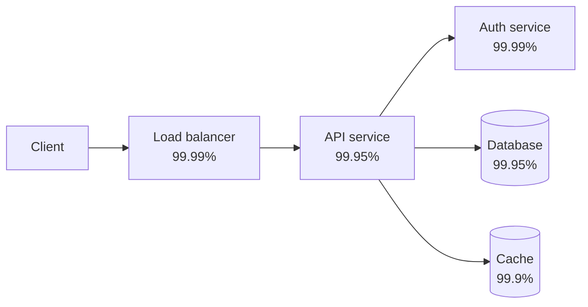
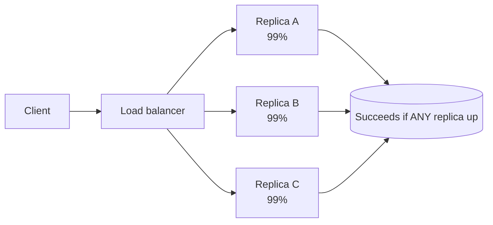
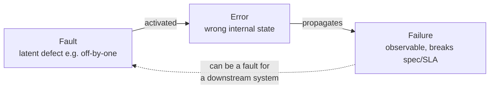

# Reliability Fundamentals & Availability Math

This topic is the vocabulary and the arithmetic that the rest of Reliability
Engineering is built on. If you cannot fluently define availability, recite the
"nines" downtime table, and reason about how availability composes across a chain
of dependencies, every later conversation (SLOs, DR tiers, capacity) rests on sand.

> [!KEY-TAKEAWAY]
> Availability is a *number you compute*, not a vibe. It composes multiplicatively
> down a request path and improves with redundancy as `1-(1-a)^n`. A distributed
> system is only as available as its least-available **hard** dependency, minus the
> tax of every hop in series.

Boundaries: **system-design** owns the theoretical availability/CAP trade-offs; here
we own the operational math you actually use to set targets and budget a request
path. **observability** owns how you *measure* live availability (SLIs) and *alert*
on it — see `observability/*` for measurement mechanics. This topic feeds directly
into `reliability-ops/slos-error-budgets-and-velocity-tradeoff` and
`reliability-ops/disaster-recovery-rpo-rto-strategies`.

## Availability defined: uptime over total time

**Availability** is the fraction of time a system is operational and able to serve
requests correctly:

```
Availability = uptime / (uptime + downtime)
             = uptime / total_time
```

It is usually expressed as a percentage ("the nines") or as a proportion in
`[0, 1]`. There are two ways to measure it, and interviewers care about the
distinction:

- **Time-based availability** — fraction of wall-clock time the system was up.
  Simple, but a service that is "up" while returning errors looks healthy. Also,
  a 1-minute outage at 3 a.m. with zero traffic counts the same as 1 minute at
  peak.
- **Request-based (aggregate) availability** — `successful_requests / total_requests`.
  This is what Google SRE recommends because it weights outages by the traffic
  (and thus user pain) they actually caused. A minute of downtime during peak
  costs more error budget than a minute at 3 a.m.

```
Request-success availability = good_requests / total_requests
```

> [!TIP]
> When someone quotes "four nines," always ask: **measured how, and over what
> window?** 99.99% over a rolling 30-day window is a very different promise from
> 99.99% averaged over a calendar year (a year lets you "bank" quiet periods to
> mask a bad week).

The **window** matters as much as the number. A shorter window (28-day rolling) is
stricter — you cannot amortize a bad day across a full quarter.

## The nines table: availability targets and downtime

The single most-memorized table in SRE. Allowed downtime for a given availability
target (using a 365-day year and the *average* month = year ÷ 12 ≈ 30.44 days;
the week column is year ÷ 52). The bottom rows are the canonical figures to memorize:

| Availability | Nines | Downtime / year | Downtime / month | Downtime / week | Downtime / day |
|---|---|---|---|---|---|
| 90% | one nine | 36.5 days | 73 h | 16.8 h | 2.4 h |
| 99% | two nines | 3.65 days | 7.3 h | 1.68 h | 14.4 min |
| 99.9% | three nines | **8.76 h** | 43.8 min | 10.1 min | 1.44 min |
| 99.95% | — | 4.38 h | 21.9 min | 5.04 min | 43.2 s |
| 99.99% | four nines | **52.6 min** | 4.38 min | 1.01 min | 8.64 s |
| 99.999% | five nines | **5.26 min** | 26.3 s | 6.05 s | 864 ms |

Memorize the three landmark yearly figures: **three-nines ≈ 8.76 h/yr,
four-nines ≈ 52.6 min/yr, five-nines ≈ 5.26 min/yr.** Each extra nine divides the
allowed downtime by 10.

> [!WARNING]
> Five-nines (5.26 min/**year**) is essentially incompatible with humans in the
> loop. If a page takes ~5 min to reach an engineer and MTTR is minutes more,
> a *single* human-handled incident blows the entire annual budget. Five-nines
> demands automated failover and no synchronous human recovery step. Most business
> systems target three or four nines; be skeptical of anyone casually promising
> five.

Cost climbs super-linearly with each nine (redundancy, multi-region, automation,
staffing). The right target is a **business decision**, not a badge — going from
three to four nines might 3–5× your infra and ops cost for a marginal user benefit.

## Reliability vs availability vs durability

These three are routinely conflated. They are distinct properties:

| Property | Question it answers | Formal-ish definition | Example metric |
|---|---|---|---|
| **Availability** | "Is it up *right now* / what fraction of the time?" | Fraction of time the system serves requests correctly | 99.99% (52.6 min/yr down) |
| **Reliability** | "Will it keep working correctly over an interval without failing?" | Probability of failure-free operation over a time interval `t` | MTBF; `R(t) = e^(-t/MTBF)` |
| **Durability** | "Will my stored data survive (not be lost)?" | Probability that stored data is not lost over a period | S3: 99.999999999% (11 nines) durability |

Key mental model:

- **Availability is about time-being-up; reliability is about the *rate/absence of
  failures* over an interval.** A system can be highly available yet unreliable
  (frequent tiny blips that recover fast → high availability, low MTBF) or reliable
  but not highly available (fails rarely, but when it does it stays down for hours →
  high MTBF, low availability because MTTR is huge).
- **Durability ≠ availability.** Amazon S3 advertises **11 nines of durability** but
  only ~**99.99% availability** (S3 Standard SLA). Your objects will almost never be
  *lost*, but the service can briefly be *unreachable*. RAID, replication, and
  erasure coding protect durability; they don't by themselves guarantee availability.

> [!INTERVIEW]
> "S3 gives eleven nines — so it's basically never down, right?" Trap. Eleven nines
> is **durability** (data won't be lost). S3's **availability** target is far lower
> (99.9%–99.99% depending on tier). Getting this distinction right instantly signals
> seniority.

## The time-based metrics: MTBF, MTTF, MTTR, MTTD, MTTA

The "MTT*" family. Precision here separates strong candidates.

| Metric | Name | Meaning | Applies to |
|---|---|---|---|
| **MTBF** | Mean Time Between Failures | Avg time between the start of one failure and the start of the next | *Repairable* systems |
| **MTTF** | Mean Time To Failure | Avg time until a (non-repairable) unit fails | *Non-repairable* units (a disk you replace) |
| **MTTD** | Mean Time To Detect | Avg time from failure occurring to being *detected* (alarm fires) | Incident lifecycle |
| **MTTA** | Mean Time To Acknowledge | Avg time from alert to a human *acknowledging* it | On-call responsiveness |
| **MTTR** | Mean Time To Repair / Restore / Recover / Resolve | Avg time to restore service after a failure | Incident lifecycle |

Relationships:

```
MTBF = MTTF + MTTR          (time-to-fail + time-to-repair for a repairable system)
MTTR spans:  detect (MTTD) → acknowledge (MTTA) → diagnose → fix → verify
```

> [!WARNING]
> "MTTR" is dangerously overloaded — it can mean **R**epair, **R**estore,
> **R**ecovery, or **R**esolve, and they differ (restore service vs. fully fix root
> cause). Always clarify which "R" a metric/SLA means; SLAs usually mean *restore
> service*, not *root-cause fixed*.

Two levers move availability: **increase MTBF** (fail less often — better testing,
redundancy, load shedding) or **reduce MTTR** (recover faster — automation, good
runbooks, fast rollback, observability to shrink MTTD). For high-availability
targets, **reducing MTTR is often cheaper and more effective than chasing higher
MTBF**, because availability is dominated by how long you stay down, not just how
often you fail. Faster detection (MTTD) is the highest-leverage part of MTTR — you
cannot recover from what you haven't noticed (see `observability/*` for
detection/alerting).

## Deriving availability from MTBF and MTTR

Steady-state availability of a repairable component:

```
Availability = MTBF / (MTBF + MTTR)
             = MTTF / (MTTF + MTTR)      (since MTBF = MTTF + MTTR)
```

Worked example: a service fails on average every 1000 hours (MTBF ≈ MTTF = 1000 h)
and takes 1 hour to recover (MTTR = 1 h):

```
A = 1000 / (1000 + 1) = 0.999 ≈ 99.9%  (three nines)
```

Now **cut MTTR to 6 minutes (0.1 h)** with automated failover, same failure rate:

```
A = 1000 / (1000 + 0.1) = 0.9999 ≈ 99.99%  (four nines)
```

A 10× reduction in recovery time bought a whole extra nine **without failing any
less often**. This is why SRE invests so heavily in fast rollback, automated
failover, and detection — MTTR is the cheapest nine to buy.

> [!KEY-TAKEAWAY]
> `A = MTBF / (MTBF + MTTR)`. To add a nine you can either 10× MTBF (hard,
> expensive) or ÷10 MTTR (usually cheaper). Most teams under-invest in MTTR.

## Serial dependencies multiply

If a request must traverse N components **in series** (all must be up for the
request to succeed — a chain of hard dependencies), the availabilities **multiply**:

```
A_serial = A_1 × A_2 × ... × A_n
```

This only ever goes *down*. Five independent components each at 99.9%:

```
A = 0.999^5 = 0.995 ≈ 99.5%   (≈ 43.8 h/yr down — worse than any single component)
```



The chain above (0.9999 × 0.9995 × 0.9999 × 0.9995 × 0.999 ≈ 0.9978 ≈ **99.78%**) is
*less* available than its weakest link (99.9%). **A system is only as available as
its least-available hard dependency — and every additional serial hop makes it
worse.** This is the core argument against sprawling synchronous microservice call
chains and the case for reducing the number of hard dependencies on the critical
path.

> [!WARNING]
> The naive multiplication assumes **independent** failures. Correlated failures
> (shared AZ, shared deploy, shared dependency, a bad config pushed everywhere) break
> the assumption and make reality *worse* than the math. Treat the product as an
> optimistic upper bound.

## Parallel redundancy improves availability

Put N **redundant** instances in parallel where the request succeeds if *at least
one* is up. The system is unavailable only if **all** fail simultaneously:

```
A_parallel = 1 - (1 - a)^n
```

where `a` is each instance's availability. Redundancy attacks the *unavailability*
`(1-a)` and shrinks it by a power of n. Two instances at 99% each:

```
A = 1 - (1 - 0.99)^2 = 1 - 0.0001 = 0.9999 ≈ 99.99%
```

Two mediocre (99%) components in parallel beat one great (99.9%) component. Each
added redundant copy multiplies the *downtime* by the (small) unavailability again —
diminishing returns, but each nine of the component adds ~two nines of the pair.



> [!WARNING]
> Parallel math also assumes **independent** failures. Three replicas in the *same
> availability zone*, behind the *same load balancer*, running the *same buggy
> deploy* are not independent — a single correlated event takes all three down and
> `1-(1-a)^n` badly overstates reality. Real redundancy means spreading across fault
> domains (AZs, regions, cells) and staggering deploys. See
> `reliability-ops/redundancy-failover-and-health-checks`.

Redundancy also costs: N× resources, and the failover mechanism (health checks, LB,
leader election) itself becomes a dependency that can fail.

## The availability budget across a request path

Given a **target** end-to-end availability, you must "budget" it across the
components on the critical path, because serial availabilities multiply. If you want
99.9% end-to-end and the path has 3 hard dependencies in series, each must be far
better than 99.9%:

```
Need:  A_1 × A_2 × A_3 ≥ 0.999
If equal:  a = 0.999^(1/3) ≈ 0.99967  → each dependency must hit ~99.97%
```

So a 99.9% product SLA implies its internal services target roughly **99.97%+**
each. This is why platform/infra teams (databases, auth, service mesh) are held to
*stricter* SLOs than the products built on them — their budget must be split among
many consumers and many serial hops.

Practical budgeting tactics:

- **Reduce hops on the critical path** — every serial hard dependency taxes the
  budget. Move non-essential calls off the synchronous path (async/queue).
- **Convert hard dependencies to soft** — a cache/fallback lets you survive a
  dependency outage, removing it from the multiplication (see next section).
- **Add redundancy to the weakest link** — the least-available hard dependency caps
  the whole path; parallelize it.
- **Give infra a bigger nines budget** than the products that consume it.

## Hard vs soft dependencies

Whether a dependency's availability multiplies into yours depends on whether it is
**hard** or **soft**:

| | Hard dependency | Soft dependency |
|---|---|---|
| Definition | Request **cannot** succeed if it's down | Request can **still** succeed (degraded) if it's down |
| Effect on availability | Multiplies into your availability | Does **not** cap your availability |
| Example | Primary database for a write | Recommendations widget, a warm cache with fallback |
| Failure handling | Failover, retries, redundancy | Fallback, serve-stale, graceful degradation, feature-flag off |

**The number of hard dependencies on the critical path is the single biggest lever
on your achievable availability.** Every hard dependency multiplies in; every one you
demote to soft (via caching, defaults, async, feature toggles, or graceful
degradation) drops out of the product. Google SRE's guidance: a service's
availability target should generally be *higher* than that of any of its hard
dependencies — otherwise it can never meet its own SLO. If you truly need to be more
available than a dependency, that dependency must become soft.

> [!INTERVIEW]
> "Your service targets 99.99% but your database only offers 99.9% — is that
> possible?" Yes, but **only** if the database is not a hard dependency for the SLO'd
> operation: you must be able to serve (from cache, with degraded functionality, or
> via a redundant store) when it's down. Otherwise your ceiling is 99.9%.

See `reliability-ops/graceful-degradation-and-fallbacks` for turning hard
dependencies soft.

## Fault vs error vs failure

The precise failure-terminology chain (from dependability theory — Avižienis et al.).
Interviewers use these words loosely; using them precisely stands out:

- **Fault** — the *root cause*: a defect or flaw in the system (a bug, a bad config,
  a failing disk, a race condition). A fault can be **latent/dormant** — present but
  not yet doing damage.
- **Error** — the *activated* fault producing an **incorrect internal state** (a
  corrupted variable, a wrong cache entry, an exhausted thread pool). The error may
  still be invisible from outside.
- **Failure** — the externally **observable** deviation from correct service: the
  system no longer delivers what it's supposed to (returns wrong results, times out,
  is unreachable). This is what users and SLIs see.



Why it matters operationally:

- **Fault tolerance** = preventing faults/errors from *propagating to failures*
  (redundancy, error handling, isolation) — see circuit breakers, bulkheads.
- **A failure in one system is often a *fault* in the system that depends on it** —
  this is how cascading failures start (see
  `reliability-ops/cascading-failures-and-antipatterns`).
- **Postmortems** target the *fault* (root cause), not just the *failure* (symptom).
  "Fixed by restarting" addresses the failure, not the fault — see
  `reliability-ops/root-cause-analysis-and-troubleshooting`.

> [!TIP]
> One-liner: **a fault is the cause, an error is the wrong state it creates, a
> failure is the visible consequence.** Not every fault becomes an error; not every
> error becomes a failure (a tolerant system catches it first).

## Common Interview Follow-ups

- **"How much downtime does three/four/five nines allow per year?"** — 8.76 h,
  52.6 min, 5.26 min respectively. Each nine ÷10.
- **"S3 has eleven nines — what does that describe?"** — Durability (data not lost),
  *not* availability (~99.99%). Distinct properties.
- **"Your service target is 99.99% but a dependency is 99.9%. Achievable?"** — Only
  if that dependency is *soft* (fallback/cache). If hard, you're capped at 99.9%.
- **"Cheaper to add a nine: fail less or recover faster?"** — Usually reduce MTTR
  (÷10 recovery time) — automation/rollback/detection. `A = MTBF/(MTBF+MTTR)`.
- **"Five services in series at 99.9% each — end-to-end?"** — `0.999^5 ≈ 99.5%`.
  Multiplication; worse than the weakest link.
- **"Two 99% replicas in parallel — availability?"** — `1-(1-0.99)^2 = 99.99%`.
- **"Why does the naive redundancy math overstate reality?"** — It assumes
  independent failures; correlated failures (same AZ/deploy/config) violate that.
- **"Difference between MTTF and MTBF?"** — MTTF for non-repairable units; MTBF for
  repairable systems; `MTBF = MTTF + MTTR`.
- **"Difference between reliability and availability?"** — Reliability = failure-free
  operation over an interval (MTBF); availability = fraction of time up. High MTBF
  with huge MTTR = reliable but not highly available.
- **"How do you budget availability across a call path?"** — Multiply; each internal
  service must exceed the product target (`target^(1/n)`); reduce hops and demote
  hard→soft dependencies.
- **"Difference between a fault, an error, and a failure?"** — Cause → wrong internal
  state → observable break.

## References

- Beyer, Jones, Petoff, Murphy — *Site Reliability Engineering* (O'Reilly / Google),
  esp. "Embracing Risk" (availability, MTBF/MTTR, request-based availability) and
  "Service Level Objectives".
- Beyer et al. — *The Site Reliability Workbook*, "Implementing SLOs".
- Michael T. Nygard — *Release It!* 2nd ed. (stability, dependencies, failure
  propagation).
- AWS Well-Architected Framework — **Reliability Pillar** (availability design goals,
  hard/soft dependencies, dependency availability math).
- Amazon S3 SLA and durability documentation (11 nines durability vs. availability
  tiers).
- Avižienis, Laprie, Randell, Landwehr — "Basic Concepts and Taxonomy of Dependable
  and Secure Computing" (fault/error/failure taxonomy).
- Cross-references: `system-design/*` (CAP and theoretical availability trade-offs),
  `observability/*` (measuring SLIs, detection/MTTD, alerting),
  `reliability-ops/slos-error-budgets-and-velocity-tradeoff`,
  `reliability-ops/disaster-recovery-rpo-rto-strategies`.
