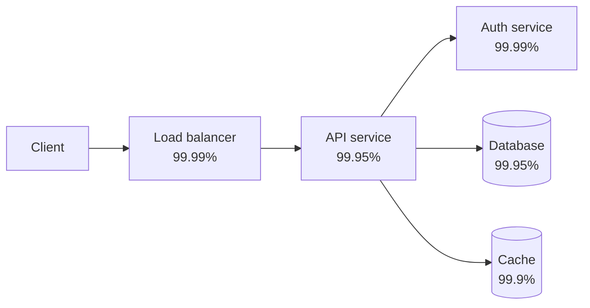
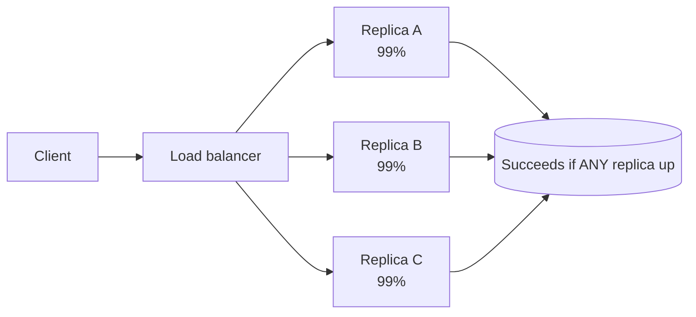
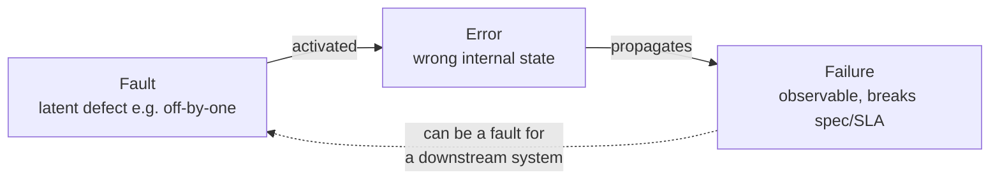
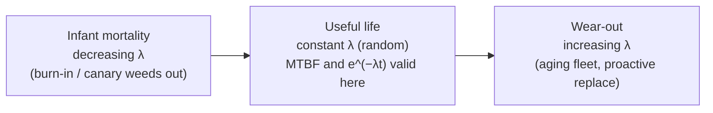

# Reliability Fundamentals & Availability Math

This topic is the vocabulary and the arithmetic that the rest of Reliability
Engineering is built on. If you cannot fluently define availability, recite the
"nines" downtime table, and reason about how availability composes across a chain
of dependencies, every later conversation (SLOs, DR tiers, capacity) rests on sand.

> [!KEY-TAKEAWAY]
> Availability is a *number you compute*, not a vibe. It composes multiplicatively
> down a request path and improves with redundancy as `1-(1-a)^n`. A distributed
> system is only as available as its least-available **hard** dependency, minus the
> tax of every hop in series.

Boundaries: **system-design** owns the theoretical availability/CAP trade-offs; here
we own the operational math you actually use to set targets and budget a request
path. **observability** owns how you *measure* live availability (SLIs) and *alert*
on it — see `observability/*` for measurement mechanics. This topic feeds directly
into `reliability-ops/slos-error-budgets-and-velocity-tradeoff` and
`reliability-ops/disaster-recovery-rpo-rto-strategies`.

## Availability defined: uptime over total time

**Availability** is the fraction of time a system is operational and able to serve
requests correctly:

```
Availability = uptime / (uptime + downtime)
             = uptime / total_time
```

It is usually expressed as a percentage ("the nines") or as a proportion in
`[0, 1]`. There are two ways to measure it, and interviewers care about the
distinction:

- **Time-based availability** — fraction of wall-clock time the system was up.
  Simple, but a service that is "up" while returning errors looks healthy. Also,
  a 1-minute outage at 3 a.m. with zero traffic counts the same as 1 minute at
  peak.
- **Request-based (aggregate) availability** — `successful_requests / total_requests`.
  This is what Google SRE recommends because it weights outages by the traffic
  (and thus user pain) they actually caused. A minute of downtime during peak
  costs more error budget than a minute at 3 a.m.

```
Request-success availability = good_requests / total_requests
```

> [!TIP]
> When someone quotes "four nines," always ask: **measured how, and over what
> window?** 99.99% over a rolling 30-day window is a very different promise from
> 99.99% averaged over a calendar year (a year lets you "bank" quiet periods to
> mask a bad week).

The **window** matters as much as the number. A shorter window (28-day rolling) is
stricter — you cannot amortize a bad day across a full quarter.

## The nines table: availability targets and downtime

The single most-memorized table in SRE. Allowed downtime for a given availability
target (using a 365-day year and the *average* month = year ÷ 12 ≈ 30.44 days;
the week column is year ÷ 52). The bottom rows are the canonical figures to memorize:

| Availability | Nines | Downtime / year | Downtime / month | Downtime / week | Downtime / day |
|---|---|---|---|---|---|
| 90% | one nine | 36.5 days | 73 h | 16.8 h | 2.4 h |
| 99% | two nines | 3.65 days | 7.3 h | 1.68 h | 14.4 min |
| 99.9% | three nines | **8.76 h** | 43.8 min | 10.1 min | 1.44 min |
| 99.95% | — | 4.38 h | 21.9 min | 5.04 min | 43.2 s |
| 99.99% | four nines | **52.6 min** | 4.38 min | 1.01 min | 8.64 s |
| 99.999% | five nines | **5.26 min** | 26.3 s | 6.05 s | 864 ms |

Memorize the three landmark yearly figures: **three-nines ≈ 8.76 h/yr,
four-nines ≈ 52.6 min/yr, five-nines ≈ 5.26 min/yr.** Each extra nine divides the
allowed downtime by 10.

> [!WARNING]
> Five-nines (5.26 min/**year**) is essentially incompatible with humans in the
> loop. If a page takes ~5 min to reach an engineer and MTTR is minutes more,
> a *single* human-handled incident blows the entire annual budget. Five-nines
> demands automated failover and no synchronous human recovery step. Most business
> systems target three or four nines; be skeptical of anyone casually promising
> five.

Cost climbs super-linearly with each nine (redundancy, multi-region, automation,
staffing). The right target is a **business decision**, not a badge — going from
three to four nines might 3–5× your infra and ops cost for a marginal user benefit.

## Reliability vs availability vs durability

These three are routinely conflated. They are distinct properties:

| Property | Question it answers | Formal-ish definition | Example metric |
|---|---|---|---|
| **Availability** | "Is it up *right now* / what fraction of the time?" | Fraction of time the system serves requests correctly | 99.99% (52.6 min/yr down) |
| **Reliability** | "Will it keep working correctly over an interval without failing?" | Probability of failure-free operation over a time interval `t` | MTBF; `R(t) = e^(-t/MTBF)` |
| **Durability** | "Will my stored data survive (not be lost)?" | Probability that stored data is not lost over a period | S3: 99.999999999% (11 nines) durability |

Key mental model:

- **Availability is about time-being-up; reliability is about the *rate/absence of
  failures* over an interval.** A system can be highly available yet unreliable
  (frequent tiny blips that recover fast → high availability, low MTBF) or reliable
  but not highly available (fails rarely, but when it does it stays down for hours →
  high MTBF, low availability because MTTR is huge).
- **Durability ≠ availability.** Amazon S3 advertises **11 nines of durability** but
  only ~**99.99% availability** (S3 Standard SLA). Your objects will almost never be
  *lost*, but the service can briefly be *unreachable*. RAID, replication, and
  erasure coding protect durability; they don't by themselves guarantee availability.

> [!INTERVIEW]
> "S3 gives eleven nines — so it's basically never down, right?" Trap. Eleven nines
> is **durability** (data won't be lost). S3's **availability** target is far lower
> (99.9%–99.99% depending on tier). Getting this distinction right instantly signals
> seniority.

## The time-based metrics: MTBF, MTTF, MTTR, MTTD, MTTA

The "MTT*" family. Precision here separates strong candidates.

| Metric | Name | Meaning | Applies to |
|---|---|---|---|
| **MTBF** | Mean Time Between Failures | Avg time between the start of one failure and the start of the next | *Repairable* systems |
| **MTTF** | Mean Time To Failure | Avg time until a (non-repairable) unit fails | *Non-repairable* units (a disk you replace) |
| **MTTD** | Mean Time To Detect | Avg time from failure occurring to being *detected* (alarm fires) | Incident lifecycle |
| **MTTA** | Mean Time To Acknowledge | Avg time from alert to a human *acknowledging* it | On-call responsiveness |
| **MTTR** | Mean Time To Repair / Restore / Recover / Resolve | Avg time to restore service after a failure | Incident lifecycle |

Relationships:

```
MTBF = MTTF + MTTR          (time-to-fail + time-to-repair for a repairable system)
MTTR spans:  detect (MTTD) → acknowledge (MTTA) → diagnose → fix → verify
```

> [!WARNING]
> "MTTR" is dangerously overloaded — it can mean **R**epair, **R**estore,
> **R**ecovery, or **R**esolve, and they differ (restore service vs. fully fix root
> cause). Always clarify which "R" a metric/SLA means; SLAs usually mean *restore
> service*, not *root-cause fixed*.

Two levers move availability: **increase MTBF** (fail less often — better testing,
redundancy, load shedding) or **reduce MTTR** (recover faster — automation, good
runbooks, fast rollback, observability to shrink MTTD). For high-availability
targets, **reducing MTTR is often cheaper and more effective than chasing higher
MTBF**, because availability is dominated by how long you stay down, not just how
often you fail. Faster detection (MTTD) is the highest-leverage part of MTTR — you
cannot recover from what you haven't noticed (see `observability/*` for
detection/alerting).

## Deriving availability from MTBF and MTTR

Steady-state availability of a repairable component:

```
Availability = MTBF / (MTBF + MTTR)
             = MTTF / (MTTF + MTTR)      (since MTBF = MTTF + MTTR)
```

Worked example: a service fails on average every 1000 hours (MTBF ≈ MTTF = 1000 h)
and takes 1 hour to recover (MTTR = 1 h):

```
A = 1000 / (1000 + 1) = 0.999 ≈ 99.9%  (three nines)
```

Now **cut MTTR to 6 minutes (0.1 h)** with automated failover, same failure rate:

```
A = 1000 / (1000 + 0.1) = 0.9999 ≈ 99.99%  (four nines)
```

A 10× reduction in recovery time bought a whole extra nine **without failing any
less often**. This is why SRE invests so heavily in fast rollback, automated
failover, and detection — MTTR is the cheapest nine to buy.

> [!KEY-TAKEAWAY]
> `A = MTBF / (MTBF + MTTR)`. To add a nine you can either 10× MTBF (hard,
> expensive) or ÷10 MTTR (usually cheaper). Most teams under-invest in MTTR.

## Serial dependencies multiply

If a request must traverse N components **in series** (all must be up for the
request to succeed — a chain of hard dependencies), the availabilities **multiply**:

```
A_serial = A_1 × A_2 × ... × A_n
```

This only ever goes *down*. Five independent components each at 99.9%:

```
A = 0.999^5 = 0.995 ≈ 99.5%   (≈ 43.8 h/yr down — worse than any single component)
```



The chain above (0.9999 × 0.9995 × 0.9999 × 0.9995 × 0.999 ≈ 0.9978 ≈ **99.78%**) is
*less* available than its weakest link (99.9%). **A system is only as available as
its least-available hard dependency — and every additional serial hop makes it
worse.** This is the core argument against sprawling synchronous microservice call
chains and the case for reducing the number of hard dependencies on the critical
path.

> [!WARNING]
> The naive multiplication assumes **independent** failures. Correlated failures
> (shared AZ, shared deploy, shared dependency, a bad config pushed everywhere) break
> the assumption and make reality *worse* than the math. Treat the product as an
> optimistic upper bound.

## Parallel redundancy improves availability

Put N **redundant** instances in parallel where the request succeeds if *at least
one* is up. The system is unavailable only if **all** fail simultaneously:

```
A_parallel = 1 - (1 - a)^n
```

where `a` is each instance's availability. Redundancy attacks the *unavailability*
`(1-a)` and shrinks it by a power of n. Two instances at 99% each:

```
A = 1 - (1 - 0.99)^2 = 1 - 0.0001 = 0.9999 ≈ 99.99%
```

Two mediocre (99%) components in parallel beat one great (99.9%) component. Each
added redundant copy multiplies the *downtime* by the (small) unavailability again —
diminishing returns, but each nine of the component adds ~two nines of the pair.



> [!WARNING]
> Parallel math also assumes **independent** failures. Three replicas in the *same
> availability zone*, behind the *same load balancer*, running the *same buggy
> deploy* are not independent — a single correlated event takes all three down and
> `1-(1-a)^n` badly overstates reality. Real redundancy means spreading across fault
> domains (AZs, regions, cells) and staggering deploys. See
> `reliability-ops/redundancy-failover-and-health-checks`.

Redundancy also costs: N× resources, and the failover mechanism (health checks, LB,
leader election) itself becomes a dependency that can fail.

## The availability budget across a request path

Given a **target** end-to-end availability, you must "budget" it across the
components on the critical path, because serial availabilities multiply. If you want
99.9% end-to-end and the path has 3 hard dependencies in series, each must be far
better than 99.9%:

```
Need:  A_1 × A_2 × A_3 ≥ 0.999
If equal:  a = 0.999^(1/3) ≈ 0.99967  → each dependency must hit ~99.97%
```

So a 99.9% product SLA implies its internal services target roughly **99.97%+**
each. This is why platform/infra teams (databases, auth, service mesh) are held to
*stricter* SLOs than the products built on them — their budget must be split among
many consumers and many serial hops.

Practical budgeting tactics:

- **Reduce hops on the critical path** — every serial hard dependency taxes the
  budget. Move non-essential calls off the synchronous path (async/queue).
- **Convert hard dependencies to soft** — a cache/fallback lets you survive a
  dependency outage, removing it from the multiplication (see next section).
- **Add redundancy to the weakest link** — the least-available hard dependency caps
  the whole path; parallelize it.
- **Give infra a bigger nines budget** than the products that consume it.

## Hard vs soft dependencies

Whether a dependency's availability multiplies into yours depends on whether it is
**hard** or **soft**:

| | Hard dependency | Soft dependency |
|---|---|---|
| Definition | Request **cannot** succeed if it's down | Request can **still** succeed (degraded) if it's down |
| Effect on availability | Multiplies into your availability | Does **not** cap your availability |
| Example | Primary database for a write | Recommendations widget, a warm cache with fallback |
| Failure handling | Failover, retries, redundancy | Fallback, serve-stale, graceful degradation, feature-flag off |

**The number of hard dependencies on the critical path is the single biggest lever
on your achievable availability.** Every hard dependency multiplies in; every one you
demote to soft (via caching, defaults, async, feature toggles, or graceful
degradation) drops out of the product. Google SRE's guidance: a service's
availability target should generally be *higher* than that of any of its hard
dependencies — otherwise it can never meet its own SLO. If you truly need to be more
available than a dependency, that dependency must become soft.

> [!INTERVIEW]
> "Your service targets 99.99% but your database only offers 99.9% — is that
> possible?" Yes, but **only** if the database is not a hard dependency for the SLO'd
> operation: you must be able to serve (from cache, with degraded functionality, or
> via a redundant store) when it's down. Otherwise your ceiling is 99.9%.

See `reliability-ops/graceful-degradation-and-fallbacks` for turning hard
dependencies soft.

## Fault vs error vs failure

The precise failure-terminology chain (from dependability theory — Avižienis et al.).
Interviewers use these words loosely; using them precisely stands out:

- **Fault** — the *root cause*: a defect or flaw in the system (a bug, a bad config,
  a failing disk, a race condition). A fault can be **latent/dormant** — present but
  not yet doing damage.
- **Error** — the *activated* fault producing an **incorrect internal state** (a
  corrupted variable, a wrong cache entry, an exhausted thread pool). The error may
  still be invisible from outside.
- **Failure** — the externally **observable** deviation from correct service: the
  system no longer delivers what it's supposed to (returns wrong results, times out,
  is unreachable). This is what users and SLIs see.



Why it matters operationally:

- **Fault tolerance** = preventing faults/errors from *propagating to failures*
  (redundancy, error handling, isolation) — see circuit breakers, bulkheads.
- **A failure in one system is often a *fault* in the system that depends on it** —
  this is how cascading failures start (see
  `reliability-ops/cascading-failures-and-antipatterns`).
- **Postmortems** target the *fault* (root cause), not just the *failure* (symptom).
  "Fixed by restarting" addresses the failure, not the fault — see
  `reliability-ops/root-cause-analysis-and-troubleshooting`.

> [!TIP]
> One-liner: **a fault is the cause, an error is the wrong state it creates, a
> failure is the visible consequence.** Not every fault becomes an error; not every
> error becomes a failure (a tolerant system catches it first).

## Quorum and k-of-n redundancy math

The parallel formula `1-(1-a)^n` answers "succeeds if **any one** of n is up." Many
real systems are stricter: they need **at least k of n** healthy — quorum writes
(`N/2+1`), consensus (Raft/Paxos majorities), or capacity-constrained fleets where
you need k nodes' worth of throughput to serve load. For independent components each
at availability `a`, the probability that **at least k of n** are up is the upper tail
of a binomial:

```
A(k of n) = Σ_{i=k}^{n} C(n,i) · a^i · (1-a)^(n-i)
```

Worked: 5 nodes, each 99% (`a=0.99`), need **3 for quorum**. Compute
`P(≥3 up) = P(3)+P(4)+P(5)`:

```
P(5) = 0.99^5                     ≈ 0.95099
P(4) = C(5,4)·0.99^4·0.01         ≈ 0.04803
P(3) = C(5,3)·0.99^3·0.01^2       ≈ 0.00097
A(≥3 of 5)                         ≈ 0.99999  (five nines)
```

Note the two edge cases of the same formula: `k=1` reduces to `1-(1-a)^n` (any-one),
and `k=n` reduces to `a^n` (all must be up = series). Interviewers use "5 nodes,
need 3, each 99%" precisely to catch candidates who reflexively answer `1-(1-a)^n`;
that formula over-counts because it credits states where only 1 or 2 nodes survive,
which a quorum system treats as **down**.

> [!WARNING]
> For a majority quorum, adding nodes past the sweet spot can *lower* availability if
> per-node availability is poor, because you also raise the number you must keep alive
> (`⌊n/2⌋+1`). Quorum size is a trade-off, not "more is always better."

## Failure rate, the exponential model, and the bathtub curve

The nines table and `A = MTBF/(MTBF+MTTR)` are steady-state (long-run) numbers.
**Reliability** `R(t)` is an *interval* quantity — the probability of surviving
failure-free for a duration `t`. In the **constant-failure-rate** regime the standard
model is the exponential distribution:

```
R(t) = e^(−λt)         λ = failure rate = 1/MTBF   (constant-hazard region)
```

So `R(MTBF) = e^(−1) ≈ 0.368` — a component is **only ~37% likely** to survive a full
MTBF failure-free; MTBF is a mean, not a guarantee. The exponential is **memoryless**:
`P(survive t more | already survived s) = P(survive t)`. A component in its
constant-hazard region does not "age" — a 3-year-old disk and a new one have the same
instantaneous failure probability. This is *why* constant-λ math is valid, and why
you cannot extend life by preventive replacement in that region.

The **bathtub curve** describes the hazard rate `λ(t)` over a component's life:



- **Infant mortality** — high but *decreasing* hazard (manufacturing defects, bad
  config, undiscovered bugs). Burn-in, canarying, and staged rollouts exist to catch
  these before broad exposure.
- **Useful life** — flat, low, *random* hazard. This is the **only** region where
  `A = MTBF/(MTBF+MTTR)` and `R(t)=e^(−λt)` hold.
- **Wear-out** — *increasing* hazard (mechanical wear, capacity/log/handle exhaustion,
  cert expiry). Aging fleets need proactive replacement; this is why "just leave it
  running" eventually bites.

Failure rates of independent components in series **add**: `λ_total = Σ λ_i`, which is
the continuous-time analog of serial availabilities multiplying.

## Annualized failure rate and how durability is composed

Vendor MTBF numbers are enormous and easy to misread. The planning quantity is the
**Annualized Failure Rate (AFR)** — the probability a unit fails within a year
(8760 h):

```
AFR = 1 − e^(−8760/MTBF) ≈ 8760/MTBF   (for large MTBF)
```

Worked: a disk rated **MTBF = 1.2 M hours** → `AFR ≈ 8760/1,200,000 ≈ 0.73%/year`. In
a **10,000-drive fleet** you should therefore plan for **~73 drive failures per year**
— roughly one every five days. (Backblaze's public Drive Stats are the canonical
real-world AFR dataset; observed AFRs vary widely by model, unlike the single spec
number.) The lesson: MTBF-the-spec is not "it lasts 137 years"; it's a fleet-level
rate you turn into AFR to size spares, rebuild capacity, and on-call load.

**How "eleven nines" of durability is built.** S3's 99.999999999% is not a single
device property — it's a *composed* number from three ingredients:

1. **Redundancy across independent fault domains** — replication (`1-(1-d)^n` across n
   copies) or, more efficiently, **erasure coding** (split an object into data +
   parity shards so it reconstructs from any **k of n** shards, tolerating `n−k`
   losses at a fraction of 3× replication's storage cost).
2. **Fault-domain independence** — spreading shards across devices, racks, and AZs so
   losses are not correlated (correlation is what actually threatens the number).
3. **Fast repair (low rebuild MTTR)** — durability depends on repairing lost
   redundancy *before* enough additional independent failures overlap to cause loss;
   the shorter the rebuild window, the smaller the chance of an overlapping second/
   third failure.

Framed as expected loss: 11 nines means if you store **10 million objects** you'd
expect to lose one roughly every **10,000 years**. Durability ≠ availability: the same
object can be perfectly durable yet briefly unreachable (S3 availability SLA is far
lower, ~99.9%).

## Correlated and common-cause failures

Both `A_serial = Π a_i` and `A_parallel = 1-(1-a)^n` assume **statistically
independent** failures. That assumption is the single biggest source of "the math said
six nines, why did we have a full outage?" surprises. Vocabulary:

- **Independent failures** — one component failing tells you nothing about another.
- **Correlated failures** — failures cluster: one event downs many components at once.
- **Common-cause failure (CCF)** — a *single* root cause hits multiple redundant units
  simultaneously: a bad config pushed fleet-wide, a poison-pill request, a shared
  power/network/AZ event, a leap-second bug, an expired cert used everywhere, a bad
  deploy on all replicas.
- **Shared fate** — components share a resource or dependency (same LB, same AZ, same
  control plane, same feature flag) so they rise and fall together.

**Beta-factor model.** A standard reliability engineering technique splits a
component's failures into an independent fraction and a common-cause fraction β
(0–1): a share `β` of failures are common-cause and hit *all* redundant units at once.
The key result: **even a tiny β dominates** the combined failure probability of a
redundant group. Independent failures shrink as `(1-a)^n`, but common-cause failures
shrink only linearly, so they quickly become the floor:

```
P(group down) ≈ (1-a)^n     [independent part, vanishes fast]
              + β·(1-a)      [common-cause part, does NOT shrink with n]
```

Adding a 4th or 5th replica drives the first term toward zero but does **nothing** to
the β term — redundancy cannot beat correlation. This is why `1-(1-a)^n` is an
**optimistic upper bound**, and why with meaningful correlation the effective
availability of a redundant group collapses toward that of a *single* component.

**Diminishing returns of redundancy, quantified.** Each added independent copy
multiplies the *remaining* unavailability by `(1-a)` again, so the nines gained per
copy shrink while cost grows **linearly (N×)**. Worse, the coordination mechanism
(load balancer, health check, leader election, failover controller) is itself a new
**shared** dependency with its own availability that *caps* the achievable gain and
adds correlation. So "just add another replica" hits a correlation floor and a
coordinator ceiling — usually the better spend is a new **independent fault domain**
(another AZ/region/cell) and reducing shared fate (stagger deploys, cell-based
isolation, config canaries).

> [!INTERVIEW]
> "Your redundancy math predicts six nines but you had a full outage — explain."
> Independence was violated: a common-cause event (bad deploy/config, shared AZ or
> control plane) took all replicas at once. The fix isn't more replicas — it's
> fault-domain isolation, staggered/canaried rollout, and removing shared fate.

## Series-parallel systems and deriving the nines table

Real request paths are neither pure-serial nor pure-parallel: they're **redundant
tiers chained in series** (a reliability block diagram). Reduce it bottom-up — collapse
each parallel tier with `1-(1-a)^n`, then multiply the tiers:

Worked: two tiers in series, each with **3 redundant nodes at 99.9%**:

```
Per-tier (parallel):  1 - (1 - 0.999)^3 = 1 - (0.001)^3 = 1 - 1e-9 ≈ 0.999999999 (nine nines)
End-to-end (series):  0.999999999 × 0.999999999 ≈ 0.999999998  (≈ eight–nine nines, if independent)
```

Redundancy inside a tier buys enormous headroom; chaining tiers in series erodes it
only slightly (product of two near-1 numbers). The realistic ceiling, of course, is
set by correlation (previous section), not this arithmetic.

**Deriving the nines table** (so you can reconstruct it, not just recall it). A year is
`365 × 24 × 60 = 525,600 minutes`. Allowed downtime = `(1 − A) × 525,600`:

```
99.9%   → 0.001   × 525,600 = 525.6 min  = 8.76 h
99.99%  → 0.0001  × 525,600 = 52.56 min
99.999% → 0.00001 × 525,600 = 5.256 min
```

Per-month/week/day just scale the minutes-in-period. This is the arithmetic behind the
table earlier in this doc.

## Little's Law: concurrency, latency, and pool sizing

**Little's Law** is a queueing-theory identity that ties reliability to capacity:

```
L = λ × W
concurrency (in-flight requests) = arrival_rate × average_latency
```

Worked: **5,000 rps** at **200 ms** average latency →
`L = 5000 × 0.2 = 1000` concurrent requests in flight. That is the number of
threads/connections/slots you must provision (plus headroom) to keep up. The
reliability punchline is the **feedback trap**: if latency `W` doubles (a slow
dependency, GC pause, lock contention), concurrency `L` **doubles at the same arrival
rate** — silently, with no change in traffic. If your thread pool or connection pool
was sized for 1000, it now needs 2000 and **exhausts**, requests queue, and you tip
into load-based failure. This is the quantitative core of why bounded pools + timeouts
+ load shedding matter, and why rising latency is an early cascade signal
(see `reliability-ops/cascading-failures-and-antipatterns`).

Corollary: a **bounded** pool is a feature — it converts "unbounded latency growth"
into "fast rejection" (fail fast / shed load) instead of a slow, total collapse.

## Metastable failures

A **metastable failure** is a system stuck in a bad, low-**goodput** state that
*persists even after the original trigger is gone*, sustained by an internal feedback
loop (Bronson et al., *Metastable Failures in Distributed Systems*, HotOS 2021; Marc
Brooker). Two ingredients:

- **Trigger** — the initial perturbation (a load spike, a deploy, a dependency blip, a
  cache flush).
- **Sustaining feedback loop** — **work amplification** that feeds itself: retries
  generate more load → more overload → more timeouts → more retries; or a cache-miss
  storm → DB overload → slower fills → more misses; or connection churn → handshake
  storms.

The signature symptom: **"we rolled back the bad deploy / the load spike ended, but
the site stayed down."** Goodput (useful work completed) stays pinned near zero while
the system is saturated doing amplified, wasted work. Recovery requires **breaking the
loop**, not just removing the trigger:

- **Shed load below the sustaining threshold** (drop enough traffic that the system
  can drain).
- **Disable or throttle retries** (retries are the most common amplifier) and add
  jittered backoff + retry budgets.
- **Drain queues / flush backlogs** so the system isn't chasing stale work.
- **Warm caches** before restoring full traffic.

> [!KEY-TAKEAWAY]
> A metastable system has two stable states (healthy and collapsed). Once in the
> collapsed state, capacity that was sufficient before is no longer enough to escape,
> because amplification raises the effective load. You must shed below the *sustaining*
> threshold (lower than the triggering threshold) to recover — a hysteresis effect.

## Tail-tolerant vs fail-fast

At scale, **tail latency dominates aggregate latency** (Dean & Barroso, *The Tail at
Scale*, CACM 2013). A request that **fans out to N servers** and must wait for **all**
of them is as slow as its *slowest* responder — so rare per-server slowness becomes
common at the aggregator. If just **1% of responses exceed 1 s**, a fan-out to **100**
servers has `1 − 0.99^100 ≈ 63%` of requests seeing at least one >1 s response.
**Tail-latency amplification** is why p99 (not the mean) is what users feel, and why
leaf availability ≠ aggregator availability.

Two complementary responses:

- **Tail-tolerant techniques** (mask the tail): **hedged requests** (send to a second
  replica if the first is slow past a threshold, take the first to answer),
  **tied requests** (send to two, each cancels the other's twin when it starts),
  request cancellation, and micro-partitioning for faster rebalancing.
- **Fail-fast** (bound the tail): aggressive **timeouts**, **deadline propagation**
  (pass the remaining budget down the call chain so downstreams don't work on a
  request the caller already abandoned), and load shedding. Nygard's *Release It!*
  argues fail-fast is essential — a slow failure ties up resources and spreads.

The two combine: fail-fast caps how bad the tail can get; tail-tolerance hides the
rest. Never do neither (unbounded waits are how one slow dependency stalls a whole
fleet).

## Measuring availability: server-side vs client-side and the nine fallacy

*Where you measure* changes the number. **Server-side availability**
(`successful_responses / valid_requests`, measured at your LB or service) misses
everything between the user and your edge: DNS resolution, TLS handshakes, CDN, the
client's network, and requests that **never arrived**. AWS explicitly notes a subtlety:
a minute with **no traffic** counts as 100% server-side, which can *inflate* a quiet
service's number. **Client-side / user-perceived availability** (RUM, synthetic
probes) captures the full path the user experiences — and is often *lower*.

The **"nine fallacy"** — ways an availability number lies while looking fine:

- **Averaging over a long window** hides bad days (a great year masks a terrible week).
- **The mean hides the tail** — "5% of requests are 20× slower" is invisible in an
  average; report percentiles.
- **Server vantage hides client pain** — your dashboard is green, DNS/CDN/TLS is on
  fire, users see errors.
- **Empty minutes counted as 100%** inflate the number for low-traffic services.
- **Excluding "scheduled maintenance"** from Total Time — AWS advises *against* this;
  users don't experience maintenance windows as "up."

> [!INTERVIEW]
> "The dashboard says 99.99% but customers are reporting errors — reconcile that."
> Name the vantage gap: server-side success rate excludes DNS/TLS/CDN/client-network
> failures and requests that never landed; empty minutes read as 100%; the mean hides
> the p99 tail. Add client-side/synthetic/RUM measurement to see real user experience
> (see `observability/*`).

## 100% is the wrong target: the marginal utility of a nine

Google SRE's core stance: **100% is the wrong reliability target for basically
everything.** Reasons, with numbers:

- **Users can't perceive it.** The **background error rate** of the Internet/ISP path
  is roughly **0.01%–1%**. A user on a device/connection that's 99% reliable cannot
  distinguish a 99.99% service from a 99.999% one — the extra reliability is *below the
  noise floor* and is wasted spend.
- **An SLO is a minimum AND a maximum.** Consistently *over*-achieving is a signal
  you've over-invested (and you're training users to depend on reliability you didn't
  promise). Google deliberately spends error budget — e.g., planned Chubby outages — so
  dependents don't assume 100%.
- **Marginal utility falls, cost rises.** Google's worked example: going 99.9% →
  99.99% adds only **+0.09%** availability; on **$1M** of revenue riding on it, that's
  worth ~**$900**, so you should invest at most ~$900 to get it. Rule of thumb: **each
  additional nine can cost ~100× the previous one.** AWS frames the cost differently:
  higher nines progressively **shrink your menu of usable dependencies** toward
  purpose-built, expensive services.

The senior signal is treating reliability as a **cost/utility optimization**, not a
maximization — "is the extra nine worth it *for this system*?" usually answers *no*.

**The critical-dependency rule of thumb** (SRE Workbook): a service's **hard/critical
dependencies should each target roughly one nine *better*** than the service's own SLO.
Because their errors consume your budget and there are usually several of them, if they
were merely *equal* to your SLO you'd have nothing left for your own faults. (This is
the memorable form of the `target^(1/n)` budgeting math earlier: for a 99.99% service,
critical deps aim for ~99.999%, or get demoted to soft.)

## Static stability

**Static stability** is the property that a system keeps operating correctly **during a
dependency or control-plane failure using only pre-existing (cached/provisioned)
state**, adding *no new hard dependency in the failure path*. It's AWS's headline
reliability pattern (Builders' Library). The classic answer to "how do you stay up when
your config/discovery service is down?": keep serving with the **last-known-good** data
you already have, and design so that the *recovery/steady-state path does not itself
depend on the thing that's failing*.

Examples: an AZ stays up using capacity already provisioned rather than needing to
launch new instances (which requires the control plane); a load balancer keeps routing
to last-known-healthy targets when the health-check control plane is unreachable; a
service serves cached config when the config store is down. The anti-pattern is a
"recovery" that needs the control plane to be healthy exactly when it isn't — a
**circular/meta dependency** that turns a partial failure into a total one. Related to
turning hard dependencies soft (cache/last-known-good) and to avoiding shared fate;
cross-ref `reliability-ops/graceful-degradation-and-fallbacks` and
`system-design/*` for multi-AZ/region architecture.

## AWS availability design-goal tiers

AWS's Reliability Pillar maps availability tiers to workload categories — a defensible
answer to "what target for what system?":

| Design goal | Downtime/year | Typical application category |
|---|---|---|
| 99% | 3.65 days | Batch/ETL, background data processing, internal non-critical tools |
| 99.9% | 8.76 h | Internal tools, knowledge/collaboration, less-critical services |
| 99.95% | 4.38 h | Online commerce, point-of-sale, revenue-bearing but tolerant |
| 99.99% | 52.6 min | Video streaming / broadcast, high-traffic customer-facing apps |
| 99.999% | 5.26 min | ATM/banking transaction processing, telecom/emergency systems |

Higher tiers demand multi-AZ then multi-region, automated failover, static stability,
and shrink the set of dependencies you can afford to rely on. Match the tier to
business impact, not aspiration.

## Common Interview Follow-ups

- **"How much downtime does three/four/five nines allow per year?"** — 8.76 h,
  52.6 min, 5.26 min respectively. Each nine ÷10.
- **"S3 has eleven nines — what does that describe?"** — Durability (data not lost),
  *not* availability (~99.99%). Distinct properties.
- **"Your service target is 99.99% but a dependency is 99.9%. Achievable?"** — Only
  if that dependency is *soft* (fallback/cache). If hard, you're capped at 99.9%.
- **"Cheaper to add a nine: fail less or recover faster?"** — Usually reduce MTTR
  (÷10 recovery time) — automation/rollback/detection. `A = MTBF/(MTBF+MTTR)`.
- **"Five services in series at 99.9% each — end-to-end?"** — `0.999^5 ≈ 99.5%`.
  Multiplication; worse than the weakest link.
- **"Two 99% replicas in parallel — availability?"** — `1-(1-0.99)^2 = 99.99%`.
- **"Why does the naive redundancy math overstate reality?"** — It assumes
  independent failures; correlated failures (same AZ/deploy/config) violate that.
- **"Difference between MTTF and MTBF?"** — MTTF for non-repairable units; MTBF for
  repairable systems; `MTBF = MTTF + MTTR`.
- **"Difference between reliability and availability?"** — Reliability = failure-free
  operation over an interval (MTBF); availability = fraction of time up. High MTBF
  with huge MTTR = reliable but not highly available.
- **"How do you budget availability across a call path?"** — Multiply; each internal
  service must exceed the product target (`target^(1/n)`); reduce hops and demote
  hard→soft dependencies.
- **"Difference between a fault, an error, and a failure?"** — Cause → wrong internal
  state → observable break.
- **"5 nodes, need 3 for quorum, each 99% — availability?"** — Binomial tail
  `P(≥3 of 5) ≈ 99.999%`, not `1-(1-a)^n`. Quorum ≠ any-one.
- **"Disk MTBF is 1.2 M hours — how many fail per year in a 10,000-drive fleet?"** —
  `AFR ≈ 8760/1.2M ≈ 0.73%` → ~73 drives/year.
- **"5k rps at 200 ms — how many concurrent requests / threads?"** — Little's Law
  `L = λW = 5000 × 0.2 = 1000`; double the latency and concurrency doubles → pool
  exhaustion.
- **"We rolled back the bad deploy but the site stayed down — why?"** — Metastable
  failure; a retry/work-amplification loop sustains it. Shed load below the sustaining
  threshold, disable retries, drain queues, warm caches.
- **"Is going from four to five nines worth it?"** — Usually no: background error rate
  is 0.01–1%, users can't perceive it, and each nine costs ~100× the previous.
- **"Dashboard says 99.99% but customers report errors — reconcile."** — Server-side
  vantage misses DNS/TLS/CDN/client-network; empty minutes read as 100%; mean hides
  the p99 tail. Measure client-side (RUM/synthetic).
- **"How available must each hard dep be if I promise 99.99%?"** — Rule of thumb: about
  one nine better (~99.999%) each, or demote to soft.
- **"How do you stay up when your config/control-plane service is down?"** — Static
  stability: serve last-known-good/provisioned state, add no new hard dependency in the
  failure path.

## References

- Beyer, Jones, Petoff, Murphy — *Site Reliability Engineering* (O'Reilly / Google),
  esp. "Embracing Risk" (availability, MTBF/MTTR, request-based availability) and
  "Service Level Objectives".
- Beyer et al. — *The Site Reliability Workbook*, "Implementing SLOs".
- Michael T. Nygard — *Release It!* 2nd ed. (stability, dependencies, failure
  propagation).
- AWS Well-Architected Framework — **Reliability Pillar** (availability design goals,
  hard/soft dependencies, dependency availability math).
- Amazon S3 SLA and durability documentation (11 nines durability vs. availability
  tiers).
- Avižienis, Laprie, Randell, Landwehr — "Basic Concepts and Taxonomy of Dependable
  and Secure Computing" (fault/error/failure taxonomy).
- Bronson, Aghayev, Charapko, Zhu — "Metastable Failures in Distributed Systems"
  (HotOS 2021); Marc Brooker's writing on trigger/sustaining loops, goodput, and work
  amplification.
- Dean & Barroso — "The Tail at Scale" (CACM 2013): tail-latency amplification, hedged
  and tied requests.
- AWS Builders' Library — "Static stability using Availability Zones" and
  "Availability and Beyond" (empirical vs design-goal availability, fault isolation,
  measurement vantage).
- Google *SRE Book* — "Embracing Risk" (100%-is-wrong-target, background error rate,
  marginal-utility/$900 example) and *SRE Workbook* — "Implementing SLOs"
  (critical-dependency one-more-nine rule of thumb).
- Reliability engineering fundamentals — exponential/constant-hazard model (`R(t)=e^(−λt)`,
  memorylessness), the bathtub curve, AFR (`≈ 8760/MTBF`); Backblaze Drive Stats as a
  public AFR reference. Little's Law (`L = λW`) from queueing theory.
- Cross-references: `system-design/*` (CAP and theoretical availability trade-offs),
  `observability/*` (measuring SLIs, detection/MTTD, alerting),
  `reliability-ops/slos-error-budgets-and-velocity-tradeoff`,
  `reliability-ops/disaster-recovery-rpo-rto-strategies`.
