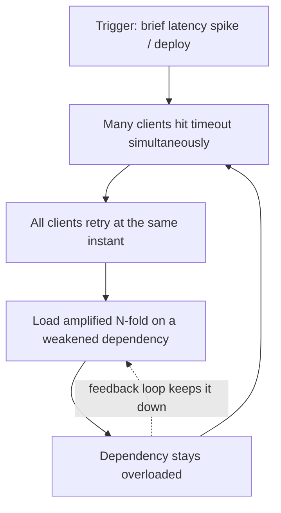
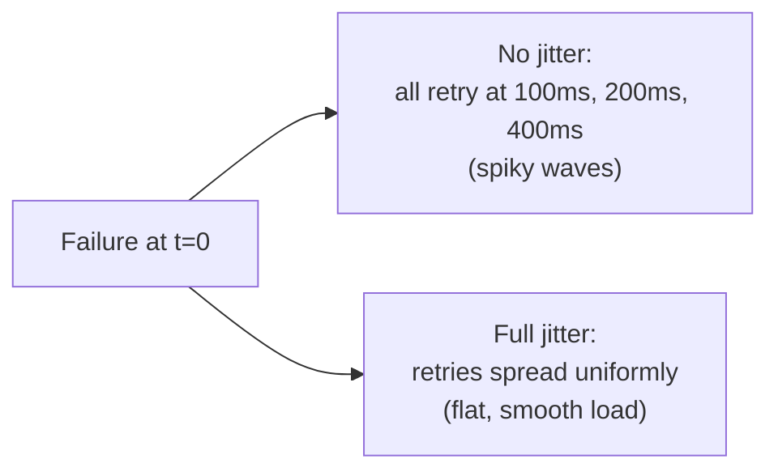
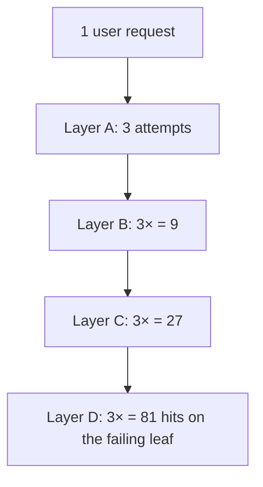

# Retries, Timeouts & Backoff

This page covers the **most-asked resilience mechanism in backend/SRE interviews**: how a client
survives a slow or failing dependency without either hanging forever or making the failure worse.
The order matters. **Timeouts** come first — you cannot retry a call that never returns, so bounding
every wait is the foundation. **Retries** come second — but only for the right failures, or you
double-charge customers and amplify load. **Backoff and jitter** come third — they decide *when* the
retry fires so a fleet of clients does not synchronize into a self-inflicted DDoS. **Retry budgets**
cap the total, so retries can never become more than a small fraction of traffic.

Get this wrong and you build a **metastable failure**: a system that, once tipped over by a small
trigger, stays down under its own retry load even after the original trigger is gone.

This topic owns the **reliability mechanics** of these three controls. Neighbours: stopping retries
against a dead dependency is `circuit-breakers-and-bulkheads`; shedding load to protect yourself
(the server-side dual of client-side backoff) is `load-shedding-and-backpressure`; the theory of why
retries cause cascades lives partly in `cascading-failures-and-antipatterns`; dead-letter handling of
exhausted retries in async systems is a messaging concern (see `system-design`); and rate-limiting as
abuse-prevention is `security`, while rate-limiting *as a reliability mechanism* is here and in
`design-rate-limiter`. How you *measure/alert* on retry rates and timeout budgets is `observability`.

> [!KEY-TAKEAWAY]
> Four rules carry this whole topic. **(1) Never wait forever** — every network call needs a
> timeout, set from the dependency's measured p99 plus headroom, not a guess. **(2) Only retry
> idempotent + transient failures** — retrying a non-idempotent write can double-charge; retrying a
> 400 or a business error just wastes work. **(3) Never retry without backoff *and* jitter** —
> naked retries synchronize clients into a thundering herd. **(4) Cap retries with a budget** (e.g.
> ≤10% of requests) so a bad dependency can't multiply your outbound traffic.

---

## Timeouts: never wait forever

A **timeout** is the maximum time a caller will wait before abandoning an operation and treating it
as failed. The default behaviour of most network libraries is to wait **effectively forever** (or
until an OS-level TCP timeout minutes later), and that is the single most common reliability bug in
production: a slow dependency doesn't return errors, it **holds your threads/connections hostage**
until your own thread pool is exhausted and *you* fall over. A timeout converts an unbounded hang
into a fast, bounded failure you can then handle (retry, fall back, or shed).

> [!WARNING]
> The absence of a timeout is worse than a short one. Nygard's *Release It!* calls the unbounded
> wait the root of most cascading failures: the failure of a downstream service propagates upstream
> as **resource (thread/connection) exhaustion**, not as an error. Slow is the new down.

There are **distinct timeouts** at different layers, and interviewers expect you to name them:

| Timeout | What it bounds | Typical value |
|---|---|---|
| **Connect timeout** | Establishing the TCP/TLS connection (handshake). Failing here usually means the host is down/unreachable. | Short — 100 ms–1 s (LAN is fast; a slow connect = dead host) |
| **Read / socket / response timeout** | Waiting for bytes *after* the request is sent — the server's processing time. | Set from server p99 + headroom |
| **Request / call timeout (overall)** | End-to-end deadline for the whole call including retries. The one that matters to the user. | Derived from the caller's own SLA |
| **Idle / keep-alive timeout** | How long an unused pooled connection stays open. | Seconds to minutes |

A connect timeout and a read timeout are **not** the same thing, and a common bug is setting only
one. A short connect timeout catches dead hosts fast; the read timeout catches slow processing.

> [!TIP]
> Prefer **deadlines** (an absolute "finish by 12:00:00.500") over **relative timeouts** ("wait
> 500 ms") for anything that crosses service boundaries. A deadline can be propagated down the call
> chain (gRPC does this natively) so every hop knows how much time is truly left, and no hop wastes
> effort on a request the caller has already given up on. Relative timeouts reset at each hop and
> silently blow the end-to-end budget.

---

## How to pick a timeout value

The naive approach — "round number that feels safe," e.g. 30 s — is an anti-pattern: it's far too
long to protect you (30 s of held threads is an eternity) and provides no real bound. The
data-driven approach:

1. **Measure the dependency's latency distribution** — specifically **p99 (or p99.9)**, not the
   mean. The mean hides the tail, and it is the tail that causes timeouts.
2. **Set the read timeout to p99 + headroom** — a common heuristic is the p99.9 latency, or p99 ×
   a small multiplier. You want to time out the genuinely-stuck calls while letting the normal
   slow-tail succeed.
3. **Account for retries in the *overall* budget.** If one attempt is bounded at 300 ms and you
   allow 2 retries, the worst-case wall-clock is ~900 ms plus backoff — which must still fit inside
   what *your* caller will tolerate.

The core tension:

- **Too short** → you abandon requests that would have succeeded, turning tail-latency into
  errors, and (if you then retry) you add load to an already-slow dependency. You can convert a
  latency blip into an availability outage.
- **Too long** → threads/connections pile up during a slowdown, your pool exhausts, and the
  dependency's slowness becomes *your* outage. You lose the fast-failure benefit entirely.

> [!INTERVIEW]
> "How do you choose a timeout?" A strong answer never says a number first. It says: *measure the
> downstream p99/p99.9 under load, set the per-attempt read timeout just above that with headroom,
> then work out the overall deadline from my own SLA and back-solve how many retries fit inside it.
> I revisit it as the dependency's latency profile changes.* Then, and only then, offer a ballpark.

---

## Timeout budgets across a call chain

In a layered system A → B → C → D, timeouts must **shrink as you go down** the chain. This is the
**timeout budget** (or deadline propagation): each caller's timeout must be *shorter* than its
own caller's remaining budget, minus the time already spent and a margin for the caller's own work.

The failure mode when you ignore this: **A** times out at 1 s, but **B** calls **C** with a 3 s
timeout. When C is slow, B keeps waiting for 3 s — but A already gave up at 1 s and (worse) may have
retried, so B is now doing work for a request nobody is waiting for. This wastes capacity exactly
when the system is under stress. The rule: **inner timeouts < outer timeouts.**


Each hop subtracts the time it needs for its own processing plus a safety margin, and passes the
**remaining** deadline down. gRPC and many RPC frameworks propagate the deadline automatically; with
plain HTTP you pass a header (e.g. an `X-Request-Deadline`) or compute it explicitly. If a hop
receives a request whose deadline has *already* passed, it should **fail fast without doing the
work** — this is "deadline-aware" behaviour and it reclaims capacity during overload.

> [!WARNING]
> A subtle amplification: if the total end-to-end budget is 1 s and you let each of 3 layers retry
> twice, the *inner* layers can burn the whole budget on retries and leave nothing for the outer
> ones — or blow past 1 s entirely. Timeout budgets and retry budgets must be designed **together**.

---

## Retries: when they help and when they hurt

A **retry** re-issues a failed request in the hope that the failure was **transient** — a brief
network blip, a momentary connection reset, a leader election, a request that hit a node mid-restart.
Retries are cheap insurance against the vast class of failures that resolve themselves in
milliseconds. But a retry is only safe under **two simultaneous conditions**:

1. **The failure is transient / retryable**, not permanent. Retrying a permanent failure just
   wastes work and adds load.
2. **The operation is idempotent** (or made idempotent), so re-executing it can't cause harm.

**What to retry vs. what never to retry:**

| Failure | Retry? | Why |
|---|---|---|
| Connection timeout / reset, `ECONNREFUSED` | Yes | Transient network / host restart |
| HTTP 503 Service Unavailable, 502, 504 | Yes (with backoff) | Server overloaded or restarting — but back off |
| HTTP 429 Too Many Requests | Yes — **honour `Retry-After`** | You're being throttled; retrying immediately makes it worse |
| Read timeout on an idempotent GET | Yes | Safe to repeat |
| HTTP 400 Bad Request / 422 | **No** | Malformed request; retrying sends the same bad request forever |
| HTTP 401 / 403 | **No** | Auth won't fix itself by retrying |
| HTTP 404 | **No** | Resource genuinely absent |
| Business-logic rejection (e.g. "insufficient funds") | **No** | Not a fault; the answer won't change |
| Read timeout on a **non-idempotent** POST/charge | **Only if idempotent-keyed** | You don't know if it committed — see below |

> [!WARNING]
> **Retrying a non-idempotent write is how you double-charge a customer.** If a `POST /charge`
> times out, the request may have *succeeded* on the server and only the response was lost. Blindly
> retrying charges twice. The fix is an **idempotency key**: the client sends a unique key with the
> request, the server records it, and a retry with the same key returns the original result instead
> of re-executing. This makes the write idempotent and safe to retry. (Payment APIs like Stripe
> require exactly this.)

Additional retry discipline:
- **Cap the attempts** (e.g. 2–3 total). Unbounded retries turn one failure into an infinite loop.
- **Retry idempotent operations only**, or use idempotency keys / conditional writes for the rest.
- **Don't retry client errors (4xx)** — they're deterministic; the same request fails the same way.
- **Respect `Retry-After`** on 429/503 — the server is telling you when it's safe.

---

## Retry storms & the thundering herd

A **retry storm** (a form of **thundering herd**) is the pathology at the heart of this topic. When
a dependency slows or briefly fails, *every* client times out at *roughly the same time* and *all
retry at once*. That synchronized burst of retries **adds load precisely when the dependency is
least able to handle it**, keeping it down. Worse, if each client retries N times, a dependency
struggling with X requests now sees up to **X × (1 + N)** requests — the retries can exceed the
original traffic. This is **load amplification**.

This is the classic **metastable failure**: a small trigger (a brief latency spike, a deploy, a
cache flush) tips the system into a state where the *retry load it generates* is enough to keep it
down **even after the original trigger is gone**. The system has two stable states — healthy and
collapsed — and retries provide the positive feedback loop that holds it in the collapsed one.
Recovery often requires *reducing* load below normal (shedding traffic, "draining the storm") before
the system can climb back out.



The three defences, in combination, break this loop:
1. **Backoff** — spread retries out over time so they don't all land at once.
2. **Jitter** — randomize the timing so clients *de-synchronize* from each other.
3. **Retry budgets / circuit breakers** — cap total retries and stop retrying a dependency that's
   clearly dead (see `circuit-breakers-and-bulkheads`).

> [!KEY-TAKEAWAY]
> Retries are the most common *cause* of cascading failure, not just a cure for transient errors.
> The instinct "add retries for reliability" is dangerous without backoff, jitter, and a budget.

---

## Backoff: fixed vs exponential

**Backoff** is the delay a client waits before retrying. It converts an instant re-hammer into a
paced sequence, giving the dependency room to recover.

- **No backoff (immediate retry):** worst option under load — it's the thundering herd on fast-
  forward. Only defensible for a single immediate retry of a genuinely instantaneous blip.
- **Fixed / constant backoff:** wait the same delay each time (e.g. 200 ms). Simple, but clients
  that failed together stay synchronized — they just re-collide every 200 ms.
- **Exponential backoff:** the delay grows multiplicatively with each attempt. The standard formula:

  ```
  delay = min(cap, base * 2^attempt)
  ```

  where `base` is the initial delay (e.g. 100 ms), `attempt` is the 0-based retry number, and `cap`
  is a ceiling (e.g. 20 s) so the delay doesn't grow without bound. With base = 100 ms:
  attempt 0 → 100 ms, 1 → 200 ms, 2 → 400 ms, 3 → 800 ms, … capped at `cap`. This rapidly backs off
  a persistently failing dependency while still retrying transient blips quickly.

The **cap** matters: without it, `2^attempt` explodes into minutes and hours. Capped exponential
backoff is the industry default.

| Strategy | Timing | Synchronization risk | Use when |
|---|---|---|---|
| Immediate (no backoff) | 0 | **Very high** | Almost never; at most one quick retry |
| Fixed | constant | High (clients stay in lockstep) | Simple internal calls, low fan-out |
| Exponential (capped) | `min(cap, base·2ⁿ)` | Reduced, but still clustered without jitter | The default for most retries |
| Exponential + jitter | randomized around the curve | **Low** | The recommended production default |

> [!WARNING]
> Exponential backoff **alone** does not solve the herd. If 10 000 clients all failed at t=0, they
> all wait 100 ms, then all wait 200 ms — they retry in synchronized waves. Backoff spreads a single
> client's retries over time; it does **not** de-correlate *different* clients. That's what jitter is
> for.

---

## Jitter: full, equal & decorrelated

**Jitter** adds controlled randomness to the backoff delay so that clients which failed together
retry at *different* times, smoothing the retry load from spiky waves into a flat trickle. AWS's
canonical article *"Exponential Backoff and Jitter"* (Marc Brooker) showed via simulation that
adding jitter dramatically reduces contention and total work compared to backoff alone — it is not
optional polish, it is the point.

Given `base` and a capped exponential ceiling, the three named variants:

| Variant | Formula | Behaviour |
|---|---|---|
| **No jitter** | `delay = min(cap, base·2^n)` | Deterministic; clients stay synchronized |
| **Full jitter** | `delay = random(0, min(cap, base·2^n))` | Pick uniformly between 0 and the exponential ceiling. **Maximum spread**; AWS's recommended default. |
| **Equal jitter** | `temp = min(cap, base·2^n); delay = temp/2 + random(0, temp/2)` | Half fixed, half random. Guarantees a minimum wait while still spreading. |
| **Decorrelated jitter** | `delay = min(cap, random(base, prev_delay·3))` | Uses the *previous* delay to seed the next; grows well and spreads widely without unbounded growth. |

In AWS's simulations, **full jitter** and **decorrelated jitter** both performed best — full jitter
minimized the total number of calls and completed work fastest under contention. Equal jitter is a
reasonable choice when you want to guarantee some minimum delay (e.g. to avoid a near-instant retry).

> [!TIP]
> The single most impactful, cheapest change you can make to a retrying client is: **add full jitter
> to your exponential backoff.** It costs one `random()` call and prevents the synchronized-wave
> failure mode. If you remember one formula from this topic, remember
> `sleep = random(0, min(cap, base * 2^attempt))`.



---

## Retry budgets & token buckets

A **retry budget** caps the *total* amount of retrying a client (or client fleet) may do, expressed
as a fraction of the underlying request rate — e.g. **retries may add at most 10% on top of the
primary request traffic.** This is the safety net that guarantees retries can *never* amplify load
into a storm, no matter how many individual requests are failing. It's implemented with a **token
bucket**:

- Every successful/primary request adds a token (or the bucket refills at a rate proportional to
  request throughput).
- Every retry **spends** a token.
- The bucket's size / refill rate is set so retries are capped at, say, 10–20% of requests.
- **When the bucket is empty, retries are suppressed** — the client returns the error immediately
  rather than retrying.

The elegance: when a dependency is healthy, failures are rare, the bucket stays full, and retries
are always available for the occasional transient blip. When the dependency is **broadly failing**,
the failure rate spikes, the bucket drains fast, and retries are automatically throttled off — you
stop hammering a dead dependency. This is the fleet-wide analogue of a circuit breaker and is how
gRPC's built-in retry policy and Google's client libraries bound retry amplification.

| Mechanism | Scope | What it limits |
|---|---|---|
| Max attempts (e.g. 3) | Single request | How many times *one* request retries |
| Retry budget / token bucket | Whole client or fleet | What *fraction* of all traffic can be retries |
| Circuit breaker | Per dependency | Whether to attempt the dependency *at all* right now |

> [!INTERVIEW]
> "You already have exponential backoff and jitter — why also need a retry budget?" Because backoff
> and jitter fix the *timing* (when retries land) but not the *volume*. If 100% of requests are
> failing, backoff+jitter still lets every request retry — just spread out — which is still up to
> N× the traffic on a struggling dependency. The budget caps the *total*, so a wholesale outage
> can't be amplified regardless of timing. Timing and volume are orthogonal problems.

---

## Retry amplification in layered systems

The most dangerous retry mistake in a microservice architecture is **retrying at every layer**. If
each layer in a chain independently retries R times, the load multiplies **exponentially with
depth**. For a chain of depth D where each layer retries so it makes R attempts:

```
total requests at the bottom = R^D
```

With 3 retries (R=3) and 4 layers deep (D=4), a single top-level request can become **3⁴ = 81**
requests hitting the bottom service. A modest failure at the leaf turns into a crushing, self-
amplifying flood by the time every layer above it has multiplied its retries.



The rule of thumb from Google's SRE book: **retry at a single level of the stack** — usually the
level closest to the failure that has enough context to know the failure is transient, or the level
closest to the user. Layers in between should **fail fast and propagate the error up**, not add their
own retries. If you must retry at multiple levels, use **retry budgets at each level** and make lower
levels report "I already retried; don't retry me" (e.g. a response header) so the caller doesn't
re-multiply.

> [!WARNING]
> This is why "just add a retry, it improves reliability" is a trap in a large system. Every team
> adding a local retry seems locally reasonable; the *composition* is a load bomb. Retry policy is a
> system-level concern, not a per-call one.

---

## Putting it together & interaction with circuit breakers

A robust client-side resilience policy layers these controls, and they must be **tuned together**:

1. **Timeout** every call (connect + read), value from the p99 + headroom.
2. **Retry** only idempotent + transient failures, capped at 2–3 attempts.
3. **Backoff exponentially** with a cap.
4. **Add full jitter** to de-synchronize clients.
5. **Bound the total** with a retry budget (token bucket).
6. **Wrap it in a circuit breaker** so a *sustained* failure stops retries entirely and fails fast.

Backoff/retry and circuit breakers are complementary, not redundant: **backoff+jitter handles
transient, per-request failures; the circuit breaker handles sustained, dependency-wide failures.**
When a dependency is truly down, retrying (even with perfect backoff) still wastes latency budget on
every request — the breaker trips open and skips the attempt entirely, giving the dependency room to
recover and giving your callers instant failures/fallbacks. See `circuit-breakers-and-bulkheads` for
the state machine (closed → open → half-open) and `graceful-degradation-and-fallbacks` for what to
serve when the breaker is open.

A concrete Resilience4j-style composition (order matters — retry wraps circuit breaker wraps the
call, so the breaker sees each attempt):

```java
// Resilience4j: timeout + retry (exp backoff + jitter) + circuit breaker
var timeLimiter = TimeLimiter.of(Duration.ofMillis(300));           // per-attempt read timeout
var retry = Retry.of("charge", RetryConfig.custom()
    .maxAttempts(3)
    .intervalFunction(IntervalFunction.ofExponentialRandomBackoff(  // 100ms base, x2, full-ish jitter
        Duration.ofMillis(100), 2.0, 0.5))
    .retryOnResult(r -> r.status() == 503 || r.status() == 429)     // transient only
    .build());
var breaker = CircuitBreaker.of("charge", CircuitBreakerConfig.custom()
    .failureRateThreshold(50)            // open if >50% of calls fail
    .waitDurationInOpenState(Duration.ofSeconds(10))
    .build());
// decorate: retry(circuitBreaker(timeLimiter(call)))
```

For **async / messaging** systems the shape differs: instead of in-line retries you use a **retry
queue with a delay** and, after N attempts, route to a **dead-letter queue (DLQ)** for manual/offline
handling — this keeps the failing message from blocking the pipeline. That's a messaging-design
concern; see `system-design` for DLQ patterns.

---

## Common Interview Follow-ups

- **"Walk me through choosing a timeout for a downstream call."** Measure its p99/p99.9 under load,
  set the per-attempt read timeout just above that with headroom, distinguish connect vs read
  timeouts, derive the overall deadline from your own SLA, and back-solve how many retries fit.
- **"Your service double-charged a customer during a network blip. What happened and how do you fix
  it?"** A non-idempotent POST timed out after committing; the retry re-executed it. Fix with an
  idempotency key the server dedupes on.
- **"Adding retries made an outage worse. Explain."** Retry storm / metastable failure: synchronized
  retries amplified load N× on a weakened dependency and held it down. Fix: backoff + jitter + retry
  budget + circuit breaker, and retry at only one layer.
- **"Why isn't exponential backoff enough — why add jitter?"** Backoff spreads one client's retries
  over time but leaves *different* clients synchronized; jitter de-correlates them so retry load is
  smooth, not spiky. Full jitter minimizes total work (AWS).
- **"You have backoff and jitter already. Why also a retry budget?"** Jitter fixes *when* retries
  land; the budget fixes *how many*. At 100% failure, timing spreading still permits N× volume; the
  budget caps the fraction of traffic that can be retries.
- **"A dependency is slow (not erroring). Do you retry?"** Usually no — retrying a slow dependency
  adds load and makes it slower. Time out fast, consider shedding load or a fallback, and let a
  circuit breaker trip. Retrying is for *failures*, not *slowness*.
- **"How many retries at each layer of a 4-deep call chain?"** Ideally retry at exactly one layer;
  multiple-layer retries multiply as Rᐟᴰ (e.g. 3⁴ = 81). Middle layers fail fast and propagate.
- **"Client got a 429. What do you do?"** Honour `Retry-After`; back off at least that long. Retrying
  immediately is exactly what the throttle is telling you not to do.
- **"Deadlines vs timeouts across services?"** Propagate an absolute deadline down the chain so each
  hop knows the true remaining time and can fail fast on already-expired requests; relative timeouts
  reset per hop and blow the end-to-end budget.

---

## References

- Google, *Site Reliability Engineering*, ch. 22 "Addressing Cascading Failures" (retry
  amplification, retry budgets, load-induced metastable failure) — sre.google/books.
- Google, *The Site Reliability Workbook*, ch. on handling overload and cascading failures.
- Marc Brooker / AWS Architecture Blog, **"Exponential Backoff and Jitter"** (full / equal /
  decorrelated jitter, simulations) — aws.amazon.com/blogs/architecture/exponential-backoff-and-jitter/.
- AWS Builders' Library, **"Timeouts, retries, and backoff with jitter"** (Marc Brooker).
- Michael T. Nygard, *Release It!* (2nd ed.) — Timeouts, Circuit Breaker, Bulkhead, and the
  "slow is the new down" cascading-failure analysis.
- gRPC documentation — client retry policy, retry throttling (token-bucket budget), and deadline
  propagation.
- Stripe API docs — idempotency keys for safely retrying non-idempotent writes.
- Neighbouring topics in this library: `circuit-breakers-and-bulkheads`,
  `load-shedding-and-backpressure`, `cascading-failures-and-antipatterns`,
  `graceful-degradation-and-fallbacks`; `observability` for measuring/alerting on retry rates;
  `security` and `design-rate-limiter` for rate-limiting.
