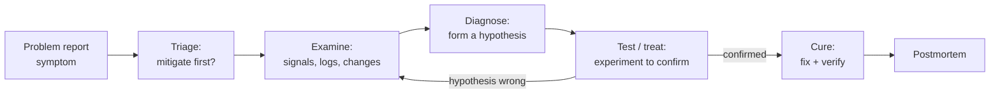
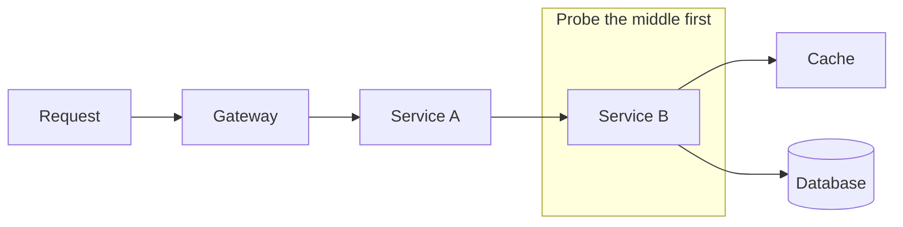
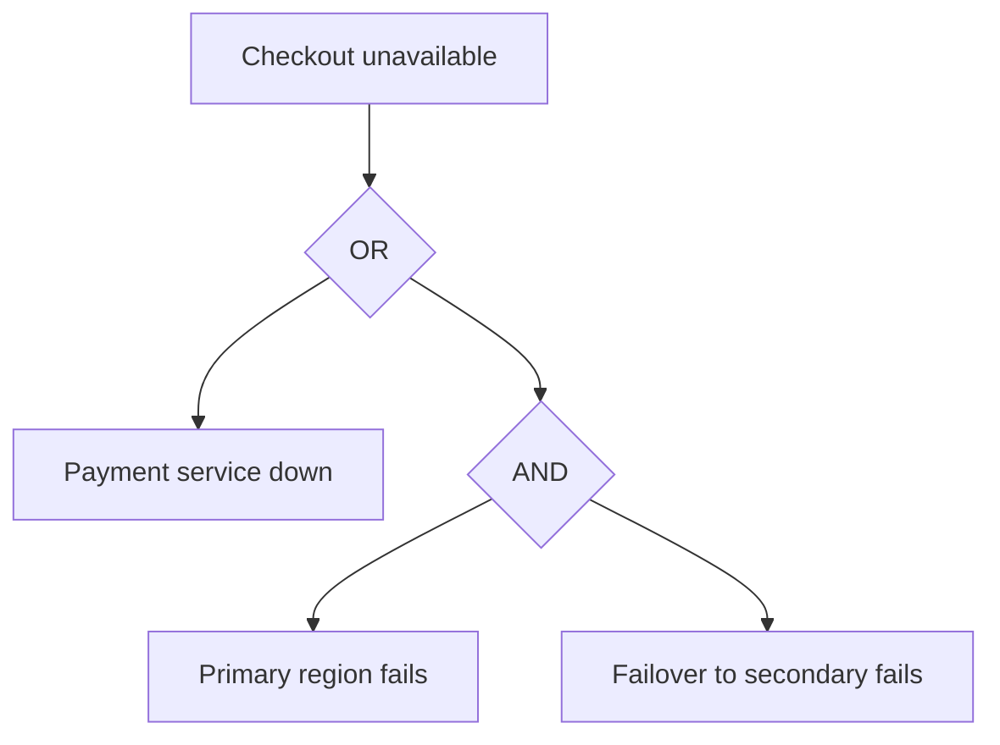
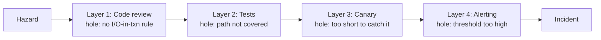

# Root-Cause Analysis & Troubleshooting

**Troubleshooting** is the real-time skill of moving from a *symptom* ("checkout latency is up")
to a *cause* you can act on, under time pressure, during an incident. **Root-cause analysis (RCA)**
is the after-the-fact discipline of understanding *why* the incident happened deeply enough to
prevent recurrence — it feeds the postmortem. This topic is about doing both **systematically**
(the scientific method applied to production) rather than by intuition, folklore, or random
flailing, and about the honest truth that in complex systems there is rarely a single "root" cause.

Grounded in the Google SRE book ("Effective Troubleshooting" chapter), Nygard's *Release It!*,
Richard Cook's "How Complex Systems Fail," James Reason's Swiss-cheese model, and the classic
quality-engineering RCA toolkit (5 Whys, Ishikawa/fishbone, fault-tree analysis).

> [!KEY-TAKEAWAY]
> Two ideas do most of the work in interviews. **(1) Change-first heuristic:** the large majority
> of incidents are triggered by a recent change (deploy, config push, flag flip, dependency
> version, traffic shift) — so *"what changed?"* is almost always the first and highest-yield
> question. **(2) The scientific method beats intuition:** observe the symptom, form a testable
> hypothesis, bisect the system to test it cheaply, keep or discard the hypothesis based on
> evidence, repeat. Don't confuse *correlation* with *causation*, and don't stop at the first
> plausible story — complex failures have *multiple contributing factors*, not one root cause.

> [!INTERVIEW]
> High-frequency prompts: *"a service just started erroring — walk me through your first five
> minutes"* (mitigate + ask what changed, not "read the code"), *"latency p99 is up but p50 is
> flat — what does that tell you?"*, *"what are the limits of 5 Whys?"*, *"correlation vs
> causation — give an example that fooled you,"* *"how do you localize which of 12 microservices
> is the slow hop?"* (distributed tracing / bisection), and *"is there always a single root
> cause?"* (no — say Swiss cheese / contributing factors). Strong answers lead with *stop the
> bleeding first, understand later* and name the change-first heuristic explicitly.

---

## Symptom vs cause vs trigger

Precise vocabulary keeps a diagnosis honest and keeps a postmortem useful.

- **Symptom** — the observable bad thing: elevated error rate, high latency, a full disk, angry
  users. Symptoms are what alerts fire on and what SLOs measure. You *mitigate* symptoms.
- **Proximate (immediate) cause** — the thing that directly produced the symptom: "the process
  ran out of file descriptors," "the connection pool was exhausted."
- **Trigger** — the change or event that set the failure in motion: a deploy, a config push, a
  traffic spike, a dependency slowing down. Triggers are *when/what kicked it off*.
- **Contributing factors / root causes** — the deeper conditions that made the trigger able to
  cause harm: a missing timeout, an unbounded queue, no back-pressure, a gap in review, an alert
  that was too noisy to notice. These are what a good RCA surfaces and what fixes target.

The classic confusion is treating the **proximate cause** as *the* root cause. "The pod OOM-killed"
is proximate; the root question is *why did memory grow unbounded, why was the limit set where it
was, and why did nothing catch it before prod?* Fixing only the proximate cause (bump the memory
limit) usually just moves the next failure a few weeks out.

> [!TIP]
> Interview tell: candidates who say "the root cause was that the server crashed" are describing a
> *symptom*. Strong candidates separate symptom → trigger → proximate cause → contributing factors,
> and note that mitigation targets the symptom while the fix targets the contributing factors.

---

## The scientific method for troubleshooting

The Google SRE model of troubleshooting is an explicit loop, not a vibe:

- **Triage** — assess impact and, crucially, decide whether to **mitigate before you diagnose**.
  If users are down, restoring service (roll back, fail over, shed load) comes *first*; full
  understanding can wait for the postmortem. Do not debug a burning building.
- **Examine** — look at the system: the four golden signals, dashboards, logs, traces, and
  **recent changes** (see observability for the telemetry mechanics). Observe before theorizing.
- **Diagnose** — form a *specific, testable* hypothesis about the mechanism ("the new query lacks
  an index, so DB CPU saturates, so requests queue"). Vague hypotheses ("the DB is unhappy") can't
  be tested.
- **Test/treat** — run the cheapest experiment that would *disconfirm* the hypothesis. Change one
  variable at a time. A hypothesis that survives a genuine attempt to break it is trustworthy.
- **Cure** — apply the fix and *verify the symptom actually resolves*; a symptom that clears for an
  unrelated reason (the traffic spike passed) will fool you into a wrong conclusion.

The anti-method is **random flailing**: changing several things at once, restarting components
hopefully, or "reading all the code" from the top. Flailing sometimes works but teaches nothing,
often makes things worse, and can't be repeated. The disciplined method is *slower per step but
converges*; flailing is *fast per step but may never converge*.

> [!WARNING]
> Changing several variables at once during an incident is the cardinal sin: if the symptom
> changes you won't know which change did it (or whether an unrelated factor did), and you may
> have introduced a new fault. One variable at a time, and write down what you did and when.

---

## The change-first heuristic

**Most incidents are caused by a change.** Google, Amazon, and virtually every large operator
report that the strong majority of production incidents are triggered by a recent
deploy, configuration push, feature-flag flip, or dependency/version update — systems that are
"just running" are usually stable. This makes *"what changed?"* the single highest-yield first
question in troubleshooting.

Practical mechanics:

- **Correlate the symptom's onset with the change timeline.** Line up the error-rate/latency
  inflection point against the deploy log, config-management history, flag-flip audit log, and
  infra changes. A symptom that starts at the same minute as a deploy is a prime suspect.
- **Roll back / disable the change first.** If a recent change correlates, reverting it is often
  the fastest mitigation — and rolling back *also tests the hypothesis* (symptom clears ⇒ the
  change was involved). This is why easy, fast rollback is a reliability superpower (see
  devops-cicd for deploy/rollback mechanics).
- **Beware the changes you don't own.** "We didn't deploy" ≠ "nothing changed": a dependency you
  call may have shipped, a config store flipped, a certificate expired, a cron ran, data crossed a
  threshold, or traffic changed shape. Widen the definition of "change" beyond your own repo.

> [!TIP]
> The change-first heuristic doesn't mean *blame* the change — it means *investigate it first*
> because that's where the base rate of causes is highest. If no change correlates, you widen to
> capacity/traffic, external dependencies, and slow-burn resource leaks.

---

## Signals to read: golden signals, RED, USE

You triage with a small, well-chosen set of signals rather than staring at every metric. The
*mechanics* of collecting and alerting on these belong to observability; here is what each tells
you diagnostically.

- **Four golden signals** (Google SRE): **Latency**, **Traffic**, **Errors**, **Saturation**.
  - *Latency* — split successful vs failed latency (a fast error can hide behind a good p50).
  - *Traffic* — demand on the system (req/s, tx/s); a spike is a common trigger.
  - *Errors* — rate of failed requests (explicit 5xx, and implicit — wrong answers, timeouts).
  - *Saturation* — how "full" the most constrained resource is (CPU, memory, threads, connections,
    IOPS). Saturation is the leading indicator of impending overload.
- **RED** (services, from Tom Wilkie): **Rate, Errors, Duration** — a request-centric subset,
  ideal for a stateless request handler.
- **USE** (resources, from Brendan Gregg): **Utilization, Saturation, Errors** — for every
  resource (CPU, disk, NIC, pool). Great for the "which resource is the bottleneck?" question.

Diagnostic reading of latency percentiles is a favourite interview probe:

| Observation | What it suggests |
|---|---|
| p50 flat, p99 up | A *subset* of requests is slow — a slow shard, a cold cache, a GC pause, one bad host, or tail contention. Not a global problem yet. |
| p50 and p99 both up | A *systemic* slowdown — saturated shared resource, a slow dependency on the common path, or an inefficient new code path. |
| Errors up, latency **down** | Requests are failing *fast* — circuit breaker open, fast rejection/load-shedding, or an early validation error. |
| Latency up, errors flat (yet) | Queuing/saturation building; errors and timeouts usually follow if unaddressed. |
| Traffic down *and* errors up | You may be *causing* the traffic drop (clients giving up) — look upstream. |

> [!TIP]
> "Averages lie." Always reason in **percentiles** (p50/p90/p99/p99.9), because tail latency is
> where user pain and saturation show up first, and an average blends the healthy majority with
> the suffering tail. See observability for percentile/histogram mechanics.

---

## Bisection: localizing the fault

When the failure could be anywhere in a request path spanning many components, **bisection**
(divide and conquer) localizes it in O(log n) probes instead of O(n) guesses — the same idea as
`git bisect` for code and binary search for data.

- **Along the request path:** the request touches gateway → service A → service B → cache → DB.
  Test the *middle*: is B's dependency healthy? If yes, the fault is upstream of B; if no, it's at
  or below B. Each probe halves the suspect space. **Distributed tracing** makes this near-instant
  by showing the per-hop latency of a single request — the "slow hop" lights up (see observability
  for tracing mechanics).
- **Along time (`git bisect`):** if a bug appeared between two known-good/known-bad commits, binary
  search the commit range, testing the midpoint each time — finds the offending commit in
  ⌈log₂ N⌉ tests (e.g. ~10 tests across 1000 commits).
- **Along the population:** if only *some* requests fail, bisect by dimension — region, AZ, host,
  customer tier, API version, shard, canary vs baseline. The dimension that cleanly separates
  good from bad points at the cause. This is **differential diagnosis** (next section).

> [!TIP]
> Distributed tracing collapses path-bisection: instead of manually probing each hop, one trace of
> a slow request shows exactly which span dominates end-to-end latency. If you don't have tracing,
> bisection by hand is the fallback — and "we couldn't localize the slow hop" is itself an
> observability gap worth an action item.

---

## Differential diagnosis and what-changed axes

Borrowed from medicine: enumerate the *plausible causes*, then use evidence to systematically rule
them out rather than fixating on the first idea. In practice you slice the symptom along axes and
find the one that separates healthy from unhealthy:

- **Where:** which region / AZ / cluster / host / shard / pod? (One bad host? A whole AZ?)
- **Who:** which customers / tenants / API versions / clients? (A single big customer's traffic?)
- **What:** which endpoint / query / operation / feature flag? (Only the new endpoint?)
- **When:** onset time — correlate with deploys, cron jobs, traffic peaks, TTL/cert expiries,
  month-end batch, a counter overflowing.

If a symptom is **isolated** to one slice (one host, one shard, one customer), the cause is usually
*specific* (a bad node, a hot key, a poison-pill payload). If it's **uniform** across all slices,
the cause is usually *shared* (a common dependency, a global config, a version rolled everywhere).
That single distinction — isolated vs uniform — routes the entire investigation.

---

## Correlation vs causation

Two signals moving together does **not** mean one caused the other. Common traps:

- **Common cause (confounder):** CPU and latency both spike — but a *third* thing (a traffic surge)
  drove both; "high CPU" isn't the root, the surge is.
- **Reverse causation:** you see retries spike and errors spike and conclude retries are a symptom —
  but retries may be *amplifying* the errors (retry storm; see cascading-failures).
- **Coincidence:** the graph you happened to open moved at the same time; you didn't check the
  hundred graphs that also moved or the ones that didn't.
- **Post hoc:** "the error started after the deploy, so the deploy caused it" is a *strong prior*
  (change-first!) but still a hypothesis — confirm it (roll back and watch, or find the mechanism).

The discipline: to promote a correlation to a cause, demand a **plausible mechanism** ("this query
has no index → DB CPU saturates → requests queue"), and ideally an **intervention** (roll back the
change / remove the load and watch the symptom resolve). Correlation *narrows* the search; a
mechanism plus a confirming intervention *establishes* causation.

> [!WARNING]
> "It's always the network / the database / GC." Blaming the usual suspect without evidence is
> confirmation bias — you'll find some graph that "confirms" it because something is always a bit
> elevated. Test the hypothesis; don't just find a graph that agrees with your prior.

---

## 5 Whys and its limits

**5 Whys** (Toyota Production System) is the simplest RCA technique: repeatedly ask "why?" —
roughly five times — to walk from a symptom down a chain of causes to something actionable.

Example:
1. The site was down. *Why?* The app couldn't reach the database.
2. *Why?* The connection pool was exhausted.
3. *Why?* A new endpoint held connections during a slow external call.
4. *Why?* It called the third party inside the DB transaction with no timeout.
5. *Why?* Our review checklist has no rule about I/O inside transactions, and load tests didn't
   cover that path. → **Actionable**: add a timeout, move the call outside the transaction, add a
   review-checklist item and a load test.

**Limits (a very common interview question):**

- **It's linear** — a single chain — but real failures have **multiple contributing factors** that
  interact. 5 Whys can miss the parallel causes it doesn't happen to walk down.
- **It can stop too early** (stopping at "human error" or a convenient blameworthy answer) or
  **run too deep / arbitrarily** ("...because the universe has entropy"). "Five" is a rule of
  thumb, not a law.
- **It's biased by the asker** — the chain follows whatever the facilitator finds intuitive, so it
  can rationalize a pre-formed conclusion. Two people often produce two different chains.
- **It tends toward blame** ("why did the engineer push the bad config?") unless deliberately
  steered toward *systemic* factors (see blameless-postmortems).

Use it for simple, mostly-linear problems; escalate to fishbone or fault-tree analysis when
causes are multiple or interacting.

---

## Fishbone (Ishikawa) diagrams

A **fishbone / Ishikawa / cause-and-effect diagram** counters 5 Whys' linearity by forcing you to
brainstorm causes across **multiple categories** at once, so you don't tunnel down one branch. The
effect (the symptom) is the fish's head; major cause categories are the bones.

For software/SRE, useful categories are **People, Process, Technology, and Environment** (an
adaptation of the classic manufacturing "6 Ms" — Manpower, Method, Machine, Material,
Measurement, Milieu):

| Category | Example contributing factors |
|---|---|
| **People** | Missing on-call runbook, unclear ownership, alert fatigue, knowledge silo |
| **Process** | No canary stage, review gap, no rollback plan, change not communicated |
| **Technology** | Missing timeout, unbounded queue, no circuit breaker, index missing, resource leak |
| **Environment** | Dependency outage, DNS/cert expiry, cloud-provider AZ event, traffic surge |

The value is **breadth before depth**: it surfaces the several factors that *combined* to produce
the failure, matching the reality that complex outages are multi-causal. Its weakness is that it
enumerates *candidate* causes without ranking them — it doesn't tell you which mattered most, so
you still need evidence (and often a fault tree) to prioritize.

---

## Fault Tree Analysis (FTA)

**Fault tree analysis** is a top-down, deductive technique: start with the undesired top event
("checkout unavailable") and decompose it through **Boolean logic gates** into the combinations of
lower-level faults that could cause it.

- An **OR gate** means *any* child event alone causes the parent (single points of failure — the
  dangerous kind). A path of ORs down to a single basic event is a single point of failure.
- An **AND gate** means *all* children must occur together — this is your **defense in depth**;
  redundancy and layered safeguards turn ORs into ANDs so no single fault is sufficient.

FTA shines for **quantifying** reliability: assign each basic event a probability and you can
compute the top event's probability, and identify **minimal cut sets** (the smallest sets of
failures that together bring the system down). A cut set of size 1 is a single point of failure and
your highest-priority fix. It's heavier-weight than 5 Whys — used more for *proactive* design
review and safety-critical systems than for a 2 a.m. incident — but conceptually it's the rigorous
form of "what would have to fail for this to happen?"

| Technique | Direction | Best for | Handles multiple causes? | Effort |
|---|---|---|---|---|
| **5 Whys** | Bottom-up, linear | Simple, single-chain problems; quick postmortem starter | Poorly (one chain) | Very low |
| **Fishbone** | Brainstorm by category | Surfacing *breadth* of contributing factors | Yes (categories) | Low |
| **Fault tree (FTA)** | Top-down, deductive | Design review, SPOF hunting, quantified risk, safety-critical | Yes (AND/OR logic) | High |

---

## The myth of THE single root cause

A staff-level view, and a frequent senior interview question: **complex systems do not have a
single root cause.** Richard Cook's "How Complex Systems Fail" and James Reason's **Swiss-cheese
model** describe why.

- Complex systems run in a **degraded mode as normal** — there are always latent faults present;
  the system works *despite* them because of redundancy and human adaptation.
- Each defense layer (review, tests, canary, monitoring, rate limits, on-call) is a slice of Swiss
  cheese with holes. An accident happens only when the **holes momentarily line up** so a hazard
  passes through *every* layer at once. Removing any one hole would have stopped it — which is
  exactly why there is no single "the" cause.
- Therefore **"the root cause" is a choice, not a discovery.** Picking one cause is usually a
  stopping rule driven by convenience or blame, and it under-invests in the *other* holes that also
  had to align.

The operational consequence: a good RCA lists **multiple contributing factors** and generates
**multiple, layered action items** (fix the timeout *and* the review gap *and* the canary duration
*and* the alert threshold), so the next time the holes won't line up the same way. Insisting on one
root cause is an anti-pattern that leads to shallow fixes and repeat incidents. (This is the RCA
side of blameless-postmortems, which owns the write-up and follow-through.)

> [!WARNING]
> "Human error" is never a root cause — it's a *starting point*. If a person could cause an outage
> with one mistake, the system's defenses (the other cheese slices) are the real story. Stopping at
> "the engineer ran the wrong command" is the classic too-early stop and the classic blame trap.

---

## Tools of the trade (cross-references)

You *localize with signals and tools*, but the telemetry stack itself is owned by observability —
here's how each is used diagnostically:

- **Metrics** — spot *that* something is wrong and *when* it started (golden signals, saturation).
  Best for detection and trend/onset; weak at explaining a single request.
- **Logs** — the *what/why* detail for specific events and errors; structured logs + correlation
  IDs let you follow one request. Best for the last-mile "what exactly happened."
- **Distributed traces** — the *where*: which hop in a multi-service request is slow or failing.
  Best for localization in a call graph (the "slow hop"). See observability.
- **Change/audit logs** — deploy history, config-management diffs, flag audit, infra events. The
  change-first heuristic lives here.
- **Profilers / flame graphs** — for CPU/memory hot spots once you've localized to a process.

The mental model: **metrics tell you *that* and *when*; traces tell you *where*; logs tell you
*what/why*; the change log tells you *what you did to yourself*.** Start broad (metrics), localize
(traces/bisection), confirm (logs), and cross-check against changes throughout.

---

## Kepner-Tregoe: IS and IS-NOT

**Kepner-Tregoe (KT)** is the formal, evidence-first cousin of differential diagnosis — a
structured method for finding *probable cause* by specifying a problem precisely before
theorizing. KT defines four **rational processes**: **Situation Appraisal** (what's going on,
what to work on first), **Problem Analysis** (find the cause of a deviation), **Decision
Analysis** (choose among options), and **Potential Problem Analysis** (anticipate what could go
wrong with a plan). Problem Analysis is the RCA-relevant one.

Its engine is the **IS / IS-NOT specification** across four dimensions. For each, you write what
the problem **IS** and what it plausibly *could be but* **IS-NOT** — the boundary matters as much
as the fact:

| Dimension | IS (what we observe) | IS-NOT (what we'd expect but don't see) |
|---|---|---|
| **What** — object & defect | Checkout API returns 500s | Cart, search, and login are fine |
| **Where** — geographic / on the object | eu-west-1 only; only the `/pay` path | us-east-1 fine; `/pay/status` fine |
| **When** — timing / lifecycle | Started 14:32 UTC; only during peak | Not overnight; not before 14:32 |
| **Extent** — how many / how big / trend | ~8% of eu-west requests, rising | Not 100%; not shrinking |

Cause is found by examining the **distinctions** (what is *different* about the IS versus the
IS-NOT — what's special about eu-west-1, about `/pay`, about 14:32) and the **changes** in or
around those distinctions (a config only eu-west-1 uses, a cert that expired at 14:32). A
candidate cause must **explain the IS *and* the IS-NOT** — if a theory would also break
us-east-1, it's wrong. This "must explain both sides" test is what makes KT more rigorous than
grab-the-first-hypothesis. It maps directly onto the *what-changed axes* (where/who/what/when)
already covered — KT is the named, disciplined version.

---

## Apollo RCA and causal-factor trees

Dean Gano's **Apollo RCA** (RealityCharting) is the explicit antidote to 5 Whys' linearity. Its
core principle: **every effect has at least two causes — an *action* cause and a *condition*
cause.** A fire needs the *action* (a spark) *and* the *condition* (fuel + oxygen present). So
causes **branch** into a **cause-and-effect chart (Realitychart)**, not a single chain: for each
node you ask "caused by?" and must attach **evidence** for every cause, continuing until you run
out of evidence or reach a useful action. It produces a graph of interacting causes — matching
the multi-causal reality of complex failures.

This forces a crisp vocabulary that interviewers probe. Learn the trio as distinct categories:

- **Causal factor** — an event or condition that *directly* produced the outcome (the deploy
  shipped a query with no index → DB CPU saturated). Remove it and this specific failure doesn't
  happen this way.
- **Root cause** — the *deepest correctable systemic* cause; fixing it prevents this *class* of
  failure (no review rule or test forbidding un-indexed hot-path queries).
- **Contributing factor** — raised the *likelihood or severity* but wasn't sufficient alone (peak
  traffic; an alert threshold set too high so detection was slow). It didn't cause the outage but
  made it worse or more likely.

The **causal-factor tree / contributing-factor tree** is the output artifact that separates these
so action items target the right layer (fix the causal factor to stop *this*, the root cause to
stop the *class*, the contributing factors to reduce blast radius / speed detection).

---

## The new view of human error

Table-stakes at senior level and a frequent probe. The doc's earlier line "human error is never a
root cause" is correct but shallow; the modern framing (Dekker, Woods, Allspaw, and the *Learning
From Incidents* movement) goes deeper:

- **Old view (bad-apple theory):** human error is *the cause*; find the careless person, retrain
  or discipline, and the system is safe again. This is comforting and almost always wrong.
- **New view:** human error is a **symptom** of deeper systemic trouble — a *starting point for
  investigation, not a conclusion*. Ask *why did that action make sense to a competent person at
  the time?*
- **Local rationality:** people's actions were reasonable given **what they knew, saw, and were
  under pressure to do at that moment**. Nobody comes to work to cause an outage. Reconstruct
  their view of the world, not yours after the fact.
- **The counterfactual trap:** "they should have checked X / noticed Y" describes a world that
  didn't exist — it is **hindsight, not analysis** (Cook #8: hindsight bias is the primary
  obstacle to investigation). Counterfactuals feel like findings but explain nothing.
- **"Root cause" is a construct, a socially chosen stopping point** (Cook #7), not something you
  *discover* out in the system.
- Culturally this is why postmortems moved from **blame** to **blameless** (some now say
  **blame-aware**): the goal is to treat incidents as **learning opportunities** (see
  blameless-postmortems for the write-up discipline).

**Above and below the line of representation** (Woods/Allspaw, STELLA report): engineers never
touch the real system directly — they operate on **mental models, dashboards, and tooling (above
the line)**; the messy real system lives **below the line**. Incidents erupt when the mental model
**diverges from reality** — which is exactly why *unknown-unknowns* and *dark debt* bite even
careful teams. RCA is partly the work of repairing that divergence.

---

## Latent vs active failures and dark debt

James Reason's Swiss-cheese layers have two failure ingredients, and naming them precisely is a
common follow-up:

- **Active failure** — the sharp-end act that *directly* breaches a layer, visible and close in
  time to the accident: the bad deploy, the fat-fingered command, the flag flip. Committed by the
  people at the "sharp end."
- **Latent condition** — a dormant systemic weakness planted long before, lying in wait as a
  "**resident pathogen**": a missing timeout, an unbounded queue, a bad default, an alert
  threshold set too high, an under-provisioned pool. Latent conditions don't cause harm until an
  active failure (or a change, or load) lines the holes up. Cook #4: complex systems *always*
  contain these latent failures.

**Dark debt** (from the STELLA report) is the most insidious latent condition: failure modes that
arise from **unforeseen interactions between components**. Unlike ordinary technical debt, dark
debt is **invisible to inspection** — you can't find it by reading code or a checklist, because no
single component is "wrong"; the hazard lives in the *emergent interaction*. It reveals itself
only when it produces an anomaly (Roblox 2021's Consul/BoltDB interaction is the canonical
example). Dark debt is *why* Cook #4 is true and why staff engineers treat "we reviewed it, it's
fine" as insufficient assurance for complex-system safety.

---

## How Complex Systems Fail: the load-bearing points

Richard Cook's 18 short theses are frequently name-checked ("cite a point from *How Complex
Systems Fail*"). The ones that carry interview weight:

- **#3 — Catastrophe requires multiple failures.** Single-point failures are *not* enough; the
  system's defenses mean it takes a *combination*. (This is the Swiss-cheese claim in one line.)
- **#4 — Complex systems contain changing mixtures of latent failures.** They're always present;
  the ones that matter change over time. Eradicating all of them is economically impossible.
- **#5 — Complex systems run in degraded mode.** The system works *as* a collection of flaws; it's
  never fully "healthy." So "it was broken before the incident too" is normal, not damning.
- **#7 — There is no single root cause.** Post-accident attribution of "*the* cause" is
  fundamentally a **social and blame** choice, not a technical discovery.
- **#8 — Hindsight biases post-accident assessment.** Knowing the outcome makes the path look
  obvious and makes operators look negligent; it is the *primary obstacle* to real learning.
- **#14 — Change introduces new forms of failure.** Low failure rates *encourage* changes; each
  change plants new, low-probability but high-consequence failure pathways.
- **#15 — "Human error"-based fixes often add complexity.** Post-accident remedies (more steps,
  more approvals, more automation) frequently *increase* coupling and create the next accident.
- **#17 — People continuously create safety.** The absence of accidents is the *product* of
  practitioners actively adapting and catching problems, not the absence of hazard. Safety is a
  verb.

---

## Cognitive biases and the heisenbug

Metacognition under pressure is a senior differentiator: knowing *how your own reasoning fails*
during an incident.

**Named cognitive traps:**

- **Anchoring** — fixating on the first hypothesis; every later observation gets bent to fit it.
- **Confirmation bias** — seeking graphs that *agree* (the "it's always the network" reflex —
  something is always slightly elevated, so you can always "confirm").
- **Availability bias** — blaming the most recent or most memorable incident ("last time it was
  the cache").
- **Premature closure** — declaring the cause found and stopping the search too early.
- **Sunk-cost** — staying on a dead hypothesis because you've already spent an hour on it.

The countermeasure is to **actively try to *dis*confirm** your leading hypothesis (state the
observation that would prove you wrong, then look for it), and to **hand off / bring fresh eyes**
when you notice you're anchored — a rested engineer with no prior often solves it in minutes. This
is also why incident command separates the *commander* from the *investigator* (see
incident-response-and-command).

**Heisenbugs and irreproducibility.** A classic practical question is *"how do you debug something
you can't reproduce?"* Know the bug taxonomy:

- **Bohrbug** — deterministic and reproducible (a solid, "classical" bug). The easy case.
- **Heisenbug** — *changes or vanishes when you try to observe it*: attaching a debugger, adding a
  log line, or enabling `-O0` alters timing, memory layout, or optimization, so the race/UB
  disappears. Named after the observer effect.
- **Mandelbug** — causes so complex the behavior looks chaotic/non-deterministic (emergent, often
  environmental).
- **Schrödinbug** — code that "worked" until someone reads it and realizes it *never should have*,
  whereupon it starts failing.
- **Hindenbug** — a bug with catastrophic, hard-to-contain blast radius.

*Why observation changes behavior:* the probe perturbs the system — single-stepping serializes
threads so a data race can't manifest; a debug build spills registers to memory and shifts
addresses so uninitialized-memory bugs move; a log line adds latency that closes a timing window.
The right answer to "can't reproduce" is therefore **capture more telemetry / record-and-replay
rather than live-poke** (turn up structured logging and tracing, snapshot state, look for
environmental differences — load, data shape, timing, one bad host), and **never trust that it's
"gone"** just because it stopped under observation.

---

## Named diagnostic heuristics

Memorable, quotable heuristics that appear verbatim in the SRE literature and separate practiced
responders:

- **"When you hear hoofbeats, think horses, not zebras."** Favor the *probable* (base-rate)
  explanation before the exotic one — the medical version of the change-first heuristic. A recent
  deploy is a horse; a cosmic-ray bit-flip is a zebra.
- **Occam's razor** — prefer the hypothesis requiring the fewest assumptions. Useful, but with a
  caveat during incidents.
- **Hickam's dictum** — the counterweight: "*a patient can have as many diseases as they please.*"
  Sometimes the evidence really is **several small independent problems**, not one grand unifying
  cause. When Occam's single story won't fit all the observations, stop force-fitting it — this is
  the Swiss-cheese/multi-causal reality in a one-liner.

**Google SRE's named techniques** (from *Effective Troubleshooting*), worth citing by name:

- **"What touched it last?"** — annotate dashboards with deploy/config start-and-end times so the
  change timeline sits *on* the graph. The change-first heuristic, operationalized.
- **"Simplify and reduce."** — black-box a component: feed it known inputs at a clean interface and
  check the output, cutting the system into testable pieces (a form of bisection).
- **"Negative results are magic."** — a *failed* experiment is **conclusive**, not a waste: it
  removes a region of the search space with certainty. Record negative results; they're as valuable
  as positive ones and prevent re-testing the same dead ends.
- **Hypothetico-deductive method** — the formal name for the observe → hypothesize → test-to-
  disconfirm → repeat loop.

---

## RED vs USE vs golden signals: which to reach for

The signals overlap, so the senior distinction is *which lens for which question*:

- **RED (Rate, Errors, Duration)** — reach for it for a **request-driven, stateless service you
  own the endpoint of**. It's the caller's-eye view: is *this API* healthy? Ideal for per-endpoint
  SLIs.
- **USE (Utilization, Saturation, Errors)** — reach for it for a **resource**: "is *this* CPU /
  disk / NIC / connection pool the bottleneck?" It's the mechanic's view of a box or pool.
- **Four golden signals (Latency, Traffic, Errors, Saturation)** — the **superset for a service
  SLO**; think of it as RED (Duration≈Latency, Rate≈Traffic, Errors) *plus* Saturation from USE.

Rule of thumb: symptom-side, user-facing → RED/golden; resource-side, "what's full" → USE. The
one signal common to the resource views and the golden set is **Saturation**, and it's the
**leading indicator** — it climbs *before* errors and severe latency, so it predicts the cliff.
This ties to **Little's Law** (L = λW): as utilization → 1, queue length and wait time → ∞, so a
saturating resource forecasts the latency blow-up before it happens. Concretely, for a simple
queue the mean wait scales like 1/(1−ρ) in utilization ρ, so going from ρ = 0.5 to 0.9 to 0.99
multiplies waiting time roughly 2× → 10× → 100× — which is why the last few percent of saturation
detonate latency and why saturation leads errors (cross-ref cascading-failures).

---

## Change analysis and barrier analysis

Two named formal RCA techniques that give crisp method-names to intuitions already in this topic:

- **Change analysis** — the *formal version of the change-first heuristic*. Systematically compare
  the failure scenario against a **known-good baseline** and list **every difference** (config,
  version, data, load, environment, time), then test each difference as a candidate cause. It
  turns "what changed?" into a disciplined, exhaustive comparison rather than a memory jog.
- **Barrier analysis** — the *formal version of Swiss cheese*. Identify the **barriers / controls**
  that *should* have stopped the hazard (review, tests, canary, rate limit, timeout, alert), then
  determine **which barrier failed or was missing and why**. Its output maps straight onto layered
  action items — restore or add the barriers that were absent or holed.

| Technique | Formalizes | Direction | Output |
|---|---|---|---|
| **Change analysis** | Change-first heuristic | Compare to baseline | List of differences → candidate causes |
| **Barrier analysis** | Swiss-cheese defenses | Trace the hazard's path | Which controls failed/were missing → barriers to add |
| **KT Problem Analysis** | Differential diagnosis | IS / IS-NOT boundary | Distinctions + changes → probable cause |

These sit alongside 5 Whys / fishbone / FTA in the standard RCA toolkit (ASQ).

---

## Detection, mitigation, and the MTT* family

A mature RCA doesn't only ask *why did it break?* — it asks *why was it slow to detect* and *slow
to recover?* Google's postmortem template has explicit **Detection** and **Resolution** sections
for exactly this. The temporal metrics RCA feeds:

- **MTTD — Mean Time To Detect.** From onset to *anyone/anything noticing*. A large MTTD is a
  monitoring/alerting gap (a top action-item source).
- **MTTA — Mean Time To Acknowledge.** From alert fired to a human owning it (paging/on-call
  health).
- **MTTM / MTTR — Mean Time To Mitigate / Recover / Repair / Restore / Respond.** ⚠️ **The "R" is
  ambiguous** — it variously means *repair*, *recover*, *restore*, or *respond*, and *mitigate*
  (stop user pain) is distinct from *repair* (fix the underlying fault). Always **define which R
  you mean**; "MTTR improved" is meaningless without it.
- **MTBF — Mean Time Between Failures.** Reliability of the component over its lifetime;
  Availability ≈ MTBF / (MTBF + MTTR), so cutting MTTR raises availability even if failures
  can't be prevented (cross-ref: nines math in slos-error-budgets).

The senior move on "how would you cut MTTD/MTTR for this class of incident?": attack **detection**
(better SLI-based alerting so you find it in minutes not hours — see observability), **diagnosis**
(tracing, change annotations, runbooks), and **mitigation** (fast rollback, feature flags,
one-click failover) *separately* — they're different bottlenecks with different fixes. Reducing
the *break* rate and reducing the *recovery* time are independent levers on availability.

---

## Canonical incident stories

Concrete stories separate memorable senior answers. Each maps cleanly onto a concept above.

- **AWS S3 us-east-1, Feb 2017** — an engineer running an approved playbook to remove a *few*
  billing-subsystem servers **fat-fingered the command** and removed too many, taking out index
  and placement subsystems that required a **full restart** (which hadn't been done at scale in
  years). *Maps to:* "the wrong command" is not a root cause (new view) — the interesting causes
  are the missing guardrail on blast radius (Cook #15) and the slow, untested restart path.
- **Cloudflare, Jul 2019** — a WAF regex with **catastrophic backtracking** pegged CPU across the
  fleet, causing ~27 minutes of global 502s. *Maps to:* a change (rule push) as trigger; an
  unbounded resource (CPU) with no safety limit as the latent condition.
- **Knight Capital, Aug 2012** — a **partial deploy** left old code on one of eight servers, and a
  **repurposed feature flag** reactivated dormant code; the firm lost **~$460M in ~45 minutes**.
  *Maps to:* change-first (deploy) + the deploy-hygiene cautionary tale (verify all hosts; don't
  reuse flags).
- **AWS Kinesis us-east-1, Nov 2020** — a routine capacity add pushed the front-end fleet past the
  **OS thread limit** per server, breaking the fleet's internal state. *Maps to:* a **saturation /
  hard-limit** story — the resource that ran out was threads, not CPU/RAM.
- **Meta/Facebook BGP, Oct 2021** — a config change **withdrew the BGP routes** to Facebook's DNS,
  taking the whole platform off the internet — *and disabled the very tools and badge access
  needed to recover*. *Maps to:* "you broke your own recovery path" — Cook #15 (fixes/automation
  add coupling) and the importance of out-of-band recovery.
- **GitLab.com, Jan 2017** — a tired engineer, fighting a replication issue late at night, ran a
  destructive command against the **primary** instead of the replica, and then found **five backup
  methods had all silently failed**. *Maps to:* human-factors/fatigue (new view) + "**an untested
  backup is not a backup**" (barrier analysis: the backup barriers were all holed).
- **Roblox, Oct 2021** — a **~73-hour** outage from an **emergent interaction** between Consul's
  new streaming feature and BoltDB write contention under load — invisible to inspection. *Maps
  to:* the textbook **dark-debt / unknown-unknowns** case, and why single-cause thinking fails.

> [!TIP]
> Interview move: when asked "give an example," pick the story that matches the *concept* being
> tested — Knight Capital for change/deploy hygiene, Roblox for dark debt, GitLab for
> untested-backups/human-factors, Meta for "don't break your own recovery tools," S3 for blast-
> radius guardrails. Naming the mechanism, not just the headline, is what lands.

---

## Common Interview Follow-ups

- **"A service just started returning 5xx. Walk me through your first five minutes."** — Assess
  impact/scope; mitigate if users are down (be ready to roll back); ask *what changed* (deploys,
  config, flags, dependencies) and line it up against the onset; read the golden signals; form one
  testable hypothesis; bisect to localize. Lead with *mitigate then diagnose*, and the change-first
  heuristic.
- **"p99 latency is up but p50 is flat — what does that tell you?"** — A subset of requests is
  slow, not all: a hot shard, a cold/one bad host, GC pauses, tail contention, or a slow customer.
  Global p50+p99 rise instead points at a shared saturated resource or a common-path dependency.
- **"What are the limits of 5 Whys?"** — Linear/single-chain (misses parallel causes), stops too
  early or goes arbitrarily deep, biased by the asker, drifts toward blame. Escalate to fishbone
  (breadth) or FTA (AND/OR logic) for multi-causal problems.
- **"Is there always a single root cause?"** — No. Swiss-cheese/Cook: complex failures need
  multiple defense holes to align; "the root cause" is a stopping choice. Deliver multiple
  contributing factors and layered action items.
- **"Correlation vs causation — how do you tell?"** — Demand a plausible mechanism plus a
  confirming intervention (roll back / remove load and watch). Watch for confounders, reverse
  causation, coincidence, and post-hoc reasoning.
- **"There are 12 microservices — how do you find the slow one?"** — Distributed tracing shows the
  slow span directly; without it, bisect the call path (test the middle) and slice by region/host/
  customer (differential diagnosis).
- **"You reverted the deploy and the symptom cleared — are you done?"** — You've *mitigated* and
  confirmed the change was involved, but not found *why the change was harmful* nor why defenses
  didn't catch it. That's the RCA/postmortem, and it should yield layered fixes.
- **"When would you NOT roll back first?"** — When the change also carried a data migration that
  can't be reversed, when rollback is slower than a forward fix, or when the change is provably
  unrelated to the onset. Otherwise, fast rollback is usually the safest mitigation.
- **"How do you debug something you can't reproduce?"** — Suspect a heisenbug/race; don't live-poke
  (observation moves it). Capture more telemetry (turn up structured logging/tracing, snapshot
  state), use record-and-replay, hunt environmental differences (load, data shape, timing, one bad
  host), and never trust that it's "gone" because it stopped under a debugger.
- **"You've been convinced it's the DB for 30 minutes. Now what?"** — Anchoring check: state your
  hypothesis *and the observation that would disconfirm it*, then go look for that; re-read the
  change log; hand off to fresh eyes. Metacognition beats stubbornness.
- **"Errors started at 14:32 but the only deploy was 09:00 — now what?"** — Change-first still
  applies, just widen "change": a dependency deploy, a config/flag store flip, a cert/TTL expiry, a
  cron, a data threshold crossed, a traffic-shape change, or a slow resource leak finally hitting a
  limit at 14:32. "We didn't deploy" ≠ "nothing changed."
- **"Is 'the engineer ran the wrong command' a root cause?"** — No (new view). Ask why one command
  had that blast radius, why there was no guardrail/confirmation, and why recovery was slow (e.g.
  AWS S3 2017). The person is the starting point, not the conclusion.
- **"Occam says one cause but you see three weird things — reconcile."** — Hickam's dictum: a system
  can have several independent problems at once (multi-causal Swiss cheese). Don't force-fit one
  story if it can't explain all the observations.
- **"RED or USE — which do you reach for?"** — RED for a request-driven service you own the
  endpoint of; USE for "which resource is the bottleneck?"; golden signals as the SLO superset.
  Saturation is the leading indicator common to both.
- **"How would you cut MTTD/MTTR for this class of incident?"** — Attack detection (SLI alerting),
  diagnosis (tracing, change annotations, runbooks), and mitigation (fast rollback, flags,
  failover) *separately*; define which "R" you mean. Reducing break-rate and recovery-time are
  independent levers on availability.
- **"Name a point from *How Complex Systems Fail*."** — e.g. #7 (no single root cause; attribution
  is a social choice), #4 (latent failures always present), #14 (change adds new failure modes),
  or #17 (people continuously create safety).

## References

- Google, *Site Reliability Engineering*, ch. "Effective Troubleshooting" and "Managing Incidents";
  *The SRE Workbook* — https://sre.google/books/
- Michael T. Nygard, *Release It!* (2nd ed.) — stability patterns and failure analysis.
- Richard I. Cook, *How Complex Systems Fail* (1998/2000) — the 18 theses; the multi-cause view.
- James Reason, *Human Error* / *Managing the Risks of Organizational Accidents* — the Swiss-cheese
  model of layered defenses; active failures vs latent conditions.
- Sidney Dekker, *The Field Guide to Understanding 'Human Error'* — old view vs new view, local
  rationality, the counterfactual/hindsight traps.
- John Allspaw & David Woods et al., *STELLA Report* (SNAFUcatchers, 2017) — above/below the line
  of representation, dark debt; the Learning From Incidents movement.
- Charles Kepner & Benjamin Tregoe, *The New Rational Manager* — KT IS/IS-NOT problem analysis.
- Dean L. Gano, *Apollo Root Cause Analysis* — action+condition causes, RealityCharting.
- Kaoru Ishikawa — cause-and-effect (fishbone) diagrams; Toyota Production System — 5 Whys.
- ASQ, "Root Cause Analysis" toolkit — change analysis and barrier analysis.
- NUREG-0492, *Fault Tree Handbook* (U.S. NRC) — canonical FTA reference.
- Incident writeups: AWS S3 (2017), AWS Kinesis (2020), Cloudflare (Jul 2019), Knight Capital
  (SEC filing, 2012), Meta/Facebook BGP (2021), GitLab.com (2017), Roblox (2021) — collected at
  danluu.com/postmortem-lessons and each vendor's public postmortem.
- Brendan Gregg, "The USE Method"; Tom Wilkie, "The RED Method"; Google SRE, "The Four Golden
  Signals" — cross-ref observability for telemetry/alerting mechanics.
- Related topics in this domain: `observability/*` (telemetry, tracing, SLO alerting),
  `blameless-postmortems-and-learning`, `cascading-failures-and-antipatterns`,
  `incident-response-and-command`, `devops-cicd/*` (deploy & rollback mechanics).
