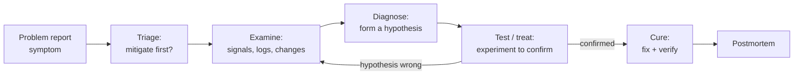
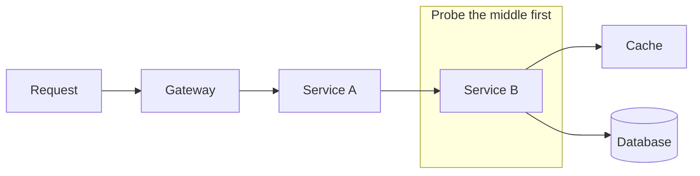
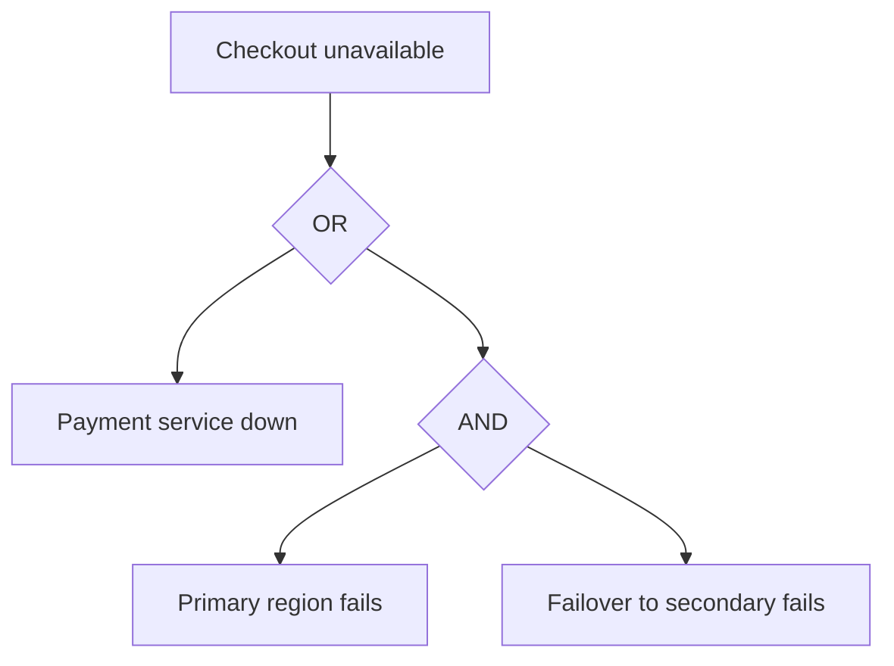
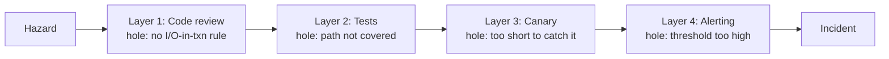

# Root-Cause Analysis & Troubleshooting

**Troubleshooting** is the real-time skill of moving from a *symptom* ("checkout latency is up")
to a *cause* you can act on, under time pressure, during an incident. **Root-cause analysis (RCA)**
is the after-the-fact discipline of understanding *why* the incident happened deeply enough to
prevent recurrence — it feeds the postmortem. This topic is about doing both **systematically**
(the scientific method applied to production) rather than by intuition, folklore, or random
flailing, and about the honest truth that in complex systems there is rarely a single "root" cause.

Grounded in the Google SRE book ("Effective Troubleshooting" chapter), Nygard's *Release It!*,
Richard Cook's "How Complex Systems Fail," James Reason's Swiss-cheese model, and the classic
quality-engineering RCA toolkit (5 Whys, Ishikawa/fishbone, fault-tree analysis).

> [!KEY-TAKEAWAY]
> Two ideas do most of the work in interviews. **(1) Change-first heuristic:** the large majority
> of incidents are triggered by a recent change (deploy, config push, flag flip, dependency
> version, traffic shift) — so *"what changed?"* is almost always the first and highest-yield
> question. **(2) The scientific method beats intuition:** observe the symptom, form a testable
> hypothesis, bisect the system to test it cheaply, keep or discard the hypothesis based on
> evidence, repeat. Don't confuse *correlation* with *causation*, and don't stop at the first
> plausible story — complex failures have *multiple contributing factors*, not one root cause.

> [!INTERVIEW]
> High-frequency prompts: *"a service just started erroring — walk me through your first five
> minutes"* (mitigate + ask what changed, not "read the code"), *"latency p99 is up but p50 is
> flat — what does that tell you?"*, *"what are the limits of 5 Whys?"*, *"correlation vs
> causation — give an example that fooled you,"* *"how do you localize which of 12 microservices
> is the slow hop?"* (distributed tracing / bisection), and *"is there always a single root
> cause?"* (no — say Swiss cheese / contributing factors). Strong answers lead with *stop the
> bleeding first, understand later* and name the change-first heuristic explicitly.

---

## Symptom vs cause vs trigger

Precise vocabulary keeps a diagnosis honest and keeps a postmortem useful.

- **Symptom** — the observable bad thing: elevated error rate, high latency, a full disk, angry
  users. Symptoms are what alerts fire on and what SLOs measure. You *mitigate* symptoms.
- **Proximate (immediate) cause** — the thing that directly produced the symptom: "the process
  ran out of file descriptors," "the connection pool was exhausted."
- **Trigger** — the change or event that set the failure in motion: a deploy, a config push, a
  traffic spike, a dependency slowing down. Triggers are *when/what kicked it off*.
- **Contributing factors / root causes** — the deeper conditions that made the trigger able to
  cause harm: a missing timeout, an unbounded queue, no back-pressure, a gap in review, an alert
  that was too noisy to notice. These are what a good RCA surfaces and what fixes target.

The classic confusion is treating the **proximate cause** as *the* root cause. "The pod OOM-killed"
is proximate; the root question is *why did memory grow unbounded, why was the limit set where it
was, and why did nothing catch it before prod?* Fixing only the proximate cause (bump the memory
limit) usually just moves the next failure a few weeks out.

> [!TIP]
> Interview tell: candidates who say "the root cause was that the server crashed" are describing a
> *symptom*. Strong candidates separate symptom → trigger → proximate cause → contributing factors,
> and note that mitigation targets the symptom while the fix targets the contributing factors.

---

## The scientific method for troubleshooting

The Google SRE model of troubleshooting is an explicit loop, not a vibe:

- **Triage** — assess impact and, crucially, decide whether to **mitigate before you diagnose**.
  If users are down, restoring service (roll back, fail over, shed load) comes *first*; full
  understanding can wait for the postmortem. Do not debug a burning building.
- **Examine** — look at the system: the four golden signals, dashboards, logs, traces, and
  **recent changes** (see observability for the telemetry mechanics). Observe before theorizing.
- **Diagnose** — form a *specific, testable* hypothesis about the mechanism ("the new query lacks
  an index, so DB CPU saturates, so requests queue"). Vague hypotheses ("the DB is unhappy") can't
  be tested.
- **Test/treat** — run the cheapest experiment that would *disconfirm* the hypothesis. Change one
  variable at a time. A hypothesis that survives a genuine attempt to break it is trustworthy.
- **Cure** — apply the fix and *verify the symptom actually resolves*; a symptom that clears for an
  unrelated reason (the traffic spike passed) will fool you into a wrong conclusion.

The anti-method is **random flailing**: changing several things at once, restarting components
hopefully, or "reading all the code" from the top. Flailing sometimes works but teaches nothing,
often makes things worse, and can't be repeated. The disciplined method is *slower per step but
converges*; flailing is *fast per step but may never converge*.

> [!WARNING]
> Changing several variables at once during an incident is the cardinal sin: if the symptom
> changes you won't know which change did it (or whether an unrelated factor did), and you may
> have introduced a new fault. One variable at a time, and write down what you did and when.

---

## The change-first heuristic

**Most incidents are caused by a change.** Google, Amazon, and virtually every large operator
report that the strong majority of production incidents are triggered by a recent
deploy, configuration push, feature-flag flip, or dependency/version update — systems that are
"just running" are usually stable. This makes *"what changed?"* the single highest-yield first
question in troubleshooting.

Practical mechanics:

- **Correlate the symptom's onset with the change timeline.** Line up the error-rate/latency
  inflection point against the deploy log, config-management history, flag-flip audit log, and
  infra changes. A symptom that starts at the same minute as a deploy is a prime suspect.
- **Roll back / disable the change first.** If a recent change correlates, reverting it is often
  the fastest mitigation — and rolling back *also tests the hypothesis* (symptom clears ⇒ the
  change was involved). This is why easy, fast rollback is a reliability superpower (see
  devops-cicd for deploy/rollback mechanics).
- **Beware the changes you don't own.** "We didn't deploy" ≠ "nothing changed": a dependency you
  call may have shipped, a config store flipped, a certificate expired, a cron ran, data crossed a
  threshold, or traffic changed shape. Widen the definition of "change" beyond your own repo.

> [!TIP]
> The change-first heuristic doesn't mean *blame* the change — it means *investigate it first*
> because that's where the base rate of causes is highest. If no change correlates, you widen to
> capacity/traffic, external dependencies, and slow-burn resource leaks.

---

## Signals to read: golden signals, RED, USE

You triage with a small, well-chosen set of signals rather than staring at every metric. The
*mechanics* of collecting and alerting on these belong to observability; here is what each tells
you diagnostically.

- **Four golden signals** (Google SRE): **Latency**, **Traffic**, **Errors**, **Saturation**.
  - *Latency* — split successful vs failed latency (a fast error can hide behind a good p50).
  - *Traffic* — demand on the system (req/s, tx/s); a spike is a common trigger.
  - *Errors* — rate of failed requests (explicit 5xx, and implicit — wrong answers, timeouts).
  - *Saturation* — how "full" the most constrained resource is (CPU, memory, threads, connections,
    IOPS). Saturation is the leading indicator of impending overload.
- **RED** (services, from Tom Wilkie): **Rate, Errors, Duration** — a request-centric subset,
  ideal for a stateless request handler.
- **USE** (resources, from Brendan Gregg): **Utilization, Saturation, Errors** — for every
  resource (CPU, disk, NIC, pool). Great for the "which resource is the bottleneck?" question.

Diagnostic reading of latency percentiles is a favourite interview probe:

| Observation | What it suggests |
|---|---|
| p50 flat, p99 up | A *subset* of requests is slow — a slow shard, a cold cache, a GC pause, one bad host, or tail contention. Not a global problem yet. |
| p50 and p99 both up | A *systemic* slowdown — saturated shared resource, a slow dependency on the common path, or an inefficient new code path. |
| Errors up, latency **down** | Requests are failing *fast* — circuit breaker open, fast rejection/load-shedding, or an early validation error. |
| Latency up, errors flat (yet) | Queuing/saturation building; errors and timeouts usually follow if unaddressed. |
| Traffic down *and* errors up | You may be *causing* the traffic drop (clients giving up) — look upstream. |

> [!TIP]
> "Averages lie." Always reason in **percentiles** (p50/p90/p99/p99.9), because tail latency is
> where user pain and saturation show up first, and an average blends the healthy majority with
> the suffering tail. See observability for percentile/histogram mechanics.

---

## Bisection: localizing the fault

When the failure could be anywhere in a request path spanning many components, **bisection**
(divide and conquer) localizes it in O(log n) probes instead of O(n) guesses — the same idea as
`git bisect` for code and binary search for data.

- **Along the request path:** the request touches gateway → service A → service B → cache → DB.
  Test the *middle*: is B's dependency healthy? If yes, the fault is upstream of B; if no, it's at
  or below B. Each probe halves the suspect space. **Distributed tracing** makes this near-instant
  by showing the per-hop latency of a single request — the "slow hop" lights up (see observability
  for tracing mechanics).
- **Along time (`git bisect`):** if a bug appeared between two known-good/known-bad commits, binary
  search the commit range, testing the midpoint each time — finds the offending commit in
  ⌈log₂ N⌉ tests (e.g. ~10 tests across 1000 commits).
- **Along the population:** if only *some* requests fail, bisect by dimension — region, AZ, host,
  customer tier, API version, shard, canary vs baseline. The dimension that cleanly separates
  good from bad points at the cause. This is **differential diagnosis** (next section).

> [!TIP]
> Distributed tracing collapses path-bisection: instead of manually probing each hop, one trace of
> a slow request shows exactly which span dominates end-to-end latency. If you don't have tracing,
> bisection by hand is the fallback — and "we couldn't localize the slow hop" is itself an
> observability gap worth an action item.

---

## Differential diagnosis and what-changed axes

Borrowed from medicine: enumerate the *plausible causes*, then use evidence to systematically rule
them out rather than fixating on the first idea. In practice you slice the symptom along axes and
find the one that separates healthy from unhealthy:

- **Where:** which region / AZ / cluster / host / shard / pod? (One bad host? A whole AZ?)
- **Who:** which customers / tenants / API versions / clients? (A single big customer's traffic?)
- **What:** which endpoint / query / operation / feature flag? (Only the new endpoint?)
- **When:** onset time — correlate with deploys, cron jobs, traffic peaks, TTL/cert expiries,
  month-end batch, a counter overflowing.

If a symptom is **isolated** to one slice (one host, one shard, one customer), the cause is usually
*specific* (a bad node, a hot key, a poison-pill payload). If it's **uniform** across all slices,
the cause is usually *shared* (a common dependency, a global config, a version rolled everywhere).
That single distinction — isolated vs uniform — routes the entire investigation.

---

## Correlation vs causation

Two signals moving together does **not** mean one caused the other. Common traps:

- **Common cause (confounder):** CPU and latency both spike — but a *third* thing (a traffic surge)
  drove both; "high CPU" isn't the root, the surge is.
- **Reverse causation:** you see retries spike and errors spike and conclude retries are a symptom —
  but retries may be *amplifying* the errors (retry storm; see cascading-failures).
- **Coincidence:** the graph you happened to open moved at the same time; you didn't check the
  hundred graphs that also moved or the ones that didn't.
- **Post hoc:** "the error started after the deploy, so the deploy caused it" is a *strong prior*
  (change-first!) but still a hypothesis — confirm it (roll back and watch, or find the mechanism).

The discipline: to promote a correlation to a cause, demand a **plausible mechanism** ("this query
has no index → DB CPU saturates → requests queue"), and ideally an **intervention** (roll back the
change / remove the load and watch the symptom resolve). Correlation *narrows* the search; a
mechanism plus a confirming intervention *establishes* causation.

> [!WARNING]
> "It's always the network / the database / GC." Blaming the usual suspect without evidence is
> confirmation bias — you'll find some graph that "confirms" it because something is always a bit
> elevated. Test the hypothesis; don't just find a graph that agrees with your prior.

---

## 5 Whys and its limits

**5 Whys** (Toyota Production System) is the simplest RCA technique: repeatedly ask "why?" —
roughly five times — to walk from a symptom down a chain of causes to something actionable.

Example:
1. The site was down. *Why?* The app couldn't reach the database.
2. *Why?* The connection pool was exhausted.
3. *Why?* A new endpoint held connections during a slow external call.
4. *Why?* It called the third party inside the DB transaction with no timeout.
5. *Why?* Our review checklist has no rule about I/O inside transactions, and load tests didn't
   cover that path. → **Actionable**: add a timeout, move the call outside the transaction, add a
   review-checklist item and a load test.

**Limits (a very common interview question):**

- **It's linear** — a single chain — but real failures have **multiple contributing factors** that
  interact. 5 Whys can miss the parallel causes it doesn't happen to walk down.
- **It can stop too early** (stopping at "human error" or a convenient blameworthy answer) or
  **run too deep / arbitrarily** ("...because the universe has entropy"). "Five" is a rule of
  thumb, not a law.
- **It's biased by the asker** — the chain follows whatever the facilitator finds intuitive, so it
  can rationalize a pre-formed conclusion. Two people often produce two different chains.
- **It tends toward blame** ("why did the engineer push the bad config?") unless deliberately
  steered toward *systemic* factors (see blameless-postmortems).

Use it for simple, mostly-linear problems; escalate to fishbone or fault-tree analysis when
causes are multiple or interacting.

---

## Fishbone (Ishikawa) diagrams

A **fishbone / Ishikawa / cause-and-effect diagram** counters 5 Whys' linearity by forcing you to
brainstorm causes across **multiple categories** at once, so you don't tunnel down one branch. The
effect (the symptom) is the fish's head; major cause categories are the bones.

For software/SRE, useful categories are **People, Process, Technology, and Environment** (an
adaptation of the classic manufacturing "6 Ms" — Manpower, Method, Machine, Material,
Measurement, Milieu):

| Category | Example contributing factors |
|---|---|
| **People** | Missing on-call runbook, unclear ownership, alert fatigue, knowledge silo |
| **Process** | No canary stage, review gap, no rollback plan, change not communicated |
| **Technology** | Missing timeout, unbounded queue, no circuit breaker, index missing, resource leak |
| **Environment** | Dependency outage, DNS/cert expiry, cloud-provider AZ event, traffic surge |

The value is **breadth before depth**: it surfaces the several factors that *combined* to produce
the failure, matching the reality that complex outages are multi-causal. Its weakness is that it
enumerates *candidate* causes without ranking them — it doesn't tell you which mattered most, so
you still need evidence (and often a fault tree) to prioritize.

---

## Fault Tree Analysis (FTA)

**Fault tree analysis** is a top-down, deductive technique: start with the undesired top event
("checkout unavailable") and decompose it through **Boolean logic gates** into the combinations of
lower-level faults that could cause it.

- An **OR gate** means *any* child event alone causes the parent (single points of failure — the
  dangerous kind). A path of ORs down to a single basic event is a single point of failure.
- An **AND gate** means *all* children must occur together — this is your **defense in depth**;
  redundancy and layered safeguards turn ORs into ANDs so no single fault is sufficient.

FTA shines for **quantifying** reliability: assign each basic event a probability and you can
compute the top event's probability, and identify **minimal cut sets** (the smallest sets of
failures that together bring the system down). A cut set of size 1 is a single point of failure and
your highest-priority fix. It's heavier-weight than 5 Whys — used more for *proactive* design
review and safety-critical systems than for a 2 a.m. incident — but conceptually it's the rigorous
form of "what would have to fail for this to happen?"

| Technique | Direction | Best for | Handles multiple causes? | Effort |
|---|---|---|---|---|
| **5 Whys** | Bottom-up, linear | Simple, single-chain problems; quick postmortem starter | Poorly (one chain) | Very low |
| **Fishbone** | Brainstorm by category | Surfacing *breadth* of contributing factors | Yes (categories) | Low |
| **Fault tree (FTA)** | Top-down, deductive | Design review, SPOF hunting, quantified risk, safety-critical | Yes (AND/OR logic) | High |

---

## The myth of THE single root cause

A staff-level view, and a frequent senior interview question: **complex systems do not have a
single root cause.** Richard Cook's "How Complex Systems Fail" and James Reason's **Swiss-cheese
model** describe why.

- Complex systems run in a **degraded mode as normal** — there are always latent faults present;
  the system works *despite* them because of redundancy and human adaptation.
- Each defense layer (review, tests, canary, monitoring, rate limits, on-call) is a slice of Swiss
  cheese with holes. An accident happens only when the **holes momentarily line up** so a hazard
  passes through *every* layer at once. Removing any one hole would have stopped it — which is
  exactly why there is no single "the" cause.
- Therefore **"the root cause" is a choice, not a discovery.** Picking one cause is usually a
  stopping rule driven by convenience or blame, and it under-invests in the *other* holes that also
  had to align.

The operational consequence: a good RCA lists **multiple contributing factors** and generates
**multiple, layered action items** (fix the timeout *and* the review gap *and* the canary duration
*and* the alert threshold), so the next time the holes won't line up the same way. Insisting on one
root cause is an anti-pattern that leads to shallow fixes and repeat incidents. (This is the RCA
side of blameless-postmortems, which owns the write-up and follow-through.)

> [!WARNING]
> "Human error" is never a root cause — it's a *starting point*. If a person could cause an outage
> with one mistake, the system's defenses (the other cheese slices) are the real story. Stopping at
> "the engineer ran the wrong command" is the classic too-early stop and the classic blame trap.

---

## Tools of the trade (cross-references)

You *localize with signals and tools*, but the telemetry stack itself is owned by observability —
here's how each is used diagnostically:

- **Metrics** — spot *that* something is wrong and *when* it started (golden signals, saturation).
  Best for detection and trend/onset; weak at explaining a single request.
- **Logs** — the *what/why* detail for specific events and errors; structured logs + correlation
  IDs let you follow one request. Best for the last-mile "what exactly happened."
- **Distributed traces** — the *where*: which hop in a multi-service request is slow or failing.
  Best for localization in a call graph (the "slow hop"). See observability.
- **Change/audit logs** — deploy history, config-management diffs, flag audit, infra events. The
  change-first heuristic lives here.
- **Profilers / flame graphs** — for CPU/memory hot spots once you've localized to a process.

The mental model: **metrics tell you *that* and *when*; traces tell you *where*; logs tell you
*what/why*; the change log tells you *what you did to yourself*.** Start broad (metrics), localize
(traces/bisection), confirm (logs), and cross-check against changes throughout.

---

## Common Interview Follow-ups

- **"A service just started returning 5xx. Walk me through your first five minutes."** — Assess
  impact/scope; mitigate if users are down (be ready to roll back); ask *what changed* (deploys,
  config, flags, dependencies) and line it up against the onset; read the golden signals; form one
  testable hypothesis; bisect to localize. Lead with *mitigate then diagnose*, and the change-first
  heuristic.
- **"p99 latency is up but p50 is flat — what does that tell you?"** — A subset of requests is
  slow, not all: a hot shard, a cold/one bad host, GC pauses, tail contention, or a slow customer.
  Global p50+p99 rise instead points at a shared saturated resource or a common-path dependency.
- **"What are the limits of 5 Whys?"** — Linear/single-chain (misses parallel causes), stops too
  early or goes arbitrarily deep, biased by the asker, drifts toward blame. Escalate to fishbone
  (breadth) or FTA (AND/OR logic) for multi-causal problems.
- **"Is there always a single root cause?"** — No. Swiss-cheese/Cook: complex failures need
  multiple defense holes to align; "the root cause" is a stopping choice. Deliver multiple
  contributing factors and layered action items.
- **"Correlation vs causation — how do you tell?"** — Demand a plausible mechanism plus a
  confirming intervention (roll back / remove load and watch). Watch for confounders, reverse
  causation, coincidence, and post-hoc reasoning.
- **"There are 12 microservices — how do you find the slow one?"** — Distributed tracing shows the
  slow span directly; without it, bisect the call path (test the middle) and slice by region/host/
  customer (differential diagnosis).
- **"You reverted the deploy and the symptom cleared — are you done?"** — You've *mitigated* and
  confirmed the change was involved, but not found *why the change was harmful* nor why defenses
  didn't catch it. That's the RCA/postmortem, and it should yield layered fixes.
- **"When would you NOT roll back first?"** — When the change also carried a data migration that
  can't be reversed, when rollback is slower than a forward fix, or when the change is provably
  unrelated to the onset. Otherwise, fast rollback is usually the safest mitigation.

## References

- Google, *Site Reliability Engineering*, ch. "Effective Troubleshooting" and "Managing Incidents";
  *The SRE Workbook* — https://sre.google/books/
- Michael T. Nygard, *Release It!* (2nd ed.) — stability patterns and failure analysis.
- Richard I. Cook, *How Complex Systems Fail* (1998/2000) — the multi-cause view.
- James Reason, *Human Error* / *Managing the Risks of Organizational Accidents* — the Swiss-cheese
  model of layered defenses.
- Kaoru Ishikawa — cause-and-effect (fishbone) diagrams; Toyota Production System — 5 Whys.
- NUREG-0492, *Fault Tree Handbook* (U.S. NRC) — canonical FTA reference.
- Brendan Gregg, "The USE Method"; Tom Wilkie, "The RED Method"; Google SRE, "The Four Golden
  Signals" — cross-ref observability for telemetry/alerting mechanics.
- Related topics in this domain: `observability/*` (telemetry, tracing, SLO alerting),
  `blameless-postmortems-and-learning`, `cascading-failures-and-antipatterns`,
  `incident-response-and-command`, `devops-cicd/*` (deploy & rollback mechanics).
