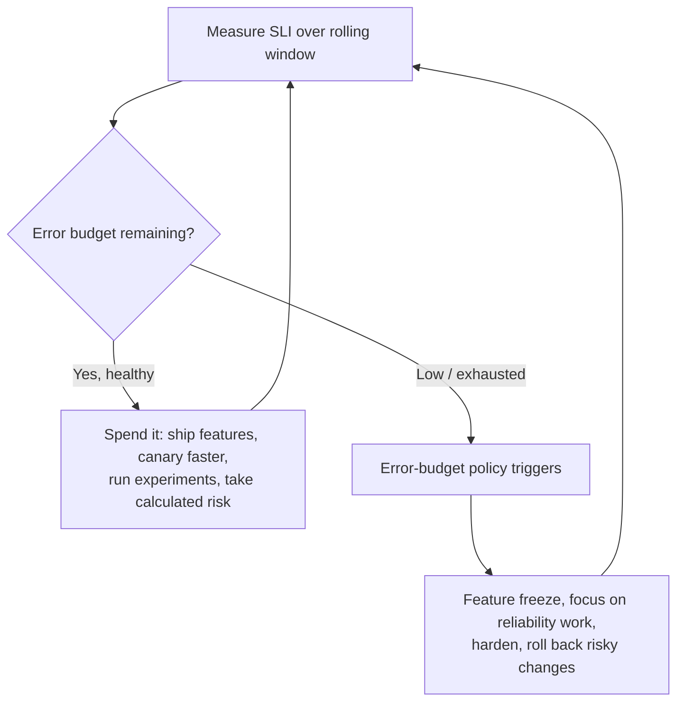

# SLOs, Error Budgets & the Reliability–Velocity Tradeoff

Reliability is not a feeling — it is a **measured quantity you set a target for and then
manage like a budget**. This topic is the conceptual backbone of Site Reliability
Engineering: how you define an **SLI** (a number you measure), turn it into an **SLO** (a
target for that number), distinguish it from the customer-facing **SLA** (a contract with
consequences), and then use the leftover — the **error budget** — as the currency that
decides whether the team ships fast or slows down to fix reliability. Getting this right is
what lets an org make the reliability-vs-velocity tradeoff **with data instead of politics**.

This is the **reliability-concepts** view. The *mechanics* of measuring and alerting on these
targets — recording rules, multi-burn-rate alert windows, PromQL — live in
`observability/slo-based-alerting-and-error-budgets`. The DevOps-culture framing of
SRE/SLA/SLO/SLI lives in `devops-cicd/sre-sla-slo-sli`. Here we own the **decision framework**:
what these numbers *mean*, how to pick good ones, and how they drive engineering behavior.

> [!KEY-TAKEAWAY]
> The whole model is a chain: **SLI → SLO → error budget → policy**. You *measure* an SLI,
> *target* it with an SLO, the gap between 100% and the SLO is your *error budget*, and an
> agreed-upon *error-budget policy* says what the org does when that budget is spent. Break any
> link and the rest is theatre — an SLO with no policy attached changes no one's behavior.

> [!INTERVIEW]
> Extremely high-frequency probes: *"difference between SLI, SLO, and SLA?"*, *"what is an
> error budget and how do you compute it?"*, *"why is 100% availability the wrong target?"*,
> *"budget is exhausted mid-quarter — what happens?"*, *"how do you choose a good SLI?"*, and
> *"should the SLA be tighter or looser than the SLO?"* (looser — always). Senior twist:
> *"engineering wants to ship, SRE wants to freeze — how does the error budget resolve that
> without a turf war?"*

---

## SLI — the Service Level Indicator

An **SLI (Service Level Indicator)** is a **quantitative measurement of some aspect of the
level of service being provided** — a number, usually a ratio, that reflects what a user
actually experiences. It is *not* the target; it is the *reading on the gauge*.

The canonical SLI form recommended by Google is a **ratio of good events to valid events**,
expressed as a percentage:

```
SLI = good events / valid events × 100%
```

Framing every SLI this way has real benefits: it is naturally bounded 0–100%, it aggregates
cleanly, and 100% always means "perfect" while 0% means "nothing works." Concrete examples:

| SLI type | Good events / valid events |
|---|---|
| **Availability** (request success rate) | successful requests / all valid requests |
| **Latency** | requests served faster than 300 ms / all valid requests |
| **Quality / correctness** | responses served without degradation / all responses |
| **Freshness** (data pipelines) | records processed within freshness target / all records |
| **Durability** | objects intact / objects stored |

Two mechanism points interviewers probe:

- **Measure as close to the user as possible.** A server-side 200-OK count misses load-balancer
  errors, DNS failures, and client timeouts. Measuring at the load balancer or via
  client-side/synthetic probes captures more of the real experience — but is harder to attribute.
- **Latency SLIs must use a percentile or a threshold count, never a mean.** An average hides
  the tail; a p99 or a "% of requests under 300 ms" count reflects the users who are actually
  suffering. Averages are the classic SLI anti-pattern.

> [!TIP]
> "Valid events" matters. You typically **exclude** requests that aren't the service's fault
> from the denominator — e.g. `4xx` client errors (a malformed request isn't your outage), or
> health-check traffic. Counting `400`s against your availability SLI punishes you for your
> clients' bugs. (How you *express* this in a query is an observability concern.)

The full mechanics of computing SLIs from metrics — Prometheus counters, recording rules,
`rate()` windows — belong to `observability/slo-based-alerting-and-error-budgets`.

## SLO — the Service Level Objective

An **SLO (Service Level Objective)** is a **target value or range for an SLI, measured over a
window**. It is the internal reliability goal the team commits to. A complete SLO always has
three parts:

1. **An SLI** — what is measured (e.g. proportion of requests served in < 300 ms).
2. **A target** — the threshold (e.g. ≥ 99.9%).
3. **A time window** — over which it is evaluated (e.g. a rolling 28 days).

> A fully specified SLO: *"99.9% of valid HTTP requests will complete successfully in under
> 300 ms, measured over a rolling 28-day window."*

**Why a 28-day rolling window (not a calendar month)?** A rolling window keeps the budget
consistent (every day it covers the same duration, so weekday/weekend traffic mix is stable)
and avoids the "budget resets on the 1st" cliff that tempts teams to gamble at month-end.
Google's Workbook recommends rolling windows; four weeks (28 days) keeps the day-of-week
distribution constant. Longer windows (90 days) are steadier but slower to react; shorter
windows are noisier.

Choosing the *target* is a judgment call, not a math problem: it should be **just high enough
that users are happy, and no higher**. Setting it from current measured performance ("we've
been running 99.92%, so target 99.9%") is a reasonable starting point; setting it aspirationally
high with no plan to hit it just guarantees a permanently-burned budget.

> [!WARNING]
> An SLO is an **internal** engineering target and should be **stricter** than any external SLA.
> If your SLA promises 99.9%, your SLO should be tighter (say 99.95%) so you get an early-warning
> buffer *before* you breach the contract and owe refunds. See the SLA section.

## SLA — the Service Level Agreement (contract)

An **SLA (Service Level Agreement)** is an **explicit or implicit contract with your users that
includes consequences** — financial (service credits, refunds) or reputational — for
**meeting or missing** the SLOs it contains. The SLA is a business/legal artifact; the SLO is an
engineering artifact.

The defining relationship interviewers want:

> [!KEY-TAKEAWAY]
> **The SLA is always looser (lower) than the SLO, which is stricter than or equal to the
> measured SLI you aim for.** Order of strictness: internal alerting thresholds > SLO > SLA.
> The gap between SLO and SLA is a deliberate **safety margin** — you want to be paging and
> fixing well before you're paying out contract penalties. If your SLA is 99.9%, running an
> internal SLO of 99.95% gives you room to react before customers are owed credits.

| | SLI | SLO | SLA |
|---|---|---|---|
| **What it is** | A measurement | An internal target for that measurement | A contract with consequences |
| **Audience** | Engineers/monitoring | Engineering + product | Customers / legal / sales |
| **Consequence of missing** | None (it's just a number) | Error budget burns → policy triggers | Money (credits/refunds) + reputation |
| **Strictness** | — | Stricter than the SLA | Loosest of the three |
| **Example** | "99.92% of requests succeeded last 28 days" | "≥ 99.95% success over 28 days" | "≥ 99.9% monthly or 10% credit" |

Not every service needs an SLA. Internal services often have **SLOs but no SLA** — there is no
external customer to compensate. Public cloud services almost always publish SLAs (e.g. many
AWS services publish a **99.9%** or **99.99%** monthly SLA with tiered service credits). The SLA
is deliberately conservative because breaching it costs real money.

## Error budget — the leftover, and the math

The **error budget** is the amount of unreliability you are **allowed** to have — it is simply
what's left over after the SLO:

```
error budget (as a fraction) = 100% − SLO
```

- SLO 99.9% → error budget = **0.1%** of requests/time may fail.
- SLO 99.99% → error budget = **0.01%**.
- SLO 99% → error budget = **1%**.

Over a time window it converts to **allowed bad events** or **allowed downtime**:

```
allowed error events  = (1 − SLO) × total valid events
allowed downtime (time-based) = (1 − SLO) × window length
```

The **nines → downtime** table every SRE candidate should know cold:

| Availability | Error budget | Downtime / year | Downtime / 30-day month | Downtime / week | Downtime / day |
|---|---|---|---|---|---|
| 90% ("one nine") | 10% | 36.5 days | 3 days | 16.8 h | 2.4 h |
| 99% ("two nines") | 1% | 3.65 days | 7.2 h | 1.68 h | 14.4 min |
| 99.9% ("three nines") | 0.1% | 8.76 h | 43.2 min | 10.1 min | 1.44 min |
| 99.95% | 0.05% | 4.38 h | 21.6 min | 5.04 min | 43 s |
| 99.99% ("four nines") | 0.01% | 52.6 min | 4.32 min | 1.01 min | 8.6 s |
| 99.999% ("five nines") | 0.001% | 5.26 min | 25.9 s | 6.05 s | 0.86 s |

> [!TIP]
> Memory aids: **three nines ≈ 8.76 hours/year ≈ 43 min/month**; each additional nine divides
> downtime by **10**. "Five nines" is ~5 minutes/year — which is *less than a single human
> reaction to a pager*, so it can only be achieved with fully automated failover.

A **request-based** budget (fraction of requests) and a **time-based** budget (fraction of
minutes the service is "down") are two ways to count the same idea; request-based is usually
preferred because it weights busy periods correctly and doesn't require defining what a "down
minute" means.

## Error budget as currency — the reliability–velocity tradeoff

This is the **central insight of the whole topic** and the most common senior interview
question. The error budget reframes reliability from a source of conflict into a shared
resource:

- **Product/dev teams** want to **ship features fast** — every change (deploy, config, migration,
  experiment) carries risk of causing errors.
- **SRE/reliability** wants the service to **stay up**.

Historically these two pull against each other. The error budget dissolves the conflict:
**both teams share one budget, and spending it is not just allowed — it's the point.**

> [!KEY-TAKEAWAY]
> The error budget is a **currency you spend on velocity and risk.** As long as the SLO is met
> (budget remaining), the team has "money in the bank" to spend on shipping fast, aggressive
> rollouts, risky migrations, and experiments. When the budget is **exhausted**, the policy
> flips the team's priority to reliability until the budget recovers. **A missed SLO is a
> signal to slow down, not a moral failing.**



Crucially, this makes the tradeoff **objective**: nobody argues about whether to slow down —
the budget number decides. It also removes the perverse incentive to make the service *too*
reliable (see "Why 100% is the wrong target"). A service that consistently **beats** its SLO by
a wide margin is *over-invested in reliability* and should either **ship faster** or **lower the
SLO** to free the team up — an unspent budget is wasted velocity.

> [!INTERVIEW]
> The scenario: *"It's mid-quarter, you've burned 90% of the error budget, and product wants to
> launch a big feature Friday."* Strong answer: consult the **error-budget policy**, which was
> agreed in advance. Likely: no risky launches until budget recovers; the feature ships behind a
> flag / dark-launch, or with a slow canary and instant rollback; reliability work is
> prioritized. The key is that this is **pre-negotiated**, so it isn't a fight *during* the
> incident.

## Error-budget policy — what happens when it burns

An SLO without a **policy** changes no behavior. The **error-budget policy** is a document,
**agreed and signed off in advance by engineering, product, and leadership**, that specifies
the concrete actions taken at different budget states. It is the enforcement mechanism.

A typical tiered policy:

| Budget state | Action |
|---|---|
| **Healthy** (budget remaining, low burn) | Normal velocity; ship features, run experiments, take calculated risks. |
| **Warning** (burning fast / < ~25% left) | Increase scrutiny: slower canaries, extra review on risky changes, prioritize reliability tickets. |
| **Exhausted** (budget spent / SLO missed) | **Feature freeze** — only reliability fixes and rollbacks ship until budget recovers. Postmortem the burn. |
| **Persistently over-budget** (SLO beaten by a wide margin for a long time) | Reliability is *over*-invested: raise velocity, loosen the SLO, or reduce redundancy cost. |

Design principles that make a policy work:

- **Pre-agreed and executive-backed.** The whole value is that the freeze isn't debated during a
  crisis. Leadership signs off so a VP can't override it on a whim.
- **Automatic, not discretionary.** The budget state, not a person's opinion, triggers the action.
- **Applies to everyone, including SRE.** If SREs cause the burn (e.g. a bad migration), the same
  freeze applies.
- **Has an escape hatch for emergencies.** Security patches and legal/regulatory changes ship
  regardless of budget — a policy names these exceptions explicitly.

> [!WARNING]
> The most common failure mode is an **SLO with no teeth**: dashboards show a burned budget but
> nothing changes because there is no agreed policy (or leadership overrides it every time). At
> that point the SLO is vanity metrics. If a team never enforces the freeze, the SLO is either
> wrong (too strict) or the org isn't serious about reliability.

## Choosing good SLIs — the happiness test and request/response ratio

Picking the *right* thing to measure is harder than the math. Guiding principles:

- **The request/response ratio ("good/valid") is the default form** for request-driven services
  — see the SLI section. It's bounded, aggregatable, and interpretable.
- **The happiness test:** the ideal SLO target is the point where a user is *just* happy — if the
  SLI drops below it, users notice and are annoyed; above it, they can't tell the difference.
  This is why picking the target is about *user experience*, not internal round numbers.
- **Measure what the user cares about, not what's easy to collect.** CPU utilization is not an
  SLI — a user doesn't care about your CPU; they care whether their request succeeded and was
  fast. SLIs should map to user-visible symptoms (this overlaps the "four golden signals" —
  latency, traffic, errors, saturation — which live in the observability domain; saturation is a
  *cause*, not a user-facing SLI).
- **Have few SLOs.** A handful of SLOs that matter beats dozens nobody watches. Every SLO you add
  is an alerting and decision surface; too many dilutes attention and creates conflicting signals.
- **Keep SLIs simple and robust.** A complex SLI nobody understands can't drive a decision.

The **types of SLI** worth having usually cluster into a small set: **availability**,
**latency**, **quality/correctness**, and for data systems **freshness/throughput/durability**.

## Availability vs latency SLOs

Availability ("did it work?") and latency ("was it fast?") are the two workhorse SLOs, and they
interact:

- **Availability SLO** — proportion of requests that succeed. A `500` or a timeout burns budget.
- **Latency SLO** — proportion of requests served within a threshold. Here you must pick both a
  **percentile/threshold** and be careful about the tail. A common pattern is *multiple latency
  targets*: e.g. "90% of requests < 100 ms **and** 99% of requests < 300 ms" — this pins both the
  typical experience and the tail without a single overly-strict number.

> [!TIP]
> A request that is **too slow is effectively unavailable** — if latency exceeds the client's
> timeout, the user experiences an error. Well-designed SLOs make the latency threshold consistent
> with client/timeout behavior so the two SLIs tell a coherent story. (Timeout budgets themselves
> live in `retries-timeouts-and-backoff`.)

Trade-off: a strict latency SLO can force you to shed load or degrade features under stress to
keep the tail fast (see `load-shedding-and-backpressure` and `graceful-degradation-and-fallbacks`),
which may in turn cost availability. The budget framework lets you decide *which* to protect.

## User-journey SLOs

Per-endpoint SLIs miss the forest for the trees. A **user-journey (critical-user-journey / CUJ)
SLO** measures the reliability of a **complete, user-visible flow** — e.g. "search → add to cart →
checkout" — rather than a single RPC. Rationale:

- Users don't experience endpoints; they experience **journeys**. Every microservice can be at
  99.9% while the end-to-end checkout is far worse, because the journey's success is the
  **product** of its dependencies' successes.
- **Serial dependency math:** if a journey calls N services each with availability `a`,
  end-to-end availability ≈ `a^N`. Five services at 99.9% each → `0.999^5 ≈ 99.5%` — noticeably
  worse than any single link. This is why deep dependency chains erode reliability and why you
  budget at the journey level. (The architectural side of this — dependency reduction, redundancy —
  lives in `system-design` and `redundancy-failover-and-health-checks`.)
- Journey SLOs align the SLO with **business outcomes** (completed checkouts) rather than
  technical internals.

> [!KEY-TAKEAWAY]
> Prioritize SLOs on the **critical user journeys** first. A 99.99% health-check endpoint is
> worthless if the checkout flow is at 99%. Budget where the user's money and patience are.

## Why 100% is the wrong target

Interviewers love this because the intuitive answer ("more reliable is always better") is wrong.
Reasons 100% is the wrong reliability target:

1. **It's effectively unachievable and the cost is exponential.** Each additional nine roughly
   **10×**s the cost (more redundancy, more regions, more automation, more on-call) while the
   *marginal* user benefit shrinks. Going 99.9% → 99.99% is expensive; → 99.999% is often
   absurdly so.
2. **The user can't tell the difference.** A user's own ISP, Wi-Fi, phone, and the public
   internet are often less reliable than ~99.9%. Making the *backend* 99.999% is invisible to a
   user whose device is only "available" 99% of the time — you're paying for reliability the user
   literally cannot perceive.
3. **It removes the error budget entirely.** A 100% target means *zero* budget, which means
   **zero tolerance for change** — no deploys, no experiments, no migrations, because any of them
   might cause a single error. That freezes velocity permanently. The budget *exists* precisely
   so the team can spend it on shipping.
4. **It creates a brittle, change-averse culture.** Chasing 100% punishes every failure, which
   drives teams to hide incidents, avoid risk, and stop innovating.

> [!KEY-TAKEAWAY]
> The right target is **"reliable enough" — the lowest number at which users are happy** — not the
> highest number achievable. 100% is not just impractical; it is the *wrong goal*, because a
> non-zero error budget is what buys you the freedom to change the system at all.

## Burn rate — the concept

**Burn rate** is **how fast you are consuming the error budget, relative to the rate that would
exactly exhaust it over the SLO window.** It's a dimensionless multiplier:

```
burn rate = observed error rate / (allowed error rate for the SLO)
```

- **Burn rate = 1** → you'll spend the *entire* budget exactly at the end of the window (on pace).
- **Burn rate = 2** → you're spending twice as fast; the budget lasts **half** the window.
- **Burn rate = 10** → budget gone in **1/10th** of the window.

Worked example: an SLO of 99.9% over 30 days gives a 0.1% budget. If the service is currently
erroring at **1%**, the burn rate is `0.01 / 0.001 = 10×` — the entire month's budget would be
gone in **3 days**. That's an emergency; a burn rate barely above 1 is not.

Why the concept matters here: burn rate is what turns a static budget into an **actionable
signal**. A high burn rate over a short window means *page someone now*; a mildly-elevated burn
over a long window means *investigate this week*. That is exactly why alerting uses **multiple
burn-rate thresholds over multiple windows** (fast burn = page, slow burn = ticket) to be both
sensitive and precise without alert fatigue.

> [!KEY-TAKEAWAY]
> Here we own burn rate as a **concept**: budget-consumption speed as a multiplier, and *why*
> it's the right signal (fast burn = urgent, slow burn = not). The **measurement and alerting
> mechanics** — the specific multi-window multi-burn-rate rules (e.g. 14.4× over 1 h, 6× over
> 6 h), recording rules, and alert tuning — belong to
> `observability/slo-based-alerting-and-error-budgets`. Don't reinvent them here; point to them.

## SLI specification vs implementation

A subtle but *senior-defining* distinction from the SRE Workbook (Ch. 2): an SLI has a
**specification** and an **implementation**, and they are not the same thing.

- **SLI specification** — the *user-facing outcome* you care about, stated independently of how
  you measure it. Example: *"the proportion of home-page requests served in under 100 ms."*
- **SLI implementation** — the specification **plus a concrete measurement source**. The *same*
  spec has *many* implementations, each producing a **different number**.

Example implementations of that one spec:

- Parse **application-server logs** for requests to `/` and their served latency.
- Read a **load-balancer** metric for the same route.
- Fire **synthetic/black-box probes** from outside.
- Instrument the **browser (RUM)** to capture what the user's device actually saw.

> [!KEY-TAKEAWAY]
> One SLI *specification* → many *implementations* that trade off **quality, coverage, and
> cost**. This is why "measure close to the user" is not a slogan: the LB, app-server, and client
> report *different* availability for the *same* SLO. Interviewers use this to separate people who
> memorized "good/valid" from people who understand *why the number changes with the source*.

### The measurement-source ladder — quality vs coverage vs cost

Sources, ordered by increasing **user-fidelity (quality)**:

| Source | Quality (user-fidelity) | Coverage | Cost / attribution difficulty |
|---|---|---|---|
| App-server logs / metrics | Lowest — misses everything before the app | Only requests that *reached* you | Cheap, easy to attribute |
| Load-balancer metrics | Higher — catches some pre-app errors | Requests that reached the LB | Cheap, moderate attribution |
| Black-box / synthetic probes | Higher — exercises the real path | Only the paths you script | Moderate; not real user traffic |
| Client-side / RUM | Highest — what the user's device saw | All real users, all paths | Costly, hardest to attribute (client bugs, ad-blockers, offline) |

Each rung moves *closer to the user* (higher quality) but is harder to attribute a failure to
your service and more expensive to run. There is no free lunch — pick the rung that best balances
fidelity against cost for the decision the SLO drives.

## The SLI menu — request, pipeline, and storage archetypes

The Workbook keys the menu of SLI types to **three component archetypes**. Knowing which
archetype a component is tells you which SLIs are even *relevant*.

| Archetype | Relevant SLIs | Meaning |
|---|---|---|
| **Request-driven** (serves requests) | **Availability**, **latency**, **quality** | Did it respond, was it fast, was the response full-fidelity (not degraded)? |
| **Pipeline** (processes data → output) | **Freshness**, **correctness**, **coverage** | Is output recent enough, is it right, and did we process *all* the input we should have? |
| **Storage** | **Durability** | Do stored objects survive over time? |

Two archetype-specific SLIs the earlier table under-named:

- **Correctness** (pipeline) — the fraction of records that produced the *right* answer. Distinct
  from freshness (recent) and coverage (complete).
- **Coverage** (pipeline) — the fraction of *valid input* that was actually processed. A pipeline
  can be fresh and correct on the 80% it processed while silently dropping 20% — coverage is the
  SLI that catches that.

> [!TIP]
> The Workbook's rule of thumb: **choose five or fewer SLI types** that cover the component's
> critical functionality. More than that dilutes attention and creates conflicting signals (this
> reinforces "have few SLOs" from the choosing-good-SLIs section).

## Request-based vs windows-based SLOs

"Request-based vs time-based" is often stated imprecisely. The real distinction the Workbook and
cloud providers draw:

- **Request-based SLO** — count *individual* good and valid events: `good_requests / valid_requests`.
  Every request is weighted by the fact that it happened.
- **Windows-based SLO** — slice time into fixed windows (e.g. 1-minute), label *each window*
  "good" or "bad" by an in-window threshold, then compute **good windows / total windows**. AWS's
  published availability is exactly this: availability is measured over one- or five-minute
  periods, and **a period with no requests is counted as 100% available**.

> [!WARNING]
> **Windows-based SLOs mislead at low traffic.** In a 1-minute window with only 2 requests, a
> single failure flips the window from 100% to 50% — if your in-window threshold is 99%, that
> whole minute is "bad", massively over-penalizing 1 error. Request-based counting weights by
> actual volume and doesn't have this failure mode. Conversely, windows-based is convenient when
> "up/down" is easier to observe than per-request success (e.g. a health signal), and it's how
> most contractual SLAs are written.

## Aggregation pitfalls — you cannot average percentiles

Two mathematical traps that make a dashboard *lie* while looking healthy.

### Pitfall 1 — averaging percentiles is meaningless

A percentile is a **rank statistic**, not a linear one, so averaging p90s (across instances,
shards, or time buckets) is mathematically invalid. Concrete example:

- Instance A: 10,000 requests, p90 = 100 ms.
- Instance B: 10 requests, p90 = 500 ms.
- Naive average of the two p90s → **300 ms**. But the *true* fleet p90 ≈ **100 ms**, because A
  dominates the combined distribution.

The correct method: **sum the histogram buckets across sources first, then compute the quantile
from the merged histogram.** This is precisely why Prometheus **histograms** aggregate correctly
(you add bucket counts, then `histogram_quantile`) while **summaries** (which pre-compute
quantiles per instance) **cannot** be aggregated. The *query* mechanics live in observability; the
*principle* — never average a percentile — is a reliability/SLO-design rule and belongs here.

> [!KEY-TAKEAWAY]
> This is *also* the argument for expressing latency SLOs as a **distribution cut** — "99% of
> requests < 900 ms" (a good/valid ratio you *can* aggregate) — rather than "p99 ≤ 900 ms" (a
> quantile you *cannot* aggregate). The ratio form composes across instances and time; the
> quantile form does not.

### Pitfall 2 — Simpson's paradox across endpoints

A single fleet-wide availability SLI can read 99.95% and "healthy" while a critical low-volume
endpoint (checkout) is at 98% and on fire. The reason: high-volume cheap endpoints (health
checks, static assets, autocomplete) **dominate the ratio** and drown out the endpoint that
matters. The fix is **per-critical-journey SLIs** — weight by *importance*, not by raw request
volume — which is exactly why user-journey SLOs exist.

## Dependency availability math — hard vs soft, ceilings, and redundancy

The user-journey section gives the serial `a^N` rule; here is the full operational math from the
AWS Well-Architected Reliability pillar.

### Hard vs soft dependencies (and the availability ceiling)

- **Hard dependency** — if it fails, *your request fails*. Hard dependencies **in series
  multiply**: `A_workload = ∏ A_dependency`. Three hard deps at 99.99% → `0.9999³ ≈ 99.97%`.
- **Soft dependency** — a failure is *compensated* (cached value, fallback, graceful degradation,
  default), so it does **not** multiply into your availability.

> [!KEY-TAKEAWAY]
> **You cannot set your SLO higher than the product of your hard dependencies' availabilities —
> that product is your ceiling.** The classic senior trap: *"your SLO is 99.99% but your primary
> datastore's SLA is 99.95% and every request hits it — what's wrong?"* → Your ceiling is
> **99.95%** (or lower after compounding), so 99.99% is unachievable. Fixes: **soften** the
> dependency (cache/fallback so it stops multiplying in), add **redundancy**, or **lower your
> SLO** to what the chain supports.

### Redundancy math (parallel components)

For **independent** redundant components, availability = `1 − ∏(1 − A_i)` — you only fail if *all*
copies fail. Two components at 99.9% → `1 − (0.001)² = 99.9999%` (**six nines**).

> [!TIP]
> **Shortcut:** for pure-nines components in redundancy, *add the nines*. Two 3-nines components in
> parallel → 6 nines. Two 2-nines → 4 nines.

### Why naive redundancy math overstates reality

The Workbook cautions: deploying a 99.9% single-zone service across two zones does **not**
reliably yield six nines, because the independence assumption breaks down —
**shared fate, common dependencies, common failure domains, and global control planes** create
**correlated failure**. The multiplication only holds if failures are truly independent, and in
practice they rarely are. This is the sophisticated follow-up that catches candidates who "just
multiply."

### Estimating availability from MTBF/MTTR

When a dependency publishes no SLO, estimate availability from its failure history:

```
Availability_EST = MTBF / (MTBF + MTTR)
```

Worked: MTBF = 150 days, MTTR = 1 hour → `3600 h / (3600 h + 1 h) ≈ 99.97%`. Another: MTBF 30
days, MTTR 2 hours → `720 / (720 + 2) ≈ 99.72%`. (MTBF/MTTR/MTTF definitions and the incident
lifecycle live in `reliability-ops/reliability-fundamentals-and-availability-math`; here it's the
availability-estimation use.)

## Achievable vs aspirational SLOs

When you want a *tighter* target than you can currently hit, do **not** just set the tight number
and live in permanent-emergency mode. The Workbook's practice is a **dual SLO**:

- **Achievable SLO** — the target your system can actually meet today; this one drives the
  error-budget policy and paging.
- **Aspirational SLO** — the target you're working *toward*; tracked and reported **alongside**,
  but **explicitly marked in the error-budget policy as NOT requiring action** when missed.

> [!WARNING]
> If you make an aspirational target *enforceable* before you can hit it, the budget is always
> burned, the freeze is always on, and the team stops trusting the whole system. Aspirational
> targets are legitimate — but only when the policy explicitly exempts them from action. (This is
> distinct from the anti-pattern of setting an aspirational number with *no* achievable target at
> all.)

## The error-budget policy document — governance specifics

The generic tiered table earlier says *what* changes; the Workbook (Ch. 4 + Appendix B template)
names the concrete governance artifacts a senior interviewer expects you to cite.

**Document header / governance:**
- Named **author, reviewers, and approvers**, an **approval date**, and a **revisit date** (review
  at least annually — SLOs drift as the system and traffic change).
- **Escalation arbiter:** disputes over the budget calculation or the required action escalate to a
  **single named executive** — the Workbook template says the **CTO**. This is what "executive
  buy-in" concretely means: one person breaks ties so the policy can't be quietly ignored.
- **Goals vs non-goals:** the goal is to *shield users from repeated misses* and *incentivize a
  balance* of reliability and features. An explicit **non-goal: the policy is not punitive** — it
  "gives teams permission to focus on reliability," it does not exist to blame.

**The 20% thresholds (concrete triggers):**
- A **single incident** consuming **> 20% of the 4-week budget** → **mandatory postmortem with at
  least one P0 action item**.
- A **single class of outage** consuming **> 20% of the budget over a quarter** → a **P0 item in
  quarterly planning**.

**"Must fix reliability" vs "may keep shipping" (attribution):**

| Team **MUST** stop and fix when… | Team **MAY** keep shipping when… |
|---|---|
| A code or procedural **bug** caused the miss | Cause was a **company-wide network** issue outside the team |
| A postmortem shows a way to **soften a hard dependency** | The burn came from **another team's frozen dependency** |
| **Miscategorized** errors hid real budget burn | **Out-of-scope traffic** (load tests, pen tests) caused it |
| | Errors **hit no users** |

> [!INTERVIEW]
> *"The budget was burned by a company-wide network outage you didn't cause — freeze or ship?"*
> Per policy this is a **MAY keep shipping** case. But name the **counter-school**: some teams
> **freeze anyway** because a freeze *makes users happier* regardless of fault. The real point:
> **the policy decides this in advance**, so it isn't argued during the incident.

**Why the budget throttles *releases* specifically:** the Workbook's policy chapter states that
changes account for **roughly 70% of outages**. That is the citable justification for why the
lever is a *change/deploy freeze* and not something else — you throttle the dominant source of
risk.

## The economics of a nine

The reliability target is ultimately a **business calculation**, not an engineering preference.
From "Embracing Risk", the value of a reliability increment is:

```
value of an availability increment ≈ revenue × Δavailability
```

Worked: improving 99.9% → 99.99% on **$1M** of revenue riding on that availability is worth
`$1,000,000 × (0.9999 − 0.999) = $1,000,000 × 0.0009 = $900`. **If buying that nine costs more
than $900, don't buy it.** This turns "reliable enough" from a slogan into a number, and it pairs
with the ~**10× cost per nine** rule: at some point the next nine costs far more than the revenue
it protects. The staff-level framing: **"reliable enough, and no more."**

## Choosing the window — rolling vs calendar and multi-timescale

Deepening the window discussion:

- **Rolling windows are aligned with the user experience** — "how has it felt for the last four
  weeks" is what a user perceives.
- **Calendar windows are aligned with business/planning** — you literally cannot know the remaining
  quarter's traffic mid-quarter, so calendar windows suit *reporting and planning*, not real-time
  budget management.
- **Use multiple timescales at once:** a **4-week rolling window** for the live SLO/budget,
  **weekly summaries** for task prioritization, and **quarterly reports** for project planning.
- **Use an integral number of weeks.** A 30-day window contains *four or five* weekends depending
  on where it starts, skewing the traffic mix; 28 days (4 weeks) holds the day-of-week
  distribution constant.

### Starter-SLO heuristics (how to pick the first number)

- **Round availability to two significant figures** (99.9%, not 99.913%) — false precision invites
  arguments over noise.
- **Round latency thresholds to the nearest 50 ms** — users generally can't perceive a change
  smaller than ~50 ms, so finer thresholds are noise.
- **Start from historical performance, then iterate.** Measure what you actually do, set the SLO at
  a level users are happy with, and tighten or loosen as you learn.

## Worked example — from SLI to budget to incident sizing

A concrete Workbook-style walkthrough that ties the whole chain together. Suppose you measure a
real API over 4 weeks and observe **p90 = 432 ms, p99 = 891 ms, 97.123% success** over **3.66M**
requests. You set:

- **Availability SLO:** 97% success (rounded down from measured 97.123%).
- **Latency SLOs (distribution cuts):** 90% of requests < **450 ms**, 99% of requests < **900 ms**
  (rounded to the nearest 50 ms).

**Error budget:** at 97% over 3.66M requests, allowed failures = `0.03 × 3.66M ≈ 109,897`.

**Now size incidents against that budget:**

- A bad release throwing a NullPointerException produces ~**14,066** errors → `14,066 / 109,897 ≈
  13%` of the 4-week budget spent on one release.
- A **20-hour** partial DB outage produces ~**72,000** errors → `≈ 65%` of the budget in a single
  incident.

This is the payoff of the model: you can look at a proposed risky change or a past incident and
say *exactly* what fraction of the budget it costs — turning "was that bad?" into arithmetic.

## Burn-rate math and time-to-exhaustion

Deepening the burn-rate concept with the Workbook's formulas.

**Time until the budget is exhausted at a given burn rate:**

```
time_to_exhaustion = window / burn_rate
```

**Budget consumed by the time an alert fires** (alert looks back over a short window/period):

```
budget_consumed = burn_rate × (alert_window / SLO_window)
```

So a 1-hour alert window on a 30-day SLO firing at 14.4× consumes `14.4 × (1h / 720h) = 2%` of the
budget; at 36× it's `36 × (1/720) = 5%`. That is the *reverse* mapping interviewers ask: **"2% of
a 30-day budget burned in 1 hour is what burn rate?"** → `0.02 / (1/720) = 14.4×`.

Canonical **time-to-exhaustion table** for a 99.9% / 30-day SLO:

| Burn rate | Budget lasts |
|---|---|
| 1× (on pace) | 30 days |
| 2× | 15 days |
| 10× | 3 days |
| 1000× | ~43 minutes |

(The specific multi-window alert *rules* — 14.4×/1h + 6×/6h pairs, recording rules — remain
observability's; the burn-rate → budget-consumed formula and this table are reliability concepts.)

## Tiered (silver/gold) SLOs and SLA service credits

### Silver/gold tiers

You can offer **different reliability tiers to different customer or traffic classes** — e.g.
**gold** (paid, interactive) at 99.99% and **silver** (free, batch) at 99.9%, each with its own SLO
and budget. This lets you **shed the low tier first** under stress (protect gold traffic, degrade
or reject silver) and price reliability appropriately. Interactive vs batch, paid vs free, and
first-party vs third-party callers are common tier boundaries.

### SLA service credits — the contract side

SLAs monetize misses through **tiered service credits** that deepen as the miss worsens, e.g.:

| Monthly availability | Service credit |
|---|---|
| below 99.9% | 10% of the bill |
| below 99.0% | 25% |
| below 95.0% | 100% |

Key contractual realities a senior candidate should name:

- Credits are usually **capped** (you can't profit), the **customer must claim** them (they're not
  automatic), and they **exclude scheduled maintenance, force majeure, and customer-caused errors**.
- SLAs are frequently measured by **calendar month**, even when the internal SLO uses a **rolling**
  window — so the SLA and SLO can disagree on "the number" for the same month. That mismatch is
  intentional and a common interview probe: the SLA is a *billing/legal* instrument (calendar,
  windowed, conservative), the SLO is an *engineering* instrument (rolling, request-based, tighter).

## Common Interview Follow-ups

- **"Difference between SLI, SLO, and SLA in one sentence each?"** SLI = the *measurement*, SLO =
  the internal *target* for it, SLA = the customer *contract with consequences* (and it's looser
  than the SLO).
- **"Why should the SLA be looser than the SLO?"** So you have a safety margin: you page and fix
  when the SLO burns, well before you breach the SLA and owe customers money.
- **"Compute the error budget for 99.95% over 30 days."** Budget = 0.05% → allowed downtime ≈
  0.0005 × 30 days ≈ **21.6 minutes/month** (or 0.05% of requests).
- **"You've burned the budget mid-quarter — what do you do?"** Invoke the pre-agreed error-budget
  policy: typically a feature freeze / reliability focus until it recovers; ship only fixes and
  emergency/security changes.
- **"Why not just aim for 100%?"** Exponential cost per nine, users can't perceive it, and it
  zeroes the budget so you can never change the system — a non-zero budget is what buys velocity.
- **"How do you pick a good SLI?"** Good/valid request ratio, measured near the user, mapped to a
  user-visible symptom (not CPU), few and simple, targeted at the "just happy" point.
- **"Per-endpoint or per-journey SLOs?"** Prioritize critical user journeys; end-to-end
  availability is the product of the chain (`a^N`), so journeys are worse than any single service.
- **"What's a burn rate of 6 mean for a 30-day window?"** You're consuming budget 6× too fast; it
  would be exhausted in 5 days.
- **"What makes an error-budget policy actually work?"** Pre-agreed and executive-backed, automatic
  (state-triggered not discretionary), applies to everyone incl. SRE, with named emergency
  exceptions.
- **"Your service beats its SLO by a mile every month — problem?"** Yes: over-invested in
  reliability / under-shipping. Ship faster or lower the SLO to reclaim the budget.
- **"Where does alerting on all this live?"** Observability (`slo-based-alerting-and-error-budgets`)
  — multi-burn-rate alerts. Here we only own the concepts and the velocity decision.
- **"SLI specification vs implementation?"** Spec = the user-facing outcome ("home-page requests
  < 100 ms"); implementation = spec + a measurement source (app log vs LB vs client). One spec,
  many implementations, trading quality/coverage/cost — which is why the number changes with the
  source.
- **"Ops averages per-instance p99s for the fleet dashboard — why is that wrong?"** You can't
  average percentiles (rank statistics); sum histogram buckets across instances first, then
  compute the quantile. It's also why latency SLOs use a distribution cut ("99% < 900 ms"), which
  aggregates, not "p99 ≤ 900 ms", which doesn't.
- **"Fleet availability reads 99.95% but checkout is at 98% — how did the dashboard hide it?"**
  Simpson's paradox: high-volume cheap endpoints dominate the ratio. Use per-critical-journey SLIs.
- **"Two redundant AZs each at 99.9% — effective availability, and why won't you get it?"**
  `1 − (0.001)² =` six nines *in theory*; in practice shared fate / common dependencies / global
  control planes create correlated failure, so independence doesn't hold.
- **"MTBF 30 days, MTTR 2 hours — availability?"** `720/(720+2) ≈ 99.72%`.
- **"You want 99.99% but run 99.9% today — how do you set the SLO without permanent emergency?"**
  Track an aspirational SLO alongside the achievable one, explicitly exempt from policy action.
- **"A single deploy burned 25% of the 4-week budget — what does the policy require?"** > 20% → a
  mandatory postmortem with at least one P0 action item.
- **"Is it worth buying the next nine?"** Compare `revenue × Δavailability` (e.g. $900 for
  99.9%→99.99% on $1M) against the cost of the nine. Reliable enough, no more.

## References

- Beyer, Jones, Petoff, Murphy (eds.), *Site Reliability Engineering* (Google, O'Reilly 2016) —
  esp. Ch. 3 "Embracing Risk", Ch. 4 "Service Level Objectives".
- Beyer, Murphy, Rensin, Kawahara, Thorne (eds.), *The Site Reliability Workbook* (Google,
  O'Reilly 2018) — Ch. 2 "Implementing SLOs", Ch. 5 "Alerting on SLOs" (multi-burn-rate), Ch. 4
  "Error Budget Policy".
- Google SRE resources: "Availability Table" (nines → downtime) and the SLO/error-budget canon at
  sre.google.
- Nygard, *Release It!* (2nd ed.) — stability patterns underpinning the reliability half of the
  velocity tradeoff.
- AWS Well-Architected Framework, **Reliability Pillar** — "Availability" (availability-tier table,
  availability = product of hard dependencies, `1 − ∏(1−a)` for redundancy + nines-summing
  shortcut, `MTBF/(MTBF+MTTR)`, request-based windowed availability, exclude-scheduled-maintenance).
- robustperception.io — why averaging percentiles is invalid and why histogram buckets must be
  summed before computing a quantile (Prometheus histograms aggregate, summaries don't).
- Cross-references: `observability/slo-based-alerting-and-error-budgets` (measuring + alerting,
  multi-burn-rate), `devops-cicd/sre-sla-slo-sli` (DevOps-culture framing),
  `reliability-ops/reliability-fundamentals-and-availability-math` (nines math foundations),
  `reliability-ops/load-shedding-and-backpressure` & `graceful-degradation-and-fallbacks`
  (protecting latency/availability SLOs under stress).
