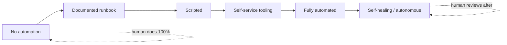
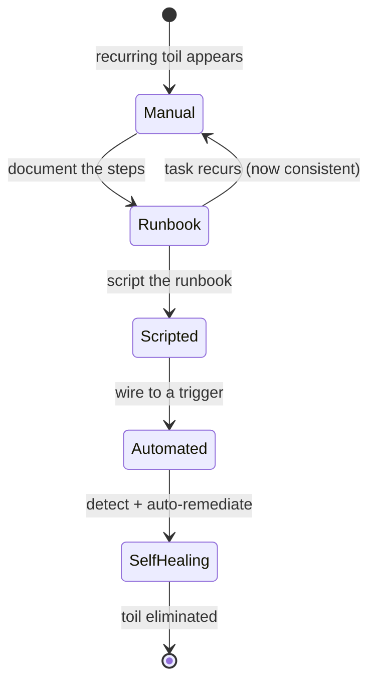

# Toil Reduction & Operational Excellence

Reliability at scale is won or lost on a single question: **does keeping the system running
require more human effort every time the system grows?** If yes, you have a headcount time-bomb.
Site Reliability Engineering's answer is a specific, measurable concept — **toil** — and a
discipline for capping it, measuring it, and engineering it away. This topic is about making
operations **sustainable and scalable**: what toil precisely is (and is not), why it is
corrosive, the SRE 50% cap, how you measure it, the automation hierarchy that eliminates it,
when *not* to automate, and how error-budget-driven prioritization and self-healing systems turn
firefighting into engineering.

This is the **operational-practice** view. How you *measure and alert* on the signals that
generate toil (metrics, dashboards, alert tuning) lives in `observability`; the **CI/CD pipeline,
IaC, and platform/IDP tooling** that automation is built on lives in `devops-cicd`; the human
cost of pager load lives in `reliability-ops/on-call` and `reliability-ops/incident-response-and-command`.
Here we own the *reliability substance* of why toil matters and how you drive it down.

> [!KEY-TAKEAWAY]
> Toil is not "work I dislike" — it is work that is **manual, repetitive, automatable,
> tactical, devoid of enduring value, and O(n) with service growth**. The SRE contract caps it
> at **< 50%** of an SRE's time so the other half funds engineering that *reduces* toil. Toil you
> measure and attack shrinks; toil you tolerate scales linearly until it consumes the team.

> [!INTERVIEW]
> High-frequency probes: *"define toil — what makes work toil vs not?"*, *"is attending a
> meeting toil?"* (no — that's overhead), *"why cap toil at 50%?"*, *"how do you measure toil?"*,
> *"walk me up the automation hierarchy"*, *"when would you NOT automate something?"*, and the
> senior scenario *"your on-call is drowning in a repetitive manual task — how do you decide
> whether to automate it, and how do you make the case for the time?"*

---

## What Toil Is — the SRE Definition

**Toil** is the SRE term for **the kind of work tied to running a production service that tends
to be manual, repetitive, automatable, tactical, devoid of enduring value, and that scales
linearly as the service grows.** Google's SRE book defines it by **six characteristics** — a
piece of work is toil to the degree it exhibits these (it need not have all six, but the more it
has, the more clearly it is toil):

| # | Characteristic | Meaning |
|---|---|---|
| 1 | **Manual** | A human has to run it by hand — e.g. hand-executing a script counts; the *hand-running* is the manual part. |
| 2 | **Repetitive** | You do it again and again. A one-time fix is not toil; the tenth time is. |
| 3 | **Automatable** | A machine *could* do it. If the task genuinely requires human judgment, it isn't toil. |
| 4 | **Tactical** | Reactive/interrupt-driven ("handle this page") rather than strategic. |
| 5 | **No enduring value** | The service is in the same state after you finish as before — you didn't make a permanent improvement. |
| 6 | **O(n) with service growth** | Effort grows at least linearly with traffic, users, or fleet size. Work that grows *sub-linearly* (thanks to automation/economies of scale) is the goal. |

Canonical examples: manually applying a config change to each of 100 hosts, resetting a stuck
job by hand every night, handling a quota-increase request by clicking through a console,
manually failing over a database during a deploy, copy-pasting the same triage steps for a
recurring alert.

> [!TIP]
> The single most testable distinguisher is **"devoid of enduring value + scales with growth."**
> Ask: *after I finish, is the world permanently better, and will I have to do this again — and
> more often — as we grow?* If "no lasting value" and "yes, more often," it's toil.

## Toil vs Overhead vs Engineering vs Project Work

The most common interview trap is conflating toil with "everything I don't enjoy." SRE draws
sharp lines:

| Category | Definition | Example | Counts against 50% cap? |
|---|---|---|---|
| **Toil** | Manual, repetitive, automatable, no enduring value, scales with growth | Manually restarting a hung service every night | **Yes** |
| **Overhead** | Administrative work not tied directly to running the service | Team meetings, email, HR, expense reports, training, hiring | **No** (tracked separately) |
| **Engineering work** | Novel, judgment-driven work that produces a **permanent improvement** or automation | Writing the auto-remediation that kills the nightly restart | **No** — this is the *good* half |
| **Project work / one-off** | Non-repetitive work, even if manual | A one-time migration, a fresh capacity plan | **No** — not repetitive, so not toil |

Key mechanism points interviewers push on:

- **Overhead is real work but it is *not* toil.** Meetings are unavoidable administrative cost;
  they don't scale with request volume and can't be "automated away" in the SRE sense. Bucketing
  meetings into toil corrupts the metric.
- **A hard, novel, manual task is not toil.** Toil requires *repetitiveness* and *automatability*.
  Debugging a never-seen-before failure is manual and unpleasant but demands judgment and produces
  learning — it's engineering, not toil.
- **Engineering work is the antidote, not a peer category.** SRE deliberately splits its own time
  into *toil* and *engineering*; the whole point of the cap is to protect the engineering half.

## Why Toil Is Harmful

Toil is not merely annoying — it is a structural threat to the team and the service. The
canonical harms:

1. **It has no enduring value.** When you finish, the system is unchanged. Time spent on toil is
   time that produced nothing durable.
2. **It scales with the service (O(n)).** This is the killer property. If handling toil costs
   *X* per unit of load, doubling traffic doubles the toil. Reliability that requires linear
   headcount growth **doesn't scale** — you hire forever or you fall behind.
3. **It crowds out engineering.** Every hour on toil is an hour *not* spent building the
   automation that would eliminate the toil. Toil is self-perpetuating: the busier you are firefighting,
   the less time you have to stop the fires.
4. **It causes burnout, low morale, and attrition.** Repetitive, interrupt-driven, valueless work
   is demoralizing; it drives your best engineers away, which raises toil-per-person on those who
   remain — a **death spiral**.
5. **It slows career growth and erodes skills.** Time on toil is time not building portfolio-worthy
   engineering.
6. **It creates operational risk.** Manual, repetitive steps are error-prone; a tired human doing
   the 200th manual failover fat-fingers it and causes an incident.

> [!WARNING]
> The trap is that toil often feels *productive* — you closed 40 tickets today! But closing
> tickets that will reopen tomorrow is running to stand still. Measure the trend line, not the
> daily heroics.

## The 50% Toil Cap

The **SRE 50% rule**: Google's SRE organization caps the aggregate time SREs spend on toil at
**less than 50%**. The remaining time (**at least 50%**) is reserved for **engineering project
work** — building the automation, tooling, and system improvements that make future operations
cheaper.

Mechanism and rationale:

- **The cap protects the engineering half.** Without an enforced floor on engineering time, toil
  expands to fill all available hours (it is always urgent, engineering is always deferrable).
  The 50% cap is a **forcing function**: it makes reducing toil a first-class, budgeted activity.
- **It's an aggregate target, not per-person-per-week.** It's measured across the team over a
  reasonable window (e.g. a quarter). One SRE can have a heavy on-call rotation while another does
  a pure project sprint.
- **What happens when toil exceeds 50%:** the documented SRE response is to treat it as a signal —
  **redirect overflow toil back to the dev team** (the product engineers who own the service),
  hire/reallocate, or explicitly de-prioritize features until automation catches up. Toil is a
  shared responsibility; SRE is not an ops dumping ground.

> [!TIP]
> If asked "why *50%* specifically?" — it's not a magic number; it's a deliberate **balance**:
> enough operational coverage to run the service, enough protected engineering time to
> continuously *reduce* the operational load. The exact figure matters less than the principle of
> a **hard, enforced ceiling with a protected engineering floor**.

## Measuring & Tracking Toil

You cannot manage what you don't measure — and toil, being interrupt-driven, is easy to
under-count ("it's just five minutes"). Practices:

- **Identify the sources.** The biggest sources are typically **on-call interrupts (pages),
  non-page tickets/requests, and manual releases/config pushes.** (Pager load itself is covered in
  `reliability-ops/on-call`.)
- **Instrument it.** Track toil as **human-hours** via ticket systems, on-call logs, and time
  surveys. A common quantification: *toil = (interrupts × avg handling time) + ticket-hours +
  manual-ops-hours*, expressed as a **fraction of total engineering hours**.
- **Toil trend is a leading indicator.** A rising toil percentage predicts burnout and missed
  project deadlines *before* they hit. Put it on a dashboard and review it every retro. (How you
  build/alert on that dashboard is `observability`'s domain.)
- **Set a threshold and act.** When measured toil approaches the 50% cap, that triggers the
  offload/automate response above.

> [!INTERVIEW]
> A sharp answer to "how do you measure toil?" names a *unit* (human-hours or % of time), a
> *source of data* (ticket/pager systems + surveys), and a *decision trigger* (the 50% cap).
> Vague answers ("you just track it") signal you haven't run a real rotation.

## The Automation Hierarchy — Toil's Antidote

**Automation is the primary weapon against toil**, but automation is a *spectrum*, not a binary.
The maturity ladder (each rung removes more human involvement):

| Level | Rung | What a human does | Toil level |
|---|---|---|---|
| 0 | **No automation** | Does everything from memory / tribal knowledge | Maximal + risky |
| 1 | **Documented runbook** | Follows written steps by hand | High but consistent |
| 2 | **Scripted / semi-automated** | Runs a script/tool that does the steps | Medium |
| 3 | **Self-service tooling** | Users trigger safe, guard-railed actions themselves | Low |
| 4 | **Fully automated** | System does it on schedule/trigger; human is notified | Minimal |
| 5 | **Autonomous / self-healing** | System detects *and* remediates with no human; human reviews after | ~Zero |

Mechanism points:

- **Climb the ladder incrementally.** You rarely jump from level 0 to level 5. The high-value,
  low-risk first move is almost always **level 0 → level 1 (write the runbook)**: it makes the
  task consistent, transferable, and — crucially — **specifies exactly what to automate next**.
- **Automation's benefits go beyond time saved:** *consistency* (no fat-fingering), *speed*
  (faster than a human → lower MTTR), *auditability*, and it acts as a **platform** other
  automation builds on.
- **The pipeline/IaC/GitOps machinery** that hosts most level-2–4 automation lives in
  `devops-cicd`; here the point is *which* toil to move up the ladder and *why*.

## When NOT to Automate

Automation is not free and not always right. Automating the wrong thing wastes engineering time
or, worse, creates a fast, confident way to cause outages. Judgment factors:

- **Frequency / ROI.** Classic rule of thumb: automate when **time saved over the automation's
  lifetime > time to build and maintain it.** A task done once a year for 5 minutes is not worth a
  week of automation work (see xkcd "Is It Worth the Time?"). Rare toil may be better left as a
  well-documented runbook.
- **Risk of the action.** High-blast-radius actions (deleting data, failing over regions) that
  are done rarely may warrant **keeping a human in the loop** — the automation *proposes*, a human
  *approves*. Fully automating a rare, destructive action means you've built a reliable way to
  destroy production.
- **Judgment-heavy tasks.** If success depends on context a machine can't reliably assess
  (deciding *whether* to fail over given ambiguous signals), it isn't cleanly automatable — that's
  engineering/judgment, not toil.
- **Stability of the task.** Automating a workflow that changes every month means constantly
  rewriting the automation — the automation itself becomes toil.
- **Automation must be reliable and observable.** Bad automation is worse than manual toil: it
  fails silently, does the wrong thing quickly, or masks the underlying problem. Automate with
  guardrails, monitoring, and a rollback/kill-switch.

> [!WARNING]
> The anti-pattern is **automating a broken process** ("paving the cowpath"). If the manual
> process is wrong, automating it just makes it wrong faster and at scale. Fix/simplify first,
> then automate. And beware **automation that hides the smell** — auto-restarting a service that
> leaks memory removes the pain that would have driven you to fix the leak.

## Operational Excellence & Error-Budget-Driven Prioritization

**Operational excellence** is the practice of continuously reducing operational load so the team
can run more service with the same (or less) human effort — turning firefighting into engineering.
The steering mechanism is the **error budget** (defined fully in
`reliability-ops/slos-error-budgets-and-velocity-tradeoff`; here we use it to *prioritize work*):

- **Error budget spent → prioritize reliability/toil-reduction work.** When the service is
  burning budget (frequent incidents, lots of interrupt toil), the error-budget policy redirects
  effort from features to hardening and automation. When budget is healthy, ship features. This
  gives you a **data-driven, non-political** way to decide when to invest in toil reduction.
- **Prioritize toil by pain × frequency.** Attack the highest-volume, highest-cost toil first
  (the recurring page that fires nightly), not the rare annoyance.
- **Reducing operational load is a product feature.** Reliability and low-toil operations compete
  with features for the same engineering time; treat toil-reduction work as a first-class backlog
  item with its own prioritization, not "spare-time" work.

## The Virtuous Cycle — Automate the Runbook After You Write It

Operational excellence compounds through a **virtuous cycle**: each incident/toil instance is an
opportunity to move one rung up the automation ladder, so the *next* occurrence is cheaper.

The discipline: **after you handle a toil instance manually, capture the steps as a runbook; the
next time, script the runbook; then trigger the script automatically.** Postmortem action items
(see `reliability-ops/blameless-postmortems-and-learning`) are a primary feeder of this cycle —
"add auto-remediation for X" is a classic action item. The cycle is what makes operations scale
**sub-linearly**: effort per incident drops with each turn of the loop even as the fleet grows.

## Self-Healing Systems & Auto-Remediation with Guardrails

The top rung: systems that **detect a fault and remediate it automatically**, with the human
moved from *actor* to *auditor*. Examples: autoscaling on load, health-check-driven instance
replacement, automatic failover, restarting a crashed process, auto-rolling-back a bad deploy on
SLO breach.

Guardrails are non-negotiable — auto-remediation without limits is a loaded gun:

- **Rate limits / circuit breakers on the remediation itself.** "Restart at most 3 times in 10
  minutes, then page a human." Prevents a remediation loop from thrashing (e.g. endlessly
  restarting a crash-looping service and masking a real bug).
- **Blast-radius limits.** Cap how much the automation can change at once (replace 1 instance,
  not the whole fleet); require a human for large-scale actions.
- **Escalate on repeated failure.** If auto-remediation fires repeatedly, that's a signal the
  *underlying* problem needs a human — escalate, don't keep papering over it.
- **Observability + kill switch.** Every automated action must be logged/alerted and have a way to
  disable it fast. Automation you can't see or stop is a liability.
- **Idempotency & safety.** Remediation actions should be safe to run repeatedly and should fail
  closed (do nothing) rather than fail open (do something dangerous) on ambiguous input.

> [!WARNING]
> **Auto-remediation can turn a small problem into a large outage.** The famous failure mode: a
> health check flaps, the automation "heals" by replacing instances faster than they can start,
> the fleet shrinks to zero, and you have a self-inflicted global outage. This is why rate limits,
> blast-radius caps, and escalation-on-repeat are mandatory, not optional.

## Platform Engineering & the Internal Developer Platform (Cross-Ref)

The organizational endgame of toil reduction is **self-service**: instead of SREs handling
requests one-by-one (toil), you build a **platform / Internal Developer Platform (IDP)** that lets
developers do it themselves safely (level-3 automation for a whole org). Golden paths, paved
roads, and self-service provisioning convert O(n) request-handling toil into O(1) platform
maintenance. The **platform-engineering/IDP tooling and its CI/CD substrate** are owned by
`devops-cicd`; the reliability angle here is simply: *self-service tooling is how you scale toil
reduction beyond a single team.*

## Common Interview Follow-ups

- **"Is being on-call toil?"** On-call *itself* isn't inherently toil — but the *repetitive,
  automatable interrupts* it generates are a primary toil source. Judgment-heavy incident response
  is engineering. (See `reliability-ops/on-call`.)
- **"Give an example of work that is NOT toil but feels like it."** A one-time data migration
  (not repetitive), debugging a novel outage (needs judgment), attending planning meetings
  (overhead). Unpleasant ≠ toil.
- **"Why 50% and not 20% or 80%?"** It's a deliberate balance — enough ops coverage to run the
  service, enough *protected* engineering time to reduce future toil. The principle (an enforced
  ceiling + protected floor) matters more than the exact number.
- **"You're at 70% toil and the backlog is on fire — what do you do?"** Measure and rank the toil,
  automate/offload the biggest source, and invoke the error-budget/toil policy to redirect the
  overflow back to the dev team or explicitly slow feature work. Don't just work more hours — that
  hides the problem and accelerates burnout.
- **"When would automating something make reliability *worse*?"** When you automate a broken
  process, automate a rare destructive action without a human gate, or build remediation without
  rate limits/blast-radius caps — fast, confident, unsupervised wrong actions.
- **"How do you justify spending engineering time on toil reduction?"** Quantify it: toil-hours ×
  loaded cost, projected O(n) growth, burnout/attrition risk, and MTTR improvement. Frame it as
  ROI and as protecting the 50% engineering floor.

## References

- Beyer, Jones, Petoff, Murphy (eds.), *Site Reliability Engineering: How Google Runs Production
  Systems* (O'Reilly, 2016) — Ch. 5 "Eliminating Toil"; Ch. 7 "The Evolution of Automation at
  Google."
- Beyer, Murphy, Rensin, Kawahara, Thorne (eds.), *The Site Reliability Workbook* (O'Reilly, 2018)
  — Ch. 6 "Eliminating Toil" (measuring and cataloguing toil, taxonomy, case studies).
- Google SRE — "Eliminating Toil" (sre.google/sre-book/eliminating-toil).
- Randall Munroe, xkcd #1205 "Is It Worth the Time?" — automation ROI table.
- Michael T. Nygard, *Release It!*, 2nd ed. (Pragmatic Bookshelf, 2018) — operational maturity,
  automating recovery safely.
- Amazon Web Services, *AWS Well-Architected Framework — Operational Excellence Pillar*
  (perform operations as code; make frequent, small, reversible changes; anticipate failure).
