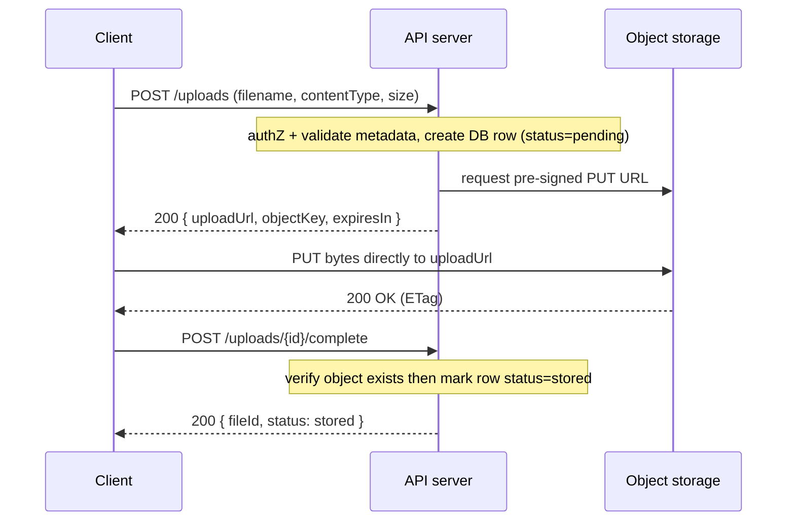
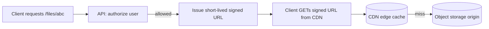
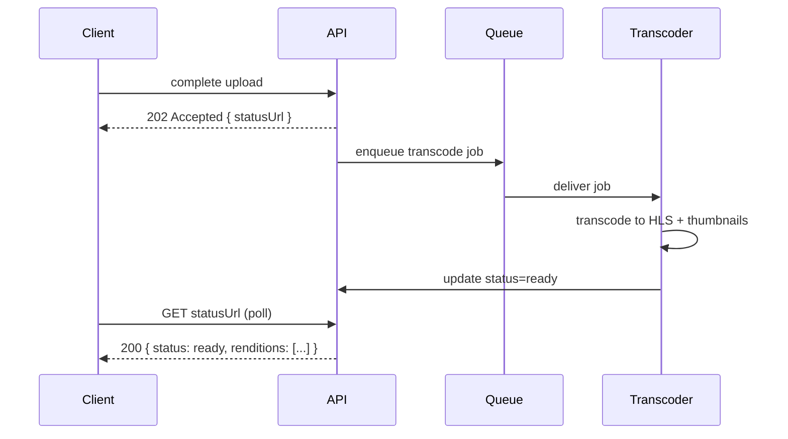

# File Upload, Storage & Media Delivery

Almost every non-trivial API eventually has to accept a file — a profile
avatar, a KYC document, a CSV import, a 4 GB video. File handling looks simple
("just POST the bytes") but it is one of the richest sources of production
incidents and interview questions, because it touches **bandwidth, memory,
storage, security, and delivery all at once**. A naïve endpoint that reads the
whole body into a byte array, trusts the client's `Content-Type`, and stores the
blob in your primary database will fall over on the first large or malicious
upload.

This document builds from the ground up: how bytes actually arrive over HTTP,
where to put them, how to do it without melting your app servers, how to keep
attackers out, and how to serve media back efficiently. The recurring theme is
that **your API server should touch as few upload bytes as possible** — offload
transfer to object storage and delivery to a CDN, and reserve the app tier for
authorization, validation, and metadata.

> [!KEY-TAKEAWAY]
> Treat the file bytes and the file *metadata* as two different things stored in
> two different systems: the blob goes to object storage (S3/GCS/Azure Blob),
> the metadata (owner, name, size, content type, status, checksum, storage key)
> goes to your database. The API mostly moves metadata around and hands out
> short-lived credentials for the bytes.

> [!INTERVIEW]
> A favorite senior-level prompt: *"Design an endpoint that lets users upload a
> profile video up to 5 GB."* The interviewer is listening for pre-signed
> direct-to-storage upload, streaming/chunking, content validation, virus
> scanning, async transcoding with a 202 status, and CDN delivery — not for
> `@RequestParam MultipartFile file`.

See also: `http-methods-and-status-codes` (206/202/413/415 semantics),
`request-response-design-and-content-negotiation` (media types, `Content-Type`
vs `Accept`), `api-security-and-hardening` (upload abuse, SSRF, DoS), and
`system-design/caching-and-cdn` (edge caching and invalidation).

---

## Upload mechanisms: multipart/form-data vs raw body vs base64-in-JSON

There are three common ways to get file bytes into an HTTP request, and the
choice has real cost consequences.

**1. `multipart/form-data` (RFC 7578).** The classic HTML-form and API upload
format. The body is split into parts separated by a boundary string; each part
has its own headers (`Content-Disposition`, `Content-Type`). It can carry a file
*and* accompanying form fields in one request:

```
POST /uploads HTTP/1.1
Content-Type: multipart/form-data; boundary=----abc123

------abc123
Content-Disposition: form-data; name="title"

Vacation clip
------abc123
Content-Disposition: form-data; name="file"; filename="clip.mp4"
Content-Type: video/mp4

<binary bytes>
------abc123--
```

Pros: standard, streamable, carries metadata fields alongside the file, minimal
encoding overhead (a small per-part boundary/header cost). Cons: parsing is
fiddly; you must stream-parse it, not buffer it.

**2. Raw request body (`PUT`/`POST` with the file as the entire body).** The body
*is* the file; the content type is the file's own type (`Content-Type:
image/png`). This is what S3 pre-signed `PUT` uploads use. Pros: zero encoding
overhead, dead simple to stream. Cons: only one file, no accompanying fields
(put those in headers, query string, or a prior metadata call).

**3. Base64 inside a JSON body.** `{"file": "iVBORw0KGgoAAAANS..."}`. Tempting
because "everything is JSON," but it is the worst option for anything
non-trivial:

- **Base64 inflates payload size by ~33%** (3 bytes → 4 ASCII chars), so you pay
  more bandwidth and storage-in-transit for the same file.
- It usually forces the whole file to be **buffered and decoded in memory**,
  which defeats streaming and invites OOM on large files.
- JSON parsers may impose additional string-length limits, and the CPU cost of
  encode/decode is non-trivial at scale.

Base64-in-JSON is acceptable only for tiny payloads (a few KB — e.g. a small
inline thumbnail or an icon in a config API) where the convenience of a single
JSON document outweighs the overhead.

> [!WARNING]
> Reaching for base64-in-JSON "so the API stays pure JSON" is a common junior
> mistake. For anything but tiny blobs it wastes ~33% bandwidth, blocks
> streaming, and increases memory pressure. Prefer `multipart/form-data` or a
> raw-body/pre-signed upload.

---

## Streaming vs buffering: don't load a 5 GB file into memory

The single most important implementation habit: **process the upload as a stream,
never materialize the whole file in memory**. If 50 users each upload a 2 GB file
and your handler does `byte[] data = readFully(request)`, you need 100 GB of
heap. You will OOM long before that.

Streaming means you read the body in bounded chunks and immediately forward each
chunk to its destination — disk, object storage, a hash function, a scanner —
without holding more than a small buffer at once.

```python
# BAD: buffers entire file in RAM
data = request.body.read()            # 5 GB in memory
s3.put_object(Bucket=b, Key=k, Body=data)

# GOOD: stream body straight through, bounded memory
s3.upload_fileobj(request.stream, Bucket=b, Key=k)  # multipart under the hood
```

Even when you must inspect the file (hashing, magic-byte checks, image
transcoding), do it **as the bytes flow past** or on a bounded temp file on
disk, not by holding the full payload in the heap. Frameworks help: multipart
parsers spill large parts to temp files, and reverse proxies (nginx
`client_max_body_size`, buffering settings) can cap or stream request bodies.

> [!KEY-TAKEAWAY]
> Memory use per upload should be O(buffer size), not O(file size). The best way
> to guarantee that is to not let large files touch your app tier at all — use
> pre-signed direct-to-storage uploads.

---

## Pre-signed URLs and direct-to-object-storage upload

This is **the standard pattern** for serious file handling, and the single most
important thing to say in an interview. Instead of the client uploading through
your API (which then re-uploads to storage), the client uploads **directly to
object storage** (S3/GCS/Azure Blob) using a short-lived, cryptographically
signed URL your API hands out.



Why this is the default:

- **Offloads bandwidth and CPU from your app tier.** The multi-GB byte stream
  never transits your servers — it goes client → storage. Your API only moves
  small JSON.
- **Scales trivially.** Object storage is built for massive concurrent transfer;
  your app instances are not.
- **Cheaper and more reliable.** No app-tier timeouts on long uploads, no need to
  size instances for upload throughput.

The URL is signed with your credentials but **scoped and time-limited**: it
grants exactly one operation (e.g. `PUT` to one key) for a few minutes. You can
also constrain size and content type. S3 offers two flavors: a **pre-signed
`PUT` URL** (simplest) and a **pre-signed `POST` policy** (form-based, lets you
enforce a `content-length-range` and other conditions — good for browser
uploads).

The catch: because the client talks straight to storage, **your API never sees
the bytes**, so you cannot validate/scan them inline. You handle that
out-of-band: validate metadata up front, then trigger scanning/validation on the
stored object via an event (e.g. S3 `ObjectCreated` → Lambda/queue) before
marking the file usable. The two-phase "reserve then confirm" flow above also
avoids orphaned DB rows and orphaned objects.

> [!WARNING]
> A pre-signed PUT URL that doesn't constrain size lets a client upload an
> arbitrarily large object. Use a pre-signed POST policy with
> `content-length-range`, or enforce limits via bucket policy / post-upload
> checks, and always set a short expiry.

---

## Proxying uploads through the API

Sometimes you *do* route bytes through your server (multipart to your endpoint,
which streams to storage). This is simpler and lets you inspect bytes inline, but
you own all the cost and risk.

| | Pre-signed direct-to-storage | Proxy through API |
|---|---|---|
| Bandwidth on app tier | None | Full file, twice (in + out) |
| Inline scanning/validation | No (do it async) | Yes, as bytes stream |
| App instance sizing | Small | Must handle upload throughput |
| Client complexity | Slightly higher (extra round trip) | Lower (one request) |
| Hiding storage provider | Storage URL is exposed | Fully hidden behind API |
| Best for | Large files, high volume, the default | Small files, when inline transforms/scan are mandatory |

Proxying is defensible for **small files** (avatars, documents under a few MB)
where inline validation is convenient and the throughput is negligible, or when
policy forbids exposing storage endpoints to clients. Even then, **stream** the
body through — don't buffer.

---

## Resumable and chunked uploads

For **large or flaky uploads** (mobile networks, multi-GB videos), a single
`PUT` that fails at 95% and restarts from zero is a terrible experience.
Resumable protocols split the file into chunks and let the client resume from the
last acknowledged offset after a failure.

**tus (`tus.io`, resumable-upload protocol v1.0.0).** An open HTTP-based
protocol. Flow:

- `POST` (Creation extension) creates an upload resource; server returns a URL
  and the total `Upload-Length`.
- `PATCH` with `Content-Type: application/offset+octet-stream` and an
  `Upload-Offset` header appends bytes at that offset; success is `204 No
  Content` with the new `Upload-Offset`.
- `HEAD` returns the server's current `Upload-Offset` so an interrupted client
  knows exactly **where to resume**.
- `Tus-Resumable` version header is required on requests; a mismatched offset
  returns `409 Conflict`.

**Cloud multipart upload APIs (e.g. S3 Multipart Upload).** The storage-native
equivalent, and the usual answer for S3-backed systems:

- `CreateMultipartUpload` returns an **upload ID**.
- `UploadPart` uploads each part independently (any order, in parallel), each
  returning an **ETag**. Parts are **min 5 MB** (except the last) and you may
  have **up to 10,000 parts**.
- `CompleteMultipartUpload` sends the list of part numbers + ETags; S3
  concatenates them in ascending part-number order into one object.
- `AbortMultipartUpload` discards parts. **Incomplete multipart uploads keep
  costing storage until aborted** — configure an `AbortIncompleteMultipartUpload`
  lifecycle rule to clean them up.

> [!WARNING]
> **The multipart ETag is not the object's MD5.** For a single-`PUT` upload, S3's
> ETag *is* the MD5 hash of the object — but for a multipart upload it is a
> composite: the MD5 of the concatenated part MD5s, suffixed with `-N` where `N`
> is the part count (e.g. `d41d8cd...e3-4`). So you cannot recompute a multipart
> object's ETag by hashing the whole file, and it must **not** be used as a
> content hash for integrity verification or dedup — precisely the large files
> this doc centers on. For real integrity/dedup, store a **client-computed
> SHA-256** (what the `checksum` column in the schema below holds) or use S3's additional
> checksums (`x-amz-checksum-sha256`, including full-object checksums for
> multipart).

You can combine both worlds: hand clients **pre-signed URLs for each part** so
they upload parts directly to S3 while your API only orchestrates
create/complete.

> [!TIP]
> Benefits of chunking: parallel part uploads (higher throughput), retry only the
> failed part (resilience on spotty networks), and you can start uploading before
> the final size is known. This is why AWS recommends multipart for objects ≥100
> MB.

---

## Content-type validation and magic-byte sniffing

**Never trust the client.** The file extension (`.jpg`) and the request
`Content-Type` (`image/png`) are both **client-supplied and trivially forged**. A
`malware.exe` renamed to `photo.jpg` with `Content-Type: image/jpeg` will sail
past any check that only reads those.

The reliable check is to **inspect the actual bytes** — the "magic number" /
file signature at the start of the file:

| Type | Leading magic bytes (hex) |
|---|---|
| PNG | `89 50 4E 47 0D 0A 1A 0A` |
| JPEG | `FF D8 FF` |
| GIF | `47 49 46 38` (`GIF8`) |
| PDF | `25 50 44 46` (`%PDF`) |
| ZIP / docx / xlsx | `50 4B 03 04` (`PK..`) |

Libraries like `file`/libmagic, Apache Tika, or `file-type` detect true type from
content. Then **cross-check**: does the detected type match the claimed
`Content-Type` and the extension, and is it on your **allowlist** of accepted
types? Allowlist, never denylist — enumerate what you accept and reject
everything else.

> [!WARNING]
> MIME sniffing is also a *browser* concern. If you serve user files without a
> correct `Content-Type`, browsers may sniff a `.txt` as HTML and execute
> embedded `<script>` (stored XSS). Always send the right `Content-Type` plus
> `X-Content-Type-Options: nosniff`, and serve user content from a separate
> origin/domain.

Return **`415 Unsupported Media Type`** when the type isn't accepted, and
`422`/`400` when it fails semantic validation. See also
`request-response-design-and-content-negotiation`.

---

## Size limits, quotas, and 413

Every upload endpoint needs a **maximum size**, enforced at multiple layers so a
malicious client can't exhaust disk, memory, or your storage bill:

- **Reverse proxy / gateway:** e.g. nginx `client_max_body_size 25m;`, API
  Gateway payload limits. Rejects oversized bodies before they reach your app.
- **Application framework:** e.g. Spring `spring.servlet.multipart.max-file-size`,
  Express body-parser limits.
- **Pre-signed uploads:** enforce `content-length-range` in a POST policy (the
  app tier never sees the bytes, so proxy limits don't apply).
- **Per-user quotas:** total storage per account, checked against the DB before
  issuing an upload URL.

The correct status for an oversized body is **`413 Content Too Large`** (formerly
"Payload Too Large", RFC 9110). Check the declared `Content-Length` early and
reject before reading the body when possible, but **still enforce while
streaming**, because `Content-Length` can lie or be absent (chunked transfer).

> [!KEY-TAKEAWAY]
> Enforce size limits *before and during* the read, at the edge and in the app.
> A limit that only checks `Content-Length` is bypassable with chunked encoding;
> a limit that only checks after buffering is too late to prevent the OOM.

---

## Malware scanning and image re-encoding

Accepting files means accepting **potentially hostile files**. Two defenses:

**1. Malware/virus scanning.** Run uploaded files through a scanner (ClamAV,
a commercial engine, or a managed service) **before** they are marked usable or
served to other users. In a pre-signed-upload architecture this happens
asynchronously: `ObjectCreated` event → scan job → mark `clean`/`infected`. Until
a file is scanned, keep it in a **quarantine** bucket/prefix and don't serve it.

**2. Re-encoding / sanitizing.** Malformed media can carry exploits targeting
decoders, and images can smuggle data or scripts in metadata. Defenses:

- **Re-encode images** through a trusted library (decode → re-encode to a clean
  file). This strips embedded exploits and inconsistent structures — the output
  is a fresh, well-formed image.
- **Strip metadata (EXIF).** EXIF can contain GPS coordinates (privacy leak) and,
  historically, exploitable or script-bearing fields. Remove it during
  re-encode.
- For documents, prefer rendering to a safe format (e.g. PDF → image) over
  serving the original when feasible.

> [!WARNING]
> `image/svg+xml` is not a "safe image" — SVG is XML that can contain
> `<script>` and external references, so serving user SVGs inline enables XSS.
> Either disallow SVG, sanitize it (strip scripts), or serve it with
> `Content-Disposition: attachment` from a sandboxed origin.

---

## Upload security: path traversal, zip bombs, and SSRF

Beyond malware, several attacks target the *upload handling logic* itself.

**Path traversal.** If you build a storage path from the client's filename
(`uploads/ + filename`), a filename like `../../etc/passwd` or
`..\..\windows\...` can escape the intended directory and overwrite system files.
**Never use the client filename as a path.** Generate your own opaque key (UUID),
store the original name only as metadata, and sanitize/normalize before any
filesystem use. Object storage keys aren't a real filesystem, but the same
discipline avoids surprises.

**Zip bombs / decompression bombs.** A tiny archive (or a crafted image/PDF) that
expands to gigabytes on decompression, exhausting disk or memory (the classic
`42.zip` is ~42 KB → 4.5 PB). If you decompress or process archives, **cap the
decompressed size and the compression ratio**, cap nested depth, and process into
a bounded temp space — abort if limits are exceeded.

**SSRF via URL-fetch uploads.** "Upload from a URL" features (`POST /import
{"url": "..."}`) where your server fetches the URL are a prime **Server-Side
Request Forgery** vector: an attacker passes
`http://169.254.169.254/latest/meta-data/` (cloud metadata) or
`http://localhost:6379` (internal service) and your server dutifully fetches
internal resources. Defenses: **allowlist schemes/hosts, block private and
link-local IP ranges (resolve DNS then re-validate to prevent rebinding),
disable redirects to internal targets, and fetch from an egress-restricted
network.** See also `api-security-and-hardening`.

**Other hardening:** authenticate/authorize *before* issuing upload URLs;
rate-limit uploads (see `rate-limiting-and-throttling`); set an upload expiry;
strip active content; and store user files on a **separate domain** from your app
so a malicious file can't run in your app's origin.

---

## Storing metadata in the DB and the blob in object storage

The durable design nearly everyone converges on: **blob in object storage,
metadata in the database.**

```sql
CREATE TABLE files (
  id            UUID PRIMARY KEY,
  owner_id      UUID NOT NULL REFERENCES users(id),
  storage_key   TEXT NOT NULL,        -- e.g. "uploads/2026/07/ab12...mp4"
  bucket        TEXT NOT NULL,
  original_name TEXT NOT NULL,        -- for display / download filename only
  content_type  TEXT NOT NULL,        -- verified type, not the client's claim
  size_bytes    BIGINT NOT NULL,
  checksum      TEXT,                 -- client-computed sha256 for integrity/dedup (NOT the multipart ETag; see the ETag warning above)
  status        TEXT NOT NULL,        -- pending | scanning | ready | infected | failed
  created_at    TIMESTAMPTZ NOT NULL DEFAULT now()
);
```

Why not store the blob *in* the database (as a BLOB column)? It bloats the DB,
kills backup/restore times, wastes expensive DB storage and buffer-pool memory,
and forces every byte through your DB connection. Object storage is cheaper,
effectively infinite, durable, and integrates with CDNs and lifecycle policies.
Keep the DB for what it's good at: querying, relationships, and the **status
state machine** (`pending → scanning → ready`).

The `status` column drives the lifecycle: a row is created `pending` when the
upload URL is issued, flipped to `scanning` on `ObjectCreated`, and to `ready`
only after validation/scan pass. Clients should only be served `ready` files.
This also makes **orphan cleanup** tractable (delete `pending` rows and their
objects after a TTL).

---

## Serving downloads: Range requests and 206 Partial Content

Serving large files (video, audio, big PDFs) requires supporting **HTTP range
requests** (RFC 9110 §14). A client (or a `<video>` element seeking, or a paused
download resuming) sends:

```
GET /files/abc/video.mp4 HTTP/1.1
Range: bytes=1048576-2097151
```

and a range-capable server responds **`206 Partial Content`** with just that byte
range and a `Content-Range` header:

```
HTTP/1.1 206 Partial Content
Content-Range: bytes 1048576-2097151/52428800
Content-Length: 1048576
Accept-Ranges: bytes
```

Why it matters:

- **Video seeking/streaming:** players fetch only the bytes around the current
  playhead instead of the whole file.
- **Resumable downloads:** a dropped download resumes from where it stopped.
- **Bandwidth efficiency:** never ship 500 MB when the client wants 1 MB.

Advertise support with `Accept-Ranges: bytes`. If the requested range is
unsatisfiable (start past end of file), return **`416 Range Not Satisfiable`**.
Object stores and CDNs handle range requests natively, which is another reason to
serve media through them rather than through a hand-rolled app endpoint. See also
`http-methods-and-status-codes`.

---

## CDN delivery and signed URLs for private media

Reads dominate: a file is uploaded once and downloaded many times. Serving every
download from your app or even your bucket is slow (single region) and expensive
(egress). Put a **CDN** (CloudFront, Fastly, Cloudflare) in front of object
storage: it caches content at edge locations near users, cuts latency, absorbs
traffic spikes, and reduces origin egress cost. See also
`system-design/caching-and-cdn`.

**Public media** (public product images) is straightforward: cache with long
`Cache-Control` and use **content-addressed or versioned URLs**
(`/img/abc123-v2.jpg`) so a changed file gets a new URL rather than needing
cache invalidation.

**Private media** (a user's private document, paid video) must not be world-
readable, but you also don't want to proxy every byte through your app. The
answer is **signed URLs / signed cookies**: your API authorizes the request and
issues a short-lived signed URL (CloudFront signed URL, S3 pre-signed GET) that
grants read access to one object for a few minutes. The bytes still come from the
CDN/storage; your app only makes the *authorization decision*.



Trade-off: signed URLs are **bearer credentials** — anyone with the URL can read
until it expires — so keep expiry short and scope to a single object. For highly
sensitive data, prefer signed cookies (not shareable in a link) or shorter TTLs.

---

## Async transcoding and processing pipelines

Media usually needs **derivatives**: a video transcoded to multiple resolutions
and formats (HLS/DASH for adaptive streaming), image thumbnails, a PDF preview.
Transcoding is CPU-heavy and slow (seconds to minutes) — far too long to do
synchronously inside the upload request.

The pattern is **asynchronous processing with a status resource**:

1. Upload completes; API returns **`202 Accepted`** with a status URL,
   *acknowledging* the work without having finished it.
2. An `ObjectCreated` event enqueues a transcoding job (queue + workers, AWS
   MediaConvert, ffmpeg fleet, image service).
3. The file's `status` progresses `processing → ready` (or `failed`).
4. The client **polls** `GET /files/{id}` (or receives a **webhook** — see
   `webhooks-and-async-api-patterns`) to learn when derivatives are ready.



Store each derivative as its own object with its own metadata row, linked to the
original. Serve renditions through the CDN. **Never block the HTTP request on
transcoding** — it ties up a connection, risks timeouts, and doesn't survive a
worker restart. `202 Accepted` + a pollable/webhook status is the interview-
correct answer. See also `webhooks-and-async-api-patterns` and
`idempotency-and-reliable-delivery` (retrying jobs safely).

---

## Common follow-up questions

- **"Why is base64-in-JSON a bad idea for file upload?"** ~33% size inflation,
  forces in-memory buffering/decoding (blocks streaming, risks OOM), extra CPU.
  Fine only for tiny inline blobs.
- **"How do you upload a 5 GB file reliably?"** Pre-signed direct-to-storage +
  multipart/resumable (S3 multipart or tus): parallel parts, retry only failed
  parts, resume from offset, never touches the app tier.
- **"How do you validate an uploaded file's type?"** Inspect magic bytes /
  signature (libmagic, Tika), cross-check against extension and declared
  `Content-Type`, enforce an allowlist; return `415` on mismatch. Never trust the
  extension or client `Content-Type`.
- **"How do you serve private media without proxying bytes through your app?"**
  Authorize in the app, then issue a short-lived signed URL/cookie so the CDN or
  storage serves the bytes directly.
- **"What status code for an upload that kicks off transcoding?"** `202 Accepted`
  with a status resource to poll (or a webhook).
- **"What status for an oversized upload?"** `413 Content Too Large`.
- **"How does video seeking work over HTTP?"** `Range` request → `206 Partial
  Content` with `Content-Range`; server advertises `Accept-Ranges: bytes`.
- **"What's SSRF in an upload context and how do you prevent it?"** URL-fetch
  uploads letting an attacker reach internal/metadata endpoints; defend with
  scheme/host allowlists, blocking private IP ranges (re-validated after DNS),
  and no redirects to internal targets.
- **"Where do you store the file — DB or object storage?"** Blob in object
  storage, metadata (incl. a status state machine) in the DB.
- **"How do you cap decompression / prevent zip bombs?"** Limit decompressed
  size, compression ratio, and nesting depth; abort past thresholds.

## References

- RFC 9110 — *HTTP Semantics* (methods, `206`/`202`/`413`/`415`/`416`, range
  requests §14): https://www.rfc-editor.org/rfc/rfc9110
- RFC 7578 — *Returning Values from Forms: multipart/form-data*:
  https://www.rfc-editor.org/rfc/rfc7578
- tus resumable upload protocol v1.0.0: https://tus.io/protocols/resumable-upload
- AWS — *Uploading and copying objects using multipart upload in Amazon S3*:
  https://docs.aws.amazon.com/AmazonS3/latest/userguide/mpuoverview.html
- AWS — *Using presigned URLs*:
  https://docs.aws.amazon.com/AmazonS3/latest/userguide/using-presigned-url.html
- AWS — *Checking object integrity in Amazon S3* (ETag vs. additional/full-object
  checksums; multipart ETag composite):
  https://docs.aws.amazon.com/AmazonS3/latest/userguide/checking-object-integrity.html
- AWS — *Serving private content with signed URLs (CloudFront)*:
  https://docs.aws.amazon.com/AmazonCloudFront/latest/DeveloperGuide/PrivateContent.html
- OWASP — *File Upload Cheat Sheet*:
  https://cheatsheetseries.owasp.org/cheatsheets/File_Upload_Cheat_Sheet.html
- OWASP — *Server-Side Request Forgery Prevention Cheat Sheet*:
  https://cheatsheetseries.owasp.org/cheatsheets/Server_Side_Request_Forgery_Prevention_Cheat_Sheet.html
- MDN — *HTTP range requests*:
  https://developer.mozilla.org/en-US/docs/Web/HTTP/Range_requests
