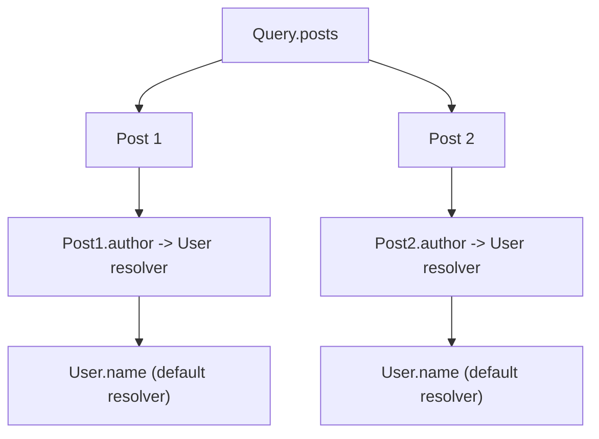
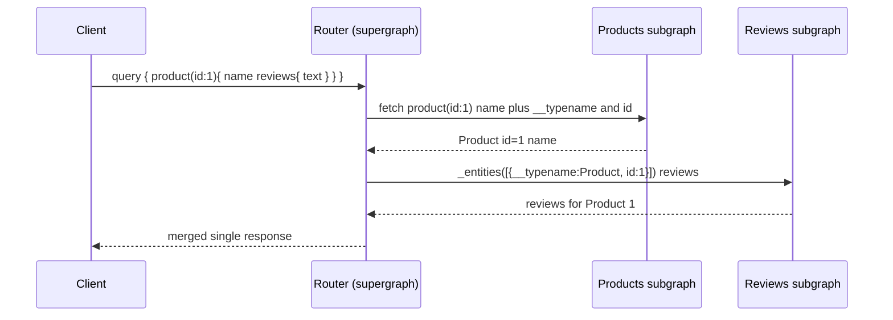

# GraphQL: Schema Design, Execution & Federation

GraphQL is a **query language for APIs** and a **runtime for executing those queries**
against a typed schema. Instead of many endpoints that each return a fixed shape (REST),
a GraphQL server exposes a **single endpoint** and a **strongly typed schema**; the client
sends a query describing the exact tree of fields it wants, and the server returns exactly
that shape — no more, no less. It was created at Facebook in 2012, open-sourced in 2015,
and is now governed by the GraphQL Foundation under a formal specification.

This topic goes **deep on GraphQL itself**: the type system, execution, resolvers,
schema-design conventions, caching, security, and federation. For the head-to-head
paradigm comparison (payload shape, contracts, streaming, tooling), **see also
`rest-vs-graphql-vs-grpc`** — this topic assumes you already believe GraphQL is a
reasonable choice and focuses on how to design and operate it well.

> [!KEY-TAKEAWAY]
> GraphQL moves response-shaping from the **server** to the **client**: the client asks
> for a field tree, the server resolves it field-by-field against a typed schema. This
> kills over/under-fetching but trades away easy HTTP caching, makes cost/complexity a
> first-class security concern, and introduces the N+1 problem that DataLoader exists to
> solve. Federation lets many teams own **subgraphs** that a router composes into one
> **supergraph** so clients still see a single graph.

## Why GraphQL: the problems it solves

The two motivating problems are **over-fetching** and **under-fetching**, both endemic to
fixed REST payloads:

- **Over-fetching:** a mobile screen needs a user's name and avatar, but `GET /users/42`
  returns the full user record (address, preferences, billing…). Bytes and battery wasted.
- **Under-fetching (the N+1 round-trip problem):** to render a feed you call
  `GET /posts`, then `GET /users/{authorId}` per post, then `GET /posts/{id}/comments` per
  post — a waterfall of round trips that is brutal on high-latency mobile links.

GraphQL lets the client express the *whole* need in one request:

```graphql
query Feed {
  posts(first: 10) {
    id
    title
    author { name avatarUrl }
    comments(first: 3) { text author { name } }
  }
}
```

One round trip, exactly the fields required. The other structural wins are a
**strongly typed, introspectable schema** (great tooling, no guessing) and
**API evolution without versioning** (add fields freely; deprecate old ones with
`@deprecated`).

> [!INTERVIEW]
> Don't pitch GraphQL as "better than REST." Pitch it as *the right tool when many
> heterogeneous clients need different slices of a richly connected graph and you control
> the client*. The interviewer wants to hear that you know what you give up (HTTP caching,
> simple cost control) to get what you gain (client-driven fetching, one round trip).

## The type system and SDL

The schema is written in **SDL (Schema Definition Language)** and is the contract. Core
type kinds:

| Kind | Purpose | Example |
|---|---|---|
| **Scalar** | Leaf values | `Int`, `Float`, `String`, `Boolean`, `ID`, plus custom (`DateTime`, `URL`) |
| **Object** | Has named fields | `type User { id: ID! name: String! }` |
| **Enum** | Fixed set of values | `enum Role { ADMIN MEMBER GUEST }` |
| **Interface** | Shared fields, implemented by objects | `interface Node { id: ID! }` |
| **Union** | One of several object types (no shared fields) | `union SearchResult = User \| Post` |
| **Input** | Argument/mutation input objects (no resolvers, no interfaces) | `input CreatePostInput { title: String! }` |

```graphql
scalar DateTime

interface Node { id: ID! }

type User implements Node {
  id: ID!
  name: String!
  role: Role!
  posts(first: Int!, after: String): PostConnection!
}

enum Role { ADMIN MEMBER GUEST }

union Actor = User | Bot
```

Three special **root operation types** are the entry points: `Query` (reads),
`Mutation` (writes), and `Subscription` (event streams). Every executable operation starts
at one of these roots.

**Interfaces vs unions:** use an **interface** when types share fields and clients may
query those shared fields polymorphically (`... on User`). Use a **union** when the members
have *nothing* in common and you just need "one of these," typically for search results or
error unions. Clients discriminate members with **inline fragments** and `__typename`.

**Input types** are distinct from object types: they cannot have arguments or resolvers,
cannot implement interfaces, and their fields must themselves be input/scalar/enum types.
This one-way separation exists because inputs are serialized *into* a request while objects
are resolved *out* of one.

## Nullability and null propagation

Every type is **nullable by default**; appending `!` makes it **non-null**. `[Post!]!`
reads as "a non-null list of non-null Posts." This is the opposite default of most
languages and is a deliberate design choice.

The critical runtime behavior is **null propagation** (also called error bubbling): if a
resolver for a **non-null** field returns null or throws, the error propagates *up* to the
nearest **nullable** ancestor, which is set to null. If a whole non-null path bubbles to
the root, `data` becomes `null` entirely.

```graphql
type Query {
  me: User            # nullable — a failure here nulls `me`, response survives
  config: Config!     # non-null — a failure here nulls the ENTIRE response data
}
```

> [!WARNING]
> Over-using `!` is a classic footgun. Marking a field non-null means *any* failure
> resolving it destroys a larger slice of the response. A common guideline: make **IDs and
> truly-invariant fields** non-null, but keep fields that depend on **downstream services**
> (which can fail or be slow) **nullable**, so a partial outage degrades gracefully instead
> of blanking the page. Direction matters for evolution: on **output** fields the safe
> direction is to *tighten* later (nullable → non-null is generally **non-breaking** —
> clients that already handled null keep working), whereas *loosening* non-null → nullable
> **is breaking** because clients treated the field as always-present. Arguments/input
> fields are the mirror image: adding `!` to make an argument required is the breaking
> direction.

## Queries, mutations, and subscriptions

Three operation types, three semantics:

- **Query** — read-only. Top-level query fields execute **in parallel** (they are assumed
  side-effect free).
- **Mutation** — writes. Top-level mutation fields execute **serially, in listed order**,
  so `createUser` then `addToTeam` in one document run sequentially. (Nested selection sets
  under each still resolve in parallel.)
- **Subscription** — a long-lived stream. The client subscribes to an event source (e.g.
  `commentAdded(postId: ID!)`) and the server pushes a payload per event. Transport is
  typically **WebSocket** (the `graphql-transport-ws` protocol) or increasingly
  **HTTP SSE**. Each subscription operation must have exactly **one** root field.

```graphql
type Mutation {
  createPost(input: CreatePostInput!): CreatePostPayload!
}
type Subscription {
  commentAdded(postId: ID!): Comment!
}
```

> [!TIP]
> The serial-vs-parallel distinction is a favorite interview probe. If you put two
> mutating operations under `query` (misusing it), the engine may run them in parallel and
> corrupt state — mutations belong under `Mutation` precisely to get ordered execution.

## The execution model and resolvers

Execution is a **depth-first walk of the query's selection set**, and every field is backed
by a **resolver function** with the signature `resolver(parent, args, context, info)`:

- `parent` — the value returned by the parent field's resolver (the object being resolved).
- `args` — the field's arguments.
- `context` — per-request shared state (auth, loaders, db handles).
- `info` — AST/schema details about the current field (rarely needed).

The engine resolves the root field, then for each returned object resolves its child
fields, passing each result as the next level's `parent`. Sibling fields at the same level
resolve **concurrently**. A field with **no explicit resolver** uses the **default
resolver**: return `parent[fieldName]` (or call it if it's a function). So you only write
resolvers for fields that need custom fetching/computation.



The key mental model: **the shape of the query drives which resolvers run, and the schema
graph — not a fixed endpoint — determines what is reachable.**

## The N+1 problem and DataLoader

The execution model creates a notorious performance trap. In the diagram above, resolving
`author` for **N** posts fires the author resolver **N** times, and if each independently
hits the database, you get **1 query for posts + N queries for authors = N+1 queries**.
Nest deeper (comments → authors) and it multiplies.

The standard fix is a **DataLoader** (the pattern originated at Facebook): a per-request
utility that provides two things:

1. **Batching** — instead of loading one key at a time, individual `.load(id)` calls made
   within a single tick of the event loop are **coalesced into one batch call**
   (`loadMany([id1, id2, …])`), turning N queries into **one** `WHERE id IN (…)` query.
2. **Per-request caching (memoization)** — repeated `.load(id)` for the same key returns
   the cached promise, so the same author fetched by two posts is loaded once.

```js
// one loader instance PER REQUEST (never share across requests — see warning)
const userLoader = new DataLoader(async (ids) => {
  const rows = await db.users.whereIn('id', ids);   // single batched query
  const byId = new Map(rows.map(u => [u.id, u]));
  return ids.map(id => byId.get(id) ?? null);        // MUST return in input order
});

// in the author resolver:
const author = (post, _args, ctx) => ctx.userLoader.load(post.authorId);
```

> [!WARNING]
> A DataLoader must be **created per request** and stored on `context`, not shared
> globally. Its cache is meant to live for one request; a process-wide loader leaks data
> **across users** (stale/authorization-crossing reads) and never invalidates. Also, the
> batch function **must return results in the same order and count as the input keys** (use
> `null` for misses) — a mismatch silently maps the wrong record to the wrong key.

See also `rest-vs-graphql-vs-grpc` for how REST's coarse endpoints avoid this at the cost
of over/under-fetching.

## Solving over-fetching and under-fetching

GraphQL structurally eliminates over- and under-fetching because the client names its
fields. But the trade is that **query cost is now unbounded and server-controlled work is
now client-controlled**:

- A single query can request a deeply nested, expensive tree; the server does the work the
  *client* asked for.
- You lose the natural per-endpoint rate-limiting story (one URL ≠ one unit of work). See
  the security section and **see also `rate-limiting-and-throttling`** — GraphQL rate
  limiting is usually **cost-based**, not request-count-based.

So "GraphQL solves over-fetching" is only half the story an interviewer wants: it moves the
control — and therefore the *risk* — to the client.

## Schema design: errors as data vs top-level errors

A GraphQL response has **two** top-level channels: `data` and `errors`.

```json
{ "data": { "user": null },
  "errors": [ { "message": "…", "path": ["user"], "extensions": { "code": "NOT_FOUND" } } ] }
```

- **Top-level `errors`** — populated when a resolver throws. They carry `message`, `path`,
  `locations`, and an `extensions` bag (conventionally `extensions.code` like
  `UNAUTHENTICATED`). Good for *exceptional/unexpected* failures.
- **Errors as data** — for **expected, recoverable** business outcomes (validation failed,
  entity not found, insufficient funds), model them in the **schema** as part of the
  return type, typically a **union** or a payload with an `errors`/`userErrors` field:

```graphql
type Mutation { transfer(input: TransferInput!): TransferPayload! }

type TransferPayload {
  transaction: Transaction
  userErrors: [UserError!]!      # expected, typed, client-handleable
}
type UserError { field: [String!] message: String! code: TransferErrorCode! }
```

> [!TIP]
> "Errors as data" is strongly favored for domain errors because top-level errors are
> weakly typed (just strings + an extensions bag), aren't part of the schema contract, and
> force clients to string-match. Modeling errors in the type system makes them typed,
> introspectable, and non-breaking to extend. Reserve the top-level `errors` array for
> truly unexpected faults (a downstream 500, an auth failure).

See also `error-handling-and-problem-details` for the REST analog (RFC 9457 problem+json)
and `api-authentication-and-authorization` for authz-error conventions.

## Pagination: Relay connections and cursors

Naive `posts(limit, offset)` pagination suffers the same problems as offset pagination
everywhere (drift when rows are inserted/deleted, deep-offset cost). The community standard
is the **Relay Cursor Connections** specification: **cursor-based** pagination wrapped in a
`Connection`/`Edge` structure.

```graphql
type PostConnection {
  edges: [PostEdge!]!
  pageInfo: PageInfo!
  totalCount: Int          # optional, often expensive
}
type PostEdge { node: Post!  cursor: String! }
type PageInfo {
  hasNextPage: Boolean!
  hasPreviousPage: Boolean!
  startCursor: String
  endCursor: String
}
# forward: posts(first: 10, after: "cursor")
# backward: posts(last: 10, before: "cursor")
```

Why the edge/node indirection? The **edge** is where per-relationship metadata lives (the
`cursor`, and things like `role` on a membership edge), while the **node** is the entity
itself. The `cursor` is an **opaque** string (often base64-encoded) — clients must never
parse it; it encodes the server's position (e.g. a keyset value). See also
`pagination-filtering-and-sorting` for the general cursor-vs-offset trade-offs.

## Global object identification and the Node interface

The Relay server spec also standardizes **global object identification**: a `Node`
interface with a single non-null `id: ID!` that is **globally unique across all types**
(commonly base64 of `"TypeName:localId"`), plus a root field `node(id: ID!): Node`.

```graphql
interface Node { id: ID! }
type Query { node(id: ID!): Node }
```

This gives two big wins: (1) **client caches** (Apollo/Relay) can normalize any object by a
single global key and dedupe/update it everywhere it appears, and (2) clients can **refetch
any object** by id after a mutation to get fresh data. It's the closest GraphQL analog to a
REST resource URL.

## The caching challenge

This is one of GraphQL's biggest operational weaknesses and a frequent interview target.
Because queries go to **one endpoint via `POST`** with the query in the body, the entire
**HTTP caching stack (CDN, browser cache, `ETag`/`Cache-Control`, conditional requests)
does not apply** — everything looks like the same uncacheable `POST /graphql`. (See also
`http-caching-and-conditional-requests` for the REST machinery you lose.)

Mitigations, roughly in layers:

- **Client-side normalized cache** — Apollo Client / Relay cache objects by global id and
  serve fields from cache. This is the primary "read" cache for SPA/mobile apps.
- **Persisted queries / Automatic Persisted Queries (APQ)** — the client sends a **hash**
  of the query instead of the full text; the server (and CDN) maps hash → query. Two
  benefits: much smaller requests, and because the hash is stable you can send the query
  as a **`GET` with the hash + variables in the query string**, which is **CDN-cacheable**
  again. APQ also underpins an **allowlist** of known-good queries in production.
- **Server response cache** — cache the response keyed by **(query hash, variables, and
  auth scope)**, honoring per-type/per-field TTLs. Requires care so you never serve one
  user's authorized data to another.
- **`@cacheControl` hints** — servers like Apollo let the schema declare per-field
  `maxAge`/`scope: PRIVATE|PUBLIC`; the response's effective cache policy is the **minimum**
  across all fields selected.

> [!WARNING]
> Response caching in GraphQL must include **authorization context** in the cache key.
> Because one endpoint serves every user and field-level authz is common, a naive cache
> keyed only on (query, variables) will leak private data between users. When in doubt,
> mark auth-dependent fields `scope: PRIVATE`.

## Security: depth, complexity, and cost limiting

Since the client controls the query shape, a single request can be pathologically
expensive. Defenses (usually layered together):

- **Query depth limiting** — reject queries nested beyond N levels. Cheap defense against
  **recursive/cyclic** queries (e.g. `author { posts { author { posts … } } }`) enabled by
  circular schema references.
- **Query complexity / cost analysis** — assign a cost to fields (base cost, multiplied by
  pagination args like `first`) and reject queries above a budget *before* execution. This
  is the robust defense and the basis of **cost-based rate limiting** (deduct a query's
  computed cost from a token bucket rather than counting requests). GitHub's public GraphQL
  API is the canonical example of a published cost model.
- **Amount/pagination limiting** — cap `first`/`last` (e.g. max 100) so list fields can't
  request millions of rows.
- **Query timeouts** and **breadth/aliasing limits** — cap total field count and reject
  abusive **aliasing** (see batching abuse below).
- **Persisted-query allowlists** — in production, only accept queries whose hash is on a
  precomputed allowlist. This is the strongest control: arbitrary ad-hoc queries are simply
  rejected, which also neutralizes most injection/DoS query shapes.

See also `rate-limiting-and-throttling` (cost-based buckets) and
`api-security-and-hardening`.

## Introspection, batching abuse, and other hardening

- **Introspection** — GraphQL is self-describing via `__schema`/`__type` queries; this
  powers tooling (GraphiQL, codegen) but also hands attackers your entire schema.
  **Common guidance: disable introspection (and the GraphiQL/playground UI) in
  production**, or restrict it to authenticated internal users. (Note: disabling
  introspection is defense-in-depth, not real security — treat the schema as discoverable
  and secure the resolvers.)
- **Field/query-batching abuse** — many servers accept an **array** of operations in one
  HTTP request (JSON-array batching), and attackers can also use **aliases** to request the
  same expensive field hundreds of times in one operation
  (`a: login(...) b: login(...) …`) to brute-force or amplify. Mitigate by **limiting batch
  size**, **limiting aliases/duplicate fields**, and applying **cost analysis across the
  whole request**.
- **Authorization belongs in resolvers/business logic**, not in the schema alone. The
  schema says what's *reachable*; resolvers (or a layer they call) must enforce who may see
  each object/field. Field-level authz plus `context`-carried identity is the norm. See
  also `api-authentication-and-authorization`.
- **Error leakage** — mask internal error messages/stack traces in production (return a
  generic message + an `extensions.code`); verbose errors expose internals.

## Federation: subgraphs, @key, and the router

As a graph grows, a single monolithic schema owned by one team becomes a bottleneck.
**Apollo Federation** lets multiple teams own independent **subgraph** services that a
**router** (formerly "gateway") composes into a single **supergraph** the client queries as
one graph.

The core building block is the **entity**: a type that can be **referenced and resolved
across subgraphs**, declared with **`@key`**:

```graphql
# Products subgraph
type Product @key(fields: "id") {
  id: ID!
  name: String!
  price: Money!
}

# Reviews subgraph — extends the SAME Product with reviews
type Product @key(fields: "id") {
  id: ID!            # the key it shares
  reviews: [Review!]!
}
```

Key directives (Federation 2):

| Directive | Meaning |
|---|---|
| `@key(fields: "…")` | Marks a type an **entity** and its unique key fields |
| `@external` | Field defined here but resolved by another subgraph |
| `@requires(fields:)` | This field's resolver needs other entity fields fetched first |
| `@provides(fields:)` | This subgraph can also supply certain fields on a path (optimization) |
| `@shareable` | A field may be resolved by **more than one** subgraph |
| `@override(from:)` | Migrate a field's ownership from another subgraph (progressive rollout) |
| `@inaccessible` | Present in the supergraph but hidden from the public API schema |

**Composition** merges subgraph schemas into a supergraph schema (validated for
conflicts). At runtime the router builds a **query plan**: it decomposes the client query
into a sequence/tree of subgraph fetches, resolves entities via each subgraph's **reference
resolver** (`__resolveReference`, given the `@key` fields), and stitches the results back
into the client's requested shape.



> [!KEY-TAKEAWAY]
> In federation, entities are joined **by key** across subgraphs, exactly like a foreign
> key across microservices. The router's **query planner** decides the minimal set of
> subgraph calls and their order; `@requires`/`@provides` tune that plan. Each team ships
> and deploys its subgraph independently — that org scalability is the whole point.

## Federation vs schema stitching vs monolith vs BFF

Four ways to structure a large GraphQL surface:

| Approach | How it composes | Ownership | Best for |
|---|---|---|---|
| **Monolithic schema** | One server, one schema | One team | Small/medium graphs, single team |
| **Schema stitching** | A gateway merges remote schemas via manual type-merging config | Gateway team wires it | Legacy/pre-federation, wrapping 3rd-party GraphQL |
| **Apollo Federation** | Declarative `@key` entities; router auto-plans | Each team owns a subgraph | Many teams, large graph, org scale |
| **BFF (Backend for Frontend)** | A GraphQL server per client that **aggregates REST/gRPC/other** backends | Frontend/BFF team | Client-specific aggregation over non-GraphQL services |

- **Stitching vs federation:** stitching centralizes the join logic in the gateway config
  (brittle, gateway becomes a bottleneck); **federation inverts control** — subgraphs
  declare their own relationships via directives and the router computes the plan. Modern
  greenfield picks federation; stitching survives for wrapping schemas you don't control.
- **Federation vs BFF:** they're not mutually exclusive. A **BFF** is about *who the
  consumer is* (one tailored graph per client, often aggregating REST/gRPC). **Federation**
  is about *how the server graph is split across teams*. A subgraph can itself be a BFF-ish
  aggregator. See also `api-gateways-and-bff`.

## When to choose GraphQL over REST

Reach for GraphQL when several of these hold:

- **Many heterogeneous clients** (web, iOS, Android, partners) need **different field
  slices** of the same data — client-driven selection shines.
- The data is a **richly connected graph** with lots of relationships clients traverse
  together (feeds, social graphs, product+reviews+inventory).
- You want **rapid client iteration** without shipping new backend endpoints or versions.
- You're **aggregating multiple backends** behind one typed graph (BFF/federation).

Prefer REST (or gRPC) when:

- The API is **simple/CRUD**, or a **public, cache-heavy** API where CDN/HTTP caching is a
  core requirement.
- Consumers are **file/binary** oriented or need **simple, ubiquitous** tooling.
- You need **low-latency internal service-to-service** calls with strict contracts — gRPC
  usually wins there.

> [!INTERVIEW]
> The mature answer is "it depends on client diversity, graph connectedness, caching needs,
> and org structure" — and note that **hybrids are common**: REST/gRPC at the service
> layer, a federated GraphQL supergraph (or BFF) as the client-facing aggregation. See also
> `rest-vs-graphql-vs-grpc`.

## Common follow-up questions

- **"Why is GraphQL hard to cache and how do you cope?"** Single `POST` endpoint bypasses
  HTTP caching; cope with client normalized caches, persisted queries/APQ (enabling `GET` +
  CDN), and auth-scoped response caches keyed on (query hash, variables, scope).
- **"What is the N+1 problem and how does DataLoader fix it?"** Per-field resolvers fire
  once per parent object → N+1 queries; DataLoader batches `.load` calls in one tick into a
  single `IN (…)` query and memoizes per request.
- **"Errors as data or top-level errors?"** Expected/domain errors → typed in the schema
  (union/payload `userErrors`); unexpected faults → top-level `errors` array with
  `extensions.code`.
- **"How do you stop a client from DoSing your GraphQL API?"** Depth limit + complexity/cost
  analysis + `first`/`last` caps + timeouts + persisted-query allowlist; rate-limit by cost,
  not request count.
- **"Should nullability default to non-null?"** No — keep downstream-dependent fields
  nullable so partial failures degrade gracefully; reserve `!` for IDs and invariants.
- **"Federation vs stitching?"** Federation is declarative (`@key`, router plans);
  stitching centralizes join config in the gateway — federation scales org-wise better.
- **"How do mutations differ from queries in execution?"** Top-level mutation fields run
  **serially in order**; query fields run in parallel.
- **"How do clients handle polymorphism?"** Inline fragments (`... on Type`) plus
  `__typename` on interfaces/unions.

## References

- GraphQL Specification — https://spec.graphql.org/ (type system, execution, null
  propagation, introspection).
- graphql.org — Learn / Best Practices (thinking in graphs, pagination, global object ids,
  serving over HTTP) — https://graphql.org/learn/.
- Relay Cursor Connections Specification — https://relay.dev/graphql/connections.htm.
- Relay Global Object Identification / Server Spec — https://relay.dev/docs/guides/graphql-server-specification/.
- DataLoader (facebook/dataloader) — https://github.com/graphql/dataloader.
- Apollo Federation docs (entities, `@key`, router, query planning, directives) —
  https://www.apollographql.com/docs/federation/.
- Automatic Persisted Queries — https://www.apollographql.com/docs/apollo-server/performance/apq/.
- OWASP GraphQL Cheat Sheet (depth/complexity limits, batching, introspection) —
  https://cheatsheetseries.owasp.org/cheatsheets/GraphQL_Cheat_Sheet.html.
- GitHub GraphQL API resource limits (published cost model) —
  https://docs.github.com/en/graphql/overview/resource-limitations.
