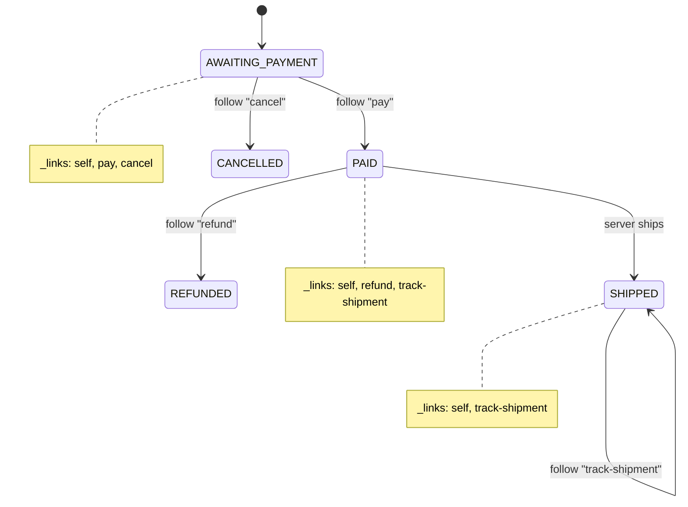

# Hypermedia & HATEOAS

**HATEOAS** — *Hypermedia As The Engine Of Application State* — is the constraint that makes
an API "RESTful" in Roy Fielding's original sense. The idea: a client should be able to
interact with a service **purely by following links and forms the server sends in
responses**, the same way a human browses the web by clicking links rather than typing raw
URLs. The server, not out-of-band documentation, tells the client what it can do next.

This topic is framework-agnostic. It is about the **wire contract** — the JSON/XML a client
actually receives, the `Link` headers, the media types — not about any framework's link
builders. We cover what hypermedia controls are, the standard formats (HAL, JSON:API, Siren,
JSON-LD/Hydra), link relations and RFC 8288, and the honest engineering trade-off: HATEOAS is
the least-adopted REST constraint, and most production "REST" APIs deliberately stop at
Richardson Level 2.

> [!KEY-TAKEAWAY]
> HATEOAS trades **up-front client simplicity** for **long-term server evolvability**. The
> server can move URLs and change workflows because clients discover them at runtime instead
> of hard-coding them. The cost is real (more complex payloads, smarter clients, more round
> trips), and it only pays off when you have many independently-evolving clients you cannot
> coordinate — which is why most internal/first-party APIs skip it.

## HATEOAS and the Richardson Maturity Model

Leonard Richardson's **Maturity Model** (popularized by Martin Fowler) grades how fully an API
uses the web's mechanics. It is a teaching heuristic, not an official spec.

| Level | Name | What it means |
|---|---|---|
| **0** | The Swamp of POX | One URI, one verb (usually `POST`). Plain-old-XML/JSON RPC tunneled over HTTP. (e.g. SOAP, XML-RPC) |
| **1** | Resources | Many URIs, one verb. Individual resources have their own URLs, but everything is still `POST`. |
| **2** | HTTP Verbs | Proper use of `GET`/`POST`/`PUT`/`DELETE` and status codes. **Most real "REST" APIs live here.** |
| **3** | Hypermedia Controls | Level 2 **plus HATEOAS**: responses carry links/forms that drive the next transition. |

Level 3 is HATEOAS. Fielding has stated that **an API cannot be called REST unless it is
hypermedia-driven** — Levels 0–2 are, in his framing, HTTP-based RPC, not REST. In everyday
industry usage, though, "REST API" almost always means a well-designed Level 2 API.

**Concretely**, the difference between Level 2 and Level 3:

Level 2 response — the client must *know* how to build the next URL from out-of-band docs:

```json
{ "id": 42, "status": "AWAITING_PAYMENT", "total": 30.00 }
```

Level 3 response — the server *tells* the client what it can do next:

```json
{
  "id": 42, "status": "AWAITING_PAYMENT", "total": 30.00,
  "_links": {
    "self":   { "href": "/orders/42" },
    "pay":    { "href": "/orders/42/payment" },
    "cancel": { "href": "/orders/42" }
  }
}
```

Note the affordances are **state-dependent**: once the order is `PAID`, the server drops
`pay`/`cancel` and instead offers `refund` or `track-shipment`. The client does not hard-code
"you can cancel an awaiting-payment order" — it just renders whatever links are present. This
is what "hypermedia as the engine of application state" literally means: the *available
transitions* are carried in the representation.

Seen as a state machine, the order's lifecycle *is* the set of links the server emits at each
state — the client walks the machine by following whichever affordance it wants:



## Hypermedia controls: links and actions

A **hypermedia control** is any element in a representation that tells the client about a
possible interaction. There are two broad kinds, and formats differ sharply in which they
support:

- **Links** — a URL plus a **link relation** (`rel`) describing its meaning: "here is the
  `next` page", "here is the `author` of this article." A link, by itself, implies a safe
  `GET` unless otherwise typed.
- **Actions / affordances** — a richer control describing a *state-changing* operation: the
  target URL **plus the HTTP method, expected fields, and content type**. This is the
  hypermedia equivalent of an HTML `<form>`: `<form method="POST" action="...">` with input
  fields. It tells the client not just *where* but *how* to submit data.

```json
// A Siren-style action: server describes the whole request the client should make
{
  "name": "add-item",
  "title": "Add line item",
  "method": "POST",
  "href": "/orders/42/items",
  "type": "application/json",
  "fields": [
    { "name": "productId", "type": "text" },
    { "name": "quantity",  "type": "number", "value": "1" }
  ]
}
```

**The key limitation of most JSON hypermedia formats:** HAL and JSON:API only carry **links**,
not actions. They tell you a URL and a `rel` but not the method or the fields — so the client
still needs out-of-band knowledge of *how* to `POST` to that URL. Only **Siren, JSON-LD/Hydra,
Collection+JSON, and HTML itself** natively express full actions with methods and fields. This
gap is a common interview probe: "does HAL let the server describe a POST body? — No."

## Link relations and RFC 8288 Web Linking

A link is meaningless without a **relation type** telling the client what the link *means*.
**RFC 8288 (Web Linking)** — which **obsoletes RFC 5988** — is the standard that defines links
abstractly and specifies the HTTP **`Link` header** serialization. It also governs the IANA
**Link Relation Types** registry.

Two categories of relation:

- **Registered relations** — short, bare tokens from the IANA registry: `self`, `next`,
  `prev`, `first`, `last`, `up`, `related`, `describedby`, `edit`, `collection`, `item`,
  `search`, `alternate`, `license`, `next-archive`, etc. Use these when one fits.
- **Extension relations** — for domain-specific rels you must use an **absolute URI** as the
  relation name (e.g. `https://api.example.com/rels/cancel-order`), so it is globally
  unambiguous. HAL's **CURIE** mechanism exists to abbreviate these long URIs.

The `Link` **HTTP header** (RFC 8288) is format-independent — it works even when the body is a
binary blob or a plain resource with no hypermedia envelope:

```http
HTTP/1.1 200 OK
Content-Type: application/json
Link: <https://api.example.com/orders?page=3>; rel="next",
      <https://api.example.com/orders?page=1>; rel="first",
      <https://api.example.com/orders?page=5>; rel="last",
      <https://api.example.com/orders/42>; rel="self"
```

Each link value is `<target-URI>` followed by `;`-separated parameters: `rel` (relation),
plus optional `type` (media type), `title`, `hreflang`, `anchor`, etc. Multiple links are
comma-separated. GitHub's pagination famously uses exactly this header. `Link` headers are the
lowest-friction way to add hypermedia to an otherwise Level-2 API without changing the body.

> [!TIP]
> Because `Link` is a header, you can add pagination or `describedby` (pointing at an OpenAPI
> or JSON Schema doc) links to *any* response — even file downloads — without touching the
> response body or forcing a new media type on clients.

## Common link relations: self, next, prev, related

The relations you will be asked about most:

| Rel | Meaning |
|---|---|
| `self` | The canonical URI of *this* resource. Lets a client re-fetch or bookmark it, and know its own identity even if reached via a search/collection. |
| `next` / `prev` | The next / previous page in a paged collection. (`prev` is the registered token; `previous` appears as a synonym — prefer `prev`.) |
| `first` / `last` | The first / last page of a paged collection. |
| `up` | The parent resource in a containment hierarchy (e.g. from a line item `up` to its order). |
| `related` | A resource related to the current one, when no more specific rel fits. |
| `collection` / `item` | From a member to the collection that contains it (`collection`), or from a collection to a member (`item`). |
| `describedby` | A description of this resource — e.g. its JSON Schema or OpenAPI/profile document. |
| `edit` | A URI you can `PUT`/`PATCH`/`DELETE` to modify this resource. |

`self` is the most important and most universally emitted. A robust hypermedia client stores
the `self` link rather than reconstructing URLs, so the server is free to change its URL
scheme. `next`/`prev`/`first`/`last` are the workhorses of **link-based (cursor or page)
pagination** — the server hands the client the exact next URL (often with an opaque cursor),
so the client never builds pagination URLs itself.

## HAL (Hypertext Application Language)

**HAL** (Mike Kelly) is the **simplest and most widely adopted** JSON hypermedia format. It
remained an IETF Internet-Draft (it never became an RFC) yet is used by many APIs and tools
(Spring HATEOAS defaults to it, Amazon API Gateway, PayPal, and others). Media types:
**`application/hal+json`** and `application/hal+xml`.

HAL adds exactly two reserved properties to an otherwise ordinary JSON object:

- **`_links`** — a map of `rel` → link object (or array of link objects). A link object has
  `href` and optional `templated`, `type`, `title`, `deprecation`, `name`, `profile`,
  `hreflang`.
- **`_embedded`** — related resources sent inline to save round trips; each is itself a HAL
  document. This is HAL's answer to chattiness.

```json
{
  "orderNumber": 42,
  "total": 30.00,
  "_links": {
    "self":     { "href": "/orders/42" },
    "next":     { "href": "/orders/43" },
    "customer": { "href": "/customers/7", "title": "Alice" },
    "ea:items": { "href": "/orders/42/items", "templated": false }
  },
  "_embedded": {
    "customer": { "id": 7, "name": "Alice", "_links": { "self": { "href": "/customers/7" } } }
  }
}
```

- **`templated: true`** marks a **URI Template** (RFC 6570) in `href`, e.g.
  `"/orders{?page,size}"` — the client fills in variables.
- **CURIEs** (Compact URIs) let HAL abbreviate long extension-relation URIs. A `curies` link
  defines a prefix; `ea:items` above expands via the `ea` curie to a full documentation URI.
  This keeps custom rels self-documenting without bloating every link name. (Full CURIE
  expansion mechanics are covered later in *JSON:API v1.1, CURIEs, and client-driven includes*.)

**HAL's deliberate limitation:** it models **links only, no actions** — no method, no input
fields. A client following the `next` link knows to `GET` it, but for a state change the
client must know out-of-band that, say, cancelling is `DELETE /orders/42`. HAL trades
expressiveness for minimalism, which is exactly why it is the most adopted format.

## JSON:API

**JSON:API** (jsonapi.org, current spec **v1.1**) is an opinionated, comprehensive convention
that standardizes not just hypermedia but the *entire* payload shape: resource identity,
relationships, sparse fieldsets, compound documents, sorting, pagination, and errors. Media
type: **`application/vnd.api+json`**. A conforming client/server must send this exact media
type (a JSON:API-specific rule that trips people up).

```json
{
  "data": {
    "type": "orders",
    "id": "42",
    "attributes": { "total": 30.00, "status": "AWAITING_PAYMENT" },
    "relationships": {
      "customer": {
        "links": { "self": "/orders/42/relationships/customer",
                   "related": "/customers/7" },
        "data": { "type": "customers", "id": "7" }
      }
    },
    "links": { "self": "/orders/42" }
  },
  "included": [
    { "type": "customers", "id": "7", "attributes": { "name": "Alice" } }
  ],
  "links": { "self": "/orders?page[number]=1", "next": "/orders?page[number]=2" }
}
```

Key ideas: every resource is `{type, id, attributes, relationships, links}`; **`included`**
carries **compound documents** (sideloaded related resources) to cut round trips — analogous
to HAL's `_embedded`; **`links`** appears at document, resource, and relationship levels with
`self`/`related` and pagination rels. Because so much is standardized, generic clients and
tooling (Ember Data, many libraries) can consume any JSON:API service. The flip side is that
the format is heavy and the strict media-type/structure rules make ad-hoc responses harder.
JSON:API is primarily **link-based**; it does not define generic form/action affordances the
way Siren does. (The v1.1 refinements — link objects, `describedby`, profiles/extensions, and
client-driven `include`/sparse-fieldsets — are treated later in *JSON:API v1.1, CURIEs, and
client-driven includes*.)

## Siren

**Siren** (`application/vnd.siren+json`, by Kevin Swiber) is designed around **entities and
actions**, making it the go-to JSON format when you need to express *state transitions*, not
just navigation. A Siren entity has:

- **`class`** — the nature/type of the entity (e.g. `["order"]`), for client styling/logic.
- **`properties`** — the resource's data fields.
- **`entities`** — sub-entities (embedded or linked), each with their own `rel`.
- **`actions`** — the distinguishing feature: full descriptions of state-changing operations,
  each with `name`, `method` (`GET`/`POST`/`PUT`/`PATCH`/`DELETE`), `href`, `type`
  (request content type), and **`fields`** (name/type/value) — a machine-readable form.
- **`links`** — navigational links with `rel` + `href`.

```json
{
  "class": ["order"],
  "properties": { "orderNumber": 42, "status": "AWAITING_PAYMENT", "total": 30.00 },
  "actions": [
    {
      "name": "cancel-order", "title": "Cancel Order",
      "method": "DELETE", "href": "https://api.example.com/orders/42"
    },
    {
      "name": "add-item", "method": "POST",
      "href": "https://api.example.com/orders/42/items",
      "type": "application/json",
      "fields": [ { "name": "productId", "type": "text" },
                  { "name": "quantity", "type": "number" } ]
    }
  ],
  "links": [ { "rel": ["self"], "href": "https://api.example.com/orders/42" } ]
}
```

Because Siren describes **method + fields**, a generic client can render a real form/button
for each action without hard-coding how to build the request — the closest common JSON format
to HTML's own form semantics. The cost is verbosity and low adoption relative to HAL.

## JSON-LD and Hydra

**JSON-LD** (`application/ld+json`) is a **W3C Recommendation** for representing **Linked
Data** in JSON — the same graph model as RDF, but JSON-shaped. Its hallmark is **`@context`**,
which maps the document's plain terms to global IRIs so the data is unambiguous across
organizations, plus **`@id`** (a resource's global identifier) and **`@type`**. JSON-LD is
heavily used for **SEO/semantic web** (schema.org markup consumed by search engines), not
only APIs.

JSON-LD by itself is a *data* format, not a hypermedia-controls format. **Hydra** is a
vocabulary layered on JSON-LD that adds the hypermedia controls: **`hydra:Operation`**
(method + expected/returned types), **`hydra:Collection`** with paging, `hydra:Link`, and an
**ApiDocumentation** so a client can discover supported operations. JSON-LD + Hydra therefore
*can* express full actions, like Siren, while also giving you semantic, self-describing terms.

```json
{
  "@context": "https://www.w3.org/ns/hydra/context.jsonld",
  "@id": "/orders/42",
  "@type": "Order",
  "total": 30.00,
  "operation": [
    { "@type": "Operation", "method": "DELETE" }
  ]
}
```

Trade-off: maximum interoperability and machine-understandability, but the highest conceptual
overhead (linked-data/RDF thinking, contexts) — which is why Hydra adoption in mainstream web
APIs is limited compared with HAL.

## Choosing a hypermedia format

There is no single "right" format; pick by how much the server must express and how smart
clients are.

| Format | Media type | Links | Actions (method+fields)? | Embedding | Adoption / niche |
|---|---|---|---|---|---|
| **`Link` header** | (any body) | Yes | No | No | Zero-friction pagination on Level-2 APIs |
| **HAL** | `application/hal+json` | Yes | **No** | `_embedded` | Most popular; simple, minimal |
| **JSON:API** | `application/vnd.api+json` | Yes | No (link-based) | `included` | Full payload convention + tooling |
| **Siren** | `application/vnd.siren+json` | Yes | **Yes** | `entities` | Rich state-machine / action-driven APIs |
| **Collection+JSON** | `application/vnd.collection+json` | Yes | **Yes** (templates/queries) | items | Collection-centric CRUD |
| **JSON-LD + Hydra** | `application/ld+json` | Yes | **Yes** | via graph | Semantic web, linked data, max interop |

Rules of thumb: use the **`Link` header** to bolt pagination onto an existing API cheaply; use
**HAL** when you want lightweight discoverability and navigation; reach for **Siren** or
**JSON-LD/Hydra** when the server genuinely needs to drive *workflow* (which operations are
valid right now, with which fields); use **JSON:API** when you want a whole-payload standard
with off-the-shelf client tooling.

> [!INTERVIEW]
> "Which format would you pick and why?" is a favorite. Strong answer: name the axis
> (links-only vs. full actions, minimalism vs. tooling) and match it to the constraint —
> e.g. "HAL if I just need navigable, self-describing resources; Siren/Hydra if the client
> must render valid next-actions from the server, because HAL can't express the method or
> fields."

## Benefits: discoverability, loose coupling, evolvability

The case *for* HATEOAS:

- **Discoverability / self-documentation.** A client can start at one entry point (a "home"
  or root document) and discover the whole API by following `rel`s — like a site map. Tools
  and even humans can explore without reading a URL cookbook.
- **Loose coupling from URI structure.** Clients store and follow the server's links instead
  of hard-coding URL templates. The server can **relocate resources, reshape URL paths, or
  shard onto new hosts** and correctly-written clients keep working — they only depend on the
  stable *link relations*, not the URLs. Google/AWS-style URL changes become non-breaking.
- **Evolvability of workflow.** Because the server advertises which transitions are available
  *per state*, business-rule changes (e.g. "orders over \$X now require approval before
  payment") can be expressed by changing which links appear — clients adapt automatically
  instead of re-implementing the state machine.
- **State-driven UI.** A client can render buttons directly from the affordances present
  ("show Cancel only if a `cancel` link exists"), keeping authorization/business logic on the
  server rather than duplicated in every client.

> [!KEY-TAKEAWAY]
> The single strongest argument for HATEOAS is **decoupling the client from URI construction
> and from the workflow state machine**. If those are the things changing most often, and you
> can't redeploy every client in lockstep, hypermedia earns its keep.

## Costs and criticisms: complexity, adoption, chattiness

The honest case *against*, which a good candidate volunteers:

- **Client complexity.** Truly generic hypermedia clients (that discover everything at
  runtime) are hard to write and rare. In practice most clients still hard-code some `rel`s
  and shapes, so the theoretical decoupling is only partly realized. You still need shared
  understanding of link relations and field semantics — hypermedia doesn't eliminate
  out-of-band knowledge, it *reduces* it.
- **Payload bloat & verbosity.** Every response carries a `_links`/`actions` envelope; nested
  entities and CURIEs add weight. This matters on mobile/low-bandwidth.
- **Chattiness / round trips.** Pure "follow links from the root each time" causes many
  requests. Formats mitigate this with **embedding** (`_embedded`, `included`, sub-entities)
  and with `Link` headers, but embedding reintroduces coupling and cache complexity.
- **Weak/ambiguous action semantics.** Link-only formats (HAL, JSON:API) can't tell a client
  *how* to perform a state change, so clients still hard-code methods and bodies — undercutting
  the promised loose coupling.
- **Tooling & ecosystem gaps.** OpenAPI-centric tooling, code generators, and most SDKs assume
  fixed URLs; they don't consume runtime links well. Caching and testing get harder.
- **Cost rarely repaid.** Fielding's own observation: almost nobody builds the fully generic
  clients that would justify Level 3. If you control both ends and deploy together, hypermedia
  is overhead with little payoff.

## When HATEOAS is worth it (and why most APIs are Level 2)

The pragmatic verdict.

**Worth it when:**
- You have **many clients you do not control** and cannot upgrade in lockstep (public APIs,
  large partner ecosystems, long-lived native apps).
- **URLs or workflows change often**, and you want those changes to be non-breaking.
- The interaction is a **stateful workflow / state machine** (checkout, approvals, provisioning)
  where "what can I do next?" genuinely depends on server state — advertise transitions.
- You want **generic, reusable clients/tools** (a console, an admin explorer) driven by the
  server rather than bespoke per-endpoint code.

**Usually not worth it when:**
- **First-party / internal** APIs where the same team owns client and server and ships them
  together — a shared contract (OpenAPI) is cheaper than runtime discovery.
- **Performance-sensitive** or high-volume machine-to-machine calls where envelope overhead
  and extra round trips hurt.
- Simple CRUD where clients legitimately just need stable URLs.

**Why most "REST" APIs are Level 2:** the industry converged on the observation that Level 2 +
good docs (OpenAPI) + link-header pagination captures **most** of REST's practical benefits
(uniform interface, cacheability, statelessness) at a fraction of the cost, and that the
hypothetical fully-dynamic client that would justify Level 3 rarely materializes. Stripe,
Twilio, and most SaaS APIs are Level 2. Notable partial-Level-3 adopters include **GitHub**
(`Link`-header pagination and some hypermedia), **PayPal** (HAL-style `links`), and **AWS API
Gateway** (HAL for its management API). So HATEOAS is best treated as a **targeted tool**, not
a checkbox: apply it where independent-client evolvability is the dominant force.

> [!WARNING]
> Do not claim your API "is REST" merely because it uses nouns and HTTP verbs — by Fielding's
> definition that is Level 2 / HTTP RPC, not REST. Either implement hypermedia or, more
> honestly in an interview, say "it's a pragmatic Level-2 HTTP API" and justify *why* Level 3
> wasn't worth it. Interviewers reward the nuance far more than the buzzword.

## HAL-FORMS: describing writes in HAL

HAL's biggest practical gap — "it can't describe a `POST`" — was answered by the community with
**HAL-FORMS**, media type **`application/prs.hal-forms+json`**. The `prs.` tree marks it a
*personal* (vendor-adjacent) media type from a Mike Amundsen working draft, **not** part of the
HAL spec: a HAL-FORMS document MUST NOT be treated as plain `application/hal+json`, though it is
designed to be backward-compatible with it.

HAL-FORMS adds a top-level **`_templates`** object alongside HAL's `_links`/`_embedded`. The
conventional key is **`default`**; each template describes one write:

```json
{
  "_links": { "self": { "href": "/orders/42" } },
  "properties": { "status": "AWAITING_PAYMENT" },
  "_templates": {
    "default": {
      "method": "POST",
      "contentType": "application/json",
      "target": "/orders/42/payment",
      "title": "Pay for order",
      "properties": [
        { "name": "cardToken", "prompt": "Card", "required": true, "readOnly": false },
        { "name": "amount", "type": "number", "required": true, "min": 0, "value": "30.00" },
        { "name": "currency", "options": { "inline": ["USD","EUR","GBP"] } }
      ]
    }
  }
}
```

Key fields: `method`, `contentType` (defaults to `application/json`), `target` (defaults to the
resource's own `self`), `title`, and **`properties[]`** — each a form field with `name`,
`prompt`, `readOnly`, `required`, `regex`, `value`, `templated`, plus HTML5-style constraints
(`type`, `min`, `max`, `minLength`, `maxLength`) and **`options`** for enumerations. `options`
values can be listed **`inline`** or fetched **by reference** via a `link` (`href` +
`templated`), with `minItems`/`maxItems`/`promptField`/`valueField` controlling selection. This
is HAL's route to Siren-grade affordances without abandoning the HAL ecosystem; the alternatives
are describing writes out-of-band in OpenAPI, or switching to Siren/Collection+JSON/Hydra.

## Registering link relations: the IANA process

RFC 8288 gives two ways to name a relation, but only one requires ceremony. **Extension
relations** — an absolute URI you control (e.g. `https://api.example.com/rels/cancel-order`) —
need **no registration**: minting a URI under a domain you own is globally unambiguous by
construction, which is why it is the pragmatic default for private/domain rels. **Registered
relations** — bare tokens like `self`, `next`, `payment` — must go through the IANA **Link
Relation Types** registry. Per RFC 8288 §2.1.1 / §7.1 the registration policy is
**"Specification Required"** (RFC 8126): you supply a stable, public specification defining the
relation's semantics, and a **Designated Expert** reviews it before the token is added.

Practical consequence for interviews: "how do I add a custom rel the *right* way?" has two
correct answers depending on scope. For an internal/domain-specific transition, **mint an
extension URI** — do not squat on a bare token that might later be registered with different
semantics. Only pursue IANA registration when the relation is genuinely reusable across the web
and you can write and publish its spec. Bare tokens you invent (`cancel-order`) are technically
illegal as relation names and risk colliding with a future registered token.

## Form and affordance link relations

Link-only formats gesture at writes using **registered relations** whose targets are forms or
services, rather than inline actions:

- **`create-form`** and **`edit-form`** (RFC 6861) — link to a resource that describes how to
  *create* a new item, or *edit* the current one. A HAL response can carry a `create-form` link
  to a HAL-FORMS document, bridging the links-only gap.
- **`edit`** — the resource you may `PUT`/`PATCH`/`DELETE` to modify this one (contrast with
  `edit-form`, which points at the *form describing* the edit).
- **`search`** — a resource (often an OpenSearch description or a templated query endpoint) for
  searching.
- **`service-desc`** / **`service-doc`** — machine-readable service description (e.g. an OpenAPI
  document) vs. human documentation. This is how a root document can point at its own OpenAPI.
- **`describedby`** — a description/schema of *this* resource (JSON Schema, profile).
- **`status`**, **`deprecation`** (a link/date announcing a resource or link is deprecated),
  **`preload`**, **`profile`**, **`alternate`**.

Knowing rels beyond `self`/`next` is a common senior discriminator: it shows you can drive writes
and discovery through registered semantics instead of inventing bespoke tokens for everything.

## The profile link relation and media-type parameter

A generic media type like `application/hal+json` tells a client the *syntax* but not the
*application semantics* (what the fields mean, which rels exist). **RFC 6906** defines the
**`profile`** link relation and the matching **`profile` media-type parameter** to layer that
semantic contract on top without minting a new media type.

Two wire forms:

- As a link: `Link: <https://schemas.example.com/order>; rel="profile"`, or HAL's per-link
  `profile` property.
- As a **content-negotiation parameter**: `Content-Type: application/hal+json;profile="https://schemas.example.com/order"`,
  and clients can request it via `Accept: application/hal+json;profile="…"`.

A profile MUST NOT change how the base media type is parsed — it only adds meaning. This is the
standards-grounded answer to "how does a client know what the fields mean?": it dereferences (or
recognizes) the profile URI. JSON:API's `describedby` document link and its `profile`
media-type parameter play the same role.

## Hypermedia and security: affordances are not authorization

A powerful pattern: the server **omits an affordance the caller isn't allowed to use** — no
`cancel` link appears if this user can't cancel — so the *presence of a link is the capability
signal* that drives the UI. This keeps authorization logic on the server and out of every client.

The senior trap is treating link presence **as** the authorization mechanism. It is not. A
client can forge any URL+method it observed in another response, another user's session, or the
docs. You MUST still enforce authorization **server-side on every request**. In OWASP API
Security Top 10 (2023) terms, relying on hidden affordances invites **API1: Broken Object Level
Authorization (BOLA)** — the client swaps in an object id it isn't entitled to — and **API5:
Broken Function Level Authorization (BFLA)** — the client invokes an operation/verb that was
merely hidden, not blocked. A second, subtler risk: **leaking affordances leaks business state**
(e.g. exposing a `escalate-to-fraud-team` link tells the caller they're flagged). Affordance
presence is a UX/discoverability optimization layered *on top of* real server-side checks, never
a substitute.

## Hypermedia and caching: embedding vs linking

The embedding-vs-linking choice is also a **caching** decision (RFC 9111). When you **link** to
a sub-resource, each resource keeps its own URL and therefore its own `Cache-Control`, `ETag`,
and `Last-Modified` — caches (shared or private) can store, revalidate, and invalidate it
independently, and a conditional `GET` with `If-None-Match` can yield a cheap `304`. When you
**embed** (`_embedded`, `included`, Siren sub-`entities`), the sub-resource's representation is
folded into the parent's response body: it now shares the parent's freshness lifetime and
validator. You lose independent expiry (a rarely-changing customer embedded in a frequently
changing order is re-sent constantly) and you complicate invalidation (mutating the customer
doesn't invalidate the composite order URL that carries a stale copy). So embedding trades
**round trips** for **cache granularity**: fewer requests, but coarser, harder-to-invalidate
caching. High-read APIs often prefer linking + HTTP caching over aggressive embedding for exactly
this reason.

## Versioning and hypermedia

A common claim is "HATEOAS eliminates API versioning." It does not — it **moves** the problem.
Because clients follow links instead of building URLs, the server can relocate, rename, or
reshape endpoints without a `/v2/` path, so **URL churn becomes non-breaking**. But the parts
clients actually couple to still evolve and still need versioning: the **media type**
(`application/vnd.example.order.v2+json`), the **link-relation semantics** (what `pay` expects),
and the **field/profile contract**. You version *those* — typically via media-type parameters or
new profiles negotiated with `Accept` — rather than the path. The honest framing: hypermedia
kills *URL* versioning pressure but relocates versioning to rels/media-types; and since most
Level-2 APIs don't invest in that, they version in the path anyway.

Hypermedia also gives you a graceful **deprecation** channel that complements versioning. HAL
link objects carry a **`deprecation`** property — a URL that, when present, marks the link as
deprecated and points at an explanation, so a client following an old rel gets a machine-readable
"this is going away" signal in-band. At the HTTP layer, **RFC 8594** defines the **`Sunset`
response header** (an HTTP-date after which the resource is expected to become unresponsive) and
the companion **`sunset`** link relation pointing at deprecation documentation. Together these let
a server phase out a rel or resource without a hard version break: advertise the replacement link,
flag the old one via `deprecation`/`Sunset`, then remove it after the announced date. This is the
hypermedia-native alternative to "freeze v1 forever." "Does HATEOAS solve
versioning?" → "No; it changes *what* you version, from URLs to relation/media-type semantics."

## OpenAPI links are not runtime HATEOAS

OpenAPI 3.x has a **Link Object**, and candidates routinely conflate it with hypermedia. It is
**design-time, not runtime**. An OpenAPI Link lives in the *API description* (the spec file), not
in any response payload. It says "after operation X, you *could* call operation Y," identifying Y
by **`operationId`** or **`operationRef`**, and wiring inputs with **runtime expressions** like
`$response.body#/id` or `$response.header.Location`. Contrast this with true HATEOAS, where the
server puts the concrete next links **in the response body at runtime**, based on the resource's
actual state and the caller's permissions.

Two consequences worth stating: (1) OpenAPI Links describe *possible* transitions statically for
documentation/tooling, whereas hypermedia advertises *currently-valid* transitions dynamically;
(2) OpenAPI/JSON-Schema tooling and code generators assume **fixed, described URLs** and cannot
consume server-provided runtime links — which is itself part of *why* Level-3 adoption stays low
(the dominant tooling ecosystem doesn't support it).

## Errors as hypermedia: RFC 9457 Problem Details

**RFC 9457** (Problem Details for HTTP APIs, obsoletes RFC 7807) is quietly hypermedia-flavored.
Its **`type`** member is a **URI** that identifies the problem kind and SHOULD dereference to
human-readable documentation about it, and **`instance`** is a URI identifying the *specific
occurrence* — both are effectively links. Beyond the standard members (`type`, `title`, `status`,
`detail`, `instance`), Problem Details allows **extension members**, so an error can carry real
affordances: e.g. an `_links` block or a `retry`/`authenticate`/`help` link telling the client
how to recover. A 402/403 can point at how to authenticate; a 429 can carry a link to rate-limit
docs. This ties the error-handling standard back into hypermedia: even failures can drive the
next transition rather than being dead ends.

## HTML as hypermedia and the HDA revival

A live 2023–2025 debate reframes the whole topic. The argument (htmx essays; *Hypermedia
Systems*, Gross/Stepinski/Amundsen, 2023) is that **HTML is the only mainstream format that ships
affordances natively** — `<a href>` for links and `<form method="post" action="…">` for actions
are hypermedia controls built into the format and understood by a universal client (the browser).
JSON hypermedia (HAL/Siren/etc.) is, on this view, a *workaround* re-inventing what HTML already
has, and the industry's pivot to JSON "REST" APIs was really a pivot to **RPC-style JSON** that
*discarded* hypermedia. **htmx** operationalizes this: the server returns HTML fragments carrying
the next affordances, and the client swaps them into the DOM — "**Hypermedia-Driven
Applications (HDA)**." The interview value is showing you know the debate is current, not
historical, and that the cleanest HATEOAS in production is often plain HTML, not a JSON envelope.

## Where hypermedia fits in a microservices topology

At system altitude, hypermedia earns its place selectively:

- **Internal service-to-service** calls are almost always **Level 2** (or gRPC/protobuf with
  typed, generated clients). Both ends deploy together, latency matters, and typed contracts beat
  runtime discovery — hypermedia is overhead here.
- **Public APIs and Backends-for-Frontend (BFF)** are where server-driven affordances can pay
  off: a BFF that returns *state-dependent action links* lets the UI render valid next-steps
  without re-encoding the workflow, and a public API with uncontrolled clients benefits from
  non-breaking URL evolution.
- Hypermedia can also serve as a lightweight **service-composition / discovery** mechanism — the
  root document links to sub-services — though a dedicated service registry/discovery layer is
  usually the better tool at scale.

The staff-level answer to "where would you actually use HATEOAS?" is: at the **edge** (public
API / BFF driving a UI), not on internal typed RPC paths.

A frequent 2025 interview pivot is **"how does GraphQL relate to HATEOAS?"** They attack
client/server coupling from opposite directions. HATEOAS keeps coupling low by letting the
*server* drive which resources and transitions are reachable at runtime (the client follows
links). GraphQL keeps coupling low by letting the *client* declare exactly the fields and graph
it wants in one query — a client-driven, single-endpoint model that deliberately discards
per-resource URLs, HTTP caching, and server-advertised affordances. GraphQL solves
over-/under-fetching and chattiness (the problems embedding tries to solve in HAL/JSON:API) but
does **not** advertise *state-dependent next actions* — "what can I do to this order now?" is not
something a GraphQL schema expresses the way a Siren `actions` block or a state-dependent
`_links` set does. So they are not substitutes: GraphQL optimizes data shaping; HATEOAS
optimizes workflow/URL evolvability.

## URI Templates in depth (RFC 6570)

RFC 6570 defines four **levels** of expressiveness for the templated hrefs that appear with
`templated: true`:

- **Level 1** — simple string expansion: `/users/{id}` → `/users/42`.
- **Level 2** — reserved (`{+var}`, keeps `/`, `?`, `&` unencoded) and fragment (`{#var}`)
  expansion: `{+path}/here` → `/foo/bar/here`.
- **Level 3** — multiple variables and **operators**: path segments `{/seg}`, path-style params
  `{;matrix}`, **query** `{?q,r}` (emits `?q=…&r=…`), **query continuation** `{&cont}` (emits
  `&cont=…`, for appending to an existing query), and label `{.fmt}`.
- **Level 4** — **modifiers**: prefix `{var:3}` (first 3 chars) and **explode** `{list*}`
  (a list `[a,b]` becomes `list=a&list=b`; an object explodes to `k1=v1&k2=v2`).

The ubiquitous form-query case is **`{?page,size}`**. The `?` vs `&` distinction is a real
detail-check: **`{?q}`** *starts* the query string with a `?`, while **`{&q}`** *continues* an
existing one with `&` — so you use `{&filter}` when the base URL already has query params. Note
the trade-off: a templated link pushes **URL construction back onto the client**, which is a
partial retreat from pure HATEOAS (the client is now assembling the URL, not just following it),
justified when enumerating every combination as concrete links would be impractical.

## JSON:API v1.1, CURIEs, and client-driven includes

Two refinements deepen the earlier JSON:API and HAL treatments.

**CURIE mechanics (HAL).** A CURIE is a W3C **Compact URI Expression**. In HAL, `curies` is
itself a **reserved link relation** whose value is an array of link objects, each with a `name`
(the prefix), a **`templated: true`** `href` containing a `{rel}` placeholder, and typically
`"templated": true`. A rel like `ea:items` is expanded by substituting `items` into the `ea`
prefix's template (e.g. `https://docs.example.com/rels/{rel}` → `https://docs.example.com/rels/items`),
yielding a dereferenceable documentation URI. So CURIEs don't just shorten — they make custom
rels self-documenting.

**JSON:API v1.1 additions.** v1.1 upgraded a bare-string `links` value to a **link object with
`href` + `meta`**; added a document-level **`describedby`** link; and introduced a **profiles**
mechanism plus **extensions**, both negotiated via media-type parameters:
`application/vnd.api+json; ext="…"; profile="…"` (v1.1 relaxed the once-strict "no parameters"
rule to allow exactly these). Also note the **client-driven** nature of JSON:API's optimizations:
**`include=author,comments`** lets the *client* request which related resources are compounded
into `included`, and **`fields[articles]=title,body`** (sparse fieldsets) lets the client trim
attributes. That contrasts with HAL's **server-driven** `_embedded` (the server decides what to
inline) — a good discriminator when comparing the two.

## Collection+JSON and other formats to know

**Collection+JSON** (`application/vnd.collection+json`, Mike Amundsen) is the "CRUD-over-
collections" format. Beyond `items[]` (each with `data` name/value pairs and its own `links`), it
uniquely carries a **`template`** object (the write model — the fields to fill when creating/
updating an item) and **`queries`** (templated search affordances with `data` describing query
params). So it is action-capable: `template` tells the client how to `POST`/`PUT`, and `queries`
how to search.

Other formats worth name-dropping for breadth:

- **Mason** (`application/vnd.mason+json`) — HAL-like `@controls` that *do* carry method/schema,
  plus `@error` (a Problem-Details-like error block).
- **UBER** — a minimal, transport/format-agnostic hypermedia design (JSON and XML variants).
- **JSON Hyper-Schema** — the JSON-Schema-native way to attach affordances: a **`links`** keyword
  whose Link Description Objects have `rel`, `href` (a URI Template), `targetSchema`, and
  **`submissionSchema`** (the body to submit). This is the "schema-driven affordance" alternative
  to Siren/HAL-FORMS.
- **Ion** (`application/ion+json`) — a self-describing hypermedia type used by some AWS APIs.

## Follow-your-nose and Cool URIs

The design principle behind `self`: a client should **bookmark one entry point and the `self`
rel**, and thereafter **never construct URLs** — it follows the links the server returns
("follow your nose"). Tim Berners-Lee's "**Cool URIs don't change**" is the server-side
complement: keep URIs stable, but even so, clients depend on rels, not URL shapes. The
anti-pattern is a client that **rebuilds URLs from IDs and templates** (`"/orders/" + id +
"/items"`) — that is precisely the URL-structure coupling HATEOAS exists to kill, and it breaks
the moment the server reshapes its paths. Templated links are a deliberate, bounded exception,
not license to reconstruct arbitrary URLs.

## Testing a hypermedia API

Testing shifts from "assert this fixed endpoint returns X" to **driving the API as a state
machine**. You start at the **root**, follow **rels** to reach a resource, and assert on the
**presence/absence of affordances per state** — e.g. "an `AWAITING_PAYMENT` order MUST expose a
`pay` affordance and MUST NOT expose `refund`; after paying, the reverse." Crucially you assert on
**relations, not URLs**, so the tests survive the URL changes hypermedia is meant to enable.

This is genuinely **harder than contract-testing fixed endpoints**: the test must traverse
multiple hops (more setup, more state), the space of reachable states is larger, and generic
assertions ("this affordance is renderable") are fuzzier than "this URL returns this JSON." The
payoff mirrors the API's: tests that don't break when the server relocates resources. It also
naturally exercises the authorization model (does the `cancel` affordance correctly disappear for
an unauthorized caller?), which fixed-URL tests often miss.

## Industry guidelines: Zalando and Google AIP

Two widely-cited public guideline sets sharpen the pragmatic picture:

- **Zalando RESTful API Guidelines** — **#162 MUST use REST maturity level 2** (proper
  resources + verbs) as the baseline, **#163 MAY use REST maturity level 3 — HATEOAS** (optional,
  not required), **#164** standardizes common hypertext controls (a HAL-ish `_links` shape when
  you do use them), and notably **#166 MUST NOT use `Link` headers with JSON entities** — when
  the body is JSON, put links *in the body*, not in the HTTP `Link` header (for consistency and
  CORS-exposure reasons). This is the balanced counterpoint to the `Link`-header praise elsewhere:
  **GitHub uses `Link`-header pagination and it's widely loved, yet Zalando explicitly bans it
  alongside JSON bodies** — presenting both sides is the senior take.
- **Google AIP-158 (pagination)** mandates **opaque, non-parseable `page_token`s** — the client
  treats the token as a blob and echoes it back, and MUST NOT decode or construct it. That is a
  *deliberately anti-hypermedia* stance at the field level (no self-describing next-URL to follow;
  just an opaque continuation token), and a useful counterpoint to link-based pagination: opacity
  gives the server total freedom to change its paging internals, achieving the *same decoupling
  goal* as a `next` link but by hiding structure rather than by advertising a link.

## Common follow-up questions

- "What does HATEOAS stand for and who coined it?" Hypermedia As The Engine Of Application
  State; from Roy Fielding's 2000 REST dissertation and later blog posts.
- "What Richardson level is a typical REST API, and why not Level 3?" Level 2 — proper
  verbs/status codes; Level 3 (hypermedia) is skipped because generic clients that exploit it
  are rare and the cost seldom pays off.
- "Can HAL describe a POST with a body?" No — HAL carries links only (href + rel), not
  method or fields. Use Siren, Collection+JSON, or JSON-LD/Hydra for full actions.
- "Which RFC defines the `Link` header, and what did it obsolete?" RFC 8288 (Web Linking),
  which obsoletes RFC 5988.
- "How does a hypermedia client avoid hard-coding URLs?" It stores link relations (`self`,
  `next`, custom rels) and follows the `href` the server returns, so the server can relocate
  resources without breaking clients.
- "How do hypermedia formats reduce chattiness?" Embedding related resources inline
  (HAL `_embedded`, JSON:API `included`, Siren sub-`entities`) so one response can satisfy
  several needs.
- "Registered vs. extension link relations?" Registered rels are bare IANA tokens
  (`self`, `next`); extension rels must be absolute URIs to stay globally unambiguous — CURIEs
  abbreviate them.
- "Isn't JSON-LD just for SEO?" It's a W3C Linked-Data format widely used for SEO
  (schema.org), but with the Hydra vocabulary it becomes a full hypermedia API format.

## References

- RFC 9110 — HTTP Semantics: https://www.rfc-editor.org/rfc/rfc9110
- RFC 8288 — Web Linking (obsoletes RFC 5988): https://www.rfc-editor.org/rfc/rfc8288
- RFC 6570 — URI Template: https://www.rfc-editor.org/rfc/rfc6570
- IANA Link Relation Types registry: https://www.iana.org/assignments/link-relations/link-relations.xhtml
- Roy Fielding, "REST APIs must be hypertext-driven": https://roy.gbiv.com/untangled/2008/rest-apis-must-be-hypertext-driven
- Martin Fowler, "Richardson Maturity Model": https://martinfowler.com/articles/richardsonMaturityModel.html
- HAL specification (draft-kelly-json-hal): https://datatracker.ietf.org/doc/html/draft-kelly-json-hal
- JSON:API specification (v1.1): https://jsonapi.org/format/
- Siren specification: https://github.com/kevinswiber/siren
- JSON-LD 1.1 (W3C Recommendation): https://www.w3.org/TR/json-ld11/
- Hydra Core Vocabulary: https://www.hydra-cg.com/spec/latest/core/
- OpenAPI Specification 3.1: https://spec.openapis.org/oas/v3.1.0
