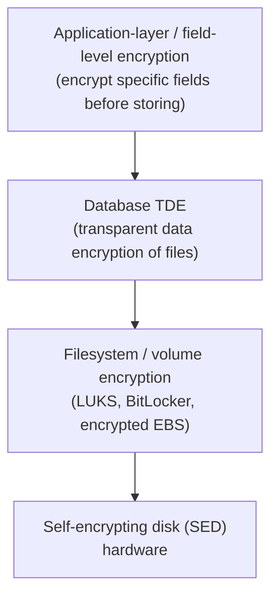
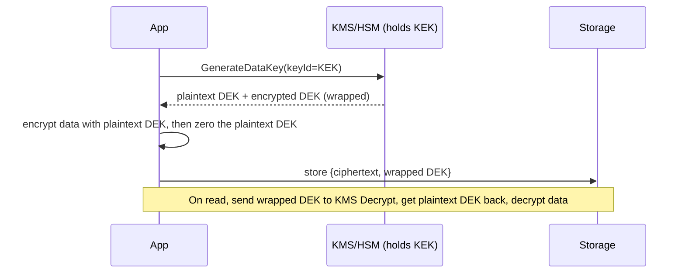
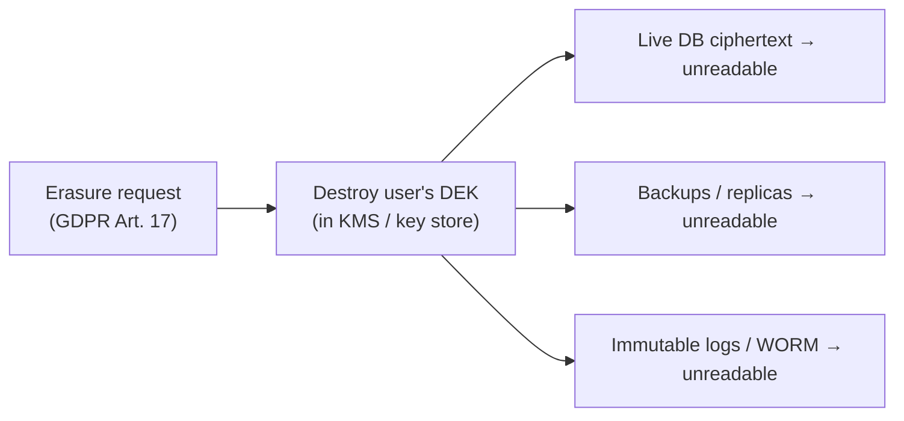

# Application Cryptography & Data Protection (Design)

Cryptography primitives (AES, RSA, HMAC, KDFs, AEAD modes) are covered in
**cryptography-foundations**, and TLS/handshake mechanics live in
**networking/tls-ssl-https**. This topic is about **applying** those primitives at the
application/design layer to protect real data: where you encrypt, how you manage the keys
at scale, how you still search and delete data you can no longer read, and how you shrink
compliance scope. The recurring interview theme is that the *hard* part is not the cipher —
it is **key management, searchability, deletion, and blast-radius**, i.e. the operational
design around the crypto.

> [!KEY-TAKEAWAY]
> Encryption does not "secure data" — it **converts a data-confidentiality problem into a
> key-management problem**. Every design decision here (envelope encryption, per-tenant
> DEKs, crypto-shredding, blind indexes, tokenization) is really a decision about *who can
> use which key, for how long, and what happens when the key is rotated or destroyed*.

See also: **cryptography-foundations** (the primitives), **secrets-management-and-key-lifecycle**
(storing/rotating secrets and keys), **networking/tls-ssl-https** (crypto in transit).

---

## Data States: At Rest, In Transit, In Use

Data protection is framed around three **states**, each needing a different control:

| State | Meaning | Typical control | Threat it stops |
|---|---|---|---|
| **In transit** | Moving over a network | TLS 1.2/1.3, mTLS | Network eavesdrop / MITM |
| **At rest** | Stored on disk/DB/object store/backup | Disk / DB / field encryption | Stolen disk, leaked backup, DB dump |
| **In use** | Loaded in RAM / being processed by CPU | Confidential computing (TEEs), tight memory handling | Malicious host/hypervisor, memory scraping |

The states are **independent** — you need all three. TLS protects the wire but leaves the
database plaintext; disk encryption protects a stolen drive but data is plaintext once the
volume is mounted and the process reads it. A classic interview trap: "we use TLS and
encrypted EBS, so PII is safe." No — an app-level SQL injection or a leaked DB credential
returns **plaintext**, because at query time the data is already decrypted.

> [!INTERVIEW]
> When asked "how would you protect this PII?", answer per-state and per-threat, not with a
> single mechanism. Name the threat model each layer addresses and the gap it leaves.

---

## Encryption at Rest: Choosing the Layer

"Encrypt at rest" can happen at several layers, each protecting against a *different*
threat. Higher in the stack = smaller blast radius but more application complexity.



| Layer | Protects against | Does NOT protect against |
|---|---|---|
| **Self-encrypting disk / volume (EBS, LUKS)** | Physical theft of the drive | A live process reading data; SQLi; leaked DB creds; a rogue DBA — all see plaintext |
| **Database TDE** (Transparent Data Encryption) | Stolen data files/backups | The same — anyone authenticated to the DB sees plaintext; TDE is invisible to `SELECT` |
| **Application / field-level encryption** | Rogue DBA, DB dump, backups, log leaks, most SQLi | Compromise of the app that holds the DEK |

The key insight interviewers want: **TDE and disk encryption are "at rest" only in the very
narrow sense of "the bytes on the platter."** As soon as the DB engine or OS mounts the
data, everything is plaintext to authorized readers. If your threat model includes the DBA,
the cloud provider, backups, or SQL injection exfiltration, you must encrypt **above** the
database — at the application/field layer.

---

## Envelope Encryption (DEK / KEK)

**Envelope encryption** is the dominant pattern for encrypting large volumes of data with a
centrally managed key. Instead of sending all your data to a KMS/HSM (slow, size-limited,
expensive), you use **two levels of keys**:

- **DEK (Data Encryption Key):** a symmetric key (e.g. AES-256) that actually encrypts the
  data. Generated locally / by KMS, used in your app's memory.
- **KEK (Key Encryption Key / "master key" / "root key"):** a key that lives in a KMS/HSM
  and **never leaves it in plaintext**. Its only job is to **encrypt ("wrap") DEKs**.

The flow (AWS KMS `GenerateDataKey` is the canonical example — it returns the DEK **both** in
plaintext and encrypted under the KEK):



You store the **wrapped DEK next to the ciphertext**. To decrypt, you call KMS `Decrypt` on
the wrapped DEK (the only step that needs the KEK), get the plaintext DEK back, decrypt
locally, then zero the DEK from memory.

**Why this design wins:**
- **Performance / size:** bulk encryption is local and fast; KMS only touches tiny DEKs, not
  gigabytes. KMS also has request-size limits (a few KB) — you cannot send big blobs anyway.
- **Cheap rotation:** to rotate the KEK you only **re-wrap the DEKs** (small, fast), not
  re-encrypt terabytes of data. See "Key Rotation Strategy."
- **Granularity:** you can mint a **DEK per record, per file, per tenant** (see below),
  giving fine-grained crypto isolation, while still centrally controlling one KEK.
- **Central control & audit:** every unwrap is a KMS call → one audit log, one place to
  disable/deny a key (revocation), one boundary that enforces IAM policy.

> [!TIP]
> **Per-tenant (or per-record) DEKs** are the standard multi-tenant SaaS pattern: each
> tenant gets its own DEK wrapped by a shared KEK. Deleting a tenant = destroy/forget that
> tenant's DEK (crypto-shredding). A bug that leaks one DEK exposes one tenant, not all.

> [!WARNING]
> The plaintext DEK is the crown-jewel in memory. Minimize its lifetime, don't log it, don't
> persist it, and zero the buffer after use. Also **cache decrypted DEKs carefully** — caching
> avoids a KMS call per operation (cost/latency) but widens the window where a plaintext DEK
> sits in memory and weakens revocation (a disabled KEK won't stop already-cached DEKs).

---

## KMS vs HSM

Both protect keys, but they trade control for convenience.

| | **HSM (Hardware Security Module)** | **KMS (Key Management Service)** |
|---|---|---|
| What it is | Dedicated tamper-resistant hardware appliance that generates/stores keys and does crypto **inside** the boundary | A managed **service/API** for key management (often *backed by* HSMs) |
| Key exposure | Private/root key **never leaves** the hardware in plaintext | KEK never leaves; but service does crypto on your behalf via API |
| Interface | PKCS#11, JCE, KMIP; you manage HA, clustering, firmware | Simple REST/SDK API (`Encrypt`, `Decrypt`, `GenerateDataKey`); provider runs it |
| Compliance | **FIPS 140-2/140-3 Level 3** typical; needed for PCI-DSS/eIDAS "sole control" | Often FIPS 140-2 validated; dedicated single-tenant options exist (e.g. CloudHSM) |
| Ops burden | High (you operate it) | Low (managed) |
| Cost model | High fixed cost per device | Pay per key + per request |
| Multi-tenancy | Single-tenant hardware | Shared service (dedicated HSM options available) |

Rule of thumb: **use the managed KMS** for almost everything (it is usually itself HSM-backed).
Reach for a **dedicated HSM/CloudHSM** when a regulation demands you have *sole control* of
FIPS-Level-3 hardware, need to run custom crypto/PKCS#11, or must keep the root key outside
the cloud provider's reach (e.g. "hold your own key"). In envelope encryption, the **KEK
lives in the KMS/HSM**; DEKs are what you actually handle.

---

## Key Rotation Strategy

Rotation limits the damage of a leaked key and the amount of data encrypted under any single
key (a "cryptoperiod"). The interview point is that **envelope encryption makes rotation
cheap** — you rotate the KEK, not the data.

**Rotating the KEK (cheap):**
- **New material, re-wrap DEKs:** generate a new KEK version; re-encrypt (re-wrap) each small
  wrapped-DEK under the new KEK. Data ciphertext is untouched. This is O(number of DEKs), not
  O(data size).
- **Keep old versions for decrypt:** managed KMS keeps prior key versions so old ciphertext
  (wrapped DEKs) still decrypts; only *new* wraps use the new version. (AWS KMS auto-rotation
  works exactly this way — the key ID is stable, old backing keys are retained for decrypt.)

**Rotating a DEK (expensive):** requires actually **decrypting and re-encrypting the data**
under a new DEK. You do this only when a DEK is believed compromised or on a policy schedule.
Per-record/per-tenant DEKs make this targeted.

**Two general schemes for rotating the key that encrypts data:**
1. **Lazy / on-write rotation:** tag each ciphertext with the **key ID/version** used;
   decrypt with whichever key that record needs; re-encrypt with the current key opportunistically
   (on next write) or via a background job. No big-bang migration.
2. **Eager re-encryption:** scan and re-encrypt everything now (needed if the old key is
   compromised — you cannot leave data readable by a leaked key).

> [!TIP]
> Always **version your ciphertext**: store a small header/metadata (key ID, algorithm,
> nonce). Without a key/version tag you cannot rotate keys or change algorithms without
> guessing — versioning is what makes rotation and crypto-agility possible.

> [!WARNING]
> "Rotating the KEK" does **not** re-protect data against someone who already stole a
> plaintext DEK. If a DEK leaked, you must re-encrypt the data under a fresh DEK. Rotating the
> wrapping key alone is insufficient for a DEK compromise.

---

## Field-Level / Application-Layer Encryption

**Field-level encryption (FLE)**, a.k.a. application-layer encryption, means the application
encrypts **specific sensitive fields** (SSN, card number, health data, tokens) **before** they
reach the database, and decrypts them after reading. The DB stores only ciphertext for those
columns; everything else stays queryable plaintext.

```sql
-- Column stores ciphertext (base64/bytea), never the plaintext SSN.
-- App holds the DEK; DB, DBA, and any DB dump see only ciphertext.
CREATE TABLE customer (
  id           BIGINT PRIMARY KEY,
  email        TEXT,            -- maybe tokenized/blind-indexed
  ssn_ct       BYTEA,          -- AES-256-GCM ciphertext of SSN
  ssn_nonce    BYTEA,          -- per-value nonce/IV
  ssn_key_id   TEXT            -- which DEK/version encrypted it (for rotation)
);
```

**Why choose FLE over TDE/disk encryption:** it protects against the DBA, a stolen DB dump,
leaked backups, replicas, and most SQL-injection exfiltration — because those all see
ciphertext. The **cost** is that the DB can no longer index/sort/join/`LIKE`/range-query the
encrypted column normally (see searchable encryption), and the app must manage keys.

**Design points interviewers probe:**
- Use an **AEAD** mode (AES-GCM, AES-GCM-SIV, ChaCha20-Poly1305) so ciphertext is tamper-evident
  and bound to context. Bind **Additional Authenticated Data (AAD)** — e.g. the row's primary
  key or tenant ID — so an attacker cannot copy ciphertext from one row/tenant into another.
- Store **nonce + key ID** with each value.
- Encrypt only what needs it — over-encrypting kills query performance and searchability.

> [!INTERVIEW]
> "Where does the encryption happen?" is the discriminator: **at rest** (TDE/disk) is invisible
> to the DB engine and protects only stolen media; **field-level** happens in the app and
> protects the data even from anyone with DB access. Know which threat each stops.

---

## Searchable Encryption: Deterministic vs Randomized

The core tension of FLE: **strong (randomized) encryption destroys searchability.** With a
proper AEAD and a random nonce, the *same* plaintext encrypts to a *different* ciphertext every
time — great for security, but `WHERE ssn_ct = ?` never matches because you cannot reproduce
the ciphertext to compare.

| Approach | Same plaintext → | Equality search? | Leakage |
|---|---|---|---|
| **Randomized** (AEAD w/ random nonce) | different ciphertext each time | No (not directly) | None beyond length |
| **Deterministic** (e.g. AES-SIV, fixed key/nonce) | **same ciphertext** every time | **Yes** (`WHERE col = enc(x)`) | **Leaks equality**: reveals which rows share a value + frequency (enables frequency analysis) |

**Deterministic encryption** makes equality search work by removing the randomness, but that
is exactly what leaks: an observer sees that two rows have the *same* value and how *often*
each ciphertext appears. For low-entropy/skewed data (gender, ZIP, boolean, status) this
frequency distribution can be de-anonymized. Deterministic encryption also still **cannot** do
range queries, `LIKE`, or sorting.

Other schemes exist but carry heavy caveats: **order-preserving/order-revealing encryption
(OPE/ORE)** enables range queries but leaks ordering (and often much more) and is widely
considered weak; fully **homomorphic encryption (FHE)** allows computation on ciphertext but is
still far too slow for general production use. For interviews, know that these exist, leak
information or are impractical, and that the pragmatic production answer for **exact match** is
usually a **blind index (HMAC)**.

> [!WARNING]
> Deterministic encryption is a real security trade-off, not a free feature. Never use it on
> low-cardinality columns where frequency leaks. Prefer a keyed HMAC **blind index** for
> exact-match lookups and keep the value itself randomized-encrypted.

---

## Blind Indexing (HMAC Exact-Match Search)

A **blind index** lets you do exact-match lookups on data that is stored with strong
*randomized* encryption. The trick: store the value's ciphertext (randomized/AEAD) **and** a
separate deterministic **keyed hash** of the (normalized) plaintext in an indexed column.

```sql
-- ssn_ct: AES-GCM ciphertext (randomized) — what you actually decrypt & return
-- ssn_bidx: HMAC-SHA256(index_key, normalize(ssn)) — deterministic, indexed
CREATE INDEX ix_ssn_bidx ON customer (ssn_bidx);

-- To look someone up by SSN:
--   bidx = HMAC(index_key, normalize(input_ssn))
SELECT id, ssn_ct FROM customer WHERE ssn_bidx = :bidx;
```

Key properties:
- Use a **keyed** hash (**HMAC**, or a KDF), never a plain `SHA256(value)`. A bare hash of a
  low-entropy value (SSN, phone, email) is trivially brute-forced/rainbow-tabled; the secret
  index key is what stops that. The index key is a **separate** secret from the encryption DEK.
- **Normalize** before hashing (lowercase email, strip formatting) so equal-but-differently-
  formatted values match.
- A blind index still **leaks equality** (like deterministic encryption): equal plaintexts
  produce equal index values, revealing which rows share a value. To blunt frequency analysis
  you can use a **coarse/"bloom-style" blind index** (truncate the HMAC output to a few bits so
  many values collide into each bucket) — you filter candidates by index then decrypt-and-check
  exactly. This trades precision for less leakage.
- Blind indexes support **exact match only** — no range, prefix, or substring search.

> [!TIP]
> Pattern used by libraries like CipherSweet: store randomized ciphertext for confidentiality
> **plus** one or more blind-index columns for the queries you actually need. You choose per
> field which lookups to support, accepting the equality leak only where required.

---

## Tokenization vs Encryption

**Tokenization** replaces a sensitive value with a **surrogate "token"** that has **no
mathematical relationship** to the original. The mapping token → original lives in a separate,
hardened **token vault** (or is generated by a keyed algorithm in an isolated service). The
token is passed around the rest of the system freely.

| | **Encryption** | **Tokenization** |
|---|---|---|
| Reversibility | Reversible with the **key** (math relationship exists) | Reversible only via the **vault/lookup** (no math link) |
| Where original can be recovered | Anywhere the key is available | Only in the isolated token service |
| Format | Ciphertext (usually different length/charset) | Often **format-preserving** (token looks like a card #) |
| Primary driver | Confidentiality at scale, in-transit/at-rest | **Scope reduction** (PCI-DSS), sharing a safe surrogate |
| Weakness point | Key compromise exposes all data | Vault compromise exposes all mappings |

**The killer use case is PCI-DSS scope reduction.** If your app stores a **token** instead of
the real Primary Account Number (PAN), the systems that only ever touch tokens fall **out of
PCI scope** — they cannot leak card numbers because they never hold them. The real PAN lives
only in the small, heavily audited tokenization service (or your payment provider's vault, e.g.
Stripe/Braintree). This shrinks the audit surface dramatically.

**Format-Preserving Encryption (FPE, NIST SP 800-38G, FF1/FF3)** is a related middle ground:
it *is* encryption (key-reversible) but produces output in the same format/length as input
(a 16-digit card → a 16-digit ciphertext), so it fits legacy schemas without tokenization's
vault. FPE is sometimes marketed as "vaultless tokenization."

> [!INTERVIEW]
> "Tokenize vs encrypt the card number?" Strong answer: **tokenize** (or use a PSP) to keep
> most of the estate out of PCI scope; keep the real PAN only in an isolated vault/provider.
> Encryption still leaves ciphertext (and the key) inside your systems, so those systems stay
> in scope.

---

## Crypto-Shredding & the Erasure-vs-Immutability Tension

**Crypto-shredding** (crypto-erasure) means: to "delete" data, **destroy the key** instead of
the data. Once the DEK is irrecoverably gone, the ciphertext is indistinguishable from random —
effectively unrecoverable — even though the bytes still physically exist.

**Why it exists:** truly deleting data is *hard* in modern systems — data is replicated,
backed up, in append-only logs, in immutable object stores (WORM), in event-sourcing streams,
in CDNs and caches, on distributed/log-structured storage where "overwrite in place" isn't a
thing. Hunting down and shredding every copy for a **GDPR Article 17 "right to erasure"** /
CCPA request is often impractical. Crypto-shredding sidesteps this: give each user/tenant/record
its own DEK; on an erasure request, **delete that one DEK** and *all* copies everywhere become
unreadable at once.



**The erasure-vs-immutability tension:** append-only/immutable stores (audit logs, event
sourcing, blockchains, WORM backups, "you can't change the past") are in direct conflict with
"the user has a right to be forgotten." Crypto-shredding is the standard reconciliation:
**keep the immutable ciphertext, delete the key.** The record's *existence* and structure may
remain, but its *content* is gone.

**Caveats interviewers expect you to raise:**
- **The key store must actually delete the key** — and its backups. If KMS/HSM key backups
  survive, so does the data. Key deletion must be as durable/complete as you claim erasure to
  be.
- **Granularity:** you can only shred at the granularity you keyed. One DEK for everyone means
  you can't erase one user. Per-user/per-record DEKs are required for per-user erasure.
- **Harvest-now-decrypt-later:** if an adversary already copied the ciphertext *and* had the
  key (or the algorithm breaks), shredding the key afterward doesn't help. Crypto-shredding
  assumes the ciphertext was never usefully exposed while the key lived.
- **Regulator acceptance:** most regulators accept crypto-erasure (e.g. NIST SP 800-88 lists it
  as a sanitization method), but this depends on strong keys and verified key destruction.

---

## Data Masking & Redaction (Non-Prod & Logs)

Not every protection is encryption. **Masking/redaction** removes or obscures sensitive values
so downstream consumers see something safe. Two big contexts:

**1. Non-production data (test/staging/analytics).** Copying prod data into lower environments
is a top breach source. **Static data masking** produces a sanitized *copy* — real values are
irreversibly replaced before the data lands in the lower environment. **Dynamic data masking
(DDM)** masks on read (the stored value is intact; some roles see `***-**-1234`). DDM is a
convenience/least-privilege control, **not** a strong security boundary — the underlying data
is still there and privileged/injection paths can bypass it.

| Technique | Reversible? | Keeps referential integrity? | Use |
|---|---|---|---|
| **Redaction** (drop/replace with `***`) | No | No | Logs, screens |
| **Masking** (partial: show last 4) | No | No | Display, receipts |
| **Static masking** (sanitize a copy) | No | Can, if consistent | Non-prod datasets |
| **Pseudonymization / tokenization** | Via mapping | Yes (same input→same token) | Analytics needing joins |
| **Anonymization** (aggregate, k-anonymity) | No | No | Public/analytics release |

**2. Logs, traces, and error reports.** A huge, under-appreciated leak vector: PII, tokens,
passwords, card numbers, and full request bodies end up in application logs, APM traces, and
stack traces. Controls: **never log secrets/PII**; scrub at the logging layer (allowlist fields,
regex/redaction filters for PANs, emails, tokens); mark fields sensitive so serializers omit
them (e.g. `toString()`/JSON serializers that redact); and keep logs' retention/access tight.

> [!WARNING]
> **Pseudonymization is not anonymization.** GDPR treats pseudonymized data (reversible via a
> mapping/key) as still **personal data**. Only true anonymization (irreversible, no re-linking)
> takes data out of scope. Masking with a consistent token is pseudonymization.

---

## Encryption In Use & Confidential Computing (brief)

Protecting data **in use** (while decrypted in memory / processed by the CPU) is the hardest
state. **Confidential computing** uses hardware **Trusted Execution Environments (TEEs)** —
Intel SGX, AMD SEV-SNP, AWS Nitro Enclaves, Arm CCA — to run code in an encrypted, attested
enclave where even the OS, hypervisor, or cloud operator cannot read the memory. **Remote
attestation** lets a client verify it is talking to genuine enclave code before releasing
secrets (e.g. a DEK) into it.

This matters when your threat model includes the **infrastructure host itself** (multi-tenant
cloud, processing third-party data you must not see, key-release into an enclave). It is not a
default for typical apps — it adds complexity, has a real attack-surface history (SGX side
channels), and limited memory/tooling. Know it exists and *what state it addresses*: in-use.

Related but different: **homomorphic encryption** (compute on ciphertext without decrypting) and
**secure multi-party computation** — cryptographic (not hardware) approaches to "in use," still
mostly impractical for general workloads.

---

## Common follow-up questions

- "We already have TLS and encrypted disks — why encrypt fields too?" Because those protect
  the wire and stolen media only; a DB dump, rogue DBA, leaked backup, or SQLi returns
  plaintext. Field-level encryption keeps data confidential even from DB-level access.
- "How do you rotate keys without re-encrypting terabytes?" Envelope encryption: rotate the
  KEK and re-wrap the (small) DEKs; the bulk ciphertext is untouched. Tag ciphertext with a key
  ID so old data still decrypts and new writes use the new key.
- "How do you search on an encrypted column?" For exact match, a keyed **HMAC blind index**
  in an indexed column alongside randomized ciphertext. Deterministic encryption also enables
  equality but leaks value equality/frequency. Range/substring search on strong encryption is
  effectively unsupported (OPE/ORE leak; FHE is impractical).
- "How do you honor GDPR erasure when data is in immutable backups/event logs?"
  Crypto-shredding: per-user DEK, destroy the key (and its backups) to render all copies
  unreadable. Requires per-user key granularity and verified key destruction.
- "Tokenization vs encryption for card data?" Tokenize (or use a PSP) to pull most systems
  out of PCI scope; the real PAN lives only in the isolated vault. Encryption leaves ciphertext
  plus keys in-scope.
- "Where should the DEK live and for how long?" In app memory only as long as needed;
  minimize/zero it; be deliberate about caching decrypted DEKs (latency/cost vs revocation and
  exposure window).
- "What breaks if you use deterministic encryption on a `status` column?" Frequency
  analysis — few distinct values with skewed distribution let an observer infer plaintext from
  ciphertext frequencies.

## References

- AWS KMS Developer Guide — *Concepts* (KMS key hierarchy, data keys, envelope encryption):
  https://docs.aws.amazon.com/kms/latest/developerguide/concepts.html
- AWS KMS — *Envelope encryption* & *GenerateDataKey*:
  https://docs.aws.amazon.com/encryption-sdk/latest/developer-guide/how-it-works.html
- AWS KMS — *Rotating KMS keys*:
  https://docs.aws.amazon.com/kms/latest/developerguide/rotate-keys.html
- OWASP — *Cryptographic Storage Cheat Sheet* (key management, rotation, envelope encryption):
  https://cheatsheetseries.owasp.org/cheatsheets/Cryptographic_Storage_Cheat_Sheet.html
- OWASP — *Logging Cheat Sheet* / *Query Parameterization* (avoid logging secrets/PII):
  https://cheatsheetseries.owasp.org/cheatsheets/Logging_Cheat_Sheet.html
- Paragon Initiative — *Building Searchable Encrypted Databases* (blind indexing / CipherSweet):
  https://paragonie.com/blog/2017/05/building-searchable-encrypted-databases-with-php-and-sql
- NIST SP 800-38G — *Format-Preserving Encryption (FF1/FF3)*:
  https://csrc.nist.gov/publications/detail/sp/800-38g/final
- NIST SP 800-88 Rev.1 — *Guidelines for Media Sanitization* (cryptographic erase):
  https://csrc.nist.gov/publications/detail/sp/800-88/rev-1/final
- PCI Security Standards Council — *Tokenization Product Security Guidelines*:
  https://www.pcisecuritystandards.org/
- Confidential Computing Consortium — *A Technical Analysis of Confidential Computing*:
  https://confidentialcomputing.io/
- GDPR Art. 17 (Right to erasure) & Art. 4(5) (pseudonymization):
  https://gdpr-info.eu/art-17-gdpr/
