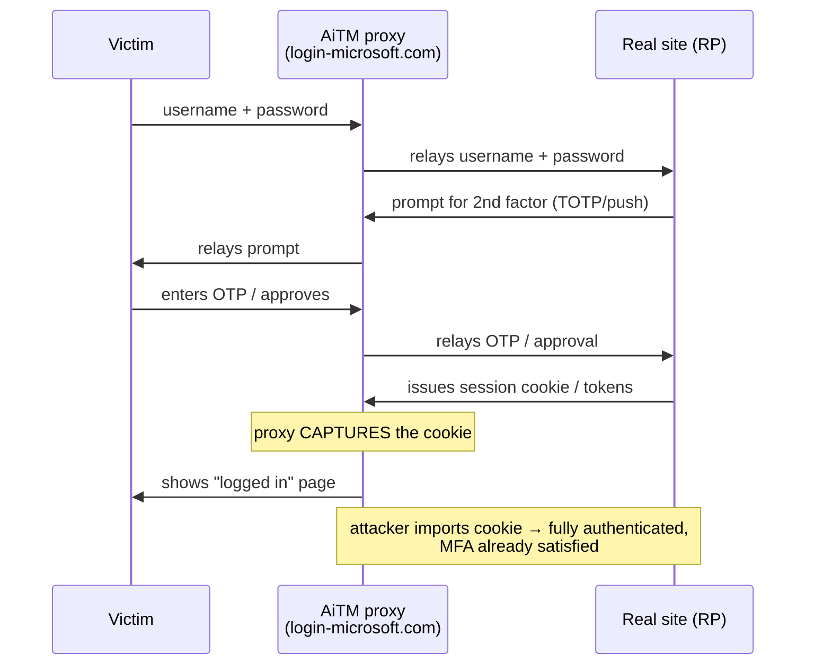

# Authentication & Multi-Factor Authentication

Authentication (authN) answers **"who are you, and can you prove it?"** It is the gate that
every other control depends on: authorization, auditing, and rate limiting all assume the
identity claim is trustworthy. This topic covers the *mechanisms* of proving identity and
the *attacks* against them — factors, one-time passwords (HOTP/TOTP), SMS pitfalls, push
fatigue, WebAuthn/passkeys, recovery flows, step-up/adaptive auth, passwordless, and the
NIST SP 800-63B assurance levels that grade how strong an authentication is.

Stay at the threat/mechanism altitude. We describe how attacks work on the wire and how
defenses counter them, not how any one framework's login module is configured. Token
*format* (JWT), the OAuth *grant contract*, and TLS on the wire are owned by sibling
topics — here we treat those only where an authentication threat lives.

> [!KEY-TAKEAWAY]
> Authentication is about **proving possession of a secret or key without letting an
> attacker replay or steal it.** Every improvement in this space — from passwords to TOTP
> to WebAuthn — is about shrinking the window and the surface in which a stolen proof is
> useful. Phishing resistance (binding the proof to the real origin) is the modern bar.

## Authentication versus authorization

These are constantly conflated in interviews; keep them crisp.

- **Authentication (authN):** verifying *identity* — "you are `alice@example.com` and you
  proved it." Produces a subject/principal.
- **Authorization (authZ):** deciding what that verified identity is *allowed to do* —
  "alice may read invoice 42 but not delete it." Consumes the principal plus policy.

| | Authentication | Authorization |
|---|---|---|
| Question | Who are you? | What may you do? |
| Runs | First | After authN |
| Produces | Identity / principal | Allow / deny decision |
| Wrong HTTP status | `401 Unauthorized` | `403 Forbidden` |
| Example failure | Bad password | Logged-in user hits admin page |

> [!WARNING]
> The HTTP status codes are misnamed. `401 Unauthorized` actually means
> **un-authenticated** (you did not prove who you are / send valid credentials) and should
> carry a `WWW-Authenticate` header. `403 Forbidden` means you *are* authenticated but are
> **not authorized** for this resource. Mixing them leaks information and confuses clients.

A classic vulnerability is **treating authentication as authorization**: "the user is
logged in, therefore let them see this object." That is a missing-authorization bug
(BOLA / IDOR — owned by the access-control and API topics). Authentication only tells you
*who*; you still must check *whether that who is allowed*.

## Authentication factors

A **factor** is a category of evidence. There are three classic categories:

| Factor | "Something you…" | Examples | Primary weakness |
|---|---|---|---|
| Knowledge | **know** | password, PIN, security question | phishable, guessable, reused, leaked in breaches |
| Possession | **have** | phone with TOTP app, security key, smart card | can be lost, stolen, SIM-swapped, or (for shared secrets) copied |
| Inherence | **are** | fingerprint, face, voice | not secret, not revocable, false-accept/reject rates |

Sometimes cited extra "factors": **somewhere you are** (geolocation/IP) and **something
you do** (behavioral biometrics). These are *signals* for adaptive auth, not strong
standalone factors.

**True multi-factor requires factors from *different categories*.** A password + a
security question is **not** MFA — both are knowledge. A password + a TOTP code is MFA
(knowledge + possession).

> [!INTERVIEW]
> A frequent probe: "Is a fingerprint a password?" No. Biometrics are **not secret** (you
> leave fingerprints everywhere; your face is public) and are **not revocable** (you can't
> reissue your iris after a breach). That's why device biometrics are used to *locally
> unlock* a possession factor (the key stored in the phone's secure enclave), not sent to
> the server as a shared secret. The server verifies the key, not the fingerprint.

## MFA and 2FA

**Multi-factor authentication (MFA)** requires two or more factors from different
categories; **two-factor (2FA)** is the common special case of exactly two. The point:
compromising one factor (a phished password) is no longer sufficient.

Why it matters, with numbers: the vast majority of account takeovers start with stolen or
reused passwords (credential stuffing against breach corpora). MFA breaks that because the
attacker who has the password still lacks the second factor.

**But not all MFA is equal.** There is a strength ladder:

1. **SMS / email OTP** — better than nothing, but phishable and interceptable (SIM swap,
   SS7). NIST *restricts* SMS.
2. **TOTP app (authenticator app)** — a shared secret on the device; phishable in
   real time (attacker relays the 6 digits) but not remotely interceptable.
3. **Push approval** — convenient, but vulnerable to MFA fatigue unless number-matching is
   used.
4. **WebAuthn / FIDO2 security keys & passkeys** — **phishing-resistant**: the credential
   is bound to the origin and never leaves the authenticator, so a relay/proxy site cannot
   use it.

> [!TIP]
> "MFA everywhere" is the headline, but the follow-up an interviewer wants is *which* MFA.
> Phishing-resistant MFA (WebAuthn/passkeys) is the meaningful bar for high-value accounts;
> TOTP is a solid middle; SMS is a last resort. Also: MFA protects the *login*, not the
> *session* — a stolen session cookie or token bypasses MFA entirely, which is why session
> management and token binding matter just as much.

## HOTP mechanics (RFC 4226)

**HOTP (HMAC-based One-Time Password, RFC 4226)** is the foundation of the OTP family. It
derives a short numeric code from a shared secret and a **counter**.

```
HOTP(K, C) = Truncate( HMAC-SHA-1(K, C) )   mod 10^Digits
```

- `K` — a symmetric secret shared between the token/app and the server (provisioned once,
  e.g. via a QR code / `otpauth://` URI, base32-encoded).
- `C` — an 8-byte counter that increments **on each use**.
- **HMAC-SHA-1** produces a 20-byte MAC. (SHA-1 is fine *inside HMAC* here — HMAC's
  security doesn't rely on collision resistance — though newer deployments allow SHA-256/512.)
- **Dynamic truncation:** take the low 4 bits of the last byte as an offset, read the 4
  bytes at that offset, mask the top bit (to stay a positive 31-bit integer), then
  `mod 10^Digits` to get a 6–8 digit code.

**Worked example — derive one code (RFC 4226 reference vector).** Take the RFC's test
secret `K = "12345678901234567890"` (20 ASCII bytes) and counter `C = 0`:

1. `C = 0` as an 8-byte big-endian value → `00 00 00 00 00 00 00 00`.
2. `HMAC-SHA-1(K, C)` = the 20-byte MAC
   `cc 93 cf 18 50 8d 94 93 4c 64 b6 5d 8b a7 66 7f b7 cd e4 b0`.
3. **Dynamic truncation.** Last byte = `0xb0`; its low 4 bits `0xb0 & 0x0f = 0x0` → **offset
   = 0**. Read the 4 bytes starting at offset 0: `cc 93 cf 18`.
4. **Mask the top bit** (`& 0x7fffffff`) so it's a positive 31-bit int: `cc → cc & 0x7f =
   0x4c`, giving `4c 93 cf 18` = **1,284,755,224**.
5. **`mod 10^6`** → `1284755224 mod 1000000` = **755224**. That is the 6-digit code — and it
   matches RFC 4226's published vector exactly.

The masking step exists so the code is identical on 32-bit and 64-bit, signed and unsigned
platforms (no sign-bit surprises); the offset step exists so an attacker who sees codes can't
predict *which* 4 bytes are used without the secret.

The counter is the catch: token and server counters must stay in sync. Because a user may
generate codes that never reach the server (fat-fingered, cancelled), servers accept a
**look-ahead window** of `s` future counters. This desync fragility is exactly why the
time-based variant (TOTP) largely replaced HOTP for app-based 2FA.

> [!WARNING]
> HOTP codes **do not expire on their own** — a given counter value's code is valid until
> that counter is consumed. If an attacker phishes an unused HOTP code, it stays usable
> until the legitimate user advances the counter. Contrast TOTP, where codes die with the
> time step.

## TOTP mechanics and the drift window (RFC 6238)

**TOTP (Time-based OTP, RFC 6238)** is HOTP with the counter replaced by **time**:

```
T = floor( (CurrentUnixTime − T0) / X )
TOTP = HOTP(K, T)
```

- `T0` — epoch start, default **0** (Unix epoch).
- `X` — the time step, default **30 seconds**.
- So both sides compute the same counter `T` from the clock; no per-use counter to sync —
  just a shared clock.

This is what "authenticator apps" (Google Authenticator, Authy, etc.) implement. Codes
rotate every 30s and each is single-use within its window.

**The drift / validation window.** Clocks aren't perfectly synced and users take a few
seconds to type. So the verifier checks the current step **and typically ±1 step** (the
previous and next 30s window) — a total acceptance window of about 90 seconds. RFC 6238
recommends *at most one step* of tolerance and warns each extra step widens the attack
surface.

**Worked example — step number and the ±1 window.** Say the login lands at Unix time
`1700000000` with defaults `T0 = 0`, `X = 30`:

- `T = floor((1700000000 − 0) / 30) = floor(56666666.67) = **56666666**`. Both the app and
  the server compute this same integer from the clock, then feed it into HOTP exactly as
  above: `TOTP = HOTP(K, 56666666)`.
- With ±1 tolerance the verifier accepts the code for **three** candidate steps —
  `T−1 = 56666665`, `T = 56666666`, `T+1 = 56666667` — spanning `[1699999950, 1700000040)`,
  i.e. a **90-second** acceptance band. Each step increment past ±1 adds another 30s the
  attacker's relayed code stays live, which is why RFC 6238 caps tolerance at one step.

Server-side musts:
- **Reject reuse within a step:** once a code for step `T` is accepted, record it and
  refuse the same code again — otherwise an eavesdropper replays it within the 30s window.
- **Rate-limit attempts:** a 6-digit code is 1-in-1,000,000; without throttling, and with a
  ±1 window, online brute force becomes feasible over time. RFC 4226 requires
  throttling/lockout. *Make it visceral:* the ±1 window means **3** of the 10⁶ codes are
  accepted at any instant, so a single guess hits with probability `3/1,000,000 ≈ 1 in
  333,000`. Unthrottled at `N = 50` guesses/sec, expected time-to-hit is about
  `1,000,000 / (3 × 50) ≈ 6,700 s ≈ 1.9 hours` — trivial. NIST's **≤100 consecutive
  failures** cap holds the attacker's success probability to `100 × 3/10⁶ ≈ 0.03%` before
  lockout, which is exactly why that cap matters.

> [!INTERVIEW]
> Two favorite gotchas: (1) TOTP's secret is a **shared symmetric secret** — the *server*
> stores it too, so a server-side breach can leak every seed (store them encrypted / in an
> HSM). (2) TOTP is **not phishing-resistant**: a real-time phishing proxy (evilginx-style)
> relays the 6 digits you just typed straight to the real site within the 30s window. Only
> origin-bound credentials (WebAuthn) defeat that.

## SMS OTP weaknesses: SIM swap and SS7

SMS one-time codes are the most common MFA — and the weakest of the mainstream options.
The code is sent out-of-band over the telephone network, which the application does not
control.

**Threats:**

- **SIM swap (SIM hijacking):** the attacker social-engineers or bribes a carrier rep to
  port the victim's number to an attacker-controlled SIM. All SMS (and calls) now arrive at
  the attacker's device — including OTPs and password-reset links. No malware on the victim
  needed.
- **SS7 / telecom-network attacks:** SS7 is the legacy signaling protocol between carriers.
  It has weak authentication between operators; an attacker with network access can reroute
  or intercept SMS and calls remotely, at scale, without touching the SIM.
- **Real-time phishing:** the fake site prompts for the SMS code and relays it — same relay
  weakness as TOTP.
- **Malware / notification leakage, and SMS delivery to lock-screen previews.**

**NIST SP 800-63B** classifies OTP delivered over the **public switched telephone network
(SMS/voice) as a `RESTRICTED` authenticator**: allowed only with risk assessment and a
migration path off it, not recommended for new systems. (The 2016 draft famously proposed
outright deprecation; the published guidance settled on "RESTRICTED.")

> [!TIP]
> Correct defense: **prefer app-based TOTP or WebAuthn over SMS.** If SMS must remain (broad
> user base, no smartphone), treat the phone number as a sensitive attribute: require strong
> re-auth to change it, add carrier PIN / port-freeze guidance, and use adaptive signals.
> Never use SMS as the *recovery* path that can reset a stronger factor — that collapses
> your whole MFA to SMS strength.

## Push-based authentication and MFA fatigue

Push MFA sends an approve/deny prompt to a registered app ("Someone is signing in — Approve?").
It's low-friction and resists remote SMS interception. Its signature weakness is **human**.

- **MFA fatigue / prompt bombing / push spamming:** the attacker who already has the
  password triggers login repeatedly, flooding the victim with push prompts at 2 a.m. until
  they tap **Approve** to make it stop (or out of confusion). This was the technique behind
  several high-profile 2022 breaches (Uber, Cisco, Lapsus$-style intrusions).
- **Accidental approval:** a single tap approves; muscle memory betrays the user.

**Defenses:**

- **Number matching:** the login screen shows a number the user must type into the push
  prompt (or the prompt shows several numbers and the user picks the one on screen). This
  forces the user to be *actively looking at the legitimate login*, defeating blind
  approvals and blind spamming.
- **Extra context in the prompt:** app name, geolocation, IP, map.
- **Rate-limit / throttle push challenges;** lock or fall back after N denied/ignored
  prompts.
- **Best: move to phishing-resistant WebAuthn** where there's nothing to "approve" blindly.

> [!WARNING]
> Push and number-matching still are **not phishing-resistant** in the WebAuthn sense: a
> real-time proxy can show the victim the matching number from the *real* site. Number
> matching defeats *fatigue/spam*, not a determined AiTM (adversary-in-the-middle) relay.

## WebAuthn, FIDO2 and passkeys

**WebAuthn (W3C) + CTAP (FIDO2)** is the modern, **phishing-resistant** authentication
standard. It replaces shared secrets with **public-key cryptography**.

**Registration (once):** the authenticator (a roaming security key, or a platform
authenticator like a phone/laptop secure enclave) generates a **key pair** for that site.
The **private key never leaves** the authenticator; the **public key** is sent to and
stored by the server (the "relying party", RP), tied to the user account.

**Authentication (each login):** the server sends a **random challenge**; the authenticator
signs it (after a user gesture — biometric/PIN) with the private key; the server verifies
the signature against the stored public key.

Why it's phishing-resistant — three bindings:

1. **Origin binding:** the browser includes the *actual* origin (`https://example.com`) in
   the signed `clientDataJSON`, and the credential is scoped to an **RP ID** (the domain).
   A key registered for `example.com` **will not sign for `examp1e.com`** — the browser
   refuses. So a relay/proxy phishing site literally cannot get a usable assertion.
2. **Challenge–response, not a replayable code:** each assertion is a fresh signature over a
   server random challenge → no static secret to phish or replay.
3. **No shared secret on the server:** a server breach leaks only *public* keys, useless to
   an attacker. Nothing to reverse or reuse.

**Attestation** is an optional signature from the authenticator's manufacturer key
asserting *what kind of device* it is (model/certification). Useful for high-assurance
enterprises that must require certified hardware, but privacy-sensitive — most consumer RPs
request `none`.

**Passkeys** are FIDO2 credentials made mainstream, usually **discoverable credentials**
(the key + user handle are stored on the authenticator so you can log in without typing a
username). Two flavors:

- **Synced passkeys:** backed up to a cloud keychain (Apple/Google/password managers) and
  synced across your devices — great UX and recovery, but assurance now depends on the
  cloud account's security, and the private key is copyable to other devices in that
  ecosystem.
- **Device-bound passkeys:** never leave the single authenticator (a security key) —
  highest assurance, but lose the device and you lose that credential (register a backup).

> [!INTERVIEW]
> The one-line "why passkeys win": **the credential is cryptographically bound to the real
> origin, so a phishing site cannot elicit a usable proof — the human can't be tricked into
> handing it over because there's nothing hand-over-able.** Follow-up trap: "Is the
> fingerprint sent to the server?" No — the biometric only *unlocks* the local private key;
> it never leaves the device.

## Recovery codes and account-recovery risks

Every strong factor needs a fallback for the lost-phone / lost-key case — and **the
recovery path is where MFA schemes are most often defeated.** Your account's real security
is the *weakest* accepted path.

- **Backup / recovery codes:** a set of one-time static codes shown at MFA enrollment.
  They are **bearer secrets** — anyone with the code and password gets in. Store them
  **hashed** server-side (like passwords), display once, mark each single-use, and let
  users regenerate (invalidating the old set).
- **The recovery downgrade attack:** if losing your security key lets you fall back to an
  **SMS reset** or an **email link**, then an attacker only needs to beat SMS/email — the
  expensive WebAuthn key is irrelevant. Recovery should be **as strong as** the primary
  factor (e.g., a second registered security key), not weaker.
- **Security/"secret" questions are broken:** answers are often public (mother's maiden
  name, first school) or guessable; NIST **prohibits** them as an authenticator. If used at
  all, treat answers like passwords (user-chosen, hashed) — but prefer to drop them.
- **Help-desk / social engineering:** human-driven account recovery is a prime target
  (the SIM-swap of the enterprise). Require strong identity proofing for high-value
  resets.

> [!WARNING]
> Common real-world failure: an app enforces WebAuthn *and* keeps "Forgot device? Get a
> code by SMS" enabled. That's not defense-in-depth — it's a **bypass**. Enumerate every
> path to `authenticated=true`, including reset flows, and hold them all to the same bar.

## Step-up and adaptive authentication

Not every action needs the same assurance. **Step-up authentication** asks for *additional*
proof only when the risk rises — you browse logged in with a session, but transferring money
or changing your email prompts a fresh MFA challenge.

- **Step-up (a.k.a. re-authentication):** require a stronger/fresh factor for
  sensitive operations even within an active session. In OIDC this maps to `acr`/`amr`
  claims and the `max_age` / `prompt=login` parameters; the point is the app *re-verifies
  recency and strength* before a high-risk action, defeating a hijacked idle session.
- **Adaptive / risk-based authentication:** score each attempt from signals — device
  fingerprint, IP reputation/geolocation, impossible-travel, time of day, behavioral
  biometrics — and demand more (MFA, step-up) only when the score is risky, while letting
  low-risk logins through with less friction. Balances security and UX.

> [!TIP]
> Adaptive signals are **inputs to a decision, not authenticators.** IP and device
> fingerprints are spoofable, so "trusted network → skip MFA" is a weak control on its own.
> Use risk signals to *add* friction, rarely to *remove* a real factor. And remember step-up
> only matters if the session itself is protected (short-lived, bound tokens), else the
> attacker rides the already-elevated session.

## Passwordless authentication

**Passwordless** removes the knowledge factor (the password) entirely, replacing it with
possession/inherence:

- **WebAuthn / passkeys** — the strongest and preferred form: sign in with a security key
  or platform biometric, no password at all.
- **Magic links** — a one-time link emailed to the user. Convenient, but security collapses
  to **email account security**, the link can be phished/relayed, and links leak via
  referrer/history/shared inboxes. Make them single-use, short-TTL, and bound to the
  requesting session.
- **Email/SMS OTP** — same PSTN/email weaknesses as above.

Why it matters: no password means **no password to phish, reuse, or leak in a breach**, and
credential-stuffing dies. But "passwordless" is only as strong as what replaces it — a magic
link is passwordless *and* phishable; a passkey is passwordless *and* phishing-resistant.
Don't conflate "passwordless" with "secure."

> [!INTERVIEW]
> Distinguish **passwordless** (no password; may still be one factor) from **MFA** (two+
> factors). A passkey can be *both* passwordless and multi-factor in one gesture — the
> device you *have* plus the biometric/PIN that *unlocks* it (possession + inherence/
> knowledge) — which is why passkeys are pitched as "MFA in a single tap."

## NIST SP 800-63B authenticator assurance levels

**NIST SP 800-63B (Digital Identity Guidelines — Authentication & Lifecycle)** defines
**Authenticator Assurance Levels (AAL)** — a standard vocabulary for "how strong is this
login?" Interviewers use these to test whether you can *grade* an auth scheme.

| Level | Requirement | Typical authenticators | Phishing-resistant? |
|---|---|---|---|
| **AAL1** | Some assurance; **single-factor** permitted | password alone, single OTP | No |
| **AAL2** | **MFA required** — two distinct factors, approved cryptography | password + TOTP; password + push; passkey | Not required |
| **AAL3** | Hardware-based authenticator **+ verifier-impersonation (phishing) resistance**; proof of possession of a key via a cryptographic protocol | FIDO2 security key, PIV/smart card | **Yes (required)** |

Key points to say out loud:

- **AAL2 = MFA**, but does **not** require phishing resistance — TOTP and SMS-ish schemes
  can meet AAL2, yet remain phishable by real-time proxies.
- **AAL3 requires *both* a hardware authenticator *and* verifier-impersonation resistance**
  (origin-bound crypto) — effectively FIDO2/WebAuthn security keys or PIV cards. This is the
  level for privileged/administrative access.
- **SMS/PSTN is RESTRICTED** and cannot underpin high assurance.
- 800-63B also covers **reauthentication** cadence and **session** requirements, reinforcing
  that assurance decays over time and after inactivity.

> [!KEY-TAKEAWAY]
> Memorize the ladder: **AAL1 = maybe one factor; AAL2 = MFA; AAL3 = MFA that is hardware-
> backed AND phishing-resistant.** When someone says "we require MFA," the sharp question is
> "AAL2 or AAL3?" — i.e., "is it phishing-resistant?"

## AiTM reverse-proxy phishing (Evilginx and friends)

The single most important modern attack against MFA is **adversary-in-the-middle (AiTM)
reverse-proxy phishing** — the reason "MFA ≠ phishing-resistant" is now the interview
punchline. It defeated MFA *at scale* across 2022–2025.

**Mechanics.** The attacker stands up a **reverse proxy** on a look-alike domain
(`login-microsoft.com`, `okta-sso.io`). The victim lands there (email/SMS lure) and the
proxy **relays every request/response to the real site in real time**:

1. Victim types username + password → proxy forwards them to the genuine site.
2. Genuine site prompts for the second factor (TOTP/push/number-match) → proxy relays that
   too; the victim completes the challenge against the *real* verifier through the proxy.
3. The genuine site, satisfied, **issues a session cookie / tokens** — and the proxy is
   sitting in the middle, so it **captures the post-authentication session cookie**.
4. The attacker imports that cookie into their own browser and is **fully logged in** — MFA
   already satisfied. No password re-entry, no second factor, nothing to re-solve.



This is why AiTM connects *authentication* to *session management*: the payoff is a stolen
**authenticated session**, not the password. Number-matching does **not** help — the proxy
simply shows the victim the number it received from the real site. TOTP/push/SMS all fall.

**Named tooling:** **Evilginx2**, **Modlishka**, **Muraena** (open-source frameworks), and
phishing-as-a-service kits **EvilProxy**, **Tycoon 2FA**, **NakedPages** that sell turnkey
AiTM pages plus cookie exfiltration.

**Why WebAuthn/FIDO2 alone survives it.** The signed `clientDataJSON` carries the
**origin the browser actually connected to** (the proxy's origin), and the credential is
scoped to the real RP ID. The assertion the proxy relays therefore fails origin/RP-ID
validation at the genuine site — the signature is *for the wrong origin*. There is nothing
the proxy can relay that the real RP will accept.

**Defense stack (layered):**
- **Phishing-resistant WebAuthn/passkeys** — the only factor that structurally blocks the
  relay.
- **Sender-constrained / token-bound sessions** (DPoP, mTLS) so a stolen cookie/token is
  useless without the client's private key (next section).
- **Short session TTL + step-up re-auth** on sensitive actions; **continuous access
  evaluation** (CAEP / Shared Signals Framework) to revoke sessions on risk signals.
- **Session-anomaly detection:** flag an existing session suddenly used from a new
  IP/ASN/user-agent/geo or exhibiting **impossible travel** — the classic tell of a
  replayed cookie.

> [!INTERVIEW]
> "Users have TOTP MFA, no password reuse, and attackers still get in — what's happening?"
> The answer interviewers want is **AiTM reverse proxy (Evilginx-style) relaying the OTP and
> stealing the issued session cookie.** The fix is **phishing-resistant WebAuthn + token
> binding + session-anomaly detection**, not "add number matching."

## Sender-constrained tokens: DPoP and mTLS

A **bearer** token or session cookie is "whoever holds it, wins" — exactly what makes the
AiTM cookie-theft payoff so devastating. **Sender-constrained (proof-of-possession) tokens**
bind the token to a key the legitimate client holds, so a *stolen* token is useless without
that private key. This is the direct answer to "the attacker stole my session/access token —
which single control makes it worthless?" (The grant contract and JWT format live in the
`oauth2-and-oauth21` / `jwt-and-token-security` siblings; here it is the **anti-theft/replay
defense**.)

**DPoP — Demonstrating Proof-of-Possession (RFC 9449).** The client sends a `DPoP` header
carrying a **DPoP proof JWT** on every request:

- JOSE header: `typ` = **`dpop+jwt`**; `alg` an **asymmetric** signature alg (never `none`,
  never a symmetric MAC); `jwk` = the client's **public** key (private key never included).
- Claims: **`htm`** (HTTP method), **`htu`** (target URI, *without query/fragment*),
  **`iat`** (issued-at), **`jti`** (unique ID, ≥96-bit random / UUIDv4, tracked for
  **replay** detection), **`ath`** (base64url SHA-256 of the access token — **required when
  presenting an access token** at a resource), and **`nonce`** (when the server demands one
  via a `DPoP-Nonce` header).
- **Binding:** the access token carries a **`cnf`** claim with **`jkt`** = base64url SHA-256
  **JWK thumbprint** of the DPoP public key; `token_type` is **`DPoP`** (not `Bearer`). The
  authorization request may pass **`dpop_jkt`** to bind the whole flow from the code
  onward; client metadata `dpop_bound_access_tokens` opts in.
- **Errors:** `invalid_dpop_proof` (proof failed validation) and `use_dpop_nonce` (server
  requires a fresh nonce in the next proof).

A resource server accepts a DPoP token only if the proof is signed by the key whose
thumbprint matches `cnf.jkt` **and** `ath` matches the presented token **and** `htm`/`htu`
match the actual request. A thief with the token but not the private key cannot mint a valid
proof.

**Worked example — one request, three checks.** The client calls
`GET https://api.example.com/resource` holding access token
`AT-eyJhbGciOiJFUzI1NiJ9.demo` (bound at issue time with `token_type: DPoP` and a `cnf`
claim `{"jkt":"0ZcOCORZNYy-DWpqq30jZyJGHTN0d2HglBV3uiguA4I"}`). It sends two headers:

```
Authorization: DPoP AT-eyJhbGciOiJFUzI1NiJ9.demo
DPoP: <proof JWT>          # decoded below
```

```jsonc
// proof JWT header
{ "typ": "dpop+jwt", "alg": "ES256",
  "jwk": { "kty":"EC", "crv":"P-256",
           "x":"l8tFrhx-34tV3hRICRDY9zCkDlpBhF42UQUfWVAWBFs",
           "y":"9VE4jf_Ok_o64zbTTlcuNJajHmt6v9TDVrU0CdvGRDA" } }
// proof JWT claims
{ "htm":"GET", "htu":"https://api.example.com/resource",
  "iat":1700000000, "jti":"e1f2...96bit",
  "ath":"QyKv6jBp6M41UnFRaKPUEbeT58mQ0dDOditFY7LMoNI" }
```

The resource server runs three checks:

1. **Key binding.** Compute the JWK thumbprint (base64url SHA-256 of the canonical JWK) of
   the `jwk` in the proof header → `0ZcOCORZNYy-DWpqq30jZyJGHTN0d2HglBV3uiguA4I`. It equals
   the token's `cnf.jkt`. ✅ (And verify the proof's signature with that same `jwk`.)
2. **Token binding.** Compute base64url SHA-256 of the presented access token string →
   `QyKv6jBp6M41UnFRaKPUEbeT58mQ0dDOditFY7LMoNI`. It equals the proof's `ath`. ✅
3. **Request binding.** `htm == "GET"` and `htu == "https://api.example.com/resource"` match
   the actual method and URI; `iat` is fresh and `jti` unseen. ✅ → **serve the resource.**

**Now the AiTM thief** who exfiltrated the access token replays it from their own machine.
They can't pass step 1: they don't hold the EC **private** key, so they cannot produce a
proof whose `jwk` thumbprint equals `cnf.jkt` *and* carries a valid signature. Swapping in
their own key pair changes the thumbprint, so `jkt(jwk) ≠ cnf.jkt` and validation fails at
step 1. The stolen bearer string is inert — that is the whole point of sender-constraining.

**mTLS-bound tokens (RFC 8705).** The token's `cnf` carries **`x5t#S256`** = the SHA-256
thumbprint of the **client TLS certificate**. The token is usable only over a mutual-TLS
connection presenting that same cert (whose private key the thief lacks). Heavier to deploy
(PKI) but strong; common in high-assurance/financial APIs (FAPI).

> [!KEY-TAKEAWAY]
> DPoP and mTLS turn a **bearer** token ("any holder wins") into a **proof-of-possession**
> token ("only the holder of the private key wins"). This is the real defense against stolen
> access tokens / session cookies — the AiTM payoff evaporates because the exfiltrated token
> can't be replayed from the attacker's machine.

## Username and account enumeration

If an attacker can tell **which usernames/emails exist**, they can target credential-stuffing
and password-spraying precisely and (for a company) map the org. **Account enumeration**
(OWASP WSTG-IDNT-04, ASVS) leaks that existence through **observable differences**:

- **Message differences:** "user not found" vs "wrong password" on login; "email not
  registered" vs "reset link sent" on forgot-password; "email already in use" on
  registration.
- **Timing side channel:** the server runs an expensive password hash (bcrypt/Argon2)
  **only for valid users**, so valid usernames respond measurably slower — a **timing
  oracle** even when messages are identical.
- **Status/redirect/length differences:** different HTTP status, redirect target, or
  response body length for existing vs non-existing accounts; even distinct rate-limit
  behavior per user.

**Defenses:**
- **Generic, identical responses:** "If an account exists, we've sent a reset link";
  "Invalid username or password" for every login failure.
- **Constant-time behavior:** always run a **dummy password hash** for non-existent users so
  valid and invalid accounts take the same time; keep status codes, redirects, and lengths
  uniform.
- **Rate-limit / CAPTCHA** the enumerable endpoints (login, register, forgot-password).

## Credential stuffing, password spraying, and brute force

Three distinct online password attacks — interviewers probe whether you can tell them apart
and pick the right defense:

| Attack | Shape | Why it works | Primary defense |
|---|---|---|---|
| **Credential stuffing** | Replay breached `user:pass` **pairs** across sites | Password **reuse** | Breach-corpus check, MFA, bot/device detection |
| **Password spraying** | **One** common password against **many** accounts | Evades **per-account** lockout by staying under the threshold | MFA, per-IP/global throttling, spray detection |
| **Brute force** | **Many** passwords against **one** account | Weak/short password | Per-account throttling, strong password policy, MFA |

Key nuances:
- **Breach-corpus checks:** compare new/changed passwords against known-compromised lists.
  **Have I Been Pwned** exposes a **k-anonymity range API** — the client sends the first 5
  hex chars of the SHA-1 of the password and gets back all matching suffixes, so the full
  password/hash never leaves the client. NIST **SHALL** blocklist-check against such lists.
- **Account lockout is a double-edged sword:** hard lockout enables a **denial-of-service**
  (lock every user by failing their logins) and can *aid enumeration* (locked vs not).
  Modern guidance favors **throttling / exponential backoff + MFA** over aggressive hard
  lockout.

## Brute-force and rate-limit bypasses

Rate limiting is only as good as the key it counts on. Common **bypasses** (PortSwigger /
WSTG):

- **`X-Forwarded-For` (or `X-Real-IP`) spoofing:** if per-IP counters trust a
  client-supplied header, the attacker rotates the header to reset the counter each request.
  Fix: derive the client IP from the **trusted edge/proxy**, never from an arbitrary request
  header.
- **Per-username-only lockout:** the attacker sidesteps it by **spraying** (rotating the
  username) — one attempt per account stays under the threshold. Need per-account *and*
  global/IP throttling.
- **Resettable "lock after N failures" logic:** if a successful login (or any specific
  request) resets the failure counter, an attacker interleaves a known-valid login to zero
  it out.
- **Unthrottled OTP endpoint:** the login may be rate-limited but the **6-digit OTP
  verification** step is not → brute-force the 1-in-10⁶ code. RFC 4226 caps attempts;
  NIST SP 800-63B caps at **≤100 consecutive failures per authenticator**. Add per-account
  throttling on the OTP step.
- **Race conditions:** firing many OTP guesses concurrently before the counter increments
  can slip past a naive check-then-increment.

## Password-reset and forgot-password flow attacks

"Recovery" is discussed abstractly above; the reset *flow* itself has specific, exam-worthy
bugs (OWASP Forgot Password Cheat Sheet):

- **Password-reset poisoning / Host-header injection:** the app builds the reset link from
  the request's `Host` (or `X-Forwarded-Host`) header. An attacker sends a reset request
  with `Host: attacker.com`; the victim receives an email whose link points at
  `attacker.com/reset?token=…`, and when they click it the **token leaks** to the attacker.
  **Fix:** build links from a **server-configured canonical base URL**, never from a
  request header.
- **Weak/predictable tokens:** sequential, timestamp-seeded, or short tokens are guessable.
  Use a **high-entropy** (≥128-bit) random token.
- **Token lifecycle bugs:** token not **single-use**, no **TTL**, not **invalidated** after
  use / after the password changes / when a new reset is requested. Correct: single-use,
  short-lived, hashed at rest, invalidated on use/expiry/new request.
- **Token leakage via `Referer`:** if the reset page loads third-party assets, the full URL
  (with token) leaks in the `Referer` header. Avoid tokens in URLs sent to pages with
  external resources, or scrub referrers.
- **User-controllable reset parameter:** the reset POST includes a `userId`/email the server
  trusts → an attacker changes it to **reset anyone's password** (an access-control flaw in
  the reset flow). Bind the token to the account server-side; never trust a client-supplied
  identity.
- **Magic-link / OTP delivery quirks:** mail-scanner/AV **prefetching** clicks the
  single-use link and consumes it; links in **shared inboxes**; **open redirect** in a
  `next=` parameter; OTP **autofill leaking to lock-screen** previews; OTP **reuse across
  steps**. Design links single-use, short-TTL, and session-bound; validate redirect targets.

## FIDO2 architecture: CTAP2, UP vs UV, and WebAuthn hardening

The file above says "WebAuthn + CTAP"; the two-protocol split and the assertion internals
are frequent senior probes.

**Two protocols.** **WebAuthn** (W3C) is the JS API between the **browser/RP** and the
platform. **CTAP2** (Client-to-Authenticator Protocol, FIDO2) is how the **client talks to a
roaming authenticator** over USB/NFC/BLE. **Hybrid transport ("caBLE")** lets a **phone act
as an authenticator** for a nearby computer over BLE proximity + a cloud relay. Roaming keys
can require a **clientPIN** for user verification.

**User Presence (UP) vs User Verification (UV)** — the distinction that underpins "passkey =
MFA in one tap":
- **UP** = *someone is physically there* (a touch/tap). Proves presence, not identity.
- **UV** = *who* is there — a **biometric or PIN** verified locally by the authenticator.
- When **UV is satisfied**, one gesture supplies **possession** (the key) **+**
  **inherence/knowledge** (the biometric/PIN) → the assertion is effectively **multi-factor
  in one action**. The RP requests it via `userVerification: required|preferred|discouraged`
  and **must check the UV flag** in `authenticatorData` (don't just trust that you asked).

**`excludeCredentials`** (registration): a list of the user's already-registered credential
IDs. It tells the authenticator **not to create a second credential** on a key that already
holds one for this account — preventing duplicate/re-enrollment abuse and confusing UX.

**`signCount` clone detection** (WebAuthn §6.1.1): the authenticator returns a **monotonic
signature counter**. The RP stores the last value; if a later assertion returns a counter
**≤ stored**, that suggests a **cloned authenticator** is in use → flag / step-up / lock.
**Caveat:** many platform authenticators and **synced passkeys always return `signCount =
0`**, so clone detection is **best-effort**, not a guarantee.

**Attestation formats** (what a `direct` attestation can carry): `packed` (most common;
self- or CA-attested), `tpm`, `android-key`, `android-safetynet` (deprecated),
`fido-u2f`, `apple` (anonymous), `none` (most consumer RPs), and `compound` (WebAuthn L3).
**Conveyance** is requested as `none | indirect | direct | enterprise`; **enterprise
attestation** returns a *uniquely identifying* attestation and is opt-in for managed devices
only (a privacy trade-off).

**`credProtect` extension** governs whether a **discoverable (resident) credential** can be
used/enumerated without UV: `userVerificationOptional`,
`userVerificationOptionalWithCredentialIDList`, `userVerificationRequired`. Discoverable
credentials enable **usernameless** login but consume limited on-authenticator storage.

## NIST SP 800-63-4 updates (finalized 2025)

The **-4 revision** of the Digital Identity Guidelines is now published and changes several
specifics interviewers ask about (the sections above cite the -3 draft; these are the
deltas). The family: **800-63A** = identity proofing (IAL), **800-63B** = authentication
(AAL), **800-63C** = federation (FAL).

**Terminology:**
- **"Password"** replaces "memorized secret."
- **"Phishing resistance"** replaces "verifier impersonation resistance." Two recognized
  mechanisms: **channel binding** (client-authenticated TLS, PIV/CAC — considered *stronger*
  because it resists cert misissuance) and **verifier name binding** (WebAuthn/FIDO2). OTP
  and out-of-band authenticators do **not** qualify — manual entry doesn't bind the output
  to the session.

**Assurance-level changes:**
- **AAL2 SHALL offer at least one phishing-resistant option;** federal staff/contractors
  SHALL use phishing-resistant authentication.
- **AAL3 requires a non-exportable private key** in a hardware-protected environment →
  **syncable passkeys SHALL NOT be used at AAL3** (they're exportable across the cloud
  fabric). Device-bound keys only.
- **AAL3 session:** overall reauthentication **SHALL be ≤12 hours** and inactivity ≤15
  minutes, and reauth must use the full authentication (not a single factor). **AAL2:**
  overall ≤24 hours, inactivity ≤1 hour (a single factor may suffice after inactivity).

**Password rules to state verbatim:**
- **Minimum 8 characters when used in MFA; 15 when single-factor;** allow **≥64**.
- **No composition rules** (no forced upper/lower/symbol); **no periodic rotation** (rotate
  only on evidence of compromise); **no password hints**; **no knowledge-based auth /
  security questions**; allow paste and password managers; salt ≥32 bits.
- **SHALL blocklist-check** prospective passwords against known-compromised/dictionary lists.

**Throttling:** limit to **≤100 consecutive failed attempts** per authenticator (an upper
bound; lower is fine).

> [!INTERVIEW]
> "Why can't a synced passkey meet AAL3?" → **AAL3 requires a non-exportable key; a syncable
> passkey is exportable across its cloud keychain, so it cannot satisfy AAL3** — only
> device-bound authenticators (security keys, PIV) can. Great senior-level discriminator.

## Common follow-up questions

- **"Password + security question — is that MFA?"** No. Both are knowledge factors; true MFA
  spans different categories (know / have / are).
- **"Why is TOTP not phishing-resistant if it changes every 30 seconds?"** Because a
  real-time proxy relays the code you just typed to the real site within the same window.
  Rotation stops *later* reuse, not *live* relay. Only origin binding (WebAuthn) stops relay.
- **"How does WebAuthn stop phishing?"** The credential is bound to the origin/RP ID; the
  browser refuses to sign for a look-alike domain, and there's no shared secret to hand over.
- **"What is number matching and what does it fix?"** The user types a number shown on the
  login screen into the push prompt; it defeats MFA-fatigue/blind-approval, but not a full
  AiTM relay.
- **"You have WebAuthn but SMS recovery — what's the security level?"** SMS. Security equals
  your weakest accepted path; recovery must match the primary factor's strength.
- **"Where do you store the TOTP seed / the WebAuthn public key?"** TOTP seed = a *secret*
  (encrypt / HSM, breach-sensitive). WebAuthn public key = *not* secret (breach yields
  nothing usable).
- **"MFA is enabled but the attacker got in with a stolen session cookie — how?"** MFA
  protects the *login event*, not the *session*. Defend sessions (short TTL, rotation, bound
  tokens); consider step-up re-auth for sensitive actions.
- **"Difference between AAL2 and AAL3?"** AAL2 = MFA; AAL3 = MFA that is hardware-based and
  phishing-resistant.
- **"401 vs 403?"** 401 = not authenticated (send `WWW-Authenticate`); 403 = authenticated
  but not authorized.

## References

- **NIST SP 800-63B**, *Digital Identity Guidelines: Authentication and Lifecycle
  Management* — AAL levels, authenticator types, SMS "RESTRICTED", reauthentication.
  https://pages.nist.gov/800-63-3/sp800-63b.html (and the 800-63-4 revision).
- **RFC 4226** — *HOTP: An HMAC-Based One-Time Password Algorithm*.
  https://www.rfc-editor.org/rfc/rfc4226
- **RFC 6238** — *TOTP: Time-Based One-Time Password Algorithm*.
  https://www.rfc-editor.org/rfc/rfc6238
- **W3C WebAuthn (Web Authentication) Level 2/3** and **FIDO2 / CTAP2** (FIDO Alliance).
  https://www.w3.org/TR/webauthn-2/ · https://fidoalliance.org/fido2/
- **OWASP Authentication Cheat Sheet** and **Multifactor Authentication Cheat Sheet**.
  https://cheatsheetseries.owasp.org/cheatsheets/Authentication_Cheat_Sheet.html
- **OWASP ASVS** — chapter on Authentication verification requirements (V2 / V6).
  https://owasp.org/www-project-application-security-verification-standard/
- **OWASP Credential Stuffing / Forgot-Password Cheat Sheets** — recovery-flow guidance.
- **CISA / industry guidance on phishing-resistant MFA and number matching** (defense
  against MFA fatigue).
- **RFC 9449** — *OAuth 2.0 Demonstrating Proof of Possession (DPoP)*.
  https://www.rfc-editor.org/rfc/rfc9449
- **RFC 8705** — *OAuth 2.0 Mutual-TLS Client Authentication and Certificate-Bound Access
  Tokens*. https://www.rfc-editor.org/rfc/rfc8705
- **NIST SP 800-63B-4 / 800-63-4** (finalized 2025) — phishing resistance, AAL3
  non-exportable keys, password and throttling rules. https://pages.nist.gov/800-63-4/
- **OWASP WSTG-IDNT** (account enumeration) and **OWASP Forgot Password / Credential
  Stuffing / Password Reset Cheat Sheets**.
- **W3C WebAuthn L3** — `excludeCredentials`, `signCount`, UV/UP flags, `credProtect`,
  attestation formats/conveyance.
