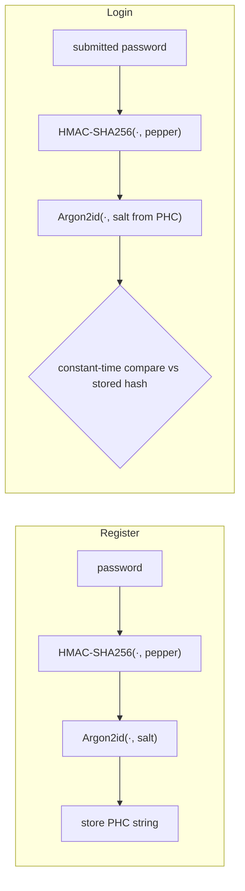
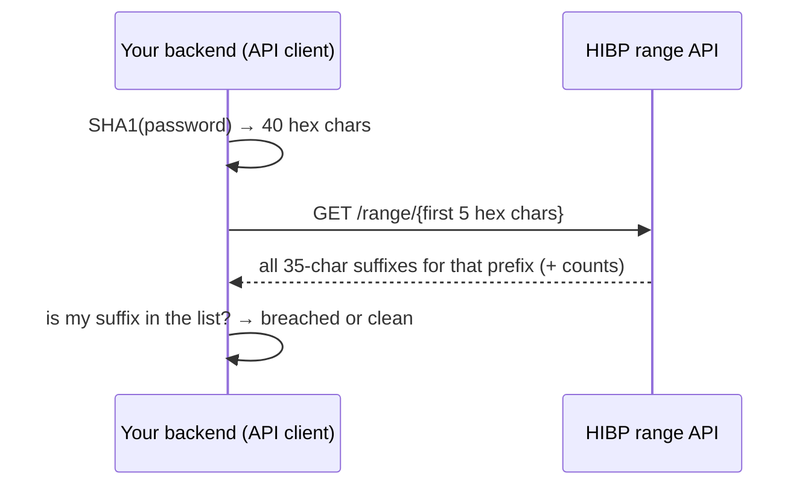

# Password Storage & Credential Security

How a service stores and verifies user passwords is one of the highest-leverage
security decisions it makes: a single database leak turns every stored credential
into an offline cracking target, and password reuse means a crack here becomes an
account takeover *everywhere*. This topic is framework-agnostic — it teaches the
threat model (offline cracking, credential stuffing, replay) and the defenses
(adaptive hashing, salting/peppering, breached-password checks, throttling) as they
actually work, grounded in OWASP and NIST SP 800-63B.

> [!KEY-TAKEAWAY]
> The one-liner every interviewer wants: store passwords using a **salted, adaptive,
> memory-hard one-way hash** — **Argon2id** by default (or scrypt/bcrypt/PBKDF2 as
> alternatives) — never plaintext, never reversible encryption, and never a fast
> general-purpose hash like MD5/SHA-1/SHA-256.

---

## Why never plaintext, encrypted, or fast hashes

Three tempting-but-wrong ways to store passwords, in increasing order of subtlety:

**1. Plaintext.** The password is stored verbatim. A single `SELECT * FROM users`
via SQL injection, a leaked backup, or a curious DBA exposes every credential
directly. It also means the site can *email you your password* — a dead giveaway of
plaintext storage. This is an automatic fail and maps to OWASP A02:2021 —
Cryptographic Failures.

**2. Reversible encryption.** Storing `AES(password, key)` seems better, but it is
still fundamentally reversible: whoever holds the key holds every password. The key
must live somewhere the app can reach it, so an attacker who gets the database
usually gets (or eventually gets) the key too — app config, environment, or an HSM
that the compromised app can call. Passwords should be verified, not recovered, so
there is **no legitimate reason** the system needs to decrypt them.

**3. Fast/general-purpose hashes (MD5, SHA-1, SHA-256, SHA-512, unsalted).** Hashing
is one-way, which is the right idea, but general-purpose hashes are designed to be
*fast* — that is exactly wrong for passwords. Speed helps the attacker: modern GPUs
and ASICs compute **billions to hundreds of billions** of MD5/SHA-1 hashes per
second. Combined with the fact that human passwords have low entropy, an attacker who
steals the hash table can crack most passwords offline in hours.

| Storage method | Reversible? | Offline-crack resistant? | Verdict |
|---|---|---|---|
| Plaintext | n/a | No | Never |
| Encrypted (AES, etc.) | Yes (key holder) | No | Never for passwords |
| Fast hash (MD5/SHA-256), unsalted | No | No (too fast, rainbow tables) | Never |
| Fast hash + salt | No | Still no (billions/sec) | Insufficient |
| Adaptive hash (Argon2id/bcrypt/scrypt/PBKDF2) + salt | No | Yes (deliberately slow) | Correct |

> [!WARNING]
> MD5 and SHA-1 are **cryptographically broken** for collision resistance (MD5 since
> ~2004, SHA-1's SHAttered collision in 2017). But even if they weren't, their *speed*
> makes them unfit for passwords. Passwords need a *slow*, tunable function — the
> opposite design goal of a message-digest hash.

---

## Salting: per-user, unique, and its purpose

A **salt** is a unique, random value generated per password and stored (in the clear)
alongside the resulting hash. The verifier computes `hash(salt || password)` and
compares.

Salting defeats **precomputation** attacks:

- **Identical passwords produce different hashes.** Two users who both pick
  `hunter2` get different stored hashes, so an attacker can't spot shared passwords
  and can't crack them both at once.
- **Rainbow tables become useless.** A rainbow table is a precomputed
  hash→plaintext lookup. A unique per-user salt means the attacker would need a
  separate table *per salt* — precomputation is destroyed. The attacker is forced
  into per-user brute force.

Properties of a good salt:

- **Unique per password** (per-user, and re-generated on password change) — not a
  single global salt. A global salt still lets one rainbow table crack the whole DB.
- **Random**, from a CSPRNG. NIST SP 800-63B requires **at least 32 bits**; OWASP and
  common practice use **16 bytes (128 bits)** or more. Modern algorithms (bcrypt,
  Argon2, scrypt) generate and embed the salt for you.
- **Not secret.** The salt is stored with the hash. Its job is uniqueness, not
  secrecy. It is fine — expected — that the attacker who has the hash also has the
  salt.

> [!TIP]
> Modern password-hash outputs are *self-describing*: a bcrypt or Argon2 "PHC string"
> like `$argon2id$v=19$m=19456,t=2,p=1$<salt>$<hash>` embeds the algorithm, its
> parameters, the salt, and the hash. You store that one string; verification re-reads
> the parameters from it. You do **not** manage a separate salt column.

---

## Peppering: an application-level secret

A **pepper** is a secret value added to the hashing process that, unlike a salt, is
**not stored in the database** — it lives outside it (app config, a secrets manager,
or an HSM). It is typically the *same* value shared across all users (contrast: salts
are unique per user).

The threat it addresses: a database-only compromise (leaked backup, SQL injection,
read-only breach) where the attacker gets the hashes+salts but *not* the application's
secrets. Without the pepper, the stolen hashes can't be attacked offline.

Two correct constructions (OWASP):

- **Pre-hash HMAC (recommended):** `argon2id( HMAC-SHA256(password, pepper) )` or,
  for bcrypt, `bcrypt( base64( HMAC-SHA384(password, pepper) ) )`. Using an HMAC
  keyed by the pepper *before* the slow hash avoids the raw-concatenation problems.
- NIST SP 800-63B frames this as "an additional iteration of a keyed one-way function
  using a **secret salt**" that **SHALL be stored separately** (e.g., in an HSM),
  providing at least 112 bits of security.

Caveats interviewers probe:

- A pepper **alone provides no benefit** if the attacker also compromises the app
  secret — it is *defense in depth*, layered on top of proper salted adaptive hashing.
- **Naive concatenation `hash(pepper || password)` is discouraged.** Use HMAC or
  encrypt the hash with the pepper as the key, so the pepper can be rotated and so
  you avoid length/null-byte pitfalls.
- **Pepper rotation is hard:** because it's shared and applied at hash time, changing
  it invalidates every stored hash. Encrypting the hash with the pepper (rather than
  mixing it into the hash) makes rotation feasible: decrypt-then-re-encrypt.

The full register-time pipeline (pre-hash HMAC construction) and the mirror-image
login-time verify:

The salt and Argon2 parameters are read back from the stored PHC string at login; the
pepper comes from the secrets store (never the DB).

---

## Adaptive and memory-hard password hashes

Password hashes must be **deliberately slow and tunable** ("work factor") so that as
hardware gets faster you raise the cost, keeping the attacker's per-guess cost high
while a single legitimate login stays cheap (tens to a few hundred ms). This is why
they're called *adaptive*. **Memory-hard** functions additionally force each guess to
consume a lot of RAM, which neutralizes the huge parallelism advantage of GPUs/ASICs
(memory is expensive to replicate per core).

OWASP preference order: **Argon2id → scrypt → bcrypt → PBKDF2** (PBKDF2 chiefly for
FIPS-140 compliance).

### Argon2id (recommended default)

Winner of the 2015 Password Hashing Competition. The `id` variant is a hybrid of
Argon2i (side-channel resistant) and Argon2d (GPU-resistant) and is the recommended
mode. Three parameters:

- **m** — memory in KiB
- **t** — iterations (time cost)
- **p** — parallelism (lanes/threads)

OWASP minimum configs (equivalent strength, trading memory vs. CPU):

| m (memory) | t (iterations) | p |
|---|---|---|
| 47104 KiB (46 MiB) | 1 | 1 |
| **19456 KiB (19 MiB)** | **2** | **1** |
| 12288 KiB (12 MiB) | 3 | 1 |
| 9216 KiB (9 MiB) | 4 | 1 |
| 7168 KiB (7 MiB) | 5 | 1 |

### scrypt

A memory-hard KDF (RFC 7914). Parameters: **N** (CPU/memory cost, a power of two),
**r** (block size), **p** (parallelization). OWASP baseline: **N=2^17 (128 MiB),
r=8, p=1**. Use if Argon2id is unavailable.

### bcrypt

Based on the Blowfish cipher, in wide use since 1999. Single tunable **cost/work
factor** (log2 of rounds); OWASP recommends **≥ 10** (each +1 doubles the work). Its
main limitations (see next subtopic): a hard **72-byte input limit** and it is *not*
memory-hard. Fine for legacy systems; prefer Argon2id/scrypt for new ones.

### PBKDF2

The oldest, FIPS-140-approved option (NIST SP 800-132; also used in WPA2, etc.). It
is only CPU-hard (not memory-hard), so it's the *weakest* against GPU attacks — its
value is FIPS compliance. Tunable **iteration count**; OWASP current guidance:

- PBKDF2-HMAC-SHA256: **600,000** iterations
- PBKDF2-HMAC-SHA512: **220,000** iterations
- PBKDF2-HMAC-SHA1: 1,400,000 (legacy only)

NIST's floor is "at least 10,000 iterations" (SP 800-63B) — treat that as an absolute
minimum, not a target; use OWASP's much-higher numbers for real deployments.

> [!INTERVIEW]
> "Why not just SHA-256 many times in a loop?" That's essentially what PBKDF2 does —
> but rolling your own is error-prone, and crucially it's still *not memory-hard*, so
> GPUs shred it far faster than Argon2id/scrypt. Use a vetted, memory-hard KDF.

---

## bcrypt's 72-byte limit and password shucking

Two bcrypt-specific gotchas that interviewers love:

**1. The 72-byte truncation.** bcrypt only processes the **first 72 bytes** of input;
anything beyond is silently ignored. A 100-character passphrase is effectively
truncated. Two consequences:
- Enforce a max length ≤ 72 bytes, or communicate the truncation, so users don't get
  a false sense of extra security.
- Some implementations also mishandle a **NUL byte** in the input (Blowfish is a
  C-string cipher), truncating there.

**2. Password shucking.** A *dangerous anti-pattern* is pre-hashing to get around the
72-byte limit by doing `bcrypt(sha256(password))`. Because SHA-256 output is
predictable and unsalted, an attacker who already possesses a *separate* breach of
`sha256(password)` values (from some other broken site) can feed those directly into
the bcrypt verifier offline — "shucking" the bcrypt layer using the pre-existing fast
hashes. The fix is to pre-hash with a **keyed** function that the attacker can't
reproduce: `bcrypt( base64( HMAC-SHA384(password, pepper) ) )`. The HMAC key (pepper)
also handles the NUL-byte and length issues cleanly.

> [!WARNING]
> `bcrypt(sha256(password))` looks like a clever way to support long passwords but it
> reintroduces a fast-hash weakness and enables shucking. If you must pre-hash, use
> `HMAC` with a secret key, base64-encode (to avoid NUL bytes), *then* bcrypt.

---

## Timing-safe comparison

When verifying a password (or any secret: HMAC, token, API key), comparing the
computed value against the stored value with an ordinary `==` / `memcmp` /
`String.equals` leaks information through **timing**: those comparisons return as soon
as they hit the first differing byte, so a matching prefix takes measurably longer.
Over many requests an attacker can recover a secret byte-by-byte — a **timing side
channel**.

- Use a **constant-time comparison** that always examines all bytes:
  `crypto.timingSafeEqual`, `hmac.compare_digest`, `MessageDigest.isEqual`,
  `constant_time_compare`, etc.
- **For the password field specifically**, the adaptive hash already dominates timing
  and the comparison is over a fixed-length hash, so the risk is lower — but the
  discipline matters most for comparing **tokens, session IDs, HMAC signatures, and
  API keys**, which are checked directly.
- A subtler defense: don't reveal *which* factor failed. Return the same generic error
  and similar timing whether the **username doesn't exist** or the **password is
  wrong** — otherwise you leak valid usernames (user enumeration). A common trick is
  to hash a dummy password even when the user isn't found, so the response time is
  similar.

---

## Credential attacks: stuffing, brute force, dictionary, rainbow tables

Know the taxonomy — interviewers test whether you can tell these apart and which
defense stops which.

| Attack | Where it happens | What it needs | Primary defense |
|---|---|---|---|
| **Brute force** | Online (login) or offline (stolen hashes) | Compute over the keyspace | Slow adaptive hash (offline); rate limiting (online) |
| **Dictionary** | Online or offline | A wordlist of likely passwords | Same as brute force + breached-password checks |
| **Rainbow tables** | Offline | Precomputed hash→plaintext tables | **Per-user salt** (destroys precomputation) |
| **Credential stuffing** | Online | A list of `email:password` pairs from *other* breaches | MFA, breached-pw checks, bot/anomaly detection, rate limiting |

Key distinctions:

- **Brute force** tries all combinations; **dictionary** tries a curated list of
  likely passwords first (far more efficient against human passwords).
- **Rainbow tables** are a *time-memory trade-off* for reversing *unsalted* fast
  hashes. A unique salt makes them worthless — this is the canonical "why do we salt"
  answer. Note salting does **not** slow down a targeted brute force of one hash; the
  *adaptive/slow* hash does that.
- **Credential stuffing** does **not** attack your password storage at all. The
  attacker already has valid plaintext passwords from *another* site's breach and
  simply replays `email:password` pairs against your login, betting on **password
  reuse**. A strong Argon2id hash does nothing to stop it — the defenses are **MFA**,
  **breached-password screening**, **bot detection / device fingerprinting**,
  **rate limiting**, and watching for the tell-tale pattern of many logins each with a
  *different* username (low failure-per-account, high account count).

> [!KEY-TAKEAWAY]
> Salt defeats **precomputation** (rainbow tables) and cross-user correlation. The
> **slow/adaptive** hash defeats **offline brute force**. **Rate limiting + MFA +
> breached-password checks** defeat **online** brute force and **credential stuffing**.
> Different problems, different tools.

---

## Breached-password checks (k-anonymity / HIBP range API)

NIST SP 800-63B **requires** verifiers to screen new/changed passwords against a list
of values "known to be commonly-used, expected, or compromised" (breach corpuses,
dictionary words, sequential/repeated characters, context-specific terms) and reject
them. This stops users from picking a password that's already in an attacker's
credential-stuffing list.

The **Have I Been Pwned (HIBP) Pwned Passwords range API** lets you check without
sending the password (or even its full hash) anywhere, using **k-anonymity** (a
privacy property: the queried value is hidden among *k* other possibilities, so the
server can't tell which one you meant). Here "client" means **your application
backend acting as the API caller** — not the end-user's browser:

1. Your backend computes `SHA1(password)` → 40 hex chars.
2. It sends only the **first 5 hex chars** (the prefix) to
   `GET https://api.pwnedpasswords.com/range/{prefix}`.
3. The API returns *all* suffixes (the remaining 35 chars) that share that prefix,
   each with a breach count — typically several hundred to a thousand candidates.
4. Your backend checks locally whether the rest of its hash's suffix appears in the list.

Concrete trace: password `P@ssw0rd` → `SHA1` =
`21BD12DC183F740EE76F27B78EB39C8AD972A757` → send only prefix `21BD1` → API returns
the ~500 suffixes sharing that prefix, each as `SUFFIX:count` → search that list for
your suffix `2DC183F740EE76F27B78EB39C8AD972A757`; if present with a nonzero count,
the password is breached, so reject it.

The server never learns the full hash or the password; it only ever sees a 5-char
prefix shared by many possible passwords — that's the k-anonymity guarantee. (HIBP
also offers an `Add-Padding` header to defeat traffic-size analysis, and an
NTLM-hash variant.)

> [!TIP]
> Screen at **registration and password change**, giving actionable feedback
> ("this password has appeared in data breaches; choose another"). Screening should
> reject compromised passwords *without* imposing arbitrary composition rules — that's
> the NIST-endorsed replacement for "1 uppercase, 1 digit, 1 symbol" theater.

---

## NIST SP 800-63B password policy and the rotation myth

NIST Special Publication 800-63B (Digital Identity Guidelines) modernized password
rules. What it says about "memorized secrets":

- **Length over complexity.** Allow at least **8** characters minimum (SHALL) — *note:
  this 8-character floor was raised to **15** for single-factor use in **Rev. 4**; 8
  now applies only when the password sits inside MFA (see the "15-character minimum"
  section below)* — support at least **64** (SHOULD), accept **all** printable ASCII,
  Unicode, and spaces, and **do not truncate**.
- **No composition rules.** Verifiers **SHOULD NOT** require mixtures of character
  types (upper/lower/digit/symbol). These rules push users toward predictable patterns
  (`Password1!`) and don't add real entropy.
- **The rotation myth — no periodic expiry.** Verifiers **SHOULD NOT** require
  passwords to be changed arbitrarily/periodically (e.g., every 90 days). Forced
  rotation causes users to pick weaker, incremental passwords (`Spring2026!` →
  `Summer2026!`) and to reuse patterns. **Only force a change on *evidence of
  compromise*.** This overturns decades of "expire every 90 days" policy.
- **Screen against breach/dictionary lists** (previous subtopic) — the real defense.
- **Allow paste** and offer a **"show password"** toggle — both help password managers
  and reduce entry errors, improving security in practice.
- **Store salted + hashed** with an approved KDF; **rate-limit** failed attempts.
- **No password hints** or knowledge-based "security questions" (mother's maiden name,
  etc.) as they're often guessable/public.

> [!INTERVIEW]
> The "rotation myth" is a favorite question. Crisp answer: *NIST SP 800-63B says do
> NOT force periodic password changes; rotate only on evidence of compromise, because
> forced rotation makes users choose weaker, predictable variants and encourages
> reuse. Prioritize length, breached-password screening, and MFA instead.*

---

## Account lockout vs. throttling and rate limiting

Both defend the **online** login endpoint against brute force / credential stuffing,
but they trade off security against availability and usability differently.

**Account lockout** disables an account after N consecutive failures (e.g., lock for
15 min after 5 fails).
- *Pro:* simple, decisively stops sustained guessing of one account.
- *Con:* enables a **denial-of-service** — an attacker who knows your username can
  lock you out at will. Also gives a **user-enumeration** signal if lockout behavior
  differs for real vs. fake accounts. Permanent lockout requiring admin unlock is an
  operational and DoS burden.

**Throttling / rate limiting** slows attempts rather than blocking the account:
progressive delays (exponential backoff), per-IP and per-account limits, CAPTCHA after
a threshold, and device/risk signals.
- *Pro:* preserves availability (legitimate user isn't locked out), still crushes
  automated guessing (a few tries/min is useless to an attacker).
- *Con:* IP-based limits can be evaded by distributed/rotating IPs (botnets, proxies)
  and can punish users behind shared NAT/CGNAT.

NIST SP 800-63B: verifiers **SHALL** limit failed attempts — no more than **100**
consecutive failed attempts on a single account — and recommends layering rate
limiting, CAPTCHA, and risk-based throttling rather than blunt permanent lockout.

Good practice combines them: throttle by IP *and* account, use exponential backoff,
add CAPTCHA/step-up after several failures, and reserve full lockout for extreme cases
— while relying on **MFA** and **breached-password checks** as the durable defenses
against credential stuffing (which spreads few guesses across *many* accounts and thus
often slips under per-account thresholds).

---

## Rehashing and credential migration

Because work factors must rise over time and algorithms get deprecated, you need a
**seamless upgrade path** — you cannot re-hash a password you don't have in plaintext,
so migration happens **at login**, the one moment the plaintext is available:

- On successful login, check whether the stored hash uses outdated
  parameters/algorithm (the PHC string tells you). If so, re-hash the just-verified
  plaintext with the new algorithm/cost and overwrite the stored value.
- To migrate *off a broken fast hash* (e.g., a legacy `md5(password)` table) without
  waiting for each user to log in, **wrap the old hash**: store
  `argon2id( md5(password) )` for everyone immediately, then peel off the inner layer
  on next login. This upgrades the whole table at once and removes the naked fast hash.
- Store the algorithm identifier and parameters *with* each hash (PHC string) so the
  verifier supports multiple formats during the transition and knows when to upgrade.

---

## NIST SP 800-63B Rev. 4: the 15-character minimum and updated rules

NIST finalized **SP 800-63B Revision 4** (2024/2025), which supersedes the older
800-63-3 numbers cited in the policy section above. The headline changes for
"memorized secrets":

- **Minimum length rose to 15 characters (SHALL) for single-factor password use.**
  The old "8-character minimum" now applies *only* when the password is used **inside
  a multi-factor authentication process** (i.e., password + a second factor). If the
  password is the sole factor, verifiers **SHALL** require at least 15 characters.
  Interviewers use this to catch candidates still quoting the stale "8."
- **Maximum: SHALL permit at least 64 characters**; accept all printable ASCII, the
  space character, and Unicode (each Unicode code point counts as ≥1 character); **do
  not truncate**.
- **No composition rules, no periodic rotation** (unchanged from Rev-3 — rotate only
  on evidence of compromise).
- **Blocklist screening is a SHALL**, not a SHOULD: verifiers SHALL compare prospective
  secrets against a list of commonly-used, expected, or compromised values.
- **Salt ≥ 32 bits; keyed hash (pepper) SHOULD use an HSM/secure hardware.** Rev-4
  reiterates that the secret salt/key SHALL be stored separately from the hashed
  passwords (e.g., in a hardware security module or otherwise-isolated secret store).
- **Rate-limit failed attempts** (no more than 100 consecutive failures per account).
- Rev-4 explicitly states **passwords are not phishing-resistant**, steering new designs
  toward phishing-resistant authenticators (passkeys / FIDO2) — see the passkeys section.

> [!INTERVIEW]
> "What's the NIST minimum password length in 2025?" Correct answer: **15 characters
> for single-factor** (800-63B Rev-4); 8 is allowed only when the password is one factor
> within MFA. Composition rules and forced rotation remain discouraged.

## Argon2id / scrypt / PBKDF2 parameter internals (deep dive)

Beyond the OWASP minimum tables, senior interviews probe *why* particular parameters and
the algorithm-specific tuning logic.

**Argon2id — RFC 9106 baselines.** The RFC itself gives two recommended settings:

- **First (high-memory):** m = 2 GiB (2,097,152 KiB), t = 1, p = 4 — for back-end auth
  servers with generous RAM.
- **Second (memory-constrained):** m = 64 MiB, t = 3, p = 4 — a portable default.

OWASP's smaller floor (m = 19 MiB, t = 2, p = 1) is a *minimum*, tuned to keep per-login
memory low enough for high-concurrency web tiers. Key tuning logic:

- **Why p = 1 for web:** parallelism consumes an extra CPU core *per concurrent login*.
  Under a login storm, p > 1 multiplies core pressure; p = 1 keeps the concurrency budget
  predictable. (RFC's p = 4 assumes a dedicated auth service, not a shared web tier.)
- **`t` compensates when `m` is forced down.** If memory must be small, raise iterations
  to keep the total work (and verify latency) at target — the OWASP table rows are
  iso-strength trades of `m` for `t`.
- Argon2 also takes **salt length ≥ 16 bytes** and **tag/output length ≥ 32 bytes**
  (RFC 9106 §4).

**scrypt memory-hardness.** scrypt fills a large array with a pseudorandom sequence and
then accesses it in a data-dependent order, so an attacker must *store the whole array*
per guess — that is the memory-hardness. Note **`p` in scrypt multiplies both memory and
time**, and OWASP lists iso-strength trades (e.g., N=2^17/r=8/p=1, N=2^16/r=8/p=2,
N=2^15/r=8/p=3). scrypt is the KDF behind Litecoin/Dogecoin mining — the "why memory-hard
matters" intuition (it resisted ASICs longer than SHA-256-based coins).

**PBKDF2 — FIPS reality and current numbers.** Only **PBKDF2 is FIPS-140 validated**;
Argon2, scrypt, and bcrypt are **not** FIPS-approved, which is the sole reason to choose
PBKDF2 in a regulated environment. Current OWASP iteration counts (2024): PBKDF2-HMAC-
SHA256 = **600,000**, PBKDF2-HMAC-SHA512 = **220,000**, PBKDF2-HMAC-SHA1 = **1,400,000**
(legacy only — **SHA-1 is disallowed for this use after 2030** per NIST SP 800-131A Rev.2).
PBKDF2 **auto-pre-hashes** any input longer than the HMAC block size (64 bytes for
SHA-256), which has its own DoS nuance (next section).

**bcrypt pre-hash — why base64 and why HMAC-SHA-384 specifically.** The safe long-password
construction is `bcrypt( base64( HMAC-SHA384(password, pepper) ) )`, and each piece has a
reason:

- **HMAC (keyed by the pepper)** is what actually defeats *shucking* — base64 alone does
  not. Plain `bcrypt(base64(sha512(pw)))` is "only as strong as SHA-512": an attacker with
  a `sha512(pw)` breach corpus can still shuck it. The secret key is essential.
- **base64** removes NUL bytes (Blowfish is a C-string cipher that truncates at NUL) *and*
  keeps the encoded digest within 72 bytes. This is why **SHA-384** is chosen: its 48-byte
  digest base64-encodes to **64 characters ≤ 72**. SHA-512's 64-byte digest would encode to
  88 characters — **exceeding** the 72-byte limit and silently truncating.

## High-entropy secrets vs. low-entropy passwords: when NOT to use a slow hash

The deciding factor for how to store a credential is **the entropy of the input**, not
the fact that it "is a credential."

- **Low-entropy human passwords** need a slow, salted, memory-hard adaptive hash
  (Argon2id) because their small keyspace makes offline guessing feasible — the slowness
  is what raises per-guess cost.
- **High-entropy machine secrets** — random API keys, session tokens, 128-bit random
  values, refresh-token identifiers — do **not** need (and should not use) a slow adaptive
  hash. Brute-forcing 128 bits of randomness is infeasible *regardless of hash speed*, so a
  single **fast** hash (SHA-256) or **HMAC** is both correct and desirable: verification
  must be cheap because these tokens are checked on *every* request. Salting is also
  unnecessary for a value that is already globally unique and unpredictable (though a keyed
  HMAC is fine).

> [!INTERVIEW]
> "Why is fast SHA-256 the *right* choice for a session token but *wrong* for a password?"
> Input entropy. A 128-bit random token cannot be brute-forced no matter how fast the hash;
> a low-entropy human password can, so it needs deliberate slowness. Candidates who
> "Argon2 everything" reveal a shallow model — Argon2 on a random 256-bit token just wastes
> CPU and adds login latency for zero security gain.

## When reversible encryption IS the correct choice

The rule "never encrypt passwords, always hash" applies to **credentials you only need to
*verify*** (your own users' login passwords). It does **not** apply to secrets your app
must later **replay to a third party** in cleartext:

- Downstream/service passwords, stored SMTP/IMAP mail-server credentials, third-party API
  passwords, OAuth **refresh tokens** you must present back to an authorization server.

For these you *must* recover the original value to use it, so a one-way hash is impossible.
The correct control is **authenticated, envelope encryption with a KMS/HSM-managed key**
(e.g., AES-GCM under a data key wrapped by a KMS master key), with tight access control and
audit logging — not a hash, and not a hard-coded key. The distinction is **verify vs.
re-present**: verify → hash; re-present → KMS-encrypt.

## Password spraying (low-and-slow)

**Password spraying** is a distinct member of the credential-stuffing family: the attacker
tries **one (or a few) common password(s)** (`Winter2026!`, `Password1`) across a **large
number of accounts**, deliberately staying **under** each account's lockout/rate-limit
threshold. Because per-account counters only ever see one or two failures per account, naive
per-account lockout is blind to it — the signal is *global* (one password value attempted
against thousands of usernames), not per-account.

Defenses: **global/tenant-wide anomaly detection** (volume of distinct usernames hitting the
same password or the same source), **per-IP + connection-fingerprint** limits, **breached-
password screening** (removes the common passwords sprayers rely on), and **MFA**. Maps to
OWASP OAT-008 (Credential Stuffing) family and A07:2021 — Identification and Authentication
Failures.

## Credential-stuffing / ATO defense stack (deep dive)

Because attackers now use **100k+ residential-proxy IPs** and toolkits (e.g., Sentry MBA,
OpenBullet), IP/User-Agent limits alone are insufficient. A layered stack:

- **Connection/TLS fingerprinting — JA3/JA4, HTTP/2 fingerprints, header-ordering.** These
  fingerprint the client's TLS and HTTP stack and are far harder to spoof than an IP or
  User-Agent string, letting you cluster bot traffic across rotating IPs.
- **IP intelligence:** flag traffic from hosting/datacenter ASNs and known residential-proxy
  networks; weight risk accordingly rather than hard-blocking (residential proxies overlap
  with real users).
- **Graduated, non-fixed-threshold mitigation:** raise friction progressively (delays,
  CAPTCHA/JS proof-of-work challenges) instead of a single hard cutoff an attacker can tune
  under.
- **Multi-step login flow** breaks single-POST bots that expect one request.
- **Breached-password screening** and **impossible-travel / device-history** risk scoring.
- **Login-notification hygiene:** if the *password was correct but MFA failed*, that account's
  password is compromised — notify the user and prompt a reset.
- **MFA is the durable control** — Microsoft's figure is that MFA blocks ~99.9% of automated
  account-takeover attempts.

## User enumeration beyond timing

Timing is only one enumeration channel. An attacker distinguishes "valid username" from
"invalid" using any *observable difference*:

- **Different HTTP status codes** or **response length/content** between the two cases.
- **Registration** revealing "email already taken."
- **Password-reset** responses that differ for known vs. unknown addresses.
- **Lockout / rate-limit messages** that only appear for real accounts.

Fix set (apply *all*, not just timing): **one generic message** ("Login failed; invalid user
ID or password"), **identical HTTP status**, **identical response shape/length**, **uniform
timing** (hash a dummy password when the user is missing so the slow-hash cost is paid either
way), and make registration/reset responses generic ("if that email exists, we've sent a
link"). Covered by OWASP WSTG and ASVS §2.x authentication requirements.

## Denial-of-service via password / KDF input

Adaptive hashes are *designed* to be expensive — which makes the login endpoint a DoS target
if inputs and parameters are unbounded:

- **Long-password DoS.** If the KDF (or a naive pre-hash implementation) processes the full
  input *per iteration*, a multi-megabyte "password" can pin CPU for seconds. Real CVE:
  **Django CVE-2013-1443** — unbounded password length fed to PBKDF2 enabled a DoS; the fix
  was to **cap the accepted input length** (Django capped at 4096 bytes). Defense: enforce a
  **maximum input length** (e.g., 64–128 chars, or block-size-aware) *before* hashing.
- **Memory-exhaustion DoS from large Argon2 `m`.** Cranking Argon2 to, say, m = 1 GiB means
  each concurrent login allocates ~1 GiB. A modest login flood (or many parallel legitimate
  logins) exhausts server RAM. Defense: **size `m` against your peak concurrent-login budget**
  (concurrent logins × per-hash memory ≤ available RAM), target ~250–500 ms verify latency,
  and cap concurrency at the auth layer.

> [!INTERVIEW]
> "You set Argon2 m = 1 GiB, t = 10 for 'maximum security' — the reviewer objects. Why?"
> Login-storm CPU/memory-exhaustion DoS and multi-second verify latency. Tune to ~250–500 ms
> and size memory so `concurrent_logins × m` fits in RAM with headroom. Security that takes
> the login endpoint down is not security.

## The Okta 2024 bcrypt truncation incident (root-cause it)

On **2024-10-30 Okta disclosed** an AD/LDAP Delegated Authentication vulnerability that is the
canonical modern proof that the 72-byte limit is *not* academic. The cache key for the DelAuth
path was computed as **`bcrypt(userId + username + password)`** — attacker-influenceable,
variable-length fields concatenated **before** the password. When the `userId + username`
prefix reached **≥ 52 characters**, the actual password bytes fell **past byte 72** and were
silently truncated away by bcrypt — so on a cache hit, authentication would succeed with **any
password**. Okta's fix was to switch the hash from **bcrypt to PBKDF2** (no 72-byte limit).

The senior takeaway is that there were **two independent mistakes**:

1. **bcrypt's 72-byte truncation** silently dropped the security-critical bytes.
2. **Concatenating variable-length, attacker-controlled data (username) *before* the secret
   (password)** — so an attacker could push the password out of the hashed range by choosing a
   long username. Order and length-framing of inputs to a hash matter; secrets should never sit
   behind attacker-controlled variable-length prefixes.

## Comparison-function bypasses: type juggling and magic hashes

Distinct from *timing* attacks, some languages' **loose equality** turns a hash comparison into
an auth bypass:

- **PHP type juggling / "magic hashes."** With loose `==`, a hash whose hex digest looks like
  `0e` followed by all digits (e.g., `0e15…`) is coerced to a float `0 × 10^n = 0`. Two
  *different* passwords whose digests both match the `0e[digits]` pattern therefore compare
  **equal** (`"0e830400..." == "0e462097..."` → `true`), yielding an authentication bypass
  independent of timing.
- **Fix:** use **strict, type-safe comparison** — `===` in PHP, and for secret comparison the
  **constant-time** `hash_equals()` — and set explicit types so string digests are never coerced
  to numbers. This is a *correctness/type* bug on top of the timing concern; both matter.

> [!INTERVIEW]
> "Which is safe: `md5(pw) == stored`, `==`, or `hash_equals()`?" `hash_equals()` (constant-time
> **and** type-safe). Loose `==` fails two ways: magic-hash type juggling (returns true for
> unequal `0e…` digests) *and* a timing side channel. And `md5` is the wrong hash entirely.

## Secrets management for the pepper and keys

Where the pepper/keys actually live determines whether peppering adds anything:

- **Pepper in the same DB, app config file, or repo as the hashes/DB connection string ⇒
  near-zero benefit** — one compromise (config read, source leak, backup) yields both hashes
  and pepper. For defense-in-depth the pepper must sit in a *separately compromised* trust
  boundary.
- **Correct homes:** an **HSM/TPM/TEE** (NIST 800-63B Rev-4 SHOULD), a cloud **KMS**, or a
  secrets manager / **HashiCorp Vault**. Best is to have the HSM/KMS perform the keyed
  operation so the raw key never leaves hardware.
- **Envelope encryption** for encrypt-the-hash constructions: a KMS master key wraps a data
  key that encrypts the stored hash, enabling pepper/key **rotation** (re-wrap without the
  plaintext password).

## Password-reset flow security

Reset is a first-class credential surface — a reset-token leak equals account takeover:

- **Token = CSPRNG, single-use, time-limited** (e.g., minutes to an hour), and **stored
  hashed** in the DB (treat it like a password — a DB leak of raw reset tokens is ATO).
- **Do not auto-login** after reset; require a fresh login. **Invalidate all existing sessions**
  on password change/reset.
- **Host-header injection:** if the reset link is built from the request `Host` header, an
  attacker can poison it to point the token at their domain. Build links from a trusted,
  server-configured origin, not the incoming `Host`.
- **Referrer-Policy leakage:** ensure the token isn't leaked via the `Referer` header to
  third-party assets on the reset page (set a strict `Referrer-Policy`, keep tokens out of
  URLs where feasible).
- **Generic responses** ("if that account exists, we sent a link") to avoid enumeration;
  **rate-limit** reset requests; **never** let the reset flow lock accounts (a DoS vector).

## Re-authentication, step-up, and change notifications

- **Step-up / re-authentication.** Before **sensitive actions** (changing password, email, or
  MFA settings; adding a payment method), require the user to **re-enter the current password**
  even with an active session (NIST 800-63B / OWASP). This blocks an attacker riding a hijacked
  session or an unattended device. After a successful re-auth, **rotate the session and
  invalidate other sessions**.
- **Notification-on-change protocol.** On a password/email change, send a **notification email
  to the *old* address** (so the legitimate owner can react to an unauthorized change) and a
  **confirmation-required nonce to the *new* address**. This catches account-takeover attempts
  in progress.

## Passwordless and passkeys (WebAuthn / FIDO2)

The strategic endgame is to **get out of the password-storage business entirely**. NIST 800-63B
Rev-4 flatly states passwords are **not phishing-resistant**. **Passkeys** (WebAuthn / FIDO2)
replace the shared secret with **public-key** credentials:

- The authenticator generates a key pair **per origin (relying party)**; the **server stores
  only the *public* key**. A database breach therefore yields **nothing crackable** — there is
  no secret on the server to steal or brute-force.
- Authentication is a **signed challenge** (a fresh, per-login nonce), so it is **non-replayable**
  and **phishing-resistant**: the credential is scoped to the real origin and won't fire on a
  look-alike domain.
- This structurally eliminates credential stuffing (no reusable shared secret), offline cracking
  (no password hash), and phishing of the primary factor.

Passwords don't vanish overnight, so passkeys are typically added alongside password+MFA, with
the password path hardened per everything above during the transition.

## Common follow-up questions

- "Walk me through storing a password from registration to login." CSPRNG salt →
  Argon2id with tuned params → store the PHC string; on login, re-derive with the
  embedded salt/params, constant-time compare, and re-hash if params are outdated.
- "Why is a salt not secret but a pepper is?" Salt's job is *uniqueness* to defeat
  precomputation; it's fine for the attacker to have it. The pepper's job is *secrecy*
  — kept out of the DB so a DB-only breach yields uncrackable hashes.
- "You have a legacy `sha256(password)` table and can't force everyone to reset. How
  do you migrate?" Wrap: store `argon2id(sha256(password))` now; unwrap on next login.
- "How do you pick Argon2id parameters?" Benchmark on production hardware to a
  target verify time (~250–500 ms) at the highest memory you can afford; start from
  OWASP's m=19 MiB, t=2, p=1 and tune up.
- "How does rate limiting stop credential stuffing if the attacker rotates IPs and
  each account only sees one attempt?" It doesn't, alone — that's why you add
  breached-password screening, MFA, bot/device detection, and impossible-travel/risk
  scoring.
- "Is bcrypt still OK in 2026?" Acceptable for existing systems at cost ≥ 10, but
  it isn't memory-hard and truncates at 72 bytes; prefer Argon2id for new work.
- "Why not encrypt passwords so we can recover them?" You never need to recover a
  password, only verify it; encryption is reversible and the key is a single point of
  total compromise.

## References

- OWASP Cheat Sheet Series — *Password Storage Cheat Sheet* (Argon2id/scrypt/bcrypt/
  PBKDF2 parameters, peppering, shucking): https://cheatsheetseries.owasp.org/cheatsheets/Password_Storage_Cheat_Sheet.html
- OWASP Cheat Sheet Series — *Authentication Cheat Sheet* (lockout, throttling,
  breached-password checks): https://cheatsheetseries.owasp.org/cheatsheets/Authentication_Cheat_Sheet.html
- OWASP Cheat Sheet Series — *Credential Stuffing Prevention Cheat Sheet*: https://cheatsheetseries.owasp.org/cheatsheets/Credential_Stuffing_Prevention_Cheat_Sheet.html
- NIST SP 800-63B — *Digital Identity Guidelines: Authentication and Lifecycle Management* (§5.1.1 Memorized Secrets): https://pages.nist.gov/800-63-3/sp800-63b.html
- NIST SP 800-132 — *Recommendation for Password-Based Key Derivation (PBKDF2)*: https://csrc.nist.gov/pubs/sp/800/132/final
- OWASP Top 10 2021 — A02: Cryptographic Failures & A07: Identification and Authentication Failures: https://owasp.org/Top10/
- RFC 7914 — *The scrypt Password-Based Key Derivation Function*: https://www.rfc-editor.org/rfc/rfc7914
- RFC 9106 — *Argon2 Memory-Hard Function for Password Hashing and Proof-of-Work*: https://www.rfc-editor.org/rfc/rfc9106
- Have I Been Pwned — *Pwned Passwords / k-anonymity range API*: https://haveibeenpwned.com/API/v3#PwnedPasswords
