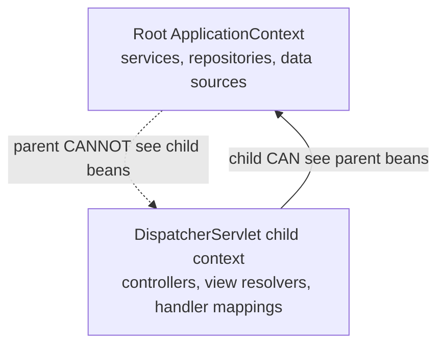
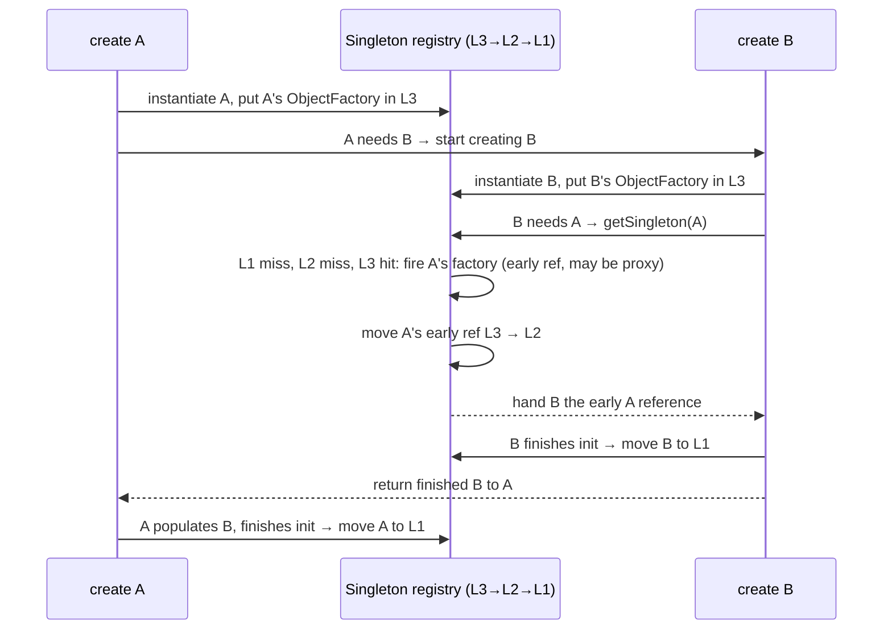

# IoC Container & Dependency Injection

Inversion of Control (IoC) and Dependency Injection (DI) are the foundation of the
Spring Framework. Nearly every other Spring feature — AOP, transactions, MVC, Data,
Security — is layered on top of the IoC container. This topic covers what IoC/DI are,
how the container resolves and wires beans, the injection styles and their trade-offs,
the autowiring resolution algorithm, and the internals that come up in interviews such
as circular dependency resolution via the three-level singleton cache.

---

## IoC vs DI

**Inversion of Control (IoC)** is a *design principle*: instead of your objects creating
and managing their own collaborators, control over object creation and lifecycle is
"inverted" and handed to an external entity (a framework/container). Your code no longer
calls `new` on its dependencies; the framework calls your code and supplies them.
The Hollywood Principle summarizes it: "Don't call us, we'll call you."

**Dependency Injection (DI)** is the most common *implementation technique* for IoC:
the container supplies (injects) an object's dependencies from the outside rather than
the object looking them up or instantiating them. Other implementations of IoC exist too
(e.g., the Service Locator pattern, template methods, strategy callbacks), so DI is a
subset of IoC.

```java
// WITHOUT IoC/DI — the class controls its own dependency (tight coupling)
public class OrderService {
    private final PaymentGateway gateway = new StripePaymentGateway(); // hard-wired
}

// WITH DI — the dependency is supplied from outside (loose coupling)
public class OrderService {
    private final PaymentGateway gateway;
    public OrderService(PaymentGateway gateway) { this.gateway = gateway; }
}
```

Key distinction to state in interviews: **IoC is the principle (the "what/why"); DI is a
pattern that achieves it (the "how").** Spring's IoC container performs DI. The term
"IoC container" and "DI container" refer to the same thing in Spring: the
`ApplicationContext`/`BeanFactory`.

Why it matters: DI enables loose coupling, easier unit testing (inject mocks/stubs),
swappable implementations, centralized configuration, and clear expression of a class's
collaborators.

---

## Loose coupling

**Loose coupling** means a class depends on *abstractions* (interfaces) rather than
concrete implementations, and does not construct or locate its collaborators itself.
DI is the mechanism Spring uses to achieve this: because dependencies are injected, you
can substitute a different implementation without changing the dependent class.

Benefits:
- **Testability** — inject a mock/fake in a unit test without a running container.
- **Flexibility** — swap implementations via configuration (`@Profile`, `@Qualifier`,
  `@Primary`) without editing consumers.
- **Single Responsibility / separation of concerns** — a class focuses on its logic,
  not on wiring.
- **Maintainability** — wiring is centralized and explicit.

Depending on an interface rather than a concrete class also aligns with the Dependency
Inversion Principle (the "D" in SOLID): high-level modules and low-level modules both
depend on abstractions. Note that DI (the technique) and Dependency Inversion (the SOLID
principle) are related but distinct — DI is one way to realize dependency inversion.

---

## BeanFactory vs ApplicationContext

Both are IoC containers. `ApplicationContext` is a superset of `BeanFactory`.

| Aspect | `BeanFactory` | `ApplicationContext` |
|---|---|---|
| Package/role | Basic container, lazy | Advanced, enterprise container |
| Bean instantiation | **Lazy** by default (created on `getBean`) | **Eager** for singletons at startup (pre-instantiates) |
| BeanPostProcessor / BeanFactoryPostProcessor | Must register manually | Auto-detected and registered |
| Annotation config (`@Autowired`, etc.) | Not automatic | Supported out of the box |
| Internationalization (`MessageSource`) | No | Yes |
| Event publishing (`ApplicationEvent`) | No | Yes |
| Environment / property resolution | Limited | Full `Environment` abstraction |
| AOP / auto-proxying | Manual | Automatic |

`ApplicationContext extends BeanFactory` (via `ListableBeanFactory` and
`HierarchicalBeanFactory`). In practice you almost always use an `ApplicationContext`;
`BeanFactory` is used for very memory-constrained or lazy scenarios.

Common implementations: `AnnotationConfigApplicationContext`,
`ClassPathXmlApplicationContext`, `GenericWebApplicationContext`,
`AnnotationConfigServletWebServerApplicationContext` (Spring Boot web apps).

Interview trap: **"Are singletons eager or lazy?"** By default, an `ApplicationContext`
pre-instantiates singleton beans at startup (eager), which surfaces configuration errors
early ("fail fast"). A raw `BeanFactory` creates them lazily on first `getBean`.

---

## Context hierarchy

Spring supports a **parent-child hierarchy** of `ApplicationContext`s. A child context can
see beans defined in its parent, but the parent cannot see beans in the child. Bean lookup
walks up: if a bean isn't found in the child, the request is delegated to the parent.

Classic example — Spring MVC:
- The **root** context (loaded by `ContextLoaderListener`) holds shared beans:
  services, repositories, data sources.
- Each `DispatcherServlet` has its own **child** web context holding web-layer beans:
  controllers, view resolvers, handler mappings.
- Web-layer beans can inject service-layer beans from the root; the reverse is not
  possible.



Rules and gotchas:
- Beans are resolved child-first, then parent. A bean defined in both is effectively
  overridden for the child's consumers.
- Parent beans cannot depend on child beans.
- In Spring Boot, a single application context is the norm; hierarchies appear with
  Spring Cloud (the bootstrap context is a parent of the main context) or when explicitly
  building multiple `DispatcherServlet`s. Spring Cloud's bootstrap context is disabled by
  default in newer versions (requires `spring-cloud-starter-bootstrap` or a property).

---

## Constructor vs setter vs field injection

Spring supports three injection styles.

```java
// Constructor injection (RECOMMENDED)
@Service
public class OrderService {
    private final PaymentGateway gateway;
    private final InventoryClient inventory;
    // @Autowired optional on a single constructor since Spring 4.3
    public OrderService(PaymentGateway gateway, InventoryClient inventory) {
        this.gateway = gateway;
        this.inventory = inventory;
    }
}

// Setter injection
@Service
public class OrderService {
    private PaymentGateway gateway;
    @Autowired
    public void setGateway(PaymentGateway gateway) { this.gateway = gateway; }
}

// Field injection (DISCOURAGED)
@Service
public class OrderService {
    @Autowired
    private PaymentGateway gateway;
}
```

| Criterion | Constructor | Setter | Field |
|---|---|---|---|
| Mandatory dependencies | ✅ enforced | optional | not enforced |
| `final` / immutability | ✅ yes | ❌ no | ❌ no |
| Fully initialized object | ✅ guaranteed | ❌ can be partially built | ❌ |
| Testability without container | ✅ `new` with mocks | ✅ via setters | ❌ needs reflection/injection |
| Optional / changeable deps | awkward* | ✅ good fit | — |
| Circular dependency | ❌ fails fast (BeanCurrentlyInCreation) | ✅ can be resolved | ✅ can be resolved |
| Hides too many deps (code smell) | ✅ constructor gets bloated → visible signal | hidden | hidden |

\* *Optional* collaborators with constructor injection are handled cleanly with
`Optional<T>`, `@Nullable`, or `ObjectProvider<T>` (see the optional-injection section
below) — so the "awkward" cell rarely bites in practice.

**Why field injection is discouraged (say this in interviews):**
1. **No immutability** — the field can't be `final`, so the object is mutable.
2. **Poor testability** — you can't inject mocks with plain Java `new`; you need
   Spring, reflection, or `@InjectMocks`. Constructor injection lets you write a POJO
   unit test with `new OrderService(mockGateway, mockInventory)`.
3. **Hidden dependencies** — a class can accumulate many `@Autowired` fields without the
   pain being visible; a long constructor signals a class doing too much (SRP violation).
4. **Tight coupling to the DI container** — the class can only be instantiated by a
   container capable of reflection-based injection.
5. **Risk of `NullPointerException`** if the object is created outside Spring.
6. IDEs/compilers can warn about unused/uninitialized `final` fields with constructors;
   field injection loses that.

The Spring team and Spring Boot documentation **officially recommend constructor
injection** for mandatory dependencies and setter injection for optional/changeable ones.

Since Spring 4.3, if a class has a **single constructor**, `@Autowired` on it is optional —
Spring will use it automatically. With multiple constructors you must annotate the one to
use (or provide a no-arg + `@Autowired` on one).

Boot tip: with Lombok, `@RequiredArgsConstructor` generates a constructor for all `final`
fields, giving clean constructor injection with no boilerplate.

**Multiple-constructor resolution rules (often misremembered).** If a class has several
constructors and none is annotated, Spring uses the no-arg constructor if present. You may
annotate at most **one** constructor with `@Autowired(required=true)`. If you want Spring
to *choose* among constructors, annotate several with `@Autowired(required=false)` — Spring
then picks the "greediest" constructor whose dependencies can all be satisfied, falling
back to a default constructor if none can. A single constructor is always used implicitly,
even without `@Autowired`, even if it is non-public.

**Field injection's subtle testing failure.** Beyond needing reflection, field injection
into a `final`-less field means a test that forgets to set a collaborator gets a silent
`NullPointerException` at method-call time rather than a clear "missing dependency" at
construction. Constructor injection makes the required set an unforgeable part of the
type's contract.

**Setter injection and re-entrancy.** Setters can be called more than once and after the
object is otherwise in use, which is both the feature (reconfiguration) and the hazard
(a bean can be observed in a partially wired state by another thread during startup). For
mandatory collaborators this is a real thread-visibility concern that constructor
injection with `final` fields eliminates (see the concurrency section).

---

## @Autowired resolution algorithm

When Spring resolves an `@Autowired` dependency it follows this order:

1. **Match by type.** Find all beans assignable to the required type.
2. If **exactly one** candidate → inject it. Done.
3. If **no candidate** → behavior depends on `required`:
   - `required=true` (default) → throw `NoSuchBeanDefinitionException`
     (a `NoUniqueBeanDefinitionException` is thrown for the multiple-match case below).
   - `required=false` / `Optional` / `@Nullable` → leave null / empty.
4. If **multiple candidates** → disambiguate, in this order:
   a. A candidate annotated **`@Primary`** wins.
   b. Otherwise, a **`@Qualifier("name")`** on the injection point narrows to the bean
      with that qualifier/name.
   c. Otherwise, fall back to matching the **field/parameter name** against the bean
      name (name-based fallback).
   d. `@Priority(n)` (jakarta/javax) can also break ties (lower number = higher priority).
5. If still ambiguous → **`NoUniqueBeanDefinitionException`**.

```java
@Component("card")   public class CardPayment   implements PaymentGateway {}
@Component("wallet") public class WalletPayment implements PaymentGateway {}

@Service
public class OrderService {
    // Two candidates of type PaymentGateway → name-based fallback:
    // the parameter name 'card' matches bean name "card" → injects CardPayment
    public OrderService(PaymentGateway card) { ... }
}
```

Advanced: `@Autowired` is processed by `AutowiredAnnotationBeanPostProcessor`. Generics
are considered part of the type: `@Autowired Repository<Order>` will only match a bean
whose generic type is `Repository<Order>`. Arrays, `Collection`, `List`, `Set`, and `Map`
of a type are injected with *all* matching beans (see collections injection).

**Subtleties senior candidates should know:**
- **`@Qualifier` narrows the candidate set *before* `@Primary` is considered.** The
  resolution isn't a flat "primary then qualifier" — a `@Qualifier` filters candidates,
  and only among the survivors does `@Primary`/`@Priority`/name-fallback break ties. This
  is why a `@Qualifier` at the injection point "beats" a `@Primary` marked elsewhere.
- **Name-based fallback uses the injection point name, not arbitrary matching.** For a
  field it's the field name; for a constructor/method parameter it's the parameter name —
  which requires parameter names to be retained in the bytecode (`-parameters`, on by
  default for Spring Boot builds) or the fallback silently fails.
- **`@Primary` on multiple beans of the same type is itself an error:** if two candidates
  are both `@Primary`, resolution throws `NoUniqueBeanDefinitionException` ("more than one
  'primary' bean found").
- **Spring 6.2 added `@Fallback`** — the inverse of `@Primary`. A `@Fallback` bean is only
  chosen when no non-fallback candidate exists, useful for supplying a default that any
  user-defined bean automatically supersedes without needing `@ConditionalOnMissingBean`.
- **Exact exceptions:** *zero* candidates for a required point →
  `NoSuchBeanDefinitionException`; *multiple* indistinguishable candidates →
  `NoUniqueBeanDefinitionException`. Both are subclasses of `BeansException` and, at
  startup, surface wrapped in a `UnsatisfiedDependencyException` /
  `BeanCreationException`.

---

## @Qualifier vs @Primary

Both resolve the ambiguity of multiple candidates of the same type, but differently:

| | `@Primary` | `@Qualifier` |
|---|---|---|
| Where it's declared | On the **bean definition** (the default choice) | On the **injection point** (and matching beans) |
| Granularity | One global default per type | Per-injection-point selection |
| Intent | "When in doubt, pick me" | "Here, specifically pick this one" |
| Precedence | Lower — a `@Qualifier` at the injection point overrides `@Primary` | Higher — wins over `@Primary` |

```java
@Bean @Primary DataSource primaryDs() { ... }   // default for DataSource injections
@Bean @Qualifier("audit") DataSource auditDs() { ... }

@Autowired DataSource ds;                         // gets primaryDs (Primary)
@Autowired @Qualifier("audit") DataSource audit;  // gets auditDs (Qualifier overrides)
```

Walking the mechanism for the second line: candidates start as `{primaryDs, auditDs}`;
`@Qualifier("audit")` **filters** the set down to `{auditDs}`; only one survivor remains,
so the `@Primary` tie-breaker is never consulted. That "narrow-then-tiebreak" order (from
the resolution algorithm above) is exactly why an injection-point `@Qualifier` beats a
`@Primary` declared elsewhere.

Rule of thumb: use **`@Primary`** when there's a sensible default and most consumers want
it; use **`@Qualifier`** when consumers must choose explicitly. If both apply,
**`@Qualifier` at the injection point wins** over `@Primary`.

You can also create custom qualifier annotations (meta-annotated with `@Qualifier`) for
type-safe selection instead of string names.

---

## @Resource vs @Inject vs @Autowired

Three annotations can drive injection. They differ in origin and default matching mode.

| Annotation | Origin | Default match | Qualifier mechanism | `required` |
|---|---|---|---|---|
| `@Autowired` | Spring | **by type**, then by name fallback | `@Qualifier` | `required=false` supported |
| `@Resource` | Jakarta (`jakarta.annotation`, was `javax.annotation`) | **by name** (the `name` attr or field name), then by type | `name` attribute | not supported (throws if unmatched) |
| `@Inject` | JSR-330 (`jakarta.inject`, was `javax.inject`) | **by type**, then by name | `@Named` / `@Qualifier` | not supported (use `Provider` / `Optional`) |

Key points:
- **`@Autowired` matches by type first**; the field name is only a *fallback* tie-breaker.
- **`@Resource` matches by name first** (using the field/setter name or its explicit
  `name`), then falls back to type. This makes it handy when you want to pick a specific
  bean by name without a separate `@Qualifier`.
- **`@Inject`** is the JSR-330 standard; it behaves like `@Autowired` (by type) but is
  vendor-neutral. Requires the `jakarta.inject`/`javax.inject` dependency on the classpath.
- `@Autowired` supports `required=false`; `@Resource` and `@Inject` do not (an `@Inject`
  optional dependency is expressed via `Provider<T>` or Spring's `ObjectProvider<T>`).

**Different post-processors, different bootstrapping.** `@Resource`, `@PostConstruct`, and
`@PreDestroy` (JSR-250) are handled by `CommonAnnotationBeanPostProcessor`, while
`@Autowired`, `@Value`, and `@Inject` are handled by
`AutowiredAnnotationBeanPostProcessor`. A consequence that trips people up: **you cannot
use these injection annotations inside your own `BeanPostProcessor` or
`BeanFactoryPostProcessor`** — those infrastructure beans are instantiated so early that
the post-processors that would inject them haven't run yet. Wire them via constructor
arguments in an `@Bean` method instead.

**`@Resource` disambiguation trick.** Because `@Resource` matches by name first, it neatly
resolves the self-injection / same-`@Configuration` `@Bean` reference problem: it fetches
the bean back by its unique name (obtaining the proxy) without engaging type-based
candidate selection at all.

**`@Resource` name resolution order.** With an explicit `name` it looks that up directly;
without one it derives the name from the field/property and matches by name; only if no
name match exists does it fall back to a by-type match (and then a `@Qualifier`, if
present, is honored). If the derived name matches no bean and multiple beans of the type
exist, you get a resolution failure rather than a silent type match.

**Jakarta EE / Spring Boot 3.x note:** Spring Framework 6 / Spring Boot 3 migrated from
the `javax.*` namespace to `jakarta.*`. So it's now `jakarta.annotation.Resource` and
`jakarta.inject.Inject`. On Spring Boot 2.x / Spring 5 they were `javax.annotation.Resource`
and `javax.inject.Inject`. Using the wrong namespace on the wrong version is a common
migration bug.

---

## required=false and Optional injection

By default `@Autowired` dependencies are **mandatory**: if no matching bean exists, the
context fails to start. To make a dependency optional you have several idioms:

```java
// 1) required=false — field/param left null if no bean present
@Autowired(required = false)
private AuditService audit;

// 2) java.util.Optional — empty if no bean
@Autowired
private Optional<AuditService> audit;

// 3) @Nullable on the parameter
public OrderService(@Nullable AuditService audit) { ... }

// 4) ObjectProvider — lazy, supports getIfAvailable/getIfUnique, safest for optional
private final ObjectProvider<AuditService> auditProvider;
public OrderService(ObjectProvider<AuditService> auditProvider) {
    this.auditProvider = auditProvider;
}
// ... auditProvider.getIfAvailable();
```

Notes and gotchas:
- With **constructor injection**, `required=false` on `@Autowired` is only meaningful when
  there are multiple constructors; the recommended optional patterns are `Optional<T>`,
  `@Nullable`, or `ObjectProvider<T>`.
- `ObjectProvider<T>` (Spring) is the most flexible: it defers resolution (lazy) and
  offers `getIfAvailable()`, `getIfUnique()`, and stream access — great for optional or
  0-to-many dependencies without failing the context.
- Mixing `required=true` fields with a genuinely absent bean is the classic
  `NoSuchBeanDefinitionException` at startup.

---

## Collections and map injection

You can inject **all beans of a type** as a `List`, `Set`, array, or `Map`.

```java
public interface Validator { }
@Component class EmailValidator implements Validator {}
@Component class PhoneValidator implements Validator {}

@Service
public class SignupService {
    private final List<Validator> validators;         // all Validator beans
    private final Map<String, Validator> byName;       // key = bean name, value = bean
    public SignupService(List<Validator> validators, Map<String, Validator> byName) {
        this.validators = validators;
        this.byName = byName;
    }
}
```

Details that come up in interviews:
- **`List<T>` / `Set<T>` / `T[]`** are injected with every bean assignable to `T`.
- **`Map<String, T>`** injects a map whose **keys are bean names** and values are the
  beans. (A `Map` with a non-`String` key type is not treated as a collection injection.)
- **Ordering:** collection order is not guaranteed by default. Use `@Order(n)` on beans
  or implement `Ordered` to control it; `@Priority` also participates. Lower value = earlier.
- If **no beans** of the type exist, an `@Autowired` collection is by default required and
  fails — unless you add `required=false`, in which case you get an empty collection (or
  use `ObjectProvider`).
- A `@Qualifier` on a collection injection point restricts it to beans carrying that
  qualifier — useful for grouping a subset.

Advanced collection details:
- **Constructor/factory multi-element points resolve to empty, not failure.** Although a
  scalar constructor argument is required by default, an array/collection/`Map` constructor
  parameter resolves to an *empty* instance when no beans match — different from an
  `@Autowired` field collection, which is required by default and fails when empty.
- **`@Order` affects the injected list order but NOT bean creation/startup order.** Startup
  order is governed by the dependency graph and `@DependsOn`; `@Order` only reorders the
  elements handed to an injection point (and the results of `ObjectProvider.stream()`
  when using `.orderedStream()`).
- **A bean can be excluded from a same-type collection by `@Qualifier` grouping**, and a
  self-referencing bean is *not* added to a collection of its own type (self references are
  fallback-only and never participate in normal candidate selection).
- **`Map<String, T>` requires a `String` key.** A `Map` with any other key type is treated
  as an ordinary bean to inject, not as a "collect all beans of T" request.

---

## Circular dependencies and the three-level singleton cache

A **circular dependency** occurs when bean A depends on B and B depends on A (directly or
transitively).

**Behavior by injection type:**
- **Constructor injection on both sides → unresolvable.** Spring throws
  `BeanCurrentlyInCreationException` (a `BeanCreationException`). Neither object can be
  fully constructed before the other exists.
- **Field or setter injection → resolvable** (for singletons) via early references,
  because Spring can create the raw instance first and inject the collaborator afterward.

Intuition first: an **early reference** is a half-built A — its constructor has run so the
object exists, but its fields aren't filled in yet — handed out as a placeholder so B can
grab a pointer to it and finish. A completes afterward, and because B held the *same*
object, B now sees the fully wired A. The three maps below simply track which stage of
"doneness" each singleton is in (factory → early reference → finished).

**The three-level cache** (in `DefaultSingletonBeanRegistry`) is how Spring exposes an
early reference to a half-built singleton so the cycle can be closed:

| Level | Field | Holds |
|---|---|---|
| 1 (first) | `singletonObjects` | fully initialized, ready singletons |
| 2 (second) | `earlySingletonObjects` | early-exposed instances (raw, populated on demand from L3) |
| 3 (third) | `singletonFactories` | `ObjectFactory` lambdas that can produce an early reference (possibly a proxy) |

Creation flow for a singleton A that needs B which needs A:
1. Start creating A → instantiate A (constructor) → place an `ObjectFactory` for A into
   **level 3** (`singletonFactories`) and mark A "in creation".
2. Populate A's fields → A needs B → start creating B.
3. Instantiate B → put B's factory in level 3 → populate B's fields → B needs A.
4. Resolve A: `getSingleton` checks L1 (miss) → L2 (miss) → **L3**: calls A's
   `ObjectFactory`, which returns A's early reference (running any
   `SmartInstantiationAwareBeanPostProcessor`, e.g. to create an AOP proxy). That early
   reference is moved to **L2** and removed from L3.
5. B receives the early A reference, finishes initialization, moves to **L1**.
6. Control returns to A; A finishes populating (now has the finished B), completes
   initialization, and moves to **L1**.



**Why three levels and not two?** The third level stores *factories*, not objects. The
factory allows Spring to create the *correct* early reference lazily — critically, if A
needs an AOP proxy, the factory produces the proxy exactly once and consistently, so B
gets the same proxy A ends up as. A two-level cache couldn't both defer proxy creation and
guarantee a single consistent proxy instance.

**Spring Boot 2.6+ change:** circular references are **prohibited by default**. If your
app has one, startup fails with a clear message. You can re-enable with
`spring.main.allow-circular-references=true`, but the recommended fix is to break the
cycle (redesign, extract a third bean, or use `@Lazy` / `ObjectProvider` /
`ApplicationContext.getBean` / setter injection / an event) rather than allow it.

**`@Lazy` as a cycle-breaker:** annotating one injection point with `@Lazy` injects a
proxy instead of the real bean, deferring the real lookup until first use, which breaks
the construction-time cycle (works even with constructor injection).

**The AOP-proxy-in-a-cycle failure mode (a classic senior trap).** The three-level cache
normally exposes an early reference that already accounts for AOP proxying. But if the
early reference is exposed as the *raw* object and the bean is only proxied *later* (in a
post-processor after property population), the collaborator that grabbed the early
reference ends up holding the raw target while the container's own copy is the proxy. In
older/edge cases Spring detects this inconsistency and throws
`BeanCurrentlyInCreationException` with a message like "Bean with name 'x' has been
injected into other beans ... in its raw version as part of a circular reference, but has
eventually been wrapped." The usual triggers are `@Async` (whose proxy is created by a
different post-processor than the `SmartInstantiationAwareBeanPostProcessor` used for early
references) combined with a cycle. The fix is to break the cycle or use `@Lazy`.

**Why constructor cycles are fundamentally unresolvable.** The early-reference trick
requires an *instance to already exist* so it can be placed in level 3 before its
properties are populated. A constructor cycle needs the collaborator *before* the instance
exists, so there is nothing to expose early. `spring.main.allow-circular-references=true`
therefore does **not** rescue a pure constructor cycle — it only re-enables the
setter/field early-reference mechanism that was disabled by default in Boot 2.6.

**Cache promotion is one-directional and eager-cleared.** Once an object is promoted from
level 3 to level 2, its factory is removed from level 3, and once fully initialized it
moves to level 1 and is removed from level 2 — the three maps are mutually exclusive at
any instant. Prototype-scoped beans are *never* placed in these caches, which is why
prototype↔prototype cycles are always unresolvable (Spring can't track "currently in
creation" across independent prototype instances) and throw immediately.

---

## @Lazy injection and when beans are created

**When are beans created?**
- By default, **singleton** beans are **eagerly instantiated** when the
  `ApplicationContext` is refreshed (at startup). This "fail fast" behavior surfaces
  wiring/config errors immediately.
- **Prototype** beans are created **on demand** — a new instance each time they are
  requested (via `getBean` or injected into another bean). The container does not manage
  their full lifecycle (no destruction callbacks).
- Beans of other scopes (`request`, `session`, etc.) are created when their scope begins.

**`@Lazy`** defers creation:
- On a **`@Component`/`@Bean`**: the singleton is not created at startup but on first
  access (first injection or `getBean`).
- On an **injection point** (`@Autowired @Lazy`): Spring injects a **lazy proxy**; the
  target bean is resolved only when a method is first invoked on the proxy. This is the
  mechanism that lets `@Lazy` break constructor circular dependencies and speed startup.
- `@Lazy` on a `@Configuration` class makes all its `@Bean` methods lazy.

Trade-offs of lazy initialization:
- Pros: faster startup, lower memory if some beans are never used.
- Cons: errors surface **later** (at first use, possibly in production) instead of at
  startup; first request pays the initialization cost. Generally prefer eager for
  fail-fast behavior; use `@Lazy` selectively or for rarely used heavy beans.

Boot-wide switch: `spring.main.lazy-initialization=true` makes *all* beans lazy — useful
for dev/test startup speed, but disables fail-fast and adds latency to first requests, so
it's generally not recommended for production.

Order of a bean's own creation lifecycle: instantiate (constructor) → populate
properties/inject → `BeanNameAware`/`*Aware` → `BeanPostProcessor.before` →
`@PostConstruct` → `InitializingBean.afterPropertiesSet` → custom `init-method` →
`BeanPostProcessor.after` (proxy often created here) → bean ready. (Covered in depth in
the Bean Scopes & Lifecycle topic.)

---

## Scope mismatch and injecting shorter-lived beans

A common senior-level trap: injecting a **shorter-lived** bean (prototype, request,
session) into a **longer-lived** one (singleton). Because a singleton is wired **once** at
creation, a plain injected prototype is resolved a single time and then effectively behaves
like a singleton — you get the *same* instance forever, not a fresh one per use.

```java
@Component @Scope("prototype")
class Task { }

@Service
class Runner {
    @Autowired private Task task;   // resolved ONCE — same Task every call, not "prototype"
}
```

Correct ways to get a fresh instance each time from a singleton:
- **`ObjectProvider<Task>` / JSR-330 `Provider<Task>`** — call `getObject()` per use.
- **`@Lookup` method injection** — Spring overrides an abstract/concrete method with a CGLIB
  subclass that returns a fresh `getBean` result on each call.
- **Scoped proxy** — `@Scope(value="prototype", proxyMode=TARGET_CLASS)`; the injected proxy
  delegates to a new (or scope-appropriate) instance per invocation.

For `request`/`session` beans injected into singletons, a **scoped proxy** is mandatory:
the proxy resolves the real bean from the currently active scope on each method call. Injecting
the real bean directly fails outside an active request, or captures one request's instance forever.

`@Lookup` internals: Spring uses CGLIB to create a runtime subclass overriding the lookup
method, so the method must not be `private`, `final`, or `static`, and the bean must be
subclassable. This is "method injection" and is one of the few places the container
subclasses your class purely for wiring.

---

## Programmatic access, ApplicationContextAware, and Service Locator

Sometimes you need the container itself — e.g., to resolve a bean whose type is chosen at
runtime. Options, from most to least "Spring-idiomatic":

- **`ObjectProvider<T>`** injected as a dependency — lazy, type-safe, no container coupling.
- **`ApplicationContextAware`** / `BeanFactoryAware` — the container injects itself via the
  aware callback; you then call `getBean`. This is the Service Locator pattern and couples
  your code to Spring, so it's a fallback, not a default.
- **`@Autowired ApplicationContext ctx`** — the context is itself a resolvable dependency.

`Aware` callbacks (`BeanNameAware`, `BeanFactoryAware`, `ApplicationContextAware`, etc.) are
invoked by dedicated `BeanPostProcessor`s (e.g. `ApplicationContextAwareProcessor`) **after
property population but before `@PostConstruct`**. Ordering among aware interfaces:
`BeanNameAware` → `BeanClassLoaderAware` → `BeanFactoryAware`, then the context-level aware
interfaces from `ApplicationContextAwareProcessor`.

Preferring `ObjectProvider`/`@Autowired` over `ApplicationContextAware` keeps beans testable
as POJOs and avoids the Service Locator anti-pattern (which hides dependencies and reintroduces
the coupling DI was meant to remove).

---

## Thread-safety and concurrency of injection

- **Singleton beans are created single-threaded during context refresh**, but are then shared
  across all request threads. The container guarantees a singleton is fully initialized (all
  injection + `@PostConstruct` done) before it's published to `singletonObjects`, so
  application threads never see a partially wired singleton — *provided* you don't leak `this`
  early (e.g., registering a listener in a constructor) or rely on setter re-injection at runtime.
- **`final` fields set via constructor injection get the JMM's final-field publication
  guarantee**: their values are safely visible to other threads without extra synchronization.
  Setter/field-injected non-final fields do **not** carry that guarantee, so a bean observed
  through a data race could see a stale/null collaborator. This is a concrete, if subtle,
  argument for constructor injection in concurrent apps.
- **The three-level cache maps are guarded by synchronization** on the singleton mutex inside
  `DefaultSingletonBeanRegistry`; concurrent `getBean` calls for a not-yet-created singleton
  are serialized so the bean is created exactly once. Prototypes have no such guard — every
  request builds a new instance.
- **Bean *state* is your responsibility.** DI makes the wiring thread-safe; it does nothing to
  make a mutable singleton's fields thread-safe. A singleton holding mutable request state is a
  classic concurrency bug regardless of how it was injected.

---

## Bean overriding, definition order, and startup ordering

- **Bean definition overriding** (two beans registered under the same name) was allowed by
  default historically but is **disabled by default since Spring Boot 2.1**. A duplicate name
  now throws `BeanDefinitionOverrideException` at startup unless
  `spring.main.allow-bean-definition-overriding=true`. This is distinct from having two beans
  of the same *type* under different names (which is a *resolution* problem solved by
  `@Primary`/`@Qualifier`).
- **`@DependsOn`** forces initialization order between beans that have no direct injection
  edge (e.g., a bean that must run after some infrastructure bean side-effect). It controls
  creation *and* destruction order but does not create an injection relationship.
- **`@Order`/`Ordered`** does **not** affect singleton startup order — only the order of
  elements at collection injection points and in ordered streams, plus things like servlet
  filter chains and `@ControllerAdvice`. Startup order is dependency-driven.
- **`@Priority`** participates in autowiring tie-breaks for a *single* injection (lower value
  wins) and in collection ordering, but `jakarta.annotation.Priority` cannot be placed on a
  `@Bean` *method* — model that with `@Order` plus `@Primary`/`@Fallback`.

---

## Common follow-up questions

- "What's the difference between IoC and DI?" IoC is the principle (control of
  creation/wiring is inverted to the container); DI is one implementation of it.
- "Which injection type do you prefer and why?" Constructor injection: immutability
  (`final`), guaranteed non-null fully-initialized objects, easy POJO testing, and it
  makes too-many-dependencies visible.
- "Can constructor injection cause a circular dependency failure?" Yes —
  `BeanCurrentlyInCreationException`. Field/setter can be resolved via early references;
  fix by redesign or `@Lazy`.
- "Why three levels in the singleton cache?" The third level holds *factories* so
  Spring can lazily produce a single consistent early reference — importantly the correct
  AOP proxy — for beans in a cycle.
- "How does `@Autowired` resolve when there are two candidates?" `@Primary` →
  `@Qualifier` → bean-name fallback → else `NoUniqueBeanDefinitionException`.
- "`@Resource` vs `@Autowired`?" `@Resource` matches by name first; `@Autowired`
  by type first (name only as fallback).
- "What changed in Spring Boot 3 regarding these annotations?" `javax.*` →
  `jakarta.*` namespaces (`jakarta.annotation.Resource`, `jakarta.inject.Inject`).
- "Are singletons lazy or eager?" Eager by default in `ApplicationContext`; use
  `@Lazy` or `spring.main.lazy-initialization` to defer.
- "BeanFactory vs ApplicationContext — when would you use BeanFactory?" Rarely; only
  for extreme memory/lazy constraints. `ApplicationContext` adds events, i18n, AOP,
  annotation config, and eager singletons.
- "How do you inject all implementations of an interface?" Inject `List<T>` or
  `Map<String,T>`; order with `@Order`.
- "What happens if a required bean is missing?" Startup fails with
  `NoSuchBeanDefinitionException` unless the dependency is optional
  (`required=false`/`Optional`/`ObjectProvider`).

## References

- Spring Framework Reference — Core / IoC Container:
  https://docs.spring.io/spring-framework/reference/core/beans.html
- Spring Framework Reference — Dependencies and configuration in detail:
  https://docs.spring.io/spring-framework/reference/core/beans/dependencies/factory-collaborators.html
- Spring Framework Reference — Autowiring & `@Autowired`:
  https://docs.spring.io/spring-framework/reference/core/beans/annotation-config/autowired.html
- Spring Framework Reference — Using `@Qualifier`, `@Primary`, JSR-330 `@Inject`/`@Named`,
  `@Resource`:
  https://docs.spring.io/spring-framework/reference/core/beans/annotation-config/autowired-qualifiers.html
- Spring Boot Reference — Constructor injection guidance & Spring Beans and DI:
  https://docs.spring.io/spring-boot/reference/using/spring-beans-and-dependency-injection.html
- Spring Boot 2.6 Release Notes — circular references prohibited by default:
  https://github.com/spring-projects/spring-boot/wiki/Spring-Boot-2.6-Release-Notes
- Baeldung — Constructor vs Field Injection:
  https://www.baeldung.com/constructor-injection-in-spring
- Baeldung — `@Autowired`, `@Qualifier`, `@Primary`:
  https://www.baeldung.com/spring-qualifier-annotation
- Baeldung — Spring Circular Dependencies & the three-level cache:
  https://www.baeldung.com/circular-dependencies-in-spring
- Baeldung — `@Resource` vs `@Inject` vs `@Autowired`:
  https://www.baeldung.com/spring-annotations-resource-inject-autowire
