# Transaction Management

Spring's transaction abstraction gives you a consistent programming model across
different transaction APIs (JDBC, JPA, Hibernate, JTA) and lets you manage
transactions **declaratively** (`@Transactional`) or **programmatically**
(`TransactionTemplate` / `PlatformTransactionManager`). This topic is a favorite
of interviewers because the *declarative* model hides an AOP proxy whose
subtleties (self-invocation, `private` methods, default rollback rules,
propagation semantics) trip up even experienced developers.

---

## ACID

A **transaction** is a unit of work that either fully completes or fully fails.
The classic guarantees are **ACID**:

| Property | Meaning | Who enforces it |
|---|---|---|
| **Atomicity** | All statements commit together, or none do (all-or-nothing). A rollback undoes partial work. | Transaction manager + DB (undo/rollback log) |
| **Consistency** | A transaction moves the DB from one valid state to another, respecting constraints (FKs, checks, triggers). | DB constraints + your business logic |
| **Isolation** | Concurrent transactions don't corrupt each other; the degree is tuned by the *isolation level*. | DB locking / MVCC |
| **Durability** | Once committed, data survives crashes (written to durable storage / WAL). | DB (write-ahead log, fsync) |

**Why it matters:** the canonical example is a bank transfer — debit account A
and credit account B. If the JVM dies after the debit but before the credit,
atomicity (rollback) prevents money vanishing. Spring doesn't *implement* ACID
itself; it *coordinates* the underlying resource (DB / JTA) so ACID holds across
your service method.

**Advanced:** Consistency in the ACID sense is largely the application's/DB's
responsibility, not something the transaction manager magically provides — it
just guarantees that if your logic is correct, partial results are never
persisted. Note also that isolation is a *spectrum*: stronger isolation costs
concurrency, so real systems rarely run at `SERIALIZABLE`.

---

## Declarative vs programmatic transaction management

Spring offers two styles:

**Declarative** — annotate a method/class with `@Transactional`. Spring wraps
the bean in an AOP proxy that starts/commits/rolls back around the method. This
is the dominant style: no boilerplate, transaction demarcation is separated from
business logic.

```java
@Service
public class OrderService {
    @Transactional
    public void placeOrder(Order o) {
        inventory.reserve(o);
        payment.charge(o);   // if this throws, everything rolls back
    }
}
```

**Programmatic** — you control the transaction in code, via `TransactionTemplate`
(preferred) or the raw `PlatformTransactionManager`.

```java
// TransactionTemplate — recommended programmatic style
transactionTemplate.execute(status -> {
    inventory.reserve(o);
    payment.charge(o);
    return null;               // exception or status.setRollbackOnly() -> rollback
});

// Raw PlatformTransactionManager
TransactionStatus status = txManager.getTransaction(new DefaultTransactionDefinition());
try {
    // work...
    txManager.commit(status);
} catch (RuntimeException e) {
    txManager.rollback(status);
    throw e;
}
```

| | Declarative | Programmatic |
|---|---|---|
| Boilerplate | Minimal (annotation) | Explicit code |
| Fine-grained control | Limited (whole method) | Full (partial commits, dynamic rollback) |
| Testability of tx logic | Needs proxy in place | Direct |
| Best for | 95% of business methods | Small blocks, dynamic decisions, non-Spring-managed code |

**Trade-off:** declarative is cleaner but couples you to the proxy mechanism (and
its self-invocation limitation). Programmatic is verbose but works anywhere and
lets you commit part-way. Interviewers like to hear "declarative by default,
programmatic when I need scoped or conditional demarcation."

---

## @Transactional mechanics (AOP proxy)

`@Transactional` is **not** magic on the method — it is implemented with
**Spring AOP**. At startup, if a bean has `@Transactional` (via
`@EnableTransactionManagement`, which Spring Boot auto-enables), Spring creates a
**proxy** around that bean. Callers get the proxy, not the raw object.

Flow on every call to a transactional method:
1. Caller invokes proxy method.
2. `TransactionInterceptor` (an `@Around`-style advice) consults the
   `TransactionAttributeSource` to read the `@Transactional` metadata.
3. It asks the `PlatformTransactionManager` to start/join a transaction
   according to the **propagation** setting.
4. It invokes the **target** method.
5. On normal return → commit. On a rollback-triggering exception → rollback.

**Proxy types:**
- **JDK dynamic proxy** — used when the bean implements at least one interface;
  the proxy implements the same interface(s).
- **CGLIB** — used when there is no interface (subclass-based proxy). Spring Boot
  defaults to CGLIB proxying (`spring.aop.proxy-target-class=true`) so it works
  regardless of interfaces.

**The core consequence:** self-invocation and non-public methods bypass the
interceptor (see the trap subtopic below).

```mermaid
flowchart LR
    Caller -->|external call| Proxy
    Proxy --> Interceptor[TransactionInterceptor]
    Interceptor -->|begin / commit / rollback| Target[target bean method]
    Target -.->|this.other&#40;&#41; self-invocation| Target2[other method, SAME bean]
    style Target2 stroke-dasharray: 5 5
```



External calls go `Caller → Proxy → TransactionInterceptor → target`, so the
transaction advice runs. A self-invocation (`this.other()`, dashed) stays inside
the target object and never re-enters the proxy — the interceptor is skipped and
`other()`'s `@Transactional` is silently ignored.

**Advanced internals:** the transaction context (connection, `TransactionStatus`)
is bound to the current thread via `TransactionSynchronizationManager`
(a set of `ThreadLocal`s). That's how a `@Transactional` method and the JDBC
connection it uses share the same transaction — and why classic thread-per-request
transactions don't propagate to a different thread you spawn (e.g. `@Async` or a
new `Thread`).

---

## PlatformTransactionManager

`PlatformTransactionManager` is the central **strategy interface** (SPI) of the
Spring transaction abstraction. Three methods:

```java
public interface PlatformTransactionManager extends TransactionManager {
    TransactionStatus getTransaction(TransactionDefinition definition);
    void commit(TransactionStatus status);
    void rollback(TransactionStatus status);
}
```

You pick an **implementation** matching your persistence tech:

| Implementation | Use with |
|---|---|
| `DataSourceTransactionManager` (a.k.a. `JdbcTransactionManager` in newer Spring) | Plain JDBC / MyBatis / Spring JDBC |
| `JpaTransactionManager` | JPA / Hibernate (as JPA) |
| `HibernateTransactionManager` | Native Hibernate `SessionFactory` |
| `JtaTransactionManager` | Distributed / XA transactions across multiple resources |
| `R2dbcTransactionManager` | Reactive R2DBC |

**Spring Boot auto-configuration** creates the right one for you: with
`spring-boot-starter-data-jpa` you get a `JpaTransactionManager`; with plain
`spring-boot-starter-jdbc` you get a `DataSourceTransactionManager`. You only
declare one manually when you have multiple databases (then you name the manager
via `@Transactional("txManagerName")`).

**Reactive note:** Spring 5.2+ added `ReactiveTransactionManager` for WebFlux;
`@Transactional` on a method returning `Mono`/`Flux` uses it — transaction state
is bound to the Reactor context, not a ThreadLocal.

**Interface hierarchy:** since Spring 5.2 both `PlatformTransactionManager` and
`ReactiveTransactionManager` extend the empty marker interface
`TransactionManager`.

**`DataSourceTransactionManager` vs `JdbcTransactionManager`:** Spring 5.3
introduced `JdbcTransactionManager` as a drop-in subclass of
`DataSourceTransactionManager` that additionally performs **SQLException
translation** (via a `SQLExceptionTranslator`) on commit/rollback failures,
converting them into Spring's `DataAccessException` hierarchy. Spring Boot's
`DataSourceTransactionManagerAutoConfiguration` registers a
`JdbcTransactionManager` for plain-JDBC setups. Functionally they behave
identically for demarcation; the difference is exception translation.

**`getTransaction` semantics:** the method name is misleading — it does *not*
always "get" (create) a physical transaction. Depending on propagation it may
create one, join the existing one, suspend it, or return a status representing
"no transaction." The returned `TransactionStatus` exposes `isNewTransaction()`
(true only for the outermost participant that actually began the physical
transaction), `isRollbackOnly()`, `hasSavepoint()`, and `setRollbackOnly()`.
When a REQUIRED method *joins*, `commit()` on the inner status is essentially a
**no-op** — only the outermost `commit()` (the one that owns the new
transaction) actually commits to the database.

**Mental model:** think of REQUIRED like a nested `try/finally` reference
counter. Only the outermost frame that opened the physical transaction actually
talks to the DB; each inner `commit()` just decrements the participation count.
`isNewTransaction()` is `true` for exactly one participant — the outermost — and
that is the only one whose `commit()` reaches the database.

---

## Propagation

Propagation defines what happens when a transactional method is called — does it
join an existing transaction, start a new one, or run without one? Set via
`@Transactional(propagation = Propagation.X)`. Default is **REQUIRED**.

| Propagation | If a tx exists | If NO tx exists |
|---|---|---|
| **REQUIRED** (default) | Join it | Create a new one |
| **REQUIRES_NEW** | Suspend it, start a brand-new independent tx | Create a new one |
| **NESTED** | Create a **savepoint** within the current tx (nested) | Create a new one |
| **SUPPORTS** | Join it | Run **non-transactionally** |
| **MANDATORY** | Join it | **Throw** `IllegalTransactionStateException` |
| **NEVER** | **Throw** `IllegalTransactionStateException` | Run non-transactionally |
| **NOT_SUPPORTED** | Suspend it, run non-transactionally | Run non-transactionally |

**Key distinctions:**
- **REQUIRED vs REQUIRES_NEW** — with REQUIRED, an inner method's failure marks
  the *whole* transaction rollback-only; with REQUIRES_NEW the inner tx commits or
  rolls back **independently** (outer can survive inner's failure, and vice
  versa). REQUIRES_NEW physically **suspends** the outer connection and grabs a
  second connection — beware connection-pool exhaustion and self-deadlock if the
  pool is size 1.
- **NESTED vs REQUIRES_NEW** — NESTED uses a **JDBC savepoint** inside the *same*
  physical transaction/connection. Rolling back the nested part reverts to the
  savepoint but the outer tx continues; however if the **outer** rolls back,
  the nested work is also lost (it was never independently committed). NESTED
  requires a resource manager that supports savepoints (JDBC does; many JPA
  setups do not — `JpaTransactionManager` does not support NESTED and throws
  `NestedTransactionNotSupportedException`).
- **MANDATORY** enforces "I must be called inside someone else's transaction."
- **NEVER** enforces "I must NOT be called inside a transaction."
- **NOT_SUPPORTED** runs the body with no transaction (suspends any existing one)
  — useful for long-running read-only reporting that shouldn't hold locks.

**Advanced gotcha:** suspension (REQUIRES_NEW, NOT_SUPPORTED) only truly works
when the transaction manager supports it. Also, propagation is evaluated by the
proxy — so an inner `REQUIRES_NEW` method called via `this.` from the same bean
gets **no new transaction at all** (self-invocation trap).

**Worked example — same code, three propagations, three DB states.** Both
methods are on *separate beans* (so the proxy is honored), and `inner()` always
throws after its write:

```java
@Transactional                       // outer is REQUIRED
public void outer() {
    repo.insert(A);                  // writes row A
    try { other.inner(); }           // inner writes row B, then throws
    catch (RuntimeException e) { /* swallowed */ }
}
```

Trace the committed rows after `outer()` returns, per `inner()`'s propagation:

| `inner()` propagation | What happens on inner's throw | Row A | Row B |
|---|---|---|---|
| **REQUIRED** | Inner joins outer's tx; its throw marks the *shared* tx rollback-only. Swallowing the exception does **not** un-poison it — outer's commit throws `UnexpectedRollbackException`. | **not committed** | not committed |
| **REQUIRES_NEW** | Inner runs in a suspended-outer, independent physical tx; its throw rolls back only that inner tx. Outer catches, continues, commits. | **committed** | rolled back |
| **NESTED** | Inner ran after a savepoint in outer's tx; its throw rolls back **to the savepoint** (undoing B only). Outer catches and commits the rest. | **committed** | rolled back |

The trap most people miss is row A under **REQUIRED**: even though `outer()`
caught the exception, the transaction was already flagged rollback-only, so
A dies too and the commit itself fails. REQUIRES_NEW and NESTED both let A
survive — the difference is that NESTED's B-rollback shares outer's connection
(a savepoint), while REQUIRES_NEW's B-rollback used a second connection.

---

## Isolation levels & anomalies

Isolation controls how/when one transaction's changes become visible to others.
Set via `@Transactional(isolation = Isolation.X)`. `DEFAULT` means "use the
database's default" (e.g. `READ_COMMITTED` for PostgreSQL/Oracle/SQL Server,
`REPEATABLE_READ` for MySQL InnoDB).

**The three classic read anomalies:**
- **Dirty read** — you read another transaction's *uncommitted* change; it may
  later roll back, so you read data that never officially existed.
- **Non-repeatable read** — you read a row, another tx commits an *update* to it,
  you re-read the same row and get a different value within your own tx.
- **Phantom read** — you run a range query (`WHERE age > 30`), another tx commits
  an *insert/delete* matching that predicate, you re-run the query and rows
  appear/disappear.

**Worked timelines (why the table is what it is).** Read time top-to-bottom;
each row is one step. Account row starts at `balance = 100`.

*Dirty read* (only possible below READ_COMMITTED):

| Step | T1 | T2 |
|---|---|---|
| 1 | — | `UPDATE balance = 150` (**not committed**) |
| 2 | `SELECT balance` → **150** | — |
| 3 | — | `ROLLBACK` (balance back to 100) |

T1 acted on `150`, a value that never officially existed. READ_COMMITTED stops
this because T1 at step 2 would only see committed data (still `100`).

*Non-repeatable read* (possible at READ_COMMITTED, stopped by REPEATABLE_READ):

| Step | T1 | T2 |
|---|---|---|
| 1 | `SELECT balance` → **100** | — |
| 2 | — | `UPDATE balance = 150; COMMIT` |
| 3 | `SELECT balance` → **150** | — |

Same row, same T1, two different answers. REPEATABLE_READ pins T1 to its
snapshot, so step 3 still returns `100`.

*Phantom read* (survives REPEATABLE_READ per the SQL standard). Table `users`
holds 2 rows with `age > 30`:

| Step | T1 | T2 |
|---|---|---|
| 1 | `SELECT count(*) WHERE age>30` → **2** | — |
| 2 | — | `INSERT age=40; COMMIT` |
| 3 | `SELECT count(*) WHERE age>30` → **3** | — |

The *set* of matching rows changed (a new row appeared), not a value in a row
T1 already read — that is why a per-row snapshot can miss it and only
SERIALIZABLE (range/predicate locks) reliably prevents it.

**Which level prevents which:**

| Isolation level | Dirty read | Non-repeatable read | Phantom read |
|---|---|---|---|
| **READ_UNCOMMITTED** | ❌ possible | ❌ possible | ❌ possible |
| **READ_COMMITTED** | ✅ prevented | ❌ possible | ❌ possible |
| **REPEATABLE_READ** | ✅ prevented | ✅ prevented | ❌ possible* |
| **SERIALIZABLE** | ✅ prevented | ✅ prevented | ✅ prevented |

*Per the SQL standard REPEATABLE_READ allows phantoms; MySQL InnoDB's
REPEATABLE_READ uses next-key locking / MVCC snapshots and prevents most phantoms
in practice — a common interview nuance.

**Trade-off:** higher isolation = more locking/blocking = less throughput and
more deadlocks. `SERIALIZABLE` is the safest and slowest. Most apps run at
`READ_COMMITTED` and use optimistic locking (`@Version`) or `SELECT ... FOR
UPDATE` for the few spots that need more.

**Advanced gotcha:** isolation is only honored when a *new physical* transaction
starts. If a `@Transactional(isolation = SERIALIZABLE)` method **joins** an
existing REQUIRED transaction that started at READ_COMMITTED, Spring by default
**throws** `IllegalTransactionStateException` on isolation mismatch only if
`validateExistingTransaction` is on; otherwise the requested isolation is
**silently ignored** — the inner participates at the outer's level. Also,
`isolation` on `@Transactional` is not supported by `JpaTransactionManager` in
older setups unless the datasource/Hibernate allows per-tx isolation.

---

## Rollback rules (rollbackFor)

**The single most tested trap:** by default, Spring rolls back **only on
unchecked exceptions** — subclasses of `RuntimeException` and `Error`. Checked
exceptions do **NOT** trigger rollback by default; the transaction **commits**.

```java
@Transactional
public void save() throws IOException {
    repo.insert(...);
    throw new IOException("boom");   // DEFAULT: transaction COMMITS! (checked)
}
```

This surprises people coming from EJB (where the same default exists but is
often forgotten). To roll back on a checked exception:

```java
@Transactional(rollbackFor = IOException.class)          // roll back on this checked ex
@Transactional(rollbackFor = Exception.class)            // roll back on ANY exception
@Transactional(noRollbackFor = IllegalStateException.class)  // do NOT roll back on this unchecked ex
```

Rules of resolution:
- `rollbackFor` / `rollbackForClassName` — additional throwables that force rollback.
- `noRollbackFor` / `noRollbackForClassName` — throwables that should NOT roll back.
- The most **specific** matching rule wins (by class hierarchy distance).
- If no custom rule matches, the default (rollback on unchecked + Error) applies.

**Other gotchas:**
- If you **catch** the exception inside the method and don't rethrow, Spring never
  sees it → **commit**. To force rollback without rethrowing, call
  `TransactionAspectSupport.currentTransactionStatus().setRollbackOnly()`.
- Once a transaction is marked rollback-only (e.g. an inner REQUIRED method
  failed), the outer commit throws
  `UnexpectedRollbackException` ("Transaction rolled back because it has been
  marked as rollback-only") — a very common "why did my commit fail?" question.

---

## readOnly

`@Transactional(readOnly = true)` is a **hint** that the transaction won't modify
data. It matters most with JPA/Hibernate:

- Hibernate sets the `FlushMode` to `MANUAL`/`NEVER`, so it **skips dirty
  checking and auto-flush** — a real performance win for read-heavy service
  methods (no snapshot comparisons, entities effectively read-only).
- The JDBC connection is flagged `Connection.setReadOnly(true)`, which some
  drivers/DBs use to route to read replicas or optimize.

**Important nuances:**
- `readOnly` is **not** a hard guarantee against writes at the Spring level; if
  you actually issue an update the DB (or Hibernate flush) may reject or ignore
  it depending on setup. It's an optimization/intent hint, not a security
  control.
- It only takes effect when a **new** transaction begins; setting it while
  joining an existing read-write tx has no effect.
- Common pattern: annotate read query methods `readOnly = true` and let write
  methods use the default.

---

## timeout

`@Transactional(timeout = N)` sets the maximum time in **seconds** the transaction
may run before it is rolled back. `-1` (`TIMEOUT_DEFAULT`) means use the
underlying default (usually none).

- The clock starts when the transaction begins; if the accumulated time is
  exceeded at the next resource interaction (e.g. a statement execution), the
  transaction is rolled back with a `TransactionTimedOutException`.
- It's enforced cooperatively via the transaction synchronization + the JDBC
  statement query timeout — a single long-running statement that doesn't yield
  may or may not be interrupted depending on the driver.
- Like `readOnly`/`isolation`, `timeout` applies to the transaction that is
  **created**; a method joining an existing transaction can't shorten its parent.
- `timeoutString` (Spring 6+) allows a property-placeholder value.

Use it to bound worst-case lock-holding time so a stuck transaction doesn't pin
connections/locks forever.

> [!WARNING]
> `timeout` is checked **cooperatively**, at the next resource interaction, and
> is largely delegated to the JDBC statement query-timeout. A `@Transactional(timeout = 2)`
> method that spends 30s in a pure in-memory computation (no DB round-trip)
> blows past the 2s without interruption, because there is no checkpoint to
> enforce it. Likewise a driver that ignores `Statement.setQueryTimeout` on a
> single long query can exceed it. For a hard ceiling, pair the transaction
> timeout with a JDBC socket/statement timeout (and a DB-side
> `statement_timeout`) so a wedged statement is actually killed.

---

## The self-invocation / private method trap (proxy bypass)

**This is the #1 `@Transactional` interview trap.** Because declarative
transactions are proxy-based, `@Transactional` is only honored when the call goes
**through the proxy**.

**Self-invocation** — a method calling another method of the *same bean* via
`this`:

```java
@Service
public class UserService {
    public void outer() {
        inner();                 // internal call -> goes to 'this', NOT the proxy
    }
    @Transactional
    public void inner() {        // NO transaction when called from outer()!
        repo.save(...);
    }
}
```

`outer()` calls `this.inner()`, bypassing the proxy, so the
`TransactionInterceptor` never runs and `inner()` executes with **no
transaction**. The same applies to a transactional `outer()` calling a
`REQUIRES_NEW inner()` — no new transaction is created.

**Why:** the proxy wraps the *bean reference* held by other beans. Inside the
target object, `this` is the raw instance, not the proxy, so advice is skipped.

**`private`/non-public methods** — Spring's proxy-based `@Transactional` is only
applied to **public** methods. On `private`, `protected`, or package-private
methods the annotation is **silently ignored** (with JDK/CGLIB proxying). (AspectJ
compile/load-time weaving *can* handle non-public and self-invocation, because it
modifies the bytecode directly rather than using a proxy.) Also, on CGLIB, a
`final` method or `final` class cannot be proxied.

**Fixes:**
1. **Split into two beans** so the call crosses a proxy boundary (cleanest).
2. **Self-inject the proxy** and call through it:
   ```java
   @Autowired private UserService self;   // injected proxy
   public void outer() { self.inner(); }
   ```
   or `AopContext.currentProxy()` with `exposeProxy = true`.
3. Use **programmatic** transactions (`TransactionTemplate`) in `outer()`.
4. Use **AspectJ** weaving (`mode = AdviceMode.ASPECTJ`) — no proxy, so
   self-invocation and non-public methods work.

**Bonus trap:** `@Transactional` on an interface method with JDK proxies works,
but Spring recommends annotating **concrete classes**, because CGLIB proxies
can't see interface-level annotations.

---

## Transaction synchronization & lifecycle callbacks

Spring exposes hooks to run code at well-defined points in a transaction's
lifecycle via `TransactionSynchronization` (registered through
`TransactionSynchronizationManager.registerSynchronization(...)`), or, more
ergonomically, `@TransactionalEventListener`.

**The classic ordering trap:** `beforeCommit` runs *before* the physical
commit; `afterCommit` and `afterCompletion` run *after*. Work that must be
visible to other transactions (e.g. publishing a Kafka/SNS message, evicting a
distributed cache, sending an email) belongs in **`afterCommit`** — if you fire
it inside the transaction and the commit later fails, you have published a
message for data that was never persisted (a "dual-write"/phantom-notification
bug). Conversely, `afterCommit` is **not guaranteed to have its own
transaction**: any data access you perform there runs *outside* the committed
transaction unless you open a new one.

```java
@TransactionalEventListener(phase = TransactionPhase.AFTER_COMMIT)
public void on(OrderPlaced e) {
    // runs only if the tx committed; NOT inside that tx anymore
    notificationClient.send(e);       // safe: order is durably persisted
}
```

Key gotchas:
- `@TransactionalEventListener` with the default `AFTER_COMMIT` phase **silently
  does nothing** if the event is published with **no active transaction** —
  unless you set `fallbackExecution = true`. This is a very common "my listener
  never fires in a unit test" bug.
- Exceptions thrown from `afterCommit` **cannot** roll back the transaction (it
  already committed) — they propagate to the caller and can leave you in a
  half-done state; `afterCompletion` swallows/ logs exceptions.
- `TransactionSynchronizationManager.isActualTransactionActive()` tells you
  whether a *real* physical transaction is bound (as opposed to just
  synchronization being active), useful for defensive assertions.

---

## Locking: optimistic vs pessimistic

Isolation levels alone don't solve the **lost update** problem for
read-modify-write cycles across separate transactions. Two complementary tools:

**Optimistic locking** — add a `@Version` column (int/long/timestamp).
Hibernate appends `WHERE id = ? AND version = ?` on updates and bumps the
version; if zero rows match, someone else changed it first and Hibernate throws
`OptimisticLockException` / Spring's `ObjectOptimisticLockingFailureException`.
No DB locks are held between read and write — great for low-contention, high-read
workloads. The failure surfaces at **flush/commit**, so you must handle it there
(often with a retry).

**Worked lost-update race.** Row starts as `id=1, qty=10, version=5`. Two txns
both want to decrement `qty`:

| Step | T1 | T2 | Row in DB |
|---|---|---|---|
| 1 | `SELECT` → qty=10, version=5 | — | qty=10, v5 |
| 2 | — | `SELECT` → qty=10, version=5 | qty=10, v5 |
| 3 | `UPDATE ... SET qty=9, version=6 WHERE id=1 AND version=5` → **1 row**, COMMIT | — | qty=9, **v6** |
| 4 | — | `UPDATE ... SET qty=9, version=6 WHERE id=1 AND version=5` → **0 rows** | qty=9, v6 |

At step 4 the `WHERE version=5` matches nothing (the row is now v6), so
Hibernate sees `0` rows affected and throws
`ObjectOptimisticLockingFailureException` at flush. Without the version column
T2's blind `SET qty=9` would have silently overwritten T1's decrement — both
sold one unit but qty only dropped by one (the lost update). The version check
converts a silent data-corruption into a loud, retryable failure:

```java
for (int attempt = 0; attempt < MAX; attempt++) {
    try { decrement(id); return; }               // re-read + re-apply inside
    catch (ObjectOptimisticLockingFailureException e) { /* reload, retry */ }
}
```

On retry T2 re-reads (qty=9, version=6), decrements to `qty=8, version=7`, and
the `WHERE version=6` now matches — the final DB state is the correct `qty=8`.

**Pessimistic locking** — acquire a DB row lock up front:
`@Lock(LockModeType.PESSIMISTIC_WRITE)` on a query method (issues `SELECT ... FOR
UPDATE`), blocking other writers until your tx ends. Use for high-contention
hotspots (inventory counters, sequence tables). Risks: lock wait timeouts,
deadlocks, reduced throughput. `PESSIMISTIC_READ` (shared) vs `PESSIMISTIC_WRITE`
(exclusive); a `jakarta.persistence.lock.timeout` hint bounds the wait.

**Gotcha:** optimistic locking only protects entities you actually load *and*
version. A bulk JPQL `UPDATE` bypasses the version check and dirty checking
entirely. Also, `@Version` conflicts throw at flush time, which may be at commit
— so a `try/catch` inside the method body won't catch it unless you force a
flush.

---

## Connection acquisition, flush timing & lazy loading

**When is the JDBC connection acquired?** With Hibernate's default
`connection.handling_mode` (`DELAYED_ACQUISITION_AND_RELEASE_AFTER_TRANSACTION`
for resource-local JPA), the physical connection is obtained **lazily** — on the
first statement, not when the transaction opens. So a `@Transactional` method
that never touches the DB may never borrow a connection. This matters for pool
sizing and for `REQUIRES_NEW` reasoning.

**Flush vs commit:** `flush()` pushes pending SQL (INSERT/UPDATE/DELETE) to the
DB so it's visible **within** the transaction and to subsequent queries, but it
does **not** commit — a rollback still undoes it. Auto-flush is triggered before
queries (to keep results consistent) and at commit. `readOnly = true` sets flush
mode to MANUAL so this doesn't happen.

**`LazyInitializationException`:** the persistence context (Hibernate `Session`)
lives only for the transaction. Accessing a lazy association *after* the
`@Transactional` service method returns (e.g. in the view/controller layer)
throws `LazyInitializationException` because the session is closed. The
anti-pattern fix is Open-Session-In-View (OSIV, on by default in Spring Boot —
`spring.jpa.open-in-view=true`), which keeps the session open for the whole
request; the proper fix is to fetch what you need inside the transaction (fetch
joins, entity graphs, DTO projections). OSIV can silently hold a connection for
the entire request and hide N+1 problems.

---

## @Transactional in tests & @Transactional class-level defaults

**Tests:** `@Transactional` on a JUnit test (or test class) makes Spring
**roll back** the transaction after each test method by default, keeping the DB
clean between tests. Use `@Commit` or `@Rollback(false)` to override. A key
trap: because everything runs in one transaction, `flush`/`commit`-time
constraints (unique keys, `@Version`, deferred FKs) may **not** surface during
the test the way they would in production; and `@TransactionalEventListener`
`AFTER_COMMIT` handlers never fire because the test transaction never commits.

**Class-level annotation & merging:** a method-level `@Transactional` fully
**overrides** (does not merge with) the class-level one for that method — you
re-specify every attribute you want, defaults apply to the rest. Spring resolves
the most specific annotation (method > class > superclass/interface) via
`AnnotationTransactionAttributeSource`.

---

## Failure modes & advanced gotchas

- **`@Transactional` on a bean created before the tx infrastructure** (e.g. a
  `BeanPostProcessor`, `@Configuration` class methods, or an infrastructure
  bean) may not be proxied — advice ordering matters.
- **Multiple transaction managers:** with two `DataSource`s you must
  disambiguate via `@Transactional("orderTxManager")` (the `value`/
  `transactionManager` attribute) or a `@Primary` manager; otherwise Spring
  can't decide and startup may fail or the wrong DB is used. A single
  `@Transactional` **cannot span two non-XA `DataSource`s** — that needs JTA/XA
  or the chained/best-effort-1PC pattern.
- **`@Async` + `@Transactional` on the same method:** the async proxy and the
  tx proxy interplay means the transaction runs on the **executor thread**, and
  the caller's transaction (if any) is *not* propagated. Ordering of the two
  advices is set by `@Order`; get it wrong and you may commit before the async
  work runs.
- **Rollback-only "poisoning":** in a REQUIRED chain, once any participant sets
  rollback-only, the whole transaction is doomed. Catching the inner exception
  in the outer method does **not** rescue it — you get `UnexpectedRollbackException`
  at the top. To let the outer survive the inner's failure, the inner must be
  `REQUIRES_NEW` (or `NESTED` with savepoint support).
- **Silent no-op self-invocation** applies to *all* proxy-based advice, not just
  transactions (also `@Cacheable`, `@Async`, `@PreAuthorize`).
- **`Propagation.NESTED` + JPA:** even where savepoints work, the `EntityManager`
  is shared, so a nested rollback to savepoint does **not** reset the in-memory
  persistence-context state — entities modified before the savepoint remain
  "dirty" in the session, which can cause surprising re-flushes. Often you must
  `clear()` the context.
- **Read-only + write:** on some setups a write in a `readOnly` Hibernate tx is
  silently discarded (flush skipped); on others (e.g. connection set read-only at
  the driver) it throws. Never rely on `readOnly` for correctness.

---

## Distributed / XA transactions

A single Spring transaction over one resource is 1-phase (simple commit). Across
**multiple resources** (two databases, DB + JMS broker) you need **XA / 2-phase
commit (2PC)** coordinated by a JTA transaction manager (`JtaTransactionManager`
delegating to Atomikos, Narayana, or a Jakarta EE server). Phase 1 = prepare
(each resource votes), phase 2 = commit/rollback all.

Trade-offs & alternatives:
- 2PC is slow, holds locks across the prepare window, and has a **blocking**
  failure mode if the coordinator dies after prepare.
- Modern microservice guidance avoids distributed transactions in favor of the
  **Saga pattern** (a sequence of local transactions with compensating actions)
  or the **transactional outbox** (write the event to an outbox table in the
  *same* local transaction, relay it asynchronously) for exactly-once-ish
  messaging without XA.
- `ChainedTransactionManager` (now deprecated) offered "best-effort 1PC" —
  commit resources in sequence; it can still leave you inconsistent if the second
  commit fails after the first succeeded.

---

## Common follow-up questions

- **Why does my checked exception commit instead of rolling back?** Default
  rollback is unchecked + Error only; add `rollbackFor = Exception.class`.
- **Why is `@Transactional` on my `private` method ignored?** Proxy-based tx only
  advises public methods; make it public and call it through the proxy, or use
  AspectJ.
- **I call a `@Transactional` method from another method in the same class and it
  doesn't start a transaction — why?** Self-invocation bypasses the proxy.
- **REQUIRED vs REQUIRES_NEW — when to use which?** REQUIRES_NEW for work that
  must commit independently (audit logs, sending a notification record) even if
  the outer tx rolls back; REQUIRED for normal "all-or-nothing" flows.
- **Difference between NESTED and REQUIRES_NEW?** NESTED = savepoint in the same
  physical tx (rolls back to savepoint, dies with the outer); REQUIRES_NEW =
  separate physical tx/connection, commits independently.
- **What is `UnexpectedRollbackException`?** The outer tx tried to commit but was
  marked rollback-only by a failed inner participating tx.
- **Does `@Transactional` work across threads (`@Async`, new Thread)?** No — the
  tx context is thread-bound via ThreadLocal; the new thread has no transaction.
- **JDK proxy vs CGLIB for transactions?** JDK when interfaces exist (interface
  proxy), CGLIB otherwise (subclass); Spring Boot defaults to CGLIB.
- **What does `readOnly = true` actually do?** Hibernate skips dirty checking /
  flush; sets JDBC connection read-only hint — a performance optimization, not a
  write guard.
- **Which package for `@Transactional` in Spring Boot 3?** Use
  `org.springframework.transaction.annotation.Transactional` (Spring's), or the
  Jakarta `jakarta.transaction.Transactional` (note: `javax.*` → `jakarta.*` in
  Boot 3 / Spring 6). Spring's variant supports more attributes (isolation,
  timeout, readOnly, rollbackFor).

---

## References

- Spring Framework Reference — Data Access / Transaction Management:
  https://docs.spring.io/spring-framework/reference/data-access/transaction.html
- Spring Framework Reference — Declarative Transaction Management:
  https://docs.spring.io/spring-framework/reference/data-access/transaction/declarative.html
- Javadoc — `Propagation`:
  https://docs.spring.io/spring-framework/docs/current/javadoc-api/org/springframework/transaction/annotation/Propagation.html
- Javadoc — `Isolation`:
  https://docs.spring.io/spring-framework/docs/current/javadoc-api/org/springframework/transaction/annotation/Isolation.html
- Javadoc — `PlatformTransactionManager`:
  https://docs.spring.io/spring-framework/docs/current/javadoc-api/org/springframework/transaction/PlatformTransactionManager.html
- Baeldung — Transactions with Spring and JPA:
  https://www.baeldung.com/transaction-configuration-with-spring-and-jpa
- Baeldung — `@Transactional` propagation and isolation:
  https://www.baeldung.com/spring-transactional-propagation-isolation
- Baeldung — self-invocation / AOP proxy limitations:
  https://www.baeldung.com/spring-aop-vs-aspectj
- Vlad Mihalcea — the best way to use `@Transactional`:
  https://vladmihalcea.com/spring-transaction-best-practices/
