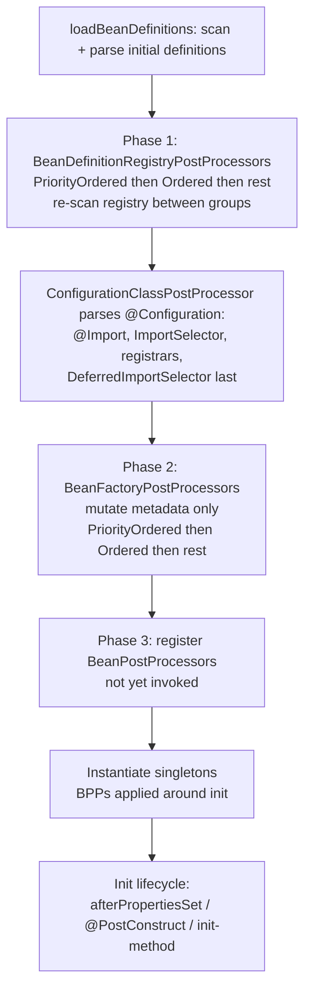

# Advanced Bean Wiring: FactoryBean, Lazy, and Custom Registration

This topic covers the mechanisms Spring Framework offers beyond the everyday
`@Component` / `@Autowired` / `@Bean` flow. These are the tools you reach for
when a bean cannot be constructed by a plain constructor call, when you must
defer or break creation ordering, when you need on-demand or optional lookup,
or when you must register bean definitions programmatically rather than via
component scanning.

Everything here is **plain Spring Framework** (the `spring-context` /
`spring-beans` modules). None of it depends on Spring Boot auto-configuration.
Where a symbol moved from `javax.*` to `jakarta.*`, that is noted: Spring
Framework 6.x targets **Jakarta EE 9+** (`jakarta.inject`, `jakarta.annotation`),
while Spring 5.x used `javax.*`.

---

## FactoryBean versus a Bean factory method

A **`FactoryBean<T>`** is a bean that is itself a *factory* for another object.
It is an interface in `org.springframework.beans.factory`:

```java
public interface FactoryBean<T> {
    T getObject() throws Exception;        // the object actually exposed as the bean
    Class<?> getObjectType();              // type, or null if not known in advance
    default boolean isSingleton() { return true; } // is getObject() cached?
}
```

The key mental model: when you register a `FactoryBean` under the name
`myBean`, and someone asks the container for `myBean`, they do **not** get the
`FactoryBean` instance — they get the result of `getObject()`. The container
transparently "unwraps" the factory.

```java
public class ConnectionFactoryBean implements FactoryBean<Connection> {
    @Override public Connection getObject() throws Exception {
        return DriverManager.getConnection(url);   // complex construction
    }
    @Override public Class<?> getObjectType() { return Connection.class; }
    @Override public boolean isSingleton() { return true; }
}

@Configuration
class Config {
    @Bean
    ConnectionFactoryBean conn() { return new ConnectionFactoryBean(); }
}

// Elsewhere:
Connection c = ctx.getBean("conn", Connection.class);   // getObject() result
Object factory = ctx.getBean("&conn");                  // the FactoryBean itself
```

### The `&` (ampersand) dereference prefix

To retrieve the `FactoryBean` **instance itself** rather than its product,
prefix the bean name with `&` (the constant `BeanFactory.FACTORY_BEAN_PREFIX`):

- `ctx.getBean("conn")`  -> `Connection` (the product of `getObject()`)
- `ctx.getBean("&conn")` -> the `ConnectionFactoryBean` object

This is the classic interview gotcha: `getBean("&x")` returns the factory,
`getBean("x")` returns the product.

### FactoryBean vs a `@Bean` factory method

A `@Bean` method is *also* a factory — an ordinary method whose return value
becomes the bean. So when do you need `FactoryBean` at all? Mostly for
**framework/library integration** and when the object type is not known until
runtime.

| Aspect | `FactoryBean<T>` | `@Bean` factory method |
|---|---|---|
| Form | A class implementing an interface | A method on a `@Configuration` (or `@Component`) class |
| What container stores | The `FactoryBean`; product created via `getObject()` | The returned object directly |
| Access the factory itself | `getBean("&name")` | Not applicable (method, not a stored bean) |
| Singleton control | `isSingleton()` | `@Scope` on the method |
| Typical use | Integrating legacy/3rd-party factories, dynamic proxies, type unknown until runtime | The default, idiomatic Java-config style |
| Verbosity | More boilerplate (interface, 3 methods) | Concise |
| Introspection | Container can call `getObjectType()` before instantiating the product | Return type known from method signature |

**Guidance:** In modern application code prefer a `@Bean` method — it is
simpler and equally powerful. Reach for `FactoryBean` when you are writing
infrastructure that Spring itself must recognize as a factory (e.g. MyBatis'
`MapperFactoryBean`, Spring's own `ProxyFactoryBean`, `JndiObjectFactoryBean`,
`AbstractFactoryBean`), especially where the exposed type must be advertised via
`getObjectType()` before the product exists.

### `SmartFactoryBean` and eager init

`SmartFactoryBean<T>` extends `FactoryBean<T>` with `isPrototype()` and
`isEagerInit()`. `isEagerInit()` returning `true` lets a singleton
`FactoryBean` have its product created eagerly during context refresh instead
of lazily on first access.

### FactoryBean internals worth knowing

- The container caches the singleton product (when `isSingleton()` is true) in a
  separate `factoryBeanObjectCache`, keyed by bean name.
- `FactoryBean` instances are created **eagerly enough** to call
  `getObjectType()` during type matching, which is why they participate in
  autowiring-by-type of the *product* type.
- `getObjectType()` returning `null` weakens type-based autowiring and
  `getBeansOfType` matching, because the container cannot know the product type
  without instantiating the factory.
- A `FactoryBean` can itself have dependencies injected (it is a normal bean).

### Post-processing: the FactoryBean vs its product

A subtle expert distinction: **`BeanPostProcessor`s are applied to the
`FactoryBean` instance through the full initialization lifecycle** (both
`postProcessBeforeInitialization` and `postProcessAfterInitialization`, plus
`afterPropertiesSet`/init-method), because the factory is a normal managed bean.
But the **object returned by `getObject()`** is *not* run through Spring's full
bean-creation lifecycle — Spring does not populate its properties, does not call
its init methods, and does not apply `postProcessBeforeInitialization` to it.
Spring **does** pass the product through `postProcessAfterInitialization` (see
`FactoryBeanRegistrySupport.postProcessObjectFromFactoryBean`), which is exactly
how AOP auto-proxying still gets a chance to wrap a FactoryBean product. The
practical consequence: if you rely on `@Autowired`, `@PostConstruct`, or
`InitializingBean` *inside the object your `getObject()` returns*, none of that
fires — you must wire and initialize the product yourself inside `getObject()`.

### The infrastructure-ordering trap

Because the container must know a `FactoryBean`'s product **type** during
autowiring-by-type, it will instantiate the `FactoryBean` itself early (to call
`getObjectType()`) even though the product stays lazy. More dangerously, if a
`FactoryBean` *also* implements `BeanPostProcessor` or
`BeanFactoryPostProcessor`, or is depended upon by one, it is instantiated in
the very early infrastructure phase — before ordinary `BeanPostProcessor`s are
registered — so such an early bean (and its dependencies) may silently skip
post-processing (e.g. miss AOP proxying), producing the familiar
"not eligible for getting processed by all BeanPostProcessors" log warning.

### getObjectType() before instantiation via generics

Spring can often determine a `FactoryBean`'s product type **without**
instantiating it by reading the declared generic type argument (e.g.
`class Foo implements FactoryBean<Bar>` → `Bar`) or the `@Bean` method's
declared return generics. This is why an `AbstractFactoryBean<T>` subclass that
fixes `T` supports type matching even when `getObjectType()` would otherwise
need a live instance. Returning a raw `FactoryBean` (no generic) forces the
container to instantiate the factory to learn the type — a hidden eager-init.

---

## Lazy initialization with @Lazy

By default, **singleton** beans are instantiated **eagerly** during
`ApplicationContext` refresh (startup). `@Lazy` defers a singleton's creation
until it is first requested or first injected somewhere that actually resolves
it.

```java
@Component
@Lazy                       // this singleton is created on first use, not at startup
class ExpensiveService { }
```

`@Lazy` can be placed on:

- a `@Component` / `@Bean` definition — marks that *bean* as lazy;
- an injection point (`@Autowired @Lazy Foo foo;` or a constructor/`@Bean`
  method parameter) — injects a **lazy-resolution proxy** so the target is only
  created when a method on it is first invoked.

### `@Lazy` at an injection point creates a proxy

This is the subtle part. `@Lazy` on the *injection point* does not just delay;
it injects a **proxy** standing in for the dependency. The real bean is
resolved from the container the first time you call a method on the proxy.

```java
@Component
class A {
    A(@Lazy B b) { this.b = b; }   // 'b' is a lazy proxy, real B built on first call
}
```

### Using `@Lazy` to break circular dependencies

Constructor-injection cycles (A needs B, B needs A) cannot be resolved by
Spring and throw `BeanCurrentlyInCreationException`. (Field/setter singleton
cycles *are* resolvable via early references / the third-level cache, but
constructor cycles are not.) A common fix is to mark **one** side `@Lazy`:

Why the difference? During singleton creation Spring builds a bean in two
steps: it first *instantiates* the object, then *populates* its fields. Between
those steps it exposes a **partially-constructed reference** (the object exists
but its fields aren't set yet) in an "early singleton" cache. A field/setter
cycle can therefore hand out that half-built reference to the other bean and
fill in the fields afterward. A **constructor** cycle can't: the object doesn't
exist until its constructor completes, and the constructor can't complete
without the dependency, so there is nothing to hand out — hence the exception.
Spring implements this with **three caches**: `singletonObjects` (fully built
singletons), `earlySingletonObjects` (exposed-early, not-yet-populated
references), and `singletonFactories` (the factories that produce those early
references, e.g. to allow an AOP proxy to be created early if needed).

```java
@Component
class A {
    A(@Lazy B b) { this.b = b; }   // proxy injected -> A can finish constructing
}
@Component
class B {
    B(A a) { this.a = a; }
}
```

Because the `@Lazy` side receives a proxy instead of a fully built bean, the
first bean can finish construction, breaking the chicken-and-egg cycle. (This
is a pragmatic fix; the cleaner design is usually to remove the cycle.)

### Notes and gotchas

- `@Lazy` on a bean that is depended upon by a **non-lazy** bean has no delaying
  effect at startup unless the injection point is *also* lazy or goes through a
  proxy — the eager consumer forces creation.
- Prototype beans are already "lazy" in the sense that they are created per
  request; `@Lazy` on a prototype changes little at the definition level.
- You can set laziness globally in XML via `default-lazy-init="true"`, or a
  `LazyInitializationBeanFactoryPostProcessor` can flip beans to lazy. (Spring
  Boot exposes `spring.main.lazy-initialization`; that property is a Boot
  feature, not core Spring.)
- `@Lazy(false)` explicitly forces eager init even under a lazy default.

### What kind of proxy `@Lazy` injects, and its sharp edges

The injection-point proxy is created by
`ContextAnnotationAutowireCandidateResolver.buildLazyResolutionProxy`, which uses
Spring AOP's `ProxyFactory` with a `TargetSource` that resolves the dependency
lazily on each invocation. Consequences a senior candidate should know:

- **JDK vs CGLIB.** If the declared injection type is an **interface**, a JDK
  dynamic proxy is created; if it is a **concrete class**, a CGLIB subclass
  proxy is created (so the target class must be non-final and proxyable).
- **The proxy is not the bean.** `proxy == realBean` is false, `getClass()`
  reports the proxy type, and `instanceof` against the concrete class only works
  for the CGLIB case. Equality/identity-sensitive code can break.
- **Deferral, not caching semantics.** The `TargetSource` re-resolves through the
  container; for a singleton dependency that still yields the same singleton, but
  the very first method call is what triggers creation — so exceptions in the
  target's construction surface at first *use*, not at startup.
- **`@Lazy` at the injection point genuinely defers creation** even when the
  surrounding consumer is an eager singleton — unlike `@Lazy` on the *definition*
  alone, which an eager consumer overrides (the container must build the lazy
  bean to satisfy the eager dependency).

### @Lazy for cycle-breaking: why it is a proxy, not magic

When `@Lazy` breaks a constructor cycle, the injected proxy lets bean A finish
its constructor without B existing yet. But the proxy only helps if A does **not
call a method on B inside its own constructor** — doing so forces B's resolution
mid-cycle and reintroduces `BeanCurrentlyInCreationException`. The proxy defers
the *lookup*, not the eventual need for a real B.

---

## ObjectProvider and ObjectFactory for on-demand lookup

`ObjectFactory<T>` and its richer sub-interface `ObjectProvider<T>` let a bean
obtain a dependency **on demand** rather than at injection time, and express
**optionality** and **multiplicity** without `null` or `Optional` gymnastics.

```java
public interface ObjectFactory<T> { T getObject() throws BeansException; }
```

`ObjectFactory` has just `getObject()`. `ObjectProvider<T>` (since Spring 4.3)
extends it with much more:

```java
interface ObjectProvider<T> extends ObjectFactory<T>, Iterable<T> {
    T getObject(Object... args);          // pass explicit ctor args (prototypes)
    T getIfAvailable();                    // null if no bean
    T getIfAvailable(Supplier<T> deflt);
    T getIfUnique();                       // null if zero OR multiple candidates
    T getIfUnique(Supplier<T> deflt);
    Stream<T> stream();                    // all matching beans
    Stream<T> orderedStream();             // honoring @Order / Ordered
    // + forEach via Iterable
}
```

You inject an `ObjectProvider<Foo>` and each `getObject()` call performs a fresh
lookup — invaluable for pulling a **prototype** bean into a singleton on each
use (a lightweight alternative to `@Lookup` or scoped proxies):

```java
@Component
class Client {
    private final ObjectProvider<Task> taskProvider;   // Task is @Scope("prototype")
    Client(ObjectProvider<Task> p) { this.taskProvider = p; }

    void run() {
        Task t = taskProvider.getObject();   // a NEW Task each call
    }
}
```

Optional dependency without failing startup:

```java
@Autowired
Client(ObjectProvider<MetricsSink> sink) {
    this.sink = sink.getIfAvailable(NoOpSink::new);   // graceful default
}
```

| Method | Zero candidates | One candidate | Multiple candidates |
|---|---|---|---|
| `getObject()` | throws `NoSuchBeanDefinitionException` | returns it | throws `NoUniqueBeanDefinitionException` (unless primary) |
| `getIfAvailable()` | `null` | returns it | throws unless one is primary |
| `getIfUnique()` | `null` | returns it | `null` |
| `stream()` | empty stream | one element | all elements |

`ObjectProvider` is preferred over `ObjectFactory` in new code; it is what
Spring itself injects for `Provider`-style needs. It is also lazy by nature —
injecting it does **not** create the target bean; only calling `getObject()`
does — so it is another way to break or defer wiring.

### Relationship to JSR-330 `Provider`

If `jakarta.inject:jakarta.inject-api` (Spring 6) or `javax.inject` (Spring 5)
is on the classpath, you can inject `jakarta.inject.Provider<T>` with the same
"call `.get()` to obtain the bean" semantics. `ObjectProvider` is the
Spring-native superset (adds `getIfAvailable`, `getIfUnique`, streams).

### Thread-safety, ordering, and stream semantics

- **Thread-safety.** An `ObjectProvider` handle is safe to share across threads;
  each `getObject()`/`stream()` is an independent container lookup. For a
  singleton target you get the same shared instance; for a prototype you get a
  fresh instance per call, and *you* own its lifecycle (Spring does **not** track
  or destroy prototype instances — destruction callbacks are not invoked).
- **`stream()` vs `orderedStream()`.** `stream()` returns candidates in
  registration/definition order and **ignores** `@Order`/`Ordered`;
  `orderedStream()` sorts by `@Order`, `Ordered`, and `@Priority`. This mirrors
  the difference between injecting a `List<T>` (ordered) and a `Map<String,T>`.
- **`@Priority` vs `@Order` in providers.** `orderedStream()` honors JSR-250
  `jakarta.annotation.Priority`. Note that for single-injection ambiguity
  resolution, `@Priority` (lowest value wins) participates in candidate
  selection alongside `@Primary`, whereas plain `@Order` does **not** decide a
  single-autowire winner — a frequent point of confusion.
- **`getIfUnique()` and `@Primary`.** With multiple candidates where one is
  `@Primary`, `getIfUnique()` returns the primary rather than `null` — "unique"
  means "unambiguously resolvable to one," not "exactly one defined."

### ObjectProvider as a lazy-wiring and cycle-breaking tool

Because injecting an `ObjectProvider<Foo>` does not resolve `Foo`, it is a clean
alternative to `@Lazy` for breaking cycles or deferring heavy dependencies —
without a proxy, so `getObject()` returns the *real* bean (identity-safe). The
trade-off is an explicit `.getObject()` call at the use site instead of a
transparent field.

---

## Lookup method injection with @Lookup

**Method injection** solves the classic "singleton needs a fresh prototype each
call" scope-mismatch problem. Instead of injecting a prototype once (which would
freeze a single instance into the singleton), you declare an abstract or
concrete **lookup method** that Spring overrides to return a fresh bean from the
container on every invocation.

```java
@Component
abstract class Processor {

    public void handle() {
        Command c = createCommand();   // fresh prototype every call
        c.execute();
    }

    @Lookup
    protected abstract Command createCommand();   // Spring implements this
}
// Command is @Scope("prototype")
```

Key facts:

- Spring uses **CGLIB** to generate a runtime subclass overriding the
  `@Lookup` method; the override calls `getBean(...)`.
- If `@Lookup` has no value, Spring resolves the returned bean **by return
  type**. `@Lookup("beanName")` resolves **by name**.
- The method may be `abstract` (then the class must be, and Spring subclasses
  it) or concrete (the body is a throwaway/placeholder that gets overridden).
- Because it relies on subclassing, the containing bean cannot be `final`, and
  the lookup method cannot be `final` or `private`. `@Lookup` methods generally
  should take **no arguments** (the signature must be overridable).
- `@Lookup` is a Spring annotation; there is no JSR-330 equivalent. It is
  functionally similar to XML `<lookup-method>`.

**When to prefer alternatives:** `ObjectProvider<T>.getObject()` or an injected
`Provider<T>` achieves the same "fresh instance per call" without CGLIB
subclassing and without an abstract class, and is usually the more modern
choice. `@Lookup` remains handy when you want the lookup to look like an
ordinary polymorphic method.

### Failure modes and interactions

- **Silent no-op when CGLIB can't subclass.** `@Lookup` requires the container
  to instantiate the bean via CGLIB subclassing. If the bean is instantiated by
  a route that bypasses `CglibSubclassingInstantiationStrategy` — most notably a
  **`@Bean` factory method** (the return value is a plain object, not a CGLIB
  subclass) — the `@Lookup` method is **not** overridden and runs its original
  body. `@Lookup` therefore only works on component-scanned/auto-detected beans
  whose class Spring itself instantiates, not on instances you `return` from a
  `@Bean` method or a `Supplier` registration.
- **Arguments.** `@Lookup` methods with arguments are supported only in the sense
  that Spring passes them to `getBean(name, args)`; combined with prototype
  constructor args this works, but the canonical, safest form is a no-arg method.
- **Concrete (non-abstract) lookup methods** are allowed; the body you write is a
  throwaway placeholder (often `return null;`) that the CGLIB override replaces.
- **CGLIB vs the bean being final.** The declaring class must be non-final and
  the method non-final/non-private/non-static, or subclassing/override fails.

### @Lookup vs ObjectProvider vs scoped proxy — the real trade-offs

All three give a fresh prototype per use, but they differ in mechanism and
identity: `@Lookup`/`ObjectProvider` return the **real** prototype each call;
a **scoped proxy** (`@Scope(proxyMode = TARGET_CLASS)`) is a single injected
proxy object that resolves a new target per method invocation but is itself a
proxy (so identity/`instanceof` caveats apply, and it is transparent to the
caller). Scoped proxies are the right tool when you want ordinary field
injection with no explicit lookup call.

---

## Programmatic bean registration with BeanDefinitionRegistry

Beyond annotations and XML you can register **bean definitions**
programmatically. A `BeanDefinition` is the container's metadata description of
a bean (class, scope, constructor args, property values, lazy flag, etc.) —
*not* an instance. `BeanDefinitionRegistry` is the SPI for adding/removing them.

### BeanDefinitionRegistryPostProcessor

The primary hook for adding definitions at runtime is
`BeanDefinitionRegistryPostProcessor` (a sub-interface of
`BeanFactoryPostProcessor`). Its `postProcessBeanDefinitionRegistry` runs early
— after definitions are loaded but before beans are instantiated — so you may
add more:

```java
class MyRegistrar implements BeanDefinitionRegistryPostProcessor {
    @Override
    public void postProcessBeanDefinitionRegistry(BeanDefinitionRegistry registry) {
        BeanDefinition bd = BeanDefinitionBuilder
            .genericBeanDefinition(MyService.class)
            .setScope(BeanDefinition.SCOPE_SINGLETON)
            .addConstructorArgValue("hello")
            .getBeanDefinition();
        registry.registerBeanDefinition("myService", bd);
    }

    @Override
    public void postProcessBeanFactory(ConfigurableListableBeanFactory bf) { }
}
```

You can also register directly on a `GenericApplicationContext` /
`AnnotationConfigApplicationContext` before refresh:

```java
var ctx = new AnnotationConfigApplicationContext();
ctx.registerBean("svc", MyService.class, () -> new MyService("x")); // functional style
ctx.refresh();
```

`registerBean` with a `Supplier` (Spring 5+) registers a definition whose
instance-creation is delegated to your supplier — the functional-registration
style that underpins much of Spring's AOT/native support.

- `BeanFactoryPostProcessor` (BFPP) mutates existing definitions
  (`postProcessBeanFactory`) but should not add beans; `BeanDefinitionRegistryPostProcessor`
  (BDRPP) is the one that *adds* definitions.
- BFPPs (and BDRPPs) operate on **metadata**, before instantiation.
  `BeanPostProcessor` (BPP) operates on **instances**, during initialization.
  Don't confuse the three.

### Ordering of the post-processor phases

The container runs these phases in a fixed order (see
`PostProcessorRegistrationDelegate`). The timeline below shows where each
extension point fires during context refresh — note that
`ConfigurationClassPostProcessor` (which drives `@Import`, `ImportSelector`, and
registrars, covered in *Importing configuration* below) is itself a BDRPP, so it
runs inside step 1:



The phases in order:

1. **All `BeanDefinitionRegistryPostProcessor`s first**, and within them Spring
   applies `PriorityOrdered` → `Ordered` → the rest, re-scanning the registry
   between groups (because a BDRPP can register *another* BDRPP). Only after all
   `postProcessBeanDefinitionRegistry` calls does Spring invoke their
   `postProcessBeanFactory` methods.
2. **Then plain `BeanFactoryPostProcessor`s**, again `PriorityOrdered` →
   `Ordered` → non-ordered.
3. **Then `BeanPostProcessor`s are registered** (not yet invoked), ordered the
   same way, and finally beans are instantiated with BPPs applied.

Two classic traps: (a) a `@Bean` method that returns a
`BeanFactoryPostProcessor` should be **`static`** — a non-static one forces its
`@Configuration` class to be instantiated very early, before other BFPPs can
post-process that config class, triggering warnings and disabling `@Bean`
inter-method proxying for it. (b) Because BFPPs run before ordinary beans exist,
**you must not fetch regular beans from the `BeanFactory` inside a BFPP**; doing
so forces premature instantiation that bypasses later post-processors.

### Ordered vs PriorityOrdered vs registration order

`PriorityOrdered` beans are handled as a strictly earlier group than `Ordered`
beans. For **programmatically added** `BeanPostProcessor`s (via
`beanFactory.addBeanPostProcessor`), the `Ordered` interface is ignored — they
run in **registration order** and always before auto-detected BPPs. This matters
when hand-registering infrastructure in a BFPP.

### The AOT and functional-registration angle

`registerBean(name, type, supplier, customizers...)` and
`BeanDefinitionCustomizer` produce definitions with an
**instance supplier** rather than a resolved class-based creation. This is the
foundation Spring's AOT engine uses to generate `@Configuration`-free
registration code for GraalVM native images: at build time Spring turns
reflective bean creation into explicit supplier-style `registerBean` calls, so
avoiding reflection-heavy custom `FactoryBean`s improves native-image
compatibility.

---

## Importing configuration with Import and registrars

`@Import` pulls extra configuration/beans into a `@Configuration` class. It
accepts three kinds of classes:

1. **`@Configuration` classes** — imports their `@Bean` methods.
2. **`ImportSelector`** — returns an array of fully-qualified class names to
   import, decided at runtime from the importing class's annotation metadata.
3. **`ImportBeanDefinitionRegistrar`** — given the metadata and a
   `BeanDefinitionRegistry`, registers bean definitions directly.

```java
@Configuration
@Import({ServiceConfig.class, MySelector.class, MyRegistrar.class})
class AppConfig { }
```

### ImportSelector

```java
class MySelector implements ImportSelector {
    @Override
    public String[] selectImports(AnnotationMetadata meta) {
        return new String[] { "com.acme.FooConfig", "com.acme.BarConfig" };
    }
}
```

Use it when *which* configuration classes to load depends on annotation
attributes or the environment. `DeferredImportSelector` is a variant whose
selections are processed **after** all `@Configuration`-declared regular
imports — used for ordering/overriding scenarios (this is the mechanism behind
Spring Boot's `@EnableAutoConfiguration`, though auto-configuration itself is a
Boot feature).

### ImportBeanDefinitionRegistrar

```java
class MyRegistrar implements ImportBeanDefinitionRegistrar {
    @Override
    public void registerBeanDefinitions(AnnotationMetadata meta,
                                        BeanDefinitionRegistry registry) {
        registry.registerBeanDefinition("dynamic",
            BeanDefinitionBuilder.genericBeanDefinition(Dynamic.class)
                                 .getBeanDefinition());
    }
}
```

This is the classic pattern behind `@EnableXxx` annotations (e.g.
`@MapperScan`, `@EnableCaching`-style helpers): a custom annotation carries
attributes, `@Import`s a registrar, and the registrar reads
`AnnotationMetadata` (via `meta.getAnnotationAttributes(...)`) to register beans
tailored to those attributes.

| Import target | You return / do | Sees annotation metadata | Registers definitions directly |
|---|---|---|---|
| `@Configuration` class | Nothing (its `@Bean`s are used) | n/a | via `@Bean` methods |
| `ImportSelector` | `String[]` of class names to import | yes | no (indirect) |
| `DeferredImportSelector` | `String[]`, processed last | yes | no (indirect) |
| `ImportBeanDefinitionRegistrar` | void; calls `registry.register...` | yes | yes |

**Ordering note:** classes imported via `@Import` (selectors, registrars) can
implement `Ordered` / `PriorityOrdered` or use `@Order`; registrars can also
implement `Aware` interfaces (`EnvironmentAware`, `BeanFactoryAware`,
`ResourceLoaderAware`, `BeanClassLoaderAware`) to receive context callbacks.

### When each hook runs, and why it matters

The `@Import` machinery is driven by `ConfigurationClassPostProcessor`, itself a
`BeanDefinitionRegistryPostProcessor`. The processing order within configuration
parsing is: regular `@Import`ed `@Configuration` classes and `ImportSelector`s
are resolved during parsing; `ImportBeanDefinitionRegistrar`s are collected and
their `registerBeanDefinitions` run **at the end** of parsing the importing
config class; and all `DeferredImportSelector`s run **after every other**
`@Configuration` class has been processed, grouped and ordered so that later
selections can observe/override earlier ones. This is precisely why registrars
should not assume beans registered by *other* registrars already exist, and why
`@ConditionalOnMissingBean`-style overriding relies on the deferred phase.

**Aware callbacks fire, `@Autowired` does not.** A registrar/selector is
instantiated directly by the config parser, **not** as a managed bean, so field
`@Autowired`/`@Value` injection does **not** work on it. Only the `Aware`
interfaces (`EnvironmentAware`, `ResourceLoaderAware`, `BeanFactoryAware`,
`BeanClassLoaderAware`) are honored, and they are invoked *before*
`selectImports`/`registerBeanDefinitions`. Needing the `Environment` inside a
selector is the canonical reason to implement `EnvironmentAware`.

### ImportSelector vs DeferredImportSelector grouping

A `DeferredImportSelector` may return a `getImportGroup()` `Group` class; Spring
batches selections by group, letting an entire family of imports be ordered and
de-duplicated together. This grouping mechanism is what makes large-scale
conditional import sets (like Boot's auto-configuration) deterministic; in plain
Spring it lets you enforce a total order across many selectors.

---

## Conditional registration with Conditional

Spring Framework's `@Conditional` (since 4.0) registers a bean/configuration
**only if** a supplied `Condition` matches. A `Condition` is evaluated at
definition-registration time:

```java
public interface Condition {
    boolean matches(ConditionContext ctx, AnnotatedTypeMetadata meta);
}

class OnProductionCondition implements Condition {
    @Override public boolean matches(ConditionContext ctx, AnnotatedTypeMetadata m) {
        return "prod".equals(ctx.getEnvironment().getProperty("app.env"));
    }
}

@Configuration
class Config {
    @Bean
    @Conditional(OnProductionCondition.class)
    MetricsExporter exporter() { return new MetricsExporter(); }
}
```

`ConditionContext` gives access to the `BeanDefinitionRegistry`,
`ConfigurableListableBeanFactory`, `Environment`, `ResourceLoader`, and
`ClassLoader`, so conditions can inspect properties, classpath presence,
existing bean definitions, etc.

### `@Conditional` versus `@Profile`

`@Profile` is actually **implemented on top of `@Conditional`** (via
`ProfileCondition`). `@Profile("dev")` activates a bean only when the `dev`
profile is active. Use `@Profile` for the common environment case; use a custom
`@Conditional` for arbitrary logic (property values, class presence, OS, etc.).

### Core Spring vs Spring Boot conditions

Plain Spring Framework ships only the generic `@Conditional` +
`Condition` SPI (plus `@Profile`). The rich, ready-made conditions —
`@ConditionalOnClass`, `@ConditionalOnMissingBean`, `@ConditionalOnProperty`,
`@ConditionalOnBean`, etc. — are **Spring Boot** additions in
`spring-boot-autoconfigure`. In an interview, be precise: if asked about
`@ConditionalOnMissingBean`, that is Boot, not core Spring. Core Spring gives
you the primitive to build such conditions yourself.

### When conditions are evaluated, and the ordering hazard

`@Conditional` is evaluated by `ConditionEvaluator` during **configuration-class
parsing / bean-definition registration**, *not* at instantiation. A condition
that inspects the `BeanDefinitionRegistry` for the presence of another bean
therefore sees only definitions registered **so far** in parse order — so a
"register only if bean X is absent" condition is order-dependent and unreliable
unless it runs in a late phase (this is exactly why Boot's bean conditions run in
the deferred auto-configuration phase). A plain `@Conditional` that queries
`beanFactory.containsBeanDefinition(...)` against a component-scanned bean can
give different answers depending on scan order.

### ConfigurationCondition and phases

For conditions that must decide based on other bean definitions, Spring provides
`ConfigurationCondition`, which adds `getConfigurationPhase()` returning either
`PARSE_CONFIGURATION` (evaluate while parsing the `@Configuration` class,
affecting whether the class is even parsed) or `REGISTER_BEAN` (evaluate later,
when registering individual `@Bean` methods, so more definitions are visible).
Choosing the wrong phase is a common cause of conditions that "sometimes work."

### Conditions on @Component vs @Bean

`@Conditional` on a `@Component` type is only consulted if the component is
actually scanned; a condition placed on the class does not run for beans of that
type registered by other means (e.g. an explicit `@Bean` method returning the
same type). Conditions are attached to the specific **definition source**, not
to the Java type globally.

---

## Common follow-up questions

- What does `getBean("&myFactory")` return? The `FactoryBean` instance
  itself, not the product of `getObject()`. Without `&`, you get the product.

- Why would `getObjectType()` return `null`, and what breaks? When the
  product type isn't known before instantiation. It degrades type-based
  autowiring and `getBeansOfType` matching, since the container can't match by
  type without creating the factory.

- How does `@Lazy` break a circular dependency? On the injection point it
  supplies a proxy instead of the real bean, so the first bean can finish
  constructing before the second exists. Works for constructor cycles that
  otherwise throw `BeanCurrentlyInCreationException`.

- `@Lazy` on a bean vs on an injection point? On the bean/definition it
  defers that bean's creation until first requested; on an injection point it
  injects a lazy-resolving proxy for that specific dependency.

- `ObjectProvider` vs `@Lookup` vs scoped proxy for prototype-in-singleton?
  All give a fresh prototype per use. `ObjectProvider.getObject()` /
  `Provider.get()` are the modern, no-subclassing choices; `@Lookup` uses CGLIB
  method overriding; a scoped proxy wraps the target.

- `getIfAvailable()` vs `getIfUnique()`? `getIfAvailable` returns `null`
  only when there are zero candidates (throws on ambiguity unless primary);
  `getIfUnique` returns `null` when there are zero *or* multiple candidates.

- Difference between `BeanFactoryPostProcessor`, `BeanDefinitionRegistryPostProcessor`,
  and `BeanPostProcessor`? BDRPP adds definitions; BFPP mutates existing
  definitions; both act on metadata before instantiation. BPP acts on bean
  instances during initialization.

- `ImportSelector` vs `ImportBeanDefinitionRegistrar`? A selector returns
  class *names* for Spring to import; a registrar registers bean *definitions*
  directly against the registry. Registrars are used for `@EnableXxx` scanning
  annotations.

- Is `@ConditionalOnMissingBean` part of core Spring? No — it's Spring Boot.
  Core Spring provides only `@Conditional` + `Condition` (and `@Profile`).

- How is `@Profile` related to `@Conditional`? `@Profile` is meta-annotated
  with `@Conditional(ProfileCondition.class)`; it's a specialization.

---

## References

- Spring Framework Reference — Core Technologies: Customizing the Nature of a
  Bean / `FactoryBean`: https://docs.spring.io/spring-framework/reference/core/beans/factory-nature.html
- `FactoryBean` Javadoc: https://docs.spring.io/spring-framework/docs/current/javadoc-api/org/springframework/beans/factory/FactoryBean.html
- Lazy-initialized beans: https://docs.spring.io/spring-framework/reference/core/beans/dependencies/factory-lazy-init.html
- `@Lazy` Javadoc: https://docs.spring.io/spring-framework/docs/current/javadoc-api/org/springframework/context/annotation/Lazy.html
- Method injection / `@Lookup` (Lookup Method Injection): https://docs.spring.io/spring-framework/reference/core/beans/dependencies/factory-method-injection.html
- `ObjectProvider` Javadoc: https://docs.spring.io/spring-framework/docs/current/javadoc-api/org/springframework/beans/factory/ObjectProvider.html
- Fine-tuning annotation-based autowiring with `@Primary`/`ObjectProvider`: https://docs.spring.io/spring-framework/reference/core/beans/annotation-config/autowired.html
- `@Import` / `ImportSelector` / `ImportBeanDefinitionRegistrar`: https://docs.spring.io/spring-framework/reference/core/beans/java/composing-configuration-classes.html
- `BeanFactoryPostProcessor` and `BeanDefinitionRegistryPostProcessor`: https://docs.spring.io/spring-framework/reference/core/beans/factory-extension.html
- `@Conditional` and `Condition`: https://docs.spring.io/spring-framework/docs/current/javadoc-api/org/springframework/context/annotation/Conditional.html
- Bean definition profiles: https://docs.spring.io/spring-framework/reference/core/beans/environment.html
