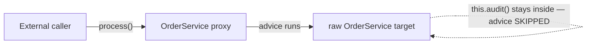

# Asynchronous, Scheduled, and Caching Support

Spring Framework ships three closely related "declarative behavior" features that are all built on the **same AOP/proxy machinery**: asynchronous method execution (`@Async`), scheduled task execution (`@Scheduled`), and declarative caching (`@Cacheable` and friends). Each is switched on with an `@EnableXxx` annotation on a `@Configuration` class, and each works by wrapping your beans in a proxy that adds behavior *around* the target method invocation.

Because all three are proxy-based, they share one crucial limitation that interviewers love to probe: **self-invocation (calling an annotated method from another method of the same class through `this`) bypasses the proxy**, so the async/scheduled/caching behavior does not apply.

> Note on Jakarta: This document targets **Spring Framework 6.x**, which requires **Java 17+** and the **Jakarta EE 9+** namespace (`jakarta.*`). Older Spring 5.x used `javax.*`. The Spring-specific annotations discussed here (`@Async`, `@Scheduled`, `@Cacheable`, etc.) live in the `org.springframework.*` packages regardless of version. Spring also *supports* JSR-based annotations where relevant (e.g. JSR-107 / JCache `@CacheResult`), which use `javax.cache.*`.

---

## Enabling Asynchronous Execution with EnableAsync and Async

`@Async` marks a method (or an entire class) so that each invocation runs in a **separate thread**, returning control to the caller immediately. It is Spring's declarative alternative to manually submitting `Runnable`/`Callable` tasks to an `ExecutorService`.

To activate the feature you must add `@EnableAsync` to a `@Configuration` class. Without it, `@Async` annotations are simply ignored and methods run synchronously on the caller's thread.

```java
@Configuration
@EnableAsync
public class AsyncConfig {
    // optionally implement AsyncConfigurer to customize the executor
}

@Component
public class NotificationService {

    @Async
    public void sendEmail(String to) {
        // runs on a TaskExecutor thread, not the caller's thread
    }
}
```

How it works under the hood:

- `@EnableAsync` imports infrastructure that registers an `AsyncAnnotationBeanPostProcessor`. This post-processor creates an AOP proxy (`AsyncAnnotationAdvisor`) around any bean containing `@Async` methods.
- When you call the method, the proxy intercepts the call and submits the actual invocation to a `TaskExecutor`, then returns immediately.
- The `@Async` annotation can be placed on individual methods, or on a class/interface to make **all** its methods asynchronous.

Requirements and gotchas:

- The bean must be a **Spring-managed bean** and the call must go **through the proxy** (see the self-invocation section).
- Methods annotated with `@Async` should be **public** (with the default JDK/CGLIB proxying); private and package-private methods are not proxied.
- `@Async` **cannot be used together with lifecycle callbacks** such as `@PostConstruct` on the same method (the proxy is not yet fully in place during initialization).

`@EnableAsync` attributes:

| Attribute | Meaning |
|---|---|
| `annotation` | Custom annotation to detect (default: Spring's `@Async` and EJB's `jakarta.ejb.Asynchronous`). |
| `mode` | `PROXY` (default, Spring AOP) or `ASPECTJ` (compile/load-time weaving that also handles self-invocation). |
| `proxyTargetClass` | `true` forces CGLIB (class-based) proxies instead of JDK dynamic (interface) proxies. |
| `order` | Ordering of the async advice in the advisor chain. |

`@Async` also supports a **value** attribute naming a specific executor bean, e.g. `@Async("emailExecutor")`, so different methods can use different thread pools.

### Advanced gotchas senior interviewers probe

- **Executor resolution precedence.** For a given `@Async` invocation the executor is chosen in this order: (1) the `value` qualifier on `@Async`, resolved as a bean name/qualifier; (2) the executor from `AsyncConfigurer.getAsyncExecutor()`; (3) a unique `TaskExecutor` bean or one named `taskExecutor`; (4) the `SimpleAsyncTaskExecutor` fallback. If you supply *two* `AsyncConfigurer` beans Spring throws — there may be at most one. If `@Async("x")` names a non-existent bean, the invocation fails at call time with an exception looking up the executor, not at startup.
- **Return type is validated lazily, per call, not at proxy creation.** An unsupported return type (a plain `String`, an `int`, etc.) produces an `IllegalArgumentException`/`AsyncResultNotSupported`-style failure when the method is actually invoked through the proxy, not necessarily during context refresh. The proxy is still created for the bean.
- **Interaction with `@Transactional`.** `@Async` submits work to another thread, so the transaction/`ThreadLocal`-bound resources of the caller do **not** propagate. An `@Async` method that is also `@Transactional` starts its **own** transaction on the executor thread. Putting `@Transactional` on the caller and expecting the async method to join it is a classic mistake — there is no transaction to join because it runs on a different thread.
- **Initialization ordering.** Because the async proxy is applied by a `BeanPostProcessor`, `@Async` on a bean whose dependencies (or itself) participate in early initialization can behave synchronously if the proxy is not yet in place. `@Async` on a `@PostConstruct` method never runs asynchronously (the method is invoked directly during initialization, before wiring to the proxy is complete for external callers).

---

## Async Return Types void Future and CompletableFuture

The declared return type of an `@Async` method determines how (and whether) the caller can observe the result.

| Return type | Behavior |
|---|---|
| `void` | Fire-and-forget. The caller cannot get a result. Exceptions cannot be propagated to the caller. |
| `Future<T>` | Caller gets a handle; `future.get()` blocks until the result (or exception) is available. |
| `CompletableFuture<T>` | Preferred modern type; supports non-blocking composition (`thenApply`, `thenCompose`, etc.). |
| `ListenableFuture<T>` | Older Spring type with callbacks; **deprecated in Spring 6** in favor of `CompletableFuture`. |

```java
@Async
public CompletableFuture<User> findUser(String id) {
    User u = repository.load(id);
    return CompletableFuture.completedFuture(u); // wrap the already-computed value
}
```

Key points interviewers ask about:

- **Exception handling differs by return type.** For methods returning a `Future`/`CompletableFuture`, an exception thrown inside is captured and re-thrown when the caller calls `get()`. For `void` methods, the caller never sees the exception; instead it is routed to an `AsyncUncaughtExceptionHandler` (configurable via `AsyncConfigurer.getAsyncUncaughtExceptionHandler()`; the default just logs it).
- You return a **completed future** (`CompletableFuture.completedFuture(value)`) even though the method body ran on the async thread — the framework returns a *separate* future to the caller and completes it with your returned value. (Since Spring supports returning a real future, you can also return an in-flight `CompletableFuture`.)
- The return type must be `void` or a supported `Future` subtype; other return types cause an error at proxy time.

### Subtle traps with future-returning async methods

- **Returning `null` from a `Future`-typed `@Async` method.** The method must return a non-null `Future` reference *(the whole point is that the framework has something to hand back and complete)*. Returning `null` yields a `null` from the proxy and a `NullPointerException` for a caller that immediately chains on it. Always return `CompletableFuture.completedFuture(...)`, never `null`.
- **The `AsyncUncaughtExceptionHandler` only fires for `void` methods.** For `Future`/`CompletableFuture` returns the exception is stored in the future and surfaces on `get()` (wrapped in `ExecutionException`) — it is **never** routed to the handler. A common bug is registering a handler and wondering why exceptions from a `CompletableFuture`-returning method never reach it.
- **`Future.cancel(true)` does not interrupt an already-running `@Async` task the way people expect.** Spring wraps the call in a task submitted to the executor; cancellation only prevents a not-yet-started task from running (or requests interruption if the executor honors it). It does not magically abort work already in progress that ignores interruption.
- **Beware wrapping a plain value in an `@Async CompletableFuture` and then `.join()`-ing it on the caller immediately** — that reintroduces blocking and defeats the point; the caller is now synchronously waiting on the async thread.

### Reactive and Kotlin return types

Since Spring 6.x, `@Async` also supports reactive stream return types where the framework subscribes/adapts appropriately, and Kotlin `suspend` functions are supported through coroutine adaptation. These are the modern non-blocking complements to `CompletableFuture` but do not change the proxy/self-invocation rules.

---

## Configuring the TaskExecutor for Async

`@Async` tasks run on a **`TaskExecutor`** (Spring's extension of `java.util.concurrent.Executor`). If you do not configure one explicitly, Spring searches for a suitable executor:

1. A unique `TaskExecutor` bean, or a bean named **`taskExecutor`** of type `Executor`.
2. If none is found, Spring **6+ falls back to a `SimpleAsyncTaskExecutor`** — which by default creates a **new thread per task and does not pool or bound them** (though it can be configured with concurrency limits / virtual threads). This is fine for demos but dangerous in production, so you almost always define your own pool.

To customize the default executor, implement `AsyncConfigurer`:

```java
@Configuration
@EnableAsync
public class AsyncConfig implements AsyncConfigurer {

    @Override
    public Executor getAsyncExecutor() {
        ThreadPoolTaskExecutor executor = new ThreadPoolTaskExecutor();
        executor.setCorePoolSize(4);
        executor.setMaxPoolSize(8);
        executor.setQueueCapacity(100);
        executor.setThreadNamePrefix("async-");
        executor.initialize();
        return executor;
    }

    @Override
    public AsyncUncaughtExceptionHandler getAsyncUncaughtExceptionHandler() {
        return new SimpleAsyncUncaughtExceptionHandler();
    }
}
```

`ThreadPoolTaskExecutor` is the standard pooling executor. Important sizing semantics (they mirror `java.util.concurrent.ThreadPoolExecutor`):

- Threads are created up to **corePoolSize**.
- Additional tasks are **queued** up to **queueCapacity**.
- Only when the queue is full are new threads created up to **maxPoolSize**.
- If both the queue and maxPoolSize are exhausted, the configured `RejectedExecutionHandler` kicks in (default: `AbortPolicy`, which throws `RejectedExecutionException`).

You can route specific methods to named executors with `@Async("beanName")`. As of Spring 6.1, `ThreadPoolTaskExecutor`/`SimpleAsyncTaskExecutor` also support **virtual threads** (`setVirtualThreads(true)` / `Executors.newVirtualThreadPerTaskExecutor()`), which pairs well with `@Async` fire-and-forget or blocking calls.

### Rejection, saturation, and shutdown semantics

- **The saturation trap.** Mental model first: think of a restaurant that hires up to `corePoolSize` **permanent cooks**; extra orders **wait in a queue** (up to `queueCapacity`); only when the waiting area is *physically full* does it call in **temp cooks** up to `maxPoolSize`; and when even the temps are all busy it **turns customers away** (rejection). The counterintuitive part — the queue fills *before* new threads spawn — falls right out of that order. The `corePoolSize → queue → maxPoolSize` ordering means a **large `queueCapacity` effectively caps you at `corePoolSize`**: the pool will not grow to `maxPoolSize` until the queue is full. If you set `corePoolSize=2, maxPoolSize=50, queueCapacity=Integer.MAX_VALUE`, you will never get more than 2 threads — the queue absorbs everything first. This surprises people expecting more parallelism. For burst parallelism, keep the queue small (or zero, using a `SynchronousQueue`-style handoff).
- **`SimpleAsyncTaskExecutor` has no queue at all** (each task gets a fresh thread unless a concurrency limit is configured), so under load it can create unbounded threads — the reason it is unsuitable for production without `setConcurrencyLimit(...)`.
- **Rejection policy.** When queue and `maxPoolSize` are both exhausted the `RejectedExecutionHandler` runs. The default `AbortPolicy` throws `RejectedExecutionException` — on the **caller thread**, synchronously, at submit time. `CallerRunsPolicy` instead runs the task on the caller thread (providing back-pressure but stalling the caller).
- **Graceful shutdown.** `ThreadPoolTaskExecutor` supports `setWaitForTasksToCompleteOnShutdown(true)` and `setAwaitTerminationSeconds(...)`. On context close the executor's `destroy()` shuts the pool down; in-flight `@Async` tasks may be interrupted or awaited depending on this config. Tasks still sitting in the queue can be silently dropped on an abrupt shutdown.
- **`ThreadPoolTaskExecutor` vs raw `ThreadPoolExecutor`.** The Spring class is a `FactoryBean`-friendly, lifecycle-aware wrapper: it must be `initialize()`d (done automatically when Spring manages it as a bean) before use, exposes `TaskDecorator` support (e.g. to propagate `MDC`/`SecurityContext`/request-scope to the worker thread), and integrates with Spring's `Lifecycle`. Context propagation across the thread boundary does **not** happen for free — you need a `TaskDecorator` or a context-propagation library.

---

## Enabling Scheduling with EnableScheduling and Scheduled

`@Scheduled` turns a method into a periodically- or cron-triggered task. Activate it with `@EnableScheduling` on a `@Configuration` class.

```java
@Configuration
@EnableScheduling
public class SchedulingConfig { }

@Component
public class ReportJob {

    @Scheduled(fixedRate = 5000)
    public void poll() { /* runs every 5 seconds */ }
}
```

Constraints on `@Scheduled` methods:

- The method must take **no arguments**.
- The method must return **`void`** (any returned value is ignored; more precisely non-void returns are not observed). Since Spring 6.1, returning a `CompletableFuture`/reactive type is supported for "one-shot" reactive scheduling, but classic scheduled tasks are `void`.
- The method should generally be on a Spring bean, and (like the other features) is invoked through a proxy/registrar, so **self-invocation caveats apply** for triggering.

How it works:

- `@EnableScheduling` registers a `ScheduledAnnotationBeanPostProcessor` that scans beans for `@Scheduled` methods and registers them with a `TaskScheduler`.
- By default all scheduled tasks run on a **single-threaded** scheduler. This means if one task overruns, it delays others. To parallelize, define your own `TaskScheduler` bean (e.g. `ThreadPoolTaskScheduler` with a pool size), or implement `SchedulingConfigurer`.

```java
@Bean
public TaskScheduler taskScheduler() {
    ThreadPoolTaskScheduler scheduler = new ThreadPoolTaskScheduler();
    scheduler.setPoolSize(5);
    scheduler.setThreadNamePrefix("sched-");
    return scheduler;
}
```

`@Scheduled` and `@Async` are orthogonal but composable: annotating a method with both makes each scheduled trigger run on the async executor rather than blocking the scheduler thread.

### Registration internals and lifecycle

- **When registration happens.** `ScheduledAnnotationBeanPostProcessor` (SABPP) collects `@Scheduled` methods during bean post-processing but registers the actual triggers on the `TaskScheduler` only after the `ContextRefreshedEvent`, i.e. once the whole context is up. This is why a task never fires "half-initialized" and why the scheduler is looked up lazily — you can define the `TaskScheduler` bean anywhere in the context.
- **Scheduler resolution.** If exactly one `TaskScheduler` bean exists it is used; if multiple exist, SABPP falls back to one named `taskScheduler`, else it creates a single-threaded default. Spring 6.1 added the `scheduler` qualifier on `@Scheduled` itself to pick a specific scheduler per method. Ambiguity (multiple `TaskScheduler` beans, none named `taskScheduler`, no qualifier) throws at startup.
- **Repeatable `@Scheduled` and overlap.** `@Scheduled` is repeatable. Multiple declarations on one method each register an **independent** trigger, so they can overlap or run back-to-back even on a single-thread scheduler if their fire times coincide.
- **`@Scheduled` methods run on the scheduler thread by default**, so an exception thrown by a scheduled method does not stop future executions (it is logged and swallowed by the trigger's error handler) but a long-running one blocks the single scheduler thread.
- **`SimpleAsyncTaskScheduler` (Spring 6.1)** fires each execution on a new (optionally virtual) thread from a single scheduler thread — great for `fixedRate`/`cron`, but fixed-delay tasks are forced onto the single scheduler thread (delay semantics require waiting for completion). Hence the guidance: with virtual threads, prefer `fixedRate`/`cron` over `fixedDelay`.
- **Programmatic registration.** Implement `SchedulingConfigurer` and use the `ScheduledTaskRegistrar` to register tasks with dynamic triggers (e.g. a `Trigger` whose next execution is computed from data, or a `cron` string resolved at runtime) — something the static annotation cannot express.

### Distributed scheduling — the multi-instance gotcha

`@Scheduled` is **per-JVM with no leader election**: every instance runs its own `TaskScheduler` and fires the trigger independently. That is invisible on a single node but bites hard the moment you scale horizontally.

Concrete trace: you deploy `@Scheduled(cron = "0 0 0 1 * *") void sendMonthlyInvoices()` and run **3 replicas** behind a load balancer. At midnight on the 1st, all 3 schedulers fire the same method → **3 invoice runs** → every customer is billed three times. Nothing in Spring coordinates them; the annotation has no notion of "cluster."

Mitigations (this is a reliable interviewer follow-up — *"how do you make a scheduled job run exactly once across a cluster?"*):

- **Shared lock (ShedLock / Spring Integration `LockRegistry`)** — each instance tries to grab a lock (row in a DB, Redis key) named for the task before running; the loser skips. Simplest bolt-on for existing `@Scheduled` code.
- **Clustered scheduler (Quartz in clustered mode with a JDBC job store)** — the scheduler itself elects one node per trigger via the shared DB.
- **Externalize the trigger** — a single external scheduler (Kubernetes `CronJob`, EventBridge, a cron pod) publishes a message/HTTP call; app instances only *react* to the one event, so fan-out never happens.

### The double-initialization pitfall

Do not put `@Scheduled` on a class that is also instantiated outside the container (e.g. via `@Configurable` load-time weaving *and* registered as a bean), or register the same `@Scheduled` bean twice — each live instance registers its own triggers, so the method fires **multiple times per interval**. Prototype-scoped `@Scheduled` beans are also a smell: every created instance schedules itself.

---

## fixedRate vs fixedDelay vs cron

`@Scheduled` supports three mutually informative trigger strategies. You configure exactly one primary trigger per annotation.

| Attribute | Timing anchor | Behavior |
|---|---|---|
| `fixedRate` | **Start** of previous execution | Next run scheduled `rate` ms after the *previous run began*. Runs at a fixed frequency regardless of how long each execution takes (a single-threaded scheduler will still serialize overlapping runs). |
| `fixedDelay` | **End** of previous execution | Next run scheduled `delay` ms after the *previous run finished*. Guarantees a gap between executions. |
| `cron` | Wall-clock calendar | Fires at times matching a cron expression; supports complex calendar schedules and time zones. |
| `initialDelay` | (modifier) | Delay before the *first* execution; combined with `fixedRate`/`fixedDelay`. |

```java
@Scheduled(fixedRate = 5000)                 // every 5s from each start
@Scheduled(fixedDelay = 5000)                // 5s after each finish
@Scheduled(fixedRate = 5000, initialDelay = 10000) // wait 10s, then every 5s
@Scheduled(cron = "0 0 9 * * MON-FRI")       // 09:00 on weekdays
@Scheduled(cron = "0 15 10 * * ?", zone = "America/New_York")
```

**fixedRate vs fixedDelay — the classic question.** If a task takes 7s and `fixedRate = 5000`: with a single-threaded scheduler, since the previous execution hasn't finished when the next is due, the next run starts immediately after (they can't overlap on one thread), so effectively back-to-back. With `fixedDelay = 5000`, the next run always starts 5s *after* the prior run completes, so total cycle ≈ 12s. Rate targets throughput/frequency; delay targets spacing.

Spring's **cron format has 6 fields** (unlike the classic Unix 5-field crontab): `second minute hour day-of-month month day-of-week`.

```
 ┌───────── second (0-59)
 │ ┌─────── minute (0-59)
 │ │ ┌───── hour (0-23)
 │ │ │ ┌─── day-of-month (1-31)
 │ │ │ │ ┌─ month (1-12 or JAN-DEC)
 │ │ │ │ │ ┌ day-of-week (0-7 or SUN-SAT; 0 and 7 = Sunday)
 * * * * * *
```

Special values: `*` (any), `?` (no specific value, for day-of-month/day-of-week), `/` (increments, e.g. `0/15`), `-` (ranges), `,` (lists), plus macros like `@hourly`, `@daily` (aka `@midnight`), `@weekly`, `@monthly`, and `@yearly` (aka `@annually`). Note Spring does **not** support the Unix `@reboot` macro. Since Spring 5.3 you can also disable a task with `cron = "-"` (Scheduled.CRON_DISABLED). The values can be supplied via property placeholders / SpEL, e.g. `fixedRateString = "${poll.rate}"` or `cron = "${report.cron}"`.

### fixedRate deep internals — the overlap and "catch-up" traps

- **fixedRate is measured from the *scheduled* (planned) time, not the actual start.** The scheduler computes fire times as `t0, t0+rate, t0+2·rate, …` up front. If execution *N* overruns its slot, the trap depends on the scheduler's thread count:
  - **Single-threaded scheduler (default):** the next fire cannot start until the current one finishes; missed fires **bunch up** and run back-to-back with no gap — they do *not* run concurrently.
  - **Multi-threaded scheduler:** a long `fixedRate` execution can **overlap** with the next one, because a different pool thread picks up the on-schedule fire while the previous is still running. This is a real concurrency hazard people forget: `fixedRate` + pooled scheduler = potential concurrent executions of the same method.
- **`fixedDelay` never overlaps by construction** — the next start is anchored to the previous *completion*, so there is always exactly one execution in flight regardless of pool size.
- **`initialDelay` requires a `fixedRate`/`fixedDelay`** companion (or `initialDelayString`); it is meaningless with `cron` (a cron trigger has no "first delay" concept — it fires at the next matching wall-clock time).
- **Time unit.** Numeric `fixedRate`/`fixedDelay`/`initialDelay` are milliseconds unless `timeUnit` (since 5.3.10) overrides it. The `*String` variants also accept ISO-8601 `Duration` syntax (`"PT5S"`), in which case `timeUnit` is ignored.

### Cron edge cases

- **day-of-month and day-of-week are AND-combined when both are restricted** — a deliberate Spring deviation from Unix/Vixie crontab (which OR-combines them). Spring's `CronExpression` fires only when *both* day constraints are satisfied. Contrast the two behaviors side by side for `0 0 0 13 * FRI`:

- **Unix/Vixie cron (OR):** fires on **every 13th of the month AND on every Friday** — roughly 12 + 52 ≈ 60 firings a year.
- **Spring (AND):** fires **only when the 13th of the month happens to be a Friday** — a "Friday the 13th" schedule, which in 2026 hits only **February, March, and November** (3 firings that year).

That is a ~20x difference in how often the job runs. This surprises people who expect Unix-style OR — a subtle source of "why didn't it fire on the day I expected" bugs. Use `?` in one field to mean "no specific value" and disable that constraint.
- **DST transitions**: with a `zone`, Spring's `CronExpression` computes fire times in that zone. A daily job at `02:30` may be skipped or run once around a spring-forward/fall-back transition; wall-clock cron does not "make up" a skipped time.
- Spring cron does not support seconds-less 5-field Unix expressions — a 5-field string is invalid; you must supply all six fields (or a macro).

---

## Enabling Caching with EnableCaching Cacheable CacheEvict and CachePut

Declarative caching lets Spring transparently store a method's return value keyed by its arguments, so repeat calls with the same arguments skip the method body and return the cached value. Enable it with `@EnableCaching`.

```java
@Configuration
@EnableCaching
public class CacheConfig {
    @Bean
    public CacheManager cacheManager() {
        return new ConcurrentMapCacheManager("books");
    }
}
```

The three core annotations:

| Annotation | When the method body runs | Effect on cache |
|---|---|---|
| `@Cacheable` | **Only on a cache miss.** On a hit, the cached value is returned and the method is skipped. | Populates the cache with the return value on a miss. |
| `@CachePut` | **Always** (every invocation). | Stores/updates the cache with the fresh return value. Use to refresh an entry. |
| `@CacheEvict` | Always (normally). | Removes one entry, or with `allEntries = true`, clears the whole cache region. |

```java
@Cacheable("books")
public Book findBook(String isbn) { /* slow lookup */ }

@CachePut(value = "books", key = "#book.isbn")
public Book updateBook(Book book) { return repository.save(book); }

@CacheEvict(value = "books", key = "#isbn")
public void deleteBook(String isbn) { repository.delete(isbn); }

@CacheEvict(value = "books", allEntries = true)
public void reloadCatalog() { }
```

Important attributes and behaviors:

- **`key`** — SpEL expression for the cache key (default: all method parameters via `SimpleKeyGenerator`; a single param becomes the key directly, multiple params form a `SimpleKey`). You can reference args (`#isbn`, `#p0`), the result (`#result`, for `@CachePut`/conditional evict), etc.
- **`condition`** — SpEL evaluated *before* invocation; caching only applies if true.
- **`unless`** — SpEL evaluated *after* invocation (can use `#result`); vetoes caching if true. Classic use: `unless = "#result == null"`.
- **`sync = true`** (on `@Cacheable`) — serializes concurrent misses for the same key so the method runs once (prevents cache stampede).
- **`beforeInvocation`** (on `@CacheEvict`) — if `true`, evict *before* the method runs (so eviction happens even if the method throws); default `false` evicts *after* successful return.
- **`@Caching`** groups multiple cache annotations on one method; **`@CacheConfig`** sets class-level defaults (cache names, key generator, cache manager).

`@Cacheable` vs `@CachePut`: never put both on the same method — `@Cacheable` skips execution on a hit while `@CachePut` always executes, so their behaviors conflict.

Spring also supports the **JSR-107 (JCache) annotations** (`@CacheResult`, `@CachePut`, `@CacheRemove`, `@CacheRemoveAll` from `javax.cache.annotation`) when a JCache provider and the corresponding config are present.

### Worked example: a miss, then a hit (and what the key actually is)

Take `@Cacheable("books") Book findBook(String isbn)` backed by the `ConcurrentMapCacheManager("books")` above, and trace two calls.

**Call 1 — `findBook("111")`:**

1. **Compute the key.** `SimpleKeyGenerator` sees exactly one argument, so the key is *the argument itself* — the `String` `"111"`, **not** a `SimpleKey` wrapper. (Zero args → `SimpleKey.EMPTY`; two-plus args → a `SimpleKey`.)
2. **Look up.** The proxy calls `cache("books").get("111")` → returns `null` → **MISS**.
3. **Run the body.** The slow lookup executes and returns, say, `Book("111", "Dune")`.
4. **Store.** The proxy calls `cache("books").put("111", Book("111","Dune"))`. The `"books"` cache now holds one entry:

   ```
   books:  { "111" -> Book("111","Dune") }
   ```

**Call 2 — `findBook("111")` again:**

1. Key = `"111"` (same rule).
2. `cache("books").get("111")` → returns the stored `Book` → **HIT**.
3. **The method body is skipped entirely** — the cached `Book("111","Dune")` is returned directly. No slow lookup runs.

**Now add a second argument** — `@Cacheable("books") Book findBook(String isbn, String lang)`:

- `findBook("111", "en")` → two args → key = `SimpleKey["111", "en"]` (both args wrapped).
- Because the wrapper differs from the bare `"111"` key, `findBook("111","en")` and the earlier single-arg `findBook("111")` land on **different cache entries** — even in the same `"books"` cache. This is exactly why overloads/refactors that change the argument list silently invalidate old cached entries, and why people pin the key explicitly with `key = "#isbn"` when only the ISBN should matter.

> [!TIP]
> The single-arg-becomes-the-key rule means the argument's own `equals`/`hashCode` *are* the cache key. Keying on a mutable object and then mutating it after the `put` leaves the entry stranded — the new object no longer hashes to the stored key. Prefer keying on an immutable id (`key = "#book.isbn"`).

### SpEL evaluation context for keys, condition, and unless

The root object exposes: `#root.methodName`, `#root.method`, `#root.target`, `#root.targetClass`, `#root.args` (object array), and `#root.caches` (the `Cache` instances for this operation). Arguments are referenced by name (`#isbn`) when compiled with `-parameters`, else by index (`#a0`/`#p0`). Crucial timing distinction:

- **`condition`** and the `key` for `@Cacheable`/`@CacheEvict` are evaluated **before** the method runs, so `#result` is **not** available there.
- **`unless`**, and the `key` of `@CachePut` or a `@CacheEvict(beforeInvocation=false)`, are evaluated **after**, where `#result` refers to the return value. For wrapper types like `Optional`/`CompletableFuture`, `#result` is the **unwrapped** value, not the wrapper (e.g. `unless = "#result?.hardback"` on a method returning `Optional<Book>`).

### sync = true — the exact documented limitations (favourite expert trap)

Per the `@Cacheable` Javadoc, turning on `sync` imposes three hard restrictions, and violating them throws at startup:

1. **`unless()` is not supported** (only `condition` is honored — because with a locked combined get-or-compute there is no post-hoc veto point).
2. **Exactly one cache may be specified** (you cannot list multiple `cacheNames`).
3. **It cannot be combined with other cache operations** (e.g. via `@Caching`).

Semantically, `sync=true` turns the operation into a single atomic *get-or-compute* callback against the provider (`Cache.get(key, valueLoader)`), rather than the default independent get-then-put. So if the combined access fails there is no separate put retry, and a `CacheErrorHandler` that suppresses get errors cannot fall back to a put. It is also only a **hint** — a provider that lacks atomic compute may not truly serialize.

### Failure semantics and error handling

- **Exception during a cache miss:** if the `@Cacheable` method throws while computing a missing value, **nothing is stored** — the exception propagates to the caller and the cache is left without an entry (next call retries). There is no negative/exception caching by default.
- **`@CacheEvict(beforeInvocation=false)` (the default) does not evict if the method throws** — the entry survives the failure. Use `beforeInvocation=true` to evict regardless of outcome (important for delete-then-fail scenarios where you must not serve stale data).
- **`CacheErrorHandler`** (configured via `CachingConfigurer`) governs what happens when the *cache backend itself* fails (e.g. Redis is down): by default `SimpleCacheErrorHandler` rethrows, which can turn a cache outage into an application outage. A custom handler can log-and-continue so the method still runs against the source of truth.

### Concurrency and consistency caveats

- **`@Cacheable` without `sync=true` gives no atomicity** across the get/compute/put window — N concurrent misses on the same key all run the method (cache stampede) and all put. `sync=true` (or a provider-level lock) is the fix.
- **`@CachePut` + `@Cacheable` on different methods for the same key can race**: there is no ordering guarantee between a put from one method and a concurrent read-through from another.
- **`allEntries=true` eviction is not transactional** — if two callers evict-all and repopulate concurrently, interleavings can leave stale entries; caching operations are **not** tied to the surrounding transaction unless you register a transaction-aware wrapper.

### Transaction-aware caching

By default cache writes/evictions happen **immediately at method boundaries**, *not* at transaction commit. If a `@Transactional @CacheEvict` method rolls back, the eviction has already happened (data was removed from cache but the DB change was undone → inconsistency). To defer cache operations until after a successful commit, wrap your `CacheManager` in a `TransactionAwareCacheManagerProxy` (or set the transaction-aware flag on managers that support it), which registers cache mutations as transaction synchronizations.

---

## The CacheManager Abstraction

Spring's caching is a **thin abstraction over a caching backend**, not a cache implementation itself. Two SPIs form the abstraction:

- **`org.springframework.cache.CacheManager`** — a registry that returns named `Cache` instances via `getCache(String name)`.
- **`org.springframework.cache.Cache`** — a store with `get`, `put`, `evict`, `clear`, etc., keyed by arbitrary objects.

You must provide a `CacheManager` bean; `@EnableCaching` does **not** create one for you (this is a common Spring-vs-Spring-Boot distinction — Spring Boot auto-configures a `CacheManager`, plain Spring Framework does not).

Common `CacheManager` implementations shipped or integrated:

| CacheManager | Backend |
|---|---|
| `ConcurrentMapCacheManager` | Simple in-JVM `ConcurrentHashMap` (good for tests/dev; unbounded). |
| `SimpleCacheManager` | Wraps a set of `Cache` instances you supply manually. |
| `CaffeineCacheManager` | Caffeine (high-performance in-JVM, eviction/expiry). |
| `JCacheCacheManager` | Any JSR-107 provider (EhCache 3, etc.). |
| `RedisCacheManager` | Redis (from Spring Data Redis) — distributed. |
| `CompositeCacheManager` | Chains multiple managers. |
| `NoOpCacheManager` | Disables caching (always misses) — useful to toggle caching off. |

Notes:

- The abstraction **does not do serialization, TTL, or eviction itself** — those are backend concerns. `ConcurrentMapCacheManager` has no TTL/size limits; if you need expiry, use Caffeine, Redis, or a JCache provider.
- You can select among multiple cache managers per-annotation with `cacheManager = "..."` or via a `CacheResolver`.
- The abstraction stores `null` values by default (unless `allowNullValues = false`), so a cached `null` counts as a hit.

### CacheResolver, cacheManager, and key generation precedence

- **`cacheManager` and `cacheResolver` are mutually exclusive**; specifying both throws. `cacheManager` is sugar — behind the scenes a `SimpleCacheResolver` is built around it. Use a full `CacheResolver` when the target cache must be chosen **at runtime** from the invocation context.
- **`key` and `keyGenerator` are likewise mutually exclusive.** Default key generation uses `SimpleKeyGenerator`: zero args → `SimpleKey.EMPTY`; one arg → that arg *itself* (so the key equals the argument, meaning the argument's `equals`/`hashCode` matter); multiple args → a `SimpleKey` wrapping all of them. If you key on a single mutable object, mutating it after put makes the entry unreachable.
- **`@CacheConfig`** sets class-level defaults (cacheNames, keyGenerator, cacheManager, cacheResolver) that individual method annotations can override — reducing repetition but occasionally causing "why is it using that cache manager?" surprises.

### allowNullValues and the store-null gotcha

Certain backends cannot store `null` (e.g. some Redis configurations). With `allowNullValues=true` (default), Spring wraps values so `null` is representable and counts as a hit; if you switch a `CacheManager` to `allowNullValues=false`, a method that returns `null` on a miss will **re-execute every time** (the null is never cached), and attempting to store null may throw depending on the manager. This is why `unless = "#result == null"` is often used to *intentionally* skip caching nulls regardless of the manager setting.

---

## Proxy AOP Basis and the Self-Invocation Caveat

All three features — `@Async`, `@Scheduled`-triggered advice for caching/async on scheduled methods, and `@Cacheable`/`@CacheEvict`/`@CachePut` — are implemented with **Spring AOP proxies** by default. Understanding the proxy model explains most of their "why didn't it work?" behaviors.

How the proxy works:

- When a bean has async/caching (or transactional) annotations, Spring wraps it in a proxy — a **JDK dynamic proxy** if the bean implements an interface, or a **CGLIB** subclass proxy otherwise (force CGLIB with `proxyTargetClass = true`).
- Other beans get the *proxy* injected, not the raw target. Calls made **through the proxy** trigger the surrounding advice (submit to executor / consult cache / manage transaction), then delegate to the real method.

### The self-invocation caveat (the #1 interview trap)

If a method inside the same class calls another annotated method via `this.method()`, the call **does not pass through the proxy** — it goes straight to the target instance. Therefore the advice never runs: `@Async` runs synchronously on the caller thread, `@Cacheable` neither reads nor writes the cache, `@CacheEvict` does not evict.

```java
@Service
public class OrderService {

    public void process() {
        // BUG: internal 'this' call bypasses the proxy — NOT async, NOT cached
        this.audit();
    }

    @Async
    public void audit() { /* intended to be async */ }
}
```

Why: the proxy wraps the object from the *outside*. Once execution is inside the target object, `this` is the raw target, which has no notion of the advice.



Read it as: the external call to `process()` crosses the proxy boundary (advice would run if `process` were advised), but the `this.audit()` call loops back *within* the raw target and never re-crosses the proxy — so `@Async` on `audit()` is silently ignored.

Ways to make self-invocation work (or avoid the problem):

1. **Refactor** the annotated method into a *separate bean* and inject it, so the call crosses a proxy boundary (recommended, cleanest).
2. **Self-injection**: inject the bean into itself (or use `ApplicationContext.getBean`) and call through that reference.
3. Use **`AopContext.currentProxy()`** and cast (requires `exposeProxy = true`); ties code to Spring AOP, generally discouraged.
4. Switch **`mode = ASPECTJ`** (load-time or compile-time weaving). AspectJ weaves the advice into the bytecode of the class itself, so even internal `this` calls are intercepted. This is the only mode that truly handles self-invocation.

Other proxy-related consequences shared by all three:

- Annotations on **private / final / static** methods are not advised by the default proxy mechanisms (CGLIB cannot subclass final classes/methods; JDK proxies only see interface methods). Effective methods should be `public` and non-final.
- The behavior only applies to **Spring-managed beans**; `new`-ing the object yourself gives you no proxy.

### Advisor ordering when multiple aspects stack

When a method carries several proxy-based concerns — e.g. `@Transactional` + `@Cacheable`, or `@Async` + `@Transactional` — the **order of the advisors** decides the observable behavior, and interviewers probe this:

- **Caching vs transactions.** If the cache advisor runs *outside* the transaction advisor, a cache hit short-circuits before any transaction begins (fast, no DB connection acquired). If the transaction advisor is outer, a transaction is opened even on a cache hit. Spring's default ordering places the cache interceptor at a low-precedence order, so typically caching wraps outside transactions — but this is tunable via the `order` attribute on the `@EnableXxx` annotations.
- **`@Async` is special.** Because `@Async` hands the call to another thread, whatever advice is *inside* the async advisor (closer to the target) runs on the **executor thread**, and whatever is *outside* runs on the **caller thread**. Ordering `@Async` outermost means a `@Transactional` inside it opens its transaction on the worker thread (usually what you want). Getting this backwards is a source of "my transaction spans the wrong thread" bugs.
- Each feature exposes an `order` attribute (`@EnableAsync(order=...)`, `@EnableCaching(order=...)`, plus `@EnableTransactionManagement(order=...)`) to place its advisor in the chain. Lower value = higher precedence = outer.

### Why proxies still exist on self-invoked beans

The bean *is* wrapped in a proxy, and external callers hit the advice correctly. Self-invocation fails not because the proxy is missing but because, once control is inside the target instance, `this` is the raw (unproxied) object. `AopContext.currentProxy()` (with `exposeProxy=true`) works precisely because it retrieves the *outer proxy* from a thread-local set up by the proxy on entry — letting you re-enter through the advice deliberately.

---

## Common follow-up questions

- **Why is my `@Async`/`@Cacheable` method running synchronously / not caching?** Almost always self-invocation (internal `this` call), a missing `@EnableAsync`/`@EnableCaching`, a non-public method, or the object not being a Spring bean.
- **What's the difference between `fixedRate` and `fixedDelay`?** Rate measures from the *start* of the previous run (fixed frequency); delay measures from the *end* (fixed gap between runs).
- **Does `@EnableCaching` give me a cache?** No — you must define a `CacheManager` bean in plain Spring. Spring Boot auto-configures one; the Spring Framework does not.
- **How do I handle exceptions from a `void @Async` method?** They never reach the caller; register an `AsyncUncaughtExceptionHandler`. For `Future`-returning methods the exception surfaces on `get()`.
- **Why does the default scheduler serialize my tasks?** The default `TaskScheduler` is single-threaded; supply a `ThreadPoolTaskScheduler` with a larger pool.
- **`@Cacheable` vs `@CachePut`?** `@Cacheable` skips the method on a hit; `@CachePut` always runs the method and updates the cache. Don't combine them on one method.
- **How do I avoid a cache stampede on a hot key?** Use `@Cacheable(sync = true)`.
- **JDK dynamic proxy vs CGLIB — which does Spring use?** Interface present → JDK dynamic proxy; no interface (or `proxyTargetClass = true`) → CGLIB subclass proxy.
- **Difference from Spring Boot?** Spring Boot adds auto-configuration (default executor, cache manager detection via `spring.cache.*`, starters). Core Spring Framework requires you to enable and configure everything explicitly.

## References

- Spring Framework Reference — Integration, "Task Execution and Scheduling": https://docs.spring.io/spring-framework/reference/integration/scheduling.html
- Spring Framework Reference — "Cache Abstraction": https://docs.spring.io/spring-framework/reference/integration/cache.html
- `@Async` / `@EnableAsync` Javadoc: https://docs.spring.io/spring-framework/docs/current/javadoc-api/org/springframework/scheduling/annotation/Async.html
- `@Scheduled` Javadoc (trigger attributes and cron syntax): https://docs.spring.io/spring-framework/docs/current/javadoc-api/org/springframework/scheduling/annotation/Scheduled.html
- `CronExpression` Javadoc (6-field syntax, macros): https://docs.spring.io/spring-framework/docs/current/javadoc-api/org/springframework/scheduling/support/CronExpression.html
- `CacheManager` / `Cache` SPI Javadoc: https://docs.spring.io/spring-framework/docs/current/javadoc-api/org/springframework/cache/CacheManager.html
- Spring AOP proxying mechanisms and self-invocation: https://docs.spring.io/spring-framework/reference/core/aop/proxying.html
