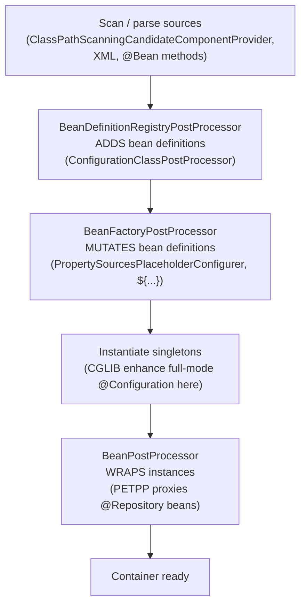

# Bean Definition and Stereotype Annotations

Spring's core job is to manage the lifecycle and wiring of objects it calls **beans**. Before Spring can inject or manage anything, it needs a **bean definition** — metadata describing how to create a bean (its class, scope, constructor arguments, autowiring mode, lazy flag, etc.). Bean definitions can come from three sources: XML `<bean>` elements, `@Bean` factory methods inside `@Configuration` classes, or classpath scanning that detects **stereotype annotations** such as `@Component`, `@Service`, `@Repository`, and `@Controller`.

This note covers how those definitions are created and detected, how the stereotype annotations differ, when to use `@Bean` versus `@Component`, how component scanning works, the meta-annotation mechanism that ties it all together, and how the three configuration styles compare.

> Terminology note: Spring Framework 6.x (used by Spring Boot 3.x) migrated from the `javax.*` namespace to `jakarta.*`. So `@ManagedBean`/`@Named`/`@Inject` come from `jakarta.annotation` / `jakarta.inject` on Spring 6, and from `javax.*` on Spring 5. The Spring-native annotations (`@Component`, `@Bean`, etc.) live in `org.springframework.*` and are unaffected.

---

## Stereotype annotations overview

A **stereotype annotation** marks a class as a Spring-managed component so that classpath scanning will detect it and register a bean definition automatically. The four core stereotypes are:

| Annotation | Package | Intended layer / role |
|---|---|---|
| `@Component` | `org.springframework.stereotype` | Generic Spring-managed component (the base stereotype) |
| `@Service` | `org.springframework.stereotype` | Service layer / business logic |
| `@Repository` | `org.springframework.stereotype` | Persistence layer (DAO); adds exception translation |
| `@Controller` | `org.springframework.stereotype` | Web presentation layer (Spring MVC) |

```java
@Component
public class AuditTrail { }

@Service
public class OrderService { }

@Repository
public class JpaOrderRepository { }

@Controller
public class OrderController { }
```

Key facts:

- `@Component` is the **base/generic** stereotype. `@Service`, `@Repository`, and `@Controller` are all **meta-annotated with `@Component`** — they are specializations of it. That is why the same component scanner picks up all four.
- Functionally, for pure bean registration, the four are **almost identical**: any of them causes a bean to be created and registered. The differences are (a) semantic/documentation intent, (b) `@Repository`'s automatic persistence-exception translation, (c) `@Controller` (and `@RestController`) being recognized by Spring MVC's handler mapping, and (d) they serve as **pointcut targets** and stereotype markers for tooling/AOP.
- All four accept an optional `value` that sets the **bean name**, e.g. `@Service("orderService")`. Without it, the default bean name is the **uncapitalized simple class name** (`OrderService` → `orderService`), generated by `AnnotationBeanNameGenerator`.

**Gotcha — the "specializations are identical" myth.** At the raw `BeanDefinition` level the four stereotypes really are interchangeable for registration, but the differences are load-bearing in ways that bite seniors: (a) `@Repository` is the *only* one that triggers PETPP proxying; (b) `@Controller`/`@RestController` are the *only* ones scanned by MVC's `RequestMappingHandlerMapping`; (c) `@Transactional` semantics are unaffected by stereotype choice (transactions are driven by `@Transactional`, not by `@Service`); and (d) AOP pointcuts written against `@within(...Repository)` will silently stop matching if someone "refactors" a DAO to `@Component`. So swapping stereotypes is *not* always behavior-preserving.

**Uncapitalization is not a blind `toLowerCase` of the first char.** `AnnotationBeanNameGenerator` delegates to `java.beans.Introspector.decapitalize`. The special rule: if the first *two* characters are both uppercase (e.g. an acronym like `URLParser` or `PDFService`), the name is left **unchanged** — `URLParser` → `URLParser`, not `uRLParser`. This trips people who then `@Qualifier("uRLParser")` and get a `NoSuchBeanDefinitionException`.

**Why use the specialized stereotypes instead of plain `@Component`?**

1. **Readability / intent** — the annotation documents the architectural role of the class.
2. **`@Repository` gives you free exception translation** (see next section).
3. **`@Controller` is required** for Spring MVC to treat the class as a web handler; a plain `@Component` with `@RequestMapping` methods is *not* mapped by `RequestMappingHandlerMapping` by default.
4. **AOP pointcuts and tooling** — you can write pointcuts like `@within(org.springframework.stereotype.Service)` or apply cross-cutting concerns per layer.

`@RestController` = `@Controller` + `@ResponseBody` (a composed annotation). `@Configuration` is itself meta-annotated with `@Component`, so configuration classes are also scanned as components.

---

## Repository and exception translation

`@Repository` is special beyond being a marker: when combined with a `PersistenceExceptionTranslationPostProcessor` (PETPP) bean, Spring **automatically translates native persistence exceptions into Spring's consistent `DataAccessException` hierarchy**.

Why this matters: JPA throws `jakarta.persistence.PersistenceException`, JDBC throws `java.sql.SQLException`, Hibernate throws `HibernateException`, etc. These are technology-specific and often checked or vendor-coded. Spring's `DataAccessException` is a **runtime, unchecked, technology-agnostic** hierarchy (e.g. `DataIntegrityViolationException`, `DuplicateKeyException`, `OptimisticLockingFailureException`), so your service layer can catch meaningful exceptions without coupling to a specific persistence API.

> [!TIP]
> **Vocabulary for this section (the machinery behind the gotcha below).** An **AOP proxy** ("Aspect-Oriented Programming" proxy) is a stand-in object Spring places in front of your real bean: callers hold the proxy, and the proxy runs extra logic (here, exception translation) *before/after* delegating to the real bean — which is exactly why a call that never passes through the proxy gets none of that logic. A **bean post-processor** is a hook Spring invokes on every bean instance right after construction; it is where a bean can be transparently swapped for such a proxy. An **advisor** bundles the extra logic (the *advice*) together with a **pointcut** — a predicate that selects *which* methods the advice applies to.

How it works:

- The `PersistenceExceptionTranslationPostProcessor` is a **bean post-processor** that scans for beans annotated with `@Repository` and wraps them in an AOP proxy.
- The proxy applies a `PersistenceExceptionTranslationAdvisor`; when a method throws, the advisor consults registered `PersistenceExceptionTranslator` beans (e.g. `HibernateExceptionTranslator`, JPA `EntityManagerFactory`) to convert the native exception into a `DataAccessException`.
- Translation only happens on beans marked `@Repository` — that is the specific behavioral difference from `@Component`.

```java
@Repository
public class JdbcOrderRepository {
    // A thrown SQLException-backed exception is translated to a
    // Spring DataAccessException by the PETPP proxy.
}
```

Notes:
- In plain Spring, you must register `PersistenceExceptionTranslationPostProcessor` (Spring Boot registers it automatically when a JPA/JDBC starter is present). Without the PETPP, `@Repository` still registers the bean but no translation occurs.
- Spring Data repositories (interfaces extending `Repository`/`CrudRepository`) get exception translation too; the generated proxy is treated as a repository.

**Where the translation actually happens (and the classic gotcha).** Translation is applied by an AOP *proxy* wrapping the `@Repository` bean. That means it only works on calls that go **through the proxy** — external callers invoking public methods of the injected bean. A `this.someOtherMethod()` self-invocation inside the repository does **not** re-enter the proxy, so a native exception thrown from a self-invoked method escapes untranslated. Also, the advisor only translates exceptions that a registered `PersistenceExceptionTranslator` recognizes; if no translator maps the specific exception, `translateExceptionIfPossible` returns `null` and the **original exception is rethrown unchanged** rather than being wrapped in a generic `DataAccessException`.

**Ordering / registration subtlety.** `PersistenceExceptionTranslationPostProcessor` is a `BeanPostProcessor`, so it can only proxy beans created *after* it is itself instantiated and registered. If a `@Repository` is (directly or transitively) required to construct the PETPP or another `BeanPostProcessor`, it may be created "too early," logged with a `BeanPostProcessorChecker` warning ("is not eligible for getting processed by all BeanPostProcessors"), and end up **without** the translation proxy. This is a real failure mode when repositories are pulled into infrastructure beans.

**`@Repository` proxy type.** Because the target usually implements a DAO interface only incidentally (or none), Spring's proxying decision follows the usual rules: JDK dynamic proxy if it exposes interfaces, CGLIB otherwise (or when `proxyTargetClass=true`). A CGLIB-proxied repository is a subclass, so `final` methods will not be advised.

---

## Component versus Bean

`@Component` (and its stereotypes) and `@Bean` are the two primary ways to define a bean, but they answer different questions: **who owns the class** and **who instantiates it**.

| Aspect | `@Component` (stereotype) | `@Bean` |
|---|---|---|
| Where applied | On the **class** itself | On a **method** (usually inside `@Configuration`) |
| Who instantiates | Spring, via the class constructor (reflection) | **Your code** — the method body returns the instance |
| Discovery | Classpath **component scanning** | Explicitly declared method; scanned as part of the config class |
| Best for | Classes **you own** and can annotate | **Third-party / legacy** classes you cannot annotate |
| Number of beans per source | One bean per class | One bean per method; a config class can declare many |
| Fine-grained construction | Limited (constructor + field/setter injection) | Full control: call constructors, setters, builders, conditionals |
| Bean name default | Uncapitalized class name | The **method name** |

```java
// @Component: Spring instantiates OrderService for you
@Service
public class OrderService {
    public OrderService(OrderRepository repo) { ... }
}

// @Bean: YOU instantiate a third-party class Spring can't scan
@Configuration
public class AppConfig {
    @Bean
    public ObjectMapper objectMapper() {          // bean name = "objectMapper"
        ObjectMapper m = new ObjectMapper();
        m.registerModule(new JavaTimeModule());   // custom construction logic
        return m;
    }
}
```

Rules of thumb:
- Use **`@Component`/stereotypes** for your own application classes — less boilerplate, autowiring by constructor.
- Use **`@Bean`** when you need programmatic construction, or the type comes from a library (e.g. `DataSource`, `RestTemplate`, `ObjectMapper`) where you can't add an annotation.
- You **cannot** put `@Component` on a third-party class you don't control; `@Bean` is the escape hatch.
- `@Bean` methods can declare parameters — Spring supplies those as dependencies (autowired by type from the container).

**Return type matters for what the container "sees."** For a `@Bean` method, Spring registers the bean's type as the method's **declared return type**, not the runtime type of the returned object (until the bean is actually instantiated). Declaring `@Bean public DataSource ds()` while returning a `HikariDataSource` means type-based lookups for `HikariDataSource` may not match early (e.g. during autowiring by other beans that need the concrete type), and `@Bean`-method return types are how the container reasons about candidates before instantiation. Prefer the most specific useful return type. Returning `Object` is the pathological case — it hides the bean from type-based autowiring.

**`@Bean` lifecycle callbacks and inference.** A `@Bean` method can specify `initMethod`/`destroyMethod`. Notably, Spring performs **destroy-method inference**: if the returned type has a public no-arg `close()` or `shutdown()` method, it is called automatically at container shutdown (unless you set `destroyMethod = ""` to disable). This surprises people who wrap an `AutoCloseable` third-party client and find it closed out from under them.

**`static` `@Bean` methods.** A `@Bean` method may be declared `static`. This is required for beans that must be created *before* the configuration class itself is fully processed — most importantly `BeanFactoryPostProcessor` and `BeanPostProcessor` beans (e.g. `PropertySourcesPlaceholderConfigurer`). A `static` `@Bean` method is invoked without instantiating the config class, so it never participates in CGLIB inter-bean interception.

---

## Configuration classes

A `@Configuration` class is a class whose primary purpose is to declare `@Bean` methods. It is itself a component (meta-annotated with `@Component`), so it is registered as a bean and can be component-scanned.

```java
@Configuration
public class AppConfig {

    @Bean
    public OrderService orderService() {
        return new OrderService(orderRepository()); // inter-bean reference
    }

    @Bean
    public OrderRepository orderRepository() {
        return new JdbcOrderRepository();
    }
}
```

**Full mode vs lite mode.** This is a frequent interview point:

- A `@Bean` method inside a class annotated with `@Configuration` runs in **"full" mode**: the config class is subclassed by CGLIB at runtime, and calls between `@Bean` methods (like `orderRepository()` above) are **intercepted** so they return the **singleton** managed bean rather than a new instance each call. So calling `orderRepository()` twice returns the same singleton.
- A `@Bean` method declared on a plain class (or a `@Component` that is not `@Configuration`) runs in **"lite" mode**: no CGLIB proxy, so a direct method call `orderRepository()` creates a **new object** each time and bypasses container semantics. Lite mode has no inter-bean singleton guarantee.
- Since Spring 5.2, `@Configuration(proxyBeanMethods = false)` opts out of CGLIB proxying (lite-style) for a performance boost when you never call one `@Bean` method from another. Spring Boot's auto-configuration uses this widely.

Other notes:
- `@Configuration` classes are typically bootstrapped via `AnnotationConfigApplicationContext` (or `@ComponentScan` finding them).
- `@Configuration` cannot be `final` in full mode (CGLIB must subclass it); `@Bean` methods cannot be `private` or `final` in full mode for the same reason.
- Use `@Import(OtherConfig.class)` to compose configuration classes.

**Who does the full/lite distinction, and when.** The machinery is `ConfigurationClassPostProcessor`, a `BeanDefinitionRegistryPostProcessor` (a kind of `BeanFactoryPostProcessor`) that runs **before** any bean is instantiated. It parses `@Configuration` classes, registers the `@Bean` definitions, and flags full-mode classes with the attribute `CONFIGURATION_CLASS_FULL` so that `ConfigurationClassEnhancer` later applies the CGLIB subclass. Lite-mode classes are flagged `CONFIGURATION_CLASS_LITE`. A class is treated as *lite* when it has `@Bean` methods but is **not** annotated `@Configuration` (or is `@Configuration(proxyBeanMethods=false)`), or when it is annotated with `@Component`, `@Import`, `@ComponentScan`, etc. without `@Configuration`.

**The `proxyBeanMethods=false` trap.** With `proxyBeanMethods=false`, inter-bean method calls are *plain Java calls*. Calling `orderRepository()` from `orderService()` returns a **brand-new, unmanaged** `JdbcOrderRepository` — it is not the singleton, its dependencies may be unset, and its `@PostConstruct` never runs. The correct pattern is to declare the dependency as a **method parameter** (`orderService(OrderRepository repo)`) so Spring injects the managed singleton. This is why Boot auto-configs use parameter injection, not self-calls, everywhere.

**CGLIB enhancement details worth knowing.** The runtime subclass is generated per config class; each `@Bean` method is overridden with an interceptor (`BeanMethodInterceptor`) that checks the container first. The enhanced class also implements `EnhancedConfiguration` (which extends `BeanFactoryAware`) so the proxy has a `BeanFactory` reference. Consequences: the config class must have a non-private, non-final constructor CGLIB can call; `@Autowired` on config-class *constructors* works but creates a bootstrapping chicken-and-egg risk if it pulls in beans that themselves need `BeanFactoryPostProcessor`s. Since Spring 6 / Java 17+, CGLIB is repackaged inside spring-core; there is no separate cglib dependency.

---

## Component scanning basics

**Component scanning** is the process by which Spring searches the classpath under specified base packages, detects classes carrying stereotype annotations (or matching filters), and registers a bean definition for each.

Enabled with `@ComponentScan` (Java config) or `<context:component-scan>` (XML):

```java
@Configuration
@ComponentScan(basePackages = "com.example.app")
public class AppConfig { }
```

Key attributes of `@ComponentScan`:

- **`basePackages`** (alias `value`) — packages to scan, e.g. `"com.example.service"`. Sub-packages are included recursively.
- **`basePackageClasses`** — type-safe alternative; scans the packages of the listed classes (refactor-safe).
- **Default base package** — if no `basePackages` is given, scanning starts from the **package of the class that declares `@ComponentScan`**.
- **`includeFilters`** / **`excludeFilters`** — add or remove candidate classes beyond the defaults.
- **`useDefaultFilters`** (default `true`) — when true, classes annotated with `@Component`/`@Service`/`@Repository`/`@Controller`/`@Configuration` are candidates. Set `false` to detect only what your `includeFilters` specify.
- **`nameGenerator`**, **`scopeResolver`**, **`lazyInit`**, etc.

**Filter types** (`FilterType`):

| FilterType | Matches |
|---|---|
| `ANNOTATION` | Classes annotated with a given annotation (default type) |
| `ASSIGNABLE_TYPE` | Classes assignable to a given type |
| `ASPECTJ` | Classes matching an AspectJ type pattern |
| `REGEX` | Class names matching a regex |
| `CUSTOM` | A custom `TypeFilter` implementation |

```java
@ComponentScan(
    basePackages = "com.example",
    includeFilters = @ComponentScan.Filter(type = FilterType.REGEX, pattern = ".*Handler"),
    excludeFilters = @ComponentScan.Filter(type = FilterType.ANNOTATION, classes = Deprecated.class))
public class AppConfig { }
```

Notes:
- In Spring Boot, `@SpringBootApplication` bundles `@ComponentScan` (defaulting to the package of the main class) — but that is a Boot convenience, not core Spring.
- With default filters enabled, JSR-330 `@Named`/`@ManagedBean` classes are also detected if those APIs are on the classpath.
- Component scanning has a runtime cost; `@Configuration` + explicit `@Bean` avoids scanning entirely.

**How scanning actually works under the hood.** `ClassPathScanningCandidateComponentProvider` uses a `PathMatchingResourcePatternResolver` to enumerate `.class` **resources** under the base packages and reads each with an ASM-based `MetadataReader` (`SimpleMetadataReaderFactory`). This is deliberate: candidate detection happens by reading **bytecode metadata without loading the class** into the JVM, so annotations with `SOURCE`/`CLASS` retention are invisible and a class that fails to load (missing optional dependency) does not blow up scanning until it is actually a matched candidate. Only after a class matches the filters is it turned into a `ScannedGenericBeanDefinition`.

**Candidate eligibility rules that surprise people.** By default a matched component must be a **concrete, independent** class: abstract classes, interfaces, and non-static inner classes are rejected as candidates (an abstract class can only become a candidate via a lookup-method mechanism). So `@Component` on an interface or abstract class registers nothing. Also, `@ComponentScan`'s default excludeFilters automatically skip classes meta-annotated in a way that would double-register, and the scan explicitly avoids re-registering the `@Configuration` class hosting the annotation.

**Duplicate detection and overriding during scanning.** If two scanned classes resolve to the **same bean name** (e.g. same simple name in different packages, or an explicit `value` collision), Spring throws `ConflictingBeanDefinitionException` during scanning. This is distinct from *programmatic* bean overriding (two `@Bean` methods / definitions with the same name), where the last one wins only if `allowBeanDefinitionOverriding` is `true` — and in Spring Boot 2.1+ that flag defaults to `false`, so a duplicate throws `BeanDefinitionOverrideException`. Note the two exceptions come from different code paths.

**Ordering is not guaranteed.** The order in which components are discovered by scanning is **filesystem/classpath dependent and must not be relied upon** for bean creation order or collection injection order. To control ordering of a `List<T>` injection point use `@Order`/`Ordered` (or `@Priority`); to control instantiation order use `@DependsOn`. Bean *creation* order is otherwise driven by the dependency graph, not by declaration or scan order.

---

## Meta-annotations and composed annotations

A **meta-annotation** is an annotation declared on another annotation. Spring uses this heavily so that annotations can be composed and specialized.

- `@Service`, `@Repository`, `@Controller`, and `@Configuration` are all **meta-annotated with `@Component`**. That single fact explains why the component scanner (which fundamentally looks for `@Component`) detects all of them — it performs a **meta-annotation-aware** search, not a literal top-level annotation check.

```java
@Target(ElementType.TYPE)
@Retention(RetentionPolicy.RUNTIME)
@Component               // <-- meta-annotation: makes @Service a stereotype
public @interface Service {
    @AliasFor(annotation = Component.class)
    String value() default "";
}
```

- A **composed annotation** combines multiple meta-annotations into one custom annotation, optionally overriding attributes with `@AliasFor`. Example: `@RestController` is composed of `@Controller` + `@ResponseBody`.

You can define your own stereotype:

```java
@Target(ElementType.TYPE)
@Retention(RetentionPolicy.RUNTIME)
@Service                 // inherits @Component semantics through @Service
@Scope("prototype")
public @interface PrototypeService { }
```

Any class annotated with `@PrototypeService` is scanned as a component (because `@Service` → `@Component`) and gets prototype scope. Spring's `AnnotatedElementUtils` / `MergedAnnotations` API resolves these meta-annotation hierarchies, and `@AliasFor` lets a composed annotation's attribute alias a meta-annotation's attribute (e.g. `@Service`'s `value` aliases `@Component`'s `value`).

**`get` vs `find` semantics (a favorite deep question).** Spring's `MergedAnnotations` distinguishes two search strategies. `SearchStrategy.DIRECT`/`INHERITED_ANNOTATIONS` (the `getMergedAnnotation` family) does **not** walk up superclasses/interfaces beyond Java's own `@Inherited` rule, whereas `SearchStrategy.TYPE_HIERARCHY` (the `findMergedAnnotation` family) walks the full class + interface + superclass hierarchy. This matters because Java's `@Inherited` only applies to *class* inheritance and only for annotations directly present — it never crosses interfaces and never applies to methods. Stereotypes are **not** `@Inherited`, so a subclass of an `@Service` is **not** itself a component unless it too is annotated (or the scan finds it because it is separately annotated).

**Attribute alias/override rules and their failure modes.** `@AliasFor` has strict constraints, and violating them throws `AnnotationConfigurationException` *at resolution time*, not compile time: two aliased attributes must declare the **same return type, same default value**, and be mutually referential (implicit within the same annotation). Additionally, an *implicit* override of a meta-annotation attribute (matching by name without `@AliasFor`) requires that the composed annotation not also declare a conflicting explicit alias. A subtle trap: if a composed annotation exposes `value` and you expect it to flow to `@Component.value`, that only happens if `@AliasFor(annotation = Component.class)` is present or an implicit-alias name match exists through the chain.

**Repeatable and container-aware merging.** `MergedAnnotations` also transparently handles `@Repeatable` container annotations and merges attribute values across the annotation hierarchy, with **closest annotation wins** for conflicting values — a nearer meta-annotation in the chain overrides a farther one. This is the mechanism behind composed annotations like `@RestController` cleanly presenting a merged view.

---

## XML versus annotation versus Java config

Spring supports three configuration styles that can be freely mixed. Understanding their trade-offs is a common interview theme.

| Style | How beans are declared | Enabling annotation processing |
|---|---|---|
| **XML config** | `<bean id="..." class="..."/>` in an XML file | `<context:annotation-config/>` to enable annotations; `<context:component-scan>` for scanning |
| **Annotation config** (stereotypes) | `@Component`/`@Service`/... on classes + `@ComponentScan` | `AnnotationConfigApplicationContext` or `<context:component-scan>` |
| **Java config** | `@Bean` methods in `@Configuration` classes | Registered with `AnnotationConfigApplicationContext` |

**Distinction between "annotation config" and "Java config":**
- *Annotation-based configuration* usually means stereotype annotations + `@Autowired`/`@Value` on your own classes, discovered by scanning.
- *Java-based configuration* means centralized `@Configuration` classes with explicit `@Bean` methods (good for third-party beans).

**`<context:annotation-config/>` vs `<context:component-scan>`:**
- `<context:annotation-config/>` only **activates annotation post-processors** (`@Autowired`, `@Required`, `@Resource`, `@PostConstruct`, etc.) for beans **already registered** in the container. It does **not** scan/detect classes.
- `<context:component-scan base-package="..."/>` does **both**: it scans and registers stereotype-annotated classes **and** implicitly enables `<context:annotation-config/>` behavior. So if you use component-scan, you don't also need annotation-config.

Trade-offs:

| | XML | Annotations / Java config |
|---|---|---|
| Coupling to Spring | Config decoupled from source | Annotations live in your source |
| Refactor safety | Strings, easy to break | Type-safe, IDE-checked |
| Centralization | All wiring in one place | Wiring spread across classes |
| Third-party beans | Natural fit (`<bean>`) | Use `@Bean` in `@Configuration` |
| Verbosity | High | Lower |
| Runtime cost | Parse XML | Scanning cost (or none for pure `@Bean`) |
| Conditional / programmatic logic | Limited | Full Java expressiveness |

Modern Spring applications favor Java config + annotations; XML remains valid and is sometimes used for legacy systems or to externalize wiring completely from code. All styles produce the same `BeanDefinition` objects internally and interoperate (e.g. `@ImportResource` pulls XML into Java config).

---

## Bean definition internals and registration order

A `BeanDefinition` is the in-memory model the container manipulates before instantiation. Understanding its concrete subtypes and how it is post-processed separates senior candidates.

- **Subtypes by source:** `RootBeanDefinition` / `GenericBeanDefinition` (programmatic and XML), `ScannedGenericBeanDefinition` (component scanning, carries `AnnotationMetadata` from ASM), `AnnotatedGenericBeanDefinition` (classes registered explicitly, e.g. via `register(...)`), and `ConfigurationClassBeanDefinition` (beans produced by `@Bean` methods, carrying `factoryBeanName`/`factoryMethodName`). The `@Bean` case is a **factory-method** definition: the definition points at the config bean plus the method, not at a directly instantiable class.
- **Role hint:** `BeanDefinition.getRole()` returns `ROLE_APPLICATION`, `ROLE_SUPPORT`, or `ROLE_INFRASTRUCTURE`. Infrastructure beans (like internally registered post-processors) are marked so tools/actuator can hide them. This is metadata only; it does not change wiring.
- **Two post-processing phases, in strict order:** first all `BeanFactoryPostProcessor`s run and may *mutate bean definitions* (e.g. `PropertySourcesPlaceholderConfigurer` resolves `${...}`; `ConfigurationClassPostProcessor` parses configs). `BeanDefinitionRegistryPostProcessor` (a sub-interface) runs *even earlier* and may *add* definitions. Only **after** that phase completes are singletons pre-instantiated and `BeanPostProcessor`s applied to instances. A `BeanPostProcessor` can never see or change a bean definition; it only wraps/decorates instances. Confusing the two is a classic mistake.

The strict phase ordering is the backbone that ties component scanning, `@Configuration` processing, and PETPP proxying together. Reading top to bottom, each earlier concept in this note lives in exactly one phase:



Key reading: definitions exist only from phase B onward and can still change through phase C; by phase E only *instances* exist, which is why a `BeanPostProcessor` (and thus PETPP) can never see or alter a bean definition — it can only wrap the object it is handed.
- **Why `BeanFactoryPostProcessor`/`BeanPostProcessor` beans should be `static` `@Bean` methods:** returning them from a non-static `@Bean` method forces early instantiation of the whole config class (and anything it depends on) before the BFPP phase can run, which can defeat the post-processor's own purpose and emit `BeanPostProcessorChecker` warnings.

## Registration and overriding failure modes

- **`ConflictingBeanDefinitionException`** is thrown *during component scanning* when two different scanned classes map to the same bean name. It is not the same as an override.
- **`BeanDefinitionOverrideException`** is thrown when a definition with an existing name is registered and `DefaultListableBeanFactory.allowBeanDefinitionOverriding` is `false`. Plain Spring defaults this to `true` (last definition silently wins); Spring Boot flips it to `false`.
- **`NoUniqueBeanDefinitionException`** arises at *injection/lookup* time when a by-type request matches multiple candidates and none is `@Primary`/`@Qualifier`-selected. This is unrelated to name conflicts — you can have two beans of the same type with distinct names and only hit this when something autowires the type without disambiguation.
- **`@Primary` vs `@Priority` vs `@Qualifier`:** `@Qualifier` at the injection point is the most specific and wins over everything. `@Primary` marks a single preferred candidate among many. JSR-250 `@Priority(int)` breaks ties by lowest value **only** when there is no `@Primary` and applies to single-bean resolution and ordering; it does not participate the same way as `@Primary`. When both `@Primary` and `@Priority` are present, `@Primary` takes precedence for single-injection resolution.

## Concurrency and thread-safety of bean creation

- The container guarantees that **singleton creation is thread-safe**: `DefaultSingletonBeanRegistry.getSingleton` synchronizes on the singleton cache so a given singleton is created **exactly once** even under concurrent `getBean` calls. What Spring does *not* guarantee is that your bean's own methods are thread-safe — singletons are shared, so mutable instance state must be guarded by you.
- **Circular references** among singletons are resolved via early exposure through the three-level cache (`singletonObjects`, `earlySingletonObjects`, `singletonFactories`), but only for **setter/field** injection. A **constructor** circular dependency cannot be resolved this way and throws `BeanCurrentlyInCreationException`. Since Spring Boot 2.6 circular references are disallowed by default and must be explicitly enabled.
- **Prototype-scoped** beans are never cached; each request builds a new instance and the container does **not** manage their full destruction lifecycle (no destroy callbacks). Injecting a prototype into a singleton captures a single instance at wiring time — use `ObjectProvider`, `@Lookup`, or scoped proxies to get a fresh one per call.

## Common follow-up questions

- Are `@Component`, `@Service`, and `@Repository` interchangeable? For bean registration, essentially yes — but `@Repository` adds exception translation, `@Controller` is needed for MVC handler mapping, and the specific stereotype documents intent and enables layer-specific AOP/pointcuts.
- What is the default bean name for a scanned component? The uncapitalized simple class name (`OrderService` → `orderService`), via `AnnotationBeanNameGenerator`. Override with the annotation's `value`.
- Why does calling one `@Bean` method from another return the same instance? Because `@Configuration` classes run in full mode: CGLIB proxies intercept inter-bean method calls and return the managed singleton.
- What does `proxyBeanMethods = false` do? Switches the config class to lite mode (no CGLIB proxy) for faster startup; only safe when you never call one `@Bean` method from another.
- How do you register a bean for a class you can't annotate? Declare a `@Bean` method for it in a `@Configuration` class (or an XML `<bean>`).
- Difference between `<context:annotation-config/>` and `<context:component-scan>`? annotation-config only wires annotations on already-registered beans; component-scan also detects and registers classes and implies annotation-config.
- Can you create your own stereotype? Yes — meta-annotate a custom annotation with `@Component` (or a stereotype) and it becomes scannable; add `@Scope`, `@Primary`, etc. as needed.
- Why doesn't a plain `@Component` with `@RequestMapping` get mapped by MVC? MVC's `RequestMappingHandlerMapping` looks for `@Controller` (or `@RequestMapping` at type level with the controller stereotype); a generic component is not treated as a handler.

## References

- Spring Framework Reference — Core Technologies: Classpath scanning and managed components (`@Component`, `@ComponentScan`, filters).
- Spring Framework Reference — Java-based container configuration (`@Configuration`, `@Bean`, full vs lite mode, `proxyBeanMethods`).
- Spring Framework Reference — Annotation-based container configuration and stereotype annotations.
- Javadoc: `org.springframework.stereotype.{Component, Service, Repository, Controller}`, `@Configuration`, `@Bean`, `@ComponentScan`, `@ComponentScan.Filter`, `FilterType`.
- Javadoc: `PersistenceExceptionTranslationPostProcessor`, `DataAccessException` hierarchy.
- Spring Framework Reference — Annotation programming model: meta-annotations, composed annotations, `@AliasFor`, `MergedAnnotations`.
