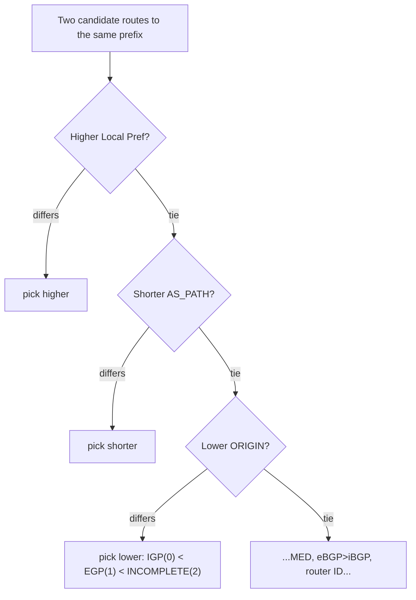

# Cloudflare: How Transit Providers Quietly Rewrite the BGP ORIGIN Attribute

> The Internet is stitched together from ~70,000 independent networks (each an
> **Autonomous System**, or AS — a set of IP ranges under one administrative
> owner, like Cloudflare or your ISP). They exchange "here's how to reach these
> IP addresses" messages using **BGP** (Border Gateway Protocol), the routing
> protocol of the whole Internet. When a router hears two different ways to reach
> the same destination, it has to pick one. Cloudflare's post asks a sharp
> question about one of the tie-breakers BGP uses to pick — the **ORIGIN
> attribute** — and shows that transit providers are secretly rewriting it to
> pull traffic (and revenue) their way, distorting routing across the Internet.
> Everything here is drawn from Cloudflare's post "Manipulating the BGP ORIGIN
> attribute" (2026-07-24, by Iliana Xygkou and Bryton Herdes). Cloudflare's own
> AS number is **AS13335**.

## The problem: an "immutable" routing signal that everyone edits

Start with the mental model. When you announce a route in BGP, you attach a bag of
**path attributes** — extra facts the message carries — that downstream routers use
to decide whether to prefer your route. One of those attributes is **ORIGIN**. It is
a tiny value that records *how* a route first got injected into BGP. The rulebook
(the BGP RFC) is explicit that once the originating network sets ORIGIN, its value
*"SHOULD NOT be changed by any other speaker."* In other words, it's meant to be
set once, at the source, and then carried untouched all the way across the Internet.

Cloudflare's finding: that "immutable" promise is fiction. Roughly **70% of unique
IPv4 AS_PATHs** (and 67% of IPv6) that they observed had arrived carrying a
*different* ORIGIN value than the one Cloudflare originally set. Networks in the
middle — transit providers — are silently rewriting it in flight to influence which
path other networks choose, because a more-preferred path means more traffic flows
through them, and traffic is money.

> [!KEY-TAKEAWAY]
> The interview lesson here is about **trusting fields you don't control**. ORIGIN
> is a shared routing signal that any network along the path *can* rewrite even
> though the spec says it shouldn't. When a value influences a decision but its
> integrity depends on the good behavior of untrusted intermediaries, you get a
> "revenue-driven arms race": everyone manipulates it just to level the playing
> field, and the signal loses its meaning.

## The three ORIGIN values, and what they were supposed to mean

ORIGIN can hold exactly one of three values, and — crucially for the story — BGP
prefers the **lower** value when it breaks ties:

- **(0) IGP** — the route is interior to the originating AS (learned from that
  network's own **interior gateway protocol**, e.g. OSPF). Lowest value, most
  preferred.
- **(1) EGP** — a historical value from the long-obsolete Exterior Gateway
  Protocol. Nobody legitimately uses it for modern routing.
- **(2) INCOMPLETE** — the route was learned some other way, e.g. **redistributed**
  from a static route or another protocol into BGP. Highest value, least preferred.

Two subtleties worth stating out loud, because interviewers probe them. First,
ORIGIN tells you *how* a route entered BGP, **not which AS announced it** (that's a
different concept — the origin AS). Second, because IGP is the lowest number, a
network that rewrites your ORIGIN *to IGP* makes its copy of your route look
maximally attractive — that's the whole game.

## Where ORIGIN sits in BGP's best-path decision (and why that matters)

BGP doesn't pick a route with a coin flip. It runs a **deterministic ladder** of
tie-breakers, top to bottom, stopping at the first one that separates the
candidates. The famous top rungs are:

1. **Higher Local Preference** wins (this is your own network's policy knob).
2. **Shorter AS_PATH** wins (fewer networks to traverse — a rough "shorter is
   better" heuristic; AS_PATH is the list of ASes the route has passed through).
3. **Lower ORIGIN** wins  → **this is our attribute**. IGP (0) beats INCOMPLETE (2).
4. ...then MED, eBGP-over-iBGP, lowest router ID, and so on.

So ORIGIN is the **third rung** — it only decides the winner when two paths have
*equal Local Preference and equal AS_PATH length*. That sounds narrow, but on the
real Internet ties at the top two rungs are common, so ORIGIN quietly decides a lot
of routes. That's exactly why it's an attractive lever: nudge ORIGIN down to IGP and
you win every tie that reached rung 3.

## Why the community's "prior approach" didn't fix it

The naive assumption everyone operated on was: *the RFC says don't touch it, so it
mostly isn't touched.* The operator community had, in Cloudflare's words, "silently
accepted" ORIGIN rewriting for years. Two prior efforts had poked at it — James
Bensley first spotlighted its widespread adoption at RIPE 91, and Celsa Sánchez
studied regional impact at LACNIC 45 — but public disclosure didn't stop anyone.
The reason is incentives, not ignorance: because routing is a "revenue-driven arms
race," an operator who *stops* rewriting just cedes traffic to competitors who
don't, so they rewrite "to level the playing field." A previous IETF fix, an
Internet-Draft named `draft-marenamat-idr-scrub-bgp-origin-00` that recommended
deprecating the attribute, simply **lapsed and expired**. So the "prior approach"
(politely asking networks to obey the spec) failed for a classic reason: it fought
economics with etiquette.

## The measurement architecture: how Cloudflare proved it

You can't just ask networks "do you rewrite ORIGIN?" — you have to *observe* it from
many vantage points. Cloudflare built a clever measurement pipeline:

1. **Inject known-truth signals.** They announced **three IPv4 and three IPv6
   prefixes** (an IP range advertised in BGP), each stamped with a *different*
   ORIGIN value, from all their peering locations using **BGP Anycast** (the same
   prefix announced from many places so the nearest one answers). Because Cloudflare
   set the values itself, any deviation observed later is a rewrite.
2. **Trigger path hunting.** After confirming the announcements propagated, they
   **withdrew** the prefixes. Withdrawal makes routers scramble to find alternate
   paths ("path hunting"), which momentarily *exposes more of the paths* that
   normally stay hidden behind the single best choice.
3. **Collect from public + private vantage points.** They parsed BGP **Update
   messages** (not static routing-table dumps) from the **RIPE RIS** and
   **RouteViews** public collector projects, plus their own **BMP** feed from border
   routers. Analyzing Updates rather than RIB (routing table) dumps captures the
   *maximum* number of distinct paths.
4. **Attribute the rewrite to a culprit AS.** With the tool **BGPKIT** they parsed
   the messages, then ran two attribution methods:
   - **Two-hop analysis:** for a path shaped `ASX AS13335`, any changed ORIGIN must
     be ASX's doing (it's the only other network involved).
   - **Longer-path algorithm:** seed a *trusted set T* with AS13335 (known to
     preserve ORIGIN), then iteratively strip already-classified ASes from each
     path; when exactly one unknown AS remains, attribute the ORIGIN to it and
     label it **trusted** or a **Modifier**.

> [!TIP]
> The measurement design is the transferable idea for interviews: to detect
> tampering by untrusted middlemen, **inject a value only you know the ground truth
> of, then observe it from as many independent vantage points as possible.** The
> withdrawal-to-trigger-path-hunting trick is a neat way to surface paths that the
> best-path selection normally hides.

## Concrete numbers from the study

Cloudflare's post is dense with figures — quoting the real ones:

- **Global collector baseline:** across public collectors, observed ORIGIN was
  **89.8% IGP, 3.5% EGP, 6.7% INCOMPLETE** — so **>10%** of paths are already
  non-IGP, i.e. carry a value someone could "helpfully" rewrite.
- **Direct peers, IPv4 (352 total):** when Cloudflare *advertised INCOMPLETE*, 314
  peers kept it but **32 rewrote it to IGP**; advertising EGP, 313 kept it while
  **32 rewrote to IGP**. Roughly **~10% of direct peers rewrite ORIGIN to IGP.**
- **Direct peers, IPv6 (315 total):** similar shape — 281 preserved INCOMPLETE, 29
  rewrote to IGP.
- **IPv4/IPv6 inconsistency:** **2 direct peers** rewrote to IGP for IPv4 but *not*
  IPv6 — different config per address family within the same network.
- **Tier-1 networks:** **6 of 16** manipulate ORIGIN to IGP; one rewrites only
  *peer* routes while preserving *customer* routes.
- **Longer-path attribution:** of **802 visible ASes, 606 (75.6%)** could be
  attributed; **64 (10.6%)** rewrite to IGP. IGP-rewriters cluster at the top of the
  hierarchy — **20.3%** appear in the top-50 of CAIDA's AS Rank; **26% of top-50**
  and **20% of top-100** ASes manipulate ORIGIN.
- **Path share:** **70% of unique IPv4 AS_PATHs** and **67% of IPv6** had ORIGIN
  reset to IGP by the time Cloudflare observed them.
- **Best-path impact:** on IPv4, of 539 AS_PATHs, 110 (20%) traversed Tier-1s, and
  rewriters gained **12 extra best-paths (+18%)**. On IPv6, rewriters gained **33
  more paths (+40%)**, including 11 that let them avoid Tier-1s entirely. That extra
  path share is the traffic (and revenue) the rewrite buys.

## A worked example of the manipulation

Cloudflare's illustrative scenario uses placeholder AS numbers **AS64501–AS64504**:
AS64501 originates a route as **INCOMPLETE** (value 2). A transit provider in the
middle, AS64503, **rewrites it to IGP** (value 0). Now when AS64504 compares
AS64503's copy against another path that arrived at the honest INCOMPLETE value —
with Local Preference and AS_PATH length tied — the ORIGIN tie-breaker picks
AS64503's route. Traffic flows through AS64503, "which allows the transit provider
to draw traffic and profit." A confirmed real variant: one AS rewrites peer/provider
routes to **EGP** (value 1) to make them *less* preferred than its customer routes;
others advertise both the original *and* an IGP-rewritten value from different
peering locations to steer traffic toward a preferred entry point.

## Trade-offs, gotchas, and the recommended fix

- **The core gotcha — no ground truth:** ORIGIN records how a route entered BGP, but
  by the time it crosses several networks nobody downstream can tell whether the
  value is original or rewritten. The signal is unauthenticated and mutable.
- **Visibility limits:** Cloudflare is candid that inference has "inherent
  uncertainty" from "lack of visibility" into all ASes, made worse by the
  **"flattening of the Internet"** — hyperscalers and CDNs increasingly peer
  directly, so fewer paths traverse the public collectors that could reveal a
  rewrite.
- **Config inconsistency is itself a problem:** the same network rewriting for IPv4
  but not IPv6, or for peer routes but not customer routes, creates "unfairness
  between networks" and unpredictable routing.
- **Full deprecation is infeasible.** ORIGIN is a *mandatory* BGP attribute — you
  can't just delete it from a protocol running the whole Internet. Cloudflare's
  conclusion is blunt: *"There is no valid technical reason to require a rewrite of
  the ORIGIN attribute."*
- **The pragmatic proposal:** since IGP already dominates (89.8%), require BGP vendor
  implementations to simply **set ORIGIN to IGP on all routes received and
  advertised** — effectively neutralizing it as a lever so everyone is on equal
  footing. Cloudflare wants to revive the IETF conversation, possibly by renewing
  the expired "Scrubbing BGP ORIGIN Attribute" draft.

> [!WARNING]
> Don't over-read the fix as "ORIGIN is secure now." Setting ORIGIN to IGP
> everywhere doesn't authenticate anything — it just removes a *distorting* knob by
> making the value uniform. Real BGP security (who's allowed to announce a prefix at
> all) is a separate problem solved by RPKI/route origin validation, which this post
> does not address.

## Common follow-up questions

- **"Why is ORIGIN a tempting attribute to manipulate rather than Local Preference
  or AS_PATH?"** Local Preference never leaves your own network (it's not sent to
  peers), so you can't use it to influence *other* networks. Prepending AS_PATH
  makes *your own* path look worse, not better. ORIGIN is one of the few transitive
  signals a middle network can quietly lower to make its route win downstream ties.
- **"If ORIGIN is only the third tie-breaker, does it really matter?"** Yes — Local
  Preference and AS_PATH length are frequently tied across competing paths on the
  real Internet, so rung 3 decides a large share of routes. Cloudflare measured
  concrete gains: +18% best-paths on IPv4 and +40% on IPv6 for rewriters.
- **"How do you attribute a rewrite to a specific network when a path has many
  hops?"** Two-hop paths are trivial (only one other AS could have done it). For
  longer paths, seed a trusted set with known-honest ASes and iteratively remove
  classified ASes until exactly one unknown remains, then attribute the change to
  it — accepting that visibility gaps leave some uncertainty.
- **"Why not just cryptographically sign ORIGIN so rewrites are detectable?"** BGP
  attributes weren't designed with per-attribute authentication, and adding it to a
  mandatory field across ~70k networks and every router vendor is a massive
  deployment problem. Cloudflare's pragmatic path is to *neuter* the attribute
  (force IGP), not secure it.
- **"What's the general lesson for system design?"** Any decision that relies on a
  value editable by untrusted parties in the path will be gamed once there's
  incentive. Either authenticate the value, remove it from the decision, or make it
  uniform so it can't be a differentiator — asking participants to "please behave"
  loses to economics.

## References

- Cloudflare Blog — "Manipulating the BGP ORIGIN attribute" (2026-07-24, Iliana
  Xygkou and Bryton Herdes): https://blog.cloudflare.com/bgp-origin-attribute/
- Secondary references cited by the post: James Bensley (RIPE 91), Celsa Sánchez
  (LACNIC 45), and the expired IETF Internet-Draft
  `draft-marenamat-idr-scrub-bgp-origin-00`.
