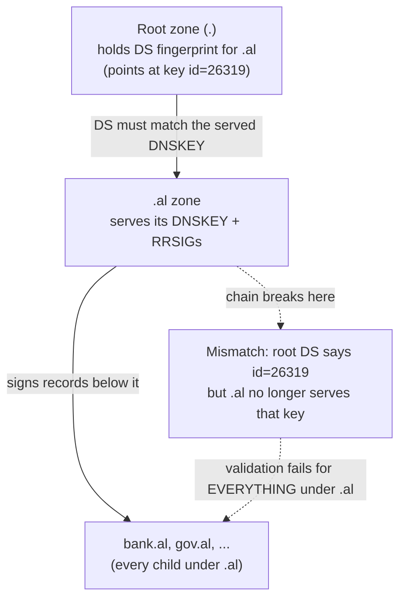
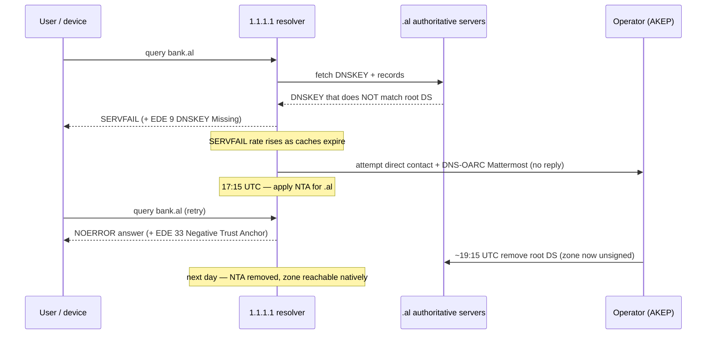

# Cloudflare: When a Broken DNSSEC Rollover Took an Entire Country's TLD Offline

> On July 3, 2026, an entire top-level domain — `.al`, Albania's country-code
> domain — became unreachable from the world's DNSSEC-validating resolvers, not
> because of an attack or a data-center fire, but because the domain's operator
> botched a routine cryptographic key change. The domain hosts "Albanian
> government services, banks, and media," so this was a national-scale outage.
> This case study walks through what DNSSEC actually does, why a single fumbled
> key rollover breaks *every* site under a TLD at once, the emergency lever
> (a Negative Trust Anchor) Cloudflare pulled to bring `.al` back, and a new
> in-band signal — Extended DNS Error code 33 — that Cloudflare shipped so the
> next time this happens, operators and engineers can *see* it. Every fact here
> is drawn from Cloudflare's post "The day .al went dark: a DNSSEC failure, and
> the EDE 33 signal that answers it."

## The problem: one broken key, and a whole country's domain goes dark

Start with the intuition. When you type `bank.al` into a browser, your computer
doesn't know that name's IP address — it *asks*. The chain of asks eventually
reaches a **resolver** (the DNS server that does the lookup work on your behalf,
like Cloudflare's public `1.1.1.1`). Normally, if a name doesn't resolve, only
*that* name is affected. But on July 3, 2026, *nothing* ending in `.al` resolved.
Government sites, banks, media — all gone at once, regardless of who hosted them.

Why would one operator's mistake take down thousands of unrelated sites? The
answer is **DNSSEC** — the security layer that lets a resolver *cryptographically
verify* that a DNS answer is genuine and wasn't forged in transit. DNSSEC's whole
value is that a validating resolver will refuse to hand you an answer it can't
prove is authentic. That is a feature — until the proof itself is broken by the
domain's own operator. Then "refuse to hand you an unverifiable answer" means
"refuse to hand you *any* answer," for the entire zone, everywhere DNSSEC is
enforced.

> [!KEY-TAKEAWAY]
> DNSSEC failures are *fail-closed by design*: a validating resolver must reject
> an answer whose signatures don't check out, even if the answer is otherwise
> correct. So a mistake in a *parent* zone (like a TLD) doesn't degrade one site
> — it takes down every child domain, on every validating resolver on Earth,
> simultaneously. The blast radius is the whole subtree.

## DNSSEC in plain terms: a chain of trust from the root down

Jargon, defined up front:

- **Zone** — a slice of the DNS namespace one operator controls (the root `.`,
  the TLD `.al`, or a domain `example.al`).
- **DNSKEY** — the public key a zone publishes; its matching private key is used
  to *sign* the zone's records.
- **RRSIG** — the digital signature attached to a set of DNS records, produced
  with the zone's private key. A resolver verifies it against the DNSKEY.
- **DS record (Delegation Signer)** — a *fingerprint* (hash) of a child zone's
  DNSKEY, but stored in the **parent** zone. This is the crucial link.

DNSSEC "builds a chain of trust from the root zone down to individual domain
names." The mechanism repeats at every level: the parent zone holds a **DS
record** — a fingerprint — for each signed child. When a resolver looks up
`.al`, it fetches the DNSKEY that `.al` is currently serving and checks that it
matches the DS fingerprint the **root** holds for `.al`. If they match, `.al`'s
signatures can be trusted; the same check then repeats one level down, and so on.

In the post's words: "A break anywhere in that chain... causes validation to fail
for everything below it." The DS-in-parent / DNSKEY-in-child split is exactly what
makes a **key rollover** (swapping to a new signing key) delicate: you have to
change the child's DNSKEY *and* the matching DS record in the parent, and keep
them consistent throughout. Get the ordering wrong and the fingerprint stops
matching the key — which is precisely what happened to `.al`.

## What actually broke: a key rollover done in the wrong order

Here is the timeline the post gives (all times UTC, July 3, 2026). Notice that at
no point was there an attack — every step is the operator's own change:

- **~14:15** — The operator (AKEP, Albania's communications authority) published a
  **new** DNSKEY and stopped serving the **old** one. But the root's DS record
  still pointed at the *old* key, `id=26319`. So resolvers fetched a DNSKEY whose
  fingerprint no longer matched the root's DS — validation failed.
- **~17:00** — The operator then *removed* the new DNSKEY without restoring the
  old one. Now the zone had **no DNSKEY records at all**, while the root DS still
  pointed at `id=26319`. Still broken — arguably worse.
- **~19:15** — The operator finally removed the **DS record** from the root. With
  no DS in the parent, `.al` is simply an **unsigned** zone, and resolution is
  fully restored (there's nothing left to validate against).

The lesson in the ordering: a safe rollover keeps the old key servable until the
new DS has propagated, then retires it. AKEP did the reverse — retired the key the
root still vouched for — so the fingerprint and the key diverged and the chain
snapped. The single most direct fix, once broken, was actually the *last* step:
removing the DS makes the zone unsigned and instantly reachable again.

## Why this wasn't the first time: the silent-NTA problem

Cloudflare had lived a "near-identical" incident with **`.de`** (Germany) two
months earlier. Their fix then was to apply an **NTA** — but that fix was
**silent**. Clients getting answers had *no way to tell from the response* that
DNSSEC validation had been bypassed. **RFC 7646** (the NTA spec) only *recommends*
out-of-band disclosure — e.g. a status page — which requires someone to go
looking. Worse, during `.de`, `1.1.1.1` returned the **wrong** error code —
`EDE 22 (No Reachable Authority)` — instead of the real cause.

So the prior approach "worked" (sites came back) but was invisible and
mislabeled. Operators couldn't easily see that a resolver had stopped validating
their zone, and debugging engineers were handed a misleading signal. That
invisibility is the gap the EDE 33 work was built to close.

## The emergency lever: a Negative Trust Anchor (NTA)

A **Negative Trust Anchor (NTA)**, defined in **RFC 7646**, "tells a resolver to
treat a zone as unsigned and bypass validation." Think of it as a resolver-side
override: "I know `.al`'s DNSSEC is broken; stop trying to validate it and just
serve the answers." It restores reachability immediately — at the explicit cost of
dropping DNSSEC's spoofing protection for that zone while it's active.

Cloudflare judged that trade-off acceptable here because "the failure was public,
confirmed, and affecting every validating resolver equally" — i.e. an attacker
gained no special advantage from the NTA, since the zone was already failing for
everyone. Before pulling the lever they tried to reach the operator directly and
posted on the **DNS-OARC Mattermost** channel, getting no response. A cruel
gotcha: the operator's own contact addresses were themselves under `.al`, "making
them unreachable during the outage."

The NTA rolled out to all `1.1.1.1` users at **17:15 UTC**, "roughly three hours
after the chain broke," and SERVFAIL rates "drop sharply when the NTA is applied."
It was removed the following day, once the operator had pulled the root DS and the
zone was legitimately unsigned.

> [!WARNING]
> An NTA is a deliberate downgrade: while it's active, answers for that zone are
> "no longer cryptographically verified," so "a spoofed answer becomes
> indistinguishable from a legitimate one." It's the right call for a public,
> confirmed, everyone-is-broken failure — but it is trading security for
> availability, and it should be as visible and short-lived as possible.

## The new signal: Extended DNS Error code 33

**Extended DNS Errors (EDE)**, defined in **RFC 8914**, are extra context a
resolver can attach to *any* DNS response — success or failure — to explain *why*
it looks the way it does. They turn opaque failures (like a bare SERVFAIL) into
something diagnosable.

**EDE code 33 (Negative Trust Anchor)** signals exactly what the silent-NTA
problem lacked: it tells the client "an NTA was applied, and this response was
served **without** DNSSEC validation." It was proposed by Babak Farrokhi (Quad9)
in the draft "Disclosure of Negative Trust Anchors in DNS Responses," co-authored
by Cloudflare, with the code assigned by IANA.

A subtle but important property: EDE 33 is returned on **every** response served
under an active NTA — "even for domains not using DNSSEC" — because "transparency
applies equally to every response served under it." The NTA is a property of the
resolver's *state for that zone*, not of any single record, so the signal is
consistent across all answers while it's in force. During the `.al` incident,
Cloudflare attached EDE 33 for the first time, alongside `EDE 9 (DNSKEY Missing)`
which pinpointed the actual break.

## The data flow: how the outage was detected, signaled, and resolved

Detection was via metrics, not alarms from Albania: **SERVFAIL** rates (the DNS
response code for "I couldn't give you a valid answer") "climbed as caches
expired" and resolvers were forced to re-validate against the broken chain, then
dropped sharply once the NTA landed. A concrete example answer the post shows for
`google.al` after resolution: `A 142.251.142.196`, TTL 300, status NOERROR,
message id 32848, UDP payload size 1232 bytes.

## Concrete numbers from the post

- **Date:** incident July 3, 2026; post published July 14, 2026.
- **TLD rank:** `.al` sits at **#191** on Cloudflare Radar's TLD ranking.
- **Timeline (UTC, all same day):** ~14:15 new key published / old key dropped →
  ~17:00 all DNSKEYs removed → **17:15 NTA applied** (~3 hours after the break) →
  ~19:15 root DS removed. NTA removed the following day.
- **The stale key:** root DS pointed at DNSKEY **id=26319**.
- **Standards:** **RFC 7646** (NTA), **RFC 8914** (EDE); **EDE 33** = Negative
  Trust Anchor, **EDE 9** = DNSKEY Missing, **EDE 22** = No Reachable Authority
  (the wrong code returned during `.de`).
- **Example resolved answer:** `google.al → A 142.251.142.196`, TTL 300, NOERROR,
  id 32848, UDP size 1232 B.
- **Adoption:** `kdig` (Knot project) now recognizes EDE 33 by name; an Unbound
  pull request is under review; the draft goes to the IETF DNSOP Working Group
  (IETF Vienna meeting July 18–24).
- As of publishing, `.al` "remains unsigned" — the DS has not been restored.

## Trade-offs and gotchas, gathered

- **Fail-closed is the point, and also the danger.** DNSSEC's refusal to serve
  unverifiable answers is what stops spoofing — and is exactly what escalates one
  operator's key mistake into a total-TLD outage. You can't have the protection
  without the failure mode.
- **NTA trades security for availability.** It restores reachability instantly but
  drops cryptographic verification for the zone. Justified only when the failure
  is public, confirmed, and hitting everyone equally, so no attacker gains an edge.
- **Silent remediation is a debugging trap.** The `.de` fix worked but was
  invisible and even mislabeled (`EDE 22` instead of the real cause). Fixing user
  impact without making the fix observable leaves operators blind.
- **In-band beats out-of-band for disclosure.** RFC 7646 only recommended a status
  page; EDE 33 puts the disclosure *in the DNS response itself*, where the client
  and operator actually are.
- **Rollover ordering is everything.** Keep the old key servable until the new DS
  has propagated; retiring the key the parent still vouches for is what snapped the
  chain. And removing the DS (making the zone unsigned) is the fastest emergency
  un-break once things are already broken.
- **Your incident contacts must not depend on the thing that's down.** AKEP's
  contact addresses lived under `.al`, so they were unreachable during their own
  outage — a self-referential single point of failure.

## Common follow-up questions

- **"Why does a TLD DNSSEC mistake break child domains that don't even use
  DNSSEC?"** Because validation walks the chain of trust downward. If the resolver
  can't validate `.al` itself (DS vs. DNSKEY mismatch), it can't establish trust
  for anything beneath `.al`, so it fails closed for the whole subtree regardless
  of each child's own configuration.
- **"What exactly went wrong in the rollover?"** The operator published a new
  DNSKEY and stopped serving the old one while the root DS still pointed at the old
  key `id=26319`. The served key's fingerprint no longer matched the parent's DS,
  so signatures couldn't be validated. Later they removed all DNSKEYs (worse), then
  finally removed the DS to make the zone cleanly unsigned.
- **"Why is an NTA safe to apply here but risky in general?"** Applying it drops
  spoofing protection for the zone. Cloudflare deemed it acceptable because the
  break was public and already failing for every validating resolver — an attacker
  gained nothing. In a *targeted* attack, blindly applying an NTA could help the
  attacker, so the bar is "public, confirmed, everyone-equally-affected."
- **"What does EDE 33 add over just returning an answer?"** Transparency. Without
  it, a client can't tell that the resolver stopped validating that zone. EDE 33
  says "served under a Negative Trust Anchor, unvalidated" on every response while
  the NTA is active — closing the silent-NTA gap from the `.de` incident.
- **"How did Cloudflare even notice, given no one from Albania reported it?"**
  Their own SERVFAIL metrics rose as cached records expired and resolvers
  re-validated against the broken chain. They tried contacting the operator and
  posting to the DNS-OARC Mattermost, got no reply, and applied the NTA at 17:15
  UTC.
- **"What's the durable fix beyond this one incident?"** Standardizing EDE 33 (via
  the IETF DNSOP draft) and getting tools like `kdig` and Unbound to recognize it,
  so NTA usage is observable in-band across the ecosystem — not just on a status
  page someone has to remember to check.

## References

- Cloudflare — "The day .al went dark: a DNSSEC failure, and the EDE 33 signal
  that answers it": https://blog.cloudflare.com/dnssec-nta-ede-33/
- RFC 7646 — Definition and Use of DNSSEC Negative Trust Anchors:
  https://www.rfc-editor.org/rfc/rfc7646
- RFC 8914 — Extended DNS Errors: https://www.rfc-editor.org/rfc/rfc8914
