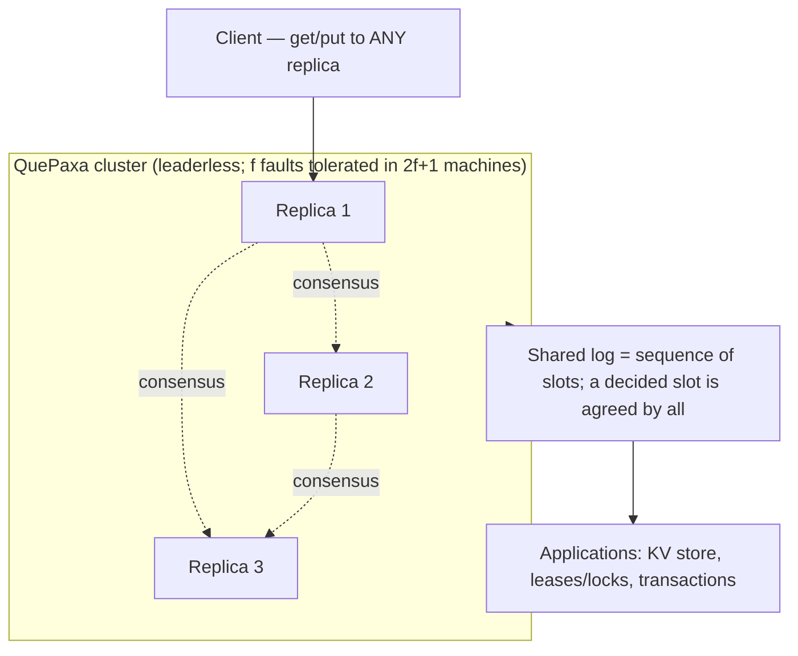

# Cloudflare Meerkat: Global Consensus Without a Leader

> Cloudflare runs internal services across a huge, unreliable network, and some of
> those services need a shared piece of truth that **every reader sees identically**
> — things like "where does this AI model instance live?" or "which machine is
> allowed to write to this database right now?". Getting many machines spread around
> the world to *agree* on such a fact — even while servers crash and network links
> get cut — is the classic **consensus** problem. **Meerkat** is Cloudflare
> Research's experimental system for solving it, and its twist is that it drops the
> single "leader" that most consensus systems depend on. Everything here is drawn
> from Cloudflare's post "Meerkat: Cloudflare's Global Consensus Experiment" by
> James Larisch (Cloudflare Research).

## The problem: everyone must agree, even when the network misbehaves

Start with the mental model. **Consensus** means getting a group of machines to
agree on a value (or a sequence of values) such that they never contradict each
other, even though any of them can crash and the messages between them can be
delayed or lost. This is the beating heart of every strongly-consistent distributed
system.

Cloudflare's need is specific. Its internal services read and modify shared
**control-plane state** across **"330+ global data centers."** Control-plane data is
the small-but-critical bookkeeping that tells the system how to behave — Cloudflare
gives two examples:

- **Placement information** — *where* a resource, such as an AI model instance,
  actually lives.
- **Leadership information** — *which* single machine is currently allowed to write
  to a database.

The two hard requirements are worth quoting. Readers must **"*never* see
inconsistent state"** — if one machine thinks the leader is A and another thinks
it's B, two machines might both start writing and corrupt the database. And the
system must stay **available for writes during failures**, because control-plane
data that you can't update during an incident is control-plane data that makes the
incident worse.

The obstacle is the Internet itself. In Cloudflare's words: *"Servers and data
centers go down. Queues fill up. Links and cables get cut."* Strong consistency is
easy on a single machine; it is genuinely hard when the participants are scattered
across the planet on a network that constantly hiccups.

> [!KEY-TAKEAWAY]
> The interview version of this problem: "Keep a small, critical piece of shared
> state consistent across hundreds of globally-distributed machines, and keep it
> *writable* even while machines and links fail." Meerkat's answer is a
> **leaderless** consensus algorithm called **QuePaxa**, which removes the single
> most common source of consensus outages — the dependency on one elected leader.

## Why the naive approach broke: leaders and timeouts (i.e., Raft)

The natural first answer to "how do machines agree?" is **Raft**, which Cloudflare
calls *"the* most implemented consensus algorithm."* Raft works by electing a single
**leader**: only the leader accepts writes, streams them to the **followers**
(replica machines that copy the leader's decisions), and if the leader dies, the
followers hold an election and pick a new one. It is popular because it is
understandable.

But the leader is also its Achilles' heel, and Cloudflare says it has *"experienced
multiple incidents caused by unavailable leaders"* and hit *"these exact issues"*
with its own Raft-based systems:

- **A dead leader means no writes.** When the leader fails, nobody can write until a
  new leader is elected. That election is a window of unavailability — exactly when
  you least want it during an incident.
- **Timeouts are impossible to tune on a bad network.** Raft detects a dead leader
  with a **timeout** (a follower waits N milliseconds for a heartbeat, then assumes
  the leader is gone). Set it too short and, on a jittery global network, replicas
  *"constantly be timing out"* and holding needless elections; set it too long and
  the system *"reacts slowly"* to real failures. On the unpredictable Internet
  there's no good value.
- **Elections can fight each other.** Competing leader campaigns can *"interfere
  with each other,"* and while they squabble, writes are blocked.
- **The leader is a bottleneck.** A single slow or overloaded leader drags down the
  whole cluster, because every write must funnel through it.

The lesson worth stating out loud: **the leader is a single point of coordination,
and single points of coordination are fragile on an unreliable global network.**
That realization is what motivates a leaderless design.

## The architecture: QuePaxa and a shared log

Meerkat is built on **QuePaxa**, a consensus algorithm published in 2023 (Cloudflare
cites "Tennage & Băsescu et al."). Cloudflare believes Meerkat is *"the first
industrial deployment of QuePaxa at global scale."*

Here's how a developer uses it and how data flows through it:

- A developer requests a **cluster** of **replicas** (the participating machines).
  Every replica connects to every other replica, and — unlike Raft — **any** replica
  can receive both reads and writes.
- The developer names the data centers that are allowed to host replicas, and
  **"Meerkat places them automatically"** within those.
- A client sends an application-specific request (for example, a key-value `get` or
  `put`) to *any* replica.
- The replica translates that request into a **log event** and uses consensus to
  distribute it, so that every replica maintains the identical **log**.

The **log** is the core data structure: *"a sequence of slots."* A slot that has had
an event agreed into it is a **"*decided* slot."** The invariant that makes the whole
thing safe is simple to state: **no two replicas ever disagree on a decided slot.**
Applications — a key-value store, a leasing/lock service — are then built *on top of*
this agreed-upon log.

### What makes QuePaxa different from Raft

The distinctive properties, straight from the post:

- **No required leader.** Any replica can drive consensus forward. There is *no*
  single machine whose death stalls the cluster.
- **A leader is an optimization, not a requirement.** QuePaxa *can* use a leader, but
  it only buys a **round-trip advantage** — a leader decides a value in **one** round
  trip, while a non-leader needs **three or more** (plus a broadcast). Crucially, if
  the leader vanishes, the cluster just keeps going at the slower path instead of
  stalling for an election.
- **Concurrent proposals cooperate instead of colliding.** In Raft, two would-be
  leaders interfere; in QuePaxa, concurrent proposals *"do not destructively
  interfere"* — the replicas *"work together"* rather than fighting.

### Linearizability: even reads go through the log

A subtle but important point: Meerkat provides **linearizability** — the strong
guarantee that every operation appears to take effect at a single instant, and once a
write is acknowledged, every later read sees it. To achieve this, **even a read
creates a log event.** If a replica tries to read at a slot that's already been
decided (meaning a write got there first), the lagging replica is *forced to adopt
the decided value* and **re-propose its read at the next slot** — which orders the
read strictly after the write. That's how a leaderless system still gives you
"reads never see stale-and-inconsistent state."

## Concrete numbers from the post

Cloudflare gives real figures — here they are, quoted:

- **Scale:** **"330+ global data centers."**
- **Fault tolerance:** the system tolerates **`f` faults in a system of `2f + 1`
  machines** (the standard consensus majority requirement — e.g., 5 machines survive
  2 failures).
- **Round trips:** a decision takes **"one to three round trips"** — 1 for the
  leader, 3+ for a non-leader, plus a broadcast.
- **Throughput:** QuePaxa delivers **"much higher (~10x) throughput than Raft and
  Multi-Paxos"** under adverse (failure-prone) conditions.
- **Proof-of-concept scale:** tested with **"up to 50 replicas distributed around the
  world."**
- **Batching example:** *"if a replica receives 10 writes in a span of 10ms"* it can
  bundle them into one consensus round.
- **Resilience result:** *"Leaders in our proof-of-concept clusters constantly fail,
  and the cluster keeps operating with no increase in error-rate."*

> [!INTERVIEW]
> The single most quotable result: leaders in the POC clusters **fail constantly**,
> and the cluster **keeps operating with no increase in error-rate**. That is the
> whole pitch of leaderless consensus in one line — leader failure stops being an
> availability event. If you're asked "why not just use Raft?", this is your answer:
> Raft turns leader death into a write outage; QuePaxa turns it into a non-event
> (at worst, a slower path).

## Reasoned trade-offs and gotchas

QuePaxa is not magic, and Cloudflare is refreshingly explicit about the limits:

- **Latency is bounded by geography — no escaping it.** Cloudflare states *"proposal
  decision latency is proportional to the latency between some majority of
  replicas,"* and there is *"no getting around that."* If your replicas span
  continents, a majority still has to exchange messages across those distances, so
  decisions are slow. Leaderless-ness removes the leader bottleneck; it does **not**
  repeal the speed of light.
- **It is not a general-purpose database.** It is *"not designed to create
  general-purpose data systems like databases."* It is built for **control-plane
  information that is written infrequently but must remain consistent** — not for
  high-volume application data.
- **No Byzantine fault tolerance.** Like Raft, QuePaxa does **not** handle
  **Byzantine faults** (machines that lie or behave maliciously rather than simply
  crashing). It assumes participants fail by stopping, not by cheating.
- **Still experimental.** Meerkat is *"still in development,"* internal-only, and
  **not in production** yet.

The mitigations Cloudflare lists for the latency problem are a mini-catalog of
consensus tuning:

- **Place replicas closer together** to shrink majority round-trip time.
- **Batch writes** (the "10 writes in 10ms → one round" trick) to amortize the
  consensus cost across many operations.
- **Allow stale-but-never-inconsistent reads** from local data when an application
  can tolerate slight lag but not contradiction.
- **Bundle operations** — QuePaxa supports **compare-and-swap** and *"general
  transactions,"* so you can do more real work per expensive consensus round.

> [!WARNING]
> The trap to avoid in an interview: claiming a leaderless algorithm is "faster." It
> isn't inherently faster per-decision — a leader path is actually the *cheapest*
> (one round trip). What leaderless-ness buys you is **availability under leader
> failure** and **~10x throughput under adverse conditions**, not lower best-case
> latency. Latency is still floored by the round-trip time between a majority of
> replicas.

## Common follow-up questions

- **"Why is a leader a liability, not just a bottleneck?"** Because leader failure
  forces an *election*, and the election is a window where **no writes happen**. On a
  jittery global network the timeouts that detect a dead leader are impossible to
  tune, so you get either false elections or slow reaction. Leaderless consensus
  removes that failure mode: a replica dying just means the cluster uses a slower
  path, not a stall.
- **"If there's no required leader, why does QuePaxa still allow one?"** Purely as an
  optimization. A leader decides in one round trip vs. three-or-more for a non-leader.
  The key difference from Raft is that the leader is *optional* — losing it degrades
  latency instead of causing an outage.
- **"How does a leaderless system still give linearizability?"** By making **reads**
  create log events too. A read that lands on an already-decided slot is forced to
  adopt that decided value and re-propose at the next slot, which orders it strictly
  after the write. Consensus on the log ordering is what buys the strong guarantee.
- **"Why is this only for control-plane data and not a general database?"** Because
  every operation (even reads) pays for consensus, and decision latency is bounded by
  the round-trip time to a majority of globally-spread replicas. That's fine for
  small, infrequently-written, must-be-consistent facts (placement, leadership); it's
  too expensive for high-throughput application data.
- **"What failures does it NOT handle?"** Byzantine (malicious/lying) nodes — it
  assumes crash-stop failures, like Raft. And it can't beat physics: if a majority of
  replicas are far apart, decisions are slow no matter what.
- **"How would you make a globally-distributed QuePaxa cluster faster?"** Place
  replicas closer together, batch many writes into one consensus round, bundle
  operations via compare-and-swap or transactions, and serve stale-but-consistent
  reads locally where the application can tolerate lag.

## References

- Cloudflare Blog — "Meerkat: Cloudflare's Global Consensus Experiment" (James
  Larisch, Cloudflare Research): https://blog.cloudflare.com/meerkat-introduction/
- QuePaxa consensus algorithm — Tennage, Băsescu et al. (2023), as cited in the
  Cloudflare post.
