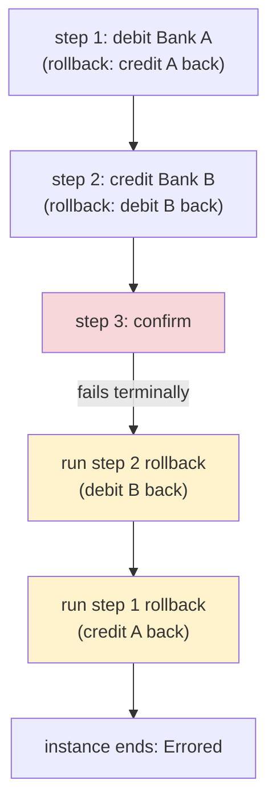

# Cloudflare Workflows: Saga-Style Rollbacks for Durable Execution

> Cloudflare Workflows lets you write a long-running, multi-step program that
> **survives crashes, restarts, and retries** — each step's result is persisted, so
> if the process dies halfway through, it can pick up where it left off instead of
> starting over. That's the good part. The hard part is what happens when step 3
> fails *after* steps 1 and 2 already committed real side effects in the outside
> world — money moved, a hotel booked, an email sent. You can't just "rewind"; those
> effects are permanent. This case study walks through how Cloudflare added
> **rollback** support to Workflows using the **saga pattern**, why the obvious
> `try/catch` approach isn't enough, and the three API shapes they weighed before
> shipping. Every claim here is drawn from Cloudflare's engineering post
> "Rollbacks for Workflows."

## The problem: a failed step can leave the world half-changed

Start with the intuition. A **Workflow** is a durable, multi-step application — think
of it as a function whose individual steps are checkpointed to storage so the whole
thing can resume after a failure. Cloudflare gives you a `step.do(...)` call to wrap
each unit of work; Workflows retries it on transient failure and remembers its result.

The trouble is that "resume from where you crashed" only helps with *incomplete* work.
It does nothing for work that **already completed and can't be undone**. The post's
canonical example is a fund transfer with three steps:

1. **Debit** Bank A.
2. **Credit** Bank B.
3. **Confirm** the transfer.

If the credit in step 2 fails, the debit in step 1 is *already committed*. There is no
"undo debit" button — the only correct fix is a **new, reversing operation** that
credits the money back to Bank A. This pairing of a forward operation with a
matching compensating operation is exactly the **saga pattern**: a way to keep a
multi-step process consistent when you can't wrap it all in a single database
transaction.

> [!KEY-TAKEAWAY]
> A durable-execution engine solves *"resume the work that didn't finish."* It does
> **not** solve *"undo the work that did finish."* Committed side effects in the
> outside world (money moved, rows written in another system, emails sent) can only be
> reversed by explicit **compensating actions** — and orchestrating those is the saga
> pattern. Rollback support is Workflows giving that pattern first-class API support.

## The naive approach: a hand-rolled `try/catch` compensation block

Before this feature, developers had to write their own compensation logic *outside*
the step definitions. You'd track which steps succeeded, which failed, and what needed
undoing — typically in a growing `try/catch` block with manual ordering and replay
logic.

The core reason this breaks is stated crisply in the post: a `catch` block **"only
knows what is still in memory at its exact point in your JavaScript execution."** It
has no view of the *persisted* history of the Workflow. That's a fatal mismatch,
because a Workflow is precisely the kind of program that can crash and resume — and
when it does, the in-memory state your `catch` block relied on is gone. You are asking
the least durable part of the program (a local variable in a stack frame) to make
decisions about the most durable part (which committed steps need reversing).

The manual approach also scales badly: every new step means more bookkeeping in the
catch block, more careful ordering, and more chances to get the undo sequence wrong.

## The design: rollback as metadata on the durable unit of work

Cloudflare's key move is to make rollback a property of **each step**, not a separate
global error handler. You attach a **rollback handler** to a step by passing it in an
options object to `step.do()`:

```js
step.do("credit Bank B", { rollback }, async () => { /* forward work */ });
```

Each rollback handler receives three things: the **error** that triggered the
rollback, the **step context**, and `output` — the *persisted* value the forward step
produced. Crucially, `output` **can be `undefined`** if the step failed before it
managed to persist anything. That single detail is why handlers use persisted history
rather than in-memory guesses: the engine hands the handler the durable record of what
actually happened.

Rollback gets its own configuration, `rollbackConfig`, mirroring the existing
`WorkflowStepConfig`. The post's example gives rollback its own retry and timeout
policy — `retries: { limit: 10, delay: '30 seconds', backoff: 'exponential' }` and
`timeout: '2 minutes'` — so a compensation can be retried independently of the forward
step that it's undoing.

### Execution rules that make it correct

Three rules govern *when* and *how* rollbacks run:

- **Rollback runs only on terminal failure.** Handlers do **not** fire on every caught
  step error — only when the Workflow is about to fail for good. A transient error that
  a retry fixes never triggers compensation.
- **The failing step is itself rollback-eligible.** If the `step.do()` that failed
  registered a handler, its own rollback can run too (useful when a step partially
  applied an effect before failing).
- **Handlers run in reverse step-*start* order — not completion order.** This is a
  subtle but important choice. Because parallel steps can finish out of order,
  unwinding by completion order would be unpredictable. Unwinding by the order steps
  *started* gives you the intuitive "undo most-recent-first" behavior, like popping a
  stack.



## Under the hood: durable step history and a callable stub

Two mechanisms combine to make rollback survive crashes:

1. **Durable step history.** Workflows already records, for each step, what ran,
   whether it completed, what output was saved, and — now — whether a rollback was
   registered. This is the persisted ground truth the handlers read from.
2. **The rollback handler as a stub.** A handler may need to run long *after* its
   `step.do()` call returned, so Workflows can't just hold a normal closure. It keeps
   the handler as a callable **stub** (a Workers RPC term for a reference to a function
   that can be invoked later, possibly across process boundaries). Workflows keeps its
   own reference using `dup()` semantics so the handler stays alive independently of
   the original call.

### Recovery via replay

Here's the part that ties it to durable execution. If the engine crashes or restarts,
all the in-memory stubs are lost. Workflows recovers by **re-running your code** — but
it does **not** re-execute the bodies of already-completed forward steps. Instead it
reads their **persisted results**. As execution re-encounters each `step.do()` call
that has a rollback, the stub simply **re-registers**, without duplicating the side
effect the forward step already performed. So after a restart, the full set of
compensations is back in place, reconstructed from durable history rather than luck.

## Why this API shape? Two rejected alternatives

The post is unusually explicit about the API design bake-off — a great interview
signal about weighing ergonomics against semantics.

- **Rejected: a fluent/chained API** — `step.do(...).rollback(...)`. The problem is
  that `step.do()` returns a `Promise`, and Cloudflare wants to support **promise
  pipelining** (chaining operations on a promise before it resolves). A `.rollback()`
  in that chain would make step timing ambiguous — timing would "depend on when the
  returned `Promise` is consumed."
- **Rejected: a builder API** — `.saga().do().rollback().run()`. This avoids the
  promise ambiguity, but it "adds ceremony," and forgetting the final `.run()` is an
  easy mistake that's hard to catch.
- **Chosen: metadata passed to `step.do()`.** The post calls it "less magical, but it
  is simpler to adopt, and clearer to understand." A decisive practical win: existing
  `step.do()` calls keep working unchanged, so adoption is incremental.

> [!INTERVIEW]
> When asked to design an API for compensating actions, the reusable lesson here is
> *put the rollback next to the thing it undoes.* Co-locating a step and its
> compensation (as metadata on the same call) keeps the two in sync as code evolves,
> whereas a distant global `catch` drifts out of sync and can't see persisted state.
> The rejected fluent/builder alternatives are a clean example of ergonomics losing to
> semantic clarity and safe defaults.

## Trade-offs and gotchas

- **Rollback handlers must be idempotent.** A crash can cause a handler to run more
  than once, so the post says to use **idempotency keys** — a stable identifier that
  lets the downstream system deduplicate, so "credit Bank A back" applied twice still
  only credits once.
- **Handlers must tolerate `output === undefined`.** If the forward step failed before
  persisting anything, there's no output to compensate against. A handler that blindly
  dereferences `output` will itself throw.
- **A failed rollback ends the instance in `Errored`.** If a rollback handler exhausts
  its retries, Workflows records the outcome as failed, **stops the remaining
  handlers**, and the instance ends in the `Errored` state. Compensation is best-effort
  with a hard stop, not an infinite guarantee.
- **Rollback is not the failure — it's the response to it.** The post is careful:
  "rollback is what Workflows does after the failure, not the reason the Workflow
  failed." The original failure and the rollback outcome are tracked separately.
- **Reverse-start-order matters for parallel work.** Relying on completion order would
  be non-deterministic; the engine deliberately unwinds by the order steps started.

## Concrete numbers from the post

Be honest about scope here: this is a **design/feature announcement**, not a scaling
retrospective, so there are **no latency, throughput, scale, or percentage figures.**
The concrete specifics the post does give are:

- The fund-transfer example uses **3 steps** (debit, credit, confirm).
- The `rollbackConfig` example: **`retries: { limit: 10 }`**, **`delay: '30 seconds'`**,
  **`backoff: 'exponential'`**, **`timeout: '2 minutes'`**.
- **What's next**, per the post: rollback support for **`waitForEvent`**, **parallel
  rollback execution**, and **Python Workflows**.

## Common follow-up questions

- "Why isn't durable execution alone enough — why do you need rollback?" Durable
  execution resumes *unfinished* work by replaying from persisted state. It cannot undo
  *finished* work that had external side effects. Reversing a committed debit requires a
  new compensating credit — the saga pattern — which is what rollback adds.
- "Why not just use a `try/catch`?" A catch block only sees in-memory state at its
  exact execution point. A Workflow can crash and resume, at which point that in-memory
  state is gone. Rollback handlers instead read the engine's persisted step history, so
  they know what actually completed regardless of restarts.
- "When exactly do rollbacks fire?" Only when the Workflow is about to fail
  terminally — not on every caught step error a retry might fix. The failing step is
  itself eligible if it registered a handler.
- "In what order do compensations run?" Reverse step-*start* order, not completion
  order — because parallel steps finish unpredictably, and unwinding most-recently-
  started-first is the deterministic, stack-like behavior you want.
- "Why must rollback handlers be idempotent?" Because a crash can cause a handler to
  run more than once. An idempotency key lets the downstream system dedupe so the
  reversing effect applies at most once.
- "How does rollback survive an engine crash?" Handlers are held as callable stubs
  (`dup()`'d Workers RPC references). On restart those stubs are lost, so Workflows
  replays the code — reading persisted results instead of re-running completed forward
  steps — and each `step.do()` with a rollback re-registers its stub without repeating
  the side effect.
- "Why metadata on `step.do()` instead of a fluent or builder API?" The fluent form
  made step timing ambiguous under promise pipelining; the builder form added ceremony
  and a forgettable `.run()`. Metadata is less magical but simpler, clearer, and lets
  existing `step.do()` calls keep working unchanged.

## References

- Cloudflare — "Rollbacks for Workflows": https://blog.cloudflare.com/rollbacks-for-workflows/
- Saga pattern (background): https://microservices.io/patterns/data/saga.html
