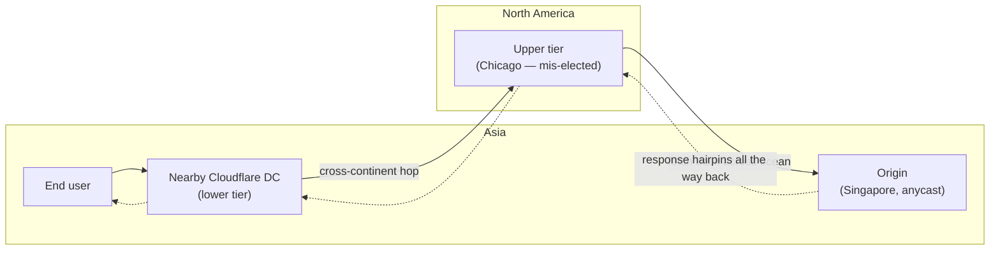
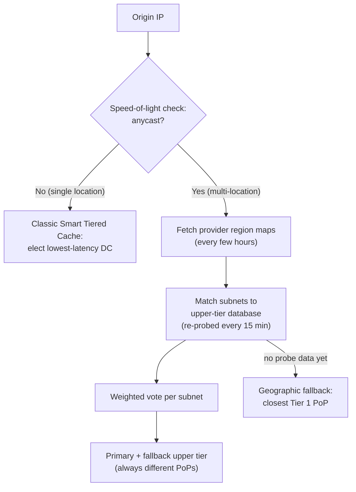

# Cloudflare: Smart Tiered Cache for Public Cloud Regions

> A CDN's whole job is to keep a copy of your content close to your users so it
> doesn't have to fetch from your origin server on every request. Cloudflare runs
> data centers in hundreds of cities; each one caches what people near it ask for.
> But there's a subtler layer underneath: when a cache *misses*, which of those
> hundreds of data centers should be the one that actually talks to your origin?
> Pick well and misses funnel through a single well-warmed cache that shields your
> origin. Pick badly and a request from a user in Asia can bounce cross-continent
> and back before your origin ever sees it. This case study is about how Cloudflare's
> automatic picker — **Smart Tiered Cache** — quietly broke for origins hosted on
> public clouds like AWS, and the clever physics-based fix they shipped. Everything
> here is drawn from Cloudflare's engineering post "Smart Tiered Cache for public
> cloud regions" — where the post gives no hard number, we say so rather than invent
> one.

## The intuition: what a tiered cache is and why the upper tier matters

Start with the mental model. A **CDN** (content delivery network) is a fleet of
servers spread across the world that cache your website's content near your users, so
most requests are served from a nearby copy instead of traveling all the way to your
**origin** (the server you actually run, e.g. an app on AWS). When a nearby data
center doesn't have a copy — a **cache miss** — it must fetch from somewhere.

The naive design is: *every* data center that misses fetches directly from your
origin. The problem: Cloudflare has data centers in hundreds of cities, so your
origin could be hammered by hundreds of independent caches all missing on the same
new object at once. Each one is cold, so your origin does a lot of redundant work and
your global cache **hit ratio** (the fraction of requests served from cache) stays
low.

**Tiered cache** fixes this with a hierarchy. Data centers close to users are the
**lower tier**. Instead of each of them going to the origin, they route their misses
through a smaller set of **upper-tier** data centers. The upper tier is, in
Cloudflare's words, *"the single point through which all cache misses funnel on their
way to your origin."* Because all those misses concentrate on one warm cache, the
upper tier answers most of them itself — so your origin sees far fewer requests, and
the upper tier's hit ratio climbs.

The key design question is therefore: **which data center should be the upper tier
for a given origin?** That is the entire subject of this case study.

## Smart Tiered Cache and why it picks with latency probes

Cloudflare's **Smart Tiered Cache** answers that question automatically. Introduced
in 2021, its rule was simple and sensible: from every data center, continuously
measure the network latency to your origin's IP address, and elect the *single*
lowest-latency data center as the upper tier. That gives you one warm funnel sitting
as close to your origin as the network allows — best of both worlds, and zero
configuration from you.

The post notes this is *"the most popular tiered cache topology"* and that it's free
on all plans. For an origin with one stable IP in one place, the latency-probe
approach works beautifully: the probes clearly reveal which data center is nearest,
and that becomes your upper tier.

> [!KEY-TAKEAWAY]
> The senior-interview framing of this whole story: *"Your auto-tuning heuristic
> depends on a signal (latency-to-origin-IP) that silently becomes meaningless for a
> large and growing class of inputs (anycast/regional cloud front-ends). How do you
> detect that the signal is degenerate, and choose a good upper tier anyway?"*
> Cloudflare's answer combines a **physics check** (speed of light in fiber) to
> *detect* the bad case and a **provider-region map plus weighted voting** to *route
> around* it. That "detect the signal is lying, then fall back to structure" pattern
> is the reusable lesson.

## Why the naive approach broke: anycast confuses the probes

Here is the failure. A growing slice of the Internet's origins don't live at one
machine in one city — they live on public clouds, sitting *"behind anycast or
regional unicast front ends."*

Two terms to define:

- **Anycast** is a network trick where *one* IP address is announced from *many*
  physical locations at once, and the network routes you to whichever is closest.
  Great for the cloud provider, but it means a single origin IP genuinely lives in
  many places.
- **Regional unicast front end** is the entry point a cloud region puts in front of
  your service; from the outside, many Cloudflare data centers can appear roughly
  equidistant from it.

The consequence: *"one origin IP can look equally close to a dozen Cloudflare data
centers at once."* Smart Tiered Cache's latency probes *"have nothing to lock
onto"* — there is no single nearest data center to elect, because the IP answers from
everywhere.

Cloudflare's safe fallback in that situation was to use **multiple** upper tiers. But
that reopens the exact problem tiered cache was built to solve: spreading misses
across several upper tiers means *"more requests reach the origin"* — cache
efficiency drops. As the post puts it, that's a fine trade for some setups, but it's
a real loss.

### The hairpinning trap

Worse than merely spreading traffic is picking the *wrong* single tier. The post's
vivid example: an origin in **Singapore** behind anycast might, by a quirk of how the
probes resolve, show its lowest latency at a data center in **Chicago**. Now watch
what happens to a real request:

> A request from an end user in Asia hits a nearby Cloudflare data center, gets routed
> cross-continent to the upper tier in Chicago, and Chicago fetches from the origin
> back in Singapore.

The user is next door to the origin, but the request flies to North America and back.
This is **hairpinning** — traffic making a U-turn across the planet — and the post
says it *"adds hundreds of milliseconds of latency."* The probe wasn't wrong about the
number it measured; the number was just meaningless because the IP is anycast.

## The fix, part 1: detect anycast with the speed of light

You can't fix a bad upper-tier choice until you can *tell* that the origin is anycast
in the first place. Cloudflare's detection is elegant because it leans on physics
rather than guesswork.

Take two Cloudflare **checkpoints** (probing data centers) that are far apart, and add
up their measured probe latencies to the origin IP. There is a hard physical floor on
how fast a signal can travel: light in fiber-optic cable has a finite speed. If the
combined round-trip latencies come back *"faster than what light in fiber could
physically travel between the two"* points, then a single machine could not possibly
have answered both probes — so **the origin must be answering from multiple
locations.** That is anycast, proven, not guessed.

This is the "detect the signal is lying" step: instead of trusting the latency number,
Cloudflare uses an independent, unbreakable constraint (the speed of light) to flag
when the number is describing multiple machines pretending to be one.

## The fix, part 2: map cloud regions, then vote

Once an origin is known to be anycast, latency probes can't pick the upper tier — so
Cloudflare picks using **structure** instead of latency. The pipeline:

1. **Fetch provider region maps.** Every few hours, Cloudflare downloads the public
   IP-range files that cloud providers publish, which map each **region** (e.g.
   `aws:us-east-1`) to the set of IP prefixes (subnets) it uses. This tells Cloudflare
   *which region an origin IP belongs to*, sidestepping the "it's everywhere" problem
   — a region is a real place.
2. **Match against the upper-tier database.** Those subnets are matched against
   Cloudflare's **upper-tier database**, which is *"built from continuous latency
   probing refreshed every 15 minutes."* This database already knows, for normal
   (non-anycast) address space, which Cloudflare data center is the best tier.
3. **Weighted voting.** Each matching subnet *"casts a weighted vote based on its
   current upper-tier assignment."* The data center with the strongest aggregate
   signal becomes the **primary** upper tier. A **fallback** is also chosen, and
   crucially *"primary and fallback always come from different points of presence
   (PoPs),"* so a single PoP outage can't take out both. (A **PoP**, point of
   presence, is a Cloudflare physical location.)
4. **Geographic fallback for cold regions.** Some regions have no probe data yet. For
   those, Cloudflare defaults to *"the closest of our Tier 1 PoPs,"* then switches to
   the data-backed choice as origins in that region onboard and generate signal.

The net effect: instead of hairpinning to Chicago, an anycast origin in Singapore gets
an upper tier chosen from *where its region actually is*, keeping the miss path short.

## What you configure vs. what Cloudflare automates

A theme worth calling out for interviews: this is a system designed to push almost all
the work onto automation. Cloudflare *"automates probing, selection, and failover,"*
and as the post says, *"Your job is selecting the region hint."*

A **region hint** is you telling Cloudflare which region your anycast origin lives in
(e.g. `aws:us-east-1`). You can set it one origin at a time, in bulk, via API, or via
Terraform. Importantly, the dashboard only *lets* you set a hint for origins *"whose
IPs we've detected as anycast"* — the speed-of-light detector gates the feature, so
you don't mis-hint a normal origin.

The post also situates this launch in a lineage of tiered-cache work: **R2** support
(November 2024) picks the tier closest to the bucket with zero config; **Load
Balancing** support (January 2025) uses a single upper tier per pool. At launch this
public-cloud feature covers **four providers** — AWS, GCP, Azure, and Oracle Cloud —
with more planned.

## Concrete numbers from the post (stated honestly)

The post is largely qualitative about outcomes. The concrete figures it does give:

- **Refresh cadences:** provider IP-range files are fetched *"every few hours"*; the
  upper-tier latency database is *"refreshed every 15 minutes."*
- **Anycast detection basis:** the speed of light in fiber — a physical constant used
  as the comparison threshold across two checkpoints.
- **Hairpinning cost:** *"adds hundreds of milliseconds of latency"* (order of
  magnitude, not an exact figure).
- **Provider coverage at launch:** 4 (AWS, GCP, Azure, Oracle Cloud).
- **Feature history dates:** original Smart Tiered Cache in 2021; R2 tiering Nov 2024;
  Load Balancing tiering Jan 2025.

Deliberately **absent** from the post: any specific cache-hit-ratio percentage,
egress- or cost-savings figure, count of Cloudflare data centers, or geographic
distances in miles/kilometers. If an interview answer needs those, this post does not
supply them — don't fabricate them.

## Trade-offs and gotchas, gathered

- **One warm upper tier vs. many.** A single upper tier maximizes hit ratio and
  shields the origin best, but it's a concentration risk — hence the mandatory
  *different-PoP* fallback. Splitting misses across multiple tiers is safer for
  availability but lets *"more requests reach the origin,"* lowering efficiency. The
  post frames this explicitly as a trade some setups accept.
- **Latency probes are a leaky signal.** The entire failure came from trusting
  latency-to-IP as a proxy for "where is this origin." For anycast, that proxy breaks
  silently. The lesson: know the assumptions under your heuristic and detect when
  they no longer hold (the speed-of-light check is that detector).
- **Structure over measurement when measurement lies.** Once latency is meaningless,
  Cloudflare switches to *provider-published structure* (region maps). That structure
  is only as fresh as the provider files (fetched every few hours) and as accurate as
  Cloudflare's region-to-PoP mapping.
- **Cold-start regions.** New regions with no probe data fall back to the closest
  Tier 1 PoP — a reasonable default that self-corrects as real traffic arrives, but a
  reminder that data-driven systems need a sane bootstrap path.
- **The hint is manual, and gated.** You still have to tell Cloudflare the region for
  full accuracy, and you can only do so once anycast is detected — a guardrail that
  prevents mis-hinting normal origins but means the automation isn't fully
  hands-off.

## Common follow-up questions

- "Why does a tiered cache need a single upper tier at all — why not let every data
  center hit the origin?" Because hundreds of independent caches all missing the
  same object hammer your origin and keep hit ratio low. Funneling misses through one
  warm upper tier concentrates them so most are served from that cache, and the origin
  sees far fewer requests.
- "Why did the original latency-probe approach fail on public clouds?" Cloud
  origins sit behind anycast or regional front ends, so one IP looks equally close to
  many data centers — the probes have nothing to lock onto, and picking wrong causes
  hairpinning (a cross-continent U-turn that adds hundreds of milliseconds).
- "How does Cloudflare *detect* that an origin is anycast?" A speed-of-light
  check: sum the probe latencies from two far-apart checkpoints; if that's faster than
  light in fiber could travel between them, no single machine could have answered
  both, so the IP must be anycast.
- "Once latency is useless, how is the upper tier chosen?" By structure, not
  measurement: match the origin's subnet to a cloud region using provider IP-range
  files, then have the region's subnets cast weighted votes (based on their existing
  upper-tier assignments) to elect a primary and a fallback on a different PoP.
- "What's the general principle here for interviews?" Auto-tuning heuristics rest
  on assumptions; make the assumption's failure *detectable* (here, an independent
  physical constraint), and have a structural fallback (region maps + voting) plus a
  safe bootstrap (closest Tier 1 PoP) for when your primary signal is unavailable.

## References

- Cloudflare Blog — "Smart Tiered Cache for public cloud regions":
  https://blog.cloudflare.com/smart-tiered-cache-for-public-clouds/
