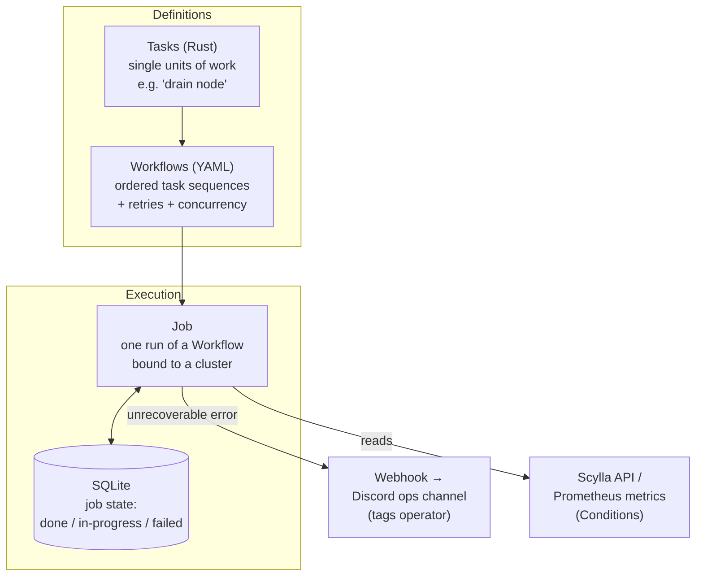

# Discord: Turning a 36-Hour Manual Database Ritual into a "Kick It Off and Check Back Later" Workflow

> Discord stores its messages, channels, servers, and most user data in **ScyllaDB**
> — a high-throughput database (a faster, C++ reimplementation of Apache Cassandra)
> that holds trillions of messages across dozens of clusters. A tiny team runs all of
> it, and the riskiest recurring chore — standing up a full production replica to test
> a new database release — used to take **a day and a half of babysitting a terminal**,
> where one mistake meant starting over. This case study is a lesson every senior
> engineer needs: *when your operations are held together by fragile ad-hoc scripts,
> the fix isn't a bigger script — it's a small framework of safe, idempotent, resumable
> primitives.* Everything here comes from Discord's engineering post,
> "How Discord Automates ScyllaDB Clusters at Scale."

## The problem: a 36-hour operation that couldn't be interrupted

Start with the intuition. Before Discord ships a new **ScyllaDB** version to
production, they want to prove it won't corrupt or lose data. So they build a
**shadow cluster** — a full production-shaped replica that receives a copy of live
writes (via a **dual-write** pipeline, where the app writes to both the real cluster
and the shadow one) so the new release runs against realistic data and traffic before
it touches anything customers depend on.

Building that shadow cluster by hand was brutal. It meant provisioning nodes, joining
them to the cluster **one at a time** (ScyllaDB deliberately limits you to a single
node joining at once so the cluster isn't overwhelmed), validating that replication
caught up, and wiring the dual-write pipeline — a sequence the post describes as
roughly **"a day and a half"**, a **36-hour operation**. Worse, it wasn't
interruptible: *"any failure between steps 7 to 12 meant starting over."* An engineer
had to sit and watch, for a day and a half, hoping nothing went wrong.

The stated goal: shrink that ordeal to **"less than two hours."**

> [!KEY-TAKEAWAY]
> The transformation Discord is proud of isn't just "faster." It's a change *in kind*:
> *"'Sustained attention for a full day' became 'kick it off and check back later.'"*
> The scarce resource being saved is not CPU time — it's a scarce human's uninterrupted
> attention. That reframing (automate for *unattended safety*, not just speed) is the
> heart of the case study.

## Why the naive approach broke: ad-hoc scripts nobody could run safely

Discord didn't start from zero. Over years the team automated incrementally with
**ad-hoc Python and bash scripts**. In the post's words, they *"got the job done, but
they were fragile and required significant institutional knowledge to operate safely."*
That last phrase is the real cost: only a few people could run them without breaking
something.

The scripts failed in three concrete ways the post calls out:

- **Unsafe.** It was easy to run steps in the wrong order, against the wrong nodes,
  with no precondition checks to stop you. Nothing verified the cluster was in a fit
  state before acting.
- **Unrecoverable.** There was no memory of progress. *"Any failure between steps 7 to
  12 meant starting over"* — a crash 30 hours in threw away 30 hours of work.
- **Hard to extend.** Adding a new operation meant copying and modifying an existing
  script, so complexity and duplication compounded with every new task.

The lesson generalizes far beyond databases: a pile of scripts is not automation. Real
operational automation needs **safety (preconditions), recoverability (state), and
composability (reuse without copy-paste)** — none of which a growing script collection
gives you for free.

## The architecture: Scylla Control Plane (SCP), built in Rust

Discord's answer is the **Scylla Control Plane (SCP)**, a framework written in **Rust**
that layers three concepts on top of each other: **Tasks**, **Workflows**, and
**Jobs**. Think of it as: small safe verbs (Tasks) → composed into recipes (Workflows)
→ executed against a real cluster (Jobs).

### Tasks — the safe primitives

A **Task** is a single unit of work, like "drain this node." There are two flavors:
*node tasks* (act on one node) and *cluster tasks* (coordinate across the whole
cluster). Every task is defined via a Rust trait that requires three methods:
`name()`, `preconditions()`, and `execute()` — so **safety checks are structurally
mandatory**, not an afterthought a script might skip.

A crucial rule: **all tasks must be idempotent** — running one twice has the same
effect as running it once. This is what makes retries safe: if a task half-finished
and gets retried, it won't double-apply or corrupt state.

A special task type is a **Condition** — a task that *blocks* until some criterion is
met, polling **Scylla's API** or **Prometheus** metrics (Prometheus is a metrics/
monitoring system) until the check passes or times out. Example: an `is-up-normal`
condition waits for a joining node to report healthy, with a timeout of `86400`
seconds (24 hours) and a `success_window_seconds` of `60` (it must stay healthy for a
full 60 seconds to count).

### Workflows — recipes in YAML, not compiled code

A **Workflow** describes a sequence of tasks plus retry behavior, abort behavior, and
parallelism. Critically, workflows are defined in **YAML**, not Rust. The post's
reasoning: changing a workflow shouldn't require recompiling and redeploying a Rust
binary — an operator can tune retries or concurrency by editing YAML. **Template
variables** let one workflow be parameterized at runtime.

### Jobs — one execution, with careful parallelism controls

A **Job** is a single execution of a workflow bound to a specific cluster. Jobs support
**targeting** — you can point them at an explicit node list, an entire availability
zone (AZ), or all nodes. Two parameters govern how much runs in parallel:

- **`concurrency_unit`** groups nodes for parallel execution. Setting it to `zone`
  prevents operating on multiple availability zones simultaneously — which matters
  because acting across zones at once could cause **quorum loss** (a distributed
  database needs a strict majority of replicas available to safely serve reads/writes;
  knock out too many at once and you lose it).
- **`concurrency_limit`** caps how many nodes run a task at the same time.

The `add_nodes_to_cluster` workflow, for example, uses `concurrency_unit: zonal` with
`concurrency_limit: 1` to join nodes **one at a time** — deliberately keeping Scylla's
single-node-join limitation rather than fighting it.

## Resumability: SQLite-backed job state

The fix for the "start over from scratch" nightmare is **resumability**. SCP tracks
job state in a **SQLite** database — which tasks completed on which nodes, which are
in progress, which failed. If a job is interrupted (a deploy, a crash, an operator
`Ctrl-C`), it **resumes from where it left off** instead of restarting.

Discord notes they deliberately chose a **file-based database (SQLite)** for
operational simplicity rather than a heavier, more complex backend — a nice example of
picking the boring, low-operational-cost tool for a control-plane concern.

## Error classification: recoverable vs. unrecoverable

SCP splits errors into two buckets, and this distinction is one of the post's sharper
lessons:

- **Recoverable errors** trigger the workflow's configured retries.
- **Unrecoverable errors** halt execution *immediately*, fire a **webhook
  notification** to a Discord ops channel, and **tag the operator** so a human looks.

The gotcha the post warns about: the tempting instinct is to mark *everything*
recoverable so the system keeps trying. That's dangerous — *"a retry loop on a
genuinely broken state can cause real harm."* Retrying blindly against a corrupt or
truly-stuck cluster can make things worse, so correctly classifying errors is subtle
and important.

## Operating it: the tooling around SCP

The system is driven through a CLI called **`scyllactl`** — e.g.
`scyllactl node-task`, `scyllactl cluster-task`, and
`scyllactl job run add_nodes_to_cluster`. It integrates with existing infrastructure
tooling the team already used: **Salt** (configuration management, via
`salt-highstate`), **systemd** (Linux service management), and **SIGHUP** signaling
(a Unix signal often used to tell a running process to reload). The point: SCP is a
control plane that *orchestrates* familiar tools, not a rewrite of the whole stack.

## Concrete numbers from the post

Discord gives real figures — quote these directly:

- **Team size:** a **7-person** Persistence Infrastructure team manages the databases.
- **Fleet scale:** ScyllaDB spans **"dozens of clusters, with hundreds of database
  nodes in total."**
- **Data scale:** ScyllaDB stores messages, channels, servers, and most user data —
  referenced in Discord's prior posts as **trillions of messages**.
- **Before:** the shadow-cluster operation took **"a day and a half"** — a
  **36-hour operation**.
- **After (target):** **"less than two hours."**
- **Concrete example:** a **"two-hour rolling restart across a 30-node cluster."**
- **Config constants:** `is-up-normal` timeout `86400` seconds (24 hours) with a
  `success_window_seconds` of `60`; default `compactions_nominal_timeout_seconds` of
  `90`.
- **Other databases the same team manages:** Elasticsearch and Postgres.

Note: the post does not give a precise latency or throughput figure for ScyllaDB
itself, nor an exact "X% fewer incidents" style metric — the headline number is the
time collapse (36 hours → under 2 hours) and the qualitative shift to unattended
operation.

## Trade-offs, gotchas, and lessons

- **Incremental delivery was the point, not a nicety.** The post's blunt line:
  *"A framework that no one uses because it's too complex to onboard is worthless!"* A
  perfect framework that's too hard to adopt loses to the fragile scripts people
  actually run.
- **Error classification is genuinely hard.** Marking everything recoverable feels
  safe but *"a retry loop on a genuinely broken state can cause real harm."* The
  recoverable/unrecoverable split is where a lot of the real engineering judgment
  lives.
- **Idempotency isn't free.** Making every task safe to re-run *"isn't always easy,"*
  but it's the non-negotiable precondition for safe retries and resumability.
- **Webhooks mattered more than expected.** Being pinged when something needs you,
  versus babysitting a terminal for hours, is *"a wildly different experience."* The
  win is as much about *trust* (you can walk away) as about automation.
- **Respect the database's own limits.** Discord kept Scylla's single-node-join
  constraint (`concurrency_limit: 1`) rather than parallelizing joins — automating
  *within* the system's safe envelope, not around it.
- **YAML vs. Rust boundary is a deliberate choice.** Primitives (tasks) live in
  compiled, type-checked Rust; policy (sequencing, retries, concurrency) lives in YAML
  so it can change without a binary deploy. Choosing *what belongs in code vs. config*
  is a reusable design decision.

## Common follow-up questions

- **"Why build a framework instead of just cleaning up the scripts?"** Because the
  scripts' problems were structural, not cosmetic: no preconditions (unsafe), no
  progress tracking (unrecoverable), and copy-paste growth (unextensible). SCP's three
  layers directly answer those — mandatory `preconditions()`, SQLite job state, and
  composable tasks/workflows — which no amount of tidying a bash pile gives you.
- **"Why is idempotency the linchpin?"** Retries and resumability both re-run tasks. If
  a task weren't idempotent, a retry after a partial failure could double-apply an
  operation and corrupt cluster state. Idempotency is what makes "just retry it" and
  "resume from where we left off" safe rather than reckless.
- **"How does SCP survive a crash halfway through a 36-hour job?"** Job state lives in
  a SQLite database recording which tasks finished on which nodes. On restart the job
  resumes from the last completed step instead of starting over — killing the old
  "any failure between steps 7 to 12 meant starting over" problem.
- **"Why put workflows in YAML but tasks in Rust?"** Tasks are safety-critical
  primitives that benefit from Rust's type checking and compilation. Workflows are
  policy — ordering, retries, concurrency — that operators need to tune quickly; YAML
  lets them change behavior without recompiling and redeploying a binary.
- **"What stops SCP from taking down a whole region?"** The `concurrency_unit` and
  `concurrency_limit` controls. Grouping by `zone` prevents simultaneous operations
  across availability zones (which could break quorum), and the limit caps how many
  nodes act at once. Node joins run one at a time by design.
- **"Why fire a webhook instead of just retrying harder?"** Because some failures are
  unrecoverable, and blindly retrying against a genuinely broken cluster can cause real
  harm. SCP halts on unrecoverable errors and pings a human, trading a bit of manual
  intervention for safety — while still auto-retrying the transient stuff.
- **"Where else does this pattern apply?"** Any long, risky, multi-step operational
  procedure: rolling upgrades, data migrations, fleet-wide config rollouts,
  Kubernetes-style reconciliation. The reusable shape is *idempotent primitives +
  declarative composition + durable state + safe concurrency limits + alert-on-halt.*

## References

- Discord Engineering — "How Discord Automates ScyllaDB Clusters at Scale":
  https://discord.com/blog/how-discord-automates-scylladb-clusters-at-scale
- ScyllaDB (the database Discord runs): https://www.scylladb.com/
- Prometheus (metrics system SCP Conditions poll): https://prometheus.io/
