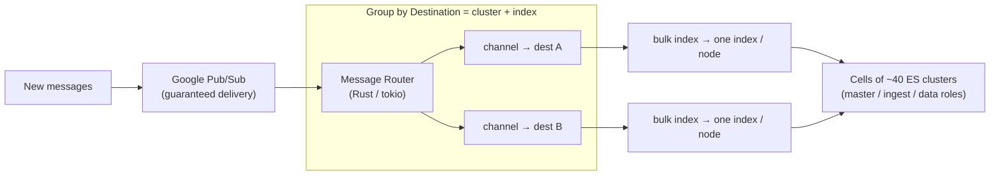

# Discord: Indexing Trillions of Messages for Search

> Discord lets you search across every message you can see — in a small friend
> group or a server (a "guild") with millions of members. Behind that search box
> sits an **Elasticsearch** cluster fleet (Elasticsearch is an open-source
> full-text search engine) that has to ingest new messages continuously while
> serving fast queries. Their first design, built in 2017, "began to exhibit a few
> cracks" as volume grew: it dropped messages, amplified single-node failures into
> huge outages, and couldn't be upgraded without downtime. This case study walks
> the rebuild — and it's a goldmine of senior-interview ideas: *how do you shard a
> write-heavy search index, isolate failures during bulk ingestion, and special-case
> your outliers?* All facts are drawn from Discord's engineering post
> "How Discord Indexes Trillions of Messages."

## The problem: search over trillions of messages, without drowning

Start with the shape of the workload. Discord indexes *trillions* of messages, and
the volume only grows. Two very different access patterns share one system:

- **Ingestion** — every new message must become searchable quickly. This is a
  firehose of small writes, all day, every day.
- **Query** — when you search, results must come back fast, and the search must span
  everything you're allowed to see (a guild's history, or your DMs across many
  conversations).

The engineering bar Discord set for the rebuild was plain: search had to be
**performant, cost-effective, scalable, and easy to operate**. That last word —
*operate* — is the one juniors forget and the one that sank the old system. A search
platform you can't upgrade or restart safely is a liability no matter how fast it is.

Two pieces of vocabulary you need before we go further. A **shard** is one slice of
a search index; a large index is split into shards so it spreads across many
machines. **Sharding** is the rule that decides *which* shard a given message lands
in — Discord shards by **guild** (server) for guild messages, so all of one server's
messages sit together and a guild search hits one place.

## Why the old system broke: four cracks under load

The 2017 system used Elasticsearch with messages sharded across indices on **two
clusters** (sharded by guild, or by DM). A **Redis-backed** realtime queue fed
worker processes that pulled batches and did **bulk indexing** (sending many
documents to Elasticsearch in one request). At scale it failed in four distinct
ways, each worth understanding on its own:

1. **Redis dropped messages.** When queues backed up — often right after a node
   failure, exactly when you can least afford it — Redis maxed out its CPU and
   *lost* messages. A search index that silently loses writes is corrupt in a way
   users notice: their message just isn't findable.

2. **Bulk indexing amplified failures instead of absorbing them.** A batch of 50
   messages could fan out to 50 *different* nodes. If any one of those operations
   failed, the *whole batch* was re-enqueued and retried. Do the math Discord did:
   with **100 nodes** and batches of 50, losing a single node meant **~40% of bulk
   index operations failing**. One sick machine poisoned nearly half the pipeline.

3. **Giant clusters were slow and fragile.** Clusters grew to **over 200 nodes and
   terabytes of data**. The more nodes a bulk request fanned out to, the slower
   indexing got; and every extra node is another thing that can fail. Worse, the
   **master node** (the coordinator that holds the cluster state — the map of every
   index, shard, and node) doesn't scale with the cluster: a huge cluster could
   push the master into **out-of-memory (OOM)**, which stalled indexing, grew
   backlogs, and timed out queries.

4. **No safe upgrade path.** Rolling restarts weren't feasible on those clusters, so
   there was no painless way to patch or upgrade. When the **log4shell**
   vulnerability landed (a critical remote-code-execution bug in the log4j logging
   library), Discord had to take search *"fully offline for a maintenance period"*
   to patch it. And Lucene's **`MAX_DOC` limit** — roughly **2 billion messages per
   index** (Lucene is the library underneath Elasticsearch) — meant the biggest
   guilds would eventually break indexing entirely; recovery meant hunting down and
   deleting spam guilds with the Safety team.

> [!KEY-TAKEAWAY]
> The old system's failures cluster into three lessons that drive the whole rebuild:
> (1) a **guaranteed-delivery queue** beats a best-effort one for writes you can't
> lose; (2) **batch by destination** so one bad node can't poison a whole batch; and
> (3) **many small clusters** beat a few giant ones, because coordination overhead
> and blast radius both grow with cluster size.

## The rebuild: cells of small clusters on Kubernetes

The new architecture is a set of deliberate reversals of each old failure. Walk them
in order.

**Kubernetes + the ECK operator.** Elasticsearch now runs on Kubernetes, deployed
via the **Elastic Cloud on Kubernetes (ECK)** operator (an "operator" is software
that automates running a stateful system on Kubernetes). This is what buys back
*operability*: automatic OS upgrades and **safe rolling restarts with no service
impact** — the exact thing that was impossible during log4shell. (They also set
`log4j2.formatMsgNoLookups=true` to neutralize the log4shell vector.)

**Cells of many small clusters.** Instead of two 200-node monsters, Discord groups
smaller Elasticsearch clusters into a logical **cell**. Across the fleet they now run
about **40 Elasticsearch clusters** holding **thousands of indices**. Smaller
clusters mean smaller cluster state (no master OOM), less bulk-index fanout, and
faster recovery when something breaks.

**Dedicated node roles.** Within a cluster, nodes are split by job so coordination
and data work can't starve each other:

- **Master-eligible nodes** — reserved resources purely for cluster coordination.
- **Ingest nodes** — *stateless* (they own no data), so they can scale up to absorb
  ingestion spikes without touching the data layer.
- **Data nodes** — sized with enough heap (JVM memory) to hold shards and serve
  indexing and queries.

**Zonal resilience.** Copies are spread across availability zones (isolated
data-center rooms with independent power/network): **3 master-eligible nodes** (one
per zone), **at least 3 ingest nodes** (one per zone), and data nodes placing a
shard's **primary and replica in different zones** using Elasticsearch's **shard
allocation awareness** and **forced awareness**. So losing a whole zone still leaves
a full, queryable copy.

## Making ingestion durable and failure-isolated

Two components replace the fragile Redis-and-workers path, and together they fix
cracks #1 and #2.

**Google Pub/Sub** replaces Redis as the realtime queue. Pub/Sub offers **guaranteed
message delivery**, so a backlog no longer means *lost* messages — it just means a
delay. That is the central trade of the rebuild: when Elasticsearch is struggling,
ingestion now *slows down* instead of *dropping data*. Durability is bought with
latency, and for a search index that's the right trade.

**The Message Router** (written in **Rust** on the **tokio** async runtime) is where
the failure-isolation magic lives. It streams messages off Pub/Sub and, for each
message, computes a **`Destination`** — the specific *cluster + index* that message
belongs to. It then spawns an unbounded channel and a tokio task **per destination**,
groups messages by destination, and bulk-indexes each group. The payoff: every bulk
operation now talks to a **single index on a single node**. The old fan-out-to-50-nodes
pattern is gone, so one unhealthy node can no longer fail 40% of your batches — it can
only affect the destinations that actually live on it.

> [!INTERVIEW]
> This is the crisp senior insight: the old bulk indexer failed because a batch's
> *scope* (50 messages → 50 nodes) was wider than the *unit of failure* (one node).
> Discord narrowed the batch scope to match the failure domain — group by
> destination so each bulk request hits exactly one index/node. Whenever you batch
> writes across a distributed store, ask "does one failed shard poison the whole
> batch?" If yes, re-batch so the batch boundary lines up with the shard boundary.

## Sharding DMs vs. guilds: two different partition keys

Not all searches look the same, so Discord shards different message types by
different keys — a great example of *"choose your partition key from your query
pattern."*

- **Guild messages** are sharded by **`guild_id`** in a `guild-messages` cell. A
  guild search touches one guild's data, so co-locating it is ideal.
- **Direct messages** are trickier: a DM cross-search spans *all* your
  conversations. So DMs are sharded by **`user_id`** in a separate
  `user-dm-messages` cell. The cost: each DM is **stored twice** — once under each
  participant — so that either person's cross-DM search stays a single-shard lookup.
  Discord accepts double storage to keep the read path fast.

The rebuild's re-index (touching every message) was also the *opportunity* to change
these sharding dimensions — you rarely get to re-partition trillions of rows, so they
did it while everything was already moving.

## BFGs: special-casing the outliers ("Big Freaking Guilds")

The most memorable piece. A handful of enormous guilds approach Lucene's ~2-billion
`MAX_DOC` ceiling — the thing that used to *break* the old system. Discord's answer is
to special-case them as **BFGs (Big Freaking Guilds)** and give each its own dedicated
cluster with **multiple primary shards** so queries run in parallel across shards.

The reindexing dance to migrate a BFG to a bigger index — without downtime and while
still serving live search — is a textbook zero-downtime migration:

1. Identify a BFG approaching `MAX_DOCS` on its current `index-a`.
2. Create `new-bfg-index` with **2x the primary shard count**.
3. **Dual-index** new messages to *both* `index-a` and `new-bfg-index`.
4. **Backfill** all historical messages into the new index — while queries are still
   served from `index-a`.
5. Once the backfill is complete, **switch query traffic** to `new-bfg-index`.
6. After you're confident in the new index, clean up the old one.

> [!TIP]
> Note the shard-count nuance. For the *typical* guild, Discord prefers a **single
> primary shard** — no query fan-out, no coordination overhead. Multiple shards only
> help a BFG, and only *"when the cost of coordination does not exceed the cost of
> querying."* More shards is not "more better"; it's a trade you make only when one
> shard can no longer hold or serve the data. Discord's index sizing guideline is
> around **200M messages and 50GB of data** per index.

## Concrete numbers from the post

| Metric | Value |
|---|---|
| Messages indexed | "trillions" |
| Indexing throughput vs. legacy | ~**2x** (double) |
| Median query latency | **500ms → <100ms** |
| p99 query latency | **1s → <500ms** |
| Elasticsearch clusters (new) | ~**40** |
| Indices (new) | "thousands" |
| Legacy cluster size | **over 200 nodes**, terabytes of data |
| Legacy clusters | **2** |
| Lucene `MAX_DOC` | ~**2 billion** messages per index |
| Index sizing guideline | ~**200M messages / 50GB** |
| Single-node failure (legacy) | ~**40%** of bulk ops fail (100 nodes, batch 50) |
| Master / ingest nodes | **3** each (one per zone) |
| BFG shard scaling | **2x** primary shard count |

## Trade-offs and gotchas, gathered

- **Durability over latency (Pub/Sub):** guaranteed delivery means Elasticsearch
  trouble now *slows* ingestion rather than losing messages — a deliberate,
  correct trade for a search index.
- **DM double-storage:** sharding DMs by `user_id` stores each message twice. Extra
  storage buys a single-shard cross-DM search.
- **Shard count is a trade, not a dial to max out:** single primary shard is best for
  the common guild (no fan-out); multiple shards only pay off for BFGs where query
  cost exceeds coordination cost.
- **Batch scope must match the failure domain:** the whole 40%-failure disaster came
  from batches spanning more nodes than the unit of failure. Group by destination.
- **Cluster state doesn't scale:** giant clusters OOM'd the master. Many small
  clusters keep coordination cheap and blast radius small.
- **Operability is a first-class requirement:** if you can't roll-restart to patch a
  log4shell-class bug without downtime, your architecture has already failed — that's
  what ECK/Kubernetes fixed.

## Common follow-up questions

- "Why did one node failure fail ~40% of batches in the old system?" Because a
  batch of 50 fanned out to up to 50 nodes, and *any* failed operation re-enqueued
  the whole batch. With 100 nodes, a single dead node touched ~40% of in-flight
  batches. The fix — group by destination so each bulk request hits one index/node —
  shrinks the batch's blast radius to one failure domain.
- "Why migrate from Redis to Pub/Sub?" Redis was best-effort: under backlog it
  maxed CPU and dropped messages, corrupting the index silently. Pub/Sub guarantees
  delivery, so backlogs cause delay, not data loss. You trade a little latency for
  durability.
- "Why many small clusters instead of a couple of big ones?" The master node's
  cluster state doesn't scale, so huge clusters OOM the master; bulk fan-out grows
  with node count; and more nodes means more failures and slower recovery. ~40 small
  clusters keep coordination cheap and blast radius contained.
- "Why shard DMs by user but guilds by guild?" Query pattern. A guild search hits
  one guild → shard by `guild_id`. A DM cross-search spans all your conversations →
  shard by `user_id` and store each DM twice, so either participant's search is a
  single-shard read.
- "When do multiple primary shards actually help?" Only when one shard can't hold
  or serve the data — i.e. a BFG near `MAX_DOC`, where parallel query across shards
  beats the coordination overhead. For a normal guild, a single primary shard is
  faster because there's no fan-out.
- "How do they grow a BFG's index without downtime?" Dual-index new writes to old
  and new indices, backfill history into the new (2x-shard) index while queries still
  read the old one, then flip query traffic once backfill completes, then clean up
  the old index.

## References

- Discord Engineering — "How Discord Indexes Trillions of Messages":
  https://discord.com/blog/how-discord-indexes-trillions-of-messages
- Elasticsearch docs — shard allocation awareness / forced awareness, bulk API,
  Elastic Cloud on Kubernetes (ECK): https://www.elastic.co/guide/
