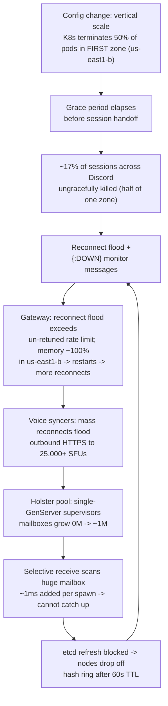

# Discord: How a Routine Scale-Up Cascaded Into a 3-Hour Voice Outage

> On March 25th, 2026, Discord's voice and video broke for over three hours — users
> hit "Awaiting Endpoint" and couldn't join calls. The trigger was almost comically
> small: a *routine* config change to make some servers bigger. That change killed
> 17% of live sessions at once, and the reconnect storm that followed found a hidden
> single-threaded bottleneck deep in Discord's Elixir stack that no one knew was
> there. This case study walks through the full cascade — from a Kubernetes
> scale-down, through a rate limit that let too much traffic through, into a
> mailbox that grew to nearly a million messages — and how Discord clawed the
> cluster back to health. Every fact here is drawn from Discord's own postmortem,
> "Behind the Scenes of the 3/25/26 Voice Outage."

## The problem: voice is stateful, so losing servers means losing calls

Start with intuition. A web request is *stateless* — if the server handling it dies,
you retry on another server and nobody notices. A **voice call is stateful**: there's
a live session tracking who's in the call, where their audio is being routed, and
which media server is mixing it. If the process holding that session dies, the call
drops. You can't just "retry" a live conversation.

Discord runs this on a **sessions cluster** — the control plane that knows about
every active voice session — plus a fleet of **voice syncers** (processes that keep
each session in sync with the media servers actually moving the audio). The media
servers themselves are **SFUs** — *Selective Forwarding Units*, servers that receive
each speaker's audio/video stream and forward it to the other participants (instead
of every user connecting peer-to-peer to every other user).

The whole system is built on the **BEAM** — the virtual machine that runs **Elixir**
and **Erlang**. The BEAM's core model is millions of tiny isolated *processes* that
communicate only by sending each other messages. Each process has a **mailbox** (an
inbox queue), and it handles messages one at a time. This model is famous for
resilience — but as we'll see, it has a sharp edge when one critical process falls
behind on its mailbox.

> [!KEY-TAKEAWAY]
> The failure was not one bug. It was a *cascade*: a Kubernetes scale-down killed
> sessions ungracefully → a reconnect flood hit an un-retuned rate limit → the flood
> reached a single-threaded connection-pool supervisor whose mailbox exploded →
> processing slowed to a crawl → service discovery timed out and dropped nodes off
> the hash ring → recovering nodes immediately drowned in failover traffic. Any one
> link, held, would have stopped it.

## What went wrong: a "make the servers bigger" change killed 17% of sessions

The trigger was **vertical scaling** — a config change that gives each server *more*
CPU and memory but runs *fewer* pods (a **pod** is a Kubernetes unit of one or more
containers). Fewer, beefier boxes; same total capacity. Routine.

But to shrink the pod count, Kubernetes has to terminate the old pods. The change was
rolled out **one zone at a time**, and it was deployed to the **first zone only**
(us-east1-b) at 12:13 PDT, where Kubernetes **terminated 50% of the pods** in that
zone. Normally that's safe: pods are supposed to *drain* first — hand off their
sessions gracefully before dying. Here a **safety-check delay** meant the "termination
grace period in Kubernetes elapsed before handoffs could begin." The pods were
force-killed mid-flight.

Here's the arithmetic that made a single-zone change hurt: sessions run **balanced
across three zones**, so each zone holds ~1/3 of all sessions. Killing 50% of the pods
in *one* zone therefore ungracefully stopped **~17% of all sessions across Discord**
(half of one-third ≈ 17%) at once. Every one of those dead sessions fired a
process-monitor `{:DOWN, ...}` message and, on the client side, an immediate reconnect
attempt. The storm had begun.

## The cascade, link by link

**1. The gateway got flooded.** The **gateway** is the front door — the persistent
connection every client holds to Discord. The reconnect flood hit a **rate limit that
had not been re-tuned** for the new, higher pod count, so more traffic than expected
got through. Memory spiked to **"nearly 100% capacity"** in one zone (us-east1-b),
which caused restarts — and those restarts made reconnections fail over to *other*
zones, spreading the load instead of containing it.

**2. The voice syncers got flooded.** All those reconnections meant mass outbound
HTTPS connections to the media layer — **"more than 25,000 external Selective
Forwarding Unit (SFU) instances."** There are only **15 voice syncers** carrying that
outbound load.

**3. The real bottleneck: one single-threaded supervisor.** This is the heart of the
story. Those outbound connections went through Discord's **Holster** library, which
pools **gun** (an Erlang HTTP client) behind **two single-GenServer supervisors**. A
**GenServer** is a single BEAM process — it handles one message at a time. Worse,
this supervisor uses a **selective receive**: to find the message it wants, it scans
its *entire* mailbox. Discord's testing confirmed that "this selective receive on a
supervisor with a ~100k mailbox queue adds **~1ms to process spawn time**."

That's fatal at scale. The mailboxes grew **from 0M to nearly 1M** messages. With,
say, "1M with 100/s spawn requests including 1ms spawn delay," the process can never
catch up — every scan gets slower as the queue it must scan gets longer. It is a
death spiral in a single process.

**4. Service discovery timed out.** That same jammed process also handled **etcd**
service-discovery refreshes (**etcd** is the distributed key-value store Discord uses
to track which instances are alive). With the process stuck, refreshes stopped, and
instances **dropped off the hash ring after their 60-second time-to-live (TTL)
expired**. Now sessions couldn't even find a healthy home — feeding *more* reconnect
churn back into the top of the cascade.

## Why recovery was so hard: the cold-start thundering herd

The natural fix — restart the stuck nodes — kept *almost* working and then failing.
At 12:43 a restart of the voice syncers gave brief recovery; 12:47 restarting
`Holster.Pool DynamicSupervisor` gave brief recovery; a 13:05 full-cluster restart
had every node's mailbox growing again by 13:09.

The reason is a **cold-start thundering herd**: a freshly restarted, empty instance
looks healthy, so the load balancer immediately steers the *entire* backlog of
reconnecting sessions at it — and that lone cold instance instantly re-enters the
exact overload it was restarted to escape. Restarting one node just moved the fire.

It didn't help that the first rate limit they reached for was **"especially
ineffective."** A guild-level limit throttled only the spawning of the *coordinator*
syncer while allowing **"unbounded spawning of child syncers"** — so it capped the
wrong thing and let the real flood through.

One detail that shows the mechanism cleanly: a single instance, **2-8, survived** the
whole event. Discord places each entity on a **primary, secondary, and tertiary**
instance, so 2-8 was only ever carrying its **"3/15 share"** of the load — light
enough to stay under the cliff while its 14 peers went over it.

## How they recovered: rate limits, then double the supply

Two moves, in order:

- **Retune the rate limits.** They tuned the **syncer-creation rate limits** on the
  calls, streams, and guilds services — this time limiting the thing that actually
  mattered. Restarts *with rate limits in place* (13:43) started sticking; instance
  2-3 recovered fully at 14:03.
- **Double the cluster.** They **manually provisioned 15 brand-new instances** —
  VMs stood up via **Terraform**, configured by **Salt**, and registered into etcd —
  which **halved the per-instance syncer count**. Framed as economics: when you can't
  reduce demand fast enough, increase supply so each box sits below its cliff.

By 14:15, 5 instances were restarted (4 fully recovered) and the 15 new instances had
doubled capacity; the **final instance recovered at 14:26** and the cluster was
healthy. Total user-visible degradation: **12:13 to 15:30 PDT**.

## Trade-offs, gotchas, and the fixes that followed

- **Graceful drain is a *distributed* invariant, not a local one.** The scale-down
  assumed pods would drain before dying; a grace-period race broke that assumption
  silently. Discord's fix: a **validating admissions webhook** that *rejects* a
  Kubernetes scale-down until the pods have actually drained their entities. Make the
  safety check a hard gate, not a hope.
- **One single-threaded process is a scaling cliff hiding in plain sight.** The Holster
  supervisor worked fine for years — until traffic found it. Fixes: replace it with a
  **PartitionSupervisor** (spreads work across many independent supervisors that run
  concurrently) and **move gun's lifecycle into Holster.Pool**, deleting the gun
  supervisor entirely so there's no single mailbox to jam.
- **Selective receive is a trap at scale.** Scanning a mailbox is O(queue length); the
  more behind you are, the slower you get. This is a BEAM-specific footgun worth
  knowing: a "hot loop" in a single-threaded message-passing runtime degrades both the
  service and the user experience, which is why the takeaway is to rate-limit, *drop*
  messages, and use aggressive timeouts rather than let a queue grow unbounded.
- **Rate limits must be re-tuned when capacity changes.** The gateway limit was sized
  for the old pod count and quietly let too much through after the scale-up. A limit
  you never revisit is a limit that's wrong.
- **The bottleneck moves.** Their databases (**ScyllaDB**) held up fine this time — the
  pressure simply relocated to voice. As the post puts it, "a sufficiently large
  traffic spike will find a bottleneck in your system." Fixing one just reveals the
  next.

> [!INTERVIEW]
> If asked "walk me through an outage," this is a model structure: name the *trigger*
> (routine scale-down), the *amplifier* (un-retuned rate limit + failover spreading
> load), the *bottleneck* (single-threaded supervisor with a selective-receive
> mailbox), and the *trap that blocked recovery* (cold-start thundering herd). Then
> give the two-axis fix: reduce demand (rate limits) and increase supply (double the
> cluster), followed by durable remediations (admission webhook, PartitionSupervisor).

## Common follow-up questions

- Why did the change drop ~17% of sessions rather than 50%? The rollout was
  per-zone and only reached the *first* zone before being halted. Sessions are balanced
  across three zones (~1/3 each), so terminating 50% of the pods in one zone hit about
  half of one-third — ≈17% of all sessions. Had the same 50% cut rolled out to all
  three zones, it would have been ~50% of the fleet.
- Why did restarts recover the node and then fail again? Cold-start thundering
  herd: an empty, "healthy"-looking node attracts the entire reconnect backlog at once
  and immediately re-enters overload. Recovery only stuck once rate limits capped the
  inflow so a cold node could warm up under a survivable load.
- What actually made the supervisor slow — the mailbox size or the code? Both,
  together. The code uses a *selective receive* that scans the whole mailbox, so cost
  grows with queue length; once the mailbox hit ~100k, each spawn took ~1ms extra, and
  at ~1M it could never catch up. Small mailbox, no problem; huge mailbox, death spiral.
- Why did instance 2-8 survive? Placement is primary/secondary/tertiary, so any
  instance carries only a "3/15 share" of load. 2-8's share kept it just under the
  overload cliff that its peers crossed.
- How does a PartitionSupervisor fix this? It replaces the single supervisor with
  many independent ones running concurrently, so work is spread across processes and no
  single mailbox becomes the chokepoint — turning a single-threaded cliff into
  parallel, bounded queues.
- Why manually provision VMs mid-incident instead of just autoscaling? They needed
  supply *now* and control over placement; standing up 15 instances via Terraform/Salt
  and registering them in etcd halved per-instance load deterministically, rather than
  waiting on an autoscaler that might feed the thundering herd.

## References

- Discord Engineering — "Behind the Scenes of the 3/25/26 Voice Outage":
  https://discord.com/blog/behind-the-scenes-of-the-3-25-26-voice-outage
- Fred Hébert — *Erlang in Anger* (BEAM production-debugging reference cited in the
  post; introspection via the Recon library): https://www.erlang-in-anger.com/
