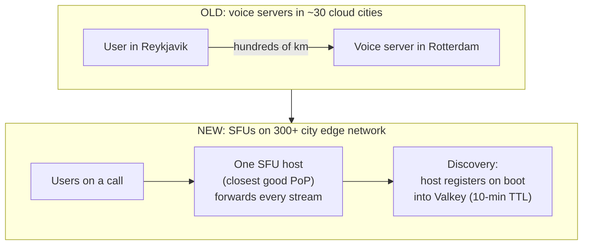

# Discord: Moving Real-Time Voice to the Edge for Lower Latency

> Discord is where tens of millions of people hang out in live voice and video calls
> while gaming or chatting. The whole product feels good only when it feels *instant* —
> when a friend's voice sounds like they're in the same room. That feeling is a latency
> budget, and latency is mostly a function of physical distance: "Every millisecond of
> network distance adds latency to every packet." This case study is about how Discord
> moved its voice servers off a handful of cloud data centers and onto a network with
> hundreds of edge locations to get *physically closer* to users — and, more
> interestingly, all the low-level operating-system and scheduling gremlins that woke
> up once real-time media started running on shared, general-purpose edge hardware.
> Everything below is drawn from Discord's engineering post "How we moved Discord's
> voice to the edge." Where the post gives a hard number, it's quoted; where it doesn't,
> that's called out.

## The problem: distance is latency, and latency kills the feeling of presence

Start with the physics. A voice call is a stream of tiny **UDP packets** — small
network messages sent with no delivery guarantee, chosen because for live audio it's
better to drop a late packet than wait for it — flowing between everyone on the call in
real time. Discord routes those packets through a server that sits between the
participants. The farther that server is from you, the longer every single packet
takes, and past a threshold the call stops feeling live: you start talking over each
other, echoes appear, the sense of shared presence breaks.

So the design goal is blunt and stated by the team as their core philosophy: **"Closer
servers make better calls."** The question the whole project answers is: *how do you put
a voice server physically near every user on Earth, not just the ones who happen to live
near a big cloud data center?*

> [!KEY-TAKEAWAY]
> The senior-interview framing: "Design a global real-time media system where server
> proximity drives quality, then deploy it onto shared edge hardware you don't fully
> control." Discord's answer is a **one-call-per-server model** discovered through a
> **register-on-boot service directory**, deployed via **slow, metrics-in-the-loop,
> peering-checked regional ramps** — and the hard-won lesson that on shared hardware,
> the bottleneck moves from geography to **OS scheduling and NIC queue contention**.

## Why the old setup fell short: coverage limited by where clouds have data centers

The legacy architecture ran Discord's voice servers inside the big cloud providers'
data centers. That sounds fine until you look at the map:

- The closest voice server was in one of roughly **30 cities worldwide** — only the
  places where major cloud providers actually build. Hyperscalers (the giant cloud
  operators like AWS/GCP/Azure) run only about **30 to 40 regions globally**, so whole
  countries had no nearby option.
- **Underserved locations suffered.** A user in Reykjavik, Iceland or Auckland, New
  Zealand had thin coverage. An Icelandic user was routed all the way to a server in
  Rotterdam, "several hundred kilometers away" — every packet paying that distance tax.

There was also a second, internal scaling problem hiding behind the coverage problem.
Service discovery — the directory that tells the system *which voice server is live and
where* — ran on **etcd** (a distributed key-value store used for coordination). It had
been built years earlier for a smaller fleet, and at **25,000 voice hosts** it was
straining, with discovery latencies rising. So the migration had to solve *both* "get
closer to users" and "replace a directory that's hitting its limits."

## The core move: run voice servers on a 300+ city edge network

Discord migrated its voice servers onto **Cloudflare's edge network** — a network whose
whole business is having machines in **over 300 cities**. That's an order of magnitude
more locations than the ~30–40 hyperscaler regions the old fleet was limited to. An
**edge** location (often called a **PoP**, short for *Point of Presence* — a facility
where the network has servers close to end users) can sit in a city that no hyperscaler
would ever build a full region in. More PoPs means, on average, a closer voice server.

The voice server itself is an **SFU** — a *Selective Forwarding Unit*. In a group call,
rather than every participant sending their audio/video to every other participant
directly (which explodes as the call grows), everyone sends their stream to one SFU,
and the SFU forwards each stream out to the others. The key architectural decision:

- **One SFU instance hosts an entire call.** Every participant connects to that single
  host for the whole duration of the call. This keeps the model simple — all of a
  call's media lives in one place — but it makes *which host* you pick, and what happens
  when that host goes away, the central design problems.

## Service discovery: hosts "dial in" and register themselves

Because Cloudflare's scheduler decides when machines come and go, Discord can't keep a
static list of voice servers. Instead the system is built around a **dial-in / register**
lifecycle:

- A host boots up on Cloudflare, **registers** itself in the discovery directory,
  **re-registers** periodically to prove it's still alive, and **unregisters** on a clean
  shutdown.
- Registrations live in **Valkey** (an open-source in-memory data store, forked from
  Redis; here running as a GCP memory store) with a **ten-minute TTL** — a *time-to-live*
  after which an entry auto-expires. So if a host dies without unregistering, its record
  disappears on its own within ten minutes rather than lingering as a phantom server.
- During the cutover from the old system, the new discovery service **double-wrote** the
  legacy SFU records so both directories stayed correct, and only then was **etcd
  retired**. (Double-writing during a migration keeps the old and new sources of truth in
  sync so you can cut over — and roll back — safely.)

This is the piece that also solves the old etcd-at-25,000-hosts scaling pain: a
TTL-based, self-registering directory in an in-memory store replaces the strained
coordination layer.

## The churn problem: edge machines reboot constantly, so plan for it

On the old cloud fleet, a voice host was relatively long-lived. On the edge, it isn't:

- Cloudflare's scheduler brings machines up and **reclaims** them on its own timeline.
  Containers "reboot at least once a month," and any code change **recreates** the
  container from a new image (a fresh container, not a restart).
- The danger is a **zero-count** moment — a window where a region briefly has *no* live
  hosts because old ones shut down before replacements are ready, dropping calls.
- The fix: a **container supervisor** catches the shutdown signal and **delays exit by
  five minutes**, so replacement hosts come up first and reconnecting clients land on
  new *local* hosts instead of being flung to a distant region.

The takeaway is a mindset shift: on shared edge infrastructure, host churn is normal and
frequent, so graceful-drain and self-healing discovery aren't nice-to-haves — they're
the baseline.

## The concrete results

The post is refreshingly specific about outcomes. The headline figures:

- **More than 80%** of Discord's voice and video traffic now runs on the edge network.
- **70% of regions** show year-over-year quality improvements.
- **Frankfurt:** ping down **34%**, packet loss down **42%**.
- **Europe and Latin America:** packet loss down **20–60%**.
- **Santiago:** expand ratio down **40%** (expand ratio is a media-quality measure of how
  much the audio buffer had to stretch to cover late/lost packets — lower is better).

The rollout was deliberately staged, and the post shares numbers from the rough patches
too — which is where the real lessons live (next section).

## The hard part: real-time media exposes gremlins that HTTP never would

The blunt overarching lesson: real-time media on **shared hardware** "exposes scheduling
and queue-contention behaviors that don't matter for HTTP or static workloads." Serving
web pages is bursty and forgiving; a continuous stream of latency-sensitive UDP packets
is not. Several distinct problems surfaced, each a great interview story:

- **The closest PoP isn't always the best host (Iceland, late Feb 2025).** Putting an SFU
  in Iceland made *Iceland-only* calls better — ping down **9%**, packet loss down
  **11%**. But for *mixed-region* calls (an Icelandic user with friends elsewhere), ping
  "jumped 2.7x" and packet loss climbed **9%**, because the single host holding the whole
  call now sat in a corner of the network. Lesson: **host placement for the call matters
  more than raw proximity to one participant.**
- **A good PoP still fails if the network path to it is bad (Rotterdam → Amsterdam, late
  April 2025).** Moving users to a nearby Amsterdam PoP looked right on paper, but the
  path for Orange ISP users ran over Telia's transit backbone that "was already saturated
  at peak" — latency went "above one second during peak hours" and voice quality
  "regressed 30% on freeze ratio." They **reverted after ~ten days** and changed strategy:
  do **peering analysis** (checking the actual network paths and interconnection quality
  between ISPs) *before* a region goes live, not just capacity readiness.
- **NIC queue contention starved the workers (US East, early May 2025).** Cloudflare's
  runtime didn't expose **multi-queue NICs** (a network card feature that spreads packets
  across several independent hardware queues), so all workers shared *one* queue and the
  kernel dropped UDP packets at the send buffer. Packet loss hit **1.5–2%** vs. a baseline
  "less than 0.5%." They shipped at 4 workers, dropped to 2 to relieve contention, and got
  back to an **8-worker default by late September** after fixing the underlying cause.
- **A single-threaded runtime starved its own flush timer (app bug).** The SFU uses 8
  worker threads, each a single-threaded **Tokio** (an async Rust runtime) event loop
  built around a `select!` that races several futures. An always-ready packet-receive
  future kept winning, starving the periodic flush timer; Tokio's 128-poll fairness budget
  was "exhausted in microseconds." The fix: a **nine-millisecond budget** that disables the
  recv branch long enough to let the flush timer run. Lesson: fairness knobs assume no
  single task is *always* ready — real-time ingest breaks that assumption.
- **Disk page-cache flushes caused 25-second hangs.** Page-cache buildup on newer disks
  triggered multi-gigabyte flushes that stalled all writers — worse on newer hardware (the
  Los Angeles PoP notably). Fixed by early June 2025.
- **A noisy-neighbor softirq stole a CPU.** A single **virtio-net** queue per VM put all
  receive **softirq** (soft interrupt — deferred kernel work for handling incoming packets)
  on one vCPU, preempting worker threads. Workaround: `taskset` CPU affinity plus **Receive
  Packet Steering** to spread the work — a stopgap pending Cloudflare's move to a
  multi-queue virtio-net hypervisor.

> [!TIP]
> To even *find* these, Cloudflare wrote a **passive eBPF probe** — **eBPF** lets you run
> tiny sandboxed programs inside the Linux kernel to observe events without modifying the
> code. It timestamped health-checks right at the network card without touching live
> traffic, and revealed **futex stalls up to 860 ms** inside the process. The meta-lesson:
> when latency lives below your application, you need kernel-level, zero-overhead
> observability to see it at all.

## Trade-offs and gotchas, gathered

- **More coverage vs. less control.** The edge network's 300+ cities buy proximity you
  can't get from ~30–40 hyperscaler regions — but you inherit a scheduler that reboots
  your hosts monthly, shared NICs you can't fully configure, and noisy neighbors. Proximity
  is worth it, but only with graceful drain and deep observability.
- **One SFU per call: simplicity vs. placement risk.** Hosting a whole call on one host
  keeps media co-located and simple, but makes *host selection* decisive — the wrong host
  hurts everyone on the call (the Iceland mixed-region regression).
- **Proximity is necessary, not sufficient.** The nearest PoP can lose to a farther one if
  the network path (peering/transit) to it is congested (Rotterdam→Amsterdam). Peering
  quality must be checked before flipping a region.
- **Fairness budgets assume no always-ready task.** Real-time UDP ingest violated Tokio's
  assumptions and starved the flush timer; the fix was to explicitly time-box the greedy
  branch.
- **TTL-based discovery self-heals.** A ten-minute TTL in Valkey means dead hosts fall out
  of the directory automatically — no manual reaping — at the cost of up to ten minutes of
  a stale record.

## Common follow-up questions

- **"Why move to an edge network instead of adding more cloud regions?"** Because cloud
  providers only build ~30–40 regions in ~30 cities; an edge network already runs in 300+
  cities, so it can put a voice server near users (Reykjavik, Auckland) that no hyperscaler
  would ever serve directly. Proximity is the whole quality lever.
- **"Why host an entire call on a single SFU instead of splitting it?"** Simplicity: all of
  a call's media forwarding lives in one place. The trade-off is that host selection becomes
  critical — the Iceland case showed a local host can *hurt* a mixed-region call, so the
  placement logic matters more than raw closeness.
- **"How does discovery work when the edge scheduler kills hosts constantly?"** Hosts
  self-register on boot and re-register periodically into Valkey with a ten-minute TTL, so
  dead hosts expire automatically. During migration the new directory double-wrote legacy
  records before etcd was retired, keeping cutover reversible.
- **"How do you avoid dropping calls when a host is reclaimed?"** A supervisor catches the
  shutdown signal and delays exit by five minutes so replacements come up first and clients
  reconnect to new *local* hosts, avoiding a zero-count window and long-distance re-routes.
- **"Why did the 'closest' PoP sometimes make things worse?"** Two reasons the post gives:
  (1) one host holds the whole call, so a corner-of-the-network host hurts mixed-region
  calls; (2) the path to a nearby PoP can be congested (saturated transit/peering), so
  proximity on a map doesn't equal a good route. Hence peering analysis before rollout.
- **"What's the general lesson for interviews?"** Latency-sensitive real-time media on
  shared, general-purpose hardware surfaces problems web workloads never hit — NIC queue
  contention, runtime fairness starvation, disk-flush stalls, softirq contention. You need
  slow metrics-in-the-loop ramps, peering checks before each region, kernel-level (eBPF)
  observability, and graceful drain as a baseline.

## References

- Discord Engineering — "How we moved Discord's voice to the edge":
  https://discord.com/blog/how-we-moved-discord-voice-to-the-edge
