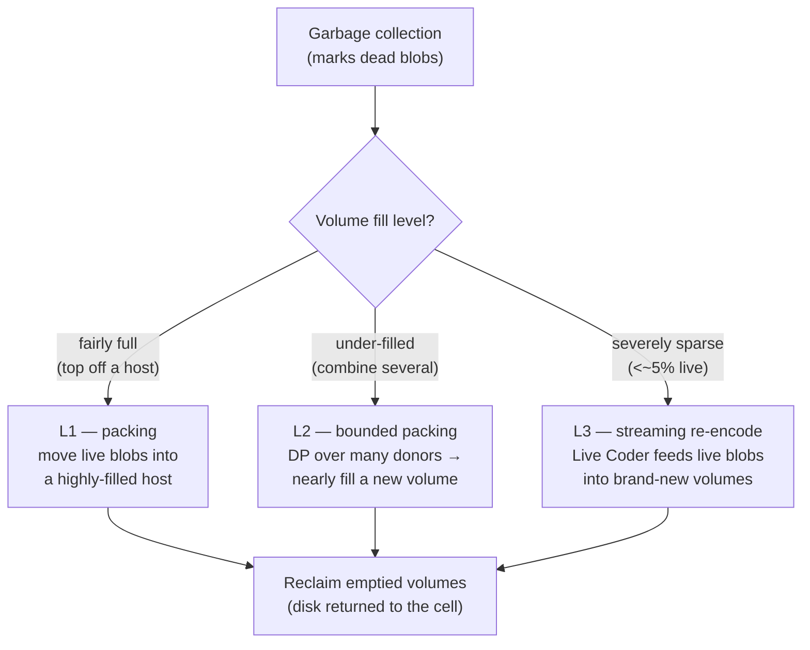

# Dropbox Magic Pocket: Reclaiming Wasted Space in an Exabyte-Scale Immutable Blob Store

> Dropbox stores its users' files in **Magic Pocket**, a custom-built,
> **exabyte-scale** blob store. It holds *trillions of blobs and processes
> millions of deletes each day*. This case study is about a deceptively boring
> problem that turns out to be worth real money at that scale: over time, deleted
> data leaves holes in the storage, disks fill up with dead bytes, and you end up
> buying hardware to hold garbage. The fix — a layered **compaction** system —
> is a lovely senior-interview lesson in *why one cleanup heuristic is never
> enough, and why the real bottleneck is often metadata, not disk.* Everything
> here is drawn from Dropbox's engineering post "Improving storage efficiency in
> Magic Pocket, our immutable blob store."

## The problem: dead data piles up in an immutable store

Start with the two ideas that make this problem exist.

First, a **blob** is just a chunk of bytes — a piece of a user's file. Magic
Pocket groups many blobs together into a **volume** (think of a volume as a large
container file on disk that holds many blobs back to back). Volumes live inside a
**cell**, which is a self-contained cluster of storage machines in one location.

Second, Magic Pocket is **immutable**: once a blob is written, *it is never
modified in place*, and once a volume is closed (filled and sealed), *it is never
reopened*. Immutability is wonderful for reliability and simplicity — you never
have to coordinate in-place edits — but it creates a specific kind of waste. When
a user deletes a file, you can't just carve that blob out of the middle of a
sealed volume. The delete leaves **dead data** behind: bytes that are logically
gone but still physically occupying disk.

So there are two separate jobs here, and interviews love to conflate them:

- **Garbage collection (GC)** *marks* which blobs are no longer referenced. It
  identifies the dead data but doesn't free the disk.
- **Compaction** does the *physical reclamation* — it actually rewrites the live
  (still-referenced) data into fresh volumes so the old, hole-riddled volumes can
  be thrown away and their disk reused.

The metric that matters is **storage overhead**: the gap between raw disk used and
actual user data stored. As Dropbox puts it, *"even modest increases in overhead
translate into meaningful infrastructure and capacity costs."* At exabyte scale, a
few percent of overhead is a data-center's worth of drives you bought to store
nothing.

> [!KEY-TAKEAWAY]
> The interview framing: in an append-only / immutable store, deletes don't free
> space — they create fragmentation. You need a background **compaction** process
> to repack live data and reclaim disk. The hard part isn't the idea; it's doing
> it efficiently across volumes with wildly different fill levels, and without
> overloading the *metadata* system that tracks where every blob lives.

## What kicked it off: a placement change that traded one problem for another

The trouble started with a win. Dropbox rolled out a new **data-placement
service** that reduced **write amplification** (write amplification = writing more
physical bytes than the logical data requires; lower is better). Good outcome —
but it had a side effect: *"fragmentation increased, pushing storage overhead
higher."* And that overhead wasn't spread evenly. It concentrated in *"a small
number of severely under-filled volumes"* — a few volumes wasting a lot of space
rather than everyone wasting a little.

How bad did under-filling get? In the worst case, *"less than five percent of
their allocated capacity contained live data."* A volume sized to hold, say, a big
chunk of disk was more than 95% dead bytes. That is the pathological case the new
system had to attack.

A note on redundancy, because interviewers ask: Magic Pocket uses **erasure
coding** for nearly all data rather than plain replication. Replication keeps
multiple full copies; erasure coding splits data into fragments plus parity so you
get the *same fault tolerance with significantly less additional storage*. (The
post doesn't publish the exact coding parameters or a replication factor — so we
won't invent them.) The relevance here: the compaction system reuses that same
erasure-coding machinery, as we'll see.

## Why the naive approach fell short: one packing heuristic (L1)

The baseline compaction strategy — call it **L1** — treats compaction as a
straightforward **packing problem**: find a volume that's already highly filled
(the *host*), then move the live blobs out of a partially-filled *donor* volume
into it, topping the host off. Once a donor is emptied of live data, its disk is
reclaimed.

L1 rests on one assumption: *most volumes are highly filled*, so you only need to
nudge a little live data around to top off hosts. When that assumption holds, L1 is
fine. When fragmentation spikes and you suddenly have many *severely* under-filled
volumes, L1 falls apart:

- Each L1 run *"may read tens of GiB"* of data to move it, yet reclaims *"fewer
  than one full volume per run."* You do a lot of I/O for less than one volume's
  worth of freed space.
- It has no good story for the sparsest volumes — the 5%-full ones — because
  there's no single highly-filled host that can absorb them cleanly.

The lesson worth saying out loud: **a single compaction heuristic can't cover the
whole range of fill levels.** A volume that's 80% full and a volume that's 5% full
are genuinely different problems and want different tactics.

## The fix: a layered compaction pipeline (L1, L2, L3)

The redesign isn't a new storage architecture — the blobs, volumes, cells, and
erasure coding stay the same. It's a **layered set of compaction strategies**, each
tuned to a different band of volume fill levels, running under safeguards so they
don't step on each other.

### L2 — pack many under-filled volumes into one

Where L1 tops off an existing full host from one donor, **L2** goes after groups of
*under-filled* volumes. It picks a combination of several donors whose live data,
added together, *"nearly fills a new destination volume,"* then packs them all into
that fresh volume at once.

The clever engineering: choosing *which* donors to combine is a **bounded packing
problem solved with dynamic programming** (DP). To keep the DP tractable at scale,
Dropbox *caps the number of source volumes* considered per run and *coarsens the
byte counts* (rounds sizes into buckets so the DP table stays small). This is a
nice, concrete example of "the textbook problem is NP-hard (bin packing), so we
bound and approximate it."

The results are the headline numbers:

- L2 *"reduced compaction overhead two to three times faster than L1"* — i.e., it
  clears the backlog 2–3× quicker.
- Cells running L2 saw overhead *"thirty to fifty percent lower compared to cells
  running L1 alone."*
- Overhead returned to sustainable levels *"within days"*, over the course of about
  *"a week."*

### L3 — stream the sparsest volumes through the Live Coder

For the *sparsest* volumes — the pathological <5%-full ones — even L2's grouping
isn't the best tool. Here Dropbox reuses an existing component, the **Live Coder**
(the service that performs on-the-fly erasure coding of incoming data), but runs it
as a **streaming pipeline**. L3 continuously feeds the remaining live blobs from
these near-empty volumes into the Live Coder, which encodes them into brand-new
volumes. Because a source volume is fully drained as its blobs stream out, it can be
*"reclaimed immediately."*

The trade-off, and it's the crux of the whole design: **L3 rewrites every blob.**
Each moved blob needs a new ID and a new **location entry** in the metadata system
(the index that maps "this blob" → "this volume, this offset"). L1 and L2 can often
keep *"many blobs under the same volume identity,"* so metadata churn is modest. But
in L3, *"most blobs need new location entries"* — a large, sustained write load on
the metadata store.

> [!WARNING]
> The bottleneck at scale wasn't disk-packing efficiency — it was **metadata
> capacity**. Dropbox calls it *"one of our biggest constraints."* L3 gives the
> best physical reclamation for sparse volumes but generates the most metadata
> writes, so it must be rate-limited. If you propose an aggressive "just re-encode
> everything" cleanup in an interview, the senior counter is: *who absorbs the
> metadata write amplification?*

## Tuning: from static thresholds to a dynamic control loop

Every strategy needs a **host eligibility threshold** — how full must a volume be
before it's allowed to act as a packing host (or, conversely, sparse enough to be a
donor). Get this knob wrong in either direction and you lose:

- **Set it too high** → too few eligible hosts → live data has nowhere to go →
  overhead creeps back up.
- **Set it too low** → the system compacts volumes that barely need it → *"wasted
  compute and I/O."*

The pathological fill distribution kept shifting, so a hand-tuned static threshold
was always stale. Dropbox replaced static tuning with a **dynamic control loop**
that adjusts eligibility as conditions change. Their stated lesson: *"manual tuning
doesn't scale"* at this size — the system has to self-adjust.

## Safeguards: keeping three strategies from fighting each other

Running L1, L2, and L3 simultaneously across an exabyte fleet is only safe with
guardrails:

- **Rate-limiting** so compaction (especially L3's metadata writes) doesn't starve
  live user traffic.
- **Locality** — keeping compaction traffic *"local to each cell,"* so a cell
  cleans itself up without cross-cell network cost.
- **Enforced eligibility boundaries** so the three strategies operate on distinct
  fill-level bands and *don't interfere* — a volume is handed to exactly one
  strategy, not tugged between them.

## Trade-offs and gotchas, gathered

- **No single heuristic wins:** L1 (top-off), L2 (group & DP-pack), and L3 (stream
  re-encode) each own a different fill-level band. The whole point is that one rule
  can't cover 80%-full and 5%-full volumes at once.
- **Metadata is the real ceiling:** physical reclamation is easy to imagine;
  updating trillions of blob location entries is the expensive part. L3's power
  comes bundled with its heaviest cost — metadata write load.
- **GC ≠ compaction:** GC marks dead data; compaction reclaims the disk. Conflating
  them is a common interview slip.
- **Bin packing is NP-hard, so bound it:** L2's DP caps source count and coarsens
  byte sizes to stay tractable — approximate on purpose.
- **Static tuning rots:** eligibility thresholds must adapt via a control loop; a
  hand-set number is wrong the moment the fill distribution shifts.
- **Immutability is the root cause and the constraint:** because volumes are never
  reopened, the *only* way to free space is to rewrite live data elsewhere — which
  is exactly what compaction does.

## Common follow-up questions

- **"Why not just delete blobs in place instead of compacting?"** Because Magic
  Pocket volumes are immutable and never reopened — you physically can't punch a
  hole in a sealed volume. The only way to reclaim space is to copy the live blobs
  into a new volume and discard the old one. That constraint buys simplicity and
  reliability but forces a background compaction process.
- **"Why three strategies instead of one good one?"** Volumes span a huge range of
  fill levels. L1 assumes volumes are mostly full and just tops off a host; it
  reads tens of GiB to reclaim under one volume when fragmentation is bad. L2 packs
  many under-filled volumes into one via DP; L3 stream-re-encodes the sparsest
  through the Live Coder. Each is efficient only in its own band.
- **"What was the actual bottleneck?"** Metadata capacity, not disk packing.
  Rewriting a blob means a new location entry; L3 rewrites *most* blobs, so it
  generates the heaviest metadata load — which is why it's rate-limited and treated
  as one of the biggest constraints.
- **"How much did the new system help?"** L2 reduced compaction overhead 2–3×
  faster than L1, drove overhead 30–50% lower than L1-only cells, and returned
  overhead to sustainable levels within days (over about a week). The worst
  under-filled volumes had held live data in under 5% of their capacity.
- **"Why a dynamic control loop instead of a tuned threshold?"** Because the fill
  distribution keeps shifting. Too-high a threshold starves hosts and overhead
  climbs; too-low wastes compute and I/O compacting volumes that don't need it. A
  static number is always stale, so the eligibility threshold is adjusted
  automatically.
- **"Where else does this pattern show up?"** Any append-only / immutable store:
  LSM-tree compaction (RocksDB, Cassandra), log-structured file systems, Kafka log
  segment cleanup, and copy-on-write systems all face the same "reclaim space by
  rewriting live data, and mind the write amplification" trade-off.

## References

- Dropbox Engineering — "Improving storage efficiency in Magic Pocket, our
  immutable blob store":
  https://dropbox.tech/infrastructure/improving-storage-efficiency-in-magic-pocket-our-immutable-blob-store
