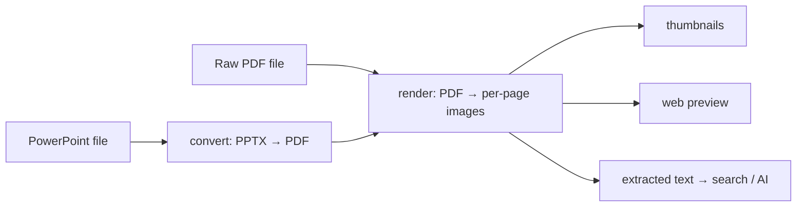
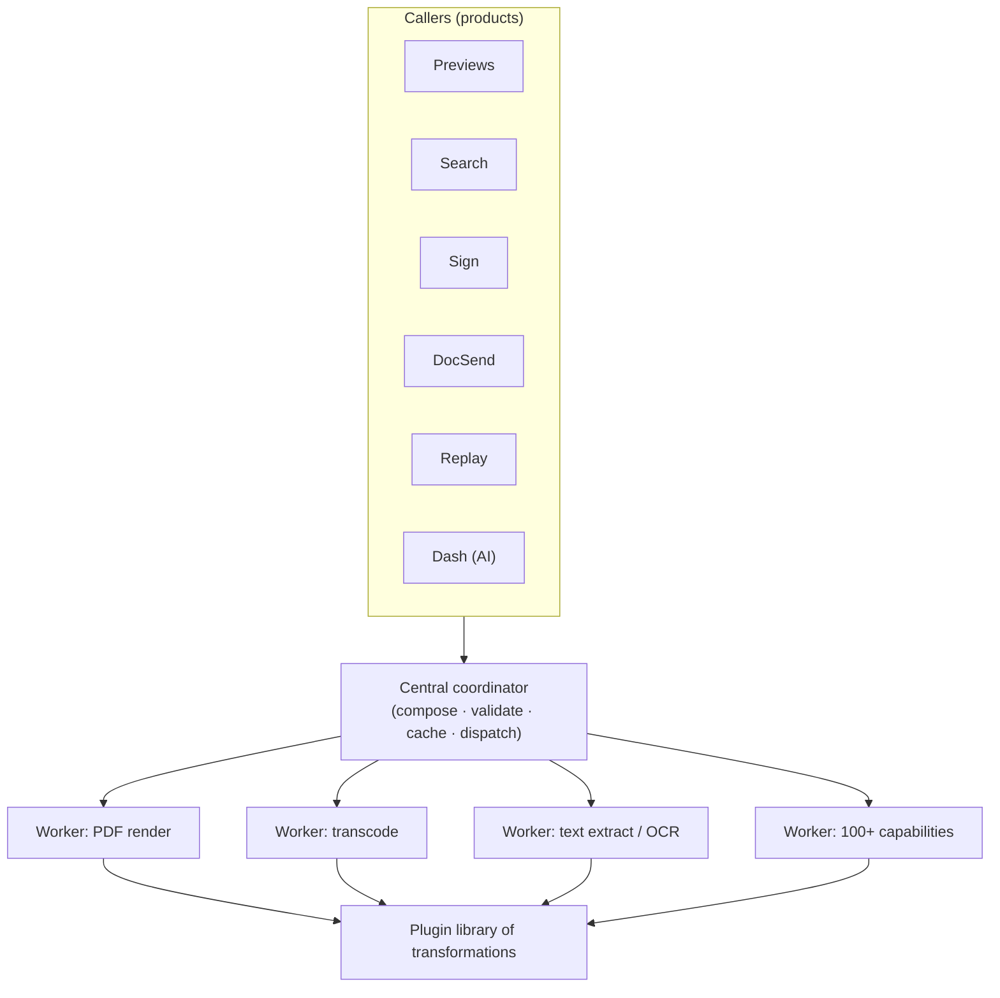

# Dropbox Riviera: One Content-Processing Platform for Previews, Search, and AI

> Every Dropbox product needs to *do something* to your files: show a thumbnail,
> render a preview, flatten a signed agreement to PDF, transcode a video for
> streaming, extract text so search can find it, OCR a scanned page so an AI can
> answer questions about it. That is a huge amount of format-wrangling — and it is
> almost identical work no matter which product asks for it. **Riviera** is
> Dropbox's shared platform that does all of it in one place. This is a clean,
> senior-interview lesson in a pattern that recurs everywhere: *when many products
> need the same messy transformation work, do you build it once as a reusable
> platform, or once per product?* Everything here is drawn from Dropbox's
> engineering post "How our universal content-processing platform Riviera evolved
> for AI and beyond" (July 20, 2026, by Andrew Cheung and Binoy Dash).

## The problem: the same file-wrangling work, demanded by every product

Start with the intuition. A file is not useful to a product in its raw form. To
*show* a PowerPoint deck on the web you need page images. To let someone *search*
a Word document you need its extracted text. To *stream* an uploaded video you
need it transcoded into a streamable format. To let an *AI* answer a question
about a scanned contract you need the pages OCR'd (optical character recognition —
turning an image of text into machine-readable text) and the text pulled out.

Two facts make this hard at Dropbox scale. First, the sheer variety: Riviera
supports **"more than 300 file formats,"** and each format can produce several
different outputs — thumbnails, previews, extracted text, streaming manifests,
metadata. Second, the same underlying step shows up over and over. PDF-handling
logic is needed by PowerPoint *and* Word *and* raw PDFs; page-rendering is needed
by previews *and* search indexing. The work isn't just large — it is enormously
*repetitive across products*.

> [!KEY-TAKEAWAY]
> The interview framing: "Many teams need the same expensive, fiddly
> transformation work over slightly different inputs. How do you serve all of them
> without each team reimplementing — and re-maintaining — the same logic?"
> Riviera's answer is to treat content transformation as a **shared platform**,
> decomposed into small reusable steps, extended by **plugins**, and coordinated
> by a central layer separate from the workers that do the work.

## Why the naive approach broke: a separate service per format-and-output

The obvious first design is one service per job: a "PowerPoint previews service,"
a "Word previews service," a "PDF previews service," a "video transcoding
service," and so on. It feels tidy — each team owns its thing.

It breaks for reasons that are worth saying out loud, because interviewers love
them:

- **Duplicated logic.** PDF rendering is needed by the PowerPoint path, the Word
  path, *and* the PDF path. Build a service per format and you reimplement the
  same PDF step three times.
- **Drift.** Dropbox names this specifically: with logic copied across services,
  *"configurations would drift, package versions would skew."* Three copies of
  the "same" PDF logic slowly stop behaving the same, and bugs appear in one but
  not the others.
- **Operational burden.** Every duplicated service is another thing to deploy,
  monitor, patch, and page someone about at 3 a.m. The maintenance cost grows
  with the number of format×output combinations, which is enormous.

The lesson: **when the same capability is needed by many callers, duplicating it
per caller doesn't scale — the cost isn't the code, it's keeping N copies
consistent forever.**

## The key insight: decompose previews into small reusable transformations

Riviera's core idea is to stop thinking "PowerPoint preview" as one monolithic job
and instead break it into a **chain of small, reusable transformations**. The
post's example: a PowerPoint preview is really PowerPoint → PDF → per-page images.
And those "PDF → images" steps are *the exact same steps* used to preview a raw
PDF and to feed other workflows.

Once each capability is a small reusable step, adding a new format is mostly a
matter of *composing existing steps* plus filling in whatever new step is genuinely
new. Dropbox reports **"more than 100 such capabilities"** in the platform.

The picture shows the payoff: the "PDF → images" capability (`C2`) is written once
and reused by the PowerPoint path, the PDF path, and downstream consumers like
search and AI. New workflows plug into existing steps instead of re-deriving them.

## The architecture: a central coordinator over single-purpose workers

Riviera separates **coordination** from **execution** — a distinction that keeps
the core stable while capabilities multiply.

- **Central coordinator.** This layer collects incoming requests, composes the
  work (figures out which chain of transformations is needed), dispatches it to
  the right backend workers, **validates requests**, and **caches responses**. The
  post is explicit that caching exists to protect workers *"from duplicate or
  invalid work"* — if two callers ask for the same 160×160 thumbnail, it is
  generated once and served from cache, not recomputed.
- **Backend workers.** Each worker belongs to **one transformation type**. That
  one-capability-per-worker rule gives *"one point of maintenance and scaling per
  capability"* — you can scale the PDF-rendering workers independently of the
  video-transcoding workers, and there's exactly one place to patch the PDF logic.
- **Plugin model.** New formats and transformations are added as **plugins**,
  *not* by modifying core infrastructure. The plugins collectively became
  *"Riviera's shared library of transformations."* This is what lets Dropbox add
  capabilities without destabilizing the coordinator.

The separation is the whole trick: coordination logic (routing, caching,
validation) stays stable and shared, while the *number* of capabilities behind it
grows via plugins and single-purpose workers.

## Concrete numbers from the post

The post is heavier on architecture than on hard performance metrics, so here is
exactly what it does and does not quote.

- **~a decade** in operation.
- **more than 300 file formats** supported.
- **more than 100 capabilities** (transformation types).
- **hundreds of thousands of transformations every second.**
- Daily output *"equivalent to 8 years of video"* worth of processed content.
- Concrete reuse example: a single shared **160×160 thumbnail** generated once and
  reused (e.g., by ML consumers) rather than regenerated per caller.

> [!WARNING]
> The post does **not** give QPS-vs-latency curves, node/host counts, cache
> hit-rate percentages, GPU counts, or embedding/ML-inference internals. It
> mentions AI workloads at the *content-preparation* layer (text extraction, OCR,
> normalization) but does not describe model serving. Don't invent those numbers
> in an interview — cite the ones above and say the rest wasn't published.

## How it evolved for AI (and why that was almost free)

Riviera started life as an internal **previews** service run by a dedicated
Previews team. Adoption then spread: to **Search** (document indexing), then
**Sign** (flattening signed agreements to PDF), **DocSend**, and **Replay** (video
transcoding). Each new consumer reused the same transformation library.

Then **Dash** — Dropbox's AI product — arrived with what *looks* like a brand-new
set of demands. But the post's sharpest insight is that these are *"content
transformation problems," not "AI problems."* Before a model can answer a question
about your files, the documents must be text-extracted, scanned pages OCR'd,
metadata pulled, and everything normalized across formats. Dash ingests from many
sources (Dropbox, Google Drive, Slack, and others), Riviera prepares the files for
indexing, and the transformed content later serves as **model context** (the text
fed to the model at query time).

Because this is the *same* transformation work previews and search already needed,
the improvements compounded in both directions: better text extraction improved
*both* AI answers and search accuracy, and new file-type support *"only had to be
added once"* to benefit everyone. Features that *"might once have taken months
shipped in weeks."* Riviera's capabilities are now also exposed externally via a
**public API** and **MCP (Model Context Protocol) tools** — a standard way to
expose tools to AI agents.

> [!INTERVIEW]
> The reusable soundbite: *"Dash's 'AI' requirements were mostly old content-
> transformation requirements in disguise — OCR, text extraction, normalization.
> Because Riviera had already made those first-class, reusable capabilities, the
> AI product mostly composed existing steps instead of building new
> infrastructure."* That reframing — *recognizing a 'new' problem as an instance of
> a solved one* — is exactly the platform-thinking senior interviewers probe for.

## Trade-offs, gotchas, and the platform lesson

- **Platform vs. feature.** Dropbox's stated philosophy: *"a platform becomes more
  valuable every time another team builds on it,"* whereas a feature delivers value
  once. The upfront cost of decomposition and a coordinator layer is paid back by
  every new consumer that composes existing steps.
- **Boundaries matter.** Keeping *"clear boundaries around what belongs in
  Riviera"* is what stopped it from sprawling into a catch-all. A shared platform
  without a crisp definition of "what belongs here" rots into a dumping ground.
- **Coordinator is a shared dependency (the flip side).** Separating coordination
  from execution keeps workers simple, but the coordinator now sits on the critical
  path of every product — its validation and caching are load-bearing, and its
  availability is everyone's availability. (The post frames the upside; the shared-
  dependency risk is the standard trade-off to name in an interview.)
- **Caching protects the workers.** Response caching isn't just latency polish here
  — the post frames it as protection against *"duplicate or invalid work,"* i.e.,
  admission control that keeps expensive workers from being flooded by repeated or
  malformed requests.
- **Scale without maintenance cost.** The plugin + single-purpose-worker model lets
  engineers add formats without touching core infrastructure, and scale each
  capability independently — the whole reason a decade of format growth didn't
  collapse under operational burden.

## Common follow-up questions

- **"Why one shared platform instead of a service per file format?"** Because the
  underlying steps (PDF rendering, page imaging, text extraction) are shared across
  formats. Per-format services duplicate that logic, and then configurations drift
  and package versions skew, so the copies diverge and each needs separate
  operation. One platform means one place to fix the PDF step and one place to
  scale it.
- **"What does the central coordinator actually do?"** It collects requests,
  composes the needed chain of transformations, validates them, caches responses,
  and dispatches to single-purpose workers. Caching and validation exist to shield
  workers from duplicate or invalid work.
- **"How are new formats added without destabilizing the system?"** As plugins
  against the shared transformation library, plus single-purpose workers — not by
  editing the coordinator. Core coordination stays stable while capability count
  grows past 100.
- **"Why did serving AI turn out to be cheap for Riviera?"** Because AI's needs —
  OCR, text extraction, metadata, normalization — are content-transformation
  problems Riviera had already solved for previews and search. Improving one path
  (e.g., text extraction) improved AI *and* search at once, and new file types only
  had to be added once.
- **"Where's the risk in this design?"** The coordinator becomes a shared
  dependency on every product's critical path, so its availability and correctness
  are everyone's. And a shared platform needs firm boundaries, or it accretes
  unrelated responsibilities and loses focus.
- **"Where else does this pattern show up?"** Any org with expensive, repeated
  work behind many products: a shared media-transcoding pipeline, a company-wide
  feature store for ML, a document-ingestion service feeding both search and RAG.
  Same move — decompose into reusable steps, coordinate centrally, extend by
  plugins.

## References

- Dropbox Engineering — "How our universal content-processing platform Riviera
  evolved for AI and beyond" (Andrew Cheung & Binoy Dash, July 20, 2026):
  https://dropbox.tech/infrastructure/how-our-universal-content-processing-platform-riviera-evolved-for-ai-and-beyond
